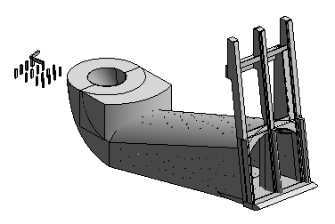
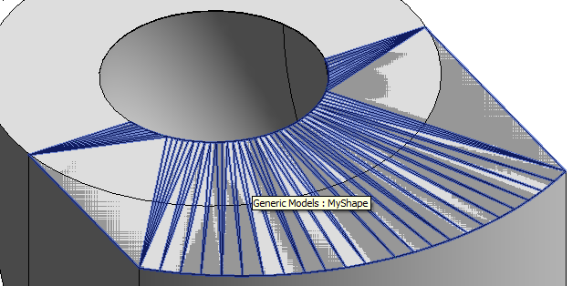

<head>
<meta http-equiv="Content-Type" content="text/html; charset=utf-8">
<link rel="stylesheet" type="text/css" href="bc.css">

<!---

-->
</head>

<!---

#revitapi #3dwebcoder #bim #aec #adskdevnetwrk #dotnet #csharp #geometry
#adsk #fsharp #dynamobim
#restapi #python
#grevit
#responsivedesign #typepad
#ah8 #augi #au2015 #dotnet #dynamobim
#stingray #adsklabs #cloud #rendering
#3dweb #3dviewapi #html5 #threejs #webgl #3d #apis #mobile #vr #ecommerce
#Markdown #Fusion360 #Fusion360Hackathon #revitapi #adsk #3dwebcoder #aec #bim

Revit API, Jeremy Tammik, akn_include

The creation of a DirectShape element on an interactively selected existing element face requires a transformation to be applied to the face of a family instance returned by the PickObject method to convert it from the family symbol space to the family instance real world coordinates
&ndash; Creating DirectShape from face mesh
&ndash; Determining real world transform of a family instance face returned by PickObject
&ndash; Iterating over element geometry to find a specific target geometry object
&ndash; Reusing sketch planes for model curve creation...

-->

### DirectShape From Face and Sketch Plane Reuse

Frode Tørresdal of [Norconsult Informasjonssystemer AS](https://www.nois.no) just raised an interesting issue regarding the creation of a DirectShape element on an interactively selected existing element face.

As it turned out, his specific issue was not related to the DirectShape creation at all, but rather to the transformation that needs to be applied to the face of a family instance returned by the PickObject method to convert it from the family symbol space to the family instance real world coordinates.

Here is our discussion of the problem and the evolution of my
[DirectShapeFromFace](https://github.com/jeremytammik/DirectShapeFromFace) solution that I implemented to address this.

It ends up demonstrating several interesting aspects:

- [Creating a DirectShape element from a face mesh](#2)
- [Determining the real world transform of a family instance face returned by PickObject](#3)
- [Iterating over element geometry to find a specific target geometry object](#4)
- [Reusing sketch planes for model curve creation](#5)
- [Complete solution](#6)
- [Download](#7)

#### Creating a DirectShape Element from a Face Mesh

**Question:**
I have some issues when creating DirectShape elements in Revit. I attached a sample project and a Revit model:

The sample project creates a DirectShape from a selected face.

Here is the code:

<pre class="code">
&nbsp; public static void Execute1(
&nbsp; &nbsp; ExternalCommandData commandData )
&nbsp; {
&nbsp; &nbsp; Transaction trans = null;
&nbsp;
&nbsp; &nbsp; UIDocument uidoc = commandData.Application
&nbsp; &nbsp; &nbsp; .ActiveUIDocument;
&nbsp;
&nbsp; &nbsp; Document doc = uidoc.Document;
&nbsp;
&nbsp; &nbsp; try
&nbsp; &nbsp; {
&nbsp; &nbsp; &nbsp; Selection choices = uidoc.Selection;
&nbsp;
&nbsp; &nbsp; &nbsp; Reference reference = choices.PickObject(
&nbsp; &nbsp; &nbsp; &nbsp; ObjectType.Face );
&nbsp;
&nbsp; &nbsp; &nbsp; Element el = doc.GetElement(
&nbsp; &nbsp; &nbsp; &nbsp; reference.ElementId );
&nbsp;
&nbsp; &nbsp; &nbsp; trans = new Transaction( doc, &quot;Create elements&quot; );
&nbsp; &nbsp; &nbsp; trans.Start();
&nbsp;
&nbsp; &nbsp; &nbsp; TessellatedShapeBuilder builder
&nbsp; &nbsp; &nbsp; &nbsp; = new TessellatedShapeBuilder();
&nbsp;
&nbsp; &nbsp; &nbsp; builder.OpenConnectedFaceSet( false );
&nbsp;
&nbsp; &nbsp; &nbsp; Face face = el.GetGeometryObjectFromReference(
&nbsp; &nbsp; &nbsp; &nbsp; reference ) as Face;
&nbsp;
&nbsp; &nbsp; &nbsp; Mesh mesh = face.Triangulate();
&nbsp; &nbsp; &nbsp; List&lt;XYZ&gt; args = new List&lt;XYZ&gt;( 3 );
&nbsp;
&nbsp; &nbsp; &nbsp; XYZ offset = new XYZ();
&nbsp; &nbsp; &nbsp; if( el.Location is LocationPoint )
&nbsp; &nbsp; &nbsp; {
&nbsp; &nbsp; &nbsp; &nbsp; LocationPoint locationPoint = el.Location
&nbsp; &nbsp; &nbsp; &nbsp; &nbsp; as LocationPoint;
&nbsp; &nbsp; &nbsp; &nbsp; offset = locationPoint.Point;
&nbsp; &nbsp; &nbsp; }
&nbsp;
&nbsp; &nbsp; &nbsp; for( int i = 0; i &lt; mesh.NumTriangles; i++ )
&nbsp; &nbsp; &nbsp; {
&nbsp; &nbsp; &nbsp; &nbsp; MeshTriangle triangle = mesh.get_Triangle(
&nbsp; &nbsp; &nbsp; &nbsp; &nbsp; i );
&nbsp;
&nbsp; &nbsp; &nbsp; &nbsp; XYZ p1 = triangle.get_Vertex( 0 );
&nbsp; &nbsp; &nbsp; &nbsp; XYZ p2 = triangle.get_Vertex( 1 );
&nbsp; &nbsp; &nbsp; &nbsp; XYZ p3 = triangle.get_Vertex( 2 );
&nbsp;
&nbsp; &nbsp; &nbsp; &nbsp; p1 = p1.Add( offset );
&nbsp; &nbsp; &nbsp; &nbsp; p2 = p2.Add( offset );
&nbsp; &nbsp; &nbsp; &nbsp; p3 = p3.Add( offset );
&nbsp;
&nbsp; &nbsp; &nbsp; &nbsp; args.Clear();
&nbsp; &nbsp; &nbsp; &nbsp; args.Add( p1 );
&nbsp; &nbsp; &nbsp; &nbsp; args.Add( p2 );
&nbsp; &nbsp; &nbsp; &nbsp; args.Add( p3 );
&nbsp; &nbsp; &nbsp; &nbsp; TessellatedFace tesseFace
&nbsp; &nbsp; &nbsp; &nbsp; &nbsp; = new TessellatedFace( args,
&nbsp; &nbsp; &nbsp; &nbsp; &nbsp; &nbsp; ElementId.InvalidElementId );
&nbsp;
&nbsp; &nbsp; &nbsp; &nbsp; if( builder.DoesFaceHaveEnoughLoopsAndVertices(
&nbsp; &nbsp; &nbsp; &nbsp; &nbsp; tesseFace ) )
&nbsp; &nbsp; &nbsp; &nbsp; {
&nbsp; &nbsp; &nbsp; &nbsp; &nbsp; builder.AddFace( tesseFace );
&nbsp; &nbsp; &nbsp; &nbsp; }
&nbsp; &nbsp; &nbsp; }
&nbsp;
&nbsp; &nbsp; &nbsp; builder.CloseConnectedFaceSet();
&nbsp;
&nbsp; &nbsp; &nbsp; TessellatedShapeBuilderResult result
&nbsp; &nbsp; &nbsp; &nbsp; = builder.Build(
&nbsp; &nbsp; &nbsp; &nbsp; &nbsp; TessellatedShapeBuilderTarget.AnyGeometry,
&nbsp; &nbsp; &nbsp; &nbsp; &nbsp; TessellatedShapeBuilderFallback.Mesh,
&nbsp; &nbsp; &nbsp; &nbsp; &nbsp; ElementId.InvalidElementId );
&nbsp;
&nbsp; &nbsp; &nbsp; ElementId categoryId = new ElementId(
&nbsp; &nbsp; &nbsp; &nbsp; BuiltInCategory.OST_GenericModel );
&nbsp;
&nbsp; &nbsp; &nbsp; DirectShape ds = DirectShape.CreateElement(
&nbsp; &nbsp; &nbsp; &nbsp; doc, categoryId,
&nbsp; &nbsp; &nbsp; &nbsp; Assembly.GetExecutingAssembly().GetType()
&nbsp; &nbsp; &nbsp; &nbsp; .GUID.ToString(), Guid.NewGuid().ToString() );
&nbsp;
&nbsp; &nbsp; &nbsp; ds.SetShape( result.GetGeometricalObjects() );
&nbsp;
&nbsp; &nbsp; &nbsp; ds.Name = &quot;MyShape&quot;;
&nbsp;
&nbsp; &nbsp; &nbsp; trans.Commit();
&nbsp; &nbsp; }
&nbsp; &nbsp; catch( Exception ex )
&nbsp; &nbsp; {
&nbsp; &nbsp; &nbsp; if( trans != null )
&nbsp; &nbsp; &nbsp; &nbsp; trans.RollBack();
&nbsp;
&nbsp; &nbsp; &nbsp; Debug.Print( ex.Message );
&nbsp; &nbsp; }
&nbsp; }
</pre>

The code works fine on the columns. I managed this by calculating an offset from the LocationPoint. But this unfortunately affects the big Generic Model. This Generic Model element has been moved and when I run the code on this object, the DirectShape is created in the wrong location. If I remove the lines that get the offset from the location point this works fine on the generic model, but not on the columns. How do I know when to use the offset? Is there a way to write code that works on both cases?

Also in this model there are two columns. The code works fine on one of them, but not the other. Why is that?

I really hope you can help me with this!

#### Determining the Real World Transform of a Family Instance Face returned by PickObject

**Answer:**
Thank you for your interesting query and sample material.

I compiled the add-in and can reproduce the behaviour you describe.

It looks to me as if you are not taking the translation of the selected element properly into account.

Just like you, I would have expected the GetGeometryObjectFromReference method to do that automatically for me.

Maybe it will work better and work for all types of elements if you use a different approach to retrieve the geometry.

For family instances, there is a difference between symbol geometry and the translated family instance geometry.

I have made good experiences using the GeometryElement.GetTransformed method and passing in an identity transform to retrieve element geometry in its real world location.

You can possibly use the geometry reference returned by the pick operation to select the same face from the element geometry with the option ComputeReferences turned on.

Another, more pertinent question:

Are you sure this is an issue with the DirectShape?

I would have thought that it is more an issue of the geometry retrieval, and has nothing to do with the DirectShape creation.

Therefore, I would suggest the following test of the intermediate results:

1. Retrieve the three MeshTriangle vertices.
2. Create a plane containing all three, and a sketch plane. For efficiency, we can cache and reuse already existing sketch planes.
3. Draw three model lines representing the mesh triangle.

Then you can see exactly what geometry is being returned.

I cleaned up your sample a little bit to test that myself.

I created the [DirectShapeFromFace GitHub repository](https://github.com/jeremytammik/DirectShapeFromFace) for it to keep track of my modifications.

You might want to take a look at that in its current state, and maybe synchronise your sample with mine.

I have not finished yet, though, and am still working on it.

I am sure we will find a perfect resolution for this.

**Update:**
I updated my sample code to create model lines displaying the original triangles obtained from the element geometry via the GetGeometryObjectFromReference method.

Look at the new [release 2016.0.0.1](https://github.com/jeremytammik/DirectShapeFromFace/releases/tag/2016.0.0.1).

I can confirm that the mesh triangles are located in a different place than the original element.

There is certainly a really simple solution to this.

In any case, the problem has nothing to do with the DirectShape creation, just with the geometry retrieval.

I have seen and handled similar issues in the past, when traversing element geometry for various export processes.

In those cases, I was using geometry retrieved from the `Element.get_Geometry` property instead of the `GetGeometryObjectFromReference` method.

I therefore know how this issue can be handled.

I would still like to learn what the optimal, simplest and most efficient approach really is.

The Revit API often moves in mysterious ways...

**Question simplified:**
The following geometry retrieval returns a face in a different project location that the original selected element:

<pre class="code">
&nbsp; Selection choices = uidoc.Selection;
&nbsp;
&nbsp; Reference reference = choices.PickObject(
&nbsp; &nbsp; ObjectType.Face );
&nbsp;
&nbsp; Element el = doc.GetElement(
&nbsp; &nbsp; reference.ElementId );
&nbsp;
&nbsp; Face face = el.GetGeometryObjectFromReference(
&nbsp; &nbsp; reference ) as Face;
</pre>

What is the proper and efficient way to obtain the face in the same location as the original selected element?

The face obtained as shown above is in an unexpected location, often far away from the selected element.

Apparently, the problem is that `PickObject` returns a reference to a face, and that face may be in the symbol geometry, not the instance geometry.

How can I find the correct transformation to the instance geometry location?

I tried applying `FamilyInstance.GetTransform` to it, to no avail.

I also tried iterating through all the (possibly nested) element geometry instances to calculate the appropriate transform, but I cannot find any way to identify the face returned by PickObject.

Both the equality operator `==` and a comparison using the `Face.Reference` property always return false for all the faces that I find.

Very mystifying.

**Answer:**
It is possible that some families (and their representative geometry) are nested several levels deep, and you need all the transforms.

You should be able to compare references by the strings returned by the `ConvertToStableRepresentation` method.

It would be a nice enhancement to make `Reference.Equals` work in this manner.  Unfortunately, it does not currently do so.

**Response:**
That really sounds quite bad.

`FamilyInstance.GetTransform` works for some family instances and not for others.

I would love that to work, then the problem would be almost resolved.

Otherwise I have to resort to determining the transform myself.

When a user calls `PickObject( ObjectType.Face )`, nothing is known except the resulting element id and reference to the face.

Are you really telling me that at this point I have to:

1. Check whether the element happens to be a family instance.
2. If so, determine the selected face's ConvertToStableRepresentation string, iterate through all the geometry, possibly through several levels of nested family instances, keep track of all the transforms, find and identify the picked face by checking and comparing the ConvertToStableRepresentation string, use the result of that to decide at which point I need to stop traversing the geometry, exit the traversal when the target is found, put together the list of nested transforms in the proper manner, and finally apply the resulting total transform to the selected face?

I think that should be packaged and provided by the API.

Could you provide example code that implements this in the correct manner?

I have tried to achieve this and not succeeded so far, e.g., like this:

<pre class="code">
/// &lt;summary&gt;
/// Determine the stack of transforms to apply to
/// the given target geometry object to bring it
/// to the proper location in the project coordinates.
/// Unfortunetely, we have not found any way at all
/// yet to identify the target object we are after.
/// &lt;/summary&gt;
static bool GetTransformStackForObject(
&nbsp; Stack&lt;Transform&gt; tstack,
&nbsp; GeometryElement geo,
&nbsp; GeometryObject targetObj,
&nbsp; Reference targetRef )
{
&nbsp; foreach( GeometryObject obj in geo )
&nbsp; {
&nbsp; &nbsp; if( obj == targetObj )
&nbsp; &nbsp; {
&nbsp; &nbsp; &nbsp; return true;
&nbsp; &nbsp; }
&nbsp;
&nbsp; &nbsp; GeometryInstance gi = obj as GeometryInstance;
&nbsp;
&nbsp; &nbsp; if( null != gi )
&nbsp; &nbsp; {
&nbsp; &nbsp; &nbsp; tstack.Push( gi.Transform );
&nbsp; &nbsp; &nbsp; return GetTransformStackForObject( tstack,
&nbsp; &nbsp; &nbsp; &nbsp; gi.GetInstanceGeometry(), targetObj, targetRef );
&nbsp; &nbsp; }
&nbsp;
&nbsp; &nbsp; Solid solid = obj as Solid;
&nbsp; &nbsp; if( null != solid )
&nbsp; &nbsp; {
&nbsp; &nbsp; &nbsp; if( 0 &lt; solid.Faces.Size )
&nbsp; &nbsp; &nbsp; {
&nbsp; &nbsp; &nbsp; &nbsp; foreach( Face face in solid.Faces )
&nbsp; &nbsp; &nbsp; &nbsp; {
&nbsp; &nbsp; &nbsp; &nbsp; &nbsp; if( face == targetObj )
&nbsp; &nbsp; &nbsp; &nbsp; &nbsp; {
&nbsp; &nbsp; &nbsp; &nbsp; &nbsp; &nbsp; return true;
&nbsp; &nbsp; &nbsp; &nbsp; &nbsp; }
&nbsp; &nbsp; &nbsp; &nbsp; &nbsp; if( face.Reference == targetRef )
&nbsp; &nbsp; &nbsp; &nbsp; &nbsp; {
&nbsp; &nbsp; &nbsp; &nbsp; &nbsp; &nbsp; return true;
&nbsp; &nbsp; &nbsp; &nbsp; &nbsp; }
&nbsp; &nbsp; &nbsp; &nbsp; }
&nbsp; &nbsp; &nbsp; }
&nbsp; &nbsp; &nbsp; if( 0 &lt; solid.Edges.Size )
&nbsp; &nbsp; &nbsp; {
&nbsp; &nbsp; &nbsp; &nbsp; foreach( Edge edge in solid.Edges )
&nbsp; &nbsp; &nbsp; &nbsp; {
&nbsp; &nbsp; &nbsp; &nbsp; &nbsp; if( edge == targetObj )
&nbsp; &nbsp; &nbsp; &nbsp; &nbsp; {
&nbsp; &nbsp; &nbsp; &nbsp; &nbsp; &nbsp; return true;
&nbsp; &nbsp; &nbsp; &nbsp; &nbsp; }
&nbsp; &nbsp; &nbsp; &nbsp; &nbsp; if( edge.Reference == targetRef )
&nbsp; &nbsp; &nbsp; &nbsp; &nbsp; {
&nbsp; &nbsp; &nbsp; &nbsp; &nbsp; &nbsp; return true;
&nbsp; &nbsp; &nbsp; &nbsp; &nbsp; }
&nbsp; &nbsp; &nbsp; &nbsp; }
&nbsp; &nbsp; &nbsp; }
&nbsp; &nbsp; }
&nbsp; }
&nbsp; return false;
}
</pre>

This code never found the target.

Maybe it will if I use `ConvertToStableRepresentation`.

Still, I would appreciate further input and confirmation before I continue in these struggles.

I think 'PickObject( ObjectType.Face )' is pretty hard to use out of the box if it requires all these additional calculations...

**Response 2:**
After further testing, I still cannot identify the picked face within the element geometry in the manner suggested.

Here are the relevant code snippets:

<pre class="code">
&nbsp; Selection choices = uidoc.Selection;
&nbsp;
&nbsp; Reference faceref = choices.PickObject(
&nbsp; &nbsp; ObjectType.Face );
&nbsp;
&nbsp; string rep = faceref
&nbsp; &nbsp; .ConvertToStableRepresentation( doc );
&nbsp;
&nbsp; Debug.Print( &quot;Face reference picked: &quot;
&nbsp; &nbsp; + rep );
&nbsp;
&nbsp; Element el = doc.GetElement(
&nbsp; &nbsp; faceref.ElementId );

...

&nbsp; Transform t = null;
&nbsp;
&nbsp; Options opt = new Options();
&nbsp; opt.ComputeReferences = true;
&nbsp; GeometryElement geo = el.get_Geometry( opt );
&nbsp; Stack&lt;Transform&gt; tstack = new Stack&lt;Transform&gt;();
&nbsp;
&nbsp; if( GetTransformStackForObject( tstack, geo, doc, rep )
&nbsp; &nbsp; &amp;&amp; 0 &lt; tstack.Count )
&nbsp; {
&nbsp; &nbsp; t = Transform.Identity;
&nbsp;
&nbsp; &nbsp; while( 0 &lt; tstack.Count )
&nbsp; &nbsp; {
&nbsp; &nbsp; &nbsp; t *= tstack.Pop();
&nbsp; &nbsp; }
&nbsp; }

...

/// &lt;summary&gt;
/// Determine the stack of transforms to apply to
/// the given target geometry object to bring it
/// to the proper location in the project coordinates.
/// Unfortunetely, we have not found any way at all
/// yet to identify the target object we are after.
/// &lt;/summary&gt;
static bool GetTransformStackForObject(
&nbsp; Stack&lt;Transform&gt; tstack,
&nbsp; GeometryElement geo,
&nbsp; Document doc,
&nbsp; string stable_representation )
{
&nbsp; foreach( GeometryObject obj in geo )
&nbsp; {
&nbsp; &nbsp; GeometryInstance gi = obj as GeometryInstance;
&nbsp;
&nbsp; &nbsp; if( null != gi )
&nbsp; &nbsp; {
&nbsp; &nbsp; &nbsp; tstack.Push( gi.Transform );
&nbsp;
&nbsp; &nbsp; &nbsp; return GetTransformStackForObject( tstack,
&nbsp; &nbsp; &nbsp; &nbsp; gi.GetInstanceGeometry(), doc,
&nbsp; &nbsp; &nbsp; &nbsp; stable_representation );
&nbsp; &nbsp; }
&nbsp;
&nbsp; &nbsp; Solid solid = obj as Solid;
&nbsp;
&nbsp; &nbsp; if( null != solid )
&nbsp; &nbsp; {
&nbsp; &nbsp; &nbsp; string rep;
&nbsp;
&nbsp; &nbsp; &nbsp; if( 0 &lt; solid.Faces.Size )
&nbsp; &nbsp; &nbsp; {
&nbsp; &nbsp; &nbsp; &nbsp; foreach( Face face in solid.Faces )
&nbsp; &nbsp; &nbsp; &nbsp; {
&nbsp; &nbsp; &nbsp; &nbsp; &nbsp; rep = face.Reference
&nbsp; &nbsp; &nbsp; &nbsp; &nbsp; &nbsp; .ConvertToStableRepresentation( doc );
&nbsp;
&nbsp; &nbsp; &nbsp; &nbsp; &nbsp; if( rep.Equals( stable_representation ) )
&nbsp; &nbsp; &nbsp; &nbsp; &nbsp; {
&nbsp; &nbsp; &nbsp; &nbsp; &nbsp; &nbsp; return true;
&nbsp; &nbsp; &nbsp; &nbsp; &nbsp; }
&nbsp; &nbsp; &nbsp; &nbsp; }
&nbsp; &nbsp; &nbsp; }
&nbsp; &nbsp; &nbsp; if( 0 &lt; solid.Edges.Size )
&nbsp; &nbsp; &nbsp; {
&nbsp; &nbsp; &nbsp; &nbsp; foreach( Edge edge in solid.Edges )
&nbsp; &nbsp; &nbsp; &nbsp; {
&nbsp; &nbsp; &nbsp; &nbsp; &nbsp; rep = edge.Reference
&nbsp; &nbsp; &nbsp; &nbsp; &nbsp; &nbsp; .ConvertToStableRepresentation( doc );
&nbsp;
&nbsp; &nbsp; &nbsp; &nbsp; &nbsp; if( rep.Equals( stable_representation ) )
&nbsp; &nbsp; &nbsp; &nbsp; &nbsp; {
&nbsp; &nbsp; &nbsp; &nbsp; &nbsp; &nbsp; return true;
&nbsp; &nbsp; &nbsp; &nbsp; &nbsp; }
&nbsp; &nbsp; &nbsp; &nbsp; }
&nbsp; &nbsp; &nbsp; }
&nbsp; &nbsp; }
&nbsp; }
&nbsp; return false;
}
</pre>

I tested this with a structural concrete rectangular column.

All the faces were visited, and none of them returned a `ConvertToStableRepresentation` string that matched the picked face's one.

#### Iterating over Element Geometry to Find a Specific Target Geometry Object

**Answer:**
Short answer:

`GetInstanceGeometry` is incorrect in extracting usable references &ndash; you must call `GetSymbolGeometry` with no arguments instead.

This should result in comparable stable references.

More details of instance transforms etc. are available in Scott Conover's AU courses and have been rolled into material that is in the Developer’s Guide in the Revit online help.

**Response:**
Thank you!

That helped.

It seems to be working now, in [DirectShapeFromFace release 2016.0.0.5](https://github.com/jeremytammik/DirectShapeFromFace/releases/tag/2016.0.0.5):

I am surprised it is so hard.

The sequence of prior attempts and tests is described by the preceding [release messages](https://github.com/jeremytammik/DirectShapeFromFace/releases).

It still needs to be tested with more samples, especially with faces nested several levels deep within nested families.

#### Reusing Sketch Planes for Model Curve Creation

One final cool implementation details to note:

For testing purposes, I create model lines representing the original face mesh triangles as well the final direct shape.

The model lines require a sketch plane to host them.

To avoid recreating hundreds and thousands of identical sketch planes for this purpose, I try to reuse the existing ones as much as possible.

In tried to limit the reuse to my own sketch planes and mark them by specifying their element name, but that does not work.

The always end up named "&lt;not associated&gt;".

So I modified my reusage algorithm to reuse only such sketch planes, and it seems to work fine, cf. the `SketchPlaneMatches` and `GetSketchPlane` methods below.

#### Complete Solution

To wrap up, here is the complete code implementing this:

<pre class="code">
class CreateDirectShape
{
&nbsp; const string _sketch_plane_name_prefix
&nbsp; &nbsp; = &quot;The Building Coder&quot;;
&nbsp;
&nbsp; const string _sketch_plane_name_prefix2
&nbsp; &nbsp; = &quot;&lt;not associated&gt;&quot;;
&nbsp;
&nbsp; #region Geometrical Comparison
&nbsp; const double _eps = 1.0e-9;
&nbsp;
&nbsp; public static bool IsAlmostZero(
&nbsp; &nbsp; double a,
&nbsp; &nbsp; double tolerance )
&nbsp; {
&nbsp; &nbsp; return tolerance &gt; Math.Abs( a );
&nbsp; }
&nbsp;
&nbsp; public static bool IsAlmostZero( double a )
&nbsp; {
&nbsp; &nbsp; return IsAlmostZero( a, _eps );
&nbsp; }
&nbsp;
&nbsp; public static bool IsAlmostEqual( double a, double b )
&nbsp; {
&nbsp; &nbsp; return IsAlmostZero( b - a );
&nbsp; }
&nbsp; #endregion // Geometrical Comparison
&nbsp;
&nbsp; /// &lt;summary&gt;
&nbsp; /// Return the normal of a plane&nbsp; 
&nbsp; /// spanned by the two given vectors.
&nbsp; /// &lt;/summary&gt;
&nbsp; static XYZ GetNormal( XYZ v1, XYZ v2 )
&nbsp; {
&nbsp; &nbsp; return v1
&nbsp; &nbsp; &nbsp; .CrossProduct( v2 )
&nbsp; &nbsp; &nbsp; .Normalize();
&nbsp; }
&nbsp;
&nbsp; /// &lt;summary&gt;
&nbsp; /// Return the normal of a plane spanned by the
&nbsp; /// three given triangle corner points.
&nbsp; /// &lt;/summary&gt;
&nbsp; static XYZ GetNormal( XYZ[] triangleCorners )
&nbsp; {
&nbsp; &nbsp; return GetNormal(
&nbsp; &nbsp; &nbsp; triangleCorners[1] - triangleCorners[0],
&nbsp; &nbsp; &nbsp; triangleCorners[2] - triangleCorners[0] );
&nbsp; }
&nbsp;
&nbsp; /// &lt;summary&gt;
&nbsp; /// Return signed distance from plane to a given point.
&nbsp; /// &lt;/summary&gt;
&nbsp; public static double SignedDistanceTo(
&nbsp; &nbsp; Plane plane,
&nbsp; &nbsp; XYZ p )
&nbsp; {
&nbsp; &nbsp; Debug.Assert(
&nbsp; &nbsp; &nbsp; IsAlmostEqual( plane.Normal.GetLength(), 1 ),
&nbsp; &nbsp; &nbsp; &nbsp; &quot;expected normalised plane normal&quot; );
&nbsp;
&nbsp; &nbsp; XYZ v = p - plane.Origin;
&nbsp;
&nbsp; &nbsp; return plane.Normal.DotProduct( v );
&nbsp; }
&nbsp;
&nbsp; /// &lt;summary&gt;
&nbsp; /// Return true if the sketch plane belongs to us
&nbsp; /// and its origin and normal vector match the 
&nbsp; /// given targets.
&nbsp; /// Nope, we are unable to set the sketch plane 
&nbsp; /// name. However, Revit throws an exception if 
&nbsp; /// we try to draw on the skatch plane named
&nbsp; /// 'Level 1', so lets ensure we use '&lt;not 
&nbsp; /// associated&gt;'.
&nbsp; /// &lt;/summary&gt;
&nbsp; static bool SketchPlaneMatches(
&nbsp; &nbsp; SketchPlane sketchPlane,
&nbsp; &nbsp; XYZ origin,
&nbsp; &nbsp; XYZ normal )
&nbsp; {
&nbsp; &nbsp; //bool rc = sketchPlane.Name.StartsWith(
&nbsp; &nbsp; //&nbsp; _sketch_plane_name_prefix );
&nbsp;
&nbsp; &nbsp; bool rc = sketchPlane.Name.Equals(
&nbsp; &nbsp; &nbsp; _sketch_plane_name_prefix2 );
&nbsp;
&nbsp; &nbsp; if( rc )
&nbsp; &nbsp; {
&nbsp; &nbsp; &nbsp; Plane plane = sketchPlane.GetPlane();
&nbsp;
&nbsp; &nbsp; &nbsp; rc = plane.Normal.IsAlmostEqualTo( normal )
&nbsp; &nbsp; &nbsp; &nbsp; &amp;&amp; IsAlmostZero( SignedDistanceTo(
&nbsp; &nbsp; &nbsp; &nbsp; &nbsp; plane, origin ) );
&nbsp; &nbsp; }
&nbsp; &nbsp; return rc;
&nbsp; }
&nbsp;
&nbsp; static int _sketch_plane_creation_counter = 0;
&nbsp;
&nbsp; /// &lt;summary&gt;
&nbsp; /// Return a sketch plane through the given origin
&nbsp; /// point with the given normal, either by creating
&nbsp; /// a new one or reusing an existing one.
&nbsp; /// &lt;/summary&gt;
&nbsp; static SketchPlane GetSketchPlane(
&nbsp; &nbsp; Document doc,
&nbsp; &nbsp; XYZ origin,
&nbsp; &nbsp; XYZ normal )
&nbsp; {
&nbsp; &nbsp; string s = &quot;reusing&quot;;
&nbsp;
&nbsp; &nbsp; // If we could reliably set the sketch plane Name
&nbsp; &nbsp; // property or find some other relaible marker 
&nbsp; &nbsp; // that is reflected in a parameter, we could 
&nbsp; &nbsp; // replace the sketchPlane.Name.Equals check in
&nbsp; &nbsp; // SketchPlaneMatches by a parameter filter in
&nbsp; &nbsp; // the filtered element collector framework
&nbsp; &nbsp; // to move the test into native Revit code 
&nbsp; &nbsp; // instead of post-processing in .NET, which
&nbsp; &nbsp; // would give a 50% performance enhancement.
&nbsp;
&nbsp; &nbsp; SketchPlane sketchPlane
&nbsp; &nbsp; &nbsp; = new FilteredElementCollector( doc )
&nbsp; &nbsp; &nbsp; &nbsp; .OfClass( typeof( SketchPlane ) )
&nbsp; &nbsp; &nbsp; &nbsp; .Cast&lt;SketchPlane&gt;()
&nbsp; &nbsp; &nbsp; &nbsp; .FirstOrDefault&lt;SketchPlane&gt;( x =&gt;
&nbsp; &nbsp; &nbsp; &nbsp; &nbsp; SketchPlaneMatches( x, origin, normal ) );
&nbsp;
&nbsp; &nbsp; if( null == sketchPlane )
&nbsp; &nbsp; {
&nbsp; &nbsp; &nbsp; Plane plane = new Plane( normal, origin );
&nbsp;
&nbsp; &nbsp; &nbsp; sketchPlane = SketchPlane.Create( doc, plane );
&nbsp;
&nbsp; &nbsp; &nbsp; //sketchPlane.Name = string.Format(
&nbsp; &nbsp; &nbsp; //&nbsp; &quot;{0} {1}&quot;, _sketch_plane_name_prefix,
&nbsp; &nbsp; &nbsp; //&nbsp; _sketch_plane_creation_counter++ );
&nbsp;
&nbsp; &nbsp; &nbsp; ++_sketch_plane_creation_counter;
&nbsp;
&nbsp; &nbsp; &nbsp; s = &quot;created&quot;;
&nbsp; &nbsp; }
&nbsp; &nbsp; Debug.Print( &quot;GetSketchPlane: {0} '{1}' ({2})&quot;,
&nbsp; &nbsp; &nbsp; s, sketchPlane.Name,
&nbsp; &nbsp; &nbsp; _sketch_plane_creation_counter );
&nbsp;
&nbsp; &nbsp; return sketchPlane;
&nbsp; }
&nbsp;
&nbsp; /// &lt;summary&gt;
&nbsp; /// Create model lines representing a closed 
&nbsp; /// planar loop in the given sketch plane.
&nbsp; /// &lt;/summary&gt;
&nbsp; static void DrawModelLineLoop(
&nbsp; &nbsp; SketchPlane sketchPlane,
&nbsp; &nbsp; XYZ[] corners )
&nbsp; {
&nbsp; &nbsp; Autodesk.Revit.Creation.Document factory
&nbsp; &nbsp; &nbsp; = sketchPlane.Document.Create;
&nbsp;
&nbsp; &nbsp; int n = corners.GetLength( 0 );
&nbsp;
&nbsp; &nbsp; for( int i = 0; i &lt; n; ++i )
&nbsp; &nbsp; {
&nbsp; &nbsp; &nbsp; int j = 0 == i ? n - 1 : i - 1;
&nbsp;
&nbsp; &nbsp; &nbsp; factory.NewModelCurve( Line.CreateBound(
&nbsp; &nbsp; &nbsp; &nbsp; corners[j], corners[i] ), sketchPlane );
&nbsp; &nbsp; }
&nbsp; }
&nbsp;
&nbsp; /// &lt;summary&gt;
&nbsp; /// Determine the stack of transforms to apply to 
&nbsp; /// the given target geometry object to bring it 
&nbsp; /// to the proper location in the project coordinates.
&nbsp; /// Unfortunetely, we have not found any way at all 
&nbsp; /// yet to identify the target object we are after.
&nbsp; /// &lt;/summary&gt;
&nbsp; static bool GetTransformStackForObject(
&nbsp; &nbsp; Stack&lt;Transform&gt; tstack,
&nbsp; &nbsp; GeometryElement geo,
&nbsp; &nbsp; Document doc,
&nbsp; &nbsp; string stable_representation )
&nbsp; {
&nbsp; &nbsp; Debug.Print( &quot;enter GetTransformStackForObject &quot;
&nbsp; &nbsp; &nbsp; + &quot;with tstack count {0}&quot;, tstack.Count );
&nbsp;
&nbsp; &nbsp; bool found = false;
&nbsp;
&nbsp; &nbsp; foreach( GeometryObject obj in geo )
&nbsp; &nbsp; {
&nbsp; &nbsp; &nbsp; GeometryInstance gi = obj as GeometryInstance;
&nbsp;
&nbsp; &nbsp; &nbsp; if( null != gi )
&nbsp; &nbsp; &nbsp; {
&nbsp; &nbsp; &nbsp; &nbsp; tstack.Push( gi.Transform );
&nbsp;
&nbsp; &nbsp; &nbsp; &nbsp; found = GetTransformStackForObject( tstack,
&nbsp; &nbsp; &nbsp; &nbsp; &nbsp; gi.GetSymbolGeometry(), doc,
&nbsp; &nbsp; &nbsp; &nbsp; &nbsp; stable_representation );
&nbsp;
&nbsp; &nbsp; &nbsp; &nbsp; if( found ) { return found; }
&nbsp;
&nbsp; &nbsp; &nbsp; &nbsp; tstack.Pop();
&nbsp;
&nbsp; &nbsp; &nbsp; &nbsp; continue;
&nbsp; &nbsp; &nbsp; }
&nbsp;
&nbsp; &nbsp; &nbsp; Solid solid = obj as Solid;
&nbsp;
&nbsp; &nbsp; &nbsp; if( null != solid )
&nbsp; &nbsp; &nbsp; {
&nbsp; &nbsp; &nbsp; &nbsp; string rep;
&nbsp;
&nbsp; &nbsp; &nbsp; &nbsp; bool isFace = stable_representation.EndsWith(
&nbsp; &nbsp; &nbsp; &nbsp; &nbsp; &quot;SURFACE&quot; );
&nbsp;
&nbsp; &nbsp; &nbsp; &nbsp; bool isEdge = stable_representation.EndsWith(
&nbsp; &nbsp; &nbsp; &nbsp; &nbsp; &quot;LINEAR&quot; );
&nbsp;
&nbsp; &nbsp; &nbsp; &nbsp; Debug.Assert( isFace || isEdge,
&nbsp; &nbsp; &nbsp; &nbsp; &nbsp; &quot;GetTransformStackForObject currently only supports faces and edges&quot; );
&nbsp;
&nbsp; &nbsp; &nbsp; &nbsp; if( isFace &amp;&amp; 0 &lt; solid.Faces.Size )
&nbsp; &nbsp; &nbsp; &nbsp; {
&nbsp; &nbsp; &nbsp; &nbsp; &nbsp; foreach( Face face in solid.Faces )
&nbsp; &nbsp; &nbsp; &nbsp; &nbsp; {
&nbsp; &nbsp; &nbsp; &nbsp; &nbsp; &nbsp; rep = face.Reference
&nbsp; &nbsp; &nbsp; &nbsp; &nbsp; &nbsp; &nbsp; .ConvertToStableRepresentation( doc );
&nbsp;
&nbsp; &nbsp; &nbsp; &nbsp; &nbsp; &nbsp; if( rep.Equals( stable_representation ) )
&nbsp; &nbsp; &nbsp; &nbsp; &nbsp; &nbsp; {
&nbsp; &nbsp; &nbsp; &nbsp; &nbsp; &nbsp; &nbsp; return true;
&nbsp; &nbsp; &nbsp; &nbsp; &nbsp; &nbsp; }
&nbsp; &nbsp; &nbsp; &nbsp; &nbsp; }
&nbsp; &nbsp; &nbsp; &nbsp; }
&nbsp;
&nbsp; &nbsp; &nbsp; &nbsp; if( isEdge &amp;&amp; 0 &lt; solid.Edges.Size )
&nbsp; &nbsp; &nbsp; &nbsp; {
&nbsp; &nbsp; &nbsp; &nbsp; &nbsp; foreach( Edge edge in solid.Edges )
&nbsp; &nbsp; &nbsp; &nbsp; &nbsp; {
&nbsp; &nbsp; &nbsp; &nbsp; &nbsp; &nbsp; rep = edge.Reference
&nbsp; &nbsp; &nbsp; &nbsp; &nbsp; &nbsp; &nbsp; .ConvertToStableRepresentation( doc );
&nbsp;
&nbsp; &nbsp; &nbsp; &nbsp; &nbsp; &nbsp; if( rep.Equals( stable_representation ) )
&nbsp; &nbsp; &nbsp; &nbsp; &nbsp; &nbsp; {
&nbsp; &nbsp; &nbsp; &nbsp; &nbsp; &nbsp; &nbsp; return true;
&nbsp; &nbsp; &nbsp; &nbsp; &nbsp; &nbsp; }
&nbsp; &nbsp; &nbsp; &nbsp; &nbsp; }
&nbsp; &nbsp; &nbsp; &nbsp; }
&nbsp; &nbsp; &nbsp; }
&nbsp; &nbsp; }
&nbsp; &nbsp; return false;
&nbsp; }
&nbsp;
&nbsp; public static void Execute(
&nbsp; &nbsp; ExternalCommandData commandData )
&nbsp; {
&nbsp; &nbsp; Transaction trans = null;
&nbsp;
&nbsp; &nbsp; UIApplication uiapp = commandData.Application;
&nbsp; &nbsp; UIDocument uidoc = uiapp.ActiveUIDocument;
&nbsp; &nbsp; Document doc = uidoc.Document;
&nbsp;
&nbsp; &nbsp; try
&nbsp; &nbsp; {
&nbsp; &nbsp; &nbsp; Selection choices = uidoc.Selection;
&nbsp;
&nbsp; &nbsp; &nbsp; Reference faceref = choices.PickObject(
&nbsp; &nbsp; &nbsp; &nbsp; ObjectType.Face );
&nbsp;
&nbsp; &nbsp; &nbsp; string rep = faceref
&nbsp; &nbsp; &nbsp; &nbsp; .ConvertToStableRepresentation( doc );
&nbsp;
&nbsp; &nbsp; &nbsp; Debug.Assert( rep.EndsWith( &quot;:SURFACE&quot; ),
&nbsp; &nbsp; &nbsp; &nbsp; &quot;expected stable representation to end with SURFACE&quot; );
&nbsp;
&nbsp; &nbsp; &nbsp; Debug.Print( &quot;Face reference picked: &quot;
&nbsp; &nbsp; &nbsp; &nbsp; + rep );
&nbsp;
&nbsp; &nbsp; &nbsp; Element el = doc.GetElement(
&nbsp; &nbsp; &nbsp; &nbsp; faceref.ElementId );
&nbsp;
&nbsp; &nbsp; &nbsp; using( trans = new Transaction( doc ) )
&nbsp; &nbsp; &nbsp; {
&nbsp; &nbsp; &nbsp; &nbsp; trans.Start( &quot;Create elements&quot; );
&nbsp;
&nbsp; &nbsp; &nbsp; &nbsp; TessellatedShapeBuilder builder
&nbsp; &nbsp; &nbsp; &nbsp; &nbsp; = new TessellatedShapeBuilder();
&nbsp;
&nbsp; &nbsp; &nbsp; &nbsp; builder.OpenConnectedFaceSet( false );
&nbsp;
&nbsp; &nbsp; &nbsp; &nbsp; // This may return a face in the family 
&nbsp; &nbsp; &nbsp; &nbsp; // symbol definition with no family instance 
&nbsp; &nbsp; &nbsp; &nbsp; // transform applied. Use the GeometryElement
&nbsp; &nbsp; &nbsp; &nbsp; // GetTransformed method to retrieve the face 
&nbsp; &nbsp; &nbsp; &nbsp; // with the instance transformation applied.
&nbsp;
&nbsp; &nbsp; &nbsp; &nbsp; Face face = el.GetGeometryObjectFromReference(
&nbsp; &nbsp; &nbsp; &nbsp; &nbsp; faceref ) as Face;
&nbsp;
&nbsp; &nbsp; &nbsp; &nbsp; Debug.Print( &quot;Face reference property: &quot;
&nbsp; &nbsp; &nbsp; &nbsp; &nbsp; + ( ( null == face.Reference )
&nbsp; &nbsp; &nbsp; &nbsp; &nbsp; &nbsp; ? &quot;&lt;nil&gt;&quot;
&nbsp; &nbsp; &nbsp; &nbsp; &nbsp; &nbsp; : face.Reference.ConvertToStableRepresentation( doc ) ) );
&nbsp;
&nbsp; &nbsp; &nbsp; &nbsp; Transform t = null;
&nbsp;
&nbsp; &nbsp; &nbsp; &nbsp; FamilyInstance fi = el as FamilyInstance;
&nbsp;
&nbsp; &nbsp; &nbsp; &nbsp; if( null != fi )
&nbsp; &nbsp; &nbsp; &nbsp; {
&nbsp; &nbsp; &nbsp; &nbsp; &nbsp; // Will this handle a face selected
&nbsp; &nbsp; &nbsp; &nbsp; &nbsp; // in a nested family instance?
&nbsp; &nbsp; &nbsp; &nbsp; &nbsp; // Some, yes, but not all.
&nbsp;
&nbsp; &nbsp; &nbsp; &nbsp; &nbsp; //t = fi.GetTransform();
&nbsp;
&nbsp; &nbsp; &nbsp; &nbsp; &nbsp; // This also works for some instances
&nbsp; &nbsp; &nbsp; &nbsp; &nbsp; // but not all.
&nbsp;
&nbsp; &nbsp; &nbsp; &nbsp; &nbsp; //Transform t1 = fi.GetTotalTransform();
&nbsp;
&nbsp; &nbsp; &nbsp; &nbsp; &nbsp; Options opt = new Options();
&nbsp; &nbsp; &nbsp; &nbsp; &nbsp; opt.ComputeReferences = true;
&nbsp;
&nbsp; &nbsp; &nbsp; &nbsp; &nbsp; GeometryElement geo = el.get_Geometry( opt );
&nbsp;
&nbsp; &nbsp; &nbsp; &nbsp; &nbsp; GeometryElement geo2 = geo.GetTransformed(
&nbsp; &nbsp; &nbsp; &nbsp; &nbsp; &nbsp; Transform.Identity );
&nbsp;
&nbsp; &nbsp; &nbsp; &nbsp; &nbsp; Stack&lt;Transform&gt; tstack
&nbsp; &nbsp; &nbsp; &nbsp; &nbsp; &nbsp; = new Stack&lt;Transform&gt;();
&nbsp;
&nbsp; &nbsp; &nbsp; &nbsp; &nbsp; if( GetTransformStackForObject( tstack,
&nbsp; &nbsp; &nbsp; &nbsp; &nbsp; &nbsp; geo, doc, rep ) &amp;&amp; 0 &lt; tstack.Count )
&nbsp; &nbsp; &nbsp; &nbsp; &nbsp; {
&nbsp; &nbsp; &nbsp; &nbsp; &nbsp; &nbsp; Debug.Print( &quot;GetTransformStackForObject &quot;
&nbsp; &nbsp; &nbsp; &nbsp; &nbsp; &nbsp; &nbsp; + &quot;returned true with tstack count {0}&quot;,
&nbsp; &nbsp; &nbsp; &nbsp; &nbsp; &nbsp; &nbsp; tstack.Count );
&nbsp;
&nbsp; &nbsp; &nbsp; &nbsp; &nbsp; &nbsp; t = Transform.Identity;
&nbsp;
&nbsp; &nbsp; &nbsp; &nbsp; &nbsp; &nbsp; while( 0 &lt; tstack.Count )
&nbsp; &nbsp; &nbsp; &nbsp; &nbsp; &nbsp; {
&nbsp; &nbsp; &nbsp; &nbsp; &nbsp; &nbsp; &nbsp; t *= tstack.Pop();
&nbsp; &nbsp; &nbsp; &nbsp; &nbsp; &nbsp; }
&nbsp; &nbsp; &nbsp; &nbsp; &nbsp; }
&nbsp; &nbsp; &nbsp; &nbsp; }
&nbsp;
&nbsp; &nbsp; &nbsp; &nbsp; Mesh mesh = face.Triangulate();
&nbsp;
&nbsp; &nbsp; &nbsp; &nbsp; if( null != t )
&nbsp; &nbsp; &nbsp; &nbsp; {
&nbsp; &nbsp; &nbsp; &nbsp; &nbsp; mesh = mesh.get_Transformed( t );
&nbsp; &nbsp; &nbsp; &nbsp; }
&nbsp;
&nbsp; &nbsp; &nbsp; &nbsp; XYZ[] triangleCorners = new XYZ[3];
&nbsp;
&nbsp; &nbsp; &nbsp; &nbsp; for( int i = 0; i &lt; mesh.NumTriangles; i++ )
&nbsp; &nbsp; &nbsp; &nbsp; {
&nbsp; &nbsp; &nbsp; &nbsp; &nbsp; MeshTriangle triangle = mesh.get_Triangle( i );
&nbsp;
&nbsp; &nbsp; &nbsp; &nbsp; &nbsp; triangleCorners[0] = triangle.get_Vertex( 0 );
&nbsp; &nbsp; &nbsp; &nbsp; &nbsp; triangleCorners[1] = triangle.get_Vertex( 1 );
&nbsp; &nbsp; &nbsp; &nbsp; &nbsp; triangleCorners[2] = triangle.get_Vertex( 2 );
&nbsp;
&nbsp; &nbsp; &nbsp; &nbsp; &nbsp; XYZ normal = GetNormal( triangleCorners );
&nbsp;
&nbsp; &nbsp; &nbsp; &nbsp; &nbsp; SketchPlane sketchPlane = GetSketchPlane(
&nbsp; &nbsp; &nbsp; &nbsp; &nbsp; &nbsp; doc, triangleCorners[0], normal );
&nbsp;
&nbsp; &nbsp; &nbsp; &nbsp; &nbsp; DrawModelLineLoop( sketchPlane, triangleCorners );
&nbsp;
&nbsp; &nbsp; &nbsp; &nbsp; &nbsp; TessellatedFace tesseFace
&nbsp; &nbsp; &nbsp; &nbsp; &nbsp; &nbsp; = new TessellatedFace( triangleCorners,
&nbsp; &nbsp; &nbsp; &nbsp; &nbsp; &nbsp; &nbsp; ElementId.InvalidElementId );
&nbsp;
&nbsp; &nbsp; &nbsp; &nbsp; &nbsp; if( builder.DoesFaceHaveEnoughLoopsAndVertices(
&nbsp; &nbsp; &nbsp; &nbsp; &nbsp; &nbsp; tesseFace ) )
&nbsp; &nbsp; &nbsp; &nbsp; &nbsp; {
&nbsp; &nbsp; &nbsp; &nbsp; &nbsp; &nbsp; builder.AddFace( tesseFace );
&nbsp; &nbsp; &nbsp; &nbsp; &nbsp; }
&nbsp; &nbsp; &nbsp; &nbsp; }
&nbsp;
&nbsp; &nbsp; &nbsp; &nbsp; builder.CloseConnectedFaceSet();
&nbsp;
&nbsp; &nbsp; &nbsp; &nbsp; TessellatedShapeBuilderResult result
&nbsp; &nbsp; &nbsp; &nbsp; &nbsp; = builder.Build(
&nbsp; &nbsp; &nbsp; &nbsp; &nbsp; &nbsp; TessellatedShapeBuilderTarget.AnyGeometry,
&nbsp; &nbsp; &nbsp; &nbsp; &nbsp; &nbsp; TessellatedShapeBuilderFallback.Mesh,
&nbsp; &nbsp; &nbsp; &nbsp; &nbsp; &nbsp; ElementId.InvalidElementId );
&nbsp;
&nbsp; &nbsp; &nbsp; &nbsp; ElementId categoryId = new ElementId(
&nbsp; &nbsp; &nbsp; &nbsp; &nbsp; BuiltInCategory.OST_GenericModel );
&nbsp;
&nbsp; &nbsp; &nbsp; &nbsp; DirectShape ds = DirectShape.CreateElement(
&nbsp; &nbsp; &nbsp; &nbsp; &nbsp; doc, categoryId,
&nbsp; &nbsp; &nbsp; &nbsp; &nbsp; Assembly.GetExecutingAssembly().GetType().GUID.ToString(),
&nbsp; &nbsp; &nbsp; &nbsp; &nbsp; Guid.NewGuid().ToString() );
&nbsp;
&nbsp; &nbsp; &nbsp; &nbsp; ds.SetShape( result.GetGeometricalObjects() );
&nbsp;
&nbsp; &nbsp; &nbsp; &nbsp; ds.Name = &quot;MyShape&quot;;
&nbsp;
&nbsp; &nbsp; &nbsp; &nbsp; trans.Commit();
&nbsp; &nbsp; &nbsp; }
&nbsp; &nbsp; }
&nbsp; &nbsp; catch( Exception ex )
&nbsp; &nbsp; {
&nbsp; &nbsp; &nbsp; TaskDialog.Show( &quot;Error&quot;, ex.Message );
&nbsp; &nbsp; }
&nbsp; }
}
</pre>

#### Download

The most up-to-date version, complete Visual Studio solution and add-in manifest is provided by the
[DirectShapeFromFace GitHub repository](https://github.com/jeremytammik/DirectShapeFromFace).

The version discussed here is
[release 2016.0.0.9](https://github.com/jeremytammik/DirectShapeFromFace/releases/tag/2016.0.0.9)

I hope you find this as interesting and useful as I do.

Many thanks to Frode for raising the issue and providing the original code to create the DirectShape element.
