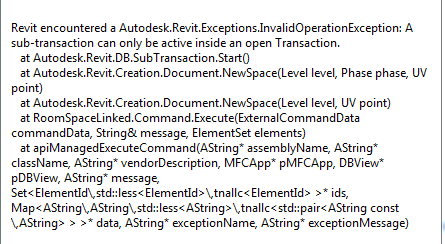

<head>
<meta http-equiv="Content-Type" content="text/html; charset=utf-8">
<link rel="stylesheet" type="text/css" href="bc.css">

<!---

-->
</head>

<!---

- http://forums.autodesk.com/t5/revit-api/transaction-problem-linked-document/m-p/5807872
  linked documents cannot be modified

- http://forums.autodesk.com/t5/revit-api/finding-geometry-objects-newbie-question/td-p/5807009
  geometry basics

fsharp #dynamobim
#restapi #python
#grevit
#responsivedesign #typepad
#ah8 #augi #au2015 #dotnet #dynamobim
#stingray #adsklabs #cloud #rendering
#3dweb #3dviewapi #html5 #threejs #webgl #3d #apis #mobile #vr #ecommerce
#Markdown #Fusion360 #Fusion360Hackathon

Revit API, Jeremy Tammik, akn_include

#Geometry Basics and No Modifying Linked Files #revitapi #3dwebcoder #bim #aec #adsk ##adskdevnetwrk

Revit API discussion forum threads
&ndash; Geometry basics: how to retrieve geometry without prompting the user?
&ndash; No modifying linked files: you have to unlink...

-->

### Geometry Basics and No Modifying Linked Files

Yesterday, I was very busy again on the [Revit API discussion forum](http://forums.autodesk.com/t5/revit-api/bd-p/160).

Here are two interesting results to keep track of for posterity:

- [Geometry basics](#2)
- [No modifying linked files](#3)

#### Geometry Basics

From the thread on
[finding geometry objects](http://forums.autodesk.com/t5/revit-api/finding-geometry-objects-newbie-question/td-p/5807009):

**Question:**
I have little experience with GeometryObjects in Revit and most of my work has been based on filtering Elements.

I want to know if it is possible to find geometry objects in the database without prompting the user to select one?

Can I use PickObject to select all or individual curves or lines to get all references programmatically?

**Answer:**
Good question.

The Revit database contains elements.

They are mainly defined parametrically.

This generates their geometry.

You can query an element for its geometry.

The geometry objects are therefore more or less a read-only view of the elements and their parameters.

Yes, you can retrieve geometry without prompting the user, e.g. traversing all elements or a subset via a filtered element collector and querying each for its geometry.

My most recent foray into this area was published yesterday, on
[creating a DirectShape from a selected face](http://thebuildingcoder.typepad.com/blog/2015/09/directshape-from-face-and-sketch-plane-reuse.html).

It demonstrates picking an element on the screen, retrieving the picked geometrical face, querying the same element for its geometry programmatically as well, then traversing that to find the picked face within it.

The Building Coder has discussed hundreds of other examples of
[geometry retrieval and analysis](http://thebuildingcoder.typepad.com/blog/geometry).

Some of the more interesting discussions are listed in various
[topic groups](http://thebuildingcoder.typepad.com/blog/about-the-author.html#5).

One related area is exporting element geometry in various ways.

The easiest way to do so nowadays is to use a
[custom exporter](http://thebuildingcoder.typepad.com/blog/about-the-author.html#5.1).

That hooks directly into the graphics pipeline and eliminates the need to query each individual element for its geometry.

A good source to get started and understand the Revit Geometry API in more depth is the
[Revit online help](http://help.autodesk.com/view/RVT/2016/ENU) and its developer guide section on
[Geometry](http://help.autodesk.com/view/RVT/2016/ENU/?guid=GUID-F429AAEC-551C-4E0D-9CE0-6F92A5A68CC3).

#### No Modifying Linked Files

From the thread on
[transaction problem with linked document](http://forums.autodesk.com/t5/revit-api/transaction-problem-linked-document/m-p/5807872):

**Question:**
My code is written to create a space inside a linked element. This is an error I get when using the `NewSpace` method:

I call the method inside a transaction in the main document and it does nothing to the error.

<pre class="code">
&nbsp; UIApplication uiapp = commandData.Application;
&nbsp; UIDocument uidoc = uiapp.ActiveUIDocument;
&nbsp; Application app = uiapp.Application;
&nbsp; Document doc = uidoc.Document;
&nbsp;
&nbsp; foreach (Document d in app.Documents)
&nbsp; {
&nbsp; &nbsp; using (Transaction t = new Transaction(doc))
&nbsp; &nbsp; {
&nbsp; &nbsp; &nbsp; t.Start(&quot;New Space&quot;);
&nbsp; &nbsp; &nbsp; Space sp = d.Create.NewSpace( ... );
&nbsp; &nbsp; &nbsp; t.Commit();
&nbsp; &nbsp; }&nbsp; &nbsp; &nbsp; &nbsp; &nbsp; &nbsp; &nbsp; &nbsp; &nbsp; &nbsp; &nbsp; &nbsp; &nbsp; &nbsp; &nbsp; &nbsp; &nbsp; &nbsp;
&nbsp; }
</pre>

Could this error be due to the fact that I am calling `NewSpace` in the Linked element but the transaction is in the primary one?

Revit does not seem to allow me to use transactions in anything but the primary document.

If anyone has any suggestions of how I might be able to edit the linked element successfully I would be very appreciative.

**Answer:**
Yes, absolutely, a transaction is totally tied to a document.

If you have two separate documents to modify, you need two separate transactions for them.

If your subtransaction is in a different document B, it cannot be nested into a transaction tied to document A.

However, what is even more applicable in this particular case is the fact that linked documents are not modifiable &ndash; they cannot have any transactions at all.

In order to modify a linked document, one would have to close the link, open the document as a separate main document, make the changes there, save it, and link it back again in the original host.
