<head>
<meta http-equiv="Content-Type" content="text/html; charset=utf-8">
<link rel="stylesheet" type="text/css" href="bc.css">

<!---

-->
</head>

<!---

#dotnet #csharp #geometry
#fsharp #python
#grevit
#responsivedesign #typepad
#ah8 #augi #dotnet
#stingray #adsklabs #cloud #rendering
#3dweb #3dviewapi #html5 #threejs #webgl #3d #apis #mobile #vr #ecommerce
#Markdown #Fusion360 #Fusion360Hackathon #revitapi #3dwebcoder
#javascript
#RestSharp #restapi
#mongoosejs #mongodb #nodejs
#au2015 #rtceur
#adskdevnetwrk

Revit API, Jeremy Tammik, akn_include

RTC Classes and Getting Started with Revit Macros #revitapi #bim #aec #3dwebcoder #dynamobim #au2015 #rtceur #au2015

I am presenting three classes at the Revit Technology Conference RTC
&ndash; Autumn walk over Schauenburg
&ndash; Full moon fire
&ndash; Revit 2016 R2
&ndash; Session #44 Connecting the Desktop and the Cloud
&ndash; Session #130 The Building Coder Chatroom
&ndash; Session #161 Getting Started with Revit Macros...

-->

### RTC Classes and Getting Started with Revit Macros

I have never dealt with Revit macros in depth before.

Now I am finally forced to, having been asked to take over a hands-on lab on the topic from someone else at
the Revit Technology Conference [RTC Europe](http://www.rtcevents.com/rtc2015eu) in Budapest later this week.

I am presenting three classes at RTC.

Here they are, plus another important Revit-related news item and pictures from my recent travel preparation &ndash; some time out in nature before entering airports, hotels and conference rooms in the big city world:

- [Autumn walk over Schauenburg](#2)
- [Full moon fire](#3)
- [Revit 2016 R2](#4)
- Session #44 &ndash; [Connecting the Desktop and the Cloud](#5) &ndash; Cloud-based universal component and asset usage analysis, visualisation and reporting
- Session #130 &ndash; [The Building Coder Chatroom](#6) &ndash; All you ever wanted to ask about Revit API, The Building Coder, and all other non-UI Revit topics
- Session #161 &ndash; [Getting Started with Revit Macros](#7)
    - [What Are Macros?](#11)
    - [Getting Started With Revit Macros](#12)
    - [Write Your First Macro](#13)
    - [Next Steps](#14)
    - [Choose a Programming Language](#15)
    - [Converting Code from One Language to Another](#16)
    - [Learning the Revit API](#17)
    - [Troubleshooting Macros](#18)
    - [Using Debug.Print and the Output Window](#19)
    - [Stepping Through Your Code](#20)
    - [Using Break Points](#21)
    - [Commenting Your Code](#22)
    - [Exceptions](#23)
    - [Macro Sample](#24)
    - [Next Steps](#25)
    - [Additional Resources](#26)
    - [Conclusion](#27)

#### Autumn walk over Schauenburg

It was suddenly quite cold for a while, but now the weather wormed up again and nature is gifting us with a wonderful autumn.

Here is my [pictures from an autumn walk over Schauenburg](https://flic.kr/s/aHsknYQ7yG) last Sunday afternoon:

#### Full Moon Fire

I often celebrate the full moon by spending a couple of hours on a nearby hill overlooking Basel, enjoying nature, space, a big view, the sky, wind, sunset, moonrise and some hours disconnected from all technology.

Here is the [full moon fire photo album](https://flic.kr/s/aHsknYTP1s) from my time out yesterday:

#### Revit 2016 R2 is Available!

The title says it all: [Revit 2016 R2 is available](http://insidethefactory.typepad.com/my_weblog/2015/10/revit-2016-r2-is-available.html).

R2 is a subscription-only release.

For a list of R2 features, check out [what's new in Autodesk Revit Sunrise](http://insidethefactory.typepad.com/my_weblog/2015/08/whats-new-in-autodesk-revit-sunrise.html).

I recently installed the
standard [Revit 2016 service pack 2](http://knowledge.autodesk.com/support/revit-products/downloads/caas/downloads/content/autodesk-revit-2016-service-pack-2.html).

The service pack 2 includes the following API related enhancements:

- Improves stability when using Dynamo and the function *Select Divided Surface Families*.
- Improves stability when DimensionSegment ValueOverride API is called when the dimension value was not overridden.
- Improves error handling with element methods and properties.
- Improves consistency of UIApplication.PostCommand for pre-selection.
- Improves error handling with ElementCategoryFilter.
- Improves stability when editing families that use external resources for keynotes.
- Adds a validator to the Rotate Tap API to guard against creating invalid models.
- Improves error handling with UIDocument.PromptToPlaceViewOnSheet function.
- Improves consistency of the RebarContainer element.

Here are the service pack 1 API related enhancements:

- Corrects an issue with DimensionSegment.TextPostion API when handling a dimension with more than one segment.
- Corrects an issue to make sure that third-party developers always have the correct value when using the public API to get the upper value or lower value of the conditions.
- Corrects an issue that occurred when copying or mirroring an electrical circuit so that wire types are correctly copied as part of the electrical system.

They are all obviously included in the R2 release as well.

Back to my RTC conference preparation classes.

#### Connecting the Desktop and the Cloud

I am still actively working on
the [CompHound component tracker](https://github.com/CompHound/CompHound.github.io) project
for this topic and documenting the work on it extensively
on [The 3D Web Coder](http://the3dwebcoder.typepad.com).

CompHound is a cloud-based universal component and asset usage analysis, reporting, bill of materials, visualisation and navigation project.

It connects Revit and other CAD models to a cloud database consisting of a node.js web server, mongo database and Autodesk View and Data API viewer.

In this session, I plan to start out by discussing the simpler and long-completed FireRating in the Cloud sample, consisting of
the [FireRatingCloud](https://github.com/jeremytammik/FireRatingCloud) C# .NET REST API client Revit add-in and
the [fireratingdb](https://github.com/jeremytammik/firerating) node.js mongoDB web server.

Here is the class synopsis: We describe the nitty-gritty programming details to implement a cloud-based system to analyse, visualise and report on universal component and asset usage. The components could be Revit family instances used in BIM or any other kind of assets in any other kind of system. The focus is on the cloud-based database used to manage the component occurrences, either in global or project based coordinate systems. Searches can be made based on geographical location or keywords. Models are visualised using the Autodesk View and Data API, providing support for online viewing and model navigation.

#### The Building Coder Chatroom

Title: All you ever wanted to ask about the Revit API, The Building Coder, and other non-UI Revit topics.

Synopsis: An open discussion with Jeremy Tammik, The Building Coder and heavy-duty Revit API discussion forum supporter, about anything and everything in Revit that lacks a user interface. DIY, your questions, ideas and sharing experience reign supreme.

I don't know what will happen here &ndash; it depends completely on the participants &nbsp; :-)

I'll take notes and share them with you!

#### Michael's Getting Started with Revit Macros Material

Back to the class on Revit Macros.

The original presenter is Michael Kilkelly of [Space Command](http://spacecmd.com), who very kindly provided a fantastic set of class materials.

Michael already presented on this topic in the past, e.g. at Autodesk University 2013.

The materials and recording from his AU 2013
class [CM2116 &ndash; Revit Customization for Mere Mortals: Save Time (and Your Sanity) with Revit Macros](http://au.autodesk.com/au-online/classes-on-demand/class-catalog/2013/revit-for-architects/cm2116) provide
a very good starting point. They include the handout document, presentation slides and full video recording:

- cm2116_revit_macro_handout.pdf (1443692 bytes)
- cm2116_revit_macro_presentation.pdf (3311510 bytes)
- cm2116_revit_macro_recording.mp4 (542324830 bytes)

He is presenting a similar class this year as well, [IT11135-L &ndash; Getting Started with Revit Macros](https://events.au.autodesk.com/connect/search.ww#loadSearch-searchPhrase=kilkelly&searchType=session&tc=1&sortBy=&i(11080)=&i(11700)=):

> We've all been there &ndash; it's an hour until your deadline and your project manager wants to make a single little change. The problem is, this change will take hours of tedious work... hours you simply don't have. However, through the power of the Revit software API and some basic knowledge of computer programming, you can write macros to automate Revit software and save a ton of time on your next project. This lab is designed to get you started automating Revit software using macros written in the Microsoft Visual Basic .NET programming language. Over the course of this lab, we'll cover programming basics and dive into the Revit software API. We'll do this by writing useful macros you can take back to your office and put to good use. At the end of the class you'll have a solid foundation from which to start writing your own macros. Take command of your software and learn to program! This class is geared toward intermediate-to-advanced Revit software users with little or no programming experience.

- Discover the differences between Revit macros, add-ins, and external applications.
- Learn how to create custom macros in Revit using the Revit macro editor and the C# and VB.NET programming languages.
- Learn how to utilize resources from the Revit Software Development Kit to get more information about .NET and the Revit API.
- Learn how to create time-saving macros using a step-by-step process to break complex problems into manageable tasks.

Here are the RTC handout document and slide deck that Michael created for me, providing full instructions on how to easily and efficiently get started with Revit macros:

- [Slide desk](/a/doc/revit/rtc/2015/doc/s1_2_pres_revit_macros_jtammik.pdf)
- [Handout document](/a/doc/revit/rtc/2015/doc/s1_2_handout_revit_macros_jtammik.pdf)

For the sake of completeness, the pleasure of Internet search engines and above all Revit API students, here is the full handout text direct and live:

### Getting Started with Revit Macros

By Michael Kilkelly, [Space Command](http://spacecmd.com).

#### What Are Macros?

Macros are one of the easiest ways to Automate Revit and access the inner workings of the software. Macros do not require any additional software other than Revit and are a great way for beginners to learn programming.

So what exactly is a macro? A macro is a user created command that is coded using Revit’s API or Application Programming Interface. Macros are run directly inside of Revit and are saved in the project file. Other applications, like Microsoft Excel and Word, also have the ability to create macros. Revit macros are different from those in Excel and Word because you cannot record actions directly into a macro. Revit macros must be coded by hand.

#### Getting Started With Revit Macros

To get started writing your own macros, you should first install the Revit 2016 Software Development Kit or SDK. The SDK contains help files and sample code that will assist you as you learn to program macros. The Revit 2016 SDK be installed from the main page of the Revit installer or it can be downloaded from the Autodesk Developer Network Revit Developer page at

[www.autodesk.com/developrevit](http://www.autodesk.com/developrevit).

The SDK will install on your hard drive and create the following subfolders and files. Take some time to review the files. The macro samples are particularly useful as you get started creating your own macros.

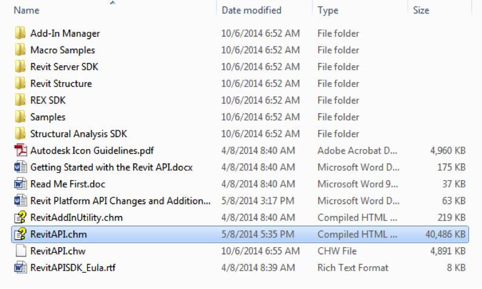

#### Write Your First Macro

Ready to write your first macro? As you’ll see, the process is very easy. Follow the steps below and you’ll be on your way to macro mastery.

#### 1. Open the Macro Manager

Create a new project file. Click the Manage ribbon then click the Macro Manager icon. This will open the Macro Manager dialog.

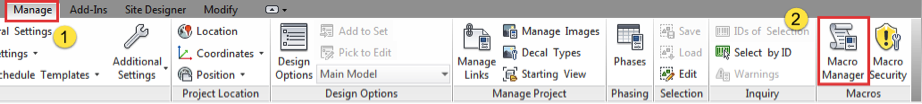

Macros can reside in a project file or within the Revit application. Macros saved in the project file can be used by any user who opens that file. Macros saved in the application are saved to the user’s Revit configuration. These macros can be used on any model file but only by the user who created the macro.

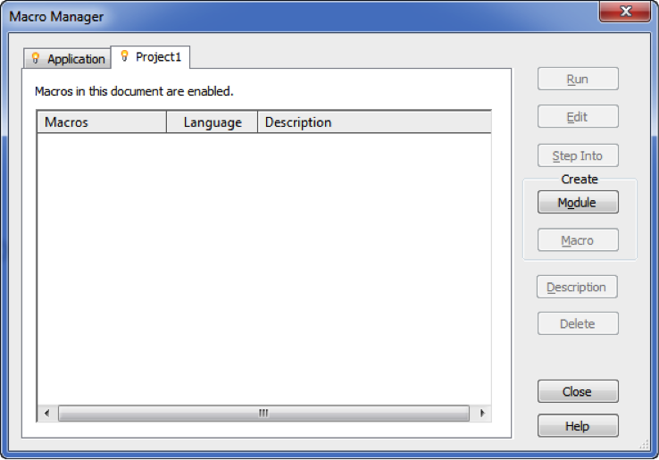

#### 2. Create a New Module

Macros are organized in modules. When creating a macro in a new project file, you must first create a module. A module is simply a collection of macros. A single project file can contain several modules with each module having its own macros. Module names cannot contain spaces or special characters.

To create a module, click the “Project 1” tab then click the Module button in the “Create” section. In the “Create a New Module” dialog box, title your module “MyFirstModule”. You can write macros in C#, VB.NET, Python or Ruby. For this exercise, choose C# as the module’s language. Click OK to create the module.

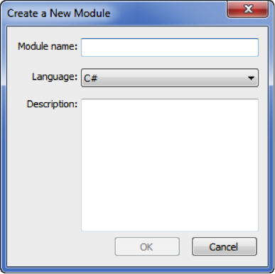

Once Revit has created the module, SharpDevelop will launch. SharpDevelop is an open-source development environment that is built into Revit for programming macros.

#### 3. Create a New Macro

Now that you have a module, you can create a macro inside the module. Click the Macro button in the “Create” section of the Macro Manager dialog. In the “Create a New Macro” dialog, title your first macro “MyFirstMacro” and set the language to C#. Click OK to create the macro.

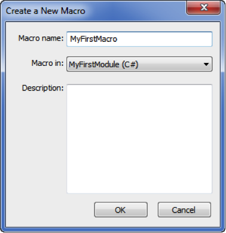

#### 4. Write the Macro

Switch over to SharpDevelop. You’ll see the standard C# code that is automatically generated when you create a new module. Toward the bottom you’ll see the starting code for “MyFirstMacro”.

Your first macro is simply going to popup a message box in Revit. It only takes one line of code. After the “public void MyFirstMacro()”, type the following between the brackets:

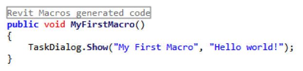

<pre class="code">
&nbsp; public void MyFirstMacro()
&nbsp; {
&nbsp; &nbsp; TaskDialog.Show( &quot;My First Macro&quot;, &quot;Hello World!&quot; );
&nbsp; }
</pre>

Make sure you add a semicolon at the end of the TaskDialog line. This indicates the end of a line to C#.

#### 5. Build the Macro

Once you’ve typed the code, you’re ready to compile or “build” the macro. All macros must be built before Revit can run them. In the SharpDevelop menu bar, select “Build” then “Build Solution”.

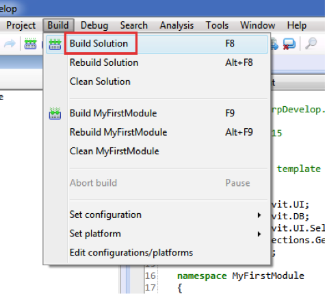

SharpDevelop will compile your C# code into the .NET intermediate code. Any errors or warning will show up in the Errors and Warning window located at the bottom of the SharpDevelop interface.

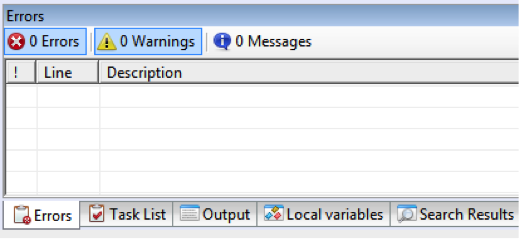

If you have an error, double-check your code. The code window will list errors by line number so they are easy to pinpoint.

#### 6. Run the Macro

If your macro compiled correctly, go back to Revit and open the Macro Manager dialog (Manage > Macro Manager). You should see “MyFirstMacro” in the list below “MyFirstModule”.

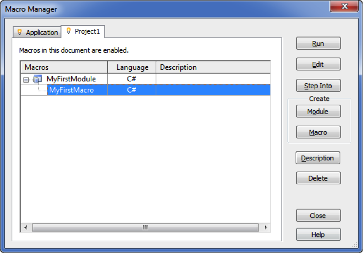

Select “MyFirstMacro” from the list then click the Run button. This will execute your macro. You should see the following on your screen:

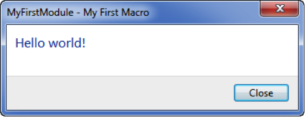

You did it! You wrote your first Revit macro. To take this further, you can modify the code to report back something more useful. Change your code to the following:

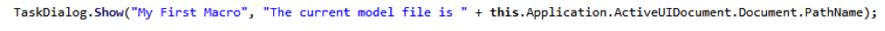

Whitespace and line breaks are ignored in C#, so you can spread the statement over several lines for better readability:

<pre class="code">
&nbsp; public void MyFirstMacro()
&nbsp; {
&nbsp; &nbsp; TaskDialog.Show( &quot;My First Macro&quot;,
&nbsp; &nbsp; &nbsp; &quot;The current model file is &quot;
&nbsp; &nbsp; &nbsp; + this.Application.ActiveUIDocument.Document.PathName );
&nbsp; }
</pre>

The “this.Application.ActiveUIDocument.” object represents the current model file. The “Document” object contains data pertaining to the current file itself. To see the active view in the current project file, change “Document.PathName” to “ActiveView.Name”.

#### Next Steps

Congratulations! You’re on your way to Revit macro mastery. The next challenge is learning to write code and utilize the Revit API. While teaching all the details of programming is beyond the scope of this workshop, I will highlight some key areas to guide you on your journey.

#### Choose a Programming Language

In the example above, we used C# to write the macro. C# is just one of four languages you can use to write macros. Since Revit uses the Microsoft .NET framework 4.0, you can write macros in either Python, Ruby, C# or VB.NET. All these languages compile into the same intermediate language so you have full access to Revit’s API from any of the languages.

Below is additional information about the supported language as well as pros and cons to each.

- Language: History, Pros and Cons
- C#: Based on C and C++; Lots of Revit specific code samples available online. You can use C# to develop stand-alone desktop applications.
The language syntax is not as readable as other languages. The code is more terse, is case sensitive and uses obscure symbols
- VB.NET: Evolved from Microsoft’s Visual Basic Language
VB.NET code is easier to read than C#. The language is not as strict as C#. You can use VB.NET to develop desktop applications.
VB.NET is “wordier” than C# it takes more lines of code to do the same thing. Some say the language isn’t as elegant as other languages.
- Python: Created in 1991 by Guido van Rossum.
 Lots of general code samples and learning resources available. Easy to learn. Python code is very readable. Can build web and desktop apps using Python.
 Not many Revit specific code samples available online yet. Some debugging features not available in SharpDevelop
- Ruby: Created in 1995 by Yukihiro Matsumoto.
 Lots of general code samples and learning resources available. Easy to learn. Code is very readable. Can build web apps with Ruby.
Not many Revit specific code samples available online yet.

C# will be used for the code examples that follow.

#### Converting Code from One Language to Another

SharpDevelop can convert code from one language to another. If you find a good Revit code sample written in VB.NET, you can easily convert it to C#.

To convert code, simply create a module and macro using the language of the code sample then, in SharpDevelop, select Project > Convert and choose the language to convert the code into.

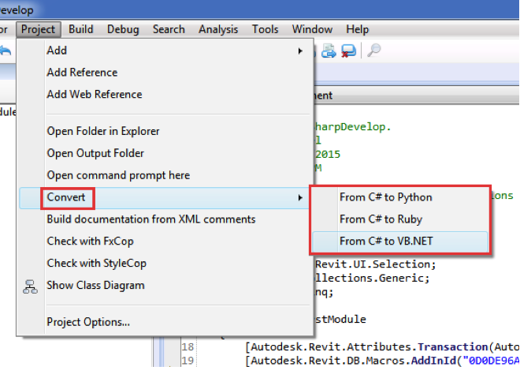

Note that the conversion process is not always perfect. Sometimes you may find the code converts into a string of gibberish, unfortunately.

#### Learning the Revit API

As you move beyond your first Revit macro, you’ll need to get familiar with the Revit API. The best way to do that is through the Revit API help file. The help file is your roadmap to learning the API. You can find the help file in the Revit 2016 SDK folder. Open the RevitAPI.chm file and click the “Content” tab. The help file lists all of the namespaces in the Revit API.

A namespace is essentially a hierarchical container for the elements within the API. A good analogy for namespaces is your computer’s folder structure. Each folder at the same level of the directory structure must have a unique name. The folders can contain similarly named files but the path to each file will be unique as the folder names are unique. Namespaces work the same way. There may be elements within the API that are named the same. For example, many elements have a “Geometry” property but namespaces provide a way to accurately identify which geometry you’re specifying. To reference the wall geometry property, you type Autodesk.Revit.DB.Wall.Geometry.

To find more information about a specific element within the API, simply drill down through the namespaces to find the element. For instance, if I want to learn more about the properties of wall objects, I click Autodesk.Revit.DB Namespace > Wall Class > Wall Properties. The help file lists all the properties of wall elements.

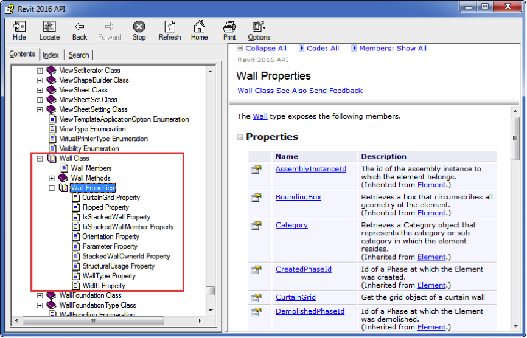

Reading the API help file is not easy. It takes some practice as it is not written in plain English. Rather, it is a description of all the elements within the API. The help file does contain code samples but it not a learning tool. Much like a road map will not teach you to drive a car, the API help file will not teach you to code but it will help you get where you’re going.

#### Troubleshooting Macros

You will spend a lot of time troubleshooting and debugging your macros. One of the great things about coding is that the feedback is immediate. You write some code, compile it then run it. Your code will either work or it will not. Revit will tell you immediately if it does not work and you will feel a sense of accomplishment when it does work. SharpDevelop provides a number of tools to assist you while troubleshooting your code.

#### Using Debug.Print and the Output Window

While writing code, it is often useful to have your macro report back information while the macro is running. Writing code is an iterative process and you will need feedback as you develop your macro. SharpDevelop’s output window is useful for understanding what’s going on inside your macro.

To output information to the output window, use the Debug.Print command. Before you can use the command, however, you’ll need to add the Systems.Diagnostics namespace to your macro. You do this by adding “using System.Diagnostics” to the beginning of your macro code.

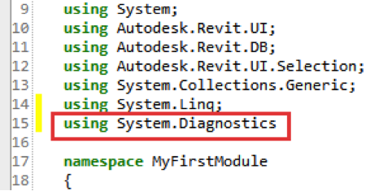

#### Stepping Through Your Code

When you compile your code and run it, Revit will run through the code sequentially. While writing macros however, it is often useful to step through your code line by line so you can see exactly what is going on. You can step through your code using the Step Into button in the “Macro Manager” dialog.

Press the F10 key to step through the next line of code. While you are walking through the code, you can view the Output window to see any output from your Debug.Print lines. You can also view the current values in your variables through the “Local Variables” tab.

#### Using Break Points

In addition to stepping through your code, you can set specific points where you want the code to stop running so you can check out the Output or Local Variables windows. Clicking on the grey area to the left of the line number row will create a break point. A break point is represented as a red dot. Any line containing a break point will also be highlighted in red. When Revit encounters a break point when running the code, it will stop executing the code. Pressing F10 will step through your code or press F5 to continue running the remainder of the macro.

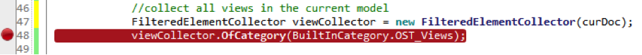

#### Commenting Your Code

One of the most critical practices to follow when writing code is to add comments as you are writing your code. These comments should serve as a reminder for what the code does and why it’s structured in that particular way.

Each language has its own syntax for writing comments. Comments are identified in C# by a double slash (//) at the beginning of the line. SharpDevelop highlights all comments in green.

Comments can also be used to block code from running. Say you are testing some alternate approaches to a specific part of the macro. You can “comment out” parts of the code that you do not want to run. If you have three options for the code, comment out two and run the macro with one of the options. Commenting out can also be used to test very specific parts of your macro. If you are getting errors from one section of the macro, comment out everything else, build the macro and step through it. This focused approach will save you a lot of time while troubleshooting.

#### Exceptions

Face it, your code is not going to be perfect. Even if your code compiles without an error, it can still crash or throw an exception when you run it. This is simply the nature of coding. If you get an error, use the methods listed above to systematically work through your code to identify the problem. This can seem like finding a needle in a haystack when you are first starting out but as you code more and more macros, you will get better at identifying problems in your code.

#### Macro Sample

Our first macro was useful for illustrating the process for creating a macro but let us take what we just learned and put it to use on a macro that is more useful. The following code deletes unused views in the current model file. If a view is not on a sheet or does not have the “working” prefix, it is deleted. Note this macro does not work with dependent views.

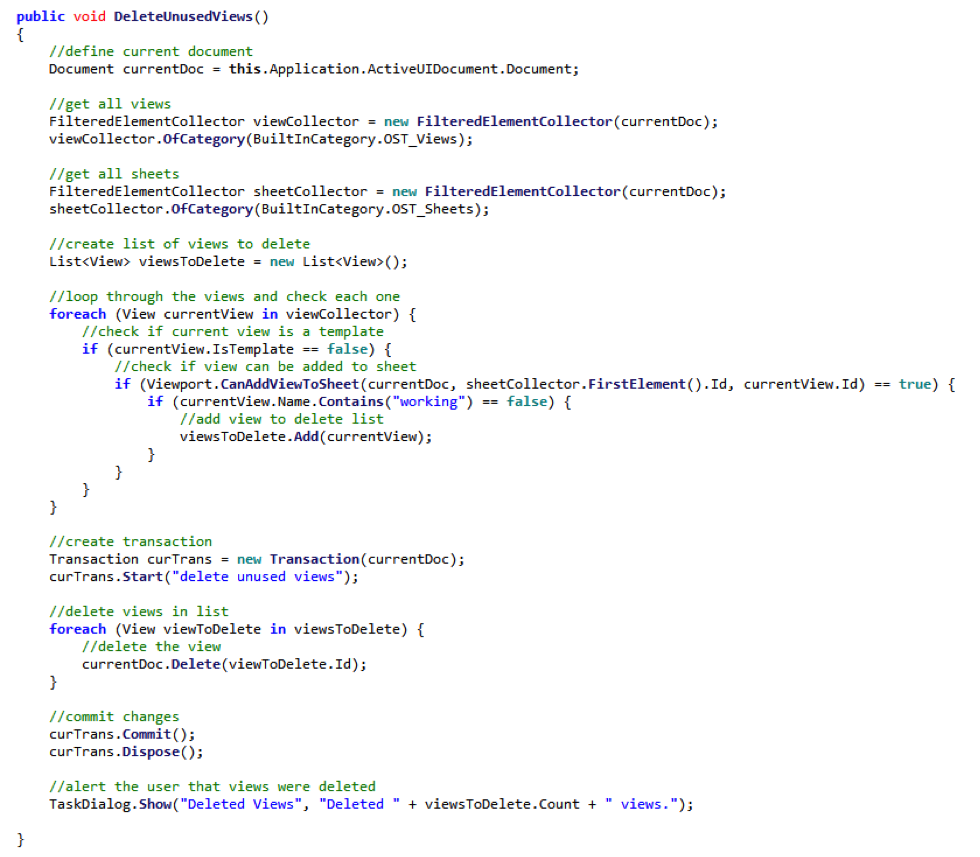

#### Next Steps

What else can you do with Revit macros? Pretty much anything you can think of! Good candidates are tasks that are fairly standardized or require lots of user input. Some examples include:

- Update all window family instances with manufacturer data from spreadsheets.
- Check that all doors in fire-rated walls are actually fire-rated doors.
- Rename all custom families in the project file using a specific prefix for your company.
- Automatically place specific views on a sheet.

Think about the tasks you do on a regular basis. Which of these do you like the least? Would you like to automate it? Could you write a macro that would do the task for you?

#### Additional Resources

Want to learn more about writing your own macros? Check out these resources for more information.

- Blogs
    - The Building Coder &ndash; http://thebuildingcoder.typepad.com/
    - ArchSmarter &ndash; http://archsmarter.com
    - Boost Your BIM &ndash; http://boostyourbim.wordpress.com/
    - The Proving Ground &ndash; http://wiki.theprovingground.org/revit-api
- Online Forums
    - AUGI &ndash; http://forums.augi.com/forumdisplay.php?218-Revit-API
- Online Courses
    - Learn to Program the Revit API &ndash; https://www.udemy.com/revitapi/
    - Mastering Revit Macros &ndash; http://learn.archsmarter.com
- Books
    - Autodesk Revit 2013 Customization with .NET How-to by Don Rudder

#### Conclusion

Learning to write macros and automate Revit will drastically improve your efficiency. A well-written macro can do more in five minutes than a regular user can accomplish in one hour. Learning to program takes time and patience. Start small and work systematically. You’ll be on your way to macro mastery in no time!
