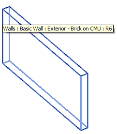
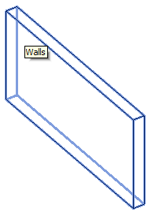
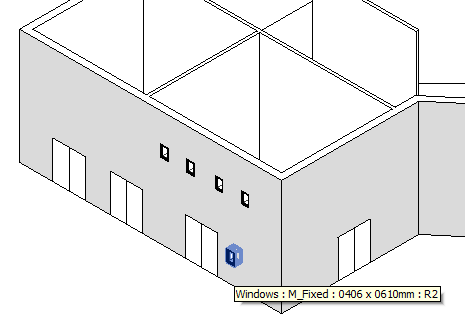
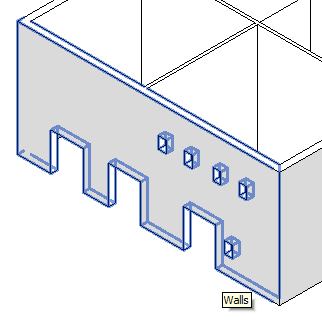

<head>
<meta http-equiv="Content-Type" content="text/html; charset=utf-8">
<link rel="stylesheet" type="text/css" href="bc.css">

<!---

-->
</head>

<!---

#dotnet #csharp
#fsharp #python
#grevit
#responsivedesign #typepad
#ah8 #augi #dotnet
#stingray #adsklabs #rendering
#3dweb #3dviewapi #html5 #threejs #webgl #3d #apis #mobile #vr #ecommerce
#Markdown #Fusion360 #Fusion360Hackathon
#javascript
#RestSharp #restapi
#mongoosejs #mongodb #nodejs
#rtceur

Revit API, Jeremy Tammik, akn_include

Flatten Everything to DirectShape #revitapi #bim #aec #3dwebcoder #adsk #adskdevnetwrk #geometry #au2015 #3d #apis

I am still busy preparing my presentations for Autodesk University and making slow progress due to handling too many Revit API issues in between. And blogging, as well. Here is a new cool sample contributed by Nikolay Shulga, Senior Principal Engineer in the Revit development team. In his own words
&ndash; Name: Flatten
&ndash; Motivation: I wanted to see whether DirectShapes could be used to lock down a Revit design &ndash; remove most intelligence, make it read-only, perhaps improve performance
&ndash; Spec: converts full Revit elements into DirectShapes that hold the same shape and have the same categories
&ndash; Implementation: see below
&ndash; Cool API aspects: copy element’s geometry and use it elsewhere
&ndash; Cool ways to use it: lock down your project; make a copy of your element for presentation/export
&ndash; How it can be enhanced: the sky is the limit...

-->

### Flatten All Elements to DirectShape

I am still busy preparing my presentations for Autodesk University and making slow progress due to handling too many Revit API issues in between.

And blogging, as well.

Here is a new cool sample contributed by Nikolay Shulga, Senior Principal Engineer in the Revit development team.

In his own words:

- Name: Flatten
- Motivation: I wanted to see whether DirectShapes could be used to lock down a Revit design &ndash; remove most intelligence, make it read-only, perhaps improve performance.
- Spec: converts full Revit elements into DirectShapes that hold the same shape and have the same categories.
- Implementation: see below.
- Cool API aspects: copy element’s geometry and use it elsewhere.
- Cool ways to use it: lock down your project; make a copy of your element for presentation/export.
- How it can be enhanced: the sky is the limit.
- A suitable sample model: any Revit project. Note that the code changes the current project &ndash; make a backup copy.

This fits in well with the growing interest in direct shapes, as you can observe by the rapidly growing number of entries in
the [DirectShape topic group](http://thebuildingcoder.typepad.com/blog/about-the-author.html#5.50).

I implemented a new external
command [CmdFlatten](https://github.com/jeremytammik/the_building_coder_samples/blob/master/BuildingCoder/BuildingCoder/CmdFlatten.cs)
in [The Building Coder samples](https://github.com/jeremytammik/the_building_coder_samples) to
test and demonstrate this functionality.

Nikolay's original code was for a future release of Revit, so some backwards adaptation was necessary.

You can see the changes by looking at the last few GitHub commits.

Here is the final result for running in Revit 2016:

<pre class="code">
&nbsp; const string _direct_shape_appGUID = &quot;Flatten&quot;;
&nbsp;
&nbsp; Result Flatten(
&nbsp; &nbsp; Document doc,
&nbsp; &nbsp; ElementId viewId )
&nbsp; {
&nbsp; &nbsp; FilteredElementCollector col
&nbsp; &nbsp; &nbsp; = new FilteredElementCollector( doc, viewId )
&nbsp; &nbsp; &nbsp; &nbsp; .WhereElementIsNotElementType();
&nbsp;
&nbsp; &nbsp; Options geometryOptions = new Options();
&nbsp;
&nbsp; &nbsp; using( Transaction tx = new Transaction( doc ) )
&nbsp; &nbsp; {
&nbsp; &nbsp; &nbsp; if( tx.Start( &quot;Convert elements to DirectShapes&quot; )
&nbsp; &nbsp; &nbsp; &nbsp; == TransactionStatus.Started )
&nbsp; &nbsp; &nbsp; {
&nbsp; &nbsp; &nbsp; &nbsp; foreach( Element e in col )
&nbsp; &nbsp; &nbsp; &nbsp; {
&nbsp; &nbsp; &nbsp; &nbsp; &nbsp; GeometryElement gelt = e.get_Geometry(
&nbsp; &nbsp; &nbsp; &nbsp; &nbsp; &nbsp; geometryOptions );
&nbsp;
&nbsp; &nbsp; &nbsp; &nbsp; &nbsp; if( null != gelt )
&nbsp; &nbsp; &nbsp; &nbsp; &nbsp; {
&nbsp; &nbsp; &nbsp; &nbsp; &nbsp; &nbsp; string appDataGUID = e.Id.ToString();
&nbsp;
&nbsp; &nbsp; &nbsp; &nbsp; &nbsp; &nbsp; // Currently create direct shape 
&nbsp; &nbsp; &nbsp; &nbsp; &nbsp; &nbsp; // replacement element in the original 
&nbsp; &nbsp; &nbsp; &nbsp; &nbsp; &nbsp; // document &#8211; no API to properly transfer 
&nbsp; &nbsp; &nbsp; &nbsp; &nbsp; &nbsp; // graphic styles to a new document.
&nbsp; &nbsp; &nbsp; &nbsp; &nbsp; &nbsp; // A possible enhancement: make a copy 
&nbsp; &nbsp; &nbsp; &nbsp; &nbsp; &nbsp; // of the current project and operate 
&nbsp; &nbsp; &nbsp; &nbsp; &nbsp; &nbsp; // on the copy.
&nbsp;
&nbsp; &nbsp; &nbsp; &nbsp; &nbsp; &nbsp; DirectShape ds
&nbsp; &nbsp; &nbsp; &nbsp; &nbsp; &nbsp; &nbsp; = DirectShape.CreateElement( doc,
&nbsp; &nbsp; &nbsp; &nbsp; &nbsp; &nbsp; &nbsp; &nbsp; e.Category.Id, _direct_shape_appGUID,
&nbsp; &nbsp; &nbsp; &nbsp; &nbsp; &nbsp; &nbsp; &nbsp; appDataGUID );
&nbsp;
&nbsp; &nbsp; &nbsp; &nbsp; &nbsp; &nbsp; try
&nbsp; &nbsp; &nbsp; &nbsp; &nbsp; &nbsp; {
&nbsp; &nbsp; &nbsp; &nbsp; &nbsp; &nbsp; &nbsp; ds.SetShape(
&nbsp; &nbsp; &nbsp; &nbsp; &nbsp; &nbsp; &nbsp; &nbsp; new List&lt;GeometryObject&gt;( gelt ) );
&nbsp;
&nbsp; &nbsp; &nbsp; &nbsp; &nbsp; &nbsp; &nbsp; // Delete original element
&nbsp;
&nbsp; &nbsp; &nbsp; &nbsp; &nbsp; &nbsp; &nbsp; doc.Delete( e.Id );
&nbsp; &nbsp; &nbsp; &nbsp; &nbsp; &nbsp; }
&nbsp; &nbsp; &nbsp; &nbsp; &nbsp; &nbsp; catch( Autodesk.Revit.Exceptions
&nbsp; &nbsp; &nbsp; &nbsp; &nbsp; &nbsp; &nbsp; .ArgumentException ex )
&nbsp; &nbsp; &nbsp; &nbsp; &nbsp; &nbsp; {
&nbsp; &nbsp; &nbsp; &nbsp; &nbsp; &nbsp; &nbsp; Debug.Print(
&nbsp; &nbsp; &nbsp; &nbsp; &nbsp; &nbsp; &nbsp; &nbsp; &quot;Failed to replace {0}; exception {1} {2}&quot;,
&nbsp; &nbsp; &nbsp; &nbsp; &nbsp; &nbsp; &nbsp; &nbsp; Util.ElementDescription( e ),
&nbsp; &nbsp; &nbsp; &nbsp; &nbsp; &nbsp; &nbsp; &nbsp; ex.GetType().FullName,
&nbsp; &nbsp; &nbsp; &nbsp; &nbsp; &nbsp; &nbsp; &nbsp; ex.Message );
&nbsp; &nbsp; &nbsp; &nbsp; &nbsp; &nbsp; }
&nbsp; &nbsp; &nbsp; &nbsp; &nbsp; }
&nbsp; &nbsp; &nbsp; &nbsp; }
&nbsp; &nbsp; &nbsp; &nbsp; tx.Commit();
&nbsp; &nbsp; &nbsp; }
&nbsp; &nbsp; }
&nbsp; &nbsp; return Result.Succeeded;
&nbsp; }
&nbsp;
&nbsp; public Result Execute(
&nbsp; &nbsp; ExternalCommandData commandData,
&nbsp; &nbsp; ref string message,
&nbsp; &nbsp; ElementSet elements )
&nbsp; {
&nbsp; &nbsp; UIApplication uiapp = commandData.Application;
&nbsp; &nbsp; UIDocument uidoc = uiapp.ActiveUIDocument;
&nbsp; &nbsp; Document doc = uidoc.Document;
&nbsp;
&nbsp; &nbsp; // At the moment we convert to DirectShapes 
&nbsp; &nbsp; // &quot;in place&quot; - that lets us preserve GStyles 
&nbsp; &nbsp; // referenced by element shape without doing 
&nbsp; &nbsp; // anything special.
&nbsp;
&nbsp; &nbsp; return Flatten( doc, uidoc.ActiveView.Id );
&nbsp; }
</pre>

Here is a trivial example of flattening a wall to a direct shape:

This is the automatically generated DirectShape replacement element, retaining the wall category and storing its original element id:

Let's try it out on a slightly more complex model:

The family instances get lost by the conversion in its current implementation:

If you wish to retain family instances, you should probably explore their geometry in a little bit more detail, e.g., to extract all the solids they contain and convert them individually.

The current version is provided in the
module [CmdFlatten.cs](https://github.com/jeremytammik/the_building_coder_samples/blob/master/BuildingCoder/BuildingCoder/CmdFlatten.cs)
in [The Building Coder samples](https://github.com/jeremytammik/the_building_coder_samples)
[release 2016.0.123.0](https://github.com/jeremytammik/the_building_coder_samples/releases/tag/2016.0.123.0).

Have fun playing with this, and many thanks to Nikolay for implementing and sharing it!
