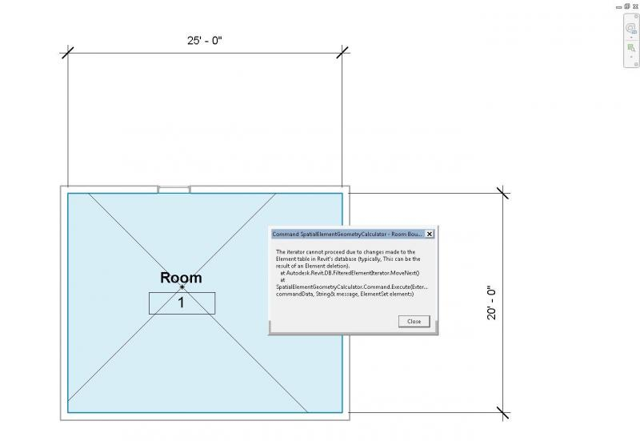
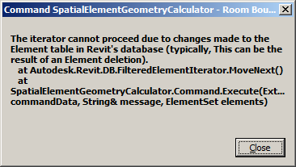

<head>
<meta http-equiv="Content-Type" content="text/html; charset=utf-8">
<link rel="stylesheet" type="text/css" href="bc.css">

<!---

-->
</head>

<!---

#dotnet #csharp
#fsharp #python
#grevit
#responsivedesign #typepad
#ah8 #augi #dotnet
#stingray #adsklabs #rendering
#3dweb #3dviewapi #html5 #threejs #webgl #3d #apis #mobile #vr #ecommerce
#Markdown #Fusion360 #Fusion360Hackathon
#javascript
#RestSharp #restapi
#mongoosejs #mongodb #nodejs
#rtceur
#geometry #3d
#xaml

Revit API, Jeremy Tammik, akn_include

#AU2015, IoC, Banks and Not To Delete While Iterating #revitapi #bim #aec #3dwebcoder #adsk

Autodesk University is already nearing its end. It went by so fast! I attended a bunch of brilliant classes, took notes during Cyrille Fauvel's cloud and mobile expert panel, and successfully presented my own two, the Revit API expert panel and connecting desktop and cloud. That led to a completely different topic
&ndash; SpatialElementGeometryCalculator bug fix &ndash; do not delete while iterating
&ndash; SpatialElementGeometryCalculator migration to Revit 2016
&ndash; IoC, the Internet of Cows
&ndash; Two nice Iain Banks Quarry quotes...

-->

### AU, IoC, Banks and Not To Delete While Iterating

Autodesk University is already nearing its end.

It went by so fast!

I attended a bunch of brilliant classes, took notes during Cyrille Fauvel's
[cloud and mobile expert panel](http://the3dwebcoder.typepad.com/blog/2015/12/autodesk-uni-cloud-and-mobile-expert-panel-qa.html),
and successfully presented my own two,
the [SD10181 &ndash; Revit API expert panel](http://thebuildingcoder.typepad.com/blog/2015/12/au-keynote-and-revit-api-panel.html#9)
and [SD11048 &ndash; connecting desktop and cloud](http://thebuildingcoder.typepad.com/blog/2015/11/connecting-desktop-and-cloud-room-editor-update.html).

That led to a completely different topic... here are a couple of them:

- [SpatialElementGeometryCalculator bug fix &ndash; do not delete while iterating](#2)
- [SpatialElementGeometryCalculator migration to Revit 2016](#3)
- [IoC, the Internet of Cows](#4)
- [Two nice Iain Banks Quarry quotes](#5)

#### SpatialElementGeometryCalculator Bug Fix &ndash; Do Not Delete While Iterating

The Revit API added a check to prevent deletion of database elements during the iteration over the results of a filtered element collector.

Here it crops up again.

Arif Hanif attended the class SD11048 on connecting desktop and cloud, and we were able to take time off together afterwards to analyse and fix the issue with
the [SpatialElementGeometryCalculator](http://thebuildingcoder.typepad.com/blog/2015/03/findinserts-retrieves-all-openings-in-all-wall-types.html) that
he reported in
his [comment](http://thebuildingcoder.typepad.com/blog/2015/03/findinserts-retrieves-all-openings-in-all-wall-types.html#comment-2380592080) last week:

> I am finding an issue with the temp delete. I implemented the code as on GitHub. The problem appears in both Revit 2015 and 2016. I went through the code and the issue is in the temp delete...

I was able to reproduce the issue on my system right out of the box:

Read the error message. It tells you exactly what is going wrong:

> The iterator cannot proceed due to changes made to the Element table in Revit's database (typically, this can be the result of an Element deletion) at Autodesk.Revit.DB.FilteredElementIterator.MoveNext...

Here is the snippet of code causing the issue:

<pre class="code">
&nbsp; var roomCol = new FilteredElementCollector( doc )
&nbsp; &nbsp; .OfClass( typeof( SpatialElement ) );
&nbsp;
&nbsp; foreach( var e in roomCol )
&nbsp; {
&nbsp; &nbsp; var room = e as Room;
&nbsp; &nbsp; if( room == null ) continue;
&nbsp; &nbsp; if( room.Location == null ) continue;
</pre>

The error message does not appear until much later, though, when existing the code block encapsulating this snippet.

Fixing this problem is very easy: just extract the element ids from the collector and dispose of it before starting to loop over the results and potentially deleting things, e.g., like this:

<pre class="code">
&nbsp; var roomIds = new FilteredElementCollector( doc )
&nbsp; &nbsp; .OfClass( typeof( SpatialElement ) )
&nbsp; &nbsp; .ToElementIds();
&nbsp;
&nbsp; foreach( var id in roomIds )
&nbsp; {
&nbsp; &nbsp; var room = doc.GetElement( id ) as Room;
&nbsp; &nbsp; if( room == null ) continue;
&nbsp; &nbsp; if( room.Location == null ) continue;
</pre>

Please take note, Håkon &nbsp; :-)

Accordingly, here is my updated [answer](http://thebuildingcoder.typepad.com/blog/2015/03/findinserts-retrieves-all-openings-in-all-wall-types.html#comment-2391775373) to Arif's problem report:

> Thank you for sitting down together with me at Autodesk University today and exploring this issue further.

> First of all, by 'follow-up article', I actually meant this one on [wall area calculation handling multiple openings in multiple walls in multiple rooms](http://thebuildingcoder.typepad.com/blog/2015/04/gross-and-net-wall-area-calculation-enhancement-and-events.html#6).

> Another interesting take on this topic is using [IFCExportUtils to determine door and window area](http://thebuildingcoder.typepad.com/blog/2015/03/ifcexportutils-methods-determine-door-and-window-area.html).

> Secondly, we succeeded in finding and resolving the issue.

> The fix is provided by the new [SpatialElementGeometryCalculator release 2015.0.0.4](https://github.com/jeremytammik/SpatialElementGeometryCalculator/releases/tag/2015.0.0.4).

> The error was caused by deleting elements while iterating over them using a filtered element collector.

> To fix, simply store the filtered element collector result as a list of element ids, close the collector, then iterate over the ids and optionally delete elements after the collector is closed.

Thank you again, Arif, for raising this issue!

By the way, the preferred method to submit a problem report on a GitHub sample is to raise a GitHub issue directly on the repository itself.

#### SpatialElementGeometryCalculator Migration to Revit 2016

With that issue out of the way, I also went ahead and migrated the add-in to Revit 2016.

It was trivially simple, since all I had to do was replace the Revit API .NET assembly DLL references.

The result is captured in [SpatialElementGeometryCalculator release 2016.0.0.0](https://github.com/jeremytammik/SpatialElementGeometryCalculator/releases/tag/2016.0.0.0).

#### IoC, The Internet of Cows

Zebra made an RFID tracking system for cows &ndash; aka the [Internet of Cows](http://www.developer.com/daily_news/building-the-internet-of-cows.html), or IoC &ndash; so that farmers know when the cows are giving birth &ndash; they tend to find a private place and hide. They also closely track the water consumed by the cows, because they realized that this metric can be used to accurately predict how much milk they’ll yield in the coming weeks, which can be combined with demand to predict market prices.

#### Two Nice Iain Banks Quarry Quotes

One of my favourite authors is [Iain Banks](https://en.wikipedia.org/wiki/Iain_Banks), as well as his SciFi alter ego, Iain M. Banks.

I am just finishing off his posthumous book *[Quarry](https://en.wikipedia.org/wiki/The_Quarry_(Iain_Banks_novel))*.

Here are two nice quotes from it that I really like:

- *...the end of the nineties and beginning of the noughties.*
- *The opposite of lesson is moron.*

I was unaware of his death until today, writing this post, looking at the Wikipedia entries pointed to above.

Oh dear.

