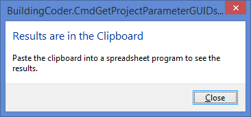
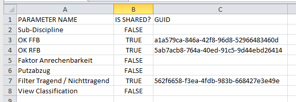
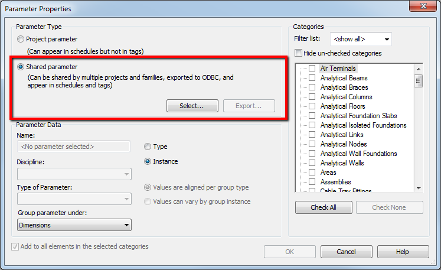

<head>
<meta http-equiv="Content-Type" content="text/html; charset=utf-8">
<link rel="stylesheet" type="text/css" href="bc.css">

<!---

-->
</head>

<!---

09052728 [Reporting on Project Parameter Definitions - Need GUIDs]
http://forums.autodesk.com/t5/Revit-API/Reporting-on-Project-Parameter-Definitions-Need-GUIDs/m-p/4684297

- get guid for project param
  http://forums.autodesk.com/t5/revit-api/reporting-on-project-parameter-definitions-need-guids/m-p/5950183
  http://forums.autodesk.com/t5/revit-api/reporting-on-project-parameter-definitions-need-guids/m-p/5947552
  /a/doc/revit/tbc/zip/CmdGetProjectParameterGUIDs.zip
  email Re: CoderBoy Sample Code Attached

- accessing shared project parameter internal definition:
  11315526 [Create Project Parameter with "Values can vary by group instance" selected?]
  http://forums.autodesk.com/t5/revit-api/create-project-parameter-with-quot-values-can-vary-by-group/m-p/5939455
  09052728 [Reporting on Project Parameter Definitions - Need GUIDs]
  https://forums.autodesk.com/t5/revit-api/reporting-on-project-parameter-definitions-need-guids/td-p/4684297

#dotnet #csharp
#fsharp #python
#grevit
#responsivedesign #typepad
#ah8 #augi #dotnet
#stingray #rendering
#3dweb #3dviewapi #html5 #threejs #webgl #3d #apis #mobile #vr #ecommerce
#Markdown #Fusion360 #Fusion360Hackathon
#javascript
#RestSharp #restapi
#mongoosejs #mongodb #nodejs
#rtceur
#geometry #3d
#xaml

Revit API, Jeremy Tammik, akn_include

Shared Project Parameter GUID Reporter #revitapi #bim #aec #3dwebcoder #adsk

I am still busy on the Revit API discussion forum, when not involved in other important seasonal preparations. Now let's look at the overdue solution to determine the GUID of a shared project parameter
&ndash; Issue
&ndash; Implementation
&ndash; Download
&ndash; Discussion
&ndash; Solution.
A long discussion between CoderBoy, Scott Wilson and Ning Zhou
on reporting on project parameter definitions &ndash; need GUIDs was resolved back in 2013 and never published...

-->

### Shared Project Parameter GUID Reporter

I am still busy on the [Revit API discussion forum](http://forums.autodesk.com/t5/revit-api/bd-p/160), when not involved in other important seasonal preparations:

Now let's look at the overdue solution to determine the GUID of a shared project parameter:

- [Issue](#2)
- [Implementation](#3)
- [Download](#4)
- [Discussion](#5)
- [Solution](#6)

#### Issue

Here is an rather overdue issue &ndash; from 2013 &ndash; that recently surfaced again.

A long discussion between CoderBoy, Scott Wilson and Ning Zhou
on [reporting on project parameter definitions &ndash; need GUIDs](http://forums.autodesk.com/t5/revit-api/reporting-on-project-parameter-definitions-need-guids/m-p/5947552) was resolved back then and never published by The Building Coder, in spite of best intentions of doing so.

It came up again in the recent discussion
on [creating a project parameter with "Values can vary by group instance" selected](  http://forums.autodesk.com/t5/revit-api/create-project-parameter-with-quot-values-can-vary-by-group/m-p/5939455).

I now finally get around to publishing CoderBoy's solution.

In his own words:

> In reference to your recent Revit API forum request, I worked the code into a functioning Revit command.

> As such, I have attached a class written generally in the style of the Building Coder Samples which gathers all the data from the project parameters and puts them in a tab-delimited string format into the clipboard, which is suitable for pasting into a spreadsheet.

> This code may be modified and/or freely distributed to the world.

> When run on the out-of-the-box Revit sample project 'rme_basic_sample_project.rvt' the user sees this:

> Pasting into a spreadsheet results in this:

Thank you very much, CoderBoy, and also Scott and Ning, of course!

#### Implementation

Here is the complete command implementation.

It provides an interesting and important read, with quite extensive documentation of some otherwise rather mystifying steps:

<pre class="code">
[Transaction( TransactionMode.Manual )]
class CmdProjectParameterGuids : IExternalCommand
{
&nbsp; #region Data holding class
&nbsp; /// &lt;summary&gt;
&nbsp; /// This class contains information discovered 
&nbsp; /// about a (shared or non-shared) project parameter 
&nbsp; /// &lt;/summary&gt;
&nbsp; class ProjectParameterData
&nbsp; {
&nbsp; &nbsp; public Definition Definition = null;
&nbsp; &nbsp; public ElementBinding Binding = null;
&nbsp; &nbsp; public string Name = null;&nbsp; &nbsp; &nbsp; &nbsp; &nbsp; &nbsp; &nbsp; &nbsp; // Needed because accsessing the Definition later may produce an error.
&nbsp; &nbsp; public bool IsSharedStatusKnown = false;&nbsp; // Will probably always be true when the data is gathered
&nbsp; &nbsp; public bool IsShared = false;
&nbsp; &nbsp; public string GUID = null;
&nbsp; }
&nbsp; #endregion // Data holding class
&nbsp;
&nbsp; #region Private helper methods
&nbsp; /// &lt;summary&gt;
&nbsp; /// Returns a list of the objects containing 
&nbsp; /// references to the project parameter definitions
&nbsp; /// &lt;/summary&gt;
&nbsp; /// &lt;param name=&quot;doc&quot;&gt;The project document being quereied&lt;/param&gt;
&nbsp; /// &lt;returns&gt;&lt;/returns&gt;
&nbsp; static List&lt;ProjectParameterData&gt;
&nbsp; &nbsp; GetProjectParameterData(
&nbsp; &nbsp; &nbsp; Document doc )
&nbsp; {
&nbsp; &nbsp; // Following good SOA practices, first validate incoming parameters
&nbsp;
&nbsp; &nbsp; if( doc == null )
&nbsp; &nbsp; {
&nbsp; &nbsp; &nbsp; throw new ArgumentNullException( &quot;doc&quot; );
&nbsp; &nbsp; }
&nbsp;
&nbsp; &nbsp; if( doc.IsFamilyDocument )
&nbsp; &nbsp; {
&nbsp; &nbsp; &nbsp; throw new Exception( &quot;doc can not be a family document.&quot; );
&nbsp; &nbsp; }
&nbsp;
&nbsp; &nbsp; List&lt;ProjectParameterData&gt; result
&nbsp; &nbsp; &nbsp; = new List&lt;ProjectParameterData&gt;();
&nbsp;
&nbsp; &nbsp; BindingMap map = doc.ParameterBindings;
&nbsp; &nbsp; DefinitionBindingMapIterator it
&nbsp; &nbsp; &nbsp; = map.ForwardIterator();
&nbsp; &nbsp; it.Reset();
&nbsp; &nbsp; while( it.MoveNext() )
&nbsp; &nbsp; {
&nbsp; &nbsp; &nbsp; ProjectParameterData newProjectParameterData
&nbsp; &nbsp; &nbsp; &nbsp; = new ProjectParameterData();
&nbsp;
&nbsp; &nbsp; &nbsp; newProjectParameterData.Definition = it.Key;
&nbsp; &nbsp; &nbsp; newProjectParameterData.Name = it.Key.Name;
&nbsp; &nbsp; &nbsp; newProjectParameterData.Binding = it.Current
&nbsp; &nbsp; &nbsp; &nbsp; as ElementBinding;
&nbsp;
&nbsp; &nbsp; &nbsp; result.Add( newProjectParameterData );
&nbsp; &nbsp; }
&nbsp; &nbsp; return result;
&nbsp; }
&nbsp;
&nbsp; /// &lt;summary&gt;
&nbsp; /// This method takes a category and information 
&nbsp; /// about a project parameter and adds a binding 
&nbsp; /// to the category for the parameter.&nbsp; It will 
&nbsp; /// throw an exception if the parameter is already 
&nbsp; /// bound to the desired category.&nbsp; It returns
&nbsp; /// whether or not the API reports that it 
&nbsp; /// successfully bound the parameter to the 
&nbsp; /// desired category.
&nbsp; /// &lt;/summary&gt;
&nbsp; /// &lt;param name=&quot;doc&quot;&gt;The project document in which the project parameter has been defined&lt;/param&gt;
&nbsp; /// &lt;param name=&quot;projectParameterData&quot;&gt;Information about the project parameter&lt;/param&gt;
&nbsp; /// &lt;param name=&quot;category&quot;&gt;The additional category to which to bind the project parameter&lt;/param&gt;
&nbsp; /// &lt;returns&gt;&lt;/returns&gt;
&nbsp; static bool AddProjectParameterBinding(
&nbsp; &nbsp; Document doc,
&nbsp; &nbsp; ProjectParameterData projectParameterData,
&nbsp; &nbsp; Category category )
&nbsp; {
&nbsp; &nbsp; // Following good SOA practices, first validate incoming parameters
&nbsp;
&nbsp; &nbsp; if( doc == null )
&nbsp; &nbsp; {
&nbsp; &nbsp; &nbsp; throw new ArgumentNullException( &quot;doc&quot; );
&nbsp; &nbsp; }
&nbsp;
&nbsp; &nbsp; if( doc.IsFamilyDocument )
&nbsp; &nbsp; {
&nbsp; &nbsp; &nbsp; throw new Exception(
&nbsp; &nbsp; &nbsp; &nbsp; &quot;doc can not be a family document.&quot; );
&nbsp; &nbsp; }
&nbsp;
&nbsp; &nbsp; if( projectParameterData == null )
&nbsp; &nbsp; {
&nbsp; &nbsp; &nbsp; throw new ArgumentNullException(
&nbsp; &nbsp; &nbsp; &nbsp; &quot;projectParameterData&quot; );
&nbsp; &nbsp; }
&nbsp;
&nbsp; &nbsp; if( category == null )
&nbsp; &nbsp; {
&nbsp; &nbsp; &nbsp; throw new ArgumentNullException( &quot;category&quot; );
&nbsp; &nbsp; }
&nbsp;
&nbsp; &nbsp; bool result = false;
&nbsp;
&nbsp; &nbsp; CategorySet cats = projectParameterData.Binding
&nbsp; &nbsp; &nbsp; .Categories;
&nbsp;
&nbsp; &nbsp; if( cats.Contains( category ) )
&nbsp; &nbsp; {
&nbsp; &nbsp; &nbsp; // It's already bound to the desired category.&nbsp; 
&nbsp; &nbsp; &nbsp; // Nothing to do.
&nbsp; &nbsp; &nbsp; string errorMessage = string.Format(
&nbsp; &nbsp; &nbsp; &nbsp; &quot;The project parameter '{0}' is already bound to the '{1}' category.&quot;,
&nbsp; &nbsp; &nbsp; &nbsp; projectParameterData.Definition.Name,
&nbsp; &nbsp; &nbsp; &nbsp; category.Name );
&nbsp;
&nbsp; &nbsp; &nbsp; throw new Exception( errorMessage );
&nbsp; &nbsp; }
&nbsp;
&nbsp; &nbsp; cats.Insert( category );
&nbsp;
&nbsp; &nbsp; // See if the parameter is an instance or type parameter.
&nbsp;
&nbsp; &nbsp; InstanceBinding instanceBinding
&nbsp; &nbsp; &nbsp; = projectParameterData.Binding as InstanceBinding;
&nbsp;
&nbsp; &nbsp; if( instanceBinding != null )
&nbsp; &nbsp; {
&nbsp; &nbsp; &nbsp; // Is an Instance parameter
&nbsp;
&nbsp; &nbsp; &nbsp; InstanceBinding newInstanceBinding
&nbsp; &nbsp; &nbsp; &nbsp; = doc.Application.Create
&nbsp; &nbsp; &nbsp; &nbsp; &nbsp; .NewInstanceBinding( cats );
&nbsp;
&nbsp; &nbsp; &nbsp; if( doc.ParameterBindings.ReInsert(
&nbsp; &nbsp; &nbsp; &nbsp; projectParameterData.Definition,
&nbsp; &nbsp; &nbsp; &nbsp; newInstanceBinding ) )
&nbsp; &nbsp; &nbsp; {
&nbsp; &nbsp; &nbsp; &nbsp; result = true;
&nbsp; &nbsp; &nbsp; }
&nbsp; &nbsp; }
&nbsp; &nbsp; else
&nbsp; &nbsp; {
&nbsp; &nbsp; &nbsp; // Is a type parameter
&nbsp; &nbsp; &nbsp; TypeBinding typeBinding
&nbsp; &nbsp; &nbsp; &nbsp; = doc.Application.Create
&nbsp; &nbsp; &nbsp; &nbsp; &nbsp; .NewTypeBinding( cats );
&nbsp;
&nbsp; &nbsp; &nbsp; if( doc.ParameterBindings.ReInsert(
&nbsp; &nbsp; &nbsp; &nbsp; projectParameterData.Definition, typeBinding ) )
&nbsp; &nbsp; &nbsp; {
&nbsp; &nbsp; &nbsp; &nbsp; result = true;
&nbsp; &nbsp; &nbsp; }
&nbsp; &nbsp; }
&nbsp; &nbsp; return result;
&nbsp; }
&nbsp;
&nbsp; /// &lt;summary&gt;
&nbsp; /// This method populates the appropriate values 
&nbsp; /// on a ProjectParameterData object with 
&nbsp; /// information from the given Parameter object.
&nbsp; /// &lt;/summary&gt;
&nbsp; /// &lt;param name=&quot;parameter&quot;&gt;The Parameter object with source information&lt;/param&gt;
&nbsp; /// &lt;param name=&quot;projectParameterDataToFill&quot;&gt;The ProjectParameterData object to fill&lt;/param&gt;
&nbsp; static void PopulateProjectParameterData(
&nbsp; &nbsp; Parameter parameter,
&nbsp; &nbsp; ProjectParameterData projectParameterDataToFill )
&nbsp; {
&nbsp; &nbsp; // Following good SOA practices, validate incoming parameters first.
&nbsp;
&nbsp; &nbsp; if( parameter == null )
&nbsp; &nbsp; {
&nbsp; &nbsp; &nbsp; throw new ArgumentNullException( &quot;parameter&quot; );
&nbsp; &nbsp; }
&nbsp;
&nbsp; &nbsp; if( projectParameterDataToFill == null )
&nbsp; &nbsp; {
&nbsp; &nbsp; &nbsp; throw new ArgumentNullException(
&nbsp; &nbsp; &nbsp; &nbsp; &quot;projectParameterDataToFill&quot; );
&nbsp; &nbsp; }
&nbsp;
&nbsp; &nbsp; projectParameterDataToFill.IsSharedStatusKnown = true;
&nbsp; &nbsp; projectParameterDataToFill.IsShared = parameter.IsShared;
&nbsp; &nbsp; if( parameter.IsShared )
&nbsp; &nbsp; {
&nbsp; &nbsp; &nbsp; if( parameter.GUID != null )
&nbsp; &nbsp; &nbsp; {
&nbsp; &nbsp; &nbsp; &nbsp; projectParameterDataToFill.GUID = parameter.GUID.ToString();
&nbsp; &nbsp; &nbsp; }
&nbsp; &nbsp; }
&nbsp; }&nbsp; // end of PopulateProjectParameterData
&nbsp; #endregion // Private helper methods
&nbsp;
&nbsp; public Result Execute(
&nbsp; &nbsp; ExternalCommandData commandData,
&nbsp; &nbsp; ref string message,
&nbsp; &nbsp; ElementSet elements )
&nbsp; {
&nbsp; &nbsp; UIApplication uiapp = commandData.Application;
&nbsp; &nbsp; UIDocument uidoc = uiapp.ActiveUIDocument;
&nbsp; &nbsp; Document doc = uidoc.Document;
&nbsp;
&nbsp; &nbsp; if( doc.IsFamilyDocument )
&nbsp; &nbsp; {
&nbsp; &nbsp; &nbsp; message = &quot;The document must be a project document.&quot;;
&nbsp; &nbsp; &nbsp; return Result.Failed;
&nbsp; &nbsp; }
&nbsp;
&nbsp; &nbsp; // Get the (singleton) element that is the 
&nbsp; &nbsp; // ProjectInformation object.&nbsp; It can only have 
&nbsp; &nbsp; // instance parameters bound to it, and it is 
&nbsp; &nbsp; // always guaranteed to exist.
&nbsp;
&nbsp; &nbsp; Element projectInfoElement
&nbsp; &nbsp; &nbsp; = new FilteredElementCollector( doc )
&nbsp; &nbsp; &nbsp; &nbsp; .OfCategory( BuiltInCategory.OST_ProjectInformation )
&nbsp; &nbsp; &nbsp; &nbsp; .FirstElement();
&nbsp;
&nbsp; &nbsp; // Get the first wall type element.&nbsp; It can only 
&nbsp; &nbsp; // have type parameters bound to it, and there is 
&nbsp; &nbsp; // always guaranteed to be at least one of these.
&nbsp;
&nbsp; &nbsp; Element firstWallTypeElement
&nbsp; &nbsp; &nbsp; = new FilteredElementCollector( doc )
&nbsp; &nbsp; &nbsp; &nbsp; .OfCategory( BuiltInCategory.OST_Walls )
&nbsp; &nbsp; &nbsp; &nbsp; .WhereElementIsElementType()
&nbsp; &nbsp; &nbsp; &nbsp; .FirstElement();
&nbsp;
&nbsp; &nbsp; CategorySet categories = null;
&nbsp; &nbsp; Parameter foundParameter = null;
&nbsp;
&nbsp; &nbsp; // Get the list of information about all project 
&nbsp; &nbsp; // parameters, calling our helper method, below.&nbsp; 
&nbsp;
&nbsp; &nbsp; List&lt;ProjectParameterData&gt; projectParametersData
&nbsp; &nbsp; &nbsp; = GetProjectParameterData( doc );
&nbsp;
&nbsp; &nbsp; // In order to be able to query whether or not a 
&nbsp; &nbsp; // project parameter is shared or not, and if it 
&nbsp; &nbsp; // is shared then what it's GUID is, we must ensure 
&nbsp; &nbsp; // it exists in the Parameters collection of an 
&nbsp; &nbsp; // element.
&nbsp; &nbsp; // This is because we cannot query this information 
&nbsp; &nbsp; // directly from the project parameter bindings 
&nbsp; &nbsp; // object.
&nbsp; &nbsp; // So each project parameter will attempt to be 
&nbsp; &nbsp; // temporarily bound to a known object so a 
&nbsp; &nbsp; // Parameter object created from it will exist 
&nbsp; &nbsp; // and can be queried for this additional 
&nbsp; &nbsp; // information.
&nbsp;
&nbsp; &nbsp; foreach( ProjectParameterData projectParameterData
&nbsp; &nbsp; &nbsp; in projectParametersData )
&nbsp; &nbsp; {
&nbsp; &nbsp; &nbsp; if( projectParameterData.Definition != null )
&nbsp; &nbsp; &nbsp; {
&nbsp; &nbsp; &nbsp; &nbsp; categories = projectParameterData.Binding.Categories;
&nbsp; &nbsp; &nbsp; &nbsp; if( !categories.Contains( projectInfoElement.Category ) )
&nbsp; &nbsp; &nbsp; &nbsp; {
&nbsp; &nbsp; &nbsp; &nbsp; &nbsp; // This project parameter is not already 
&nbsp; &nbsp; &nbsp; &nbsp; &nbsp; // bound to the ProjectInformation category,
&nbsp; &nbsp; &nbsp; &nbsp; &nbsp; // so we must temporarily bind it so we can 
&nbsp; &nbsp; &nbsp; &nbsp; &nbsp; // query that object for it.
&nbsp;
&nbsp; &nbsp; &nbsp; &nbsp; &nbsp; using( Transaction tempTransaction
&nbsp; &nbsp; &nbsp; &nbsp; &nbsp; &nbsp; = new Transaction( doc ) )
&nbsp; &nbsp; &nbsp; &nbsp; &nbsp; {
&nbsp; &nbsp; &nbsp; &nbsp; &nbsp; &nbsp; tempTransaction.Start( &quot;Temporary&quot; );
&nbsp;
&nbsp; &nbsp; &nbsp; &nbsp; &nbsp; &nbsp; // Try to bind the project parameter do 
&nbsp; &nbsp; &nbsp; &nbsp; &nbsp; &nbsp; // the project information category, 
&nbsp; &nbsp; &nbsp; &nbsp; &nbsp; &nbsp; // calling our helper method, below.
&nbsp;
&nbsp; &nbsp; &nbsp; &nbsp; &nbsp; &nbsp; if( AddProjectParameterBinding(
&nbsp; &nbsp; &nbsp; &nbsp; &nbsp; &nbsp; &nbsp; doc, projectParameterData,
&nbsp; &nbsp; &nbsp; &nbsp; &nbsp; &nbsp; &nbsp; projectInfoElement.Category ) )
&nbsp; &nbsp; &nbsp; &nbsp; &nbsp; &nbsp; {
&nbsp; &nbsp; &nbsp; &nbsp; &nbsp; &nbsp; &nbsp; // successfully bound
&nbsp; &nbsp; &nbsp; &nbsp; &nbsp; &nbsp; &nbsp; foundParameter
&nbsp; &nbsp; &nbsp; &nbsp; &nbsp; &nbsp; &nbsp; &nbsp; = projectInfoElement.get_Parameter(
&nbsp; &nbsp; &nbsp; &nbsp; &nbsp; &nbsp; &nbsp; &nbsp; &nbsp; projectParameterData.Definition );
&nbsp;
&nbsp; &nbsp; &nbsp; &nbsp; &nbsp; &nbsp; &nbsp; if( foundParameter == null )
&nbsp; &nbsp; &nbsp; &nbsp; &nbsp; &nbsp; &nbsp; {
&nbsp; &nbsp; &nbsp; &nbsp; &nbsp; &nbsp; &nbsp; &nbsp; // Must be a shared type parameter, 
&nbsp; &nbsp; &nbsp; &nbsp; &nbsp; &nbsp; &nbsp; &nbsp; // which the API reports that it binds
&nbsp; &nbsp; &nbsp; &nbsp; &nbsp; &nbsp; &nbsp; &nbsp; // to the project information category 
&nbsp; &nbsp; &nbsp; &nbsp; &nbsp; &nbsp; &nbsp; &nbsp; // via the API, but doesn't ACTUALLY 
&nbsp; &nbsp; &nbsp; &nbsp; &nbsp; &nbsp; &nbsp; &nbsp; // bind to the project information 
&nbsp; &nbsp; &nbsp; &nbsp; &nbsp; &nbsp; &nbsp; &nbsp; // category.&nbsp; (Sheesh!)
&nbsp;
&nbsp; &nbsp; &nbsp; &nbsp; &nbsp; &nbsp; &nbsp; &nbsp; // So we must use a different, type 
&nbsp; &nbsp; &nbsp; &nbsp; &nbsp; &nbsp; &nbsp; &nbsp; // based object known to exist, and 
&nbsp; &nbsp; &nbsp; &nbsp; &nbsp; &nbsp; &nbsp; &nbsp; // try again.
&nbsp;
&nbsp; &nbsp; &nbsp; &nbsp; &nbsp; &nbsp; &nbsp; &nbsp; if( !categories.Contains(
&nbsp; &nbsp; &nbsp; &nbsp; &nbsp; &nbsp; &nbsp; &nbsp; &nbsp; firstWallTypeElement.Category ) )
&nbsp; &nbsp; &nbsp; &nbsp; &nbsp; &nbsp; &nbsp; &nbsp; {
&nbsp; &nbsp; &nbsp; &nbsp; &nbsp; &nbsp; &nbsp; &nbsp; &nbsp; // Add it to walls category as we 
&nbsp; &nbsp; &nbsp; &nbsp; &nbsp; &nbsp; &nbsp; &nbsp; &nbsp; // did with project info for the 
&nbsp; &nbsp; &nbsp; &nbsp; &nbsp; &nbsp; &nbsp; &nbsp; &nbsp; // others, calling our helper 
&nbsp; &nbsp; &nbsp; &nbsp; &nbsp; &nbsp; &nbsp; &nbsp; &nbsp; // method, below.
&nbsp;
&nbsp; &nbsp; &nbsp; &nbsp; &nbsp; &nbsp; &nbsp; &nbsp; &nbsp; if( AddProjectParameterBinding(
&nbsp; &nbsp; &nbsp; &nbsp; &nbsp; &nbsp; &nbsp; &nbsp; &nbsp; &nbsp; doc, projectParameterData,
&nbsp; &nbsp; &nbsp; &nbsp; &nbsp; &nbsp; &nbsp; &nbsp; &nbsp; &nbsp; firstWallTypeElement.Category ) )
&nbsp; &nbsp; &nbsp; &nbsp; &nbsp; &nbsp; &nbsp; &nbsp; &nbsp; {
&nbsp; &nbsp; &nbsp; &nbsp; &nbsp; &nbsp; &nbsp; &nbsp; &nbsp; &nbsp; // Successfully bound
&nbsp; &nbsp; &nbsp; &nbsp; &nbsp; &nbsp; &nbsp; &nbsp; &nbsp; &nbsp; foundParameter
&nbsp; &nbsp; &nbsp; &nbsp; &nbsp; &nbsp; &nbsp; &nbsp; &nbsp; &nbsp; &nbsp; = firstWallTypeElement.get_Parameter(
&nbsp; &nbsp; &nbsp; &nbsp; &nbsp; &nbsp; &nbsp; &nbsp; &nbsp; &nbsp; &nbsp; &nbsp; projectParameterData.Definition );
&nbsp; &nbsp; &nbsp; &nbsp; &nbsp; &nbsp; &nbsp; &nbsp; &nbsp; }
&nbsp; &nbsp; &nbsp; &nbsp; &nbsp; &nbsp; &nbsp; &nbsp; }
&nbsp; &nbsp; &nbsp; &nbsp; &nbsp; &nbsp; &nbsp; &nbsp; else
&nbsp; &nbsp; &nbsp; &nbsp; &nbsp; &nbsp; &nbsp; &nbsp; {
&nbsp; &nbsp; &nbsp; &nbsp; &nbsp; &nbsp; &nbsp; &nbsp; &nbsp; // The project parameter was already 
&nbsp; &nbsp; &nbsp; &nbsp; &nbsp; &nbsp; &nbsp; &nbsp; &nbsp; // bound to the Walls category.
&nbsp; &nbsp; &nbsp; &nbsp; &nbsp; &nbsp; &nbsp; &nbsp; &nbsp; foundParameter
&nbsp; &nbsp; &nbsp; &nbsp; &nbsp; &nbsp; &nbsp; &nbsp; &nbsp; &nbsp; = firstWallTypeElement.get_Parameter(
&nbsp; &nbsp; &nbsp; &nbsp; &nbsp; &nbsp; &nbsp; &nbsp; &nbsp; &nbsp; &nbsp; projectParameterData.Definition );
&nbsp; &nbsp; &nbsp; &nbsp; &nbsp; &nbsp; &nbsp; &nbsp; }
&nbsp;
&nbsp; &nbsp; &nbsp; &nbsp; &nbsp; &nbsp; &nbsp; &nbsp; if( foundParameter != null )
&nbsp; &nbsp; &nbsp; &nbsp; &nbsp; &nbsp; &nbsp; &nbsp; {
&nbsp; &nbsp; &nbsp; &nbsp; &nbsp; &nbsp; &nbsp; &nbsp; &nbsp; PopulateProjectParameterData(
&nbsp; &nbsp; &nbsp; &nbsp; &nbsp; &nbsp; &nbsp; &nbsp; &nbsp; &nbsp; foundParameter,
&nbsp; &nbsp; &nbsp; &nbsp; &nbsp; &nbsp; &nbsp; &nbsp; &nbsp; &nbsp; projectParameterData );
&nbsp; &nbsp; &nbsp; &nbsp; &nbsp; &nbsp; &nbsp; &nbsp; }
&nbsp; &nbsp; &nbsp; &nbsp; &nbsp; &nbsp; &nbsp; &nbsp; else
&nbsp; &nbsp; &nbsp; &nbsp; &nbsp; &nbsp; &nbsp; &nbsp; {
&nbsp; &nbsp; &nbsp; &nbsp; &nbsp; &nbsp; &nbsp; &nbsp; &nbsp; // Wouldn't bind to the walls 
&nbsp; &nbsp; &nbsp; &nbsp; &nbsp; &nbsp; &nbsp; &nbsp; &nbsp; // category or wasn't found when 
&nbsp; &nbsp; &nbsp; &nbsp; &nbsp; &nbsp; &nbsp; &nbsp; &nbsp; // already bound.
&nbsp; &nbsp; &nbsp; &nbsp; &nbsp; &nbsp; &nbsp; &nbsp; &nbsp; // This should probably never happen?
&nbsp;
&nbsp; &nbsp; &nbsp; &nbsp; &nbsp; &nbsp; &nbsp; &nbsp; &nbsp; projectParameterData.IsSharedStatusKnown
&nbsp; &nbsp; &nbsp; &nbsp; &nbsp; &nbsp; &nbsp; &nbsp; &nbsp; &nbsp; = false;&nbsp; // Throw exception?
&nbsp; &nbsp; &nbsp; &nbsp; &nbsp; &nbsp; &nbsp; &nbsp; }
&nbsp; &nbsp; &nbsp; &nbsp; &nbsp; &nbsp; &nbsp; }
&nbsp; &nbsp; &nbsp; &nbsp; &nbsp; &nbsp; &nbsp; else
&nbsp; &nbsp; &nbsp; &nbsp; &nbsp; &nbsp; &nbsp; {
&nbsp; &nbsp; &nbsp; &nbsp; &nbsp; &nbsp; &nbsp; &nbsp; // Found the correct parameter 
&nbsp; &nbsp; &nbsp; &nbsp; &nbsp; &nbsp; &nbsp; &nbsp; // instance on the Project 
&nbsp; &nbsp; &nbsp; &nbsp; &nbsp; &nbsp; &nbsp; &nbsp; // Information object, so use it.
&nbsp;
&nbsp; &nbsp; &nbsp; &nbsp; &nbsp; &nbsp; &nbsp; &nbsp; PopulateProjectParameterData(
&nbsp; &nbsp; &nbsp; &nbsp; &nbsp; &nbsp; &nbsp; &nbsp; &nbsp; foundParameter,
&nbsp; &nbsp; &nbsp; &nbsp; &nbsp; &nbsp; &nbsp; &nbsp; &nbsp; projectParameterData );
&nbsp; &nbsp; &nbsp; &nbsp; &nbsp; &nbsp; &nbsp; }
&nbsp; &nbsp; &nbsp; &nbsp; &nbsp; &nbsp; }
&nbsp; &nbsp; &nbsp; &nbsp; &nbsp; &nbsp; else
&nbsp; &nbsp; &nbsp; &nbsp; &nbsp; &nbsp; {
&nbsp; &nbsp; &nbsp; &nbsp; &nbsp; &nbsp; &nbsp; // The API reports it couldn't bind 
&nbsp; &nbsp; &nbsp; &nbsp; &nbsp; &nbsp; &nbsp; // the parameter to the ProjectInformation 
&nbsp; &nbsp; &nbsp; &nbsp; &nbsp; &nbsp; &nbsp; // category.
&nbsp; &nbsp; &nbsp; &nbsp; &nbsp; &nbsp; &nbsp; // This only happens with non-shared 
&nbsp; &nbsp; &nbsp; &nbsp; &nbsp; &nbsp; &nbsp; // Project parameters, which have no 
&nbsp; &nbsp; &nbsp; &nbsp; &nbsp; &nbsp; &nbsp; // GUID anyway.
&nbsp;
&nbsp; &nbsp; &nbsp; &nbsp; &nbsp; &nbsp; &nbsp; projectParameterData.IsShared = false;
&nbsp; &nbsp; &nbsp; &nbsp; &nbsp; &nbsp; &nbsp; projectParameterData.IsSharedStatusKnown = true;
&nbsp; &nbsp; &nbsp; &nbsp; &nbsp; &nbsp; }
&nbsp; &nbsp; &nbsp; &nbsp; &nbsp; &nbsp; tempTransaction.RollBack();
&nbsp; &nbsp; &nbsp; &nbsp; &nbsp; }
&nbsp; &nbsp; &nbsp; &nbsp; }
&nbsp; &nbsp; &nbsp; &nbsp; else
&nbsp; &nbsp; &nbsp; &nbsp; {
&nbsp; &nbsp; &nbsp; &nbsp; &nbsp; // The project parameter was already bound 
&nbsp; &nbsp; &nbsp; &nbsp; &nbsp; // to the Project Information category.
&nbsp;
&nbsp; &nbsp; &nbsp; &nbsp; &nbsp; foundParameter
&nbsp; &nbsp; &nbsp; &nbsp; &nbsp; &nbsp; = projectInfoElement.get_Parameter(
&nbsp; &nbsp; &nbsp; &nbsp; &nbsp; &nbsp; &nbsp; projectParameterData.Definition );
&nbsp;
&nbsp; &nbsp; &nbsp; &nbsp; &nbsp; if( foundParameter != null )
&nbsp; &nbsp; &nbsp; &nbsp; &nbsp; {
&nbsp; &nbsp; &nbsp; &nbsp; &nbsp; &nbsp; PopulateProjectParameterData(
&nbsp; &nbsp; &nbsp; &nbsp; &nbsp; &nbsp; &nbsp; foundParameter, projectParameterData );
&nbsp; &nbsp; &nbsp; &nbsp; &nbsp; }
&nbsp; &nbsp; &nbsp; &nbsp; &nbsp; else
&nbsp; &nbsp; &nbsp; &nbsp; &nbsp; {
&nbsp; &nbsp; &nbsp; &nbsp; &nbsp; &nbsp; // This will probably never happen.
&nbsp;
&nbsp; &nbsp; &nbsp; &nbsp; &nbsp; &nbsp; projectParameterData.IsSharedStatusKnown
&nbsp; &nbsp; &nbsp; &nbsp; &nbsp; &nbsp; &nbsp; = false;&nbsp; // Throw exception?
&nbsp; &nbsp; &nbsp; &nbsp; &nbsp; }
&nbsp; &nbsp; &nbsp; &nbsp; }
&nbsp;
&nbsp; &nbsp; &nbsp; }&nbsp; // Whether or not the Definition object could be found
&nbsp;
&nbsp; &nbsp; }&nbsp; // For each original project parameter definition
&nbsp;
&nbsp; &nbsp; StringBuilder sb = new StringBuilder();
&nbsp;
&nbsp; &nbsp; // Build column headers
&nbsp;
&nbsp; &nbsp; sb.AppendLine( &quot;PARAMETER NAME\tIS SHARED?\tGUID&quot; );
&nbsp;
&nbsp; &nbsp; // Add each row.
&nbsp;
&nbsp; &nbsp; foreach( ProjectParameterData projectParameterData
&nbsp; &nbsp; &nbsp; in projectParametersData )
&nbsp; &nbsp; {
&nbsp; &nbsp; &nbsp; sb.Append( projectParameterData.Name );
&nbsp; &nbsp; &nbsp; sb.Append( &quot;\t&quot; );
&nbsp;
&nbsp; &nbsp; &nbsp; if( projectParameterData.IsSharedStatusKnown )
&nbsp; &nbsp; &nbsp; {
&nbsp; &nbsp; &nbsp; &nbsp; sb.Append( projectParameterData.IsShared.ToString() );
&nbsp; &nbsp; &nbsp; }
&nbsp; &nbsp; &nbsp; else
&nbsp; &nbsp; &nbsp; {
&nbsp; &nbsp; &nbsp; &nbsp; sb.Append( &quot;&lt;Unknown&gt;&quot; );
&nbsp; &nbsp; &nbsp; }
&nbsp;
&nbsp; &nbsp; &nbsp; if( projectParameterData.IsSharedStatusKnown &amp;&amp;
&nbsp; &nbsp; &nbsp; &nbsp; &nbsp; projectParameterData.IsShared )
&nbsp; &nbsp; &nbsp; {
&nbsp; &nbsp; &nbsp; &nbsp; sb.Append( &quot;\t&quot; );
&nbsp; &nbsp; &nbsp; &nbsp; sb.Append( projectParameterData.GUID );
&nbsp; &nbsp; &nbsp; }
&nbsp; &nbsp; &nbsp; sb.AppendLine();
&nbsp; &nbsp; }
&nbsp;
&nbsp; &nbsp; System.Windows.Clipboard.Clear();
&nbsp; &nbsp; System.Windows.Clipboard.SetText( sb.ToString() );
&nbsp;
&nbsp; &nbsp; TaskDialog resultsDialog = new TaskDialog(
&nbsp; &nbsp; &nbsp; &quot;Results are in the Clipboard&quot; );
&nbsp;
&nbsp; &nbsp; resultsDialog.MainInstruction
&nbsp; &nbsp; &nbsp; = &quot;Results are in the Clipboard&quot;;
&nbsp;
&nbsp; &nbsp; resultsDialog.MainContent
&nbsp; &nbsp; &nbsp; = &quot;Paste the clipboard into a spreadsheet &quot;
&nbsp; &nbsp; &nbsp; &nbsp; + &quot;program to see the results.&quot;;
&nbsp;
&nbsp; &nbsp; resultsDialog.Show();
&nbsp;
&nbsp; &nbsp; return Result.Succeeded;
&nbsp; }
}
</pre>

#### Download

I integrated CoderBoy's code
into [The Building Coder samples](https://github.com/jeremytammik/the_building_coder_samples)
[release 2016.0.125.2](https://github.com/jeremytammik/the_building_coder_samples/releases/tag/2016.0.125.2), in the module [CmdProjectParameterGuids](https://github.com/jeremytammik/the_building_coder_samples/blob/master/BuildingCoder/BuildingCoder/CmdProjectParameterGuids.cs).

#### Discussion

Here is a summary of the discussion leading up to this.

It provides some interesting insight into all the work, research and collaboration required for this implementation.

**Question:** We have a need to report the project parameters that are defined in a project, as part of a Quality Assurance tool on which we are working.

While Revit apparently won't let you create two (non-shared) project parameters with the same, case-sensitive name, for some reason it WILL let you add two Shared Parameters with identical, case-sensitive names provided they have each have different GUIDs.

Each of those parameters may be of the same or different types, in the same or different groups, and associated with the same or different categories.  So yes, you could have two parameters with identical names appear in the same group of the properties pane for an element, right next to each other.

So for us to accurately report the project parameters that are defined, we have to differentiate between the two definitions.  However, those definitions may be identical with the only difference (we can tell) being the shared parameter GUIDs.

But there doesn't seem to be a way to ask for the GUID of a project parameter with the API, not even when we try to resort to using Reflection.  Every time we try casting the DefinitionBiningMapIterator.Key to ExternalDefinition we get null, even for parameters we know by testing are shared.  It always casts to InternalDefinition, but never to ExternalDefinition.  So not only can we not seem to get the GUID, there doesn't seem to be a way to even tell if it's a shared parameter or not in the first place.

What are we missing?  Is there some other API methods we simply haven't found yet to get this information?  How can we accurately report how the project parameters were defined by the user in the GUI?

Thanks very much for any assistance you can provide.

**Answer:** Parameter.GUID is the property you seek. Armed with the correct GUID from the shared parameters text file you can verify that the correct parameter is found. Be sure to test the Parameter.IsShared property before accessing the GUID property as non-shared parameters will throw an exception.

That works for shared parameters, if you are looking for a non-shared project parameter then I guess you could filter out all shared ones of the same name, with the remaining non-shared one being your target.

**Response:** Yes, that is how we do it for regular Element parameters.

But have you actually tried this on project parameters?  To the best of my knowledge project parameters do not inherit from the Parmeter class. I believe they are a very different beast, I think in part because they can be associated with one or more categories, which regular Parameter objects don't do.

For brief example, it is my understanding that accessing project parameters starts with the document `ParameterBindings` property, leading to `Definition` instances.

None of the properties on the Definition object are of type Parameter, nor can they seem to cast to a Parameter object, unless I'm missing something.

Further, there is absolutely no guarantee that the current shared parameters file (if any) was used to provide the shared parameters to the project parameters.  Imagine, for example, you are an outside party who got the project file from the architect and you don't have their shared parameters file, or the correct one or more of the many shared parameters files they may be using.  WORSE, what if a different shared parameters file is currently being used and it has a shared parameter in it with the same name and other properties but a different GUID?  We'd wind up reporting the wrong shared parameter definition being used in the project, which violates the requirements.

Unless you can guarantee an extremely well controlled environment (we can't), you should never assume the definitions in a shared parameters file were the ones actually used in a project.

Also, a shared parameters file can't have two parameters with the exact same case-sensitive name in it, whereas the project parameters list CAN have two or more parameters with the exact same case-sensitive name in it, provided they were shared parameters and had different GUIDs.  We've actually seen this in one of our customers projects, which is where the need to accurately report this information came from.  So we really have a need to get the actual GUID being used inside the Revit project for the project parameter definition so we can properly report what is going on, and where things came from.

While I greatly appreciate the effort (thanks!), I can't find a way to reliably apply anything you've suggested.

If you can provide a snippet of code that works reliably on project parameters, I would be hugely grateful.

Thanks again.

**Answer:** Ok, I've been meaning to do something like this for a while now so I just knocked up a quick demo of how to get a complete list of both project and shared parameters used within a document. It's a little crude but it'll do the job.

It basically analyses the parameters of every element within a document and generates a list of unique parameters found and categorises them into shared or project parameters. It also appends the GUID as a hex string to the end of all shared parameter names. If you run it on a document that has multiple parameters with the same name (Both shared and project) you will see that it identifies each individually.

... sample code...

As you can see, there is no need to be messing with binding maps as all the data you need is found within the parameters attached to the elements. There isn't any way to get the GUID for the project parameters, but as you have already noted, each project parameter must have a unique (case-sensitive) name so it shouldn't matter.

**Response:** Again, I hugely appreciate the effort, but there are some significant issues:

1. [Environment clarification] > "...each project parameter must have a unique (case-sensitive) name so it shouldn't matter."

That statement is not true, and not what I tried (perhaps unsuccessfully?) to note.  More than 1 project parameter can have the exact same case-sensitive name, provided they are shared and have different GUIDs.  (If they're not shared, then yes the names must be unique &ndash; go figure!!!)

So, for example, I could have a project parameter that is a shared parameter called "Voltage" with the GUID 8AB7097C-015A-4FEB-99A9-585882951695, and I could add another project parameter that is a shared parameter (from a different shared parameters file) called "Voltage" with the different GUID 3BDF50E5-AC43-43CA-897E-46118EDBD066 and both would show up on the list of project parameters as "Voltage"

Worse, if they're in the same category and in the same group, in the Properties panel for an element of that category, the Revit user would actually see this:

<pre>
  Voltage
  Voltage
</pre>

If they're not in the same group, one could (for example) be at the top of the list and one could be at the bottom of the list, and the Revit user would probably just fill in whichever one they happened to see first. YES, we have at least 1 (very big) customer with this messed-up situation in their projects.

(And which one do you pick if you're trying to build a schedule???)

If those hadn't been shared parameters, and were just regular, non-shared project parameters, then Revit would not allow me to create a second project parameter called "Voltage"  (again, go figure!).  But if they're shared, I can have 2 of them.  Or any number of them, if they all have different GUIDs.

However, what I also noted was that in a single shared parameters file each parameter definition must have a unique (case-sensitive) name.  So it's easy to see how that could get confusing.  (This whole Revit "feature" is messed up and confusing)

2. Perhaps the biggest issue with this example code is that the code for this approach presumes (and requires) that family instances have been created for at least 1 category attached to every project parameter, and by extension that families actually already exist in the project for at least 1 category attached to every project parameter.  That simply may not be the case.  Instance project parameters can be defined and associated to categories for which no instances have yet to be created.  There may not even be any families yet loaded into the project of those categories as well.  A use case for this tool may be, for example, to QA check a project file that is used as a template, or one that is early in the project lifecycle.

3. The code in the example appears to assume that if it's a shared parameter, it's not a project parameter.  It further appears to assume that if it's not a shared parameter, it must be a project parameter.  Neither of these assumptions is likely to ever be correct, or would only be correct under extremely tightly controlled circumstances, which unfortunately we don't have.  Our code needs to work generically, on any project.

4. And not at all insignificantly, wouldn't iterating over every parameter on every element in a project be OMG unbelievably miserably sloooow, especially for large projects?

The idea is very creative to be sure, and again the effort is very much appreciated, but unfortunately it doesn't seem to be robust enough to handle any project accurately, which is what we need.

Surely there's a better, more reliable/accurate way to get project parameter definition information, including whether or not a project parameter definition is shared and what its GUID is...?

Again, many thanks for your efforts!

**Answer:** Did you run the code?

You seem confused regarding the differences between project parameters and a shared parameters. Maybe we are working from different terminolgy. "Project Parameters" are by definition not shared if you take Revit's 'Parameter Properties' dialog as a reference. If you are simply refering to paramaters that are present within a project document then I can see where the confusion might be, but why not just call them Parameters?

In the context of the definition above, my statement regarding project parameters (Non-Shared) requiring unique names is accurate. It is the shared parameters that can have common naming, but it is easy to differentiate them using thier GUID. At present the only way I know to get the GUID of a shared parameter without access to the correct external parameters file is to find an element that uses the parameter. This is what my example code demonstrates.

You say that you appreciate the help, but you then proceed to complain about my contribution in point form? Good luck solving your problem, I'll leave you to it then.

**Response:** I really do very much appreciate your time and efforts, but I agree that we probably have different understandings of the situation.

> "Project Parameters" are by definition not shared if you take Revit's 'Parameter Properties' dialog as a reference.

Here is an image of the Revit Project Parameters 'Parameter Properties' dialog that highlights what I mean by having a project parameter that comes from a shared parameters file.  The "Shared parameter" radio button area is circled:

Maybe this will help clear up the confusion?

Your code does correctly demonstrate getting the GUID for a shared parameter from the project when it is in the Parameters collection of an instance element.  I did know how to get that information.

But as my earlier message with sample data mentions, I need to be able to get that information for shared instance project parameter definitions from the project when there are no instances existing in the project, or possibly even any families loaded into the project for any categories associated with the project parameter.  (That would prevent finding Type project parameter GUIDs, or the ability to create throwaway instances that can be created, queried and discarded...in other words, the data needed to "cheat" may not exist in the project to begin with).

That is the problem I need to solve.  I hope between the sample data and the attached images that what I need to do is easier to understand.

**Answer::** I just had the thought that maybe you could temporarily bind a parameter
definition to the "Project Information" category which would then make it
accessible from the Document.ProjectInformation element. You can then
analyse it using the methods discussed earlier to determine whether it is
shared or not and get the GUID if available. I haven't tried this yet so
I'm not sure if it would work, worth a try I guess.

Well it turns out that temporarily binding a shared parameter definition to BuiltInCategory.OST_ProjectInformation and then reading the ProjectInformation element's parameters to get at the GUID works just fine. I was unable to bind any non-shared parameters using the API which is as I was expecting due to the limited functionality available for dealing with non-shared parameters.

I'm not 100% certain, but I think it is fair to say that if a parameter definition rejects binding to a category, then it must be a non-shared project parameter, while any that succeed are shared parameters (which can be confirmed by checking for IsShared just to be sure).

Assuming the above rule holds true, all parameter definitions found within Document.ParameterBindings can then be categorised as shared or non-shared. In the event that several parameters are found with the same name (case-sensitive), any that are shared can be uiquely identified using the GUID and there will be at most 1 non-shared parameter which can be uniquely identified within the group based on its non-shared status.

That should get you motoring along.

By the way I'd like to thank Jeremy for his blog post and code
for [adding a category to a shared parameter binding](http://thebuildingcoder.typepad.com/blog/2012/04/adding-a-category-to-a-shared-parameter-binding.htm), which I used to cobble together a quick test rig for the binding.

**Response:** While it's unfortunate that we have to play games like this, the approach sounds utterly brilliant.  I had forgotten that the ProjectInformation object is effectively like a singleton &ndash; always exactly 1 element of it exists.

It's the perfect place to try to do something like this.

I'll work on integrating this into my code today, but it sounds extremely promising.  I'll let you know how it goes.

Thank you so very much!

Well, it looks like this approach should work, but only for some conditions:

1. I think it will only work on instance parameters.  This is based on the the fact that Project Information is not a category choice in the Project Parameters dialog for type parameters.  Presuming that carries through in the API, now I don't know what to do about type shared parameters.

2. If two or more instance parameters with identical names are already associated with the Project Information category before we start, there won't be a way to tell the existing parameters in the Project Information apart if they have the same parameter type, parameter group, etc (which they very well may).  This *might* be resolvable by trying to temporarily remove all but one of the duplicate project parameters from the Project Information category, and querying the only one left.  I'm not sure how to do that yet because I haven't played around with dissociating a category from a project parameter.

So it seems by attempting this approach (using the Project Information "singleton" to store Parameter instances) that accurately reporting the GUIDs for instance parameters may be possible, but it will be a LOT of work checking for and handling duplicates already assigned to that category to ensure accuracy.  At this time I still don't know what to do about getting the GUIDS for type shared project parameters.

**Answer::** I was just looking into the Type Parameter issue and stumbled upon some useful but also very dangerous API behavior.

The good news is that the API will happily let you rebind a shared 'type' parameter as an instance parameter using BindingMap.ReInsert. This is great as it will then show up on the ProjectInformation element and reveal its GUID.

The problem is that any type information already stored within the project is now deleted and lost forever due to the change from instance to type binding...

This is easily cured by doing a rollback on the transaction, but be careful using this technique as it could ruin the project file if the transaction is accidentally comitted by some other part of your code. I'd suggest placing the binding and GUID investigation code within its own method encapsulated by a sub transaction and ensure that it is rolled back properly before returning. This is probably obvious advice, but better safe than sorry.

**Response:** Well, after wasting about 2 days trying to hack around these deficiencies in the Revit API for a solution to this problem, we have decided to cut our losses and abandon it.  If we see duplicate project parameter names we will simply report they exist, and what they are, and walk away.

The problems really come in when you try to write code that will work under all circumstances for any project.  For just one example, (instance) project parameters (shared or not) with duplicate names may already be bound to the Project Information category before you even start.  So an approach we tried is in a temporary transaction to be rolled back, to remove all bindings for the ProjectInformation category for all project parameters, and then when it's time to try to query a Parameter guid from the ProjectInformation object, rebind the project parameters one at a time to the ProjectInformation category so there will never be more than 1 with that exact name in the ProjectInformation object's parameters collection.  This would guarantee the right Parameter object for each project parameter being tested.

But unbinding them with the API seems to only actually work for shared project parameters.  Non-shared ones simply refuse to unbind.  When you remove the ProjectInformation category from what turns out to be a non-shared project parameter and try to unbind it, it refuses to unbind but the categories collection for that parameter still shows the ProjectInformation category as NOT being in the list, even though it really is bound to the ProjectInformation object if you look at it in the GUI after committing the test transaction.  UGGGH!!!!

Plus, when trying to do some of these things the DefinitionBindingMapIterator.MoveNext() method throws exceptions (exactly when is a blur right now).  So apparently there are some things you can do to a project parameter during the iteration, and some things you can't.

We've already spent far more time fighting the Revit API than management feels it is worth for whatever benefit we might gain by trying to report the GUIDs for shared project parameters.

Scott:  thanks again for the great ideas.  Valiant effort.  It may be possible to reliably report the GUIDs for all shared project parameters for any project under any configuration with the Revit 2014 API, but I'll only believe it when I see it.

I hate to leave a problem like this unsolved, but we also have to do what we're told.

**Answer:** It's unfortunate that you have to quit when you are so close. Oh well, it's been a fun little project for me, I've been wanting to learn more about parameters from the API side of things for a while now and this topic gave me the incentive to dive in.

I have some ideas on how to solve the duplicate names already bound problem also, but I'll keep them to myself for now until I investigate them fully.

**Answer 2:** `BindingMap.ReInsert` works well, for while `it.MoveNext` throws an exception, I used the following workaround:

<pre>
public struct MyData
{
   public Definition def;
   public ElementBinding binding;
}

while (it.MoveNext())
{
   MyData myData;
   myData.def = it.Key;
   myData.binding = it.Current as ElementBinding;
   myDatas.Add(myData);
}

foreach (MyData md in myDatas)
{
   // do normal processing
}
</pre>

The final result looks like this:

**Response:** I had thought of an approach like that for solving the iteration exception problem, but was having other issues getting Revit to behave correctly.  Would it be possible for you to provide all the code you used in your test (a zip file would be fine)?

If it looks close to what we need it to do (including working under all conditions) we may be able to convince management to give us another couple of hours to try to perfect this for our situation.  Your code may have also resolved other issues we have run into, providing we can get things to rollback cleanly as well.

Regardless, it could be a very good learning exercise to see how your code works.

At the very least, thank you very much for your idea!

**Answer:** No problem, let me know if it works or there's any issue or better way

Thanks you guys, especially Scott, for the discussion of this interesting topic!

**Answer 2:** I think the reason that `DefinitionBindingMapIterator` `MoveNext` was throwing exceptions is that you were messing with binding maps while still looping through them. It's similar to attempting to add/remove a list item while within a foreach loop operatiing on the same list.

I suspect that rolling back an enclosed transaction doesn't work either as the BindingMap is probably re-built in memory by the API at each change regardless of roll-backs, invalidating the iterator's pointers.

NingZhou's code solves the issue nicely by caching the definitions before looping through them. Rolling back at each loop is also a good safety measure to ensure safety of existing data. Getting the parameter from the ProjectInformation element by Definition instead of name string also solves your duplicate naming problem.

I think that about covers it, nice work.

Hmm, just had a thought to add GUID and IsShared as extensions to the Definiton class.

**Response:** Wow!  Thank you very much for providing this code.

I haven't had a chance to look at this today, but am hoping to look at it again in the next couple of days.

It's greatly appreciated!

This code does appear to work *IF* none of the project parameters are already bound to the ProjectInformation category before it starts to run.

What we eventually need to do is report which categories are associated with each project parameter (name & GUID if shared) or (name if not shared, in which case there can be only 1 with that name that is not shared).

So just reporting name-GUID combinations isn't enough, we also need to report which categories go with each exact parameter definition.  So it needs to be precise.

The attached project file presents this situation.  Each project parameter (shared or not) is bound to both the Project Information category and the Rooms category.  Again, I'm having issues getting things unbound cleanly.

However, I have another thought.  What if I pre-save the definitions (ala the MyData approach), then using temporary, rolled back transactions, iterate over that list for each item, deleting all but the one project parameter of interest, bind it to the ProjectInformation category (if it isn't already) and then query the ProjectInformation object for the parameter by name?

So I may try that next.  Not sure what will happen to the objects in my list if I delete their parent definitions, though.  I won't be needing them during the deleted time, so maybe that will work.

(Yes, there are built-in Project Information parameters like "Organization Name" whereby if I added my own Project Parameter with that name, it could be a duplicate in the Project Information object as well, not sure if I can filter those out by BuiltInParameter or not...I'll try to cross that bridge if I can get to it)

#### Solution

The code discussed thus far seems to work correctly for all situations except when there is a shared project parameter that is a type parameter.

The API reports that a shared project type parameter binds successfully to the ProjectInformation category, but the associated Parameter does not actually exist in the Project Information object's Parameters collection.  This makes some sense, because you can't bind any project parameters (shared or not) that are type parameters to the Project Information category in the Revit GUI.  (So in this case the API wrongly reports the binding is successful)

The approach outlined thus far uses a known "singleton" (the ProjectInformation element) which works for instance parameters.  So I extended that approach (when needed) to use a known "singleton" (the first Wall Type element, as there must always be at least one) which works for type parameters.

Attached is a text file [GetProjectParameterGUIDs.txt](zip/GetProjectParameterGUIDs.txt) with C# snippets that reasonably nicely packages all of the code needed to accurately collect information about project parameters, whether or not they are shared, and if shared what their GUIDs are.

Again, many many thanks to Scott Wilson and Ning Zhou for their ideas and code snippets to help solve this problem!

