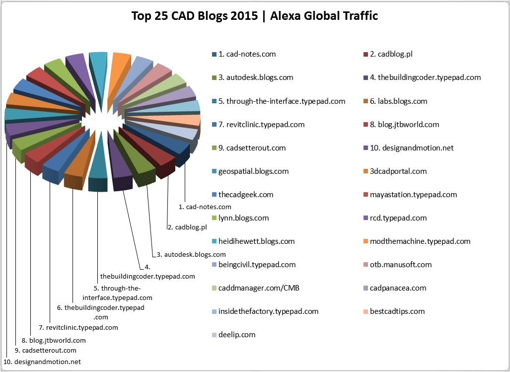

<head>
<meta http-equiv="Content-Type" content="text/html; charset=utf-8">
<link rel="stylesheet" type="text/css" href="bc.css">

<!---

-->
</head>

<!---

- forge, hny, public models, tichu, cases 11377369, 11377787, 11379033

- /a/doc/revit/tbc/img/top-cad-blogs-2015-pie.jpg
  https://www.facebook.com/scott.sheppard/posts/10153976028707518?comment_id=10153976034357518

#dotnet #csharp
#fsharp #python
#grevit
#responsivedesign #typepad
#ah8 #augi #dotnet
#stingray #rendering
#3dweb #3dviewapi #html5 #threejs #webgl #3d #mobile #vr #ecommerce
#Markdown #Fusion360 #Fusion360Hackathon
#javascript
#RestSharp #restapi
#mongoosejs #mongodb #nodejs
#rtceur
#xaml

Revit API, Jeremy Tammik, akn_include

Happy New Top CAD Blog, Public Models and Forge #revitapi #bim #aec #3dwebcoder #adsk #3dweb #a360 #3dwebaccel #webgl @adskForge

Happy New Year!
I had a really good break, although I spent the last ten days being ill and coming to grips with a serious sinusitis.
I was still able to climb the Schafberg at Wildhaus once
&ndash; Autodesk Forge Accelerator
&ndash; Top CAD Blogs of 2015
&ndash; Public Revit models...

-->

### Happy New Top CAD Blog, Public Models and Forge

First of all, let me wish you a very

Happy New Year!

I had a really good break, although I spent the last ten days being ill and coming to grips with a
serious [sinusitis](https://en.wikipedia.org/wiki/Sinusitis).

I am getting better again now, though.

I was even able to climb the [Schafberg](https://en.wikipedia.org/wiki/Wildhuser_Schafberg) at Wildhaus once, in spite of weakness and headache:

For that one day, it made no difference whether I was lying on the sofa or taking very small slow steps up the hillside.
I always wanted to make a winter ascent of that mountain &ndash; although under these perfect conditions, it can't really be counted as one at all.

I also learned the nice card game [Tichu](https://en.wikipedia.org/wiki/Tichu) &nbsp; :-)

Anyway, I am now back at work again, already more than busy looking at Revit cases and participating actively in
the [Revit API discussion forum](http://forums.autodesk.com/t5/revit-api/bd-p/160).

Here are some other noteworthy items that came up during the break:

- [Autodesk Forge Accelerator](#2)
- [Top CAD Blogs of 2015](#3)
- [Public Revit models](#4)

#### Autodesk Forge Accelerator

Autodesk announced the [Forge](http://forge.autodesk.com) platform at Autodesk University in the beginning of December to power a connected ecosystem for product development, inviting developers and innovators to join in to integrate design, engineering, and manufacturing and build the future of making things together.

Now the date has been set for the first Autodesk Forge Accelerator &ndash; formerly known as
the [Autodesk Cloud Accelerator](http://autodeskcloudaccelerator.com).

The Forge Accelerator will be held in the Autodesk San Francisco office from March 14th to 18th inclusive. If your application is successful, you will be invited to spend the week in our office working on your own projects that make use of Autodesk Forge APIs, with direct interactive help from the ADN DevTech team and members of the Autodesk engineering teams. The Autodesk Forge APIs include the View & Data, AutoCAD I/O, BIM 360, RecCap Photo and Fusion 360 APIs.

To apply for this program, please submit a proposal of not more than 2000 words describing the project you'd like to work on and how it will make use of the Autodesk Forge APIs. More information on how to apply is available
at [autodeskcloudaccelerator.com/apply](http://autodeskcloudaccelerator.com/apply). Note that that page has not yet been updated to include this latest event &ndash; that's how 'hot off the press' this announcement is &nbsp; :-)

If your application is successful, we will provide you with accommodation at an Autodesk designated hotel. All other travel and living costs are at your own expense.

The deadline for submitting proposals is January 31st 2016. We are looking forward to receiving your application. Good luck!

Thanks to [Stephen Preston](http://adndevblog.typepad.com/cloud_and_mobile/stephen-preston) for
the [original post](http://adndevblog.typepad.com/cloud_and_mobile/2015/12/apply-to-attend-the-forge-accelerator.html).

#### Top CAD Blogs of 2015

As is his wont, Brian Curran published an analysis of
the [top CAD blogs of 2015](http://www.draftingservices.com/blog/top-cad-blogs-of-2015).

To my great surprise, The Building Coder made it to the fourth place, just ahead of my idol and mentor Kean Walmsley and his
blog [Through the Interface](http://through-the-interface.typepad.com) in fifth.

Many thanks to [Scott Sheppard](https://www.facebook.com/scott.sheppard) for bringing this to my attention via
his [Facebook comment](https://www.facebook.com/scott.sheppard/posts/10153976028707518?comment_id=10153976034357518).

#### Public Revit Models

For the past several years, Kyle Bernhardt, Product and Product Line Manager at Autodesk, has been maintaining a set of public Revit data sets for demonstration and testing purposes.

I now copied them into the publicly
accessible [Public Revit Models Dropbox folder](https://www.dropbox.com/sh/51beylyeor41jnm/AAB7PaDA5t0H5Hg7DDgaslpla?dl=0) for
you to use for your own testing as well.

Enjoy!

####  Public Revit Models Updated Link

In October 2019, Viktor Balaban pointed out:

> Do you have new location for big Revit model to test performance?
Dropbox seems has closed access there.

Indeed, so it has. Thank you for pointing that out.

I created a new link for you to
a [new Public Revit Models Dropbox folder](https://www.dropbox.com/sh/ovqdg8nm8ov66cg/AACtfGDq1WqDGu3T84ZFq64Ia?dl=0).

Enjoy further!
