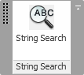
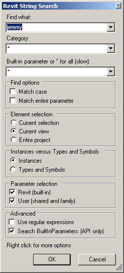
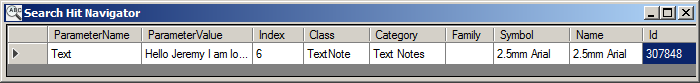

<head>
<meta http-equiv="Content-Type" content="text/html; charset=utf-8">
<link rel="stylesheet" type="text/css" href="bc.css">

<!---

-->
</head>

<!---

11379033 [How do I extract all visible text from Revit file from out of process.]

#dotnet #csharp
#fsharp #python
#grevit
#responsivedesign #typepad
#ah8 #augi #dotnet
#stingray #rendering
#3dweb #3dviewapi #html5 #threejs #webgl #3d #mobile #vr #ecommerce
#Markdown #Fusion360 #Fusion360Hackathon
#javascript
#RestSharp #restapi
#mongoosejs #mongodb #nodejs
#rtceur
#xaml
#3dweb #a360 #3dwebaccel #webgl @adskForge

Revit API, Jeremy Tammik, akn_include

All Model Text, StringSearch 2016 and New Jobs #revitapi #bim #aec #3dwebcoder #adsk

I migrated another one of my samples to Revit 2016: StringSearch. That was prompted by a question on extracting all visible text from the Revit model that I will take a closer look at below
&ndash; ADN Internship and Other Jobs
&ndash; Extracting all Visible Text from the Revit Model
&ndash; StringSearch for Revit 2016...

-->

### All Model Text, StringSearch 2016 and New Jobs

I migrated another one of my samples to Revit 2016: StringSearch.

That was prompted by a question on [extracting all visible text from the Revit model](#3) that I will take a closer look at below.

#### ADN Internship and Other Jobs

First, however, let me point out that there are a number of open job offers at Autodesk right now, including
an [internship position 15WD19623 as Developer Evangelist](https://autodesk.taleo.net/careersection/adsk_cmp/jobdetail.ftl?job=15WD19623) in
ADN, the Autodesk Developer Network, in our San Francisco office.

Feel free to check out that link yourself or share any candidates you feel would be a great fit for the position.

Anyone wishing to be considered can visit our careers site
and [apply directly online](https://autodesk.taleo.net/careersection/adsk_cmp/jobsearch.ftl).

We also have a bunch of openings in Europe right now, e.g., for Associate Customer Success Managers in France, Germany, UK and Sweden.
Get in touch if you are interested.

#### Extracting all Visible Text from the Revit Model

**Question:** I am trying to extract all the visible text strings or attributes data from a Revit file to use for indexing. My code must run out-of-process &ndash; no user interaction is possible.

I have been searching for a coding sample or snippet but have been unable to find anything. Is there something like this available?

**Answer:** You are basically asking two separate questions, and I would advise you to address and implement them in two separate steps.

1. How do I extract all visible text from a Revit model?

2. How do I drive this functionality programmatically from outside?

We have already discussed the second question in other threads, and it is addressed in full by The Building Coder topic group
on [Idling and External Events for Modeless Access and Driving Revit from Outside](http://thebuildingcoder.typepad.com/blog/about-the-author.html#5.28).

The first question is initially very simple, so I can leave it up to you to flesh out.

Start off by implementing, testing and debugging it in a macro or a simple external command before you even think of driving it programmatically, i.e. addressing question 2.

I would use one or several filtered element collectors to retrieve all the elements you are interested in and their properties that you wish to extract.

In the simplest case, it might just be text notes and their visible text strings.

Possibly you are also interested in other strings that can be found in specific element parameters or elsewhere.

That should all be pretty simple to determine and access, e.g. using RevitLookup or other,
more [intimate database exploration tools](http://thebuildingcoder.typepad.com/blog/2013/11/intimate-revit-database-exploration-with-the-python-shell.html).

Once you have the extraction functionality up and running to your satisfaction, it should be easy to encapsulate that in a stand-alone function and call it from an external event.

**Response** I know how to drive from outside &ndash; I only included that information so that I did not get a solution that provided user interaction.

I think the RevitLookup may help me &ndash; my biggest issue is that I don't know all the element types that can have visible text.

I was able to use FilteredElementCollector to find TextElement:

<pre>
  FilteredElementCollector a = Util.GetElementsOfType(
    doc,
    typeof( TextElement ),
    BuiltInCategory.OST_TextNotes );
</pre>

I know if there are other elements that show text.

Do you have any suggestions how I should determine all element types that would have visible text appearing on the display?

**Answer:** I am glad all that is clear.

To determine all element types that have visible text appearing on the display, all I can suggest is creating a collection of a number of super simple sample models that demonstrate and enable you to test the cases that you are aware of up front, and then adding new sample files to that collection as you come across examples of test that they do now cover.

Trial and error, basically, and gathering experience as you go along.

You might also be interested in
the [StringSearch Plug-in of the Month utility](http://thebuildingcoder.typepad.com/blog/2011/10/string-search-adn-plugin-of-the-month.html) that
I implemented as the  a couple of years ago.

I later [updated and created a GitHub repository](http://thebuildingcoder.typepad.com/blog/2014/12/devdays-github-stl-and-obj-model-import.html#4) for
it as well.

It searches for all strings in the model.

It does not differentiate whether the strings it finds are displayed graphically, though.

**Response:** Thanks Jeremy, I download the sample and have been playing with it a bit. I think it will be very helpful. I apologize for my stupid questions. I am just not as comfortable with Revit as other products so many of my problems are no doubt caused by not fully understanding the file/element structure and terminology.

One question about the StringSearch &ndash; it doesn't seem to find dumb text placed in the files. It finds text that is a custom parameter &ndash; like part of the title block. It does not find a dumb text note placed in a view or sheet.

Is this intentional or am I just doing something wrong?

**Answer:** I am glad that you find StringSearch a potentially useful starting point.

It will also find a simple string in a text note. You just have to set it up to access the right parameters.

StringSearch only searches for strings in various combinations of element parameter values.

You could add code to it to search for other properties as well, though, e.g. the TextElement.Text property.

That is not necessary, though, because the text note string value is also accessible through the TEXT_TEXT built-in parameter on the TextNote element.

It can be kind of complex to define all the potential combinations of parameter values that you are interested in, and the user interface offers a quite huge range of optional settings that influence the search.

I would simply debug through it and see what it does. The code is not very complex and quite well structured.

As said, you can also easily find out how to retrieve the simple text note string values directly using RevitLookup.

Actually, the answer to that is already provided in what has been said above.

The shortest way to retrieve all TextNote elements string values might be something like this:

<pre class="code">
&nbsp; List&lt;string&gt; testStrings = new FilteredElementCollector( doc )
&nbsp; &nbsp; .OfClass( typeof( TextNote ) )
&nbsp; &nbsp; .Cast&lt;TextNote&gt;()
&nbsp; &nbsp; .Select&lt;TextNote, string&gt;( tn =&gt; tn.Text )
&nbsp; &nbsp; .ToList&lt;string&gt;();
</pre>

#### StringSearch for Revit 2016

Prompted by this discussion, I migrated
the [StringSearch sample](https://github.com/jeremytammik/StringSearch) to
Revit 2016 and published the result
as [release 2016.0.0.0](https://github.com/jeremytammik/StringSearch/releases/tag/2016.0.0.0).

Here is the StringSearch ribbon panel in all its glory in Revit 2016:

I added a sample TextNote to the model for it to search for:

As said, the TextNote text string is available through the `Text` property or via the `TEXT_TEXT` built-in parameter, so I enable all built-in parameters for the search:

As a result, the target is found and listed in the modeless search hit navigator:

I hope you find this useful as well.
