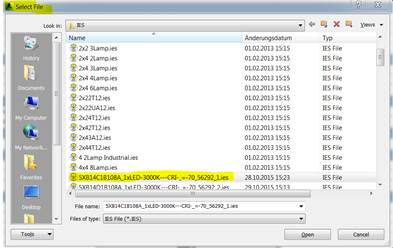
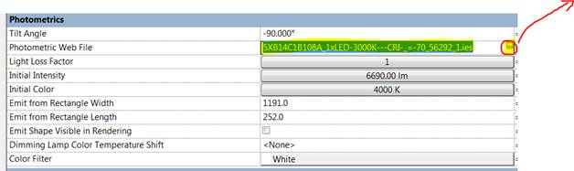

<head>
<meta http-equiv="Content-Type" content="text/html; charset=utf-8">
<link rel="stylesheet" type="text/css" href="bc.css">

<!---

-->
</head>

<!---

- setting IES photmetric mesh data  -AND- learning to use the database exploration tools:
  11230137 [Datei für fotometrisches Netz ändern]

#dotnet #csharp
#fsharp #python
#grevit
#responsivedesign #typepad
#ah8 #augi #dotnet
#stingray #rendering
#3dweb #3dviewapi #html5 #threejs #webgl #3d #mobile #vr #ecommerce
#Markdown #Fusion360 #Fusion360Hackathon
#javascript
#RestSharp #restapi
#mongoosejs #mongodb #nodejs
#rtceur
#xaml
#3dweb #a360 #3dwebaccel #webgl @adskForge
@AutodeskReCap @Adsk3dsMax

Revit API, Jeremy Tammik, akn_include

Loading an IES Photometric Web and Exciting Times #revitapi #bim #aec #3dwebcoder #adsk @AutodeskRevit

Today, let's look at an MEP related issue, loading the IES photometric web data for a light source, plus all the exciting things happening both for myself in the next weeks and for Autodesk as a company as a whole, reinventing itself for the modern cloud-based collaborative sharing technoculture
&ndash; The first annual Autodesk X summit
&ndash; Jeremy's January
&ndash; DevDay in Munich
&ndash; Accelerator Workshop
&ndash; BIM Workshop in Madrid
&ndash; Loading the IES photometric web data for a light source...

-->

### Loading an IES Photometric Web and Exciting Times

Today, let's look at an MEP related issue, loading the IES photometric web data for a light source, plus all the exciting things happening both for myself in the next weeks and for Autodesk as a company as a whole, reinventing itself for the modern cloud-based collaborative sharing technoculture:

- [The first annual Autodesk X summit](#2)
- [Jeremy's January](#3):
    - [DevDay in Munich](#4)
    - [Accelerator Workshop](#5)
    - [BIM Workshop in Madrid](#6)
- [Loading the IES photometric web data for a light source](#7)

#### The First Annual Autodesk X Summit

You may have noticed a global trend towards more openness, collaborativity, sharing, community building in software and other businesses as well.

I hope you are taking note and embracing this for yourself, just as I am.

As we embark on this new year 2016, Autodesk is going through a time of unprecedented change in every way. Although change is challenging, and at times uncomfortable, we are truly excited to be on this journey with you.

You can get an impression of some of the directions we are headed by taking a look at

[xsummit.autodesk.com](http://xsummit.autodesk.com)
 This experience works best when viewed in Chrome

Last October, we held our first annual Autodesk X Summit.

This event marked an exciting moment in Autodesk history &ndash; the beginning of the era of experiences over technologies.   As we transform from a company that sells software products to companies into a platform company that offers services and solutions, we have to place human-centred experience design at the heart of our work and company culture to be successful.  This new way of working cannot involve only those in the traditional design or experience roles  &ndash; delivering excellent experiences for our customers is a shared responsibility for every one of us.

In this spirit, the Autodesk X Summit was broadly inclusive, and gathered designers, engineers, architects, product leaders, customer advocates, salespeople, and makers from all across the company and the globe.  This event marked the beginning of our connected culture, our experience-led era, that binds us all together.

We curated some of the best content and highlights of the event into a virtual experience which will give you a sense of what happened at the X Summit, and hopefully inspire you to find ways to start to design, connect & lead in your own work.

I invite you to explore the experience, watch the videos, and join this transformation.
I am excited to work together with you in 2016 and moving forward.

#### Jeremy's January

I will be travelling quite a bit in the next couple of weeks, but only to places beginning with the letter 'M'.

I would love to run into you at one of the venues listed below.

#### DevDay in Munich

This year, we will be holding just one single DevDay conference in Europe, in Munich on Monday January 18.

Attending DevDays is the best way for you to keep abreast of, and maintain compatibility with, new Autodesk web service and desktop technologies.

DevDays has always been about looking at our newest products, features, and services.

As always, you will see and learn about the upcoming enhancements in the desktop platform capabilities and APIs.

This year, we will also cover the Autodesk Forge Cloud Services, providing a technology and business platform for a new generation of connected Cloud, Web and Mobile apps and based on our web services such as View & Data, AutoCAD I/O, Fusion 360, BIM 360, ReCap 360, and InfraWorks 360.

For the web service APIs, the learning curve is steep, and a few hours during a DevDay conference is just not enough.

Therefore, new for this year, we are appending a four day abbreviated form of
the [Autodesk Cloud Accelerator](http://autodeskcloudaccelerator.com) program, cf. [below](#5).

Registration is easy.  Simply visit the event website at [autodeskdevdays.com](http://www.autodeskdevdays.com) &gt; [Munich](http://autodeskdevdays.com/munich-3) for full information and click
on [Register Now](https://www.eventbrite.com/e/devdays-20152016-tickets-18549596342).

If you have any questions about this event, please don't hesitate to contact us
at (mailto:devdaysinfo@autodesk.com).

Please keep in mind that part of material at Developer Days is forward-looking and confidential, so you will be required to sign a non-disclosure agreement to attend.

#### Accelerator Workshop

As said, you can extend your and deepen your exploration of the Autodesk web services by staying on after the DevDay conference and participating in all or part of a four day abbreviated form of
the [Autodesk Cloud Accelerator](http://autodeskcloudaccelerator.com) program.

The Accelerator workshops provide an unparalleled opportunity for you to learn and work intensively on your chosen project with direct face-to-face help, support and training from Autodesk Cloud Engineering experts.

Invest a few days now &ndash; you will save precious development time later and significantly accelerate your learning curve and project development.

#### BIM Workshop in Madrid

Directly after the DevDay conference and accelerator workshop, I will head off to Madrid for
the [BIM Programming Workshop](http://www.bimprogramming.com) there.

As the name implies, it is focused on architectural programming and dives into both desktop and web based aspects, including hands-on workshops exploring
the [Revit](http://www.autodesk.com/developrevit)
and [View and Data](https://developer.autodesk.com) APIs.

To explore the detailed agenda and register for the workshops, please
visit <b>[bimprogramming.com](http://www.bimprogramming.com)</b>.

#### Loading the IES Photometric Web Data for a Light Source

**Question:** How can I programmatically load an IES file defining the photometric web of a light source?

In the user interface, I have to first select the IES file in the file system:

Then, I can specify the photometric web file name as a property on the light source:

Now I wish to achieve the same result programmatically.

**Answer:** The built-in parameter FBX_LIGHT_PHOTOMETRIC_FILE just stores the IES file name.

The IES file data defined in the file is stored separately in the parameter FBX_LIGHT_PHOTOMETRIC_FILE_CACHE.

So, here is a possible way to load the IES file by API:

- Open the IES file and read its data into a string.
- Set the string of IES file data into parameter FBX_LIGHT_PHOTOMETRIC_FILE_CACHE.
- Set the IES file name to parameter FBX_LIGHT_PHOTOMETRIC_FILE.

Good luck!

**Addendum by Joel Spahn:** Setting the `FBX_LIGHT_PHOTOMETRIC_FILE` parameter to the full file path (not just the file name) will update both the `FILE` and `CACHE` parameters:

<pre class="code">
&nbsp; Symbol.Parameter(
&nbsp; &nbsp; BuiltInParameter.FBX_LIGHT_PHOTOMETRIC_FILE )
&nbsp; &nbsp; .Set( filepath );
</pre>

Note that reading and writing the `FBX_LIGHT_PHOTOMETRIC_FILE_CACHE` directly is a bit tricky since it is encoded and not simply a string representing the IES file contents.

**Addendum 2 by Joshua Lumley**
in [his comment below](https://thebuildingcoder.typepad.com/blog/2016/01/loading-an-ies-photometric-web-and-exciting-times.html#comment-5063406227):

Here is the tricky part; the encoding directive is `using System.Text`:

<pre class="code">
&nbsp;&nbsp;if(&nbsp;myFamilySymbol.LookupParameter(&nbsp;
&nbsp;&nbsp;&nbsp;&nbsp;&quot;Photometric&nbsp;Web&nbsp;File&quot;&nbsp;)&nbsp;!=&nbsp;null&nbsp;)
&nbsp;&nbsp;{
&nbsp;&nbsp;&nbsp;&nbsp;string&nbsp;myString_Filename&nbsp;
&nbsp;&nbsp;&nbsp;&nbsp;&nbsp;&nbsp;=&nbsp;myFamilySymbol.get_Parameter(&nbsp;
&nbsp;&nbsp;&nbsp;&nbsp;&nbsp;&nbsp;&nbsp;&nbsp;BuiltInParameter.FBX_LIGHT_PHOTOMETRIC_FILE&nbsp;)
&nbsp;&nbsp;&nbsp;&nbsp;&nbsp;&nbsp;&nbsp;&nbsp;&nbsp;&nbsp;.AsString();
 
&nbsp;&nbsp;&nbsp;&nbsp;string&nbsp;myString_IESCache&nbsp;
&nbsp;&nbsp;&nbsp;&nbsp;&nbsp;&nbsp;=&nbsp;myFamilySymbol.get_Parameter(&nbsp;
&nbsp;&nbsp;&nbsp;&nbsp;&nbsp;&nbsp;&nbsp;&nbsp;BuiltInParameter.FBX_LIGHT_PHOTOMETRIC_FILE_CACHE&nbsp;)
&nbsp;&nbsp;&nbsp;&nbsp;&nbsp;&nbsp;&nbsp;&nbsp;&nbsp;&nbsp;.AsString();
 
&nbsp;&nbsp;&nbsp;&nbsp;byte[]&nbsp;data&nbsp;=&nbsp;System.Text.UnicodeEncoding.Unicode
&nbsp;&nbsp;&nbsp;&nbsp;&nbsp;&nbsp;.GetBytes(&nbsp;myString_IESCache&nbsp;);
 
&nbsp;&nbsp;&nbsp;&nbsp;File.WriteAllBytes(&nbsp;
&nbsp;&nbsp;&nbsp;&nbsp;&nbsp;&nbsp;myString_YourDirectory&nbsp;+&nbsp;myString_Filename,&nbsp;
&nbsp;&nbsp;&nbsp;&nbsp;&nbsp;&nbsp;data&nbsp;);
&nbsp;&nbsp;}
</pre>
