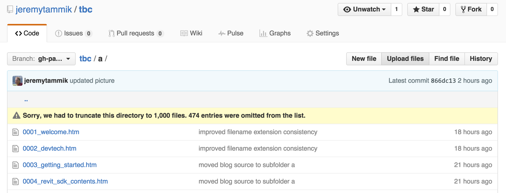

<head>
<meta http-equiv="Content-Type" content="text/html; charset=utf-8">
<link rel="stylesheet" type="text/css" href="bc.css">

<!---

-->
</head>

<!---

- blog:
  - use github as a blog base? via wiki?
  - open source blog platform?
  - keep in parallel with typepad tbc?
  - implement local url base for all links
  - clear out comments, email addresses and confidential stuff
  - put all blog source code on github

- blog on github
  Kean Walmsley has been playing around with [moving Threough the Interface from Typepad to Wordpress]().
  I looked at various alternative options as well.
  http://blog.teamtreehouse.com/using-github-pages-to-host-your-website
  http://jekyllbootstrap.com
  https://help.github.com/articles/using-jekyll-as-a-static-site-generator-with-github-pages/
  [Jekyll executive overview](https://github.com/blog/272-github-pages)
  a Jekyll blog sample [source](https://github.com/mojombo/mojombo.github.io) and [result](http://tom.preston-werner.com)
  a critical view of [blogging on GitHub](http://www.codeproject.com/Articles/809846/Blogging-on-GitHub)
  how and why to move away from Wordpress to [create a beautiful and minimal blog using Jekyll, Github Pages, and poole](http://joshualande.com/jekyll-github-pages-poole)
  I finally ended up doing it the same way as I have handled [hosting The 3D Web Coder source HTML and index on GitHub Pages](http://the3dwebcoder.typepad.com/blog/2015/03/hosting-a-node-server-on-heroku-pages-and-3d-web.html#2)

#dotnet #csharp
#fsharp #python
#grevit
#responsivedesign #typepad
#ah8 #augi #dotnet
#stingray #rendering
#3dweb #3dviewAPI #html5 #threejs #webgl #3d #mobile #vr #ecommerce
#Markdown #Fusion360 #Fusion360Hackathon
#javascript
#RestSharp #restAPI
#mongoosejs #mongodb #nodejs
#rtceur
#xaml
#3dweb #a360 #3dwebaccel #webgl @adskForge
@AutodeskReCap @Adsk3dsMax
#revitAPI #bim #aec #3dwebcoder #adsk #adskdevnetwrk @jimquanci @keanw
#au2015 #rtceur
#eraofconnection
#RMS @researchdigisus
@adskForge #3dwebaccel
#a360

Revit API, Jeremy Tammik, akn_include

The Building Coder Source and Index on GitHub #revitAPI #3dwebcoder @AutodeskRevit #bim #aec #adsk #adskdevnetwrk @github

Developers frequently lament bad search functionality on Typepad-hosted blogs.
Furthermore, it is always handy to have an offline local copy of any kind of important documentation you need to consult regularly.
With a local copy of The Building Coder source text, you can use your standard system tools to search and index locally in any form you like.
Finally, wouldn't it be nice to have a simple line-by-line index of all The Building Coder blog posts ever published?
&ndash; Publishing The Building Coder source and index on GitHub
&ndash; GitHub size limitations
&ndash; Alternative blogging platforms
&ndash; Fork and clone to create your own local installation
&ndash; El Perro Semihundido by Goya...

-->

### tbc &ndash; The Building Coder Source and Index on GitHub

Developers frequently lament bad search functionality on Typepad-hosted blogs.

Furthermore, it is always handy to have an offline local copy of any kind of important documentation you need to consult regularly.

With a local copy of The Building Coder source text, you can use your standard system tools to search and index locally in any form you like.

Finally, wouldn't it be nice to have a simple line-by-line index of all The Building Coder blog posts ever published?

- [Publishing The Building Coder source and index on GitHub](#2)
- [GitHub size limitations](#3)
- [wc &ndash; Word Count &ndash; Work Count?](#3.5)
- [Alternative blogging platforms](#4)
- [Fork and clone to create your own local installation](#5)
- [El Perro Semihundido by Goya](#6)

#### Publishing The Building Coder Source and Index on GitHub

I took these requirements into account right from the start when setting out
on [The 3D Web Coder](http://the3dwebcoder.typepad.com),
as I explained in the discussion
on [hosting its source HTML and index on GitHub Pages](http://the3dwebcoder.typepad.com/blog/2015/03/hosting-a-node-server-on-heroku-pages-and-3d-web.html#2).

I have obviously been pondering doing the same for The Building Coder ever since &ndash; well, actually, to tell the truth, I started thinking about that much earlier still.

Now I finally took the leap.

The entire source text for all posts ever published by The Building Coder is available online from the
new [tbc GitHub repository](https://github.com/jeremytammik/tbc).

It creates a GitHub-pages-hosted entry point
with [The Building Coder Index](https://jeremytammik.github.io/tbc/a)
at [jeremytammik.github.io/tbc/a](https://jeremytammik.github.io/tbc/a).

You can also jump directly to [the table of contents at #6](https://jeremytammik.github.io/tbc/a#6).

This is not a blog reading platform, it just provides a very handy public search and replication tool.

In case you wonder about the trailing `a` in this URL:
the reason for the additional 'a' subfolder is that GitHub sets a limit of 1000 to the number of files it lists in a single folder in the UI.

#### GitHub Size Limitations

I hit a couple of limits built into GitHub and had to implement workarounds to handle some of them:

I already mentioned the limitation displaying no more than 1000 files per directory entry.

My blog posts currently number over 1400, so I exceed that, but can live with the situation as it is.

If you have more than 1000 files in one directory, some of the them are not displayed and you see a warning message saying "Sorry, we had to truncate this directory to 1,000 files. XXX entries were omitted from the list":

Without the 'a' subfolder, the README.md in the top level folder was hidden by all the blog posts and therefore not displayed.

The killer was that its contents were also not shown.

I added `a` to hold the blog posts and left [README.md](https://github.com/jeremytammik/tbc/blob/gh-pages/README.md) in the top-level directory.

A simpler issue occurred with images and attachments.

They live in the two subfolders `img` and `zip`, respectively, currently weighing in at 225 and 410 MB in total size.

Luckily, all the individual image and attachment file sizes are smaller than 100 MB, or GitHub would refuse to host them at all.

As it is, I just got warning messages on two or three files that exceeded a threshold of 30 MB, but were still accepted.

The largest image file
is the 77-MB [monitor_progress.gif](https://github.com/jeremytammik/tbc/blob/gh-pages/a/img/monitor_progress.gif),
which is an animated GIF, i.e. a video screen recording, so not a still image at all.

The largest attachment is [track_changes.mp4](https://github.com/jeremytammik/tbc/blob/gh-pages/a/zip/track_changes.mp4),
another recording, 63 MB in size.

#### wc &ndash; Word Count &ndash; Work Count?

Here is a quick analysis of the word count of the blog posts so far.

I started [using the Markdown blog post format](http://thebuildingcoder.typepad.com/blog/2015/08/markdown-the-fusion-accelerator-revisions-and-bulk-upgrade.html#2) in August 2015.

Before then, they were all hand written in HTML and stored  with a filename extension of `htm`.

The markdown posts have an `md` filename extension, and are used to automatically generate HTML with the extension `html`.

Here are the word counts for each of these formats as of today:

<pre>
/a/doc/revit/tbc/a/ $ wc *htm | tail -1
  255150 1525300 13140829 total
/a/doc/revit/tbc/a/ $ wc *md | tail -1
   15206  105089  841397 total
/a/doc/revit/tbc/a/ $ wc *html | tail -1
   15229  128395 1422270 total
/a/doc/revit/tbc/git/a/ $ wc *htm *md | tail -1
  270387 1630572 13983818 total
</pre>

The hand written stuff summarises to the following:

<table>
<tr><th class="r"></th>      <th class="r">lines</th>   <th class="r">words</th>   <th class="r">characters</th></tr>
<tr><td class="r">htm</td>   <td class="r">255150</td>  <td class="r">1525300</td> <td class="r">13140829</td></tr>
<tr><td class="r">md</td>    <td class="r">15206</td>   <td class="r">105089</td>  <td class="r">841397</td></tr>
<tr><td class="r">total</td> <td class="r">&nbsp;270387</td>  <td class="r">1630572</td> <td class="r">13983818</td></tr>
</table>

More or less, I have written 14 MB of pure text for The Building Coder.

#### Alternative Blogging Platforms

As you may be aware, my
colleague [Kean Walmsley](http://through-the-interface.typepad.com/through_the_interface/about-the-author.html) has
been thinking
of [moving his blog Through the Interface from Typepad to Wordpress](http://through-the-interface.typepad.com/through_the_interface/2016/01/yet-another-blog-design-on-its-way.html) for
a while now.

He mentions that the killer feature of WordPress is search, considering that Typepad fails miserably on this count.

I think that I can fix that problem satisfactorily for all by making my entire blog source text available in this manner, and offer several additional benefits as well.

For a alternative blogging platform you might also be interested in reading
about [creating a beautiful and minimal blog using Jekyll, GitHub Pages, and poole](http://joshualande.com/jekyll-github-pages-poole),
entirely avoiding blog servers like Typepad and WordPress, where you give up control over your data.

So all things considered, my current tendency is to keep the main blog staying put on Typepad.

The purpose of the GitHub version is not normal everyday reading, but safe backup and version management, providing full source access to all readers and a version that people can clone for local searching and offline access.

The [global index](https://jeremytammik.github.io/tbc/a) is just an additional perk.

I use the index file locally myself all the time, hundreds of times every day.

#### Fork and Clone to Create your own Local Installation

To install your own local copy of The Building Coder, fork and clone the
repository [github.com/jeremytammik/tbc](https://github.com/jeremytammik/tbc) and
open `index.html` like this, with just two commands:

<pre>
/j/tmp/ $ git clone https://github.com/jeremytammik/tbc
Cloning into 'tbc'...
remote: Counting objects: 4158, done.
remote: Compressing objects: 100% (3948/3948), done.
remote: Total 4158 (delta 243), reused 4111 (delta 199), pack-reused 0
Receiving objects: 100% (4158/4158), 566.42 MiB | 2.65 MiB/s, done.
Resolving deltas: 100% (243/243), done.
Checking connectivity... done.
/j/tmp/ $ open tbc/a/index.html
</pre>

Et voila, Bob's your uncle!

You have your own local copy of The Building Coder on your system, including the full index and all source text.

Please be patient while cloning, because the entire package including images and attachments adds up to over 1 GB of data.

The layout is not in a nice readable blog format, of course. That is not its purpose.

#### El Perro Semihundido by Goya

Let's end the week enjoying [Goya](https://en.wikipedia.org/wiki/Francisco_Goya)'s [The Dog](https://en.wikipedia.org/wiki/The_Dog_(Goya)) &ndash; *El Perro Semihundido* &ndash; painted on the walls of his house sometime between 1819 and 1823, for his exclusive private enjoyment:

I recently had a chance to enjoy the original in
the [Museo del Prado](https://en.wikipedia.org/wiki/Museo_del_Prado), on my visit to Madrid for
the recent [BIM Programming](http://www.bimprogramming.com) conference and workshops.

Happy weekend to all!
