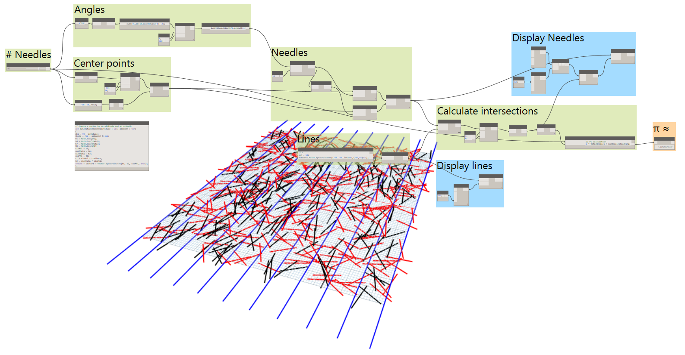

<head>
<meta http-equiv="Content-Type" content="text/html; charset=utf-8">
<link rel="stylesheet" type="text/css" href="bc.css">

<!---

-->
</head>

<!---

- 11545598 [Help me Jeremy Tammik! or anyone else familiar with REST API calls to Revit Svr]
  http://forums.autodesk.com/t5/revit-api/help-me-jeremy-tammik-or-anyone-else-familiar-with-rest-api/m-p/6053451
  bar separator in Revit Server model path
  http://thebuildingcoder.typepad.com/blog/2011/11/access-transmissiondata-of-central-file-on-revit-server.html
  The discussion of a [REST POST request to Revit Server 2014](http://thebuildingcoder.typepad.com/blog/2014/01/rest-post-request-to-revit-server-2014.html) clearly documents the vertical bar separator between the folder and document filename.
  My job is to document, not to search.
  I document things because my memory is short.
  I practice my saerch skills on ehalf of others all day long, but I do have other duties as well.
  [Revit Server](https://knowledge.autodesk.com/support/revit-products/learn-explore/caas/CloudHelp/cloudhelp/2016/ENU/Revit-Server/files/GUID-3FAF98F5-AD5B-4146-B503-FF9373571ABB-htm.html)
  C:/a/lib/revit/2016/SDK/Revit Server SDK/Revit Server REST API Reference.pdf
  Another exploration of using the Revit Server REST API is provided by Eric Stimmel's exploration of
  [Revit Server model list using the REST API](http://blog.ericstimmel.com/2012/05/08/revit-server-model-list).

Pi Day, Meeting, Ski Tour, Revit Server Bar Separator #revitAPI #3dwebcoder @AutodeskRevit #adsk #dynamobim

You may be surprised to hear that today is Pi Day :-) – as well as the birthday of my S.O.S. or significant other's son.
I had an exciting week with the ADN team meeting in London followed by a ski tour during the weekend.
To round this off, I'll also tuck in one little Revit API item here for you
&ndash; Happy Pi Day and Dan's birthday
&ndash; EMEA ADN team meeting in London
&ndash; Ski tours in the Alvier group
&ndash; Revit Server model path requires bar separator...

-->

### Pi Day, Meeting, Ski Tour, Revit Server Bar Separator

You may be surprised to hear that today is Pi Day &nbsp; :-) &ndash; as well as the birthday of my S.O.S. or significant other's son.

I had an exciting week with the ADN team meeting in London followed by a ski tour during the weekend.

To round this off, I'll also tuck in one little Revit API item here for you:

- [Happy Pi Day and Dan's birthday](#2)
- [EMEA ADN team meeting in London](#3)
- [Ski tours in the Alvier group](#4)
- [Revit Server model path requires bar separator](#5)

#### Happy Pi Day and Dan's Birthday

Today is a very special day, at least according to the weird anti-standard American way of writing dates &ndash;
cf. [ISO 8601](https://en.wikipedia.org/wiki/ISO_8601) for the sensible alternative  :-)

March 14, 2016 is written as 3/14/16, with a notable similarity to the four-digit approximation to &pi;, 3.1416 &cong; 3.14159265358979...

This is pointed out by the [Dynamo](http://dynamobim.org) article on using
the [Buffon’s needle algorithm](https://en.wikipedia.org/wiki/Buffon%27s_needle)
to [approximate &pi; in Revit](http://dynamobim.org/happy-%CF%80-day/?linkId=22264657).

It also happens to be Dan's sixteenth birthday:

#### EMEA ADN Team Meeting in London

Back to work, we held our European ADN Team Meeting in London last week,
with [many exciting topics to discuss](http://thebuildingcoder.typepad.com/blog/2016/03/trial-period-floating-license-entitlement-api-and-sketchup-grevit.html#4).

Lacking a free meeting room in the new Autodesk offices in Soho, and there being just four of us to find space for, we rented an apartment near Bow Street and Covent Garden for a couple of days:

Here in a [photo album](https://www.flickr.com/photos/jeremytammik/albums/72157663346443223) of the pictures I took:

I already mentioned two little side-effect details that came up,
a [deploy to Heroku button](http://the3dwebcoder.typepad.com/blog/2016/03/team-meeting-and-deploy-to-heroku-button.html) for
any GitHub-hosted web app, and some ideas on
an [optimal API documentation workflow](http://the3dwebcoder.typepad.com/blog/2016/03/researching-an-optimal-api-documentation-workflow.html) for
the future publication of
the [Forge](http://forge.autodesk.com) API references and samples.

Expect more to come in both those areas.

#### Ski Tours in the Alvier Group

I returned from London to embark on the next in a whole series of ski tours, these ones in
the [Alvier](https://en.wikipedia.org/wiki/Alvier_(mountain)) range
of mountains in the far east of Switzerland.

We were always in or at the upper limit of the fog and clouds, struggling to arrive above them and occasionally succeeding, e.g., on the summits:

#### Revit Server Model Path Requires Bar Separator

Finally, to return to the Revit API, here is the summary of a lengthy discussion of a question that was raised and solved by Ted Kovacs last week in
the [Revit API discussion forum](http://forums.autodesk.com/t5/revit-api/bd-p/160) thread
on [Revit Server model path](http://forums.autodesk.com/t5/revit-api/help-me-jeremy-tammik-or-anyone-else-familiar-with-rest-api/m-p/6053451):

**Question:** Using bits and pieces I found on the web along with some original coding, I put together a script that enumerates all of the projects on Revit Server using a REST API call to a Revit host server, and then automates running Autodesk's command line RevitServerTools utility to update an accelerator's cache.  I have been using it on Revit Server 2015 with great success.  However, the same script refuses to work on Revit Server 2016, and I can't figure out why.

I narrowed it down to the function below that handles the REST request, and found that it is not returning anything, just zero length string.

Does the 2016 URL need to be formatted differently?

Some other problem?

The [complete script](zip/RSN_Cache_Update_and_Model_Export_Script.txt) is attached if it helps or if anyone is interested.

**Answer:** Have you looked at these examples on The Building Coder demonstrating various aspects of programmatically accessing Revit Server?

- [VBScript Access to the Revit Server REST API](http://thebuildingcoder.typepad.com/blog/2013/08/revit-server-api-access-and-vbscript.html#3)
- [Saving a New Central File to Revit Server](http://thebuildingcoder.typepad.com/blog/2013/12/saving-a-new-central-file-to-revit-server.html)
- [REST POST Request to Revit Server 2014](http://thebuildingcoder.typepad.com/blog/2014/01/rest-post-request-to-revit-server-2014.html)
- [Accessing a Revit Server Central Model Path](http://thebuildingcoder.typepad.com/blog/2014/08/accessing-a-revit-server-central-model-path.html)

The last one may very well have to do directly with your problem.

Another exploration of this is provided by Eric Stimmel's sample
of [Revit Server model list using the REST API](http://blog.ericstimmel.com/2012/05/08/revit-server-model-list).

**Answer from the development team:** I took a quick look at this.
I couldn’t get it to work even on 2015, so I think there must be some small syntactical difference between the URL listed in the email and the actual URL he uses (e.g. why the apparent space preceding `/Content`?).
Could you have him just send the actual URL string he’s using that’s successful in 2015 and not successful in 2016?

**Response:** For 2015, the working URL is:

<pre>
http://RevitHost/RevitServerAdminRESTService2015/A​dminRESTService.svc/ /Contents
</pre>

This intentionally includes a space.

For 2016, the (not working) URL is the same, only the "2015" part is changed to "2016".

The URL above is used for getting the contents of the root of the Revit server.  Your developer asked "why the apparent space preceding `/Content`".  The space is what you use when you need the contents of the root rather than the contents of a folder, or so I understand.  Here is the foundation for that belief.

1.   A space is used in the example that you point to above.
2.   I found other references on the web suggesting a space was needed in order to get the contents from the root.
3.   When I used a space in my code to get the root contents on a 2015 server, it works, and I cannot get it to work without the space.

This is not the only URL I use.  After I get the contents of the root, I recursively get the contents of each and every folder and subfolder in order to enumerate all the models contained in every folder on the Revit server.  That second URL *does* in fact still work on 2016. It is the same URL as above, only the single space before "/Contents" is replaced with the name of a specific folder.  For a 2016 server, the URL would be something like

<pre>
http://RevitHost/RevitServerAdminRESTService2016/A​dminRESTService.svc/MyFolder/Contents
</pre>

With this in mind, I would restate my question as "What URL are you supposed to use to get the contents of the root of a 2016 Revit Server?".
I need the contents of the root in order to know what folder names to use the second URL on, as these folders are added, removed, and renamed over time so I cannot hard code them.

**Answer:** That is decidedly weird.

Please try it without the space, preferably by simply deleting it, or, if need be, by replacing it with an underscore or something.

I am not aware of any of the conventions you refer to, and I am aware of heaps of problems caused by spaces in file paths.

The fact that it works with a space in 2015 is strange, and it could very well be the reason it fails in 2016.

**Response:** I found the solution.

You were on the right track though, even though that didn't ultimately help me find the solution any sooner.

While having a space in the URL worked fine in 2015 and not on 2016, replacing the space with a pike '|' symbol works on both versions.

I found the answer within the Revit 2016 SDK, which includes a Revit Viewer example written in C++.

This is the working 2016 URL to get the contents of the root

<pre>
http://RevitHost/RevitServerAdminRESTService2016​/​A​dminRESTService.svc/|/contents
</pre>

**Answer:** Congratulations on solving the problem!

Thank you for confirming.

Actually, I now see that this is also documented in the Revit Server REST API documentation in the PDF file named 'Revit Server REST API Reference.pdf' in the Revit SDK 'Revit Server SDK' subfolder.

It clearly states:

> Since slashes '\' and backslashes '/' are URL special characters, object paths are formatted as:

<pre>
Server root: '|'
Folder Path: 'folderName1[|folderName2[...]]'
Model Path: '[folderName1[|folderName2[...]|]]modelName.rvt'
</pre>

