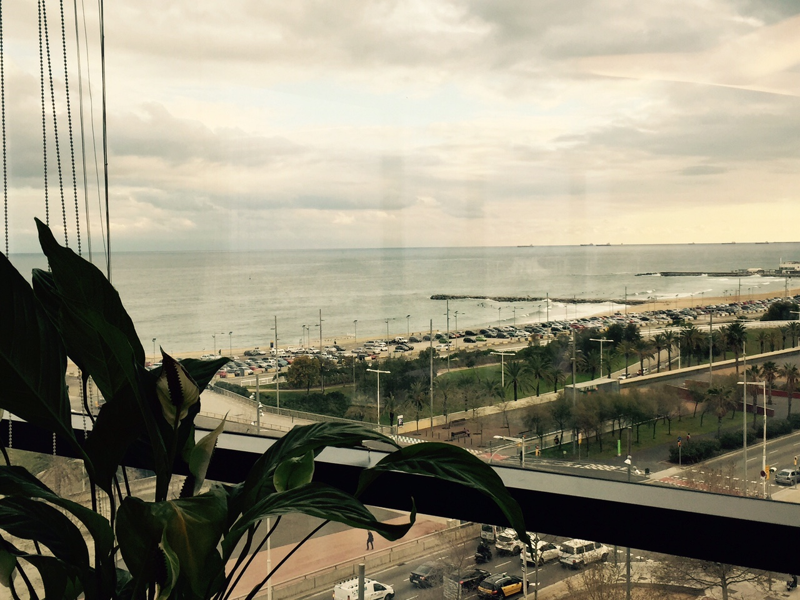
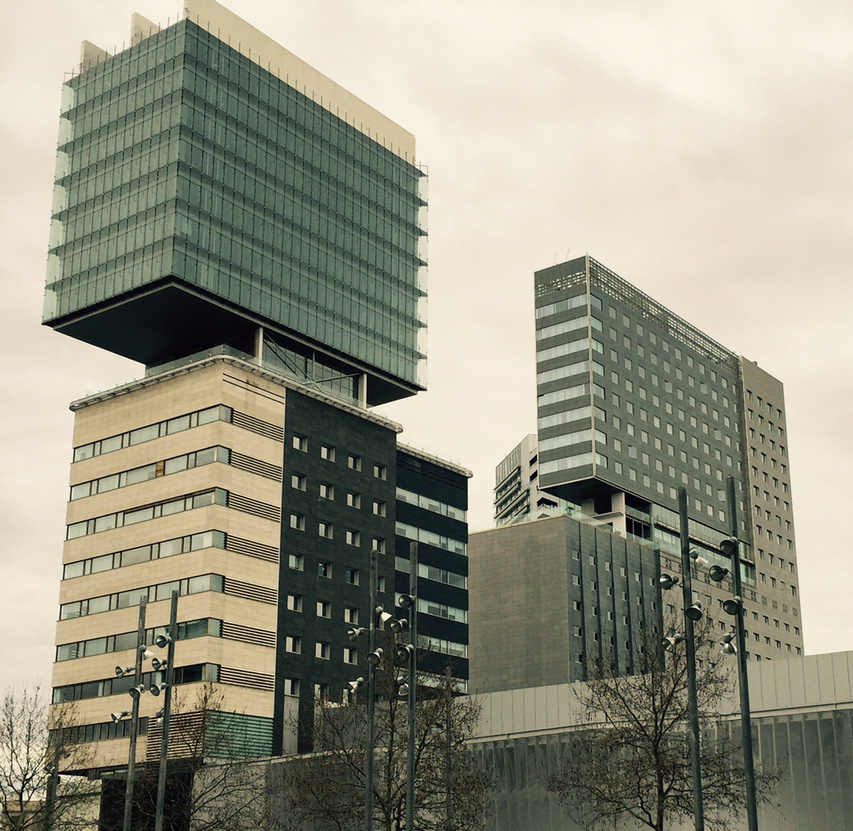
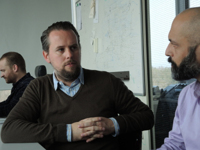

<head>
<meta http-equiv="Content-Type" content="text/html; charset=utf-8">
<link rel="stylesheet" type="text/css" href="bc.css">

<!---

-->
</head>

<!---

- check kean's blog post on block research

- blog post accelerator barcelona
  /j/tmp/barcelona/

- Brett Young of
  3-minute video on BuildingSP Demo - REAL Conference 2016
  https://www.youtube.com/watch?v=Xb9g9vufMcI
  This is a demonstration of Reality Computing, Building Information Modeling (BIM), and Generative Design. We algorithmically route MEPS systems through a mechanical room that has been characterized by a point cloud. More information at http://www.buildingsp.com and on twitter at @genmep and @youngbrettyoung.
  2-minute video on
  BuildingSP Demo: MEP Autorouting within Point Cloud and Autodesk Revit
  https://www.youtube.com/watch?v=yXz84VbQuZ8
  Published on 10 Mar 2016
  This demo shows the clash-free auto-routing of electrical conduit through both a point cloud and architectural geometry created in Revit. More information at http://www.buildingsp.com and on twitter at @youngbrettyoung and @genmep.

- 11571635 [API issue with linked files on open detached of central file from network drive]

- Keith White <keith.white@autodesk.com> Re: Revit API Question

- busy with Revit cases, as always, and wishing I could further pursue my TrackChangesCloud project, which I also want to continue towards database and cloud areas:

https://github.com/jeremytammik/TrackChangesCloud

By the way, it has already made its way into a first commercial application:

https://twitter.com/BNIM_IS/status/699971782904664064

ADN Becomes Forge and Barcelona Accelerator #revitAPI #3dwebcoder @AutodeskRevit #adsk @adskForge #3dwebaccel

Our fearless leader Jim Quanci already
explained the importance of our Forge platform and his vision
of the future of making things.
Now, after more than 20 years, the time has come to change the name of our team, ADN, the Autodesk Developer Network
&ndash; It's time for a change &ndash; Forge and Cloud
&ndash; Forge Accelerator in Barcelona
&ndash; The Block Research Group at ETHZ...

-->

### ADN Becomes Forge and Barcelona Accelerator

- [It's time for a change &ndash; Forge and Cloud](#2)
- [Forge Accelerator in Barcelona](#3)
- [The Block Research Group at ETHZ](#4)

#### It's Time for a Change &ndash; Forge and Cloud

Our fearless leader [Jim Quanci](http://dances-with-elephants.typepad.com/blog/about-the-author.html) already
explained the importance of our [Forge](http://forge.autodesk.com) platform and his vision
of [the future of making things](http://the3dwebcoder.typepad.com/blog/2016/02/future-of-making-things-iot-forge-devcon.html).

Now, after more than 20 years, the time has come to change the name of our team, ADN, the Autodesk Developer Network.

The team that Jim and I and all my colleagues are part of, supporting Autodesk partner developers and their programming efforts, is now the

Forge Partner Development team

That makes me a Forge Evangelist, Forge Engineer and Forge Consultant.

This is a clear bold statement to all our partners &ndash; the future is on the cloud.

We obviously continue happily helping with our desktop APIs, such as the Revit API, and the move of our ecosystem to the cloud is obviously going to take a number of years.

The ADN Program continues onward, desktop centric, for developers working with Autodesk desktop platforms, while the new cloud centric Forge Program is available for developers working with our cloud services.

We have a clear vision of the way forward with a stronger focus on evangelism than product support.

<i>

 Le Roi est mort, vive le Roi!
 The King is dead, long live the King!

</i>

#### Forge Accelerator in Barcelona

Following up on the success of the  previous cloud accelerator classes, we are delighted to announce our next one-week
intensive [Cloud and Forge Accelerator](http://autodeskcloudaccelerator.com) taking
place in Europe in Barcelona May 16-20, 2016.

For more information and to apply to participate, please go to

[autodeskcloudaccelerator.com](http://autodeskcloudaccelerator.com)

We are hosting it in the beautiful Autodesk seafront office in the centre of town:

The office building is quite interesting as well:

If your application is accepted, you will be invited to spend the week with us in our office working on your own projects making use of Forge APIs, with direct interactive help from the Forge Partner Development team. The Autodesk Forge APIs include the View and Data, BIM 360, AutoCAD I/O, Autodesk InfraWorks 360, RecCap Photo and Fusion 360 APIs.

This is a great opportunity to accelerate your development with face-to-face advice and support from Autodesk cloud technology experts.

To learn more about the benefits of this program, hear first-hand from participants in the previous events, on how they benefited by attending, <a href="http://autodeskcloudaccelerator.com/participantsmarch2015">watch the videos.</a>

I will be attending and would love to meet and work with you there!

Good luck with your application!

#### The Block Research Group at ETHZ

I spent Tuesday morning together with Philipp Mueller, Autodesk Education team, Peter Schlipf, Forge Partner Development team
and [Kean Walmsley](http://through-the-interface.typepad.com/through_the_interface) visiting
a exciting architectural research group at the technical university ETH in Zurich,
[ETHZ](https://www.ethz.ch):

The [Block Research Group](http://www.block.arch.ethz.ch)
around [Prof. Dr. Philippe Block](http://www.block.arch.ethz.ch/brg/people/philippe-block)
specialises on analysis of masonry structures, graphical analysis and design methods, computational form finding and structural design, discrete element assemblies, and fabrication and construction technologies.

Kean described the meeting in more depth talking about
the [visit to the Block Research Group](http://through-the-interface.typepad.com/through_the_interface/2016/03/back-to-ethz-to-visit-the-block-research-group.html),
including some pictures of the exciting experiments and prototypes being worked on in the research lab.

Here is Philippe in discussion with Kean, and [Dr. Tom Van Mele](http://www.block.arch.ethz.ch/brg/people/tom-van-mele) happily plugging away in the background:

