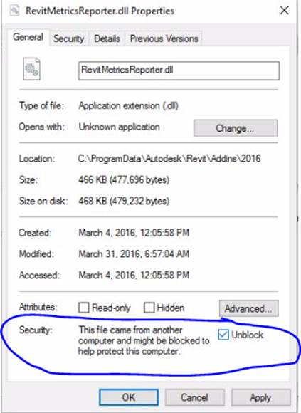

<head>
<meta http-equiv="Content-Type" content="text/html; charset=utf-8">
<link rel="stylesheet" type="text/css" href="bc.css">

<!---

-->
</head>

<!---

- Tim Burnham RE: Solved: Revit 2016 Plugin under Win10

Windows 10 Security Blocks External Command #revitAPI #3dwebcoder @AutodeskRevit #adsk #aec #bim #win10

Here is a Revit API add-in installation issue that came up in various forms in the past and now again in the context of Windows 10 configuration: I have a plugin that has been working fine for all pre-Windows 10 platforms. Under Win10, the DLL loads into Revit.exe correctly. The add-in manifest contents are displayed correctly in the Revit UI. When I issue the command, however, nothing happens...

-->

### .NET Runtime Security Blocks External Command

Here is a Revit API add-in installation issue that came up in various forms in the past and was now raised and resolved once again by Tim Burnham in the special context of .NET Runtime 4.0 configuration:

**Question:** I have a plugin that has been working fine for for several years now on all pre-Windows 10 platforms.

Under Win10, the DLL loads into Revit.exe correctly.
The `.addin` add-in manifest contents are displayed correctly in the Revit UI.
When I issue the command, however, nothing happens.

I trimmed down all dependencies and code to simply display a message box when the command is launched.

Still no luck.

Are there any known Windows 10 issues for Revit plugins, or Security issues that would prevent a command from being executed?

SP2 is installed.

I don’t think Revit 2016 is officially supported on Windows 10, but this is a really important project and Win 10 is the project platform.

Any hints on resolving this?

**Answer:** I have a solution for my plugin not running.

It was indeed security related, and apparently a common one with regards to Autodesk plugins since .NET 4.0 was released.

After snooping around the journal files I saw this:

<pre>
Jrn.RibbonEvent "Execute external command:aaa9bd72-930c-4da5-8305-94cde3a1c3ee:CommandRevitMetricsReporter"
' 0:&lt; DBG_WARN: Could not load file or assembly 'file:///C:\Program Files\Autodesk\Revit 2016\RevitMetricsReporter.dll' or one of its dependencies. Operation is not supported. (Exception from HRESULT: 0x80131515): line 188 of AddIn\AddInItem.cpp.
</pre>

The `HRESULT` error code `0x80131515` led me to a couple of solutions:

#### Solution #1

Add the following to the `revit.exe.config` file:

<pre>
&nbsp; &lt;runtime&gt;
&nbsp; &nbsp; &lt;loadFromRemoteSources enabled=&quot;true&quot; /&gt;
&nbsp; &lt;/runtime&gt;
</pre>

This will apply to all plugins, so beware!

#### Solution #2

Unblock the DLL individually via its Windows properties.

This Block/Unblock property will only show itself if the component was unzipped or downloaded from the web.

Apparently .NET doesn’t distinguish between the two and will provide fewer privileges for the DLL when you attempt to load and run it.

#### Solution #3

Another option would be to deploy the add-in via a simple MSI installer package.

DLLs deployed via an installer are not automatically blocked by Windows, unlike simple deployment via a zip file.

I am currently developing an MSI package for this to avoid future headache.

Jeremy adds: Closely related issues arose repeatedly in the past.

I first mentioned it in relation to
the [Revit Add-in file load exception](http://thebuildingcoder.typepad.com/blog/2011/10/revit-add-in-file-load-exception.html) loading
the RevitPythonShell on some non-XP machines,
and [Kean Walmsley](http://through-the-interface.typepad.com) provided
a comprehensive explanation of it back in 2011
to [unblock ZIP files before installing Plugins of the Month](http://labs.blogs.com/its_alive_in_the_lab/2011/05/unblock-net.html) from
Autodesk Labs.

**Addendum:** For a little more background information, pleaase refer to this StackOverflow thread on how to [detect if a file has been blocked by the operating system](http://stackoverflow.com/questions/17527347/detect-if-a-file-has-been-blocked-by-the-operating-system).