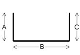

<head>
<meta http-equiv="Content-Type" content="text/html; charset=utf-8">
<link rel="stylesheet" type="text/css" href="bc.css">
<script src="run_prettify.js" type="text/javascript"></script>
<!---
<script src="https://google-code-prettify.googlecode.com/svn/loader/run_prettify.js" type="text/javascript"></script>
-->
</head>

<!---

- 11596362 [Getting the location of hooks in a rebar shape family]
  http://forums.autodesk.com/t5/revit-api/getting-the-location-of-hooks-in-a-rebar-shape-family/m-p/6210752

Location of Hooks in a Rebar Shape Family #revitAPI #3dwebcoder @AutodeskRevit #adsk #aec #bim @RevitStructure

Here is a slightly tricky structural rebar Revit API issue raised in the Revit API discussion forum thread on getting the location of hooks in a rebar shape family: When editing a Rebar Shape family I would like to find out what lines in the family the hooks are attached to. In other words I would like the id of the line the start hook is attached to and the coordinate of this hook...

-->

### Location of Hooks in a Rebar Shape Family

Here is a slightly tricky structural rebar Revit API issue raised by Frode and answered by Tiberiu Pinzariu, Senior Software Engineer at Autodesk, in
the [Revit API discussion forum](http://forums.autodesk.com/t5/revit-api/bd-p/160) thread
on [getting the location of hooks in a rebar shape family](http://forums.autodesk.com/t5/revit-api/getting-the-location-of-hooks-in-a-rebar-shape-family/m-p/6210752):

**Question:** When editing a Rebar Shape family I would like to find out what lines in the family the hooks are attached to. In other words I would like the id of the line the start hook is attached to and the coordinate of this hook.

I have written code to edit the family and I do find the rebar lines and the dimensions, but I cannot find any way to locate the placement of the hooks. Any help is appreciated.

**Answer:** After further investigations I found that this is indeed a tricky subject.

There is no clear/easy way to obtain what the user asked for. (I could not find any API methods for retrieving the position of the hooks in relation to the RebarShape Family lines).

It would be helpful to know more high-level details about what the user wants to obtain.

Could you provide me a scenario?

I am thinking of this one but I need to be sure this is what the user wants.

The user wants to edit the shape family so that all rebars in the model will get a hook at a certain/expected end.

These details would help us decide if need to implement a new method for API, or if we can suggest some other solutions.

**Response:** What we are trying to do here is to create images of the rebars that will be used in a report. We are able to produce the image shown below, but we would like to be able to put hooks on the image as well. The actual geometry of the hook is not that important. What we need is the hook angle, what end is "Hook at Start" connected to and what is the orientation of the hook.

The code is too long to show here, but what we do is to call EditFamily on the shape. Then we create the rebar shape from the model lines in the family. The dimension lines and text are created from the dimension elements. If there are other ways to create this image we will be very happy. Please note that we need both the hooks and the dimensions in our figure:

<center>

</center>

**Answer:** You can get the shape centrelines (without hooks) in order (from start to end) with the following method:

<pre class="code">
&nbsp; <span class="teal">IList</span>&lt;<span class="teal">Curve</span>&gt; curvesForBrowser = rebarShape.GetCurvesForBrowser();
</pre>

Note: You should be able to retrieve the RebarShape element from the family document.

Hook information can be retrieved through these methods:

<pre class="code">
&nbsp; <span class="blue">int</span> hookangle0 = rebarShape.GetDefaultHookAngle( 0 );
&nbsp; <span class="teal">RebarHookOrientation</span> orient0 = rebarShape.GetDefaultHookOrientation( 0 );
&nbsp;
&nbsp; <span class="blue">int</span> hookangle1 = rebarShape.GetDefaultHookAngle( 1 );
&nbsp; <span class="teal">RebarHookOrientation</span> orient1 = rebarShape.GetDefaultHookOrientation( 1 );
</pre>

Hook position should be as follows:

- Start hook origin point is:
```
curvesForBrowser[0].GetEndPoint(0);
```
- End hook origin point is:
```
curvesForBrowser[curveSize -1].GetEndPoint(1);
```

The connection between the curvesForBrowser and the dimensions in the family can be retrieved like this:

First, map the dimensions to their label parameter ids.

<pre class="code">
  IDictionary<ElementId, ElementId> labelParamIdToDimId = new Dictionary<ElementId, ElementId>();
  foreach (Dimension dim in familyDimensions)
  {
    try
    {
      FamilyParameter famParam = dim.FamilyLabel;
      if (null == famParam)
        continue;
      labelParamIdToDimId[famParam.Id] = dim.Id;
    }
    catch (Autodesk.Revit.Exceptions.InvalidOperationException)
    {
      continue;
    }
  }
</pre>

Secondly, retrieve the constraint information from the shape definition.

<pre class="code">
  // Get the shape definition : constraints should be available for every definition.
  // Get all the shape segments (indexes of segments) and their corresponding constraint parameter ids
  // The RebarShapeSegment should be in the same order as the curvesForBrowser.
  // The constraint param ids  should correspond to the dimension label param ids.

  RebarShapeDefinitionBySegments defBySeg = rebarShape.GetRebarShapeDefinition() as RebarShapeDefinitionBySegments;

  IDictionary<int, string> segmentPosToLabel = new Dictionary<int, string>();
  for (int ii = 0; ii < defBySeg.NumberOfSegments; ii++)
  {
    RebarShapeSegment seg = defBySeg.GetSegment(ii);
    IList<RebarShapeConstraint> constraints = seg.GetConstraints();
    foreach (RebarShapeConstraint constraint in constraints)
    {
      ElementId paramID = constraint.GetParamId();
      if ((paramID == ElementId.InvalidElementId) || !labelParamIdToDimId.ContainsKey(paramID))
        continue;

      string labelName = "";
      foreach (Parameter param in rebarShape.Parameters)
      {
        if (param.Id == paramID)
        {
          labelName = param.Definition.Name;
          break;
        }
      }
      segmentPosToLabel.Add(ii, labelName);
    }
  }
</pre>

Finally, create and retrieve all the curves and their corresponding dimensions:

<pre class="code">
  IList<Curve> curvesForPicture = new List<Curve>();
  for (int ii = 0; ii < defBySeg.NumberOfSegments; ii++)
  {
    Curve curve = curvesForBrowser[ii];
    string label = "";
    if (!segmentPosToLabel.TryGetValue(ii, out label))
      continue;
  }
</pre>

Many thanks to Tibi for the in-depth research required to solve this!
