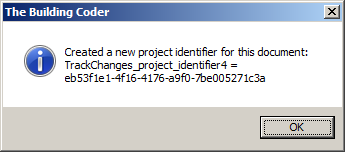

<head>
<meta http-equiv="Content-Type" content="text/html; charset=utf-8">
<link rel="stylesheet" type="text/css" href="bc.css">

<!--

-->
</head>

<!---

Named Guid Storage for Project Identification #revitAPI #3dwebcoder @AutodeskRevit #adsk #aec #bim

I want to continue working on the TrackChangesCloud project asap.
So far, it only consists of the Revit add-in to determine and list the changes made to the BIM.
The interesting part will be to store the results in a cloud database for analysis and reporting.
A prerequisite for that is a reliable way to identify Revit project documents.
I already explored that topic when starting to implement the FireRatingCloud sample...

-->

### Named Guid Storage for Project Identification

I want to continue working on
the [TrackChangesCloud](https://github.com/jeremytammik/TrackChangesCloud) project asap.

So far, it only consists of the Revit add-in to determine and list the changes made to the BIM.

The interesting part will be to store the results in a cloud database for analysis and reporting.

A prerequisite for that is a reliable way to identify Revit project documents.

I already explored that topic
when [starting to implement](http://thebuildingcoder.typepad.com/blog/2015/07/firerating-and-the-revit-python-shell-in-the-cloud-as-web-servers.html#4)
the [FireRatingCloud](https://github.com/jeremytammik/FireRatingCloud) sample, writing
about [implementing Mongo database relationships](http://the3dwebcoder.typepad.com/blog/2015/07/implementing-mongo-database-relationships.html)
and [identifying a RVT project](http://the3dwebcoder.typepad.com/blog/2015/07/implementing-mongo-database-relationships.html#2).

I was not completely happy with that solution, and have not heard of any really perfect way to achieve what I want, so I decided to try a different tack this time:

Simply create my own Guid for the current Revit project and use that to identify it globally forever after.

Actually, I decided for a slightly more generic approach, supporting 'named Guid storage'.

I define an extensible storage schema named `JtNamedGuidStorageSchema` that just stores one single Guid object.

To create a new project identifier, I create a GUID and store it in an extensible storage entity with that schema on a Revit `DataStorage` element with a specific element name, e.g., `TrackChanges_project_identifier`.

To search for an existing project identifier, I can filter for all data storage elements with extensible storage entities containing data matching our specific schema and with the given element name.

One danger in this approach is that an existing project that already defines its own identifier might be copied to one or more follow-up projects so that its identifier is retained and reused.

Ah well, I guess I will live with that.

#### JtNamedGuidStorage Implementation Class

Here is the new `JtNamedGuidStorage` class that I just implemented and added
to [The Building Coder samples](https://github.com/jeremytammik/the_building_coder_samples):

<pre class="code">
class JtNamedGuidStorage
{
&nbsp; /// &lt;summary&gt;
&nbsp; /// The extensible storage schema, 
&nbsp; /// containing one single Guid field.
&nbsp; /// &lt;/summary&gt;
&nbsp; public static class JtNamedGuidStorageSchema
&nbsp; {
&nbsp; &nbsp; public readonly static Guid SchemaGuid = new Guid(
&nbsp; &nbsp; &nbsp; &quot;{5F374308-9C59-42AE-ACC3-A77EF45EC146}&quot; );
&nbsp;
&nbsp; &nbsp; /// &lt;summary&gt;
&nbsp; &nbsp; /// Retrieve our extensible storage schema 
&nbsp; &nbsp; /// or optionally create a new one if it does
&nbsp; &nbsp; /// not yet exist.
&nbsp; &nbsp; /// &lt;/summary&gt;
&nbsp; &nbsp; public static Schema GetSchema(
&nbsp; &nbsp; &nbsp; bool create = true )
&nbsp; &nbsp; {
&nbsp; &nbsp; &nbsp; Schema schema = Schema.Lookup( SchemaGuid );
&nbsp;
&nbsp; &nbsp; &nbsp; if( create &amp;&amp; null == schema )
&nbsp; &nbsp; &nbsp; {
&nbsp; &nbsp; &nbsp; &nbsp; SchemaBuilder schemaBuilder =
&nbsp; &nbsp; &nbsp; &nbsp; &nbsp; new SchemaBuilder( SchemaGuid );
&nbsp;
&nbsp; &nbsp; &nbsp; &nbsp; schemaBuilder.SetSchemaName(
&nbsp; &nbsp; &nbsp; &nbsp; &nbsp; &quot;JtNamedGuidStorage&quot; );
&nbsp;
&nbsp; &nbsp; &nbsp; &nbsp; schemaBuilder.AddSimpleField(
&nbsp; &nbsp; &nbsp; &nbsp; &nbsp; &quot;Guid&quot;, typeof( Guid ) );
&nbsp;
&nbsp; &nbsp; &nbsp; &nbsp; schema = schemaBuilder.Finish();
&nbsp; &nbsp; &nbsp; }
&nbsp; &nbsp; &nbsp; return schema;
&nbsp; &nbsp; }
&nbsp; }
&nbsp;
&nbsp; /// &lt;summary&gt;
&nbsp; /// Retrieve an existing named Guid 
&nbsp; /// in the specified Revit document or
&nbsp; /// optionally create and return a new
&nbsp; /// one if it does not yet exist.
&nbsp; /// &lt;/summary&gt;
&nbsp; public static bool Get(
&nbsp; &nbsp; Document doc,
&nbsp; &nbsp; string name,
&nbsp; &nbsp; out Guid guid,
&nbsp; &nbsp; bool create = true )
&nbsp; {
&nbsp; &nbsp; bool rc = false;
&nbsp;
&nbsp; &nbsp; guid = Guid.Empty;
&nbsp;
&nbsp; &nbsp; // Retrieve a DataStorage element with our
&nbsp; &nbsp; // extensible storage entity attached to it
&nbsp; &nbsp; // and the specified element name.
&nbsp;
&nbsp; &nbsp; ExtensibleStorageFilter f
&nbsp; &nbsp; &nbsp; = new ExtensibleStorageFilter(
&nbsp; &nbsp; &nbsp; &nbsp; JtNamedGuidStorageSchema.SchemaGuid );
&nbsp;
&nbsp; &nbsp; DataStorage dataStorage
&nbsp; &nbsp; &nbsp; = new FilteredElementCollector( doc )
&nbsp; &nbsp; &nbsp; &nbsp; .OfClass( typeof( DataStorage ) )
&nbsp; &nbsp; &nbsp; &nbsp; .WherePasses( f )
&nbsp; &nbsp; &nbsp; &nbsp; .Where&lt;Element&gt;( e =&gt; name.Equals( e.Name ) )
&nbsp; &nbsp; &nbsp; &nbsp; .FirstOrDefault&lt;Element&gt;() as DataStorage;
&nbsp;
&nbsp; &nbsp; if( dataStorage == null )
&nbsp; &nbsp; {
&nbsp; &nbsp; &nbsp; if( create )
&nbsp; &nbsp; &nbsp; {
&nbsp; &nbsp; &nbsp; &nbsp; using( Transaction t = new Transaction(
&nbsp; &nbsp; &nbsp; &nbsp; &nbsp; doc, &quot;Create named Guid storage&quot; ) )
&nbsp; &nbsp; &nbsp; &nbsp; {
&nbsp; &nbsp; &nbsp; &nbsp; &nbsp; t.Start();
&nbsp;
&nbsp; &nbsp; &nbsp; &nbsp; &nbsp; // Create named data storage element
&nbsp;
&nbsp; &nbsp; &nbsp; &nbsp; &nbsp; dataStorage = DataStorage.Create( doc );
&nbsp; &nbsp; &nbsp; &nbsp; &nbsp; dataStorage.Name = name;
&nbsp;
&nbsp; &nbsp; &nbsp; &nbsp; &nbsp; // Create entity to store the Guid data
&nbsp;
&nbsp; &nbsp; &nbsp; &nbsp; &nbsp; Entity entity = new Entity(
&nbsp; &nbsp; &nbsp; &nbsp; &nbsp; &nbsp; JtNamedGuidStorageSchema.GetSchema() );
&nbsp;
&nbsp; &nbsp; &nbsp; &nbsp; &nbsp; entity.Set( &quot;Guid&quot;, guid = Guid.NewGuid() );
&nbsp;
&nbsp; &nbsp; &nbsp; &nbsp; &nbsp; // Set entity to the data storage element
&nbsp;
&nbsp; &nbsp; &nbsp; &nbsp; &nbsp; dataStorage.SetEntity( entity );
&nbsp;
&nbsp; &nbsp; &nbsp; &nbsp; &nbsp; t.Commit();
&nbsp;
&nbsp; &nbsp; &nbsp; &nbsp; &nbsp; rc = true;
&nbsp; &nbsp; &nbsp; &nbsp; }
&nbsp; &nbsp; &nbsp; }
&nbsp; &nbsp; }
&nbsp; &nbsp; else
&nbsp; &nbsp; {
&nbsp; &nbsp; &nbsp; // Retrieve entity from the data storage element.
&nbsp;
&nbsp; &nbsp; &nbsp; Entity entity = dataStorage.GetEntity(
&nbsp; &nbsp; &nbsp; &nbsp; JtNamedGuidStorageSchema.GetSchema( false ) );
&nbsp;
&nbsp; &nbsp; &nbsp; Debug.Assert( entity.IsValid(),
&nbsp; &nbsp; &nbsp; &nbsp; &quot;expected a valid extensible storage entity&quot; );
&nbsp;
&nbsp; &nbsp; &nbsp; if( entity.IsValid() )
&nbsp; &nbsp; &nbsp; {
&nbsp; &nbsp; &nbsp; &nbsp; guid = entity.Get&lt;Guid&gt;( &quot;Guid&quot; );
&nbsp;
&nbsp; &nbsp; &nbsp; &nbsp; rc = true;
&nbsp; &nbsp; &nbsp; }
&nbsp; &nbsp; }
&nbsp; &nbsp; return rc;
&nbsp; }
}
</pre>

#### CmdNamedGuidStorage Test Command

As you can see, the implementation defines one single public entry point `Get`.

By default, it retrieves an existing named Guid from the given Revit document, and creates a new one if none already exists.

The creation can be suppressed by passing a `false` value for the `create` argument.

I exercise it in the trivial external command `CmdNamedGuidStorage` as follows:

<pre class="code">
&nbsp; Result rslt = Result.Failed;
&nbsp;
&nbsp; string name = &quot;TrackChanges_project_identifier&quot;;
&nbsp; Guid named_guid;
&nbsp;
&nbsp; bool rc = JtNamedGuidStorage.Get( doc,
&nbsp; &nbsp; name, out named_guid, false );
&nbsp;
&nbsp; if( rc )
&nbsp; {
&nbsp; &nbsp; Util.InfoMsg( string.Format(
&nbsp; &nbsp; &nbsp; &quot;This document already has a project &quot;
&nbsp; &nbsp; &nbsp; + &quot;identifier: {0} = {1}&quot;,
&nbsp; &nbsp; &nbsp; name, named_guid.ToString() ) );
&nbsp;
&nbsp; &nbsp; rslt = Result.Succeeded;
&nbsp; }
&nbsp; else
&nbsp; {
&nbsp; &nbsp; rc = JtNamedGuidStorage.Get( doc,
&nbsp; &nbsp; &nbsp; name, out named_guid, true );
&nbsp;
&nbsp; &nbsp; if( rc )
&nbsp; &nbsp; {
&nbsp; &nbsp; &nbsp; Util.InfoMsg( string.Format(
&nbsp; &nbsp; &nbsp; &nbsp; &quot;Created a new project identifier &quot;
&nbsp; &nbsp; &nbsp; &nbsp; + &quot;for this document: {0} = {1}&quot;,
&nbsp; &nbsp; &nbsp; &nbsp; name, named_guid.ToString() ) );
&nbsp;
&nbsp; &nbsp; &nbsp; rslt = Result.Succeeded;
&nbsp; &nbsp; }
&nbsp; &nbsp; else
&nbsp; &nbsp; {
&nbsp; &nbsp; &nbsp; Util.ErrorMsg( &quot;Something went wrong&quot; );
&nbsp; &nbsp; }
&nbsp; }
&nbsp; return rslt;
</pre>

Here is the message box displayed and logged on the Visual Studio debug output console by the test command on creating a new named Guid storage:

A similar message is generated on retrieving an existing identifier:

<pre>
This document already has a project identifier: TrackChanges_project_identifier = 4223cc56-e6ae-4ab9-92da-1da69c72bd10
</pre>

The new functionality discussed above is included
in [The Building Coder samples](https://github.com/jeremytammik/the_building_coder_samples)
[release 2016.0.127.1](https://github.com/jeremytammik/the_building_coder_samples/releases/tag/2016.0.127.1).

I look forward to hearing what you think of it.
Thank you in advance for any comments you may have.

Now I am excited to get going with the TrackChangesCloud project again, after spending a lot of time last week answering Revit cases
and [Revit API discussion forum](http://forums.autodesk.com/t5/revit-api/bd-p/160) questions.

