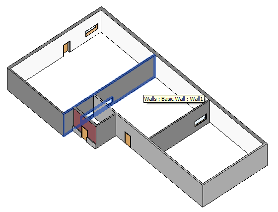
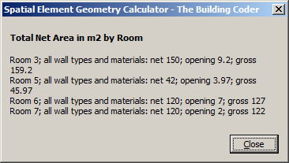
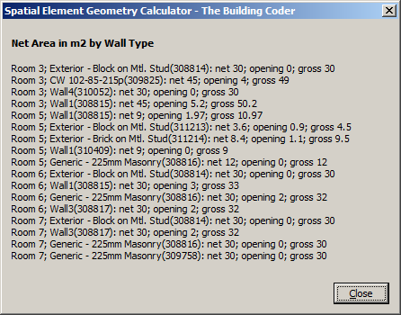

<head>
<meta http-equiv="Content-Type" content="text/html; charset=utf-8">
<link rel="stylesheet" type="text/css" href="bc.css">

<!--

-->
</head>

<!---

- why Autodesk has a Labs
  I want to get the word out broadly as to why Autodesk has a Labs. I considered writing a Medium blog article, but rather than create yet another avenue, Dan Zucker suggested that I simply write an article on my blog:
  http://labs.blogs.com/its_alive_in_the_lab/2016/04/why-does-autodesk-have-a-labs.html

- http://blogs.autodesk.com/dalbiminpoi
  It's my pleasure to announce a new blog dedicated to AEC in Italy (and in Italian), administrated by Stefano Toparini, authored by Ilaria lagazio and Stefano :
  "dal BIM in poi" means "Beyond BIM".
  Ilaria and Stefano will post there in order to drive and help adoption of our BIM Solutions in Italy.
  STEFANO TOPARINI
  Stefano si occupa da molti anni di BIM per le Infrastrutture nonché di reti tecnologiche e di gestione del territorio, con esperienze professionali maturate sia in Italia che all'estero. Lavora nella filiale Italiana di Autodesk Inc. da oltre 10 anni dopo esperienze in varie altre aziende di informatica e servizi nel mondo della progettazione e delle pubbliche amministrazioni.
  ILARIA LAGAZIO
  Laureata in Ingegneria Civile e specializzata in Strutture, dopo una breve esperienza nel campo della progettazione si dedica all’industrializzazione dei sistemi edilizi come Building System Development Manager, gestendo il flusso delle informazioni dei componenti edilizi dal modello al cantiere. L’interesse per l’industrializzazione del cantiere e la gestione del dato progettuale la porta ad una esperienza negli Emirati Arabi e dal 2008 in Autodesk , dove oggi ricopre il ruolo di Senior Technical Sales Specialist

Determining Wall Opening Areas per Room #revitAPI #3dwebcoder @AutodeskRevit #adsk #aec #bim @AutodeskLabs

We continue the rather exhaustive exploration of calculating net and gross wall areas per room, and two other announcements, pointers to interesting sources of information
&ndash; Why Autodesk has a Labs
&ndash; Dal BIM in poi &ndash; Italian BIM
&ndash; Determining wall opening areas per room
&ndash; Håvard's SpatialElementGeometryCalculator enhancement
&ndash; External command mainline
&ndash; Test run...

-->

### Determining Wall Opening Areas per Room

We continue the rather exhaustive exploration of calculating net and gross wall areas per room, and two other announcements, pointers to interesting sources of information besides The Building Coder:

- [Why Autodesk has a Labs](#2)
- [Dal BIM in poi &ndash; Italian BIM](#3)
- [Determining wall opening areas per room](#4)
- [Håvard's SpatialElementGeometryCalculator enhancement](#5)
- [External command mainline](#6)
- [Test run](#7)

#### Why Autodesk has a Labs

I hope you know and appreciate that Autodesk has a Labs, and why.

If not, please refer to Scott Sheppard's
explanation [why Autodesk has a Labs](http://labs.blogs.com/its_alive_in_the_lab/2016/04/why-does-autodesk-have-a-labs.html).

#### Dal BIM in Poi &ndash; Italian BIM

It is my pleasure to announce a new Italian AEC and BIM blog,
[dal BIM in poi](http://blogs.autodesk.com/dalbiminpoi), by Ilaria Lagazio and Stefano Toparini.

'Dal BIM in poi' means 'Beyond BIM'.

*Stefano si occupa da molti anni di BIM per le Infrastrutture nonché di reti tecnologiche e di gestione del territorio, con esperienze professionali maturate sia in Italia che all'estero. Lavora nella filiale Italiana di Autodesk Inc. da oltre 10 anni dopo esperienze in varie altre aziende di informatica e servizi nel mondo della progettazione e delle pubbliche amministrazioni.*

Stefano has been working with BIM for Infrastructure and GIS for many years, with professional experience both in Italy and abroad. He has been with the Italian subsidiary of Autodesk Inc. for over 10 years after experiences in several other computer companies and services in the design and public administration domains.

*Ilaria e Laureata in Ingegneria Civile e specializzata in Strutture, dopo una breve esperienza nel campo della progettazione si dedica all’industrializzazione dei sistemi edilizi come Building System Development Manager, gestendo il flusso delle informazioni dei componenti edilizi dal modello al cantiere. L’interesse per l’industrializzazione del cantiere e la gestione del dato progettuale la porta ad una esperienza negli Emirati Arabi e dal 2008 in Autodesk, dove oggi ricopre il ruolo di Senior Technical Sales Specialist.*

Ilaria graduated in civil engineering and specialised in structures. After a short experience in design she worked as Building System Development Manager, managing the information flow from BIM to construction site. Her interest in efficient construction site and project management took her to the UAE, and from 2008 onwards to Autodesk in the role as Senior Technical Sales Specialist.

I wish the new blog and all its readers all the best and many exciting stories!

#### Determining Wall Opening Areas per Room

As I pointed out last week in the preceding article on this topic, Håvard Dagsvik of the newly renamed Scandinavian AEC and BIM company [Symetri](http://www.symetri.com), previously CAD-Q, invested significant effort in enhancing our joint efforts to determine wall opening areas per room.

Here are links to the previous discussions:

- [Calculating gross and net wall areas](http://thebuildingcoder.typepad.com/blog/2015/03/calculating-gross-and-net-wall-areas.html)
- [IFCExportUtils to determine the door and window area](http://thebuildingcoder.typepad.com/blog/2015/03/ifcexportutils-methods-determine-door-and-window-area.html)
- [Determining wall cut area for a specific room](http://thebuildingcoder.typepad.com/blog/2016/04/determining-wall-cut-area-for-a-specific-room.html)

The results are captured in these two Revit add-in projects and GitHub repositories:

- [SpatialElementGeometryCalculator](https://github.com/jeremytammik/SpatialElementGeometryCalculator)
- [ExporterIfcUtilsWinArea](https://github.com/jeremytammik/ExporterIfcUtilsWinArea)

#### Håvard's SpatialElementGeometryCalculator Enhancement

I integrated Håvard's final running test code into
the [SpatialElementGeometryCalculator project](https://github.com/jeremytammik/SpatialElementGeometryCalculator) and
am very happy to present the following results that you can now reproduce yourself as well.

In Håvard's own words:

Here it is.

Simplified and cleaned up.

I couldn’t use the existing dictionary so I implemented a small class `SpatialBoundaryCache` to cache the core spatial data.

I demonstrate how you can structure and present the resulting data, areas square metres, in three different ways:

- By room
- By wall type
- By wall material

Material is my choice because I need to know if the surface is plaster or concrete &ndash; note that walls can have different layers on each side.

Just as before, I use both geometric analysis based on the wall solids as well as the IFC utility classes for the calculations.

I removed the `GetAreaFromFamilyParameters` method because it is somewhat unreliable and I already use the IFC utils instead.

I also used your `IsInRoom` method instead of mine.

In the long run, I think all of it will be just solid intersections also IsInRoom.

Both stacked walls and embedded curtain walls are handled, though probably not yet an embedded curtain wall within a stacked wall.

That could be solved following the same solid intersection logic.

I am quite sure there is still room for improvement in the opening handler.

Take a look and see what you make of it &nbsp; :-)

I am attaching [the sample file](zip/SpatialElementGeometryCalculatorTest.rvt) that I worked with as well.

Many thanks to Håvard for his research, hard work, and sharing this!

I integrated Håvard's functionality in the
public  [SpatialElementGeometryCalculator GitHub project](https://github.com/jeremytammik/SpatialElementGeometryCalculator),
in [release 2016.0.0.3](https://github.com/jeremytammik/SpatialElementGeometryCalculator/releases/tag/2016.0.0.3).

#### External Command Mainline

The main execute method demonstrates how to:

- Retrieve the rooms from the model
- Run the `SpatialElementGeometryCalculator` calculator
- Retrieve the results
- Extract, sort and report the data

Here is the complete implementation:

<pre class="code">
public Result Execute(
&nbsp; ExternalCommandData commandData,
&nbsp; ref string message,
&nbsp; ElementSet elements )
{
&nbsp; UIApplication uiapp = commandData.Application;
&nbsp; Document doc = uiapp.ActiveUIDocument.Document;
&nbsp; Result rc;
&nbsp;
&nbsp; try
&nbsp; {
&nbsp; &nbsp; SpatialElementBoundaryOptions sebOptions
&nbsp; &nbsp; &nbsp; = new SpatialElementBoundaryOptions {
&nbsp; &nbsp; &nbsp; &nbsp; SpatialElementBoundaryLocation
&nbsp; &nbsp; &nbsp; &nbsp; &nbsp; = SpatialElementBoundaryLocation.Finish };
&nbsp;
&nbsp; &nbsp; IEnumerable&lt;Element&gt; rooms
&nbsp; &nbsp; &nbsp; = new FilteredElementCollector( doc )
&nbsp; &nbsp; &nbsp; &nbsp; .OfClass( typeof( SpatialElement ) )
&nbsp; &nbsp; &nbsp; &nbsp; .Where&lt;Element&gt;( e =&gt; (e is Room) );
&nbsp;
&nbsp; &nbsp; List&lt;string&gt; compareWallAndRoom = new List&lt;string&gt;();
&nbsp; &nbsp; OpeningHandler openingHandler = new OpeningHandler();
&nbsp;
&nbsp; &nbsp; List&lt;SpatialBoundaryCache&gt; lstSpatialBoundaryCache
&nbsp; &nbsp; &nbsp; = new List&lt;SpatialBoundaryCache&gt;();
&nbsp;
&nbsp; &nbsp; foreach( Room room in rooms )
&nbsp; &nbsp; {
&nbsp; &nbsp; &nbsp; if( room == null ) continue;
&nbsp; &nbsp; &nbsp; if( room.Location == null ) continue;
&nbsp; &nbsp; &nbsp; if( room.Area.Equals( 0 ) ) continue;
&nbsp;
&nbsp; &nbsp; &nbsp; Autodesk.Revit.DB.SpatialElementGeometryCalculator calc =
&nbsp; &nbsp; &nbsp; &nbsp; new Autodesk.Revit.DB.SpatialElementGeometryCalculator(
&nbsp; &nbsp; &nbsp; &nbsp; &nbsp; doc, sebOptions );
&nbsp;
&nbsp; &nbsp; &nbsp; SpatialElementGeometryResults results
&nbsp; &nbsp; &nbsp; &nbsp; = calc.CalculateSpatialElementGeometry(
&nbsp; &nbsp; &nbsp; &nbsp; &nbsp; room );
&nbsp;
&nbsp; &nbsp; &nbsp; Solid roomSolid = results.GetGeometry();
&nbsp;
&nbsp; &nbsp; &nbsp; foreach( Face face in results.GetGeometry().Faces )
&nbsp; &nbsp; &nbsp; {
&nbsp; &nbsp; &nbsp; &nbsp; IList&lt;SpatialElementBoundarySubface&gt; boundaryFaceInfo
&nbsp; &nbsp; &nbsp; &nbsp; &nbsp; = results.GetBoundaryFaceInfo( face );
&nbsp;
&nbsp; &nbsp; &nbsp; &nbsp; foreach( var spatialSubFace in boundaryFaceInfo )
&nbsp; &nbsp; &nbsp; &nbsp; {
&nbsp; &nbsp; &nbsp; &nbsp; &nbsp; if( spatialSubFace.SubfaceType
&nbsp; &nbsp; &nbsp; &nbsp; &nbsp; &nbsp; != SubfaceType.Side )
&nbsp; &nbsp; &nbsp; &nbsp; &nbsp; {
&nbsp; &nbsp; &nbsp; &nbsp; &nbsp; &nbsp; continue;
&nbsp; &nbsp; &nbsp; &nbsp; &nbsp; }
&nbsp;
&nbsp; &nbsp; &nbsp; &nbsp; &nbsp; SpatialBoundaryCache spatialData
&nbsp; &nbsp; &nbsp; &nbsp; &nbsp; &nbsp; = new SpatialBoundaryCache();
&nbsp;
&nbsp; &nbsp; &nbsp; &nbsp; &nbsp; Wall wall = doc.GetElement( spatialSubFace
&nbsp; &nbsp; &nbsp; &nbsp; &nbsp; &nbsp; .SpatialBoundaryElement.HostElementId )
&nbsp; &nbsp; &nbsp; &nbsp; &nbsp; &nbsp; &nbsp; as Wall;
&nbsp;
&nbsp; &nbsp; &nbsp; &nbsp; &nbsp; if( wall == null )
&nbsp; &nbsp; &nbsp; &nbsp; &nbsp; {
&nbsp; &nbsp; &nbsp; &nbsp; &nbsp; &nbsp; continue;
&nbsp; &nbsp; &nbsp; &nbsp; &nbsp; }
&nbsp;
&nbsp; &nbsp; &nbsp; &nbsp; &nbsp; WallType wallType = doc.GetElement(
&nbsp; &nbsp; &nbsp; &nbsp; &nbsp; &nbsp; wall.GetTypeId() ) as WallType;
&nbsp;
&nbsp; &nbsp; &nbsp; &nbsp; &nbsp; if( wallType.Kind == WallKind.Curtain )
&nbsp; &nbsp; &nbsp; &nbsp; &nbsp; {
&nbsp; &nbsp; &nbsp; &nbsp; &nbsp; &nbsp; // Leave out, as curtain walls are not painted.
&nbsp;
&nbsp; &nbsp; &nbsp; &nbsp; &nbsp; &nbsp; LogCreator.LogEntry( &quot;WallType is CurtainWall&quot; );
&nbsp;
&nbsp; &nbsp; &nbsp; &nbsp; &nbsp; &nbsp; continue;
&nbsp; &nbsp; &nbsp; &nbsp; &nbsp; }
&nbsp;
&nbsp; &nbsp; &nbsp; &nbsp; &nbsp; HostObject hostObject = wall as HostObject;
&nbsp;
&nbsp; &nbsp; &nbsp; &nbsp; &nbsp; IList&lt;ElementId&gt; insertsThisHost
&nbsp; &nbsp; &nbsp; &nbsp; &nbsp; &nbsp; = hostObject.FindInserts(
&nbsp; &nbsp; &nbsp; &nbsp; &nbsp; &nbsp; &nbsp; true, false, true, true );
&nbsp;
&nbsp; &nbsp; &nbsp; &nbsp; &nbsp; double openingArea = 0;
&nbsp;
&nbsp; &nbsp; &nbsp; &nbsp; &nbsp; foreach( ElementId idInsert in insertsThisHost )
&nbsp; &nbsp; &nbsp; &nbsp; &nbsp; {
&nbsp; &nbsp; &nbsp; &nbsp; &nbsp; &nbsp; string countOnce = room.Id.ToString()
&nbsp; &nbsp; &nbsp; &nbsp; &nbsp; &nbsp; &nbsp; + wall.Id.ToString() + idInsert.ToString();
&nbsp;
&nbsp; &nbsp; &nbsp; &nbsp; &nbsp; &nbsp; if( !compareWallAndRoom.Contains( countOnce ) )
&nbsp; &nbsp; &nbsp; &nbsp; &nbsp; &nbsp; {
&nbsp; &nbsp; &nbsp; &nbsp; &nbsp; &nbsp; &nbsp; Element elemOpening = doc.GetElement(
&nbsp; &nbsp; &nbsp; &nbsp; &nbsp; &nbsp; &nbsp; &nbsp; idInsert ) as Element;
&nbsp;
&nbsp; &nbsp; &nbsp; &nbsp; &nbsp; &nbsp; &nbsp; openingArea = openingArea
&nbsp; &nbsp; &nbsp; &nbsp; &nbsp; &nbsp; &nbsp; &nbsp; + openingHandler.GetOpeningArea(
&nbsp; &nbsp; &nbsp; &nbsp; &nbsp; &nbsp; &nbsp; &nbsp; &nbsp; wall, elemOpening, room, roomSolid );
&nbsp;
&nbsp; &nbsp; &nbsp; &nbsp; &nbsp; &nbsp; &nbsp; compareWallAndRoom.Add( countOnce );
&nbsp; &nbsp; &nbsp; &nbsp; &nbsp; &nbsp; }
&nbsp; &nbsp; &nbsp; &nbsp; &nbsp; }
&nbsp;
&nbsp; &nbsp; &nbsp; &nbsp; &nbsp; // Cache SpatialElementBoundarySubface info.
&nbsp;
&nbsp; &nbsp; &nbsp; &nbsp; &nbsp; spatialData.roomName = room.Name;
&nbsp; &nbsp; &nbsp; &nbsp; &nbsp; spatialData.idElement = wall.Id;
&nbsp; &nbsp; &nbsp; &nbsp; &nbsp; spatialData.idMaterial = spatialSubFace
&nbsp; &nbsp; &nbsp; &nbsp; &nbsp; &nbsp; .GetBoundingElementFace().MaterialElementId;
&nbsp; &nbsp; &nbsp; &nbsp; &nbsp; spatialData.dblNetArea = Util.sqFootToSquareM(
&nbsp; &nbsp; &nbsp; &nbsp; &nbsp; &nbsp; spatialSubFace.GetSubface().Area );
&nbsp; &nbsp; &nbsp; &nbsp; &nbsp; spatialData.dblOpeningArea = Util.sqFootToSquareM(
&nbsp; &nbsp; &nbsp; &nbsp; &nbsp; &nbsp; openingArea );
&nbsp;
&nbsp; &nbsp; &nbsp; &nbsp; &nbsp; lstSpatialBoundaryCache.Add( spatialData );
&nbsp;
&nbsp; &nbsp; &nbsp; &nbsp; } // end foreach subface from which room bounding elements are derived
&nbsp;
&nbsp; &nbsp; &nbsp; } // end foreach Face
&nbsp;
&nbsp; &nbsp; } // end foreach Room
&nbsp;
&nbsp; &nbsp; List&lt;string&gt; t = new List&lt;string&gt;();
&nbsp;
&nbsp; &nbsp; List&lt;SpatialBoundaryCache&gt; groupedData
&nbsp; &nbsp; &nbsp; = SortByRoom( lstSpatialBoundaryCache );
&nbsp;
&nbsp; &nbsp; foreach( SpatialBoundaryCache sbc in groupedData )
&nbsp; &nbsp; {
&nbsp; &nbsp; &nbsp; t.Add( sbc.roomName
&nbsp; &nbsp; &nbsp; &nbsp; + &quot;; all wall types and materials: &quot;
&nbsp; &nbsp; &nbsp; &nbsp; + sbc.AreaReport );
&nbsp; &nbsp; }
&nbsp;
&nbsp; &nbsp; Util.InfoMsg2( &quot;Total Net Area in m2 by Room&quot;,
&nbsp; &nbsp; &nbsp; string.Join(System.Environment.NewLine, t ) );
&nbsp;
&nbsp; &nbsp; t.Clear();
&nbsp;
&nbsp; &nbsp; groupedData = SortByRoomAndWallType(
&nbsp; &nbsp; &nbsp; lstSpatialBoundaryCache );
&nbsp;
&nbsp; &nbsp; foreach( SpatialBoundaryCache sbc in groupedData )
&nbsp; &nbsp; {
&nbsp; &nbsp; &nbsp; Element elemWall = doc.GetElement(
&nbsp; &nbsp; &nbsp; &nbsp; sbc.idElement ) as Element;
&nbsp;
&nbsp; &nbsp; &nbsp; t.Add( sbc.roomName + &quot;; &quot; + elemWall.Name
&nbsp; &nbsp; &nbsp; &nbsp; + &quot;(&quot; + sbc.idElement.ToString() + &quot;): &quot;
&nbsp; &nbsp; &nbsp; &nbsp; + sbc.AreaReport );
&nbsp; &nbsp; }
&nbsp;
&nbsp; &nbsp; Util.InfoMsg2( &quot;Net Area in m2 by Wall Type&quot;,
&nbsp; &nbsp; &nbsp; string.Join( System.Environment.NewLine, t ) );
&nbsp;
&nbsp; &nbsp; t.Clear();
&nbsp;
&nbsp; &nbsp; groupedData = SortByRoomAndMaterial(
&nbsp; &nbsp; &nbsp; lstSpatialBoundaryCache );
&nbsp;
&nbsp; &nbsp; foreach( SpatialBoundaryCache sbc in groupedData )
&nbsp; &nbsp; {
&nbsp; &nbsp; &nbsp; string materialName
&nbsp; &nbsp; &nbsp; &nbsp; = (sbc.idMaterial == ElementId.InvalidElementId)
&nbsp; &nbsp; &nbsp; &nbsp; &nbsp; ? string.Empty
&nbsp; &nbsp; &nbsp; &nbsp; &nbsp; : doc.GetElement( sbc.idMaterial ).Name;
&nbsp;
&nbsp; &nbsp; &nbsp; t.Add( sbc.roomName + &quot;; &quot; + materialName + &quot;: &quot;
&nbsp; &nbsp; &nbsp; &nbsp; + sbc.AreaReport );
&nbsp; &nbsp; }
&nbsp;
&nbsp; &nbsp; Util.InfoMsg2(
&nbsp; &nbsp; &nbsp; &quot;Net Area in m2 by Outer Layer Material&quot;,
&nbsp; &nbsp; &nbsp; string.Join( System.Environment.NewLine, t ) );
&nbsp;
&nbsp; &nbsp; rc = Result.Succeeded;
&nbsp; }
&nbsp; catch( Exception ex )
&nbsp; {
&nbsp; &nbsp; TaskDialog.Show( &quot;Room Boundaries&quot;,
&nbsp; &nbsp; &nbsp; ex.Message + &quot;\r\n&quot; + ex.StackTrace );
&nbsp;
&nbsp; &nbsp; rc = Result.Failed;
&nbsp; }
&nbsp; return rc;
}
&nbsp;
/// &lt;summary&gt;
/// Convert square feet to square meters
/// with two decimal places precision.
/// &lt;/summary&gt;
static double SqFootToSquareM( double sqFoot )
{
&nbsp; return Math.Round( sqFoot * 0.092903, 2 );
}
&nbsp;
List&lt;SpatialBoundaryCache&gt; SortByRoom(
&nbsp; List&lt;SpatialBoundaryCache&gt; lstRawData )
{
&nbsp; var sortedCache
&nbsp; &nbsp; = from rawData in lstRawData
&nbsp; &nbsp; &nbsp; group rawData by new { room = rawData.roomName }
&nbsp; &nbsp; &nbsp; &nbsp; into sortedData
&nbsp; &nbsp; &nbsp; &nbsp; select new SpatialBoundaryCache()
&nbsp; &nbsp; &nbsp; &nbsp; {
&nbsp; &nbsp; &nbsp; &nbsp; &nbsp; roomName = sortedData.Key.room,
&nbsp; &nbsp; &nbsp; &nbsp; &nbsp; idElement = ElementId.InvalidElementId,
&nbsp; &nbsp; &nbsp; &nbsp; &nbsp; dblNetArea = sortedData.Sum( x =&gt; x.dblNetArea ),
&nbsp; &nbsp; &nbsp; &nbsp; &nbsp; dblOpeningArea = sortedData.Sum(
&nbsp; &nbsp; &nbsp; &nbsp; &nbsp; &nbsp; y =&gt; y.dblOpeningArea ),
&nbsp; &nbsp; &nbsp; &nbsp; };
&nbsp;
&nbsp; return sortedCache.ToList();
}
&nbsp;
List&lt;SpatialBoundaryCache&gt; SortByRoomAndWallType(
&nbsp; List&lt;SpatialBoundaryCache&gt; lstRawData )
{
&nbsp; var sortedCache
&nbsp; &nbsp; = from rawData in lstRawData
&nbsp; &nbsp; &nbsp; group rawData by new
&nbsp; &nbsp; &nbsp; {
&nbsp; &nbsp; &nbsp; &nbsp; room = rawData.roomName,
&nbsp; &nbsp; &nbsp; &nbsp; wallid = rawData.idElement
&nbsp; &nbsp; &nbsp; }
&nbsp; &nbsp; &nbsp; &nbsp; into sortedData
&nbsp; &nbsp; &nbsp; &nbsp; select new SpatialBoundaryCache()
&nbsp; &nbsp; &nbsp; &nbsp; {
&nbsp; &nbsp; &nbsp; &nbsp; &nbsp; roomName = sortedData.Key.room,
&nbsp; &nbsp; &nbsp; &nbsp; &nbsp; idElement = sortedData.Key.wallid,
&nbsp; &nbsp; &nbsp; &nbsp; &nbsp; dblNetArea = sortedData.Sum( x =&gt; x.dblNetArea ),
&nbsp; &nbsp; &nbsp; &nbsp; &nbsp; dblOpeningArea = sortedData.Sum(
&nbsp; &nbsp; &nbsp; &nbsp; &nbsp; &nbsp; y =&gt; y.dblOpeningArea ),
&nbsp; &nbsp; &nbsp; &nbsp; };
&nbsp;
&nbsp; return sortedCache.ToList();
}
&nbsp;
List&lt;SpatialBoundaryCache&gt; SortByRoomAndMaterial(
&nbsp; List&lt;SpatialBoundaryCache&gt; lstRawData )
{
&nbsp; var sortedCache
&nbsp; &nbsp; = from rawData in lstRawData
&nbsp; &nbsp; &nbsp; group rawData by new
&nbsp; &nbsp; &nbsp; {
&nbsp; &nbsp; &nbsp; &nbsp; room = rawData.roomName,
&nbsp; &nbsp; &nbsp; &nbsp; mid = rawData.idMaterial
&nbsp; &nbsp; &nbsp; }
&nbsp; &nbsp; &nbsp; &nbsp; into sortedData
&nbsp; &nbsp; &nbsp; &nbsp; select new SpatialBoundaryCache()
&nbsp; &nbsp; &nbsp; &nbsp; {
&nbsp; &nbsp; &nbsp; &nbsp; &nbsp; roomName = sortedData.Key.room,
&nbsp; &nbsp; &nbsp; &nbsp; &nbsp; idMaterial = sortedData.Key.mid,
&nbsp; &nbsp; &nbsp; &nbsp; &nbsp; dblNetArea = sortedData.Sum( x =&gt; x.dblNetArea ),
&nbsp; &nbsp; &nbsp; &nbsp; &nbsp; dblOpeningArea = sortedData.Sum(
&nbsp; &nbsp; &nbsp; &nbsp; &nbsp; &nbsp; y =&gt; y.dblOpeningArea ),
&nbsp; &nbsp; &nbsp; &nbsp; };
&nbsp;
&nbsp; return sortedCache.ToList();
}
</pre>

#### Test Run

Here are the results from a test run on the sample model provided:

The simple test model looks like this in plan view:

In 3D view, you can see the stacked wall and the opening spanning several different spaces:

The results sorted by room, wall type and material are presented in three sequential task dialogues.

The first one, by room, is the simplest:

Each room is bounded by several different wall types:

Finally, here are the areas grouped by material:

For the sake of the search engines and legibility, here are the same results in text form as well, as reported on the Visual Studio debug console:

<pre>
Total Net Area in m2 by Room

Room 3; all wall types and materials: net 150; opening 9.2; gross 159.2
Room 5; all wall types and materials: net 42; opening 3.97; gross 45.97
Room 6; all wall types and materials: net 120; opening 7; gross 127
Room 7; all wall types and materials: net 120; opening 2; gross 122

Net Area in m2 by Wall Type

Room 3; Exterior - Block on Mtl. Stud(308814): net 30; opening 0; gross 30
Room 3; CW 102-85-215p(309825): net 45; opening 4; gross 49
Room 3; Wall4(310052): net 30; opening 0; gross 30
Room 3; Wall1(308815): net 45; opening 5.2; gross 50.2
Room 5; Wall1(308815): net 9; opening 1.97; gross 10.97
Room 5; Exterior - Block on Mtl. Stud(311213): net 3.6; opening 0.9; gross 4.5
Room 5; Exterior - Brick on Mtl. Stud(311214): net 8.4; opening 1.1; gross 9.5
Room 5; Wall1(310409): net 9; opening 0; gross 9
Room 5; Generic - 225mm Masonry(308816): net 12; opening 0; gross 12
Room 6; Exterior - Block on Mtl. Stud(308814): net 30; opening 0; gross 30
Room 6; Wall1(308815): net 30; opening 3; gross 33
Room 6; Generic - 225mm Masonry(308816): net 30; opening 2; gross 32
Room 6; Wall3(308817): net 30; opening 2; gross 32
Room 7; Exterior - Block on Mtl. Stud(308814): net 30; opening 0; gross 30
Room 7; Wall3(308817): net 30; opening 2; gross 32
Room 7; Generic - 225mm Masonry(308816): net 30; opening 0; gross 30
Room 7; Generic - 225mm Masonry(309758): net 30; opening 0; gross 30

Net Area in m2 by Outer Layer Material

Room 3; Gypsum Wall Board: net 75; opening 4; gross 79
Room 3; Default Wall: net 75; opening 5.2; gross 80.2
Room 5; Default Wall: net 18; opening 1.97; gross 19.97
Room 5; Gypsum Wall Board: net 12; opening 2; gross 14
Room 5; Concrete Masonry Units: net 12; opening 0; gross 12
Room 6; Gypsum Wall Board: net 30; opening 0; gross 30
Room 6; Default Wall: net 60; opening 5; gross 65
Room 6; Concrete Masonry Units: net 30; opening 2; gross 32
Room 7; Gypsum Wall Board: net 30; opening 0; gross 30
Room 7; Default Wall: net 30; opening 2; gross 32
Room 7; Concrete Masonry Units: net 60; opening 0; gross 60
</pre>

Wonderful, isn't it?

Thank you again, Håvard!

#### Addendum

[Zhbing0322](https://github.com/zhbing0322) added
a [comment](https://github.com/jeremytammik/SpatialElementGeometryCalculator/commit/18ebcd1283bf64a595505871987c3089d53037e6#commitcomment-19391593) on
a [commit](https://github.com/jeremytammik/SpatialElementGeometryCalculator/commit/18ebcd1283bf64a595505871987c3089d53037e6):

> The result of `spatialSubFace.GetSubface().Area` is the Gross area of the Wall in a room.
