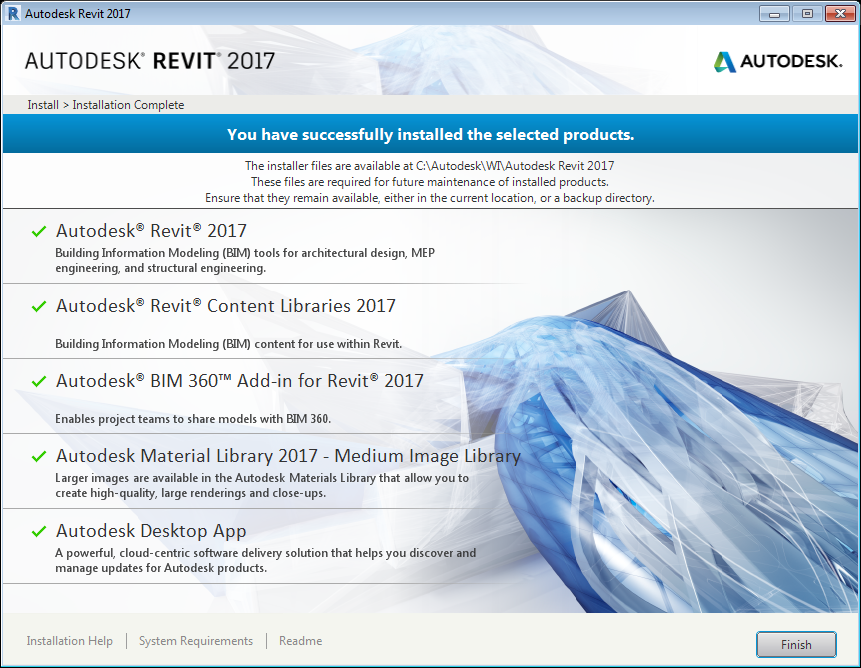
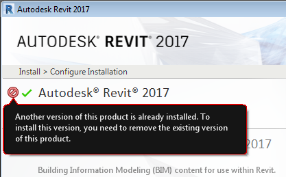
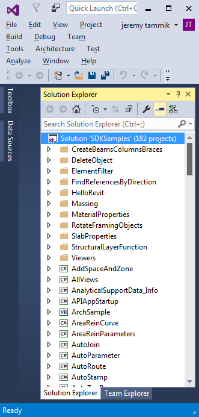

<head>
<meta http-equiv="Content-Type" content="text/html; charset=utf-8">
<link rel="stylesheet" type="text/css" href="bc.css">

<!--

-->
</head>

<!---

Revit 2017, RevitLookup and SDK Samples #revitAPI #3dwebcoder @AutodeskRevit #adsk #aec #bim #python #dynamobim

Revit 2017 was released yesterday.
Here is the official Autodesk statement stating that Revit 2017 advances BIM for the future of designing buildings.
I downloaded and installed my version from the Autodesk Revit family free trial web site.
Let's look at what I did to install and first add-in compilation experiences
&ndash; Uninstalling prior versions and cleaning the registry
&ndash; Dummy API assembly folder for compiling samples
&ndash; Resolving hiccups compiling Revit 2017 SDK samples
&ndash; RevitLookup for Revit 2017...

-->

### Revit 2017, RevitLookup and SDK Samples

Revit 2017 was released yesterday.

Here is the official Autodesk statement stating
that [Revit 2017 advances BIM for the future of designing buildings](http://inthefold.autodesk.com/in_the_fold/2016/04/revit-2017-advances-bim-for-future-of-designing-buildings.html).

Another take by Paul Aubin discusses
[Revit 2017 here! What's new?](https://www.linkedin.com/pulse/revit-2017-here-whats-new-paul-aubin)

I downloaded and installed my version from
the [Autodesk Revit family free trial](http://www.autodesk.com/products/revit-family/free-trial) web site.

Let's look at what I did to install and first add-in compilation experiences:

- [Uninstalling prior versions and cleaning the registry](#2)
- [Dummy API assembly folder for compiling samples](#3)
- [Resolving hiccups compiling Revit 2017 SDK samples](#4)
- [RevitLookup for Revit 2017](#5)

#### Uninstalling Prior Versions and Cleaning the Registry

It initially refused to install due either to me clicking around too fast or some remnants of the pre-release from the Windows registry:

I resolved that after struggling a while to manually remove every trace of 'Revit 2017' from the Windows registry.

#### Dummy API assembly Folder for Compiling Samples

The first thing I did was to compile the Revit SDK samples.

To tell the truth, I compiled those last week, before installing Revit 2017.

In order to achieve that, I manually created a dummy placeholder folder `C:\Program Files\Autodesk\Revit 2017` and copied the Revit API assemblies into that:

<pre>
01/20/2016  23:28      43,680 RevitAddInUtility.dll
01/20/2016  23:39  26,252,328 RevitAPI.dll
01/20/2016  23:40      81,568 RevitAPIBrowserUtils.dll
01/20/2016  23:30   1,255,584 RevitAPIFoundation.dll
01/20/2016  23:39     384,040 RevitAPIIFC.dll
01/20/2016  23:39      33,952 RevitAPILink.dll
01/20/2016  23:40     103,584 RevitAPIMacros.dll
01/20/2016  23:39     550,952 RevitAPIMacrosInterop.dll
01/20/2016  23:39     559,144 RevitAPIMacrosInteropAPI.dll
01/20/2016  23:40   2,695,720 RevitAPIUI.dll
01/20/2016  23:40      69,792 RevitAPIUILink.dll
01/20/2016  23:40      83,616 RevitAPIUIMacros.dll
01/20/2016  23:39     263,208 RevitAPIUIMacrosInterop.dll
01/20/2016  23:40     463,520 RevitAPIUIMacrosInteropAPI.dll
01/20/2016  23:32  12,464,168 RevitDBAPI.dll
01/20/2016  23:32     658,984 RevitMFCAPI.dll
01/20/2016  23:40   1,454,632 RevitUIAPI.dll
       17 File(s)  47,418,472 bytes
</pre>

The final release ones have a newer timestamp and slightly different sizes:

<pre>
02/26/2016  03:23      42,968 RevitAddInUtility.dll
02/26/2016  03:34  26,252,760 RevitAPI.dll
02/26/2016  03:36      81,928 RevitAPIBrowserUtils.dll
02/26/2016  03:26   1,254,872 RevitAPIFoundation.dll
02/26/2016  03:35     385,544 RevitAPIIFC.dll
02/26/2016  03:35      34,312 RevitAPILink.dll
02/26/2016  03:35     103,944 RevitAPIMacros.dll
02/26/2016  03:35     551,384 RevitAPIMacrosInterop.dll
02/26/2016  03:35     559,576 RevitAPIMacrosInteropAPI.dll
02/26/2016  03:36   2,696,152 RevitAPIUI.dll
02/26/2016  03:36      70,152 RevitAPIUILink.dll
02/26/2016  03:36      83,976 RevitAPIUIMacros.dll
02/26/2016  03:35     264,712 RevitAPIUIMacrosInterop.dll
02/26/2016  03:35     462,808 RevitAPIUIMacrosInteropAPI.dll
02/26/2016  03:28  12,464,600 RevitDBAPI.dll
02/26/2016  03:28     660,488 RevitMFCAPI.dll
02/26/2016  03:35   1,455,576 RevitUIAPI.dll
       17 File(s)  47,425,752 bytes
</pre>

#### Resolving Hiccups Compiling Revit 2017 SDK Samples

I ran into a couple of minor issues compiling the Revit 2017 SDK samples.

I was able to resolve them all myself, and so can you.

I installed the SDK from the MSI file that I received internally:

<pre>
  04/15/2016  11:29  307,387,758  REVIT_2017_SDK.msi
</pre>

I set it up in the root folder `C:\a\lib\revit\2017\SDK`.

As always, the first thing I did was to set up a desktop shortcut to the Revit API help file RevitAPI.chm in `C:\a\lib\revit\2017\SDK\RevitAPI.chm`, and I strongly recommend you do the same thing right away as well.

I simulated the installation of Revit 2017, which I had not yet installed, a [described above](#3), by copying the Revit API DLLs from the Kepler pre-release version to a manually created dummy folder `C:\Program Files\Autodesk\Revit 2017`.

I opened Visual Studio 2015, which required an initial some licencing and log-on procedure, since I had hardly ever used it before.

I loaded the Revit SDK samples solution file `C:\a\lib\revit\2017\SDK\Samples\SDKSamples.sln`.

Initially, [lots of errors](zip/sdk_samples_2017_01.txt) occurred and four samples failed to build.

The first one that I took a closer look at was `BRepBuilderExample`.

It was trying to load the Revit API assemblies from a non-existent hint path `Releasex64` specified in BRepBuilderExample.csproj:

<pre class="prettyprint">
&lt;Reference Include=&quot;RevitAPI&quot;&gt;
&nbsp; &lt;HintPath&gt;..\..\..\..\..\..\..\..\Releasex64\RevitAPI.dll&lt;/HintPath&gt;
&lt;/Reference&gt;
&lt;Reference Include=&quot;RevitAPIUI&quot;&gt;
&nbsp; &lt;HintPath&gt;..\..\..\..\..\..\..\..\Releasex64\RevitAPIUI.dll&lt;/HintPath&gt;
&lt;/Reference&gt;
</pre>

I fixed that by manually browsing to and re-referencing the DLLs and raised the issue REVIT-89864 [API sample BRepBuilderExample fails to compile] with the development team to have this fixed.

After successfully compiling BRepBuilderExample, [CancelSave fails to compile](zip/sdk_samples_2017_02.txt), because it requires RevitAddInUtility.dll.

My mistake, I had forgotten to copy it into my dummy DLL assembly folder:

<pre>
&gt; copy "C:\Program Files\Autodesk\Revit Kepler\RevitAddInUtility.dll" "..\Revit 2017"
</pre>

With CancelSave compiling successfully, the [next error occurred in PlacementOptions](zip/sdk_samples_2017_03.txt), which has a setting requiring all public members to be equipped with an XML documentation comment:

<pre>
C:\...\PlacementOptions\CS\Command.cs(151,9,151,18): error CS1591: Missing XML comment for publicly visible type or member 'PlacementOptionsEnum.FaceBased'

C:\...\PlacementOptions\CS\Command.cs(152,9,152,20): error CS1591: Missing XML comment for publicly visible type or member 'PlacementOptionsEnum.SketchBased'
</pre>

I resolved that by adding the required comments and passed that on to the development team in REVIT-89865 [API: PlacementOptions Revit SDK sample compilation error]:

<pre class="code">
&nbsp; /// &lt;summary&gt;
&nbsp; /// The placement options for user to place the family instance.
&nbsp; /// &lt;/summary&gt;
&nbsp; public enum PlacementOptionsEnum
&nbsp; {
&nbsp; &nbsp; /// &lt;summary&gt;
&nbsp; &nbsp; /// Face based
&nbsp; &nbsp; /// &lt;/summary&gt;
&nbsp; &nbsp; FaceBased,
&nbsp; &nbsp; /// &lt;summary&gt;
&nbsp; &nbsp; /// Sketch based
&nbsp; &nbsp; /// &lt;/summary&gt;
&nbsp; &nbsp; SketchBased
&nbsp; }
</pre>

Once that was completed, all samples compiled with [zero errors and 15 warnings](zip/sdk_samples_2017_04.txt):

<pre>
------ Project: FrameBuilder ------
MSB3884: Could not find rule set file "Migrated rules for FrameBuilder.ruleset".
------ Project: GeometryCreation_BooleanOperation ------
MSB3884: Could not find rule set file "GeometryCreation_BooleanOperation.ruleset".
------ Project: ProximityDetection_WallJoinControl ------
MSB3884: Could not find rule set file "ProximityDetection_WallJoinControl.ruleset".
------ Project: DatumsModification ------
MSB3270: There was a mismatch between the processor architecture of the project being built "MSIL" and the processor architecture of the reference "RevitAPI", "AMD64".
MSB3270: There was a mismatch between the processor architecture of the project being built "MSIL" and the processor architecture of the reference "RevitAPIUI", "AMD64".
------ Project: FabricationPartLayout ------
MSB3270: There was a mismatch between the processor architecture of the project being built "MSIL" and the processor architecture of the reference "RevitAPI", "AMD64".
MSB3270: There was a mismatch between the processor architecture of the project being built "MSIL" and the processor architecture of the reference "RevitAPIUI", "AMD64".
------ Project: GenericStructuralConnection ------
MSB3270: There was a mismatch between the processor architecture of the project being built "MSIL" and the processor architecture of the reference "RevitAPI", "AMD64".
MSB3270: There was a mismatch between the processor architecture of the project being built "MSIL" and the processor architecture of the reference "RevitAPIUI", "AMD64".
------ Project: CapitalizeAllTextNotes ------
MSB3270: There was a mismatch between the processor architecture of the project being built "MSIL" and the processor architecture of the reference "RevitAPI", "AMD64".
MSB3270: There was a mismatch between the processor architecture of the project being built "MSIL" and the processor architecture of the reference "RevitAPIUI", "AMD64".
------ Project: PlacementOptions ------
MSB3270: There was a mismatch between the processor architecture of the project being built "MSIL" and the processor architecture of the reference "RevitAPI", "AMD64".
MSB3270: There was a mismatch between the processor architecture of the project being built "MSIL" and the processor architecture of the reference "RevitAPIUI", "AMD64".
------ Project: BRepBuilderExample ------
MSB3270: There was a mismatch between the processor architecture of the project being built "MSIL" and the processor architecture of the reference "RevitAPI", "AMD64".
MSB3270: There was a mismatch between the processor architecture of the project being built "MSIL" and the processor architecture of the reference "RevitAPIUI", "AMD64".
</pre>

I submitted one final request REVIT-89869 [API SDK samples: eliminate warning messages] to the development team to fix these warning messages as well, but did not look into them myself in more detail.

They are all trivial to eliminate, and all belong to one of two types:

- MSB3884: Could not find rule set file "Migrated rules for *.ruleset".
- MSB3270: There was a mismatch between the processor architecture of the project being built "MSIL" and the processor architecture of the reference "RevitAPI", "AMD64"...

I actually implemented a stand-alone tool two years ago to automatically fix the latter warning, the Architecture Mismatch Warning Disabler:

- [Processor Architecture Mismatch Warning and Key Hook](http://thebuildingcoder.typepad.com/blog/2013/06/processor-architecture-mismatch-warning.html)
- [Recursively Disable Architecture Mismatch Warning](http://thebuildingcoder.typepad.com/blog/2013/07/recursively-disable-architecture-mismatch-warning.html)
- [Architecture Mismatch Warning Disabler Update](http://thebuildingcoder.typepad.com/blog/2014/09/architecture-mismatch-warning-disabler-update.html)

Here is Visual Studio 2015 with all the 182 Revit 2017 SDK samples successfully compiled:

#### RevitLookup for Revit 2017

Actually, to tell the even deeper truth, on request from Remy and others, I
compiled [RevitLookup for Revit 2017](https://github.com/jeremytammik/RevitLookup) even
before touching the Revit SDK.

It was migrated to Revit 2017 by Jose Manuel Solís López of [SOFiSTiK AG](http://www.sofistik.com), [@ManuelSL](https://github.com/ManuelSL) on GitHub.

Thank you very much for that, Manuel!

¡Muchísimas gracias!

I mentioned that last week in
the [Revit API discussion forum](http://forums.autodesk.com/t5/revit-api/bd-p/160)
in the [off topic for Remy](http://forums.autodesk.com/t5/revit-api/off-topic-for-remy/m-p/5995280) thread.

At the time, I did not yet have Revit 2017 installed, so that was also done using the [dummy Revit API assembly container folder](#3).

Therefore, the most up-to-date version provided in
the [RevitLookup GitHub repository](https://github.com/jeremytammik/RevitLookup) is now for Revit 2017,
[release 2017.0.0.2](https://github.com/jeremytammik/RevitLookup/releases/tag/2017.0.0.2).

If you are interested in an earlier release of Revit, please grab the latest appropriate one from the
[release list](https://github.com/jeremytammik/RevitLookup/releases), e.g.,
[2016.0.0.13](https://github.com/jeremytammik/RevitLookup/releases/tag/2016.0.0.13) for Revit 2016,
[2015.0.0.8](https://github.com/jeremytammik/RevitLookup/releases/tag/2015.0.0.8) for Revit 2015, etc.