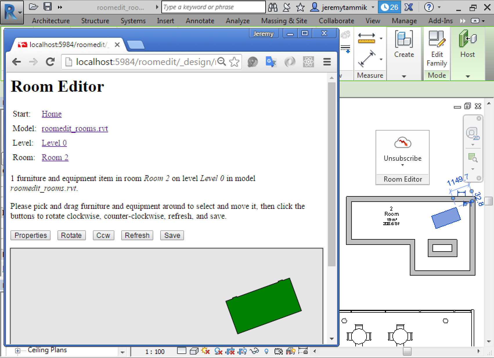

<head>
<meta http-equiv="Content-Type" content="text/html; charset=utf-8">
<link rel="stylesheet" type="text/css" href="bc.css">

<!--

-->
</head>

<!---

Room Editor Revit 2017 Addin Migration #revitAPI #3dwebcoder @AutodeskRevit #adsk #aec #bim @AutodeskForge #3dwebaccel

A wonderful Monday morning to you. We are enjoying perfect April weather, rapidly oscillating back and forth between warm sprintime sunshine, sleet and hail. Meanwhile, I am continuously striving hard yet failing miserably to reduce my pure Revit API focussed case answering and Revit API activity
&ndash; Things To Do
&ndash; Forge DevCon developer conference
&ndash; RoomEditorApp for Revit 2017
&ndash; Roomedit CouchDB installation on Windows
&ndash; FireRatingCloud enhancements completed and upcoming
&ndash; First Revit 2017 deprecated API clean-up
&ndash; Where BIM hasn't gone...

-->

### Room Editor &ndash; First Revit 2017 Addin Migration

A wonderful Monday morning to you.

We are enjoying perfect April weather, rapidly oscillating back and forth between warm sprintime sunshine, sleet and hail.

Meanwhile, I am continuously striving hard yet failing miserably to reduce my pure Revit API focussed case answering
and [Revit API discussion forum](http://forums.autodesk.com/t5/revit-api/bd-p/160) activity.

- [Things To Do](#1)
- [Forge DevCon developer conference](#2)
- [RoomEditorApp for Revit 2017](#3)
- [Roomedit CouchDB installation on Windows](#4)
- [FireRatingCloud enhancements completed and upcoming](#5)
- [First Revit 2017 deprecated API clean-up](#6)
- [Where BIM hasn't gone &ndash; by Peter Mann](#7)
    - [Back in the USA](#7.1)
    - [Meanwhile in England](#7.2)
    - [Improvement needed For BIM](#7.3)
- [Bikeshedding](#8)

#### Things To Do

I should be dedicating at least half my time to cloud related topics and samples.

Last week the release of Revit 2017 was one reason not to do so, and an internal meeting of my US colleagues, keeping them busy.

This week, I would like to migrate all my samples to Revit 2017, and so on.

It never ends, does it?

Still:

I have a large backlog of really exciting BIM and cloud related issues I want to address and explore, e.g.:

- Migrate the [RoomEditorApp](https://github.com/jeremytammik/RoomEditorApp) from CouchBD to MongoDB
- Continue working on the [TrackChangesCloud](https://github.com/jeremytammik/TrackChangesCloud) sample, implementing the database portion
- Expand the [FireRatingCloud](https://github.com/jeremytammik/FireRatingCloud) sample, adding real-time live BIM update functionality a la RoomEditorApp

I really need to start getting these tasks done in order to present them at several pretty
imminent [upcoming events](http://thebuildingcoder.typepad.com/blog/2016/04/forge-devcon-spring-impermanence-and-bim-cloud.html#4):

- May 16-20: [Forge Accelerator](http://autodeskcloudaccelerator.com) in Barcelona
- June 1-2: Forge [meetup](http://www.meetup.com/I-love-3D-Athens/events/230543759)
and [workshop](http://www.meetup.com/I-love-3D-Athens/events/230544059) in Athens
- June 15-16: [Forge DevCon](http://forge.autodesk.com/conference) developer conference in San Francisco
- June 20-24: [Forge Accelerator](http://autodeskcloudaccelerator.com) in San Francisco
- October 20-22: [RTC Europe](http://www.revitconference.com/rtc2016eur) Revit Technology Conference in Porto &ndash; somewhat less imminent, nonetheless exciting...

The most exciting one by far is the Forge DevCon!

#### Forge DevCon Developer Conference

The Early Bird pricing for the [Forge DevCon](http://forge.autodesk.com/conference) just ended:

<blockquote class="twitter-tweet" data-lang="en">
Tomorrow is last chance for early bird discount
to <a href="https://twitter.com/hashtag/ForgeDevCon?src=hash">#ForgeDevCon</a> &ndash; don't miss learning
new <a href="https://twitter.com/hashtag/APIs?src=hash">#APIs</a>
<a href="https://t.co/gcfj5ugcGC">https://t.co/gcfj5ugcGC</a>
&mdash;
Autodesk Forge (@AutodeskForge) <a href="https://twitter.com/AutodeskForge/status/723208819745153024">April 21, 2016</a>
</blockquote>

You can still test your luck and try to apply for a discount by tweeting to [@AutodeskForge](https://twitter.com/AutodeskForge).

Last chance!

#### RoomEditorApp for Revit 2017

I did actually decide to complete and publish my first Revit add-in migration to Revit 2017.

It is already live in the [RoomEditorApp GitHub repository](https://github.com/jeremytammik/RoomEditorApp), which now boasts a brand
new [release 2017.0.0.1](https://github.com/jeremytammik/RoomEditorApp/releases/tag/2017.0.0.1).

The migration from Revit 2016 was completely trivial, as you can tell from
the [diffs](https://github.com/jeremytammik/RoomEditorApp/compare/2016.0.0.9...2017.0.0.1).

Not a single line of source code needed modification.

All I did was switch the Visual Studio version from 2012 to 2015, update the .NET framework from 4.5 to 4.5.2 and reference the new Revit API assemblies.

Here is a three and a half minute [recording of RoomEditorApp up and running in Revit 2017](https://youtu.be/-YrTN2Mxw7Y), including some notes on the migration:

<iframe width="420" height="315" src="https://www.youtube.com/embed/-YrTN2Mxw7Y?rel=0" frameborder="0" allowfullscreen></iframe>

#### Roomedit CouchDB Installation on Windows

I also added a note to the [roomedit](https://github.com/jeremytammik/roomedit) documentation, the RoomEditorApp cloud-hosted CouchDB database component, on installing it into CouchDB on Windows.

That should make it easier for you to get the whole demo up and running on your system as well, if you are interested in taking a look and trying it out.

One of my plans, as said, is to rewrite this cloud database component using node.js and MongoDB instead of CouchDB.

#### FireRatingCloud Enhancements Completed and Upcoming

As I cannot stop repeating, I am very much looking forward to continuing work on my cloud projects.

They are all related to connecting BIM and the cloud, so I very much hope that they are of great interest to you too.

Otherwise, where will you and your business be in just a few years time?

I mentioned my plans above for
the [RoomEditorApp](https://github.com/jeremytammik/RoomEditorApp) migration from CouchBD to MongoDB,
the [TrackChangesCloud](https://github.com/jeremytammik/TrackChangesCloud) database implementations,
and the [FireRatingCloud](https://github.com/jeremytammik/FireRatingCloud) enhancements.

In fact, I already started work on the latter:

- [REST API batch upload and Windows client](http://the3dwebcoder.typepad.com/blog/2016/03/fireratingcloud-rest-api-batch-upload-and-windows-client.html)
- [Database document modification timestamp](http://the3dwebcoder.typepad.com/blog/2016/04/fireratingcloud-document-modification-timestamp.html)
- [Retrieving updated docs](http://the3dwebcoder.typepad.com/blog/2016/04/fireratingcloud-query-retrieving-updated-docs.html)

The main reason for the room editor migration today was to ensure that it is up to date and ready for me to reuse its external application ribbon implementation and external event handling for the FireRatingCloud sample.

FireRatingCloud will require almost exactly the same functionality as the room editor to support automatic round-trip real-time BIM update from the cloud.

So let's get going with that next!

#### First Revit 2017 Deprecated API Clean-up

Aaww, I just cannot resist.

The Revit 2017 flat migration of RoomEditorApp generates zero errors and [two obsolete API usage warnings](zip/roomedit_2017_migr_01.txt):

CmdUploadRooms makes use of the `Plane` constructor taking three `XYZ` arguments, producing the warning:

<pre>
  warning CS0618: 'Plane.Plane(XYZ, XYZ, XYZ)' is obsolete:
  This method is obsolete in Revit 2017.
  Please use Plane.CreateByOriginAndBasis() instead.
</pre>

Ok, let's get that done right away.

Here is one of the offending lines:

<pre class="code">
  Plane&nbsp;plane&nbsp;=&nbsp;new&nbsp;Plane( XYZ.BasisX,
  &nbsp;&nbsp;XYZ.BasisY,&nbsp;XYZ.Zero);&nbsp;//&nbsp;2016
</pre>

Simply follow the instruction given in the warning message and replace it by this:

<pre class="code">
  Plane&nbsp;plane&nbsp;=&nbsp;Plane.CreateByOriginAndBasis(
  &nbsp;&nbsp;XYZ.Zero,&nbsp;XYZ.BasisX,&nbsp;XYZ.BasisY&nbsp;);&nbsp;//&nbsp;2017
</pre>

I updated the [RoomEditorApp GitHub repository](https://github.com/jeremytammik/RoomEditorApp) with this modification and saved it
as [release 2017.0.0.2](https://github.com/jeremytammik/RoomEditorApp/releases/tag/2017.0.0.2).

Again, you can examine the changes by looking at
the [diffs](https://github.com/jeremytammik/RoomEditorApp/compare/2017.0.0.1...2017.0.0.2).

Good luck with your own migrations!

#### Where BIM Hasn't Gone &ndash; by Peter Mann

To round off this post today, here is a note on the current state of BIM by Peter Mann, published as a guest editorial by Ralph Grabowski in the issue #899 of [upFront.eZine](http://www.upfrontezine.com).

Ralph, I was pleased to see your article on [The Tao of BIM Being Data](http://www.upfrontezine.com/2016/02/the-tao-of-bim-being-data.html).
[BIM](https://en.wikipedia.org/wiki/Building_information_modeling) is the natural development of CAD for the construction industry, and so is worthy of discussion.

I agree with much that Allan Partridge of CanBIM said, especially his comment that the information part of the BIM mnemonic is data, not documents. It is also commendable that awareness among the Canadian players is established. I have observed projects in Canada going to international organisations that can talk the talk, even if they are no more capable than local ones. Allan is also correct in pointing out that some government initiatives build awareness and create an export opportunity, and that CanBIM developing that local awareness is worthwhile.

Over the past few years, it has been interesting to see where the leading BIM usage has occurred. In the 1990s, the procurement process in the UK resulted in all disciplines working together and coordinating their design decisions, although technology lagged. With CAD and relational databases we were attempting BIM before it was known as "BIM." Today with programs, like Revit, better databases and the cloud all contribute to what can be achieved.

#### Back in the USA

Back in the 1990s I visited the US to show them my CodeBook software. At that time, there was little interest in BIM, because design teams worked in isolation. Builders coordinated the documents of the various parties before they could begin construction. Autodesk contributed greatly to the advancement of BIM, partly with Revit [which they acquired in 2002], but more importantly they spent a large amount of their marketing budget on educating the industry as to the benefits of coordination and what BIM can be.

The result was greater awareness of BIM in the USA. It was embraced by some USA government organisations, and some design teams took the lead as they experienced the benefits. I am not sure, however, that since then it has been adequately mandated by government organisations in the USA or proactively encouraged. Although organisations are implementing BIM, it is to achieve benefits within their remit, rather than to the overall project's outcome.

#### Meanwhile in England

In the UK, government laid out a timetable with deadlines for which data should available and what deliverables should be provided. This stimulated design teams through the reality of needing to comply with and understand the BIM framework. However, too much discussion is on the technical rather than the conceptual implementation of why-BIM.

As a result, we have deliberations over the choice of Cobie, IFC, or other standards. While these debates are necessary, they distract from the central issue, which should be about the Why and the How. The current situation appears to be that the required outputs can be rather onerous project deliverables, rather than a beneficial contribution to the process of creating and running a successful facility.

Usually, the data created by design and construction teams is what each party needs to merely fulfil their roles in the process. This often is just a placeholder for the data the facility owner needs, rather than the actual data with its high-value benefits, such as asset details, serial numbers, and commissioning dates.

#### Improvement Needed For BIM

It's easy for the BIM evangelist community to focus on developing standards that move data from one piece of software to another, but I believe a strong educational voice is still needed for building and facility managers. This should develop the understanding by client and facility owners of the benefits of what BIM data should contain, so they can specify what information they need and then budget for the cost of collecting the data.

The misconception about BIM is that it includes the entirety of the project as constructed. In reality, this is not the case, because the only information in BIM models is the data that the contributors need to carry out their role -- whether architect, mechanical and electrical engineers, or contractors. The data contained is generic, even that provided by the contractor, such as procurement and cost data, and may not actually reflect what was installed, and where.

It is less common that we have seen the concept of BIM taken through to provide a fully operational BIM that contains the information needed to feed into asset management programs that produces maintenance work orders and cost effective management of the facility. Yet it costs so much more to collect model and serial numbers, warranty dates, and so on at a future date.

Another use of the information part of BIM for complex projects is to prove compliance. For each room in the project there needs to be a check and record kept that the constructed room meets the performance requirements of the program.

(A brief mention of my software: The design team collects and coordinates production information among them, and then links the information with Revit and AutoCAD. CodeBook provides contractors access to useful data directly, which they link to their procurement and estimating systems. This has been especially useful for PPP [private-public partnership](https://en.wikipedia.org/wiki/Public%E2%80%93private_partnership) projects, where the construction team is involved early and so knows that they need to ask for the data they require up front.)

Peter L Mann heads up [CodeBook Solutions](http://www.CodeBookSolutions.com).

Many thanks to Peter for his thoughts, experience, and permission to reproduce this [upFront.eZine](http://www.upfrontezine.com) article here as well!

#### Bikeshedding

By the way, the statement on "too much discussion is on the technical rather than the conceptual implementation of why-BIM" reminds me of the very useful concept of [bikeshedding](http://bikeshed.org) that I stumbled across yesterday &nbsp; :-)
