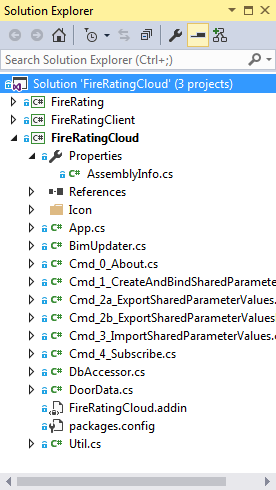

<head>
<meta http-equiv="Content-Type" content="text/html; charset=utf-8">
<link rel="stylesheet" type="text/css" href="bc.css">

<!--

-->
</head>

<!---

Real-Time BIM Update with FireRatingCloud 2017 #revitAPI #3dwebcoder @AutodeskRevit #adsk #aec #bim @AutodeskForge #3dwebaccel

Yesterday, I migrated RoomEditorApp to Revit 2017 and mentioned the BIM and cloud related projects I am working on.
Next, let's focus on the FireRatingCloud sample.
The main goal there is to implement fully automatic real-time BIM update from the cloud.
Now, 24 hours after writing the previous sentence, I can tell you that I succeeded.
Well, add another six hours to edit this post...
Here is the updated FireRatingCloud custom ribbon tab with its new set of commands...

-->

### Real-Time BIM Update with FireRatingCloud 2017

Yesterday,
I [migrated RoomEditorApp to Revit 2017](http://thebuildingcoder.typepad.com/blog/2016/04/room-editor-first-revit-2017-addin-migration.html#3) and
mentioned
the [BIM and cloud related projects](http://thebuildingcoder.typepad.com/blog/2016/04/room-editor-first-revit-2017-addin-migration.html#1) I am working on.

Next, let's focus on
the [FireRatingCloud](https://github.com/jeremytammik/FireRatingCloud) sample.

The main goal there is to implement fully automatic real-time BIM update from the cloud.

Now, 24 hours after writing the previous sentence, I can tell you that I succeeded.

Well, add another six hours to edit this post...

And yet another six hours to struggle with Typepad, which is blocking me from publishing this...

Here is the updated FireRatingCloud custom ribbon tab with its new set of commands:

The commands are now:

- Cmd_0_About.cs &ndash; display an About... box.
- Cmd_1_CreateAndBindSharedParameter &ndash; I won't ever tell.
- Cmd_2a_ExportSharedParameterValues &ndash; upload data to cloud database using individual REST API calls for each record.
- Cmd_2b_ExportSharedParameterValuesBatch &ndash; batch upload data to cloud database using one single REST API call.
- Cmd_3_ImportSharedParameterValues &ndash; interactively download data and update BIM from cloud database.
- Cmd_4_Subscribe &ndash; subscribe to automatic real-time BIM updates.

Achieving that required the following steps:

- [Already done and yet to do](#2)
- [Migration to Revit 2017](#3)
- [Reusing the RoomEditorApp infrastructure](#4)
- [Redesign](#5)
    - [Typepad blocking source code in the blog post](#5.0)
    - [App.cs](#5.1)
    - [BimUpdater.cs](#5.2)
    - [Cmd_4_Subscribe.cs](#5.3)
    - [DbAccessor.cs](#5.4)
- [FireRatingCloud video recording](#9)
- [Download](#10)
- [To do](#11)

#### Already Done and Yet To Do

As said, our main goal right now is the support of a round-trip data exchange with the cloud with an optional automatic real-time update of the BIM.

FireRatingCloud will require almost exactly the same functionality as our trusty old [RoomEditorApp](https://github.com/jeremytammik/RoomEditorApp) sample to support that.

We can reuse a lot of the RoomEditorApp implementation, e.g., its external application managing the database polling in a separate thread, the external event to update the BIM when the polling returns modified records, the ribbon user interface for the growing number of commands, the toggle button to turn subscription on and off, etc.

Some tasks that I already addressed for this project include:

- [REST API batch upload and Windows client](http://the3dwebcoder.typepad.com/blog/2016/03/fireratingcloud-rest-api-batch-upload-and-windows-client.html) &ndash; the original FireRatingCloud sample made a separate REST API call for each door firerating shared parameter value that it exported to the cloud database. Reimporting modified values uses one single REST call for the whole batch. This enhancement exports in batch as well.
- [Database document modification timestamp](http://the3dwebcoder.typepad.com/blog/2016/04/fireratingcloud-document-modification-timestamp.html) &ndash; in order to retrieve modified database records only, a timestamp is required.
- [Retrieving updated docs](http://the3dwebcoder.typepad.com/blog/2016/04/fireratingcloud-query-retrieving-updated-docs.html) &ndash; implementation and testing of the timestamp marker and retrieval.

Now I am ready to address the main goal, almost the holy grail:

- Implement automatic round-trip real-time BIM update from the cloud

This entails a couple of subtasks:

- Implement an external event to poll the cloud database for updated records, making use of the document modification timestamp and retrieval of updated docs already implemented.
- Implement an external application to manage the external event.
- Implement a custom ribbon tab and buttons for the user interface to handle the real-time update subscription toggle button.
- Migrate to Revit 2017. I already migrated
the [RoomEditorApp](https://github.com/jeremytammik/RoomEditorApp) sample and am reusing its implementation for several of the preceding items.

Once we have completed the FireRatingCloud sample, here are a few more exciting upcoming cloud related tasks:

- Document and improve [FireRatingClient](), the stand-alone Windows client &ndash; we will need this to demonstrate the real-time BIM update from arbitrary sources more nicely than the simple setup I discuss below.
- Completely rewrite the existing [RoomEditorApp](https://github.com/jeremytammik/RoomEditorApp) sample to move it from CouchDB to node.js plus MongoDB.
- Implement the database portion of the [TrackChangesCloud](https://github.com/jeremytammik/TrackChangesCloud) sample.

#### Migration to Revit 2017

Migrating the [RoomEditorApp](https://github.com/jeremytammik/RoomEditorApp) to Revit 2017 yesterday was really easy.

Now let's do the same for FireRatingCloud before anything else.

As always, I need to reference the new Revit API assemblies.

For Revit 2017, I also need to switch from Visual Studio 2012 to 2015 and update the .NET framework version from 4.5 to 4.5.2.

Furthermore, FireRatingCloud references the [RestSharp library](http://restsharp.org), which provides separate assemblies for those two .NET framework versions, so we need to update those references as well.

That was it.

No code changes required, nor anything else further at all.

Here is the full solution in Visual Studio 2015 after implementing all the further enhancements described below:

The initial [release 2017.0.0.0](https://github.com/jeremytammik/FireRatingCloud/releases/tag/2017.0.0.0) is live in
the [FireRatingCloud GitHub repository](https://github.com/jeremytammik/FireRatingCloud),
and you can examine the flat migration changes by looking at
the [diffs](https://github.com/jeremytammik/FireRatingCloud/compare/2016.0.0.25...2017.0.0.0).

There is much more coming, though.

#### Reusing the RoomEditorApp Infrastructure

The migration was trivial, and only a minute part of the task I am addressing.

Once that was done, I was able to integrate and reuse all the important RoomEditorApp infrastructure to implementing the external application, external event, ribbon UI, command buttons, subscription command toggle button and database polling loop in a separate thread.

That took about a day.

#### Redesign

I spent another day cleaning up the result to make it cleaner and easier to understand.

One important cleanup step, for instance, was to separate the misleadingly named DbUpdater class into two separate classes named BimUpdater and DbAccessor.

The former implements the actual shared parameter value update in the BIM using a method that is used both by the interactive import command and the external event triggered by the database polling when it detects modification to be applied. It also implements this external event.

The latter reads records from the database, also for both the external command and the external event. It also implements the database polling loop that runs in a separate thread and raises the external event when it finds pending modification to be applied.

Can you imagine how much easier it is to understand the architecture when these two components are cleanly separated, and how confusing it is when they are bunched together into one, like they were before?

It all has historical reasons, of course.

Anyway, this sample is now hopefully much easier to comprehend than the RoomEditorApp.

Hence my aim to completely rewrite RoomEditorApp, basing it on this sample next time.

You can possibly get an idea of the various enhancement steps I made by looking at the list of intermediate releases:

- [2017.0.0.1](https://github.com/jeremytammik/FireRatingCloud/releases/tag/2017.0.0.1) &ndash; implemented real-time bim update: external app, external event, ribbon ui, subscribe command and toggle button
- [2017.0.0.2](https://github.com/jeremytammik/FireRatingCloud/releases/tag/2017.0.0.2) &ndash; converted timestamp to unsigned
- [2017.0.0.3](https://github.com/jeremytammik/FireRatingCloud/releases/tag/2017.0.0.3) &ndash; split DbUpdater into separate DbAccessor and BimUpdater classes
- [2017.0.0.4](https://github.com/jeremytammik/FireRatingCloud/releases/tag/2017.0.0.4) &ndash; moved and renamed UpdateBimFromDb to BimUpdater.UpdateBim
- [2017.0.0.5](https://github.com/jeremytammik/FireRatingCloud/releases/tag/2017.0.0.5) &ndash; cleanup: all except DbAccessor and BimUpdater is now clear
- [2017.0.0.6](https://github.com/jeremytammik/FireRatingCloud/releases/tag/2017.0.0.6) &ndash; rewrote UpdateBim to take list of modified doors from DbAccessor or import command
- [2017.0.0.7](https://github.com/jeremytammik/FireRatingCloud/releases/tag/2017.0.0.7) &ndash; remove obsolete external commands from add-in manifest and clean up
- [2017.0.0.8](https://github.com/jeremytammik/FireRatingCloud/releases/tag/2017.0.0.8) &ndash; replace Debug.Print by Util.Log and clean up using namespace statements
- [2017.0.0.9](https://github.com/jeremytammik/FireRatingCloud/releases/tag/2017.0.0.9) &ndash; fixed and created recording
- [2017.0.0.10](https://github.com/jeremytammik/FireRatingCloud/releases/tag/2017.0.0.10) &ndash; added readme documents for the two subprojects

FireRatingCloud now consists of the following modules:

- App.cs
- BimUpdater.cs
- Cmd_0_About.cs
- Cmd_1_CreateAndBindSharedParameter.cs
- Cmd_2a_ExportSharedParameterValues.cs
- Cmd_2b_ExportSharedParameterValuesBatch.cs
- Cmd_3_ImportSharedParameterValues.cs
- Cmd_4_Subscribe.cs
- DbAccessor.cs
- DoorData.cs
- Util.cs

The most interesting parts are the new additions, of course:

- [App.cs](#5.1) implements the external application, ribbon UI, command buttons, subscription command toggle button, and manages the external event.
- [BimUpdater.cs](#5.2) implements the external event and the method updating the Revit shared parameters.
- [Cmd_4_Subscribe.cs](#5.3) implements the new subscription external command.
- [DbAccessor.cs](#5.4) implements the database polling loop in a separate thread and raises the external event when external modifications are detected.

Let's look at them one by one.

I checked all the code comments.

They are just about as extensive as they ought to be, no more, no less, and all up to date.

So please read them as well  :-)

#### Typepad Blocking Source Code in the Blog Post

Typepad blocked me from posting the four following source code sections.

Every time I tried, it triggered a message saying I have been blocked for security reasons:

> Sorry, you have been blocked. You are unable to access typepad.com. Why have I been blocked? This website is using a security service to protect itself from online attacks. The action you just performed triggered the security solution. There are several actions that could trigger this block including submitting a certain word or phrase, a SQL command or malformed data. CloudFlare Ray ID: 29a278666db82690 &ndash; Your IP: XXXXX &ndash; Performance & security by CloudFlare...

I submitted a ticket...

I experienced this once already, last month, and it took hours to resolve, wasted for both me and them. More on my side, of course. Painful.

Meanwhile, you can read the [full post](http://jeremytammik.github.io/tbc/a/1431_firerating_2017.html) in the [tbc GitHub repository](https://github.com/jeremytammik/tbc) without the Typepad support.

24 hours later and after several email exchanges and ticket submissions, they say the problem is resolved.

Let's see... yes, it works!

#### App.cs

Implements the external application, ribbon UI, command buttons, subscription command toggle button, and manages the external event:

<pre class="code">
class&nbsp;App&nbsp;:&nbsp;IExternalApplication
{
&nbsp;&nbsp;///&nbsp;&lt;summary&gt;
&nbsp;&nbsp;///&nbsp;Caption
&nbsp;&nbsp;///&nbsp;&lt;/summary&gt;
&nbsp;&nbsp;public&nbsp;const&nbsp;string&nbsp;Caption&nbsp;=&nbsp;&quot;FireRatingCloud&quot;;

&nbsp;&nbsp;///&nbsp;&lt;summary&gt;
&nbsp;&nbsp;///&nbsp;Switch&nbsp;between&nbsp;subscribe&nbsp;
&nbsp;&nbsp;///&nbsp;and&nbsp;unsubscribe&nbsp;commands.
&nbsp;&nbsp;///&nbsp;&lt;/summary&gt;
&nbsp;&nbsp;const&nbsp;string&nbsp;_subscribe&nbsp;=&nbsp;&quot;Subscribe&quot;;
&nbsp;&nbsp;const&nbsp;string&nbsp;_unsubscribe&nbsp;=&nbsp;&quot;Unsubscribe&quot;;

&nbsp;&nbsp;///&nbsp;&lt;summary&gt;
&nbsp;&nbsp;///&nbsp;Subscription&nbsp;debugging&nbsp;benchmark&nbsp;timer.
&nbsp;&nbsp;///&nbsp;&lt;/summary&gt;
&nbsp;&nbsp;//static&nbsp;JtTimer&nbsp;_timer&nbsp;=&nbsp;null;

&nbsp;&nbsp;///&nbsp;&lt;summary&gt;
&nbsp;&nbsp;///&nbsp;Store&nbsp;the&nbsp;external&nbsp;event.
&nbsp;&nbsp;///&nbsp;&lt;/summary&gt;
&nbsp;&nbsp;static&nbsp;ExternalEvent&nbsp;_event&nbsp;=&nbsp;null;

&nbsp;&nbsp;///&nbsp;&lt;summary&gt;
&nbsp;&nbsp;///&nbsp;Executing&nbsp;assembly&nbsp;namespace
&nbsp;&nbsp;///&nbsp;&lt;/summary&gt;
&nbsp;&nbsp;static&nbsp;string&nbsp;_namespace&nbsp;=&nbsp;typeof(&nbsp;App&nbsp;).Namespace;

&nbsp;&nbsp;///&nbsp;&lt;summary&gt;
&nbsp;&nbsp;///&nbsp;Command&nbsp;name&nbsp;prefix
&nbsp;&nbsp;///&nbsp;&lt;/summary&gt;
&nbsp;&nbsp;const&nbsp;string&nbsp;_cmd_prefix&nbsp;=&nbsp;&quot;Cmd_&quot;;

&nbsp;&nbsp;///&nbsp;&lt;summary&gt;
&nbsp;&nbsp;///&nbsp;Currently&nbsp;executing&nbsp;assembly&nbsp;path
&nbsp;&nbsp;///&nbsp;&lt;/summary&gt;
&nbsp;&nbsp;static&nbsp;string&nbsp;_path&nbsp;=&nbsp;typeof(&nbsp;App&nbsp;)
&nbsp;&nbsp;&nbsp;&nbsp;.Assembly.Location;

&nbsp;&nbsp;///&nbsp;&lt;summary&gt;
&nbsp;&nbsp;///&nbsp;Keep&nbsp;track&nbsp;of&nbsp;our&nbsp;ribbon&nbsp;&nbsp;
&nbsp;&nbsp;///&nbsp;buttons&nbsp;to&nbsp;toggle&nbsp;their&nbsp;text.
&nbsp;&nbsp;///&nbsp;&lt;/summary&gt;
&nbsp;&nbsp;static&nbsp;RibbonItem[]&nbsp;_buttons;

&nbsp;&nbsp;///&nbsp;&lt;summary&gt;
&nbsp;&nbsp;///&nbsp;Kepp&nbsp;track&nbsp;of&nbsp;subscription&nbsp;command&nbsp;
&nbsp;&nbsp;///&nbsp;button&nbsp;whose&nbsp;text&nbsp;is&nbsp;toggled.
&nbsp;&nbsp;///&nbsp;&lt;/summary&gt;
&nbsp;&nbsp;static&nbsp;int&nbsp;_subscribeButtonIndex&nbsp;=&nbsp;4;

&nbsp;&nbsp;#region&nbsp;Icon&nbsp;resource,&nbsp;bitmap&nbsp;image&nbsp;and&nbsp;ribbon&nbsp;panel&nbsp;stuff
&nbsp;&nbsp;///&nbsp;&lt;summary&gt;
&nbsp;&nbsp;///&nbsp;Return&nbsp;path&nbsp;to&nbsp;embedded&nbsp;resource&nbsp;icon
&nbsp;&nbsp;///&nbsp;&lt;/summary&gt;
&nbsp;&nbsp;static&nbsp;string&nbsp;IconResourcePath(
&nbsp;&nbsp;&nbsp;&nbsp;string&nbsp;name,
&nbsp;&nbsp;&nbsp;&nbsp;string&nbsp;size&nbsp;)
&nbsp;&nbsp;{
&nbsp;&nbsp;&nbsp;&nbsp;return&nbsp;_namespace
&nbsp;&nbsp;&nbsp;&nbsp;&nbsp;&nbsp;+&nbsp;&quot;.&quot;&nbsp;+&nbsp;&quot;Icon&quot;&nbsp;//&nbsp;folder&nbsp;name
&nbsp;&nbsp;&nbsp;&nbsp;&nbsp;&nbsp;+&nbsp;&quot;.&quot;&nbsp;+&nbsp;name&nbsp;+&nbsp;size&nbsp;//&nbsp;icon&nbsp;name
&nbsp;&nbsp;&nbsp;&nbsp;&nbsp;&nbsp;+&nbsp;&quot;.png&quot;;&nbsp;//&nbsp;filename&nbsp;extension
&nbsp;&nbsp;}

&nbsp;&nbsp;///&nbsp;&lt;summary&gt;
&nbsp;&nbsp;///&nbsp;Load&nbsp;a&nbsp;new&nbsp;icon&nbsp;bitmap&nbsp;from&nbsp;embedded&nbsp;resources.
&nbsp;&nbsp;///&nbsp;For&nbsp;the&nbsp;BitmapImage,&nbsp;make&nbsp;sure&nbsp;you&nbsp;reference&nbsp;
&nbsp;&nbsp;///&nbsp;WindowsBase&nbsp;and&nbsp;PresentationCore,&nbsp;and&nbsp;import&nbsp;
&nbsp;&nbsp;///&nbsp;the&nbsp;System.Windows.Media.Imaging&nbsp;namespace.&nbsp;
&nbsp;&nbsp;///&nbsp;&lt;/summary&gt;
&nbsp;&nbsp;static&nbsp;BitmapImage&nbsp;GetBitmapImage(
&nbsp;&nbsp;&nbsp;&nbsp;Assembly&nbsp;a,
&nbsp;&nbsp;&nbsp;&nbsp;string&nbsp;path&nbsp;)
&nbsp;&nbsp;{
&nbsp;&nbsp;&nbsp;&nbsp;//&nbsp;to&nbsp;read&nbsp;from&nbsp;an&nbsp;external&nbsp;file:
&nbsp;&nbsp;&nbsp;&nbsp;//return&nbsp;new&nbsp;BitmapImage(&nbsp;new&nbsp;Uri(
&nbsp;&nbsp;&nbsp;&nbsp;//&nbsp;&nbsp;Path.Combine(&nbsp;_imageFolder,&nbsp;imageName&nbsp;)&nbsp;)&nbsp;);

&nbsp;&nbsp;&nbsp;&nbsp;string[]&nbsp;names&nbsp;=&nbsp;a.GetManifestResourceNames();

&nbsp;&nbsp;&nbsp;&nbsp;Stream&nbsp;s&nbsp;=&nbsp;a.GetManifestResourceStream(&nbsp;path&nbsp;);

&nbsp;&nbsp;&nbsp;&nbsp;Debug.Assert(&nbsp;null&nbsp;!=&nbsp;s,
&nbsp;&nbsp;&nbsp;&nbsp;&nbsp;&nbsp;&quot;expected&nbsp;valid&nbsp;icon&nbsp;resource&quot;&nbsp;);

&nbsp;&nbsp;&nbsp;&nbsp;BitmapImage&nbsp;img&nbsp;=&nbsp;new&nbsp;BitmapImage();

&nbsp;&nbsp;&nbsp;&nbsp;img.BeginInit();
&nbsp;&nbsp;&nbsp;&nbsp;img.StreamSource&nbsp;=&nbsp;s;
&nbsp;&nbsp;&nbsp;&nbsp;img.EndInit();

&nbsp;&nbsp;&nbsp;&nbsp;return&nbsp;img;
&nbsp;&nbsp;}

&nbsp;&nbsp;///&nbsp;&lt;summary&gt;
&nbsp;&nbsp;///&nbsp;Create&nbsp;our&nbsp;custom&nbsp;ribbon&nbsp;panel&nbsp;and&nbsp;populate
&nbsp;&nbsp;///&nbsp;it&nbsp;with&nbsp;our&nbsp;commands,&nbsp;saving&nbsp;the&nbsp;resulting
&nbsp;&nbsp;///&nbsp;ribbon&nbsp;items&nbsp;for&nbsp;later&nbsp;access.
&nbsp;&nbsp;///&nbsp;&lt;/summary&gt;
&nbsp;&nbsp;static&nbsp;void&nbsp;AddRibbonPanel(
&nbsp;&nbsp;&nbsp;&nbsp;UIControlledApplication&nbsp;a&nbsp;)
&nbsp;&nbsp;{
&nbsp;&nbsp;&nbsp;&nbsp;string[]&nbsp;tooltip&nbsp;=&nbsp;new&nbsp;string[]&nbsp;{
&nbsp;&nbsp;&nbsp;&nbsp;&nbsp;&nbsp;&quot;Create&nbsp;and&nbsp;bind&nbsp;shared&nbsp;parameter&nbsp;definition.&quot;,
&nbsp;&nbsp;&nbsp;&nbsp;&nbsp;&nbsp;&quot;Export&nbsp;shared&nbsp;parameter&nbsp;values&nbsp;one&nbsp;by&nbsp;one&nbsp;creating&nbsp;new&nbsp;and&nbsp;updating&nbsp;existing&nbsp;documents.&quot;,
&nbsp;&nbsp;&nbsp;&nbsp;&nbsp;&nbsp;&quot;Export&nbsp;shared&nbsp;parameter&nbsp;values&nbsp;in&nbsp;batch&nbsp;after&nbsp;deleting&nbsp;all&nbsp;existing&nbsp;project&nbsp;documents.&quot;,
&nbsp;&nbsp;&nbsp;&nbsp;&nbsp;&nbsp;&quot;Import&nbsp;shared&nbsp;parameter&nbsp;values.&quot;,
&nbsp;&nbsp;&nbsp;&nbsp;&nbsp;&nbsp;&quot;Subscribe&nbsp;to&nbsp;or&nbsp;unsubscribe&nbsp;from&nbsp;updates.&quot;,
&nbsp;&nbsp;&nbsp;&nbsp;&nbsp;&nbsp;&quot;About&nbsp;&quot;&nbsp;+&nbsp;Caption&nbsp;+&nbsp;&quot;:&nbsp;...&quot;
&nbsp;&nbsp;&nbsp;&nbsp;};

&nbsp;&nbsp;&nbsp;&nbsp;string[]&nbsp;text&nbsp;=&nbsp;new&nbsp;string[]&nbsp;{
&nbsp;&nbsp;&nbsp;&nbsp;&nbsp;&nbsp;&quot;Bind&nbsp;Shared&nbsp;Parameter&quot;,
&nbsp;&nbsp;&nbsp;&nbsp;&nbsp;&nbsp;&quot;Export&nbsp;one&nbsp;by&nbsp;one&quot;,
&nbsp;&nbsp;&nbsp;&nbsp;&nbsp;&nbsp;&quot;Export&nbsp;batch&quot;,
&nbsp;&nbsp;&nbsp;&nbsp;&nbsp;&nbsp;&quot;Import&quot;,
&nbsp;&nbsp;&nbsp;&nbsp;&nbsp;&nbsp;&quot;Subscribe&quot;,
&nbsp;&nbsp;&nbsp;&nbsp;&nbsp;&nbsp;&quot;About...&quot;
&nbsp;&nbsp;&nbsp;&nbsp;};

&nbsp;&nbsp;&nbsp;&nbsp;string[]&nbsp;classNameStem&nbsp;=&nbsp;new&nbsp;string[]&nbsp;{
&nbsp;&nbsp;&nbsp;&nbsp;&nbsp;&nbsp;&quot;1_CreateAndBindSharedParameter&quot;,
&nbsp;&nbsp;&nbsp;&nbsp;&nbsp;&nbsp;&quot;2a_ExportSharedParameterValues&quot;,
&nbsp;&nbsp;&nbsp;&nbsp;&nbsp;&nbsp;&quot;2b_ExportSharedParameterValuesBatch&quot;,
&nbsp;&nbsp;&nbsp;&nbsp;&nbsp;&nbsp;&quot;3_ImportSharedParameterValues&quot;,
&nbsp;&nbsp;&nbsp;&nbsp;&nbsp;&nbsp;&quot;4_Subscribe&quot;,
&nbsp;&nbsp;&nbsp;&nbsp;&nbsp;&nbsp;&quot;0_About&quot;
&nbsp;&nbsp;&nbsp;&nbsp;};

&nbsp;&nbsp;&nbsp;&nbsp;string[]&nbsp;iconName&nbsp;=&nbsp;new&nbsp;string[]&nbsp;{
&nbsp;&nbsp;&nbsp;&nbsp;&nbsp;&nbsp;&quot;Knot&quot;,
&nbsp;&nbsp;&nbsp;&nbsp;&nbsp;&nbsp;&quot;1Up&quot;,
&nbsp;&nbsp;&nbsp;&nbsp;&nbsp;&nbsp;&quot;2Up&quot;,
&nbsp;&nbsp;&nbsp;&nbsp;&nbsp;&nbsp;&quot;1Down&quot;,
&nbsp;&nbsp;&nbsp;&nbsp;&nbsp;&nbsp;&quot;ZigZagRed&quot;,
&nbsp;&nbsp;&nbsp;&nbsp;&nbsp;&nbsp;&quot;Question&quot;
&nbsp;&nbsp;&nbsp;&nbsp;};

&nbsp;&nbsp;&nbsp;&nbsp;int&nbsp;n&nbsp;=&nbsp;classNameStem.Length;

&nbsp;&nbsp;&nbsp;&nbsp;Debug.Assert(&nbsp;text.Length&nbsp;==&nbsp;n
&nbsp;&nbsp;&nbsp;&nbsp;&nbsp;&nbsp;&amp;&amp;&nbsp;tooltip.Length&nbsp;==&nbsp;n
&nbsp;&nbsp;&nbsp;&nbsp;&nbsp;&nbsp;&amp;&amp;&nbsp;iconName.Length&nbsp;==&nbsp;n,
&nbsp;&nbsp;&nbsp;&nbsp;&nbsp;&nbsp;&quot;expected&nbsp;equal&nbsp;number&nbsp;of&nbsp;text&nbsp;and&nbsp;class&nbsp;name&nbsp;entries&quot;&nbsp;);

&nbsp;&nbsp;&nbsp;&nbsp;Debug.Assert(
&nbsp;&nbsp;&nbsp;&nbsp;&nbsp;&nbsp;text[_subscribeButtonIndex].Equals(&nbsp;_subscribe&nbsp;),
&nbsp;&nbsp;&nbsp;&nbsp;&nbsp;&nbsp;&quot;Did&nbsp;you&nbsp;set&nbsp;the&nbsp;correct&nbsp;_subscribeButtonIndex?&quot;&nbsp;);

&nbsp;&nbsp;&nbsp;&nbsp;_buttons&nbsp;=&nbsp;new&nbsp;RibbonItem[n];

&nbsp;&nbsp;&nbsp;&nbsp;RibbonPanel&nbsp;panel
&nbsp;&nbsp;&nbsp;&nbsp;&nbsp;&nbsp;=&nbsp;a.CreateRibbonPanel(&nbsp;Caption&nbsp;);

&nbsp;&nbsp;&nbsp;&nbsp;SplitButtonData&nbsp;splitBtnData
&nbsp;&nbsp;&nbsp;&nbsp;&nbsp;&nbsp;=&nbsp;new&nbsp;SplitButtonData(&nbsp;Caption,&nbsp;Caption&nbsp;);

&nbsp;&nbsp;&nbsp;&nbsp;SplitButton&nbsp;splitBtn&nbsp;=&nbsp;panel.AddItem(
&nbsp;&nbsp;&nbsp;&nbsp;&nbsp;&nbsp;splitBtnData&nbsp;)&nbsp;as&nbsp;SplitButton;

&nbsp;&nbsp;&nbsp;&nbsp;Assembly&nbsp;asm&nbsp;=&nbsp;typeof(&nbsp;App&nbsp;).Assembly;

&nbsp;&nbsp;&nbsp;&nbsp;for(&nbsp;int&nbsp;i&nbsp;=&nbsp;0;&nbsp;i&nbsp;&lt;&nbsp;n;&nbsp;++i&nbsp;)
&nbsp;&nbsp;&nbsp;&nbsp;{
&nbsp;&nbsp;&nbsp;&nbsp;&nbsp;&nbsp;PushButtonData&nbsp;d&nbsp;=&nbsp;new&nbsp;PushButtonData(
&nbsp;&nbsp;&nbsp;&nbsp;&nbsp;&nbsp;&nbsp;&nbsp;classNameStem[i],&nbsp;text[i],&nbsp;_path,
&nbsp;&nbsp;&nbsp;&nbsp;&nbsp;&nbsp;&nbsp;&nbsp;_namespace&nbsp;+&nbsp;&quot;.&quot;&nbsp;+&nbsp;_cmd_prefix
&nbsp;&nbsp;&nbsp;&nbsp;&nbsp;&nbsp;&nbsp;&nbsp;+&nbsp;classNameStem[i]&nbsp;);

&nbsp;&nbsp;&nbsp;&nbsp;&nbsp;&nbsp;d.ToolTip&nbsp;=&nbsp;tooltip[i];

&nbsp;&nbsp;&nbsp;&nbsp;&nbsp;&nbsp;d.Image&nbsp;=&nbsp;GetBitmapImage(&nbsp;asm,
&nbsp;&nbsp;&nbsp;&nbsp;&nbsp;&nbsp;&nbsp;&nbsp;IconResourcePath(&nbsp;iconName[i],&nbsp;&quot;16&quot;&nbsp;)&nbsp;);

&nbsp;&nbsp;&nbsp;&nbsp;&nbsp;&nbsp;d.LargeImage&nbsp;=&nbsp;GetBitmapImage(&nbsp;asm,
&nbsp;&nbsp;&nbsp;&nbsp;&nbsp;&nbsp;&nbsp;&nbsp;IconResourcePath(&nbsp;iconName[i],&nbsp;&quot;32&quot;&nbsp;)&nbsp;);

&nbsp;&nbsp;&nbsp;&nbsp;&nbsp;&nbsp;d.ToolTipImage&nbsp;=&nbsp;GetBitmapImage(&nbsp;asm,
&nbsp;&nbsp;&nbsp;&nbsp;&nbsp;&nbsp;&nbsp;&nbsp;IconResourcePath(&nbsp;iconName[i],&nbsp;&quot;&quot;&nbsp;)&nbsp;);

&nbsp;&nbsp;&nbsp;&nbsp;&nbsp;&nbsp;_buttons[i]&nbsp;=&nbsp;splitBtn.AddPushButton(&nbsp;d&nbsp;);
&nbsp;&nbsp;&nbsp;&nbsp;}
&nbsp;&nbsp;}
&nbsp;&nbsp;#endregion&nbsp;//&nbsp;Icon&nbsp;resource,&nbsp;bitmap&nbsp;image&nbsp;and&nbsp;ribbon&nbsp;panel&nbsp;stuff

&nbsp;&nbsp;#region&nbsp;External&nbsp;event&nbsp;subscription&nbsp;and&nbsp;handling
&nbsp;&nbsp;///&nbsp;&lt;summary&gt;
&nbsp;&nbsp;///&nbsp;Are&nbsp;we&nbsp;currently&nbsp;subscribed&nbsp;
&nbsp;&nbsp;///&nbsp;to&nbsp;automatic&nbsp;cloud&nbsp;updates?
&nbsp;&nbsp;///&nbsp;&lt;/summary&gt;
&nbsp;&nbsp;public&nbsp;static&nbsp;bool&nbsp;Subscribed
&nbsp;&nbsp;{
&nbsp;&nbsp;&nbsp;&nbsp;get
&nbsp;&nbsp;&nbsp;&nbsp;{
&nbsp;&nbsp;&nbsp;&nbsp;&nbsp;&nbsp;bool&nbsp;rc&nbsp;=&nbsp;_buttons[_subscribeButtonIndex]
&nbsp;&nbsp;&nbsp;&nbsp;&nbsp;&nbsp;&nbsp;&nbsp;.ItemText.Equals(&nbsp;_unsubscribe&nbsp;);

&nbsp;&nbsp;&nbsp;&nbsp;&nbsp;&nbsp;Debug.Assert(&nbsp;(&nbsp;_event&nbsp;!=&nbsp;null&nbsp;)&nbsp;==&nbsp;rc,&nbsp;
&nbsp;&nbsp;&nbsp;&nbsp;&nbsp;&nbsp;&nbsp;&nbsp;&quot;expected&nbsp;synchronised&nbsp;handler&nbsp;and&nbsp;button&nbsp;text&quot;&nbsp;);

&nbsp;&nbsp;&nbsp;&nbsp;&nbsp;&nbsp;return&nbsp;rc;
&nbsp;&nbsp;&nbsp;&nbsp;}
&nbsp;&nbsp;}

&nbsp;&nbsp;///&nbsp;&lt;summary&gt;
&nbsp;&nbsp;///&nbsp;Toggle&nbsp;on&nbsp;and&nbsp;off&nbsp;subscription&nbsp;to&nbsp;automatic&nbsp;
&nbsp;&nbsp;///&nbsp;cloud&nbsp;updates.&nbsp;Return&nbsp;true&nbsp;when&nbsp;subscribed.
&nbsp;&nbsp;///&nbsp;&lt;/summary&gt;
&nbsp;&nbsp;public&nbsp;static&nbsp;bool&nbsp;ToggleSubscription2(
&nbsp;&nbsp;&nbsp;&nbsp;IExternalEventHandler&nbsp;handler&nbsp;)&nbsp;
&nbsp;&nbsp;{
&nbsp;&nbsp;&nbsp;&nbsp;if(&nbsp;Subscribed&nbsp;)
&nbsp;&nbsp;&nbsp;&nbsp;{
&nbsp;&nbsp;&nbsp;&nbsp;&nbsp;&nbsp;Util.Log(&nbsp;&quot;Unsubscribing...&quot;&nbsp;);

&nbsp;&nbsp;&nbsp;&nbsp;&nbsp;&nbsp;_event.Dispose();
&nbsp;&nbsp;&nbsp;&nbsp;&nbsp;&nbsp;_event&nbsp;=&nbsp;null;

&nbsp;&nbsp;&nbsp;&nbsp;&nbsp;&nbsp;_buttons[_subscribeButtonIndex].ItemText&nbsp;
&nbsp;&nbsp;&nbsp;&nbsp;&nbsp;&nbsp;&nbsp;&nbsp;=&nbsp;_subscribe;

&nbsp;&nbsp;&nbsp;&nbsp;&nbsp;&nbsp;//_timer.Stop();
&nbsp;&nbsp;&nbsp;&nbsp;&nbsp;&nbsp;//_timer.Report(&nbsp;&quot;Subscription&nbsp;timing&quot;&nbsp;);
&nbsp;&nbsp;&nbsp;&nbsp;&nbsp;&nbsp;//_timer&nbsp;=&nbsp;null;

&nbsp;&nbsp;&nbsp;&nbsp;&nbsp;&nbsp;Util.Log(&nbsp;&quot;Unsubscribed.&quot;&nbsp;);
&nbsp;&nbsp;&nbsp;&nbsp;}
&nbsp;&nbsp;&nbsp;&nbsp;else
&nbsp;&nbsp;&nbsp;&nbsp;{
&nbsp;&nbsp;&nbsp;&nbsp;&nbsp;&nbsp;Util.Log(&nbsp;&quot;Subscribing...&quot;&nbsp;);

&nbsp;&nbsp;&nbsp;&nbsp;&nbsp;&nbsp;_event&nbsp;=&nbsp;ExternalEvent.Create(&nbsp;handler&nbsp;);

&nbsp;&nbsp;&nbsp;&nbsp;&nbsp;&nbsp;_buttons[_subscribeButtonIndex].ItemText&nbsp;
&nbsp;&nbsp;&nbsp;&nbsp;&nbsp;&nbsp;&nbsp;&nbsp;=&nbsp;_unsubscribe;

&nbsp;&nbsp;&nbsp;&nbsp;&nbsp;&nbsp;//_timer&nbsp;=&nbsp;new&nbsp;JtTimer(&nbsp;&quot;Subscription&quot;&nbsp;);

&nbsp;&nbsp;&nbsp;&nbsp;&nbsp;&nbsp;Util.Log(&nbsp;&quot;Subscribed.&quot;&nbsp;);
&nbsp;&nbsp;&nbsp;&nbsp;}
&nbsp;&nbsp;&nbsp;&nbsp;return&nbsp;null&nbsp;!=&nbsp;_event;
&nbsp;&nbsp;}

&nbsp;&nbsp;///&nbsp;&lt;summary&gt;
&nbsp;&nbsp;///&nbsp;Provide&nbsp;public&nbsp;read-only&nbsp;access&nbsp;to&nbsp;external&nbsp;event.
&nbsp;&nbsp;///&nbsp;&lt;/summary&gt;
&nbsp;&nbsp;public&nbsp;static&nbsp;ExternalEvent&nbsp;Event
&nbsp;&nbsp;{
&nbsp;&nbsp;&nbsp;&nbsp;get&nbsp;{&nbsp;return&nbsp;_event;&nbsp;}
&nbsp;&nbsp;}
&nbsp;&nbsp;#endregion&nbsp;//&nbsp;External&nbsp;event&nbsp;subscription&nbsp;and&nbsp;handling

&nbsp;&nbsp;public&nbsp;Result&nbsp;OnStartup(
&nbsp;&nbsp;&nbsp;&nbsp;UIControlledApplication&nbsp;a&nbsp;)
&nbsp;&nbsp;{
&nbsp;&nbsp;&nbsp;&nbsp;AddRibbonPanel(&nbsp;a&nbsp;);

&nbsp;&nbsp;&nbsp;&nbsp;return&nbsp;Result.Succeeded;
&nbsp;&nbsp;}

&nbsp;&nbsp;public&nbsp;Result&nbsp;OnShutdown(
&nbsp;&nbsp;&nbsp;&nbsp;UIControlledApplication&nbsp;a&nbsp;)
&nbsp;&nbsp;{
&nbsp;&nbsp;&nbsp;&nbsp;if(&nbsp;Subscribed&nbsp;)
&nbsp;&nbsp;&nbsp;&nbsp;{
&nbsp;&nbsp;&nbsp;&nbsp;&nbsp;&nbsp;_event.Dispose();
&nbsp;&nbsp;&nbsp;&nbsp;&nbsp;&nbsp;_event&nbsp;=&nbsp;null;
&nbsp;&nbsp;&nbsp;&nbsp;}
&nbsp;&nbsp;&nbsp;&nbsp;return&nbsp;Result.Succeeded;
&nbsp;&nbsp;}
}
</pre>

#### BimUpdater.cs

Implements the external event and the method updating the Revit shared parameters:

<pre class="code">
///&nbsp;&lt;summary&gt;
///&nbsp;BIM&nbsp;updater,&nbsp;driven&nbsp;both&nbsp;via&nbsp;external&nbsp;
///&nbsp;command&nbsp;and&nbsp;external&nbsp;event&nbsp;handler.
///&nbsp;&lt;/summary&gt;
class&nbsp;BimUpdater&nbsp;:&nbsp;IExternalEventHandler
{
&nbsp;&nbsp;///&nbsp;&lt;summary&gt;
&nbsp;&nbsp;///&nbsp;Update&nbsp;the&nbsp;BIM&nbsp;with&nbsp;the&nbsp;given&nbsp;database&nbsp;records.
&nbsp;&nbsp;///&nbsp;&lt;/summary&gt;
&nbsp;&nbsp;public&nbsp;static&nbsp;bool&nbsp;UpdateBim(
&nbsp;&nbsp;&nbsp;&nbsp;Document&nbsp;doc,
&nbsp;&nbsp;&nbsp;&nbsp;List&lt;FireRating.DoorData&gt;&nbsp;doors,
&nbsp;&nbsp;&nbsp;&nbsp;ref&nbsp;string&nbsp;error_message&nbsp;)
&nbsp;&nbsp;{
&nbsp;&nbsp;&nbsp;&nbsp;Guid&nbsp;paramGuid;

&nbsp;&nbsp;&nbsp;&nbsp;if&nbsp;(&nbsp;!Util.GetSharedParamGuid(&nbsp;doc.Application,
&nbsp;&nbsp;&nbsp;&nbsp;&nbsp;&nbsp;out&nbsp;paramGuid&nbsp;)&nbsp;)
&nbsp;&nbsp;&nbsp;&nbsp;{
&nbsp;&nbsp;&nbsp;&nbsp;&nbsp;&nbsp;error_message&nbsp;=&nbsp;&quot;Shared&nbsp;parameter&nbsp;GUID&nbsp;not&nbsp;found.&quot;;
&nbsp;&nbsp;&nbsp;&nbsp;&nbsp;&nbsp;return&nbsp;false;
&nbsp;&nbsp;&nbsp;&nbsp;}

&nbsp;&nbsp;&nbsp;&nbsp;Stopwatch&nbsp;stopwatch&nbsp;=&nbsp;new&nbsp;Stopwatch();
&nbsp;&nbsp;&nbsp;&nbsp;stopwatch.Start();

&nbsp;&nbsp;&nbsp;&nbsp;//&nbsp;Loop&nbsp;through&nbsp;the&nbsp;doors&nbsp;and&nbsp;update&nbsp;&nbsp;&nbsp;
&nbsp;&nbsp;&nbsp;&nbsp;//&nbsp;their&nbsp;firerating&nbsp;parameter&nbsp;values.

&nbsp;&nbsp;&nbsp;&nbsp;if&nbsp;(&nbsp;null&nbsp;!=&nbsp;doors&nbsp;&amp;&amp;&nbsp;0&nbsp;&lt;&nbsp;doors.Count&nbsp;)
&nbsp;&nbsp;&nbsp;&nbsp;{
&nbsp;&nbsp;&nbsp;&nbsp;&nbsp;&nbsp;using&nbsp;(&nbsp;Transaction&nbsp;t&nbsp;=&nbsp;new&nbsp;Transaction(&nbsp;doc&nbsp;)&nbsp;)
&nbsp;&nbsp;&nbsp;&nbsp;&nbsp;&nbsp;{
&nbsp;&nbsp;&nbsp;&nbsp;&nbsp;&nbsp;&nbsp;&nbsp;t.Start(&nbsp;&quot;Import&nbsp;Fire&nbsp;Rating&nbsp;Values&quot;&nbsp;);

&nbsp;&nbsp;&nbsp;&nbsp;&nbsp;&nbsp;&nbsp;&nbsp;//&nbsp;Retrieve&nbsp;element&nbsp;unique&nbsp;id&nbsp;and&nbsp;
&nbsp;&nbsp;&nbsp;&nbsp;&nbsp;&nbsp;&nbsp;&nbsp;//&nbsp;FireRating&nbsp;parameter&nbsp;values.

&nbsp;&nbsp;&nbsp;&nbsp;&nbsp;&nbsp;&nbsp;&nbsp;foreach&nbsp;(&nbsp;FireRating.DoorData&nbsp;d&nbsp;in&nbsp;doors&nbsp;)
&nbsp;&nbsp;&nbsp;&nbsp;&nbsp;&nbsp;&nbsp;&nbsp;{
&nbsp;&nbsp;&nbsp;&nbsp;&nbsp;&nbsp;&nbsp;&nbsp;&nbsp;&nbsp;string&nbsp;uid&nbsp;=&nbsp;d._id;
&nbsp;&nbsp;&nbsp;&nbsp;&nbsp;&nbsp;&nbsp;&nbsp;&nbsp;&nbsp;Element&nbsp;e&nbsp;=&nbsp;doc.GetElement(&nbsp;uid&nbsp;);

&nbsp;&nbsp;&nbsp;&nbsp;&nbsp;&nbsp;&nbsp;&nbsp;&nbsp;&nbsp;if&nbsp;(&nbsp;null&nbsp;==&nbsp;e&nbsp;)
&nbsp;&nbsp;&nbsp;&nbsp;&nbsp;&nbsp;&nbsp;&nbsp;&nbsp;&nbsp;{
&nbsp;&nbsp;&nbsp;&nbsp;&nbsp;&nbsp;&nbsp;&nbsp;&nbsp;&nbsp;&nbsp;&nbsp;error_message&nbsp;=&nbsp;string.Format(
&nbsp;&nbsp;&nbsp;&nbsp;&nbsp;&nbsp;&nbsp;&nbsp;&nbsp;&nbsp;&nbsp;&nbsp;&nbsp;&nbsp;&quot;Error&nbsp;retrieving&nbsp;element&nbsp;for&nbsp;&quot;
&nbsp;&nbsp;&nbsp;&nbsp;&nbsp;&nbsp;&nbsp;&nbsp;&nbsp;&nbsp;&nbsp;&nbsp;&nbsp;&nbsp;+&nbsp;&quot;unique&nbsp;id&nbsp;{0}.&quot;,&nbsp;uid&nbsp;);

&nbsp;&nbsp;&nbsp;&nbsp;&nbsp;&nbsp;&nbsp;&nbsp;&nbsp;&nbsp;&nbsp;&nbsp;return&nbsp;false;
&nbsp;&nbsp;&nbsp;&nbsp;&nbsp;&nbsp;&nbsp;&nbsp;&nbsp;&nbsp;}

&nbsp;&nbsp;&nbsp;&nbsp;&nbsp;&nbsp;&nbsp;&nbsp;&nbsp;&nbsp;Parameter&nbsp;p&nbsp;=&nbsp;e.get_Parameter(&nbsp;paramGuid&nbsp;);

&nbsp;&nbsp;&nbsp;&nbsp;&nbsp;&nbsp;&nbsp;&nbsp;&nbsp;&nbsp;if&nbsp;(&nbsp;null&nbsp;==&nbsp;p&nbsp;)
&nbsp;&nbsp;&nbsp;&nbsp;&nbsp;&nbsp;&nbsp;&nbsp;&nbsp;&nbsp;{
&nbsp;&nbsp;&nbsp;&nbsp;&nbsp;&nbsp;&nbsp;&nbsp;&nbsp;&nbsp;&nbsp;&nbsp;error_message&nbsp;=&nbsp;string.Format(
&nbsp;&nbsp;&nbsp;&nbsp;&nbsp;&nbsp;&nbsp;&nbsp;&nbsp;&nbsp;&nbsp;&nbsp;&nbsp;&nbsp;&quot;Error&nbsp;retrieving&nbsp;shared&nbsp;parameter&nbsp;on&nbsp;&quot;
&nbsp;&nbsp;&nbsp;&nbsp;&nbsp;&nbsp;&nbsp;&nbsp;&nbsp;&nbsp;&nbsp;&nbsp;&nbsp;&nbsp;+&nbsp;&quot;&nbsp;element&nbsp;with&nbsp;unique&nbsp;id&nbsp;{0}.&quot;,&nbsp;uid&nbsp;);

&nbsp;&nbsp;&nbsp;&nbsp;&nbsp;&nbsp;&nbsp;&nbsp;&nbsp;&nbsp;&nbsp;&nbsp;return&nbsp;false;
&nbsp;&nbsp;&nbsp;&nbsp;&nbsp;&nbsp;&nbsp;&nbsp;&nbsp;&nbsp;}
&nbsp;&nbsp;&nbsp;&nbsp;&nbsp;&nbsp;&nbsp;&nbsp;&nbsp;&nbsp;object&nbsp;fire_rating&nbsp;=&nbsp;d.firerating;

&nbsp;&nbsp;&nbsp;&nbsp;&nbsp;&nbsp;&nbsp;&nbsp;&nbsp;&nbsp;p.Set(&nbsp;(double)&nbsp;fire_rating&nbsp;);

&nbsp;&nbsp;&nbsp;&nbsp;&nbsp;&nbsp;&nbsp;&nbsp;&nbsp;&nbsp;p&nbsp;=&nbsp;e.get_Parameter(&nbsp;DoorData.BipMark&nbsp;);

&nbsp;&nbsp;&nbsp;&nbsp;&nbsp;&nbsp;&nbsp;&nbsp;&nbsp;&nbsp;if&nbsp;(&nbsp;null&nbsp;==&nbsp;p&nbsp;)
&nbsp;&nbsp;&nbsp;&nbsp;&nbsp;&nbsp;&nbsp;&nbsp;&nbsp;&nbsp;{
&nbsp;&nbsp;&nbsp;&nbsp;&nbsp;&nbsp;&nbsp;&nbsp;&nbsp;&nbsp;&nbsp;&nbsp;error_message&nbsp;=&nbsp;string.Format(
&nbsp;&nbsp;&nbsp;&nbsp;&nbsp;&nbsp;&nbsp;&nbsp;&nbsp;&nbsp;&nbsp;&nbsp;&nbsp;&nbsp;&quot;Error&nbsp;retrieving&nbsp;ALL_MODEL_MARK&nbsp;&quot;
&nbsp;&nbsp;&nbsp;&nbsp;&nbsp;&nbsp;&nbsp;&nbsp;&nbsp;&nbsp;&nbsp;&nbsp;&nbsp;&nbsp;+&nbsp;&quot;built-in&nbsp;parameter&nbsp;on&nbsp;element&nbsp;with&nbsp;&quot;
&nbsp;&nbsp;&nbsp;&nbsp;&nbsp;&nbsp;&nbsp;&nbsp;&nbsp;&nbsp;&nbsp;&nbsp;&nbsp;&nbsp;+&nbsp;&quot;unique&nbsp;id&nbsp;{0}.&quot;,&nbsp;uid&nbsp;);

&nbsp;&nbsp;&nbsp;&nbsp;&nbsp;&nbsp;&nbsp;&nbsp;&nbsp;&nbsp;&nbsp;&nbsp;return&nbsp;false;
&nbsp;&nbsp;&nbsp;&nbsp;&nbsp;&nbsp;&nbsp;&nbsp;&nbsp;&nbsp;}

&nbsp;&nbsp;&nbsp;&nbsp;&nbsp;&nbsp;&nbsp;&nbsp;&nbsp;&nbsp;p.Set(&nbsp;(string)&nbsp;d.tag&nbsp;);
&nbsp;&nbsp;&nbsp;&nbsp;&nbsp;&nbsp;&nbsp;&nbsp;}
&nbsp;&nbsp;&nbsp;&nbsp;&nbsp;&nbsp;&nbsp;&nbsp;t.Commit();
&nbsp;&nbsp;&nbsp;&nbsp;&nbsp;&nbsp;}
&nbsp;&nbsp;&nbsp;&nbsp;}

&nbsp;&nbsp;&nbsp;&nbsp;stopwatch.Stop();

&nbsp;&nbsp;&nbsp;&nbsp;Util.Log(&nbsp;string.Format(
&nbsp;&nbsp;&nbsp;&nbsp;&nbsp;&nbsp;&quot;{0}&nbsp;milliseconds&nbsp;to&nbsp;import&nbsp;{1}&nbsp;element{2}.&quot;,
&nbsp;&nbsp;&nbsp;&nbsp;&nbsp;&nbsp;stopwatch.ElapsedMilliseconds,&nbsp;doors.Count,&nbsp;
&nbsp;&nbsp;&nbsp;&nbsp;&nbsp;&nbsp;Util.PluralSuffix(&nbsp;doors.Count)&nbsp;)&nbsp;);

&nbsp;&nbsp;&nbsp;&nbsp;return&nbsp;true;
&nbsp;&nbsp;}

&nbsp;&nbsp;///&nbsp;&lt;summary&gt;
&nbsp;&nbsp;///&nbsp;Execute&nbsp;method&nbsp;invoked&nbsp;by&nbsp;Revit&nbsp;via&nbsp;the&nbsp;
&nbsp;&nbsp;///&nbsp;external&nbsp;event&nbsp;as&nbsp;a&nbsp;reaction&nbsp;to&nbsp;a&nbsp;call&nbsp;
&nbsp;&nbsp;///&nbsp;to&nbsp;its&nbsp;Raise&nbsp;method.
&nbsp;&nbsp;///&nbsp;&lt;/summary&gt;
&nbsp;&nbsp;public&nbsp;void&nbsp;Execute(&nbsp;UIApplication&nbsp;a&nbsp;)
&nbsp;&nbsp;{
&nbsp;&nbsp;&nbsp;&nbsp;uint&nbsp;timestamp_before_bim_update&nbsp;
&nbsp;&nbsp;&nbsp;&nbsp;&nbsp;&nbsp;=&nbsp;Util.UnixTimestamp();

&nbsp;&nbsp;&nbsp;&nbsp;Document&nbsp;doc&nbsp;=&nbsp;a.ActiveUIDocument.Document;

&nbsp;&nbsp;&nbsp;&nbsp;Debug.Assert(&nbsp;Util.GetProjectIdentifier(&nbsp;doc&nbsp;)
&nbsp;&nbsp;&nbsp;&nbsp;&nbsp;&nbsp;.Equals(&nbsp;DbAccessor.ProjectId&nbsp;),&nbsp;
&nbsp;&nbsp;&nbsp;&nbsp;&nbsp;&nbsp;&quot;expected&nbsp;same&nbsp;project&quot;&nbsp;);

&nbsp;&nbsp;&nbsp;&nbsp;string&nbsp;error_message&nbsp;=&nbsp;null;

&nbsp;&nbsp;&nbsp;&nbsp;bool&nbsp;rc&nbsp;=&nbsp;UpdateBim(&nbsp;doc,&nbsp;
&nbsp;&nbsp;&nbsp;&nbsp;&nbsp;&nbsp;DbAccessor.ModifiedDoors,&nbsp;
&nbsp;&nbsp;&nbsp;&nbsp;&nbsp;&nbsp;ref&nbsp;error_message&nbsp;);

&nbsp;&nbsp;&nbsp;&nbsp;if(&nbsp;rc&nbsp;)
&nbsp;&nbsp;&nbsp;&nbsp;{
&nbsp;&nbsp;&nbsp;&nbsp;&nbsp;&nbsp;DbAccessor.Timestamp&nbsp;=&nbsp;timestamp_before_bim_update;
&nbsp;&nbsp;&nbsp;&nbsp;}
&nbsp;&nbsp;&nbsp;&nbsp;else
&nbsp;&nbsp;&nbsp;&nbsp;{
&nbsp;&nbsp;&nbsp;&nbsp;&nbsp;&nbsp;throw&nbsp;new&nbsp;SystemException(&nbsp;error_message&nbsp;);
&nbsp;&nbsp;&nbsp;&nbsp;}
&nbsp;&nbsp;}

&nbsp;&nbsp;///&nbsp;&lt;summary&gt;
&nbsp;&nbsp;///&nbsp;Required&nbsp;IExternalEventHandler&nbsp;interface&nbsp;
&nbsp;&nbsp;///&nbsp;method&nbsp;returning&nbsp;a&nbsp;descriptive&nbsp;name.
&nbsp;&nbsp;///&nbsp;&lt;/summary&gt;
&nbsp;&nbsp;public&nbsp;string&nbsp;GetName()
&nbsp;&nbsp;{
&nbsp;&nbsp;&nbsp;&nbsp;return&nbsp;App.Caption&nbsp;+&nbsp;&quot;&nbsp;&quot;&nbsp;+&nbsp;GetType().Name;
&nbsp;&nbsp;}
}
</pre>

#### Cmd_4_Subscribe.cs

Implements the new subscription external command:

<pre class="code">
[Transaction(&nbsp;TransactionMode.ReadOnly&nbsp;)]
class&nbsp;Cmd_4_Subscribe&nbsp;:&nbsp;IExternalCommand
{
&nbsp;&nbsp;&nbsp;&nbsp;public&nbsp;Result&nbsp;Execute(
&nbsp;&nbsp;&nbsp;&nbsp;ExternalCommandData&nbsp;commandData,
&nbsp;&nbsp;&nbsp;&nbsp;ref&nbsp;string&nbsp;message,
&nbsp;&nbsp;&nbsp;&nbsp;ElementSet&nbsp;elements&nbsp;)
&nbsp;&nbsp;{
&nbsp;&nbsp;&nbsp;&nbsp;UIApplication&nbsp;uiapp&nbsp;=&nbsp;commandData.Application;
&nbsp;&nbsp;&nbsp;&nbsp;Document&nbsp;doc&nbsp;=&nbsp;uiapp.ActiveUIDocument.Document;

&nbsp;&nbsp;&nbsp;&nbsp;//&nbsp;Determine&nbsp;custom&nbsp;project&nbsp;identifier.

&nbsp;&nbsp;&nbsp;&nbsp;string&nbsp;project_id&nbsp;=&nbsp;Util.GetProjectIdentifier(&nbsp;doc&nbsp;);

&nbsp;&nbsp;&nbsp;&nbsp;if&nbsp;(&nbsp;!App.Subscribed&nbsp;&amp;&amp;&nbsp;0&nbsp;==&nbsp;DbAccessor.Timestamp&nbsp;)
&nbsp;&nbsp;&nbsp;&nbsp;{
&nbsp;&nbsp;&nbsp;&nbsp;&nbsp;&nbsp;DbAccessor.Init(&nbsp;project_id&nbsp;);
&nbsp;&nbsp;&nbsp;&nbsp;}

&nbsp;&nbsp;&nbsp;&nbsp;DbAccessor.ToggleSubscription(&nbsp;uiapp&nbsp;);

&nbsp;&nbsp;&nbsp;&nbsp;return&nbsp;Result.Succeeded;
&nbsp;&nbsp;}
}
</pre>

#### DbAccessor.cs

Implements the database polling loop in a separate thread and raises the external event when external modifications are detected:

<pre class="code">
///&nbsp;&lt;summary&gt;
///&nbsp;Read&nbsp;records&nbsp;from&nbsp;the&nbsp;database,&nbsp;optionally&nbsp;filtering&nbsp;
///&nbsp;according&nbsp;to&nbsp;the&nbsp;modified&nbsp;timestamp,&nbsp;and&nbsp;manage&nbsp;the&nbsp;
///&nbsp;separate&nbsp;thread&nbsp;running&nbsp;the&nbsp;database&nbsp;polling&nbsp;loop&nbsp;
///&nbsp;for&nbsp;the&nbsp;subscription&nbsp;command.
///&nbsp;&lt;/summary&gt;
class&nbsp;DbAccessor
{
&nbsp;&nbsp;///&nbsp;&lt;summary&gt;
&nbsp;&nbsp;///&nbsp;Current&nbsp;document&nbsp;project&nbsp;id.
&nbsp;&nbsp;///&nbsp;Todo:&nbsp;update&nbsp;this&nbsp;when&nbsp;switching&nbsp;Revit&nbsp;documents.
&nbsp;&nbsp;///&nbsp;&lt;/summary&gt;
&nbsp;&nbsp;static&nbsp;string&nbsp;_project_id&nbsp;=&nbsp;null;

&nbsp;&nbsp;///&nbsp;&lt;summary&gt;
&nbsp;&nbsp;///&nbsp;Return&nbsp;the&nbsp;current&nbsp;Revit&nbsp;project&nbsp;id.
&nbsp;&nbsp;///&nbsp;&lt;/summary&gt;
&nbsp;&nbsp;public&nbsp;static&nbsp;string&nbsp;ProjectId
&nbsp;&nbsp;{
&nbsp;&nbsp;&nbsp;&nbsp;get
&nbsp;&nbsp;&nbsp;&nbsp;{
&nbsp;&nbsp;&nbsp;&nbsp;&nbsp;&nbsp;return&nbsp;_project_id;
&nbsp;&nbsp;&nbsp;&nbsp;}
&nbsp;&nbsp;}

&nbsp;&nbsp;///&nbsp;&lt;summary&gt;
&nbsp;&nbsp;///&nbsp;For&nbsp;subscription&nbsp;to&nbsp;automatic&nbsp;BIM&nbsp;updates,
&nbsp;&nbsp;///&nbsp;retrieve&nbsp;database&nbsp;records&nbsp;modified&nbsp;after&nbsp;
&nbsp;&nbsp;///&nbsp;this&nbsp;timestamp.
&nbsp;&nbsp;///&nbsp;&lt;/summary&gt;
&nbsp;&nbsp;static&nbsp;public&nbsp;uint&nbsp;Timestamp
&nbsp;&nbsp;{
&nbsp;&nbsp;&nbsp;&nbsp;get;
&nbsp;&nbsp;&nbsp;&nbsp;set;
&nbsp;&nbsp;}

&nbsp;&nbsp;///&nbsp;&lt;summary&gt;
&nbsp;&nbsp;///&nbsp;Initialise&nbsp;project&nbsp;id&nbsp;and&nbsp;set&nbsp;the&nbsp;timestamp&nbsp;
&nbsp;&nbsp;///&nbsp;to&nbsp;start&nbsp;polling&nbsp;for&nbsp;database&nbsp;updates.
&nbsp;&nbsp;///&nbsp;&lt;/summary&gt;
&nbsp;&nbsp;static&nbsp;public&nbsp;uint&nbsp;Init(&nbsp;string&nbsp;project_id&nbsp;)
&nbsp;&nbsp;{
&nbsp;&nbsp;&nbsp;&nbsp;_project_id&nbsp;=&nbsp;project_id;

&nbsp;&nbsp;&nbsp;&nbsp;Timestamp&nbsp;=&nbsp;Util.UnixTimestamp();

&nbsp;&nbsp;&nbsp;&nbsp;Util.InfoMsg(&nbsp;string.Format(
&nbsp;&nbsp;&nbsp;&nbsp;&nbsp;&nbsp;&quot;Timestamp&nbsp;set&nbsp;to&nbsp;{0}.&quot;
&nbsp;&nbsp;&nbsp;&nbsp;&nbsp;&nbsp;+&nbsp;&quot;\nChanges&nbsp;from&nbsp;now&nbsp;on&nbsp;will&nbsp;be&nbsp;retrieved.&quot;,
&nbsp;&nbsp;&nbsp;&nbsp;&nbsp;&nbsp;Timestamp&nbsp;)&nbsp;);

&nbsp;&nbsp;&nbsp;&nbsp;return&nbsp;Timestamp;
&nbsp;&nbsp;}

&nbsp;&nbsp;///&nbsp;&lt;summary&gt;
&nbsp;&nbsp;///&nbsp;Store&nbsp;the&nbsp;modified&nbsp;door&nbsp;records&nbsp;
&nbsp;&nbsp;///&nbsp;retrieved&nbsp;from&nbsp;the&nbsp;database.
&nbsp;&nbsp;///&nbsp;&lt;/summary&gt;
&nbsp;&nbsp;static&nbsp;List&lt;FireRating.DoorData&gt;&nbsp;
&nbsp;&nbsp;&nbsp;&nbsp;_modified_door_records&nbsp;=&nbsp;null;

&nbsp;&nbsp;///&nbsp;&lt;summary&gt;
&nbsp;&nbsp;///&nbsp;Return&nbsp;the&nbsp;current&nbsp;modified&nbsp;door&nbsp;records&nbsp;
&nbsp;&nbsp;///&nbsp;retrieved&nbsp;from&nbsp;the&nbsp;cloud&nbsp;database.
&nbsp;&nbsp;///&nbsp;&lt;/summary&gt;
&nbsp;&nbsp;public&nbsp;static&nbsp;List&lt;FireRating.DoorData&gt;&nbsp;ModifiedDoors
&nbsp;&nbsp;{
&nbsp;&nbsp;&nbsp;&nbsp;get
&nbsp;&nbsp;&nbsp;&nbsp;{
&nbsp;&nbsp;&nbsp;&nbsp;&nbsp;&nbsp;return&nbsp;_modified_door_records;
&nbsp;&nbsp;&nbsp;&nbsp;}
&nbsp;&nbsp;}

&nbsp;&nbsp;///&nbsp;&lt;summary&gt;
&nbsp;&nbsp;///&nbsp;Retrieve&nbsp;all&nbsp;door&nbsp;documents&nbsp;for&nbsp;the&nbsp;specified&nbsp;
&nbsp;&nbsp;///&nbsp;Revit&nbsp;project&nbsp;identifier,&nbsp;optionally&nbsp;filtering&nbsp;
&nbsp;&nbsp;///&nbsp;for&nbsp;documents&nbsp;modified&nbsp;after&nbsp;the&nbsp;specified&nbsp;timestamp.
&nbsp;&nbsp;///&nbsp;&lt;/summary&gt;
&nbsp;&nbsp;public&nbsp;static&nbsp;List&lt;FireRating.DoorData&gt;&nbsp;GetDoorRecords(
&nbsp;&nbsp;&nbsp;&nbsp;string&nbsp;project_id,
&nbsp;&nbsp;&nbsp;&nbsp;uint&nbsp;timestamp&nbsp;=&nbsp;0&nbsp;)
&nbsp;&nbsp;{
&nbsp;&nbsp;&nbsp;&nbsp;//&nbsp;Get&nbsp;all&nbsp;doors&nbsp;referencing&nbsp;this&nbsp;project.

&nbsp;&nbsp;&nbsp;&nbsp;string&nbsp;query&nbsp;=&nbsp;&quot;doors/project/&quot;&nbsp;+&nbsp;project_id;

&nbsp;&nbsp;&nbsp;&nbsp;if&nbsp;(&nbsp;0&nbsp;&lt;&nbsp;timestamp&nbsp;)
&nbsp;&nbsp;&nbsp;&nbsp;{
&nbsp;&nbsp;&nbsp;&nbsp;&nbsp;&nbsp;//&nbsp;Add&nbsp;timestamp&nbsp;to&nbsp;query.

&nbsp;&nbsp;&nbsp;&nbsp;&nbsp;&nbsp;Util.Log(&nbsp;string.Format(
&nbsp;&nbsp;&nbsp;&nbsp;&nbsp;&nbsp;&nbsp;&nbsp;&quot;Retrieving&nbsp;door&nbsp;documents&nbsp;modified&nbsp;after&nbsp;{0}&quot;,
&nbsp;&nbsp;&nbsp;&nbsp;&nbsp;&nbsp;&nbsp;&nbsp;timestamp&nbsp;)&nbsp;);

&nbsp;&nbsp;&nbsp;&nbsp;&nbsp;&nbsp;query&nbsp;+=&nbsp;&quot;/newer/&quot;&nbsp;+&nbsp;timestamp.ToString();
&nbsp;&nbsp;&nbsp;&nbsp;}

&nbsp;&nbsp;&nbsp;&nbsp;return&nbsp;Util.Get(&nbsp;query&nbsp;);
&nbsp;&nbsp;}

&nbsp;&nbsp;///&nbsp;&lt;summary&gt;
&nbsp;&nbsp;///&nbsp;Count&nbsp;total&nbsp;number&nbsp;of&nbsp;checks&nbsp;for
&nbsp;&nbsp;///&nbsp;database&nbsp;updates&nbsp;made&nbsp;so&nbsp;far.
&nbsp;&nbsp;///&nbsp;&lt;/summary&gt;
&nbsp;&nbsp;static&nbsp;int&nbsp;_nLoopCount&nbsp;=&nbsp;0;

&nbsp;&nbsp;///&nbsp;&lt;summary&gt;
&nbsp;&nbsp;///&nbsp;Count&nbsp;total&nbsp;number&nbsp;of&nbsp;checks&nbsp;for
&nbsp;&nbsp;///&nbsp;database&nbsp;updates&nbsp;made&nbsp;so&nbsp;far.
&nbsp;&nbsp;///&nbsp;&lt;/summary&gt;
&nbsp;&nbsp;static&nbsp;int&nbsp;_nCheckCount&nbsp;=&nbsp;0;

&nbsp;&nbsp;///&nbsp;&lt;summary&gt;
&nbsp;&nbsp;///&nbsp;Count&nbsp;total&nbsp;number&nbsp;of&nbsp;database&nbsp;
&nbsp;&nbsp;///&nbsp;updates&nbsp;requested&nbsp;so&nbsp;far.
&nbsp;&nbsp;///&nbsp;&lt;/summary&gt;
&nbsp;&nbsp;static&nbsp;int&nbsp;_nUpdatesRequested&nbsp;=&nbsp;0;

&nbsp;&nbsp;///&nbsp;&lt;summary&gt;
&nbsp;&nbsp;///&nbsp;Number&nbsp;of&nbsp;milliseconds&nbsp;to&nbsp;wait&nbsp;and&nbsp;relinquish
&nbsp;&nbsp;///&nbsp;CPU&nbsp;control&nbsp;before&nbsp;next&nbsp;check&nbsp;for&nbsp;pending
&nbsp;&nbsp;///&nbsp;database&nbsp;updates.
&nbsp;&nbsp;///&nbsp;&lt;/summary&gt;
&nbsp;&nbsp;static&nbsp;int&nbsp;_timeout&nbsp;=&nbsp;500;

&nbsp;&nbsp;#region&nbsp;Windows&nbsp;API&nbsp;DLL&nbsp;Imports
&nbsp;&nbsp;//&nbsp;DLL&nbsp;imports&nbsp;from&nbsp;user32.dll&nbsp;to&nbsp;set&nbsp;focus&nbsp;to
&nbsp;&nbsp;//&nbsp;Revit&nbsp;to&nbsp;force&nbsp;it&nbsp;to&nbsp;forward&nbsp;the&nbsp;external&nbsp;event
&nbsp;&nbsp;//&nbsp;Raise&nbsp;to&nbsp;actually&nbsp;call&nbsp;the&nbsp;external&nbsp;event&nbsp;
&nbsp;&nbsp;//&nbsp;Execute.

&nbsp;&nbsp;///&nbsp;&lt;summary&gt;
&nbsp;&nbsp;///&nbsp;The&nbsp;GetForegroundWindow&nbsp;function&nbsp;returns&nbsp;a&nbsp;
&nbsp;&nbsp;///&nbsp;handle&nbsp;to&nbsp;the&nbsp;foreground&nbsp;window.
&nbsp;&nbsp;///&nbsp;&lt;/summary&gt;
&nbsp;&nbsp;[DllImport(&nbsp;&quot;user32.dll&quot;&nbsp;)]
&nbsp;&nbsp;static&nbsp;extern&nbsp;IntPtr&nbsp;GetForegroundWindow();

&nbsp;&nbsp;///&nbsp;&lt;summary&gt;
&nbsp;&nbsp;///&nbsp;Move&nbsp;the&nbsp;window&nbsp;associated&nbsp;with&nbsp;the&nbsp;passed&nbsp;
&nbsp;&nbsp;///&nbsp;handle&nbsp;to&nbsp;the&nbsp;front.
&nbsp;&nbsp;///&nbsp;&lt;/summary&gt;
&nbsp;&nbsp;[DllImport(&nbsp;&quot;user32.dll&quot;&nbsp;)]
&nbsp;&nbsp;static&nbsp;extern&nbsp;bool&nbsp;SetForegroundWindow(
&nbsp;&nbsp;&nbsp;&nbsp;IntPtr&nbsp;hWnd&nbsp;);
&nbsp;&nbsp;#endregion&nbsp;//&nbsp;Windows&nbsp;API&nbsp;DLL&nbsp;Imports

&nbsp;&nbsp;///&nbsp;&lt;summary&gt;
&nbsp;&nbsp;///&nbsp;This&nbsp;method&nbsp;runs&nbsp;in&nbsp;a&nbsp;separate&nbsp;thread&nbsp;and
&nbsp;&nbsp;///&nbsp;continuously&nbsp;polls&nbsp;the&nbsp;database&nbsp;for&nbsp;modified
&nbsp;&nbsp;///&nbsp;records.&nbsp;If&nbsp;any&nbsp;are&nbsp;detected,&nbsp;raise&nbsp;an&nbsp;
&nbsp;&nbsp;///&nbsp;external&nbsp;event&nbsp;to&nbsp;update&nbsp;the&nbsp;BIM.
&nbsp;&nbsp;///&nbsp;Relinquish&nbsp;control&nbsp;and&nbsp;wait&nbsp;for&nbsp;the&nbsp;specified
&nbsp;&nbsp;///&nbsp;timeout&nbsp;period&nbsp;between&nbsp;each&nbsp;attempt.
&nbsp;&nbsp;///&nbsp;&lt;/summary&gt;
&nbsp;&nbsp;static&nbsp;void&nbsp;CheckForPendingDatabaseChanges()
&nbsp;&nbsp;{
&nbsp;&nbsp;&nbsp;&nbsp;while&nbsp;(&nbsp;null&nbsp;!=&nbsp;App.Event&nbsp;)
&nbsp;&nbsp;&nbsp;&nbsp;{
&nbsp;&nbsp;&nbsp;&nbsp;&nbsp;&nbsp;++_nLoopCount;

&nbsp;&nbsp;&nbsp;&nbsp;&nbsp;&nbsp;if&nbsp;(&nbsp;App.Event.IsPending&nbsp;)
&nbsp;&nbsp;&nbsp;&nbsp;&nbsp;&nbsp;{
&nbsp;&nbsp;&nbsp;&nbsp;&nbsp;&nbsp;&nbsp;&nbsp;Util.Log(&nbsp;string.Format(
&nbsp;&nbsp;&nbsp;&nbsp;&nbsp;&nbsp;&nbsp;&nbsp;&nbsp;&nbsp;&quot;CheckForPendingDatabaseChanges&nbsp;loop&nbsp;{0}&nbsp;-&nbsp;&quot;
&nbsp;&nbsp;&nbsp;&nbsp;&nbsp;&nbsp;&nbsp;&nbsp;&nbsp;&nbsp;+&nbsp;&quot;database&nbsp;update&nbsp;event&nbsp;is&nbsp;pending&quot;,
&nbsp;&nbsp;&nbsp;&nbsp;&nbsp;&nbsp;&nbsp;&nbsp;&nbsp;&nbsp;_nLoopCount&nbsp;)&nbsp;);
&nbsp;&nbsp;&nbsp;&nbsp;&nbsp;&nbsp;}
&nbsp;&nbsp;&nbsp;&nbsp;&nbsp;&nbsp;else
&nbsp;&nbsp;&nbsp;&nbsp;&nbsp;&nbsp;{
&nbsp;&nbsp;&nbsp;&nbsp;&nbsp;&nbsp;&nbsp;&nbsp;//using(&nbsp;JtTimer&nbsp;pt&nbsp;=&nbsp;new&nbsp;JtTimer(
&nbsp;&nbsp;&nbsp;&nbsp;&nbsp;&nbsp;&nbsp;&nbsp;//&nbsp;&nbsp;&quot;CheckForPendingDatabaseChanges&quot;&nbsp;)&nbsp;)
&nbsp;&nbsp;&nbsp;&nbsp;&nbsp;&nbsp;&nbsp;&nbsp;{
&nbsp;&nbsp;&nbsp;&nbsp;&nbsp;&nbsp;&nbsp;&nbsp;&nbsp;&nbsp;++_nCheckCount;

&nbsp;&nbsp;&nbsp;&nbsp;&nbsp;&nbsp;&nbsp;&nbsp;&nbsp;&nbsp;Util.Log(&nbsp;string.Format(
&nbsp;&nbsp;&nbsp;&nbsp;&nbsp;&nbsp;&nbsp;&nbsp;&nbsp;&nbsp;&nbsp;&nbsp;&quot;CheckForPendingDatabaseChanges&nbsp;loop&nbsp;{0}&nbsp;-&nbsp;&quot;
&nbsp;&nbsp;&nbsp;&nbsp;&nbsp;&nbsp;&nbsp;&nbsp;&nbsp;&nbsp;&nbsp;&nbsp;+&nbsp;&quot;check&nbsp;for&nbsp;changes&nbsp;{1}&quot;,
&nbsp;&nbsp;&nbsp;&nbsp;&nbsp;&nbsp;&nbsp;&nbsp;&nbsp;&nbsp;&nbsp;&nbsp;_nLoopCount,&nbsp;_nCheckCount&nbsp;)&nbsp;);

&nbsp;&nbsp;&nbsp;&nbsp;&nbsp;&nbsp;&nbsp;&nbsp;&nbsp;&nbsp;_modified_door_records&nbsp;=&nbsp;GetDoorRecords(&nbsp;
&nbsp;&nbsp;&nbsp;&nbsp;&nbsp;&nbsp;&nbsp;&nbsp;&nbsp;&nbsp;&nbsp;&nbsp;_project_id,&nbsp;Timestamp&nbsp;);

&nbsp;&nbsp;&nbsp;&nbsp;&nbsp;&nbsp;&nbsp;&nbsp;&nbsp;&nbsp;if&nbsp;(&nbsp;null&nbsp;!=&nbsp;_modified_door_records&nbsp;
&nbsp;&nbsp;&nbsp;&nbsp;&nbsp;&nbsp;&nbsp;&nbsp;&nbsp;&nbsp;&nbsp;&nbsp;&amp;&amp;&nbsp;0&nbsp;&lt;&nbsp;_modified_door_records.Count&nbsp;)
&nbsp;&nbsp;&nbsp;&nbsp;&nbsp;&nbsp;&nbsp;&nbsp;&nbsp;&nbsp;{
&nbsp;&nbsp;&nbsp;&nbsp;&nbsp;&nbsp;&nbsp;&nbsp;&nbsp;&nbsp;&nbsp;&nbsp;App.Event.Raise();

&nbsp;&nbsp;&nbsp;&nbsp;&nbsp;&nbsp;&nbsp;&nbsp;&nbsp;&nbsp;&nbsp;&nbsp;++_nUpdatesRequested;

&nbsp;&nbsp;&nbsp;&nbsp;&nbsp;&nbsp;&nbsp;&nbsp;&nbsp;&nbsp;&nbsp;&nbsp;Util.Log(&nbsp;string.Format(
&nbsp;&nbsp;&nbsp;&nbsp;&nbsp;&nbsp;&nbsp;&nbsp;&nbsp;&nbsp;&nbsp;&nbsp;&nbsp;&nbsp;&quot;database&nbsp;update&nbsp;pending&nbsp;event&nbsp;raised&nbsp;{0}&nbsp;times&quot;,
&nbsp;&nbsp;&nbsp;&nbsp;&nbsp;&nbsp;&nbsp;&nbsp;&nbsp;&nbsp;&nbsp;&nbsp;&nbsp;&nbsp;_nUpdatesRequested&nbsp;)&nbsp;);

&nbsp;&nbsp;&nbsp;&nbsp;&nbsp;&nbsp;&nbsp;&nbsp;&nbsp;&nbsp;&nbsp;&nbsp;//&nbsp;Set&nbsp;focus&nbsp;to&nbsp;Revit&nbsp;for&nbsp;a&nbsp;moment.
&nbsp;&nbsp;&nbsp;&nbsp;&nbsp;&nbsp;&nbsp;&nbsp;&nbsp;&nbsp;&nbsp;&nbsp;//&nbsp;Otherwise,&nbsp;it&nbsp;may&nbsp;take&nbsp;a&nbsp;while&nbsp;before&nbsp;
&nbsp;&nbsp;&nbsp;&nbsp;&nbsp;&nbsp;&nbsp;&nbsp;&nbsp;&nbsp;&nbsp;&nbsp;//&nbsp;Revit&nbsp;reacts&nbsp;to&nbsp;the&nbsp;raised&nbsp;event&nbsp;and
&nbsp;&nbsp;&nbsp;&nbsp;&nbsp;&nbsp;&nbsp;&nbsp;&nbsp;&nbsp;&nbsp;&nbsp;//&nbsp;actually&nbsp;calls&nbsp;the&nbsp;event&nbsp;handler&nbsp;Execute&nbsp;
&nbsp;&nbsp;&nbsp;&nbsp;&nbsp;&nbsp;&nbsp;&nbsp;&nbsp;&nbsp;&nbsp;&nbsp;//&nbsp;method.

&nbsp;&nbsp;&nbsp;&nbsp;&nbsp;&nbsp;&nbsp;&nbsp;&nbsp;&nbsp;&nbsp;&nbsp;IntPtr&nbsp;hBefore&nbsp;=&nbsp;GetForegroundWindow();

&nbsp;&nbsp;&nbsp;&nbsp;&nbsp;&nbsp;&nbsp;&nbsp;&nbsp;&nbsp;&nbsp;&nbsp;SetForegroundWindow(
&nbsp;&nbsp;&nbsp;&nbsp;&nbsp;&nbsp;&nbsp;&nbsp;&nbsp;&nbsp;&nbsp;&nbsp;&nbsp;&nbsp;ComponentManager.ApplicationWindow&nbsp;);

&nbsp;&nbsp;&nbsp;&nbsp;&nbsp;&nbsp;&nbsp;&nbsp;&nbsp;&nbsp;&nbsp;&nbsp;SetForegroundWindow(&nbsp;hBefore&nbsp;);
&nbsp;&nbsp;&nbsp;&nbsp;&nbsp;&nbsp;&nbsp;&nbsp;&nbsp;&nbsp;}
&nbsp;&nbsp;&nbsp;&nbsp;&nbsp;&nbsp;&nbsp;&nbsp;}
&nbsp;&nbsp;&nbsp;&nbsp;&nbsp;&nbsp;}

&nbsp;&nbsp;&nbsp;&nbsp;&nbsp;&nbsp;//&nbsp;Wait&nbsp;and&nbsp;relinquish&nbsp;control&nbsp;before
&nbsp;&nbsp;&nbsp;&nbsp;&nbsp;&nbsp;//&nbsp;next&nbsp;check&nbsp;for&nbsp;pending&nbsp;database&nbsp;updates.

&nbsp;&nbsp;&nbsp;&nbsp;&nbsp;&nbsp;Thread.Sleep(&nbsp;_timeout&nbsp;);
&nbsp;&nbsp;&nbsp;&nbsp;}
&nbsp;&nbsp;}

&nbsp;&nbsp;///&nbsp;&lt;summary&gt;
&nbsp;&nbsp;///&nbsp;Separate&nbsp;thread&nbsp;running&nbsp;the&nbsp;loop
&nbsp;&nbsp;///&nbsp;polling&nbsp;for&nbsp;pending&nbsp;database&nbsp;changes.
&nbsp;&nbsp;///&nbsp;&lt;/summary&gt;
&nbsp;&nbsp;static&nbsp;Thread&nbsp;_thread&nbsp;=&nbsp;null;

&nbsp;&nbsp;///&nbsp;&lt;summary&gt;
&nbsp;&nbsp;///&nbsp;Toggle&nbsp;subscription&nbsp;to&nbsp;automatic&nbsp;database&nbsp;
&nbsp;&nbsp;///&nbsp;updates.&nbsp;Forward&nbsp;the&nbsp;call&nbsp;to&nbsp;the&nbsp;external&nbsp;
&nbsp;&nbsp;///&nbsp;application&nbsp;that&nbsp;creates&nbsp;the&nbsp;external&nbsp;event,
&nbsp;&nbsp;///&nbsp;store&nbsp;it&nbsp;and&nbsp;launch&nbsp;a&nbsp;separate&nbsp;thread&nbsp;checking&nbsp;
&nbsp;&nbsp;///&nbsp;for&nbsp;database&nbsp;updates.&nbsp;When&nbsp;changes&nbsp;are&nbsp;pending,
&nbsp;&nbsp;///&nbsp;invoke&nbsp;the&nbsp;external&nbsp;event&nbsp;Raise&nbsp;method.
&nbsp;&nbsp;///&nbsp;&lt;/summary&gt;
&nbsp;&nbsp;public&nbsp;static&nbsp;void&nbsp;ToggleSubscription(
&nbsp;&nbsp;&nbsp;&nbsp;UIApplication&nbsp;uiapp&nbsp;)
&nbsp;&nbsp;{
&nbsp;&nbsp;&nbsp;&nbsp;//&nbsp;Todo:&nbsp;stop&nbsp;thread&nbsp;first!

&nbsp;&nbsp;&nbsp;&nbsp;if&nbsp;(&nbsp;App.ToggleSubscription2(&nbsp;new&nbsp;BimUpdater()&nbsp;)&nbsp;)
&nbsp;&nbsp;&nbsp;&nbsp;{
&nbsp;&nbsp;&nbsp;&nbsp;&nbsp;&nbsp;//&nbsp;Start&nbsp;a&nbsp;new&nbsp;thread&nbsp;to&nbsp;regularly&nbsp;check&nbsp;the
&nbsp;&nbsp;&nbsp;&nbsp;&nbsp;&nbsp;//&nbsp;database&nbsp;status&nbsp;and&nbsp;raise&nbsp;the&nbsp;external&nbsp;event
&nbsp;&nbsp;&nbsp;&nbsp;&nbsp;&nbsp;//&nbsp;when&nbsp;updates&nbsp;are&nbsp;pending.

&nbsp;&nbsp;&nbsp;&nbsp;&nbsp;&nbsp;_thread&nbsp;=&nbsp;new&nbsp;Thread(
&nbsp;&nbsp;&nbsp;&nbsp;&nbsp;&nbsp;&nbsp;&nbsp;CheckForPendingDatabaseChanges&nbsp;);

&nbsp;&nbsp;&nbsp;&nbsp;&nbsp;&nbsp;_thread.Start();
&nbsp;&nbsp;&nbsp;&nbsp;}
&nbsp;&nbsp;&nbsp;&nbsp;else
&nbsp;&nbsp;&nbsp;&nbsp;{
&nbsp;&nbsp;&nbsp;&nbsp;&nbsp;&nbsp;_thread.Abort();
&nbsp;&nbsp;&nbsp;&nbsp;&nbsp;&nbsp;_thread&nbsp;=&nbsp;null;
&nbsp;&nbsp;&nbsp;&nbsp;}
&nbsp;&nbsp;}
}
</pre>

#### FireRatingCloud Video Recording

Here is an eight and a half minute recording demonstrating the final result, [FireRatingCloud up and running in Revit 2017](https://youtu.be/8VsQJkikXbA):

<iframe width="420" height="315" src="https://www.youtube.com/embed/8VsQJkikXbA?rel=0" frameborder="0" allowfullscreen></iframe>

#### Download

The version presented above
is [release 2017.0.0.12](https://github.com/jeremytammik/FireRatingCloud/releases/tag/2017.0.0.12),
available from the [FireRatingCloud GitHub repository](https://github.com/jeremytammik/FireRatingCloud).

#### To Do

As already mentioned above, I have several more exciting tasks lined up, all related to connecting BIM and the cloud:

- Document and improve [FireRatingClient](https://github.com/jeremytammik/FireRatingCloud/tree/master/FireRatingClient),
the stand-alone Windows client &ndash; we will need this to demonstrate the real-time BIM update from arbitrary sources more elegantly than I did above using the minimalistic and rudimentary mongolab web site.
- Completely rewrite the existing [RoomEditorApp](https://github.com/jeremytammik/RoomEditorApp) sample to move it from CouchDB to node.js plus MongoDB.
- Implement the database portion of the [TrackChangesCloud](https://github.com/jeremytammik/TrackChangesCloud) sample.

Stay tuned and wish me luck.

And lots of extra time &ndash; I could use a lot more than 24 hours per day, man.

Well, who couldn't?
