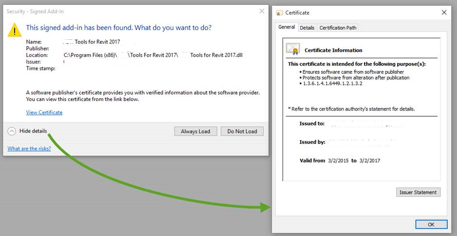

<head>
<meta http-equiv="Content-Type" content="text/html; charset=utf-8">
<link rel="stylesheet" type="text/css" href="bc.css">

<!--

-->
</head>

<!---

- 11755895 [Question Regarding the Security Signed Add-in Dialog that appears at Revit Startup]
  point to devguide
  http://forums.autodesk.com/t5/revit-api/code-signing-of-revit-addins/td-p/5981560

- bim 2 in uk
  It's official...
  The UK Mandates BIM Level 2
  In May 2011, it was announced that all UK government construction projects would be required to adhere to BIM Level 2 by 2016. That time is now.

- 11764878 [Communication between AutoCAD and Revit]

DLL Signature, BIM 2 in UK and AutoCAD.NET #revitAPI #3dwebcoder @AutodeskRevit #adsk #aec #bim @AutodeskForge #3dwebaccel

A couple of quick topics to start the week
&ndash; Add-in DLL signature
&ndash; BIM 2 in the UK
&ndash; Communication between AutoCAD and Revit...

-->

### DLL Signature, BIM 2 in UK and AutoCAD.NET

A couple of quick topics to start the week:

- [Add-in DLL signature](#2)
- [BIM 2 in the UK](#3)
- [Communication between AutoCAD and Revit](#4)

#### Add-In DLL Signature

As I mentioned [migrating RvtSamples to Revit 2017](http://thebuildingcoder.typepad.com/blog/2016/04/rvtsamples-for-revit-2017.html),
the ['Security – Unsigned Add-In' message](http://thebuildingcoder.typepad.com/blog/2016/04/rvtsamples-for-revit-2017.html#5) is
now displayed by Revit when an unsigned add-in DLL is detected.

We raised that question briefly in
the [Revit API discussion forum](http://forums.autodesk.com/t5/revit-api/bd-p/160) thread
on [code signing of Revit addins](http://forums.autodesk.com/t5/revit-api/code-signing-of-revit-addins/td-p/5981560),
and the issue came up again in another case yesterday:

**Question:** I signed my add-in, expecting that doing so would suppress the 'Security-Unsigned Add-in' message displayed during Revit start-up:

However, even when this DLL is signed, a similar dialogue appears, requiring user input:

Can this dialogue be suppressed?

I would prefer it not to interrupt the user experience during Revit start-up.

**Answer:** Please study the new section
on [Digitally Signing Your Revit Add-in](http://help.autodesk.com/view/RVT/2017/ENU/?guid=GUID-6D11F443-AC95-4B5B-A896-DD745BA0A46D) in
the [Online Revit 2017 Help](http://help.autodesk.com/view/RVT/2017/ENU) &gt;
Developers &gt; Revit API Developers Guide &gt; Introduction &gt; Add-In Integration &gt; Digitally Signing Your Revit Add-in.

It was updated just now and will hopefully resolve all your questions.

#### BIM 2 in the UK

It's official...

The UK Mandates BIM Level 2.

In May 2011, it was announced that all UK government construction projects would be required to adhere to BIM Level 2 by 2016.

That time is now.

The [Autodesk BIM 360](http://bim360.com) web site offers a [whitepaper](http://info.bim360.com/bim-level-2-whitepaper) explaining more.

Have fun with it, and congratulations to the UK BIM community for agreeing on such an important undertaking!

<!---
If you just want to take a quick glance with minimal fuss, here is
the [infographic](zip/bim-level-2-infographic.pdf)
and [whitepaper on Autodesk and the UK BIM Level 2 Mandate](zip/Autodesk_and_UK_BIM_Level_2_Mandate.pdf) already downloaded for you.
-->

#### Communication between AutoCAD and Revit

I am developing an application that will use both AutoCAD and Revit.

I develop a design in AutoCAD and then open that design data in Revit.

What is the best method to achieve this?

I see a couple of feasible options:

1. Direct link between AutoCAD and Revit in a class inheriting from `IExternalCommand` and passing data directly through method calls.
2. Using an external third executable program to act as an intermediary.
3. Using a file as an intermediary.
4. Implementing a TCP connection between programs.

Are there any other options?

**Answer:** I would suggest trying number 1 first.

There are two important aspects to consider here.

First, AutoCAD makes it really easy for you, since it provides a COM interface that can be driven through .NET and can be used to access the AutoCAD.NET API from outside AutoCAD.

For instance, through it, you can launch AutoCAD, open, create, read, write and otherwise manipulate a drawing, and close down AutoCAD again.

Secondly, you cannot do the same for Revit.

Revit makes it a little bit harder for you to drive it from outside.

The Revit API is entirely based on events.

You cannot use the Revit API except in a valid Revit API context, and a valid Revit API context is provided by Revit API events and nothing else.

For more details on this, please refer to The Building Coder topic group
on [Idling and external events for modeless access and driving Revit from outside](http://thebuildingcoder.typepad.com/blog/about-the-author.html#5.28).

Now for the good part: the combination of these two is easily possible.

You can implement a Revit add-in that also makes use of the AutoCAD.NET API and thus achieve the direct link that you suggest in item 1.
