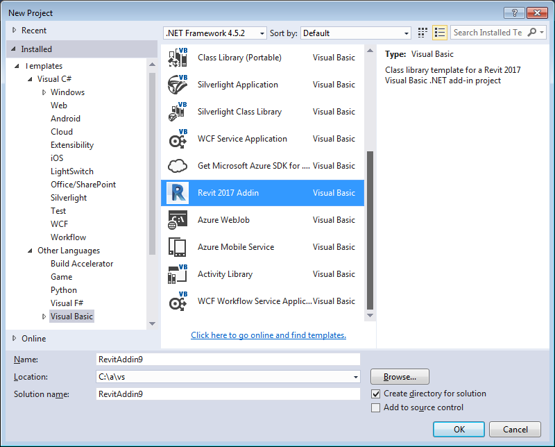

<head>
<meta http-equiv="Content-Type" content="text/html; charset=utf-8">
<link rel="stylesheet" type="text/css" href="bc.css">

<!--

-->
</head>

<!---

Visual Studio 2015 Revit 2017 Add-in Wizards #revitAPI #3dwebcoder @AutodeskRevit #adsk #aec #bim #dynamobim

I updated the Visual Studio Revit C# and VB add-in wizards for Revit 2017. They enable you to create a new C# or VB Revit add-in in Visual Studio with one single click on File &gt; New &gt; Project... &gt; Installed &gt; Templates &gt; Visual Basic/Visual C# &gt; Revit 2017 Addin. The wizard creates a complete Revit add-in skeleton, ready to immediately compile and run. Just hit F5 to start debugging; the add-in manifest is automatically created, copied to the proper location, Revit launched in the debugger, and your shiny new add-in is available in the external tools menu...

-->

### Visual Studio 2015 Revit 2017 Add-in Wizards

Friday the thirteenth!

Watch out; I certainly will. Well, I guess I always do, or try to &nbsp; :-)

I updated the Visual Studio Revit C# and VB add-in wizards for Revit 2017.

They enable you to create a new C# or VB Revit add-in in Visual Studio with one single click on File &gt; New &gt; Project... &gt; Installed &gt; Templates &gt; Visual Basic/Visual C# &gt; Revit 2017 Addin:

The wizard creates a complete Revit add-in skeleton, ready to immediately compile and run.

Just hit `F5` to start debugging; the add-in manifest is automatically created, copied to the proper location, Revit launched in the debugger, and your shiny new add-in is available in the external tools menu.

Here are the corresponding notes on the migration, customisation, usage and installation from the analogue task previous year:

- [Revit add-in wizards for Revit 2016](http://thebuildingcoder.typepad.com/blog/2015/04/add-in-migration-to-revit-2016-and-updated-wizards.html#3)
- [Revit add-in wizard customisation](http://thebuildingcoder.typepad.com/blog/2015/04/add-in-migration-to-revit-2016-and-updated-wizards.html#4)
- [Revit add-in wizard usage](http://thebuildingcoder.typepad.com/blog/2015/04/add-in-migration-to-revit-2016-and-updated-wizards.html#5)
- [Download and installation](http://thebuildingcoder.typepad.com/blog/2015/04/add-in-migration-to-revit-2016-and-updated-wizards.html#6)
- [Revit add-in wizards on GitHub and installer](http://thebuildingcoder.typepad.com/blog/2015/08/revit-add-in-wizard-github-installer.html)

Please refer to those for all further background information, since I will not repeat it here.

Some notes on new aspects not mentioned previously follow.

#### Changes &ndash; Debug Target and Icon Update

I was unable to specify the debug target in the Visual Studio 2015 `.csproj` file, so I added a `.csproj.user` for that.

Funnily enough, the debug target in the VB project works like before, so no need for that change there.

I also updated the obsolete icon file to the Revit 2017 one provided with Revit.exe.

#### Download

The current version discussed above
is [release 2017.0.0.0](https://github.com/jeremytammik/VisualStudioRevitAddinWizard/releases/tag/2017.0.0.0).

The newest version is always available from
the [VisualStudioRevitAddinWizard GitHub repository](https://github.com/jeremytammik/VisualStudioRevitAddinWizard).

#### Installation

The exact locations to install the wizards for Visual Studio are language dependent.

You install them by simply copying the zip file of your choice &ndash; for C#, VB, or both &ndash; to the appropriate Visual Studio project template folder in your local file system:

- C# – copy [Revit2016AddinWizardCs0.zip](zip/Revit2017AddinWizardCs0.zip)
to [My Documents]\Visual Studio 2015\Templates\ProjectTemplates\Visual C#
- Visual Basic – copy [Revit2016AddinWizardVb0](zip/Revit2017AddinWizardVb0.zip)
to [My Documents]\Visual Studio 2015\Templates\ProjectTemplates\Visual Basic

Or, in other words:

<pre>
  $ cp Revit2017AddinWizardCs0.zip \
  "/v/C/Users/tammikj/Documents/Visual Studio \
  2015/Templates/ProjectTemplates/Visual C#/"

  $ cp Revit2017AddinWizardVb0.zip \
  "/v/C/Users/tammikj/Documents/Visual Studio \
  2015/Templates/ProjectTemplates/Visual Basic/"
</pre>

I implemented a batch file `install.bat` to automate this process:

<pre class="prettyprint">
@echo off
if exist cs (goto okcs) else (echo "No cs folder found." && goto exit)
:okcs
if exist vb (goto okvb) else (echo "No vb folder found." && goto exit)
:okvb
set "D=C:\Users\%USERNAME%\Documents\Visual Studio 2015\Templates\ProjectTemplates"
set "F=%TEMP%\Revit2017AddinWizardCs0.zip"
echo Creating C# wizard archive %F%...
cd cs
zip -r "%F%" *
cd ..
echo Copying C# wizard archive to %D%\Visual C#...
copy "%F%" "%D%\Visual C#"
set "F=%TEMP%\Revit2017AddinWizardVb0.zip"
echo Creating VB wizard archive %F%...
cd vb
zip -r "%F%" *
cd ..
echo Copying VB wizard archive to %D%\Visual Basic...
copy "%F%" "%D%\Visual Basic"
:exit
</pre>

It assumes that you cloned the VisualStudioRevitAddinWizard to your local file system and call it from that directory, e.g., like this:

<pre>
Y:\VisualStudioRevitAddinWizard &gt; install.bat

Creating C# wizard archive C:\Users\tammikj\AppData\Local\Temp\Revit2017AddinWizardCs0.zip...
updating: App.cs (deflated 54%)
updating: Command.cs (deflated 59%)
updating: Properties/ (stored 0%)
updating: Properties/AssemblyInfo.cs (deflated 56%)
updating: RegisterAddin.addin (deflated 66%)
updating: TemplateIcon.ico (deflated 67%)
updating: TemplateRevitCs.csproj (deflated 68%)
updating: TemplateRevitCs.csproj.user (deflated 30%)
updating: TemplateRevitCs.vstemplate (deflated 65%)
Copying C# wizard archive to C:\Users\tammikj\Documents\Visual Studio 2015\Templates\ProjectTemplates\Visual C#...
        1 file(s) copied.

Creating VB wizard archive C:\Users\tammikj\AppData\Local\Temp\Revit2017AddinWizardVb0.zip...
updating: AdskApplication.vb (deflated 68%)
updating: AdskCommand.vb (deflated 58%)
updating: My Project/ (stored 0%)
updating: My Project/AssemblyInfo.vb (deflated 54%)
updating: RegisterAddin.addin (deflated 66%)
updating: TemplateIcon.ico (deflated 67%)
updating: TemplateRevitVb.vbproj (deflated 72%)
updating: TemplateRevitVb.vstemplate (deflated 62%)
Copying VB wizard archive to C:\Users\tammikj\Documents\Visual Studio 2015\Templates\ProjectTemplates\Visual Basic...
        1 file(s) copied.

Y:\VisualStudioRevitAddinWizard &gt;
</pre>

I hope you find this useful and look forward to hearing about your customisations and suggestions for other enhancements.

Have fun!
