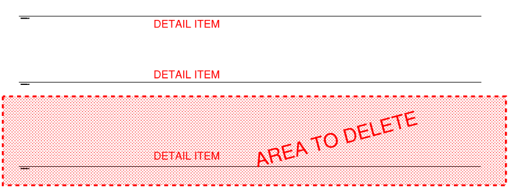

<head>
<title>The Building Coder</title>
<meta http-equiv="Content-Type" content="text/html; charset=utf-8">
<link rel="stylesheet" type="text/css" href="bc.css">

<!--

-->
</head>

<!---

Filtering for View Specific Elements #revitAPI #3dwebcoder @AutodeskForge #adsk #aec #bim #socket.io

While preparing for the Forge DevCon in SF and the Athens Forge meetup and web server workshop at The Cube Athens, I also happened to hear about the solution to the question raised by Chema in the Revit API discussion forum thread on deleting an area in a drafting view &ndash; I need to delete some elements (detail items) in a given area of my drafting view...

-->

### Filtering for View Specific Elements

While preparing for 
the [Forge DevCon](http://forge.autodesk.com/conference) in SF and 
the [Athens Forge meetup](http://www.meetup.com/de-DE/I-love-3D-Athens/events/230543759) and
[web server workshop](http://www.meetup.com/de-DE/I-love-3D-Athens/events/230544059) 
at [The Cube Athens](http://thecube.gr), 
I also happened to hear about the solution to the question raised by Chema in 
the [Revit API discussion forum](http://forums.autodesk.com/t5/revit-api/bd-p/160) thread
on [deleting an area in a drafting view](http://forums.autodesk.com/t5/revit-api/delete-an-area-in-a-drafting-view/td-p/6342882):

**Question:** I am working on a tool that creates schematics. I need to delete some elements (detail items) in a given area of my drafting view:

 

In the above example I need to remove the lower detail item and keep the other two. I am trying to use the `ElementOwnerViewFilter` combined with the `BoundingBoxIntersectsFilter` as shown below.

<pre class="code">
private&nbsp;void&nbsp;CleardBArea(
&nbsp;&nbsp;Document&nbsp;doc,
&nbsp;&nbsp;ElementId&nbsp;vId,
&nbsp;&nbsp;int&nbsp;dBPos,
&nbsp;&nbsp;double&nbsp;width,
&nbsp;&nbsp;double&nbsp;height&nbsp;)
{
&nbsp;&nbsp;XYZ&nbsp;min&nbsp;=&nbsp;new&nbsp;XYZ(&nbsp;0,&nbsp;(&nbsp;height&nbsp;/&nbsp;4&nbsp;)&nbsp;*&nbsp;dBPos,&nbsp;0&nbsp;);
&nbsp;&nbsp;XYZ&nbsp;max&nbsp;=&nbsp;new&nbsp;XYZ(&nbsp;width,&nbsp;(&nbsp;height&nbsp;/&nbsp;4&nbsp;)&nbsp;*&nbsp;(&nbsp;dBPos&nbsp;+&nbsp;1&nbsp;),&nbsp;0&nbsp;);
 
&nbsp;&nbsp;Outline&nbsp;outline&nbsp;=&nbsp;new&nbsp;Outline(&nbsp;min,&nbsp;max&nbsp;);
 
&nbsp;&nbsp;BoundingBoxIntersectsFilter&nbsp;bbF
&nbsp;&nbsp;&nbsp;&nbsp;=&nbsp;new&nbsp;BoundingBoxIntersectsFilter(&nbsp;outline&nbsp;);
 
&nbsp;&nbsp;ElementOwnerViewFilter&nbsp;eOVF
&nbsp;&nbsp;&nbsp;&nbsp;=&nbsp;new&nbsp;ElementOwnerViewFilter(&nbsp;vId&nbsp;);
 
&nbsp;&nbsp;FilteredElementCollector&nbsp;vColl
&nbsp;&nbsp;&nbsp;&nbsp;=&nbsp;new&nbsp;FilteredElementCollector(&nbsp;doc&nbsp;)
&nbsp;&nbsp;&nbsp;&nbsp;&nbsp;&nbsp;.WherePasses(&nbsp;eOVF&nbsp;)
&nbsp;&nbsp;&nbsp;&nbsp;&nbsp;&nbsp;.WherePasses(&nbsp;bbF&nbsp;);
 
&nbsp;&nbsp;ClearElements(&nbsp;vColl&nbsp;);
}
</pre>

It works fine if I try to delete model lines, but unfortunately, when I try to delete detail items, the filter ignores it.

Could you please recommend any other way to develop it?

I attached a zip file [filter_detail_item.zip](zip/filter_detail_item.zip) with the minimal information to reproduce my problem: a Revit 2015 project file containing a macro that should remove half of the drafting view. It works with all elements excepts the family instances.

Answer: The `BoundingBoxIntersectsFilter` is intended for use with a model geometry bounding box. 

A detail item only has a view specific geometry bounding box, so it fails to filter them. 

The workaround is to retrieve the view specific bounding box and use `Outline.Intersects` to perform the equivalent check, e.g., like this:

<pre class="code">
  var&nbsp;b1&nbsp;=&nbsp;detailItem.get_BoundingBox(&nbsp;this.ActiveView&nbsp;);
  XYZ&nbsp;min&nbsp;=&nbsp;new&nbsp;XYZ();
  XYZ&nbsp;max&nbsp;=&nbsp;new&nbsp;XYZ(&nbsp;1.969,&nbsp;0.656,&nbsp;0&nbsp;);
  var&nbsp;outline&nbsp;=&nbsp;new&nbsp;Outline(&nbsp;min,&nbsp;max&nbsp;);
  var&nbsp;outlineOfDetailItem&nbsp;=&nbsp;new&nbsp;Outline(&nbsp;b1.Min,&nbsp;b1.Max&nbsp;);
  outline.Intersects(&nbsp;outlineOfDetailItem,&nbsp;0.00001&nbsp;);
</pre>

