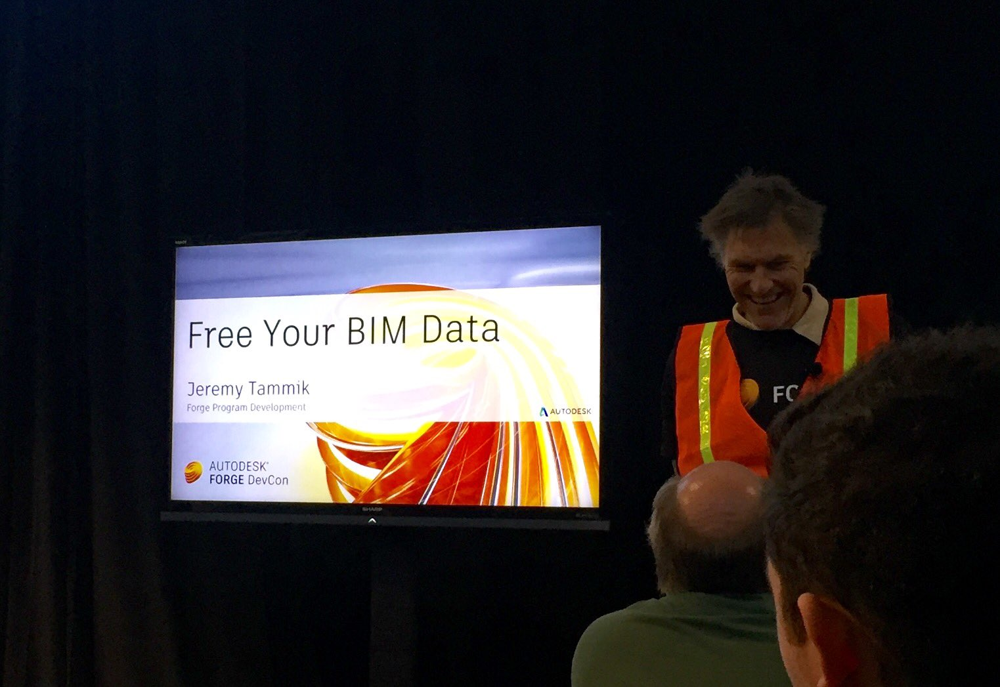

<head>
<title>The Building Coder</title>
<meta http-equiv="Content-Type" content="text/html; charset=utf-8"/>
<link rel="stylesheet" type="text/css" href="3dwc.css"/>

</head>

<!---

 #revitapi #3dwebcoder @AutodeskForge #ForgeDevCon

Dynamic Model Updater Tutorial and Wizard Update #3dwebcoder #revitapi @AutodeskForge #ForgeDevCon

The Forge DevCon is over and was a great success. I am really excited to see where our paths will lead us in the near future as we continue to improve the connections between the desktop, Revit and BIM to the cloud and move forward towards freeing our BIM data. I published pointers to all the 'Free your BIM data' resources yesterday. Our main topics today are completely different and purely Revit API related
&ndash; Updated Visual Studio Revit Add-in Wizards
&ndash; RevitPythonShell Dynamic Model Updater Tutorial...

-->

### Dynamic Model Updater Tutorial and Wizard Update

The [Forge DevCon](http://forge.autodesk.com/conference) is over and was a great success.

I am really excited to see where our paths will lead us in the near future as we continue to improve the connections between the desktop, Revit and BIM to the cloud and move forward towards freeing our BIM data.

I published pointers to all the [Free your BIM data resources](http://thebuildingcoder.typepad.com/blog/2016/06/free-your-bim-data-and-roomedit3d-thee-legged-forge-oauth.html) yesterday.

Here are some more snapshots from the second day at the event, taken during my few ventures outside the festival pavilion building housing it:

Our main topics today are completely different and purely Revit API related:

- [Updated Visual Studio Revit Add-in Wizards](#2)
- [RevitPythonShell Dynamic Model Updater Tutorial](#3)

#### Updated Visual Studio Revit Add-in Wizards

I updated
the [Visual Studio Revit Add-in Wizards](http://thebuildingcoder.typepad.com/blog/about-the-author.html#5.20)
to suppress
the [architecture mismatch warning](http://thebuildingcoder.typepad.com/blog/2013/06/processor-architecture-mismatch-warning.html)
(cf. the corresponding [command line utility](http://thebuildingcoder.typepad.com/blog/2013/07/recursively-disable-architecture-mismatch-warning.html)).

The most up-to-date version is always available from
the [VisualStudioRevitAddinWizard GitHub repository](https://github.com/jeremytammik/VisualStudioRevitAddinWizard),
and this update is captured
in [release 2017.0.0.1](https://github.com/jeremytammik/VisualStudioRevitAddinWizard/releases/tag/2017.0.0.1).

#### RevitPythonShell Dynamic Model Updater Tutorial

[Pierre Moureu](https://github.com/PMoureu) created a very helpful tutorial on using
the [Dynamic Model Updater framework DMU](http://thebuildingcoder.typepad.com/blog/about-the-author.html#5.31) in the context
of [Daren Thomas](https://github.com/daren-thomas)'
[RevitPythonShell](https://github.com/architecture-building-systems/revitpythonshell):

- [Revit Python Shell IUpdater Tutorial](https://github.com/PMoureu/samples-Python-RPS/tree/master/Tutorial-IUpdater)

To give you an idea of what this is about, here is the readme table of contents:

0. [Intro](https://github.com/PMoureu/samples-Python-RPS/tree/master/Tutorial-IUpdater#intro)
1. [First step : Simple External File](https://github.com/PMoureu/samples-Python-RPS/tree/master/Tutorial-IUpdater#i-first-step--simple-external-file)
2. [Registration Improvement : startup.py](https://github.com/PMoureu/samples-Python-RPS/tree/master/Tutorial-IUpdater#ii-registration-improvement--startuppy)
    - [Simple Case : Application Wide](https://github.com/PMoureu/samples-Python-RPS/tree/master/Tutorial-IUpdater#simple-case--application-wide)
    - [Less Simple Case : Specific Documents](https://github.com/PMoureu/samples-Python-RPS/tree/master/Tutorial-IUpdater#less-simple-case--specific-documents)
3. [About ChangeType and Newly Added/Deleted Elements](https://github.com/PMoureu/samples-Python-RPS/tree/master/Tutorial-IUpdater#iii-about-changetype-and-newly-addeddeleted-elements)
4. [Ergonomic Improvement](https://github.com/PMoureu/samples-Python-RPS/tree/master/Tutorial-IUpdater#iv-ergonomic-improvement)

In Pierre's own words:

> I wanted to share the work we've done on a small course on Python in Revit.
> We tested using IUpdaters with RevitPythonShell and it seems to work great!
> The method might help other users with setting up this tool, since I didn't find any other example for this in Python...

> You can find the tutorial and the examples at
[github.com/PMoureu/samples-Python-RPS/tree/master/Tutorial-IUpdater](https://github.com/PMoureu/samples-Python-RPS/tree/master/Tutorial-IUpdater).

This tutorial is extremely useful from two completely opposite perspectives, both for Revit Python shell users wishing explore the powerful possibilities provided by DMU, and also for Revit API add-in developers with or without DMU experience wishing to acquaint themselves with some of the more powerful aspects of the Revit Python shell.

Many thanks to Pierre for creating and sharing this!
