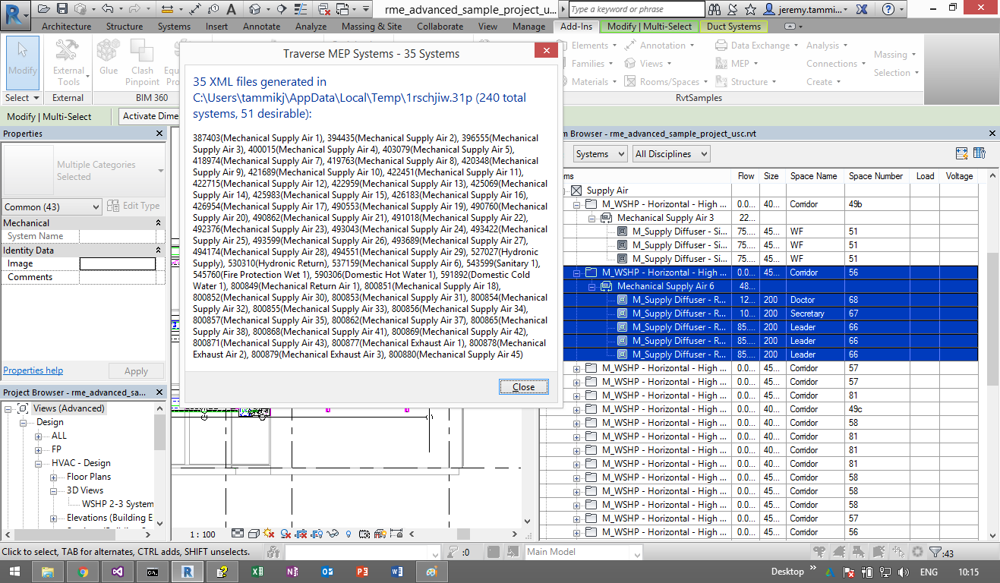

<head>
<title>The Building Coder</title>
<meta http-equiv="Content-Type" content="text/html; charset=utf-8"/>
<link rel="stylesheet" type="text/css" href="3dwc.css"/>

</head>

<!---

Traversing and Exporting all MEP System Graphs #revitapi #3dwebcoder @AutodeskForge #ForgeDevCon

The Forge DevCon last week completed successfully. I had a full body 3D scan created there and used <code>sed</code> to flip the axes of the resulting OBJ mode. This week, I am sitting in the Autodesk offices at One Market in San Francisco, supporting the fourth Cloud Accelerator. One of the projects we are working on is from the University of Southern California to interact with Revit MEP systems in the Forge viewer. That requires traversing the MEP systems in the Revit model to store, recreate and represent their graph structures in the viewer
&ndash; Revit MEP System Traversal
&ndash; TraverseAllSystems Revit Add-in
&ndash; Download
&ndash; To do
&ndash; Thanks to Mustafa Salaheldin...

-->

### Traversing and Exporting all MEP System Graphs

The [Forge DevCon](http://forge.autodesk.com/conference) last week completed successfully.

I had a [full body 3D scan](https://www.artec3d.com/events/autodesk-forge-devcon-2016) created there in
the [Shapify Booth](https://www.artec3d.com/hardware/shapifybooth) and explained
on [The 3D Web Coder](http://thebuildingcoder.typepad.com/) how I
used [`sed`](https://en.wikipedia.org/wiki/Sed)
to [flip the axes of the resulting OBJ model](http://the3dwebcoder.typepad.com/blog/2016/06/flipping-obj-axes-with-texture-for-forge-viewer.html).

This week, I am sitting in the Autodesk offices at One Market in San Francisco, supporting the fourth [Cloud Accelerator](http://autodeskcloudaccelerator.com) taking place here.

One of the projects we are working on is from USC,
the [University of Southern California](http://www.usc.edu)
[Facilities Management](http://facilities.usc.edu)
[CAD Services](http://facilities.usc.edu/multisidebar_sublinks.asp?ItemID=236).

One of its goals is to interact with Revit MEP systems in the Forge viewer.

That requires traversing the MEP systems in the Revit model to store, recreate and represent their graph structures in the viewer.

Below, I present the Revit add-in that I have started implementing to generate and supply that information:

- [Revit MEP System Traversal](#2)
- [TraverseAllSystems Revit Add-in](#3)
- [Download](#4)
- [To do](#5)
- [Thanks to Mustafa Salaheldin](#6)

Before getting to that, here are a couple of pictures from the past weekend.

Saturday, I crossed the Golden Gate bridge and the Marin headlands to Sausalito:

Sunday, I participated in
the [ecstatic dance event](http://ecstaticdance.org/SF)
([FB](https://www.facebook.com/groups/EcstaticSF)) in their great new location and enjoyed the views from
the [Buena Vista](http://sfrecpark.org/destination/buena-vista-park)
and [Presidio](https://en.wikipedia.org/wiki/Presidio_Park) parks:

#### Revit MEP System Traversal

Today, I present a simple Revit add-in that analyses all MEP systems in the model and determines the graph structure representing the connections between the systems elements.

I discussed a [simple MEP system traversal](http://thebuildingcoder.typepad.com/blog/2013/02/simple-mep-system-traversal.html) in 2013.

The graph information required in this case, however, requires the more advanced traversal algorithms determining the correct order of the individual system elements in the direction of the flow implemented by
the [TraverseSystem SDK sample](http://thebuildingcoder.typepad.com/blog/2009/06/revit-mep-api.html)
([2010](http://thebuildingcoder.typepad.com/blog/2009/09/the-revit-mep-api.html#6),
[2011](http://thebuildingcoder.typepad.com/blog/2010/05/the-revit-mep-2011-api.html#samples)) for mechanical systems and
the [AdnRme sample](http://thebuildingcoder.typepad.com/blog/2012/05/the-adn-mep-sample-adnrme-for-revit-mep-2013.html)
([GitHub repo](https://github.com/jeremytammik/AdnRme)) for electrical ones.

#### TraverseAllSystems Revit Add-in

I implemented a simple C# .NET Revit API add-in that performs the following steps:

- Process the BIM in read-only mode.
- Retrieve all MEP systems from the model.
- Filter out the ones we are interested in by applying the `IsDesirableSystemPredicate` method.
- For each of these systems, instantiate a `TraversalTree` object, scavenged from the Revit SDK TraverseSystem sample.
- Create a temporary output folder to store the resulting XML files storing the graph information.
- Export a separate XML file for each system.

Here is the main implementation file of the external command:

<pre class="code">
 [Transaction(&nbsp;TransactionMode.ReadOnly&nbsp;)]
 public&nbsp;class&nbsp;Command&nbsp;:&nbsp;IExternalCommand
 {
 &nbsp;&nbsp;///&nbsp;&lt;summary&gt;
 &nbsp;&nbsp;///&nbsp;Return&nbsp;true&nbsp;to&nbsp;include&nbsp;this&nbsp;system&nbsp;in&nbsp;the&nbsp;
 &nbsp;&nbsp;///&nbsp;exported&nbsp;system&nbsp;graphs.
 &nbsp;&nbsp;///&nbsp;&lt;/summary&gt;
 &nbsp;&nbsp;static&nbsp;bool&nbsp;IsDesirableSystemPredicate(&nbsp;MEPSystem&nbsp;s&nbsp;)
 &nbsp;&nbsp;{
 &nbsp;&nbsp;&nbsp;&nbsp;return&nbsp;s&nbsp;is&nbsp;MechanicalSystem&nbsp;||&nbsp;s&nbsp;is&nbsp;PipingSystem
 &nbsp;&nbsp;&nbsp;&nbsp;&nbsp;&nbsp;&amp;&amp;&nbsp;!s.Name.Equals(&nbsp;&quot;unassigned&quot;&nbsp;)
 &nbsp;&nbsp;&nbsp;&nbsp;&nbsp;&nbsp;&amp;&amp;&nbsp;1&nbsp;&lt;&nbsp;s.Elements.Size;
 &nbsp;&nbsp;}

 &nbsp;&nbsp;///&nbsp;&lt;summary&gt;
 &nbsp;&nbsp;///&nbsp;Create&nbsp;a&nbsp;and&nbsp;return&nbsp;the&nbsp;path&nbsp;of&nbsp;a&nbsp;random&nbsp;temporary&nbsp;directory.
 &nbsp;&nbsp;///&nbsp;&lt;/summary&gt;
 &nbsp;&nbsp;static&nbsp;string&nbsp;GetTemporaryDirectory()
 &nbsp;&nbsp;{
 &nbsp;&nbsp;&nbsp;&nbsp;string&nbsp;tempDirectory&nbsp;=&nbsp;Path.Combine(
 &nbsp;&nbsp;&nbsp;&nbsp;&nbsp;&nbsp;Path.GetTempPath(),&nbsp;Path.GetRandomFileName()&nbsp;);

 &nbsp;&nbsp;&nbsp;&nbsp;Directory.CreateDirectory(&nbsp;tempDirectory&nbsp;);

 &nbsp;&nbsp;&nbsp;&nbsp;return&nbsp;tempDirectory;
 &nbsp;&nbsp;}

 &nbsp;&nbsp;public&nbsp;Result&nbsp;Execute(
 &nbsp;&nbsp;&nbsp;&nbsp;ExternalCommandData&nbsp;commandData,
 &nbsp;&nbsp;&nbsp;&nbsp;ref&nbsp;string&nbsp;message,
 &nbsp;&nbsp;&nbsp;&nbsp;ElementSet&nbsp;elements&nbsp;)
 &nbsp;&nbsp;{
 &nbsp;&nbsp;&nbsp;&nbsp;UIApplication&nbsp;uiapp&nbsp;=&nbsp;commandData.Application;
 &nbsp;&nbsp;&nbsp;&nbsp;UIDocument&nbsp;uidoc&nbsp;=&nbsp;uiapp.ActiveUIDocument;
 &nbsp;&nbsp;&nbsp;&nbsp;Application&nbsp;app&nbsp;=&nbsp;uiapp.Application;
 &nbsp;&nbsp;&nbsp;&nbsp;Document&nbsp;doc&nbsp;=&nbsp;uidoc.Document;

 &nbsp;&nbsp;&nbsp;&nbsp;FilteredElementCollector&nbsp;allSystems
 &nbsp;&nbsp;&nbsp;&nbsp;&nbsp;&nbsp;=&nbsp;new&nbsp;FilteredElementCollector(&nbsp;doc&nbsp;)
 &nbsp;&nbsp;&nbsp;&nbsp;&nbsp;&nbsp;&nbsp;&nbsp;.OfClass(&nbsp;typeof(&nbsp;MEPSystem&nbsp;)&nbsp;);

 &nbsp;&nbsp;&nbsp;&nbsp;int&nbsp;nAllSystems&nbsp;=&nbsp;allSystems.Count&lt;Element&gt;();

 &nbsp;&nbsp;&nbsp;&nbsp;IEnumerable&lt;MEPSystem&gt;&nbsp;desirableSystems
 &nbsp;&nbsp;&nbsp;&nbsp;&nbsp;&nbsp;=&nbsp;allSystems.Cast&lt;MEPSystem&gt;().Where&lt;MEPSystem&gt;(
 &nbsp;&nbsp;&nbsp;&nbsp;&nbsp;&nbsp;&nbsp;&nbsp;s&nbsp;=&gt;&nbsp;IsDesirableSystemPredicate(&nbsp;s&nbsp;)&nbsp;);

 &nbsp;&nbsp;&nbsp;&nbsp;int&nbsp;nDesirableSystems&nbsp;=&nbsp;desirableSystems
 &nbsp;&nbsp;&nbsp;&nbsp;&nbsp;&nbsp;.Count&lt;Element&gt;();

 &nbsp;&nbsp;&nbsp;&nbsp;string&nbsp;outputFolder&nbsp;=&nbsp;GetTemporaryDirectory();

 &nbsp;&nbsp;&nbsp;&nbsp;int&nbsp;n&nbsp;=&nbsp;0;

 &nbsp;&nbsp;&nbsp;&nbsp;foreach(&nbsp;MEPSystem&nbsp;system&nbsp;in&nbsp;desirableSystems&nbsp;)
 &nbsp;&nbsp;&nbsp;&nbsp;{
 &nbsp;&nbsp;&nbsp;&nbsp;&nbsp;&nbsp;Debug.Print(&nbsp;system.Name&nbsp;);

 &nbsp;&nbsp;&nbsp;&nbsp;&nbsp;&nbsp;FamilyInstance&nbsp;root&nbsp;=&nbsp;system.BaseEquipment;

 &nbsp;&nbsp;&nbsp;&nbsp;&nbsp;&nbsp;//&nbsp;Traverse&nbsp;the&nbsp;system&nbsp;and&nbsp;dump&nbsp;the&nbsp;
 &nbsp;&nbsp;&nbsp;&nbsp;&nbsp;&nbsp;//&nbsp;traversal&nbsp;graph&nbsp;into&nbsp;an&nbsp;XML&nbsp;file

 &nbsp;&nbsp;&nbsp;&nbsp;&nbsp;&nbsp;TraversalTree&nbsp;tree&nbsp;=&nbsp;new&nbsp;TraversalTree(&nbsp;system&nbsp;);

 &nbsp;&nbsp;&nbsp;&nbsp;&nbsp;&nbsp;if(&nbsp;tree.Traverse()&nbsp;)
 &nbsp;&nbsp;&nbsp;&nbsp;&nbsp;&nbsp;{
 &nbsp;&nbsp;&nbsp;&nbsp;&nbsp;&nbsp;&nbsp;&nbsp;string&nbsp;filename&nbsp;=&nbsp;system.Id.IntegerValue.ToString();

 &nbsp;&nbsp;&nbsp;&nbsp;&nbsp;&nbsp;&nbsp;&nbsp;filename&nbsp;=&nbsp;Path.ChangeExtension(
 &nbsp;&nbsp;&nbsp;&nbsp;&nbsp;&nbsp;&nbsp;&nbsp;&nbsp;&nbsp;Path.Combine(&nbsp;outputFolder,&nbsp;filename&nbsp;),&nbsp;&quot;xml&quot;&nbsp;);

 &nbsp;&nbsp;&nbsp;&nbsp;&nbsp;&nbsp;&nbsp;&nbsp;tree.DumpIntoXML(&nbsp;filename&nbsp;);

 &nbsp;&nbsp;&nbsp;&nbsp;&nbsp;&nbsp;&nbsp;&nbsp;//&nbsp;Uncomment&nbsp;to&nbsp;preview&nbsp;the&nbsp;
 &nbsp;&nbsp;&nbsp;&nbsp;&nbsp;&nbsp;&nbsp;&nbsp;//&nbsp;resulting&nbsp;XML&nbsp;structure

 &nbsp;&nbsp;&nbsp;&nbsp;&nbsp;&nbsp;&nbsp;&nbsp;//Process.Start(&nbsp;fileName&nbsp;);

 &nbsp;&nbsp;&nbsp;&nbsp;&nbsp;&nbsp;&nbsp;&nbsp;++n;
 &nbsp;&nbsp;&nbsp;&nbsp;&nbsp;&nbsp;}
 &nbsp;&nbsp;&nbsp;&nbsp;}

 &nbsp;&nbsp;&nbsp;&nbsp;string&nbsp;main&nbsp;=&nbsp;string.Format(
 &nbsp;&nbsp;&nbsp;&nbsp;&nbsp;&nbsp;&quot;{0}&nbsp;XML&nbsp;files&nbsp;generated&nbsp;in&nbsp;{1}&nbsp;({2}&nbsp;total&quot;
 &nbsp;&nbsp;&nbsp;&nbsp;&nbsp;&nbsp;+&nbsp;&quot;systems,&nbsp;{3}&nbsp;desirable):&quot;,
 &nbsp;&nbsp;&nbsp;&nbsp;&nbsp;&nbsp;n,&nbsp;outputFolder,&nbsp;nAllSystems,
 &nbsp;&nbsp;&nbsp;&nbsp;&nbsp;&nbsp;nDesirableSystems&nbsp;);

 &nbsp;&nbsp;&nbsp;&nbsp;List&lt;string&gt;&nbsp;system_list&nbsp;=&nbsp;desirableSystems
 &nbsp;&nbsp;&nbsp;&nbsp;&nbsp;&nbsp;.Select&lt;Element,&nbsp;string&gt;(&nbsp;e&nbsp;=&gt;
 &nbsp;&nbsp;&nbsp;&nbsp;&nbsp;&nbsp;&nbsp;&nbsp;string.Format(&nbsp;&quot;{0}({1})&quot;,&nbsp;e.Id,&nbsp;e.Name&nbsp;)&nbsp;)
 &nbsp;&nbsp;&nbsp;&nbsp;&nbsp;&nbsp;.ToList&lt;string&gt;();

 &nbsp;&nbsp;&nbsp;&nbsp;system_list.Sort();

 &nbsp;&nbsp;&nbsp;&nbsp;string&nbsp;detail&nbsp;=&nbsp;string.Join(&nbsp;&quot;,&nbsp;&quot;,
 &nbsp;&nbsp;&nbsp;&nbsp;&nbsp;&nbsp;system_list.ToArray&lt;string&gt;()&nbsp;);

 &nbsp;&nbsp;&nbsp;&nbsp;TaskDialog&nbsp;dlg&nbsp;=&nbsp;new&nbsp;TaskDialog(&nbsp;n.ToString()
 &nbsp;&nbsp;&nbsp;&nbsp;&nbsp;&nbsp;+&nbsp;&quot;&nbsp;Systems&quot;&nbsp;);

 &nbsp;&nbsp;&nbsp;&nbsp;dlg.MainInstruction&nbsp;=&nbsp;main;
 &nbsp;&nbsp;&nbsp;&nbsp;dlg.MainContent&nbsp;=&nbsp;detail;

 &nbsp;&nbsp;&nbsp;&nbsp;dlg.Show();

 &nbsp;&nbsp;&nbsp;&nbsp;return&nbsp;Result.Succeeded;
 &nbsp;&nbsp;}
 }
</pre>

I ran the command in the RME advanced sample project included with the standard Revit installation, `rme_advanced_sample_project.rvt`.

The result of doing so looks like this:

It contains 240 MEP systems, 51 of which were deemed 'desirable' by the `IsDesirableSystemPredicate` method, of which only 35 produced any interesting graph data, exported to individual XML files in a random temporary directory.

#### Download

The current state of this project is available from
the [TraverseAllSystems GitHub repository](https://github.com/jeremytammik/TraverseAllSystems), and the version discussed above
is [release 2017.0.0.1](https://github.com/jeremytammik/TraverseAllSystems/releases/tag/2017.0.0.1).

#### To Do

The next step will be to implement a Forge viewer extension displaying a custom panel in the user interface hosting a tree view of the MEP system graphs and implementing two-way linking and selection functionality back and forth between the tree view nodes and the 2D and 3D viewer elements.

We also need to figgure out how to transport the graph information from the Revit add-in to the Forge viewer.

Presumably, we will encode it in JSON instead of XML, to start with, to make it easier to handle directly in JavaScript, e.g. by implementing a viewer extension making use of [jstree](https://www.jstree.com/docs/json) to interact with the graph.

Here are some of the storage options:

- Store the graph data in a stand-alone cloud-based repository and link it with the viewer elements dynamically
- Store the graph data as neighbourship relationships in each MEP system element, for instance in a shared parameter.
- Store the entire graph data in one single JSON structure, for instance on each MEP system base equipment element.

These options can obviously be combined, and even all implemented at once.

Probaly, the easiest way to transport the data from the BIM to the Forge platform will be to store it in shared parameter data on Revit elements.

Then it will be automatically included and handled by the standard Forge translation process for Revit RVT files.

#### Thanks to Mustafa Salaheldin

One last important point before closing.

In the past weeks,
[Mustafa Salaheldin](http://forums.autodesk.com/t5/user/viewprofilepage/user-id/1227311) has answered more cases on
the [Revit API forum](http://forums.autodesk.com/t5/revit-api/bd-p/160) than any other person before him ever was able to do in the past:

Nobody ever reached that ranking before.

I cannot even imagine how he does it.

Thank you very much, Mustafa!

It is extremely appreciated by the entire community!
