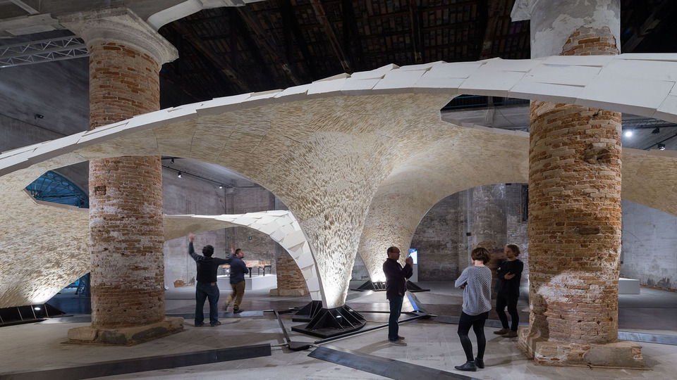

<head>
<title>The Building Coder</title>
<meta http-equiv="Content-Type" content="text/html; charset=utf-8"/>
<link rel="stylesheet" type="text/css" href="3dwc.css"/>

</head>

<!---

- 10536988 [Door/Window Areas]
  http://forums.autodesk.com/t5/revit-api/door-window-areas/m-p/5535565
  out param in python
  http://stackoverflow.com/questions/2857287/writing-iron-python-method-with-ref-or-out-parameter

- beyond bending: ETH zurich erects sandstone vault at venice architecture biennale
  http://www.designboom.com/architecture/venice-architecture-biennale-beyond-bending-eth-zurich-block-research-group-05-26-2016/

Retrieving a C# `out` Argument Value in #Python #revitapi #3dwebcoder @AutodeskRevit #dynamobim

Here is a short note on two interesting little items that just cropped up
&ndash; Retrieving a C# <code>out</code> argument value in Python
&ndash; ETH Zurich Sandstone Vault at the Venice Architecture Biennale...

-->

### Retrieving a C# `out` Argument Value in Python

Here is a short note on two interesting little items that just cropped up:

- [Retrieving a C# `out` argument value in Python](#2)
- [ETH Zurich Sandstone Vault at the Venice Architecture Biennale](#3)

#### Retrieving a C# `out` Argument Value in Python

This issue was raised and solved by Peter aka KOP in
the [Revit API discussion forum](http://forums.autodesk.com/t5/revit-api/bd-p/160) thread
on [door and window areas](http://forums.autodesk.com/t5/revit-api/door-window-areas/m-p/5535565):

**Question:** I understand that this code returns the curve loop of a cutout:
 
<pre class="prettyprint">
  curveLoop = I.ExporterIFCUtils
    .GetInstanceCutoutFromWall(
      doc, wall, familyInstance, out basisY );
</pre>
 
unfortunately, i am trying to achieve the result from the python side.

my efforts end in errors for the `out basisY`.

as my coding skills are still limited, can anyone help me out on this?

**Answer:** Issue is solved for the Python code required.

my solution went like:
 
<pre class="prettyprint">
  for i in openingIds:
    try:
      bounding, orient = I.ExporterIFCUtils.GetInstanceCutoutFromWall(doc, element, doc.GetElement(i),)
      print "success"
    except:
      print (" failed for wall %s and opening %s" %(element.Id, i))
</pre>

Many thanks to Peter for sharing this useful result.

By the way, here is another explanation of writing
an [IronPython method with `ref` or `out` parameter](http://stackoverflow.com/questions/2857287/writing-iron-python-method-with-ref-or-out-parameter),
not related to Revit.

#### ETH Zurich Sandstone Vault at the Venice Architecture Biennale

I recently mentioned
my [visit to the Block Research Group at ETHZ](http://thebuildingcoder.typepad.com/blog/2016/03/adn-becomes-forge-and-barcelona-accelerator.html#4) and
the fascinating architectural research they are practicing there, on building extremely efficient material-saving vaults.

Now they are [exhibiting custom beautiful vaults at the Venice Architecture Biennale](http://www.designboom.com/architecture/venice-architecture-biennale-beyond-bending-eth-zurich-block-research-group-05-26-2016):

