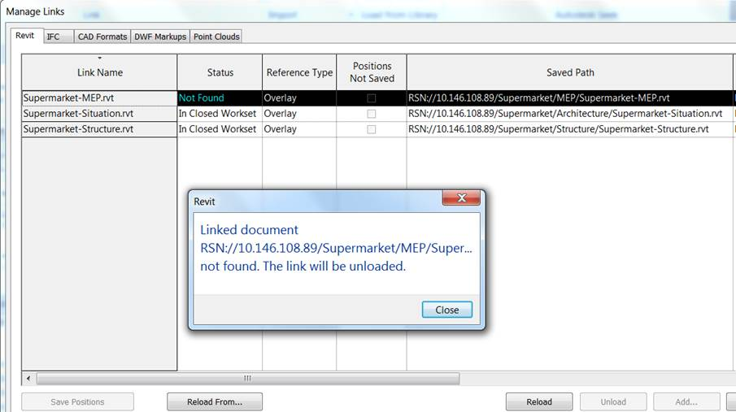
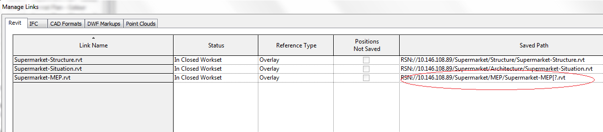

<head>
<title>The Building Coder</title>
<meta http-equiv="Content-Type" content="text/html; charset=utf-8"/>
<link rel="stylesheet" type="text/css" href="3dwc.css"/>

</head>

<!---

Miroslav Schonauer RE: Links not automatically reloaded after migrating Revit model to 2016

Automatically Reload Links After Migration #revitapi #3dwebcoder @AutodeskRevit @AutodeskForge #aec #bim

...

-->

### Automatically Reload Links After Migration

Today, my colleagues Michael Brian Lee and Miroslav Schonauer share a solution for links that are not automatically reloaded after migrating the model to Revit 2016.

#### Question
 
I implemented a batch tool to migrate Revit Server 2015 models to Revit Server 2016.

Danny Polkinhorn’s SaveAsNewCentral code was a great starting point, and the tool is successfully migrating the models.

The workflow for the migration is to open 2015 model detached from central with all worksets closed,  which starts an automatic upgrade process, then save to the 2016 server.

The assumption was that links will be taken care of automatically.
 
To verify the migration and upgrade I perform the following steps:

- Open model in Revit Server 2016 with all worksets closed.
- Go to Manage Links.
- Check Saved Path &ndash; it seems correct.
- Click on the Reload button.

That displays the following error saying that the linked file cannot be found:

I then click on Reload From, navigate to the exactly the same path as shown in the Saved Path, and the link is loaded.
 
Any idea of why the Reload does not find the model, even if the path is correct?

It is possible that the automatic upgrade changed the GUID of the models?

How can I get around this?

At the moment I think I'll need to implement and run another batch tool once all models are migrated.

The second tool could reload all links using `RevitLinkLoadResult.LoadFrom` and then sync to central.

Would that work?

Is there any other way around this?

Second question:

In some of my tests, I see some strange characters on some of the server paths:

What might be causing that, please?

#### Answer

I suspect that this is an artefact of how link resolution is achieved with Revit Server.

Although, from the UI, it looks as if it is resolving by a path, in reality, it is actually resolving by a unique GUID that corresponds to the central model.  This allows us to transparently repath a link if it is moved to a new folder or server, or if it is renamed.  However, the trade-off is that it cannot automatically repath to a new model replacing an old one, even if the name and location are the same.  That’s because each new model, when saved to the server for the first time, is equipped with a new unique GUID.

#### Solution

Thank you for the official confirmation, Mike &ndash; it is good to know we are not doing anything fundamentally wrong in our scripts and Revit Server code.

Further good news: we managed to implement a programmatic solution for this Revit Server workflow issue.

Basically, we prototyped a custom add-in command that now fully simulates the manual UI solution, i.e., it automates selecting 'Reload from….' in Manage Links and browsing to basically the same location as the 'Saved Path' shown does.

It took a bit of time to find the right classes as there are no less than four levels of indirection to get from `RevitLinkType` to the 'Saved Path' and then use that in the call to `LoadFrom`.

Here are the most important steps:

<pre class="code">
&nbsp;&nbsp;//&nbsp;Loop&nbsp;all&nbsp;RVT&nbsp;Links

&nbsp;&nbsp;foreach(&nbsp;RevitLinkType&nbsp;typeLink&nbsp;in&nbsp;fecLinkTypes&nbsp;)
&nbsp;&nbsp;{
&nbsp;&nbsp;&nbsp;&nbsp;//&nbsp;...
 
&nbsp;&nbsp;&nbsp;&nbsp;//&nbsp;Skip1&nbsp;-&nbsp;not&nbsp;IsFromRevitServer
 
&nbsp;&nbsp;&nbsp;&nbsp;if(&nbsp;!typeLink.IsFromRevitServer()&nbsp;)
&nbsp;&nbsp;&nbsp;&nbsp;{
&nbsp;&nbsp;&nbsp;&nbsp;&nbsp;&nbsp;//…
&nbsp;&nbsp;&nbsp;&nbsp;&nbsp;&nbsp;continue;
&nbsp;&nbsp;&nbsp;&nbsp;}
 
&nbsp;&nbsp;&nbsp;&nbsp;//&nbsp;Skip2&nbsp;-&nbsp;not&nbsp;ExternalFileReference
&nbsp;&nbsp;&nbsp;&nbsp;//&nbsp;99%&nbsp;it&nbsp;would&nbsp;already&nbsp;skip&nbsp;above&nbsp;as&nbsp;
&nbsp;&nbsp;&nbsp;&nbsp;//&nbsp;RevitServer&nbsp;MUST&nbsp;be&nbsp;ExternalFileReference,&nbsp;
&nbsp;&nbsp;&nbsp;&nbsp;//&nbsp;but&nbsp;leave&nbsp;just&nbsp;in&nbsp;case...
 
&nbsp;&nbsp;&nbsp;&nbsp;ExternalFileReference&nbsp;er&nbsp;=&nbsp;typeLink.GetExternalFileReference();
 
&nbsp;&nbsp;&nbsp;&nbsp;if(&nbsp;er&nbsp;==&nbsp;null&nbsp;)
&nbsp;&nbsp;&nbsp;&nbsp;{
&nbsp;&nbsp;&nbsp;&nbsp;&nbsp;&nbsp;//&nbsp;...
 
&nbsp;&nbsp;&nbsp;&nbsp;&nbsp;&nbsp;continue;
&nbsp;&nbsp;&nbsp;&nbsp;}
 
&nbsp;&nbsp;&nbsp;&nbsp;//&nbsp;If&nbsp;here,&nbsp;we&nbsp;can&nbsp;cache&nbsp;ModelPath&nbsp;related&nbsp;
&nbsp;&nbsp;&nbsp;&nbsp;//&nbsp;info&nbsp;and&nbsp;show&nbsp;to&nbsp;user&nbsp;regardless&nbsp;if&nbsp;we&nbsp;skip&nbsp;
&nbsp;&nbsp;&nbsp;&nbsp;//&nbsp;on&nbsp;next&nbsp;checks&nbsp;or&nbsp;not....
 
&nbsp;&nbsp;&nbsp;&nbsp;ModelPath&nbsp;mp&nbsp;=&nbsp;er.GetPath();
 
&nbsp;&nbsp;&nbsp;&nbsp;string&nbsp;userVisiblePath&nbsp;=&nbsp;ModelPathUtils
&nbsp;&nbsp;&nbsp;&nbsp;&nbsp;&nbsp;.ConvertModelPathToUserVisiblePath(&nbsp;mp&nbsp;);
 
&nbsp;&nbsp;&nbsp;&nbsp;//&nbsp;Skip3&nbsp;-&nbsp;if&nbsp;ModelPath&nbsp;is&nbsp;NOT&nbsp;Server&nbsp;Path&nbsp;
&nbsp;&nbsp;&nbsp;&nbsp;//&nbsp;99%&nbsp;redundant&nbsp;as&nbsp;we&nbsp;already&nbsp;checked&nbsp;raw&nbsp;
&nbsp;&nbsp;&nbsp;&nbsp;//&nbsp;RevitLinkType&nbsp;for&nbsp;this,&nbsp;but&nbsp;keep&nbsp;
&nbsp;&nbsp;&nbsp;&nbsp;//&nbsp;just&nbsp;in&nbsp;case...
 
&nbsp;&nbsp;&nbsp;&nbsp;if(&nbsp;!mp.ServerPath&nbsp;)
&nbsp;&nbsp;&nbsp;&nbsp;{
&nbsp;&nbsp;&nbsp;&nbsp;&nbsp;&nbsp;//&nbsp;...
 
&nbsp;&nbsp;&nbsp;&nbsp;&nbsp;&nbsp;continue;
&nbsp;&nbsp;&nbsp;&nbsp;}
 
&nbsp;&nbsp;&nbsp;&nbsp;//&nbsp;Skip4&nbsp;-&nbsp;if&nbsp;NOT&nbsp;&quot;NOT&nbsp;Found&quot;&nbsp;problematic&nbsp;one&nbsp;
&nbsp;&nbsp;&nbsp;&nbsp;//&nbsp;there&nbsp;is&nbsp;nothing&nbsp;to&nbsp;fix
 
&nbsp;&nbsp;&nbsp;&nbsp;if(&nbsp;er.GetLinkedFileStatus()
&nbsp;&nbsp;&nbsp;&nbsp;&nbsp;&nbsp;!=&nbsp;LinkedFileStatus.NotFound&nbsp;)
&nbsp;&nbsp;&nbsp;&nbsp;{
&nbsp;&nbsp;&nbsp;&nbsp;&nbsp;&nbsp;//&nbsp;...
 
&nbsp;&nbsp;&nbsp;&nbsp;&nbsp;&nbsp;continue;
&nbsp;&nbsp;&nbsp;&nbsp;}
 
&nbsp;&nbsp;&nbsp;&nbsp;//&nbsp;Skip5&nbsp;-&nbsp;if&nbsp;Nested&nbsp;Link&nbsp;(can’t&nbsp;(re)load&nbsp;these!)
 
&nbsp;&nbsp;&nbsp;&nbsp;if(&nbsp;typeLink.IsNestedLink&nbsp;)
&nbsp;&nbsp;&nbsp;&nbsp;{
&nbsp;&nbsp;&nbsp;&nbsp;&nbsp;&nbsp;//&nbsp;...
 
&nbsp;&nbsp;&nbsp;&nbsp;&nbsp;&nbsp;continue;
&nbsp;&nbsp;&nbsp;&nbsp;}
 
&nbsp;&nbsp;&nbsp;&nbsp;//&nbsp;If&nbsp;here,&nbsp;we&nbsp;MUST&nbsp;offer&nbsp;user&nbsp;to&nbsp;&quot;Reload&nbsp;from...&quot;
 
&nbsp;&nbsp;&nbsp;&nbsp;//&nbsp;...
 
&nbsp;&nbsp;&nbsp;&nbsp;RevitLinkLoadResult&nbsp;res&nbsp;=&nbsp;null;
 
&nbsp;&nbsp;&nbsp;&nbsp;try
&nbsp;&nbsp;&nbsp;&nbsp;{
&nbsp;&nbsp;&nbsp;&nbsp;&nbsp;&nbsp;//&nbsp;This&nbsp;fails&nbsp;for&nbsp;problematic&nbsp;Server&nbsp;files&nbsp;
&nbsp;&nbsp;&nbsp;&nbsp;&nbsp;&nbsp;//&nbsp;since&nbsp;it&nbsp;also&nbsp;fails&nbsp;on&nbsp;&quot;Reload&quot;&nbsp;button&nbsp;in&nbsp;
&nbsp;&nbsp;&nbsp;&nbsp;&nbsp;&nbsp;//&nbsp;UI&nbsp;(due&nbsp;to&nbsp;the&nbsp;GUID&nbsp;issue&nbsp;in&nbsp;the&nbsp;answer)
 
&nbsp;&nbsp;&nbsp;&nbsp;&nbsp;&nbsp;//res&nbsp;=&nbsp;typeLink.Reload();
 
&nbsp;&nbsp;&nbsp;&nbsp;&nbsp;&nbsp;//&nbsp;This&nbsp;fails&nbsp;same&nbsp;as&nbsp;above&nbsp;:-(!
 
&nbsp;&nbsp;&nbsp;&nbsp;&nbsp;&nbsp;//res&nbsp;=&nbsp;typeLink.Load();
 
&nbsp;&nbsp;&nbsp;&nbsp;&nbsp;&nbsp;//&nbsp;This&nbsp;WORKS!
&nbsp;&nbsp;&nbsp;&nbsp;&nbsp;&nbsp;//&nbsp;Basically,&nbsp;this&nbsp;is&nbsp;the&nbsp;equivalent&nbsp;of&nbsp;UI&nbsp;
&nbsp;&nbsp;&nbsp;&nbsp;&nbsp;&nbsp;//&nbsp;&quot;Reload&nbsp;from...&quot;&nbsp;+&nbsp;browsing&nbsp;to&nbsp;the&nbsp;*same*&nbsp;
&nbsp;&nbsp;&nbsp;&nbsp;&nbsp;&nbsp;//&nbsp;Saved&nbsp;path&nbsp;showing&nbsp;in&nbsp;the&nbsp;manage&nbsp;Links&nbsp;
&nbsp;&nbsp;&nbsp;&nbsp;&nbsp;&nbsp;//&nbsp;dialogue.
&nbsp;&nbsp;&nbsp;&nbsp;&nbsp;&nbsp;//&nbsp;ToDo:&nbsp;Check&nbsp;if&nbsp;we&nbsp;need&nbsp;to&nbsp;do&nbsp;anything&nbsp;
&nbsp;&nbsp;&nbsp;&nbsp;&nbsp;&nbsp;//&nbsp;special&nbsp;with&nbsp;WorksetConfiguration?&nbsp;
&nbsp;&nbsp;&nbsp;&nbsp;&nbsp;&nbsp;//&nbsp;In&nbsp;tests,&nbsp;it&nbsp;works&nbsp;fine&nbsp;with&nbsp;the&nbsp;
&nbsp;&nbsp;&nbsp;&nbsp;&nbsp;&nbsp;//&nbsp;default&nbsp;c-tor.
 
&nbsp;&nbsp;&nbsp;&nbsp;&nbsp;&nbsp;ModelPath&nbsp;mpForReload&nbsp;=&nbsp;ModelPathUtils
&nbsp;&nbsp;&nbsp;&nbsp;&nbsp;&nbsp;&nbsp;&nbsp;.ConvertUserVisiblePathToModelPath(
&nbsp;&nbsp;&nbsp;&nbsp;&nbsp;&nbsp;&nbsp;&nbsp;&nbsp;&nbsp;userVisiblePath&nbsp;);
 
&nbsp;&nbsp;&nbsp;&nbsp;&nbsp;&nbsp;res&nbsp;=&nbsp;typeLink.LoadFrom(&nbsp;mpForReload,
&nbsp;&nbsp;&nbsp;&nbsp;&nbsp;&nbsp;&nbsp;&nbsp;new&nbsp;WorksetConfiguration()&nbsp;);
 
&nbsp;&nbsp;&nbsp;&nbsp;&nbsp;&nbsp;Util.InfoMsg(&nbsp;string.Format(
&nbsp;&nbsp;&nbsp;&nbsp;&nbsp;&nbsp;&nbsp;&nbsp;&quot;Result&nbsp;=&nbsp;{0}&quot;,&nbsp;res.LoadResult&nbsp;)&nbsp;);
&nbsp;&nbsp;&nbsp;&nbsp;}
&nbsp;&nbsp;&nbsp;&nbsp;catch(&nbsp;Exception&nbsp;ex&nbsp;)
&nbsp;&nbsp;&nbsp;&nbsp;{
&nbsp;&nbsp;&nbsp;&nbsp;&nbsp;&nbsp;//&nbsp;...
&nbsp;&nbsp;&nbsp;&nbsp;}
}
</pre>

Many thanks to Miro for solving and sharing this solution!
