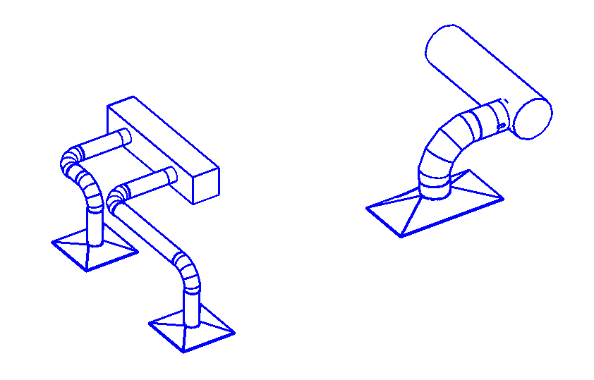

<head>
<title>The Building Coder</title>
<meta http-equiv="Content-Type" content="text/html; charset=utf-8"/>
<link rel="stylesheet" type="text/css" href="3dwc.css"/>

</head>

<!---

- 11716266 [Finding and using an object Face using a real world XYZ point]
  a meandering case addressing several RME issues
  how to place a tap on a duct face
  how to inherit system information
  how to modify fitting dimensions
  using routing preferences to select NewTakeOffFitting tap type

Using Routing Preferences to Select and Place a Tap #revitapi #3dwebcoder @AutodeskRevit @AutodeskForge #aec #bim

Today, I address a sequence of Revit MEP related steps required to insert a specific tap or take-off fitting into a duct
&ndash; How to determine duct face from location point?
&ndash; How to convert <code>XYZ</code> location to duct face <code>UV</code> coordinates?
&ndash; How to anchor an object like AutoCAD Architecture?
&ndash; How to inherit system information?
&ndash; How to inherit system information &ndash; take II
&ndash; How to control take-off and tap sizing on a duct?
&ndash; How to select a specific tap type to connect to a duct?
&ndash; Sample code using routing preferences to select <code>NewTakeOffFitting</code> tap type...

-->

### Using Routing Preferences to Select and Place a Tap

Today, I address a sequence of Revit MEP related steps required to insert a specific tap or take-off fitting into a duct:

- [How to determine duct face from location point?](#2)
- [How to convert `XYZ` location to duct face `UV` coordinates?](#3)
- [How to anchor an object like AutoCAD Architecture?](#4)
- [How to inherit system information?](#5)
- [How to inherit system information &ndash; take II](#6)
- [How to control take-off and tap sizing on a duct?](#7)
- [How to select a specific tap type to connect to a duct?](#8)
- [Sample code using routing preferences to select <code>NewTakeOffFitting</code> tap type](#9)

The final result of this exploration is sample code snippet that makes use of routing preferences to select the appropriate take-off fitting type, a very frequently asked question, and produces taps like this:

This issue was raised and all the research performed by Michael Hillis 
of [DrawTech, Inc](http://drawtech.com).

Many thanks to Michael for his perseverance and especially for sharing the final solution with us all!

#### How to Determine Duct Face from Location Point? 

I have a duct fitting family with a tap family (or take-off, if you prefer). Along with this, I also have a location point for the tap. The location point is the point at which the tap intersects with and rests upon the tap. It is my assumption that to correctly place this tap family to my duct fitting family, I need to place the tap on the applicable `Face` on my duct fitting family. I have a couple of questions about performing this.

Using my location point, what would be the simplest method to retrieve the face that point rests upon?

Would that be using the `EdgeArrayArray` method?

#### Answer

Regarding your first question, that is pretty easy to achieve.

I would suggest retrieving the element geometry, iterating over all its faces, projecting the XYZ point onto each one, and determining the distance between the original and the projected result.

Here are some early examples from The Building Coder where I played at those kind of games:

- [RayTraceBounce Pool Table](http://thebuildingcoder.typepad.com/blog/2009/12/raytracebounce-pool-table.html)
- [Rectangular Duct Corners](http://thebuildingcoder.typepad.com/blog/2010/01/rectangular-duct-corners.html)
- [Spot Elevation Creation on Top of Beam](http://thebuildingcoder.typepad.com/blog/2010/01/spot-elevation-creation-on-top-of-beam.html)
- [Dimension Walls by Iterating Faces](http://thebuildingcoder.typepad.com/blog/2011/02/dimension-walls-by-iterating-faces.html)

The second post demonstrates a method called `FaceContainsConnector` that might suit your needs.

The fourth implements `GetClosestFace`, which takes the face normal vector into account as well as the target point.

#### How to Convert `XYZ` Location to Duct Face `UV` Coordinates? 

Once I have that face, is there any means within the API to get the `UV` point of the face based on its `XYZ` location within the project?

#### Answer

Regarding the second question, retrieving the `UV` point on the face for a given `XYZ` point:

Yes, absolutely the API provides that.

Look at the `Face.Project` method, which projects the specified input `XYZ` point onto the face.

It returns an `IntersectionResult` that includes a `UVPoint` property with the 2D parameters of the point of intersection in the face coordinate system.

For one of many examples of using this method in context, please take a look at the method `PlaceFamilyInstanceOnFace` provided in The Building Coder discussion
on [determining the face tangent at a picked point by generic face tangent determination](http://thebuildingcoder.typepad.com/blog/2015/02/determining-the-face-tangent-at-a-picked-point.html#4).

Please note that this face analysis and the nitty-gritty details of `XYZ` and `UV` coordinates are not utilised at all in the final solution using the `PreferredJunctionMethod` described below. We will simply keep these sections in place for narrative purposes, since these are the steps we investigated to make it happen.

#### How to Anchor an Object Like AutoCAD Architecture? 

Thank you for the quick reply and the wealth of information! Your resources are great for getting the actual tap onto my object.

However, I do have another question to pose:

I hate to draw a comparison to AutoCAD, but it's the only way I know how to really convey what I'm looking for. In AutoCAD, you have something called Anchoring objects. This basically allows you to take one object and make it a slave to another object. Think of the relationship between a tap and the duct it is attached to. The tap will always be fixed to that duct, go wherever it goes, etc.

I'm looking for something like this in Revit and was hoping you could confirm if I am on the right track before I spend a lot of time down this avenue.

Does this also handle inheritance of duct system information?

#### Answer

The AutoCAD ObjectARX anchor functionality only ensures a geometrical relationship. It does not care about duct system information.

That can be achieved using the Revit
API [Dynamic Model Updater framework DMU](http://thebuildingcoder.typepad.com/blog/about-the-author.html#5.31).

Look specifically at
the [Associative Section View SDK sample](http://thebuildingcoder.typepad.com/blog/2011/08/associative-section-view-fix.html#2) for
an example of geometric anchoring of an object to another.

No, this does not have anything whatsoever to do with handling inheritance of duct system information, and neither does the AutoCAD Architecture Anchor system.

#### How to Inherit System Information? 

OK. I'm looking for a method to attach a tap to a duct fitting and have that tap inherit the fittings information, e.g., things like System Name, Classification, etc. Much like what happens when you connect ducts together using connectors.

#### Answer

Regarding the inheritance of fitting information, dimensions, like duct and pipe diameter, width, height, system name, classification, etc.:

That is managed by the Revit duct and pipe system itself.

All MEP elements are assigned to a system, belong to that system, and inherit that kind of information from the system they belong to.

You mention connecting ducts together using connectors; yes.

In Revit, the fittings are also equipped with connectors, just like the ducts, and the information conveyed between them is exactly the same, using the exact same mechanism; namely, they all belong to the same MEP system.

#### How to Inherit System Information &ndash; Take II 

Now, back to the second matter. I have two separate families, both custom objects, one is a piece of rectangular duct and the other is a tap object. When I attach the tap to the face of this duct object, it adheres in a geometric sense as it should, however; it does not get any System Information from the duct object. That's what I need now. Is there any possible way to achieve that?

The goal is that my tap receives the system information from the main duct body.

#### Answer

Yes, the transmission of the system information can be easily resolved.

Your tap has a connector, and so does the duct.

You need to connect the two connectors with each other.

Of course, being a tap, it will not hook up to the standard pre-defined duct connectors at the end points, but somewhere along the walls, in the middle somewhere.

There is a special mechanism for adding additional connectors for such cases.

You might have to create that situation manually and analyse the results.

Explore the differences generated by manually adding taps to a duct using RevitLookup, the BipChecker, element lister
and [other database exploration tools](http://thebuildingcoder.typepad.com/blog/2013/11/intimate-revit-database-exploration-with-the-python-shell.html).

Use that understanding to reproduce the same programmatically.

You may need to use the right overload of the `NewFamilyInstance` method to place the tap on the duct and generate a new connector for it.

Actually, maybe the `Document.NewTakeoffFitting` method is what you need to use:

- [Use of `NewTakeOffFitting` on a duct](http://thebuildingcoder.typepad.com/blog/2011/02/use-of-newtakeofffitting-on-a-duct.html)
- [Use of `NewTakeOffFitting` on a pipe](http://thebuildingcoder.typepad.com/blog/2011/04/use-of-newtakeofffitting-on-a-pipe.html)

Let's see, what more do I have to offer on taps?

- [Adjustable versus perpendicular spud](http://thebuildingcoder.typepad.com/blog/2013/02/adjustable-versus-perpendicular-spud.html)
- [Splitting a duct or pipe with taps](http://thebuildingcoder.typepad.com/blog/2014/02/daylighting-extension-and-splitting-with-taps.html#3)

#### How to Control Take-Off and Tap Sizing on a Duct?

So I've been looking at this and have decided my approach has been wrong on this particular matter from the start. As opposed to using a Duct Fitting Family for each individual Duct Joint Length, I'm now using an actual Duct object (the Revit base) and splitting it to represent the joint lengths. This feature is a god send.

Now I have my take-off/tap, and am attaching it to my duct object and that seems to work.

However, when I set a family to `Tap – Adjustable` or `Tap – Perpendicular`, I cannot change any of its sizing dimensions such as Width, Depth and Diameter.

How does one change these dimensions?

I need to be able to insert a Rect/Oval tap with any combination of Width and Depth values.

#### Answer

I'm glad to hear that you made progress and the initial issue is now resolved.

Regarding the sizing dimensions: I think the sizing dimensions are properties of the system or the duct run, not the individual duct itself.

You might therefore need to modify them one level higher up in the hierarchy.

How do you do it in the user interface?

How is that reflected in the element properties that you explore using RevitLookup?

That should immediately answer your question.

#### How to Select a Specific Tap Type to Connect to a Duct?

I think I have a solid grasp on the way TakeOffs and Duct objects work now at least from a User Interface perspective. My question:

Using the API, is there a way to insert a particular type of tap onto a piece of duct and connect it to a duct?

Looking at the `NewTakeOffFitting` method, it takes an `MEPCurve` and a connector, both of which I can supply, but the TakeOff I'm inserting has to be of a particular type, which usually isn't completely static. I'll need to be able to insert a Bevelled, Straight or Custom (one that I have created) take-off on a whim when I need to.

It seems my best avenue for being able to insert Taps more 'on-the-fly' based on whatever I'm importing via my add-in is utilizing the `RoutingPreferencesManager` within the `MEPCurve` that I am trying to attach my duct to.

I have a basic idea of what is going on here, but I've run into a little bit of an issue. It seems that the take-off fittings I'm looking to utilize aren't showing up when I list all of the available 'rules' within a given RuleGroup (in this case, Junctions). For example, using the Revit UI (not the API) if I load a take-off family into my project using the "Load Family.." routine in Revit, it will show that take-off fitting if I go and manually modify the Routing Preferences within the UI.

However, if I do the same thing in the API, I can't get the tap that I'm loading to show up. Even if I manually load the tap in my project before running the add-in. I can't actually see the Tap as an available rule.

Here is a code sample snippet of what I am doing:

<pre class="code">
&nbsp;&nbsp;//&nbsp;I&nbsp;start&nbsp;with&nbsp;my&nbsp;Duct&nbsp;(with&nbsp;MEPCurve).
 
&nbsp;&nbsp;Element&nbsp;ductElement&nbsp;=&nbsp;MyDuctElement;&nbsp;
 
&nbsp;&nbsp;Duct&nbsp;duct&nbsp;=&nbsp;null;
&nbsp;&nbsp;if(&nbsp;ductElement&nbsp;!=&nbsp;null&nbsp;)
&nbsp;&nbsp;{&nbsp;duct&nbsp;=&nbsp;MyDuctElement;&nbsp;}
 
&nbsp;&nbsp;FamilySymbol&nbsp;tapSym&nbsp;=&nbsp;null;
 
&nbsp;&nbsp;//&nbsp;Load&nbsp;my&nbsp;Take-Off&nbsp;family.
 
&nbsp;&nbsp;using(&nbsp;SubTransaction&nbsp;subTrans&nbsp;=&nbsp;new&nbsp;SubTransaction(&nbsp;doc&nbsp;)&nbsp;)
&nbsp;&nbsp;{
&nbsp;&nbsp;&nbsp;&nbsp;subTrans.Start();
 
&nbsp;&nbsp;&nbsp;&nbsp;//&nbsp;Load&nbsp;the&nbsp;tap&nbsp;FamilySymbol&nbsp;into&nbsp;the&nbsp;project.
 
&nbsp;&nbsp;&nbsp;&nbsp;GetFamilySymbolRoutine(&nbsp;doc,&nbsp;symInfo,&nbsp;out&nbsp;famSym&nbsp;);
 
&nbsp;&nbsp;&nbsp;&nbsp;subTrans.Commit();
&nbsp;&nbsp;}
 
&nbsp;&nbsp;DuctType&nbsp;ductType&nbsp;=&nbsp;duct.DuctType;
 
&nbsp;&nbsp;type.RoutingPreferenceManager.PreferredJunctionType&nbsp;
&nbsp;&nbsp;&nbsp;&nbsp;=&nbsp;PreferredJunctionType.Tap;
 
&nbsp;&nbsp;int&nbsp;ruleCount&nbsp;=&nbsp;ductType
&nbsp;&nbsp;&nbsp;&nbsp;.RoutingPreferenceManager
&nbsp;&nbsp;&nbsp;&nbsp;.GetNumberOfRules(&nbsp;
&nbsp;&nbsp;&nbsp;&nbsp;&nbsp;&nbsp;RoutingPreferenceRuleGroupType.Junctions&nbsp;);
 
&nbsp;&nbsp;//&nbsp;Iterate&nbsp;through&nbsp;all&nbsp;rules&nbsp;within&nbsp;Junctions&nbsp;
&nbsp;&nbsp;//&nbsp;and&nbsp;get&nbsp;part&nbsp;info&nbsp;for&nbsp;all&nbsp;rules.
 
&nbsp;&nbsp;List&lt;string&gt;&nbsp;names&nbsp;=&nbsp;new&nbsp;List&lt;string&gt;();
&nbsp;&nbsp;RoutingPreferenceRule&nbsp;routeRule&nbsp;=&nbsp;null;
 
&nbsp;&nbsp;for(&nbsp;int&nbsp;i&nbsp;=&nbsp;0;&nbsp;i&nbsp;&lt;&nbsp;ruleCount;&nbsp;i++&nbsp;)
&nbsp;&nbsp;{
&nbsp;&nbsp;&nbsp;&nbsp;routeRule&nbsp;=&nbsp;ductType
&nbsp;&nbsp;&nbsp;&nbsp;&nbsp;&nbsp;.RoutingPreferenceManager.GetRule(&nbsp;
&nbsp;&nbsp;&nbsp;&nbsp;&nbsp;&nbsp;&nbsp;&nbsp;RoutingPreferenceRuleGroup,&nbsp;i&nbsp;);
 
&nbsp;&nbsp;&nbsp;&nbsp;Element&nbsp;mepId&nbsp;=&nbsp;doc.GetElement(&nbsp;
&nbsp;&nbsp;&nbsp;&nbsp;&nbsp;&nbsp;routeRule.MEPPartId&nbsp;);
 
&nbsp;&nbsp;&nbsp;&nbsp;if(&nbsp;mepId&nbsp;!=&nbsp;null&nbsp;)
&nbsp;&nbsp;&nbsp;&nbsp;{
&nbsp;&nbsp;&nbsp;&nbsp;&nbsp;&nbsp;FamilySymbol&nbsp;mepFi&nbsp;=&nbsp;mepId&nbsp;as&nbsp;FamilySymbol;
&nbsp;&nbsp;&nbsp;&nbsp;&nbsp;&nbsp;names.Add(&nbsp;mepFi.Name&nbsp;);
&nbsp;&nbsp;&nbsp;&nbsp;}
&nbsp;&nbsp;}
</pre>

Do you have any resources or tips that might assist me in fully utilizing the RoutingPreferenceManager?

#### Answer

Yes, routing preferences is definitely the way to go.

The tap needs to be explicitly added to the routing preferences.

Loading the family alone does not add the rule.

This is similar to the UI approach: after loading the family, the part needs to be added to the rule in another operation.

The API could look like this:
 
<pre class="code">
&nbsp;&nbsp;RoutingPreferenceRule&nbsp;newRule(&nbsp;tapFamilySymbolId,
&nbsp;&nbsp;&nbsp;&nbsp;&quot;Something&nbsp;about&nbsp;this&nbsp;rule&quot;&nbsp;);
 
&nbsp;&nbsp;myRoutingPreferenceManager.AddRule(
&nbsp;&nbsp;&nbsp;&nbsp;RoutingPreferenceRuleGroupType.Junctions,&nbsp;newRule&nbsp;);
</pre>

You can find more routing preference API usage examples in the RoutingPreferenceTools Revit SDK sample.

#### Sample Code Using Routing Preferences to Select `NewTakeOffFitting` Tap Type

I made progress on the issue and arrive at a solution similar to the set-up the development team recommends.

Here is another code snippet showing the general gist of what I'm currently utilizing:

<pre class="code">
&nbsp;&nbsp;//&nbsp;Get&nbsp;DuctType&nbsp;-&nbsp;we&nbsp;need&nbsp;this&nbsp;for&nbsp;its
&nbsp;&nbsp;//&nbsp;RoutingPreferenceManager.&nbsp;This&nbsp;is&nbsp;how&nbsp;we&nbsp;assign
&nbsp;&nbsp;//&nbsp;our&nbsp;tap&nbsp;object&nbsp;to&nbsp;be&nbsp;used.&nbsp;This&nbsp;is&nbsp;the&nbsp;settings
&nbsp;&nbsp;//&nbsp;for&nbsp;the&nbsp;duct&nbsp;object&nbsp;we&nbsp;attach&nbsp;our&nbsp;tap&nbsp;to.
 
&nbsp;&nbsp;Duct&nbsp;duct&nbsp;=&nbsp;doc.GetElement(&nbsp;mainDuctId&nbsp;);
 
&nbsp;&nbsp;DuctType&nbsp;ductType&nbsp;=&nbsp;duct.DuctType;
 
&nbsp;&nbsp;RoutingPreferenceManager&nbsp;routePrefManager
&nbsp;&nbsp;&nbsp;&nbsp;=&nbsp;ductType.RoutingPreferenceManager;
 
&nbsp;&nbsp;//&nbsp;Set&nbsp;Junction&nbsp;Prefernce&nbsp;to&nbsp;Tap.
 
&nbsp;&nbsp;routePrefManager.PreferredJunctionType
&nbsp;&nbsp;&nbsp;&nbsp;=&nbsp;PreferredJunctionType.Tap;
 
&nbsp;&nbsp;//&nbsp;For&nbsp;simplicity&nbsp;sake,&nbsp;I&nbsp;remove&nbsp;all&nbsp;previous&nbsp;rules
&nbsp;&nbsp;//&nbsp;for&nbsp;taps&nbsp;so&nbsp;I&nbsp;can&nbsp;just&nbsp;add&nbsp;what&nbsp;I&nbsp;want&nbsp;here.
&nbsp;&nbsp;//&nbsp;This&nbsp;will&nbsp;probably&nbsp;vary.
 
&nbsp;&nbsp;int&nbsp;initRuleCount&nbsp;=&nbsp;routePrefManager.GetNumberOfRules(
&nbsp;&nbsp;&nbsp;&nbsp;RoutingPreferenceRuleGroupType.Junctions&nbsp;);
 
&nbsp;&nbsp;for(&nbsp;int&nbsp;i&nbsp;=&nbsp;0;&nbsp;i&nbsp;!=&nbsp;initRuleCount;&nbsp;++i&nbsp;)
&nbsp;&nbsp;{
&nbsp;&nbsp;&nbsp;&nbsp;routePrefManager.RemoveRule(
&nbsp;&nbsp;&nbsp;&nbsp;&nbsp;&nbsp;RoutingPreferenceRuleGroupType.Junctions,&nbsp;0&nbsp;);
&nbsp;&nbsp;}
 
&nbsp;&nbsp;//&nbsp;Get&nbsp;FamilySymbol&nbsp;for&nbsp;Tap&nbsp;I&nbsp;want&nbsp;to&nbsp;use.
 
&nbsp;&nbsp;FamilySymbol&nbsp;tapSym&nbsp;=&nbsp;null;
&nbsp;&nbsp;doc.LoadFamilySymbol(&nbsp;&quot;C:\FamilyLocation\MyTap.rfa&quot;,
&nbsp;&nbsp;&nbsp;&nbsp;&quot;MyTap&quot;,&nbsp;out&nbsp;tapSym&nbsp;);
 
&nbsp;&nbsp;//&nbsp;Symbol&nbsp;needs&nbsp;to&nbsp;be&nbsp;activated&nbsp;before&nbsp;use.
 
&nbsp;&nbsp;if(&nbsp;(&nbsp;!tapSym.IsActive&nbsp;)&nbsp;&amp;&amp;&nbsp;(&nbsp;tapSym&nbsp;!=&nbsp;null&nbsp;)&nbsp;)
&nbsp;&nbsp;{
&nbsp;&nbsp;&nbsp;&nbsp;tapSym.Activate();
&nbsp;&nbsp;&nbsp;&nbsp;doc.Regenerate();
&nbsp;&nbsp;}
 
&nbsp;&nbsp;//&nbsp;Create&nbsp;Rule&nbsp;that&nbsp;utilizes&nbsp;the&nbsp;Tap.&nbsp;Use&nbsp;the&nbsp;argument
&nbsp;&nbsp;//&nbsp;MEPPartId&nbsp;=&nbsp;ElementId&nbsp;for&nbsp;the&nbsp;desired&nbsp;FamilySymbol.
 
&nbsp;&nbsp;RoutingPreferenceRule&nbsp;newRule
&nbsp;&nbsp;&nbsp;&nbsp;=&nbsp;new&nbsp;RoutingPreferenceRule(&nbsp;tapSym.Id,&nbsp;&quot;MyTap&quot;&nbsp;);
 
&nbsp;&nbsp;routePrefManager.AddRule(
&nbsp;&nbsp;&nbsp;&nbsp;RoutingPreferenceRuleGroupType.Junctions,&nbsp;newRule&nbsp;);
 
&nbsp;&nbsp;//&nbsp;To&nbsp;create&nbsp;a&nbsp;solid&nbsp;tap,&nbsp;we&nbsp;need&nbsp;to&nbsp;use&nbsp;the&nbsp;Revit
&nbsp;&nbsp;//&nbsp;doc.Create.NewTakeoffFitting&nbsp;routine.&nbsp;For&nbsp;this,
&nbsp;&nbsp;//&nbsp;we&nbsp;need&nbsp;a&nbsp;connector.&nbsp;If&nbsp;we&nbsp;don&#39;t&nbsp;have&nbsp;one,&nbsp;we
&nbsp;&nbsp;//&nbsp;just&nbsp;create&nbsp;a&nbsp;temporary&nbsp;object&nbsp;with&nbsp;a&nbsp;connector
&nbsp;&nbsp;//&nbsp;where&nbsp;we&nbsp;want&nbsp;it.
 
&nbsp;&nbsp;Connector&nbsp;tmpConn&nbsp;=&nbsp;CreateTemporaryConnectorForTap();
 
&nbsp;&nbsp;//&nbsp;Create&nbsp;our&nbsp;tap.
 
&nbsp;&nbsp;FamilyInstance&nbsp;tapInst
&nbsp;&nbsp;&nbsp;&nbsp;=&nbsp;doc.Create.NewTakeoffFitting(&nbsp;tmpConn,&nbsp;duct&nbsp;);
</pre>

I put this together really quickly for you, but I think it covers all the bases.

I've found that this solution works extremely well for creating a tap that utilizes the standard features Revit has for taps, producing results like the two samples shown above.

Thank you for all your support!
