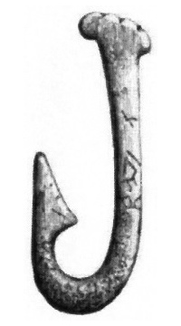

<head>
<title>The Building Coder</title>
<meta http-equiv="Content-Type" content="text/html; charset=utf-8"/>
<link rel="stylesheet" type="text/css" href="3dwc.css"/>

</head>

<!---

- why require signed add-in signature?
  http://forums.autodesk.com/t5/revit-api/code-signing-of-revit-addins/m-p/6535549

- how to search for help on a Revit API question?
  http://forums.autodesk.com/t5/revit-api/revit-2017-loadcasearray/m-p/6535653
  
- Autodesk Releases Dynamo 1.1 Update for Computational Design
  http://architosh.com/2016/08/autodesk-releases-dynamo-1-1-update-for-computational-design/

Trusted Signature Motivation and Fishing #revitapi #3dwebcoder @AutodeskRevit @AutodeskForge #aec #bim

Topics for today
&ndash; How does code signing of Revit add-ins increase security?
&ndash; What happened to <code>LoadCaseArray</code>?
&ndash; How and where to search for help on a Revit API question?
&ndash; Dynamo 1.1 Update...

-->

### Trusted Signature Motivation and Fishing

Topics for today:

- [How does code signing of Revit add-ins increase security?](#2)
- [What happened to `LoadCaseArray`, how and where to search for help on a Revit API question?](#3)
- [Dynamo 1.1 Update](#4)

#### How Does Code Signing of Revit Add-Ins Increase Security?

I talked about
the [trusted add-in signature](http://thebuildingcoder.typepad.com/blog/2016/08/trusted-signature-and-updated-revit-2017-api-resources.html#2) requirement 
introduced with the Revit 2017 API last week.

Neil Smithline, Revit Software Security Architect, added an in-depth explanation on why this requirement was introduced at all, answering a new question from Ken on
the [Revit API discussion forum](http://forums.autodesk.com/t5/revit-api/bd-p/160) thread
on [code signing of Revit addins](http://forums.autodesk.com/t5/revit-api/code-signing-of-revit-addins/m-p/5981560):

**Question:** Can you help me understand how code signing of Revit add-ins improves security? 
 
I create an add-in, I sign it with my cert, then I install my cert during install of the add-in.

I'm in control the whole way (other than the user had to run the installer with elevated permissions...)
 
I'm not sure I understand how this increases actual security, as opposed to affecting some perception of increased security. 
 
But I <b><i>am</i></b> willing to learn.

**Answer:** Revit add-in code signing is intended to reduce the risk of you running malicious code within a Revit add-in. Before discussing it in specific, let's take a step back and look at the current state of technology.
 
In general, preventing malicious code, commonly called [malware](https://en.wikipedia.org/wiki/Malware), from running on your computer is difficult. The quantity and ingenuity of malware attacks [continues to climb](https://securelist.com/analysis/quarterly-malware-reports/75640/it-threat-evolution-in-q2-2016-statistics). Malware is being used to target everything
from [hospitals](http://money.cnn.com/2016/02/17/technology/hospital-bitcoin-ransom/index.html)
to [lightbulbs](http://www.welivesecurity.com/2013/08/14/blackout-warning-philips-smart-lightbulbs-can-be-switched-off-by-malware-and-wont-come-back-on).
It has been used to [damage Iranian nuclear facilities](https://en.wikipedia.org/wiki/Stuxnet), and recently has been thought to be used as a tool to [influence the US presidential elections](http://news.softpedia.com/news/malware-used-in-dnc-hack-has-roots-in-chinese-open-source-tool-506773.shtml). The best security Revit, or any application, can provide is to not make the situation worse. So we need to look at what techniques Windows provides for keeping your computer secure.
 
Some of the most important mechanisms that Windows uses to combat malware are:

- [User Account Control](https://en.wikipedia.org/wiki/User_Account_Control) &ndash; This generates the "Do you want to allow the following program to make changes to this computer?" popup you frequently get when installing applications.
- [Mark of the Web](https://blogs.msdn.microsoft.com/ieinternals/2011/03/23/understanding-local-machine-zone-lockdown) &ndash; This generates a dialog when you try to run applications downloaded by your browser.
- [Authenticode](https://msdn.microsoft.com/en-us/library/cc750035.aspx) &ndash; Microsoft's trademarked term for code signing of executables.
 
Due to the way that Revit add-ins are downloaded and installed, they bypass User Account Control, Mark of the Web, and Authenticode. That is, Revit add-ins open a hole in Windows' malware security. So Revit must add security to fix this security flaw. Creating and fixing such a weakness is common for apps with add-ins. For example, [Chrome requires extensions to be signed](https://developer.chrome.com/extensions/packaging), and a company that tries to epitomize openness, [Firefox, just added mandatory add-on signing](https://www.mozilla.org/en-US/firefox/48.0/releasenotes) on August 2nd, 2016.
 
To fix this security hole, we've added code signing. Code signing in Revit, like Microsoft's Authenticode, is intended to give the user a timely security question and to provide you with the information you need to make an informed decision. This is very similar to what Windows' User Account Control and Authenticode systems provide.
 
As a user, when you are given an add-in signature dialog, you know that the add-in you are loading was written by the owner of the certificate, and that it hasn't been modified since it was signed. It is then up to you to determine if you trust that person or not.
 
While I would love to have a solution that automatically detected add-in safety and just did the right thing, this is the best that we, as an industry, know how to do. Is it perfect: no. But is it more secure than without signing: I think so.

Thank you very much, Meil, for this very clear overview and motivating clarification!

#### What happened to `LoadCaseArray`, How and Where to Search for Help on a Revit API Question?

While answering another Revit API discussion forum question by Emil
on [the `LoadCaseArray` class in Revit 2017](http://forums.autodesk.com/t5/revit-api/revit-2017-loadcasearray/td-p/6535653),
I also happened to produce an more general answer on how to search for help on any Revit API issue:

**Question:** We are in a process of migrating a project in VB.NET to use with Revit 2017. Previously, it worked with Revit 2016.

I get several errors of the type *Type `Autodesk.Revit.DB.Structure.LoadCaseArray` is not defined*, similarly for `LoadCombinationArray`, `LoadUsageArray`, and I can't locate any documentation on these arrays in the Revit 2017 API.

As far as I can see, they were not marked as obsolete; they were working OK within our 2016 project. 

**Answer:** Well, you did not look carefully enough &nbsp; :-)
 
I performed a simple Internet search for "Revit API LoadCaseArray". 
 
One of the first hits is The Building Coder article
on [What's New in the Revit 2017 API](http://thebuildingcoder.typepad.com/blog/2016/04/whats-new-in-the-revit-2017-api.html).
 
Searching that for `LoadCaseArray`, you first see it listed in the section
on [Obsolete API removal](http://thebuildingcoder.typepad.com/blog/2016/04/whats-new-in-the-revit-2017-api.html#2.22).
 
It does not refer to the `LoadCaseArray` class, though, but the `NewLoadCombination` method that was previously using it.
 
Another hit is the
old [online Revit 2014 API documentation entry for `LoadCaseArray`](http://revitapisearch.com/html/b956962a-5802-cca1-e806-cc0461fac741.htm).
 
That tells me that this is a collection class.
 
In the far distant past, the Revit API defined heaps of custom collection classes.
 
They have (almost) all been replaced by generic collections, i.e., something like <code>List&lt;LoadCase&gt;</code>.
 
You need to look for the updated signature of whatever method call you need to make.
 
What method is it?
 
`NewLoadCombination`?
 
What argument does it take?
 
I performed a new Internet search for "Revit API NewLoadCombination", which turns up The Building Coder article
on [What's New in the Revit 2016 API](http://thebuildingcoder.typepad.com/blog/2015/04/whats-new-in-the-revit-2016-api.html).
 
It includes this section:
 
#### Load cases and load combinations
 
The Revit API classes related to Load Cases and Load Combinations have been significantly renovated. This has introduced new members to the LoadCombnation, LoadCase, LoadNature and LoadUsage classes, and resulted in several previously existing member being marked deprecated and replaced, as shown in this table:
 
- Deprecated member &rarr; New/replacement member
- Document.NewLoadCombination() &rarr; LoadCombination.Create()
- etc.
 
I hope this answers your question.
 
Well, maybe not quite.
 
The whole area of load combinations seems to have been cleaned up quite significantly in the past few releases.
 
One of the first places to look for working sample code and see how different classes, method calls and properties are used together to achieve certain tasks is the Revit SDK sample collection.
 
Always perform the following searches before asking anyone else for help:
 
1. Revit API help file RevitAPI.chm, provided with the Revit SDK, available online at [revitapidocs.com](http://www.revitapidocs.com) for classes, properties and methods.
2. [Developer Guide](http://help.autodesk.com/view/RVT/2017/ENU/?guid=GUID-F0A122E0-E556-4D0D-9D0F-7E72A9315A42), provided with the online [Revit Help](http://help.autodesk.com/view/RVT/2017/ENU/), for background understanding.
3. Revit SDK samples, provided in the [Revit developer centre](http://www.autodesk.com/developrevit), to see how to solve specific tasks.
 
In this case, I see lots of results searching the Revit SDK samples for `LoadCombination`.
 
I much more hope that you are not only fed, but also in the process of being [transformed into a competent fisherman](http://thebuildingcoder.typepad.com/blog/2009/02/creating-a-group-and-how-to-fish.html) &nbsp; :-)
 
Good luck with your further searches.

Stone Age fish hook made from bone, from Nordisk Familjebok (1917) <a href="//commons.wikimedia.org/wiki/File:Metkrok_av_ben_fr%C3%A5n_sten%C3%A5ldern,_funnen_i_Sk%C3%A5ne.jpg" title="Metkrok av ben från stenåldern, funnen i Skåne.jpg">Metkrok av ben från stenåldern, funnen i Skåne</a>, public domain

#### <a name="5">Dynamo 1.1 Update</a>

Finally, to close for today, let me just point out that Autodesk released the [Dynamo 1.1 Update for Computational Design](http://architosh.com/2016/08/autodesk-releases-dynamo-1-1-update-for-computational-design).

Have fun!
