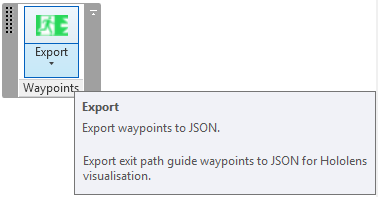
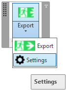
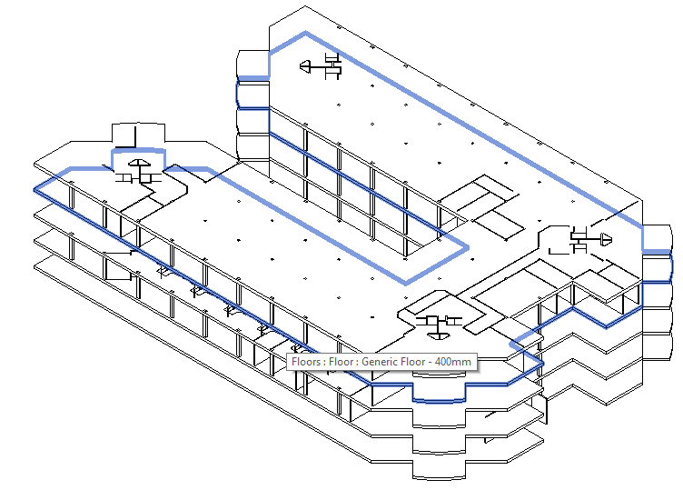
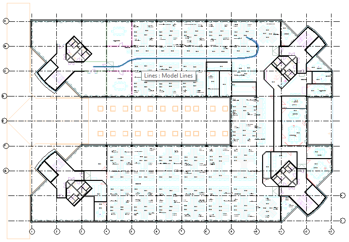
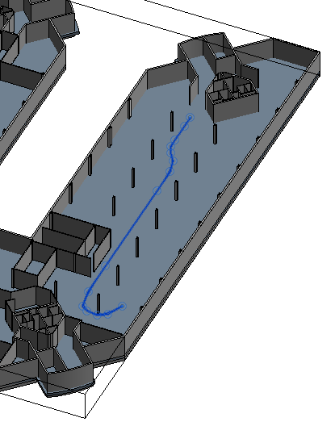
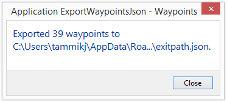
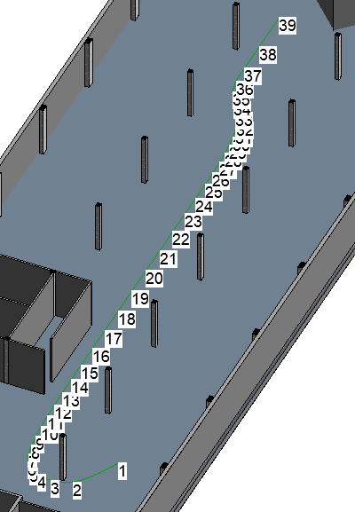

<head>
<title>The Building Coder</title>
<meta http-equiv="Content-Type" content="text/html; charset=utf-8"/>
<link rel="stylesheet" type="text/css" href="3dwc.css"/>

</head>

<!---

https://github.com/jeremytammik/ExportWaypointsJson

https://t.co/8F1cZuEpTI

https://t.co/uhLYBlue2x

HoloLens Escape Path Waypoint JSON Exporter #revitapi #3dwebcoder @AutodeskRevit @AutodeskForge #aec #bim

Last week, I worked with Kean Walmsley on his entry for the first global Autodesk Hackathon: a HoloLens-based tool for navigating low visibility environments, resulting in the new HoloGuide Autodesk Hackathon project. My modest contribution is the ExportWaypointsJson Revit add-in, an external application implementing the main command, exporting the waypoints, and a subsidiary option settings command, displaying a form, validating input and storing the user preferences. The main command simply prompts the user to pick a model line in the Revit project,  traverses it, determines waypoints at predefined intervals and exports them to JSON for consumption by the HoloGuide visualisation...

-->

### HoloLens Escape Path Waypoint JSON Exporter

Last week, I worked with Kean Walmsley on
his [entry for the first global Autodesk Hackathon: a HoloLens-based tool for navigating low visibility environments](http://through-the-interface.typepad.com/through_the_interface/2016/08/my-entry-for-autodesks-first-global-hackathon-a-hololens-based-tool-for-navigating-low-visibility-environments.html), resulting in the
new [HoloGuide Autodesk Hackathon project](http://through-the-interface.typepad.com/through_the_interface/2016/09/hologuide-an-autodesk-hackathon-project.html).

Watch this [three-minute video](https://www.youtube.com/watch?v=8MjBgiQZUzw) for a quick first impression of what it is all about:

<iframe width="440" height="248" src="https://www.youtube.com/embed/8MjBgiQZUzw?rel=0" frameborder="0" allowfullscreen></iframe>

This project is part of Kean's [HoloLens project series](http://through-the-interface.typepad.com/through_the_interface/hololens), including and not limited to:

- [Using HoloLens to display diagnostic information for building components](http://through-the-interface.typepad.com/through_the_interface/2016/08/using-hololens-to-display-diagnostic-information-for-building-components.html)
- [Scaling our Unity model in HoloLens](http://through-the-interface.typepad.com/through_the_interface/2016/08/scaling-our-unity-model-in-hololens.html)
- [Adding spatial sound to our Unity model in HoloLens](http://through-the-interface.typepad.com/through_the_interface/2016/08/adding-spatial-sound-to-our-unity-model-in-hololens-part-3.html)
- [Displaying your Unity model in 3D using HoloLens](http://through-the-interface.typepad.com/through_the_interface/2016/07/displaying-your-unity-model-in-3d-using-hololens.html)

My modest contribution is the [ExportWaypointsJson Revit add-in](https://github.com/jeremytammik/ExportWaypointsJson), an external application implementing the main command, exporting the waypoints, and a subsidiary option settings command, displaying a form, validating input and storing the user preferences.

The main command and the main functionality of the add-in simply prompts the user to pick a model line in the Revit project,  traverses it, determines waypoints at predefined intervals and exports them to JSON for consumption by the HoloGuide visualisation.

In the process of implementing it, I was able to explore an issue I never looked at before, validating user input to a Windows form using the `ErrorProvider` class, `Validating` and `Validated` events.

I also implemented two different approaches to store the user-defined add-in option settings, in XML and JSON.

Today, I'll just present the external application class creating the ribbon panel with split button providing access to two commands. It reads the ribbon button icons from embedded resources and provides a method to ensure that the main command always remains the default current button.

I used the [stacked ribbon button panel  SplitButtonOptionConcept](http://thebuildingcoder.typepad.com/blog/2016/09/stacked-ribbon-button-panel-options.html) approach to retain the main command button as the current default split button option. Thus the main command is always displayed at the top and immediately accessible with a single click, while access to the other subsidiary commands requires opening the split button drop-down options first.

I'll just present the main external application implementation of this add-in today.

If you would like to explore the areas that I have not covered today right away on your own, feel free to clone, compile and debug the project from
the [ExportWaypointsJson GitHub repository](https://github.com/jeremytammik/ExportWaypointsJson).

The version discussed here
is [release 2017.0.0.11](https://github.com/jeremytammik/ExportWaypointsJson/releases/tag/2017.0.0.11).

#### External Application Implementation

The add-in displays the following ribbon panel:

You can either click the main button, which is always displayed at the top as the current option, to trigger the main command, or drop down the rest of the stacked button contents to display the option button:

I ran the application in a model of the Autodesk office building in Neuch&acirc;tel:

The escape path we use for demonstration leads from Kean's desk to the nearest exit door:

It is represented by a model curve:

The external command prompts you to select the exit path waypoints model curve, unless you pre-selected one before launching it, traverses it, determines waypoints and exports the results to JSON.

To report success, it displays the number of points exported:

Each waypoint can optionally also be represented by a marker in the view you generated it from:

The marker generation option can also be switched off.

If you do so, the command can run in read-only mode.

Right now, the transaction mode is set to manual, and a transaction is only started if the waypoint markers are requested.

Here is the entire external application implementation, which:

- Creates the ribbon tab and buttons.
- Populates the button icons from embedded resources.
- Ensures that the main command button always remains the current and default split button option.

<pre class="code">
&nbsp;&nbsp;class&nbsp;App&nbsp;:&nbsp;IExternalApplication
&nbsp;&nbsp;{
&nbsp;&nbsp;&nbsp;&nbsp;public&nbsp;const&nbsp;string&nbsp;Caption&nbsp;=&nbsp;&quot;Waypoints&quot;;
 
&nbsp;&nbsp;&nbsp;&nbsp;SplitButton&nbsp;split_button;
 
&nbsp;&nbsp;&nbsp;&nbsp;///&nbsp;&lt;summary&gt;
&nbsp;&nbsp;&nbsp;&nbsp;///&nbsp;This&nbsp;external&nbsp;application&nbsp;
&nbsp;&nbsp;&nbsp;&nbsp;///&nbsp;singleton&nbsp;class&nbsp;instance.
&nbsp;&nbsp;&nbsp;&nbsp;///&nbsp;&lt;/summary&gt;
&nbsp;&nbsp;&nbsp;&nbsp;internal&nbsp;static&nbsp;App&nbsp;_app&nbsp;=&nbsp;null;
 
&nbsp;&nbsp;&nbsp;&nbsp;///&nbsp;&lt;summary&gt;
&nbsp;&nbsp;&nbsp;&nbsp;///&nbsp;Provide&nbsp;access&nbsp;to&nbsp;this&nbsp;class&nbsp;instance.
&nbsp;&nbsp;&nbsp;&nbsp;///&nbsp;&lt;/summary&gt;
&nbsp;&nbsp;&nbsp;&nbsp;public&nbsp;static&nbsp;App&nbsp;Instance
&nbsp;&nbsp;&nbsp;&nbsp;{
&nbsp;&nbsp;&nbsp;&nbsp;&nbsp;&nbsp;get&nbsp;{&nbsp;return&nbsp;_app;&nbsp;}
&nbsp;&nbsp;&nbsp;&nbsp;}
 
&nbsp;&nbsp;&nbsp;&nbsp;///&nbsp;&lt;summary&gt;
&nbsp;&nbsp;&nbsp;&nbsp;///&nbsp;Return&nbsp;the&nbsp;full&nbsp;add-in&nbsp;assembly&nbsp;folder&nbsp;path.
&nbsp;&nbsp;&nbsp;&nbsp;///&nbsp;&lt;/summary&gt;
&nbsp;&nbsp;&nbsp;&nbsp;public&nbsp;static&nbsp;string&nbsp;Path
&nbsp;&nbsp;&nbsp;&nbsp;{
&nbsp;&nbsp;&nbsp;&nbsp;&nbsp;&nbsp;get
&nbsp;&nbsp;&nbsp;&nbsp;&nbsp;&nbsp;{
&nbsp;&nbsp;&nbsp;&nbsp;&nbsp;&nbsp;&nbsp;&nbsp;return&nbsp;System.IO.Path.GetDirectoryName(&nbsp;
&nbsp;&nbsp;&nbsp;&nbsp;&nbsp;&nbsp;&nbsp;&nbsp;&nbsp;&nbsp;Assembly.GetExecutingAssembly().Location&nbsp;);
&nbsp;&nbsp;&nbsp;&nbsp;&nbsp;&nbsp;}
&nbsp;&nbsp;&nbsp;&nbsp;}
 
&nbsp;&nbsp;&nbsp;&nbsp;#region&nbsp;Create&nbsp;Ribbon&nbsp;Tab
&nbsp;&nbsp;&nbsp;&nbsp;///&nbsp;&lt;summary&gt;
&nbsp;&nbsp;&nbsp;&nbsp;///&nbsp;Load&nbsp;a&nbsp;new&nbsp;icon&nbsp;bitmap&nbsp;from&nbsp;embedded&nbsp;resources.
&nbsp;&nbsp;&nbsp;&nbsp;///&nbsp;For&nbsp;the&nbsp;BitmapImage,&nbsp;make&nbsp;sure&nbsp;you&nbsp;reference&nbsp;
&nbsp;&nbsp;&nbsp;&nbsp;///&nbsp;WindowsBase&nbsp;and&nbsp;PresentationCore,&nbsp;and&nbsp;import&nbsp;
&nbsp;&nbsp;&nbsp;&nbsp;///&nbsp;the&nbsp;System.Windows.Media.Imaging&nbsp;namespace.&nbsp;
&nbsp;&nbsp;&nbsp;&nbsp;///&nbsp;&lt;/summary&gt;
&nbsp;&nbsp;&nbsp;&nbsp;BitmapImage&nbsp;NewBitmapImage(
&nbsp;&nbsp;&nbsp;&nbsp;&nbsp;&nbsp;System.Reflection.Assembly&nbsp;a,
&nbsp;&nbsp;&nbsp;&nbsp;&nbsp;&nbsp;string&nbsp;imageName&nbsp;)
&nbsp;&nbsp;&nbsp;&nbsp;{
&nbsp;&nbsp;&nbsp;&nbsp;&nbsp;&nbsp;Stream&nbsp;s&nbsp;=&nbsp;a.GetManifestResourceStream(&nbsp;imageName&nbsp;);
&nbsp;&nbsp;&nbsp;&nbsp;&nbsp;&nbsp;BitmapImage&nbsp;img&nbsp;=&nbsp;new&nbsp;BitmapImage();
&nbsp;&nbsp;&nbsp;&nbsp;&nbsp;&nbsp;img.BeginInit();
&nbsp;&nbsp;&nbsp;&nbsp;&nbsp;&nbsp;img.StreamSource&nbsp;=&nbsp;s;
&nbsp;&nbsp;&nbsp;&nbsp;&nbsp;&nbsp;img.EndInit();
&nbsp;&nbsp;&nbsp;&nbsp;&nbsp;&nbsp;return&nbsp;img;
&nbsp;&nbsp;&nbsp;&nbsp;}
 
&nbsp;&nbsp;&nbsp;&nbsp;void&nbsp;CreateRibbonTab(
&nbsp;&nbsp;&nbsp;&nbsp;&nbsp;&nbsp;UIControlledApplication&nbsp;a&nbsp;)
&nbsp;&nbsp;&nbsp;&nbsp;{
&nbsp;&nbsp;&nbsp;&nbsp;&nbsp;&nbsp;Assembly&nbsp;assembly&nbsp;=&nbsp;Assembly.GetExecutingAssembly();
 
&nbsp;&nbsp;&nbsp;&nbsp;&nbsp;&nbsp;string&nbsp;ass_path&nbsp;=&nbsp;assembly.Location;
&nbsp;&nbsp;&nbsp;&nbsp;&nbsp;&nbsp;string&nbsp;ass_name&nbsp;=&nbsp;assembly.GetName().Name;
 
&nbsp;&nbsp;&nbsp;&nbsp;&nbsp;&nbsp;//&nbsp;Create&nbsp;ribbon&nbsp;tab&nbsp;
 
&nbsp;&nbsp;&nbsp;&nbsp;&nbsp;&nbsp;string&nbsp;tab_name&nbsp;=&nbsp;Caption;
 
&nbsp;&nbsp;&nbsp;&nbsp;&nbsp;&nbsp;try
&nbsp;&nbsp;&nbsp;&nbsp;&nbsp;&nbsp;{
&nbsp;&nbsp;&nbsp;&nbsp;&nbsp;&nbsp;&nbsp;&nbsp;a.CreateRibbonTab(&nbsp;tab_name&nbsp;);
&nbsp;&nbsp;&nbsp;&nbsp;&nbsp;&nbsp;}
&nbsp;&nbsp;&nbsp;&nbsp;&nbsp;&nbsp;catch(&nbsp;Autodesk.Revit.Exceptions.ArgumentException&nbsp;)
&nbsp;&nbsp;&nbsp;&nbsp;&nbsp;&nbsp;{
&nbsp;&nbsp;&nbsp;&nbsp;&nbsp;&nbsp;&nbsp;&nbsp;//&nbsp;Assume&nbsp;error&nbsp;is&nbsp;due&nbsp;to&nbsp;tab&nbsp;already&nbsp;existing
&nbsp;&nbsp;&nbsp;&nbsp;&nbsp;&nbsp;}
 
&nbsp;&nbsp;&nbsp;&nbsp;&nbsp;&nbsp;PushButtonData&nbsp;pbCommand&nbsp;=&nbsp;new&nbsp;PushButtonData(
&nbsp;&nbsp;&nbsp;&nbsp;&nbsp;&nbsp;&nbsp;&nbsp;&quot;Export&quot;,&nbsp;&quot;Export&quot;,&nbsp;ass_path,
&nbsp;&nbsp;&nbsp;&nbsp;&nbsp;&nbsp;&nbsp;&nbsp;ass_name&nbsp;+&nbsp;&quot;.Command&quot;&nbsp;);
 
&nbsp;&nbsp;&nbsp;&nbsp;&nbsp;&nbsp;PushButtonData&nbsp;pbCommandOpt&nbsp;=&nbsp;new&nbsp;PushButtonData(
&nbsp;&nbsp;&nbsp;&nbsp;&nbsp;&nbsp;&nbsp;&nbsp;&quot;Settings&quot;,&nbsp;&quot;Settings&quot;,&nbsp;ass_path,
&nbsp;&nbsp;&nbsp;&nbsp;&nbsp;&nbsp;&nbsp;&nbsp;ass_name&nbsp;+&nbsp;&quot;.CmdSettings&quot;&nbsp;);
 
&nbsp;&nbsp;&nbsp;&nbsp;&nbsp;&nbsp;pbCommand.LargeImage&nbsp;=&nbsp;NewBitmapImage(&nbsp;assembly,
&nbsp;&nbsp;&nbsp;&nbsp;&nbsp;&nbsp;&nbsp;&nbsp;&quot;ExportWaypointsJson.iCommand.png&quot;&nbsp;);
 
&nbsp;&nbsp;&nbsp;&nbsp;&nbsp;&nbsp;pbCommandOpt.LargeImage&nbsp;=&nbsp;NewBitmapImage(&nbsp;assembly,
&nbsp;&nbsp;&nbsp;&nbsp;&nbsp;&nbsp;&nbsp;&nbsp;&quot;ExportWaypointsJson.iCmdSettings.png&quot;&nbsp;);
 
&nbsp;&nbsp;&nbsp;&nbsp;&nbsp;&nbsp;//&nbsp;Add&nbsp;button&nbsp;tips&nbsp;(when&nbsp;data,&nbsp;must&nbsp;be&nbsp;
&nbsp;&nbsp;&nbsp;&nbsp;&nbsp;&nbsp;//&nbsp;defined&nbsp;prior&nbsp;to&nbsp;adding&nbsp;button.)
 
&nbsp;&nbsp;&nbsp;&nbsp;&nbsp;&nbsp;pbCommand.ToolTip&nbsp;=&nbsp;&quot;Export&nbsp;waypoints&nbsp;to&nbsp;JSON.&quot;;
 
&nbsp;&nbsp;&nbsp;&nbsp;&nbsp;&nbsp;pbCommand.LongDescription&nbsp;=&nbsp;&quot;Export&nbsp;exit&nbsp;path&nbsp;&quot;
&nbsp;&nbsp;&nbsp;&nbsp;&nbsp;&nbsp;&nbsp;&nbsp;+&nbsp;&quot;guide&nbsp;waypoints&nbsp;to&nbsp;JSON&nbsp;for&nbsp;Hololens&nbsp;&quot;
&nbsp;&nbsp;&nbsp;&nbsp;&nbsp;&nbsp;&nbsp;&nbsp;+&nbsp;&quot;visualisation.&quot;;
 
&nbsp;&nbsp;&nbsp;&nbsp;&nbsp;&nbsp;//&nbsp;&nbsp;&nbsp;Add&nbsp;new&nbsp;ribbon&nbsp;panel.&nbsp;
 
&nbsp;&nbsp;&nbsp;&nbsp;&nbsp;&nbsp;string&nbsp;panel_name&nbsp;=&nbsp;Caption;
 
&nbsp;&nbsp;&nbsp;&nbsp;&nbsp;&nbsp;RibbonPanel&nbsp;thisNewRibbonPanel&nbsp;=&nbsp;a.CreateRibbonPanel(
&nbsp;&nbsp;&nbsp;&nbsp;&nbsp;&nbsp;&nbsp;&nbsp;tab_name,&nbsp;panel_name&nbsp;);
 
&nbsp;&nbsp;&nbsp;&nbsp;&nbsp;&nbsp;//&nbsp;add&nbsp;button&nbsp;to&nbsp;ribbon&nbsp;panel
 
&nbsp;&nbsp;&nbsp;&nbsp;&nbsp;&nbsp;SplitButtonData&nbsp;split_buttonData
&nbsp;&nbsp;&nbsp;&nbsp;&nbsp;&nbsp;&nbsp;&nbsp;=&nbsp;new&nbsp;SplitButtonData(
&nbsp;&nbsp;&nbsp;&nbsp;&nbsp;&nbsp;&nbsp;&nbsp;&nbsp;&nbsp;&quot;splitFarClip&quot;,&nbsp;&quot;FarClip&quot;&nbsp;);
 
&nbsp;&nbsp;&nbsp;&nbsp;&nbsp;&nbsp;split_button&nbsp;=&nbsp;thisNewRibbonPanel.AddItem(&nbsp;
&nbsp;&nbsp;&nbsp;&nbsp;&nbsp;&nbsp;&nbsp;&nbsp;split_buttonData&nbsp;)&nbsp;as&nbsp;SplitButton;
 
&nbsp;&nbsp;&nbsp;&nbsp;&nbsp;&nbsp;split_button.AddPushButton(&nbsp;pbCommand&nbsp;);
&nbsp;&nbsp;&nbsp;&nbsp;&nbsp;&nbsp;split_button.AddPushButton(&nbsp;pbCommandOpt&nbsp;);
&nbsp;&nbsp;&nbsp;&nbsp;}
 
&nbsp;&nbsp;&nbsp;&nbsp;///&nbsp;&lt;summary&gt;
&nbsp;&nbsp;&nbsp;&nbsp;///&nbsp;Reset&nbsp;the&nbsp;top&nbsp;button&nbsp;to&nbsp;be&nbsp;the&nbsp;current&nbsp;one.
&nbsp;&nbsp;&nbsp;&nbsp;///&nbsp;Alternative&nbsp;solution:&nbsp;
&nbsp;&nbsp;&nbsp;&nbsp;///&nbsp;set&nbsp;RibbonItem.IsSynchronizedWithCurrentItem&nbsp;
&nbsp;&nbsp;&nbsp;&nbsp;///&nbsp;to&nbsp;false&nbsp;after&nbsp;creating&nbsp;the&nbsp;SplitButton.
&nbsp;&nbsp;&nbsp;&nbsp;///&nbsp;&lt;/summary&gt;
&nbsp;&nbsp;&nbsp;&nbsp;public&nbsp;void&nbsp;SetTopButtonCurrent()
&nbsp;&nbsp;&nbsp;&nbsp;{
&nbsp;&nbsp;&nbsp;&nbsp;&nbsp;&nbsp;IList&lt;PushButton&gt;&nbsp;sbList&nbsp;=&nbsp;split_button.GetItems();
&nbsp;&nbsp;&nbsp;&nbsp;&nbsp;&nbsp;split_button.CurrentButton&nbsp;=&nbsp;sbList[0];
&nbsp;&nbsp;&nbsp;&nbsp;}
&nbsp;&nbsp;&nbsp;&nbsp;#endregion&nbsp;//&nbsp;Create&nbsp;Ribbon&nbsp;Tab
 
&nbsp;&nbsp;&nbsp;&nbsp;public&nbsp;Result&nbsp;OnStartup(&nbsp;UIControlledApplication&nbsp;a&nbsp;)
&nbsp;&nbsp;&nbsp;&nbsp;{
&nbsp;&nbsp;&nbsp;&nbsp;&nbsp;&nbsp;_app&nbsp;=&nbsp;this;
&nbsp;&nbsp;&nbsp;&nbsp;&nbsp;&nbsp;CreateRibbonTab(&nbsp;a&nbsp;);
&nbsp;&nbsp;&nbsp;&nbsp;&nbsp;&nbsp;return&nbsp;Result.Succeeded;
&nbsp;&nbsp;&nbsp;&nbsp;}
 
&nbsp;&nbsp;&nbsp;&nbsp;public&nbsp;Result&nbsp;OnShutdown(&nbsp;UIControlledApplication&nbsp;a&nbsp;)
&nbsp;&nbsp;&nbsp;&nbsp;{
&nbsp;&nbsp;&nbsp;&nbsp;&nbsp;&nbsp;return&nbsp;Result.Succeeded;
&nbsp;&nbsp;&nbsp;&nbsp;}
&nbsp;&nbsp;}
</pre>

As said, the ExportWaypointsJson add-in implements a couple of other noteworthy features that we may highlight in future discussions, including:

- Main external command
    - Model curve selection
    - Parametric curve traversal
    - Conversion of XYZ points in feet to metres
    - Serialisation of two-digit truncated XYZ coordinates
    - JSON export of data using `JavaScriptSerializer` class
- Subsidiary external settings command
    - Display modal Windows form 
    - Implement form validation using `ErrorProvider` class, `Validating` and `Validated` events
    - Store add-in option settings in XML using the .NET `System.Configuration.ApplicationSettingsBase` class
    - Store add-in option settings in JSON using custom solution and `JavaScriptSerializer` class

The entire add-in project is available from 
the [ExportWaypointsJson GitHub repository](https://github.com/jeremytammik/ExportWaypointsJson),
and the version discussed here
is [release 2017.0.0.11](https://github.com/jeremytammik/ExportWaypointsJson/releases/tag/2017.0.0.11).

Have fun!

Thank you very much, Kean, for the inspiring idea and nice video!
