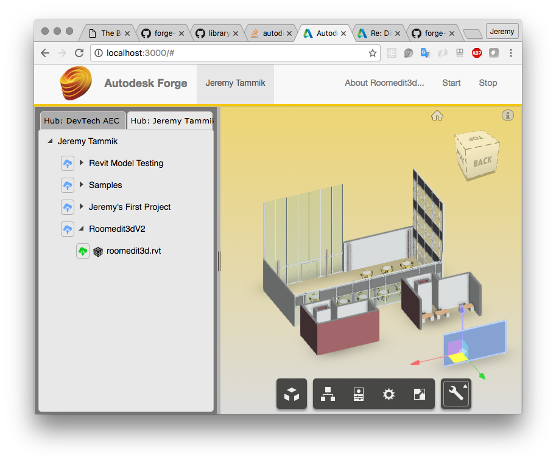
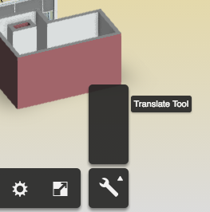

<head>
<title>The Building Coder</title>
<meta http-equiv="Content-Type" content="text/html; charset=utf-8"/>
<link rel="stylesheet" type="text/css" href="3dwc.css"/>

</head>

<!---

- warning swallower
  http://forums.autodesk.com/t5/revit-api-forum/general-warning-swallower/m-p/6589045
  
Warning Swallower, Roomedit3d Viewer Extension @AutodeskForge #revitapi #3dwebcoder @AutodeskRevit #aec #bim

I continue my work on the <code>roomedit3dv3</code> sample connecting the desktop with the cloud by enabling a real-time round-trip modification of the BIM via the Forge viewer, mention a neat solution enabling a Revit add-in to swallowing warning messages, and point out the Forge webinar session on the Forge Viewer later today
&ndash; Warning swallower
&ndash; Roomedit3dv3 transform viewer extension
&ndash; Forge webinar series...

-->

### Warning Swallower and Roomedit3d Viewer Extension

I continue my work on the [roomedit3dv3](https://github.com/Autodesk-Forge/forge-boilers.nodejs/tree/roomedit3d) sample
connecting the desktop with the cloud by enabling a real-time round-trip modification of the BIM via the Forge viewer,
mention a neat solution enabling a Revit add-in to swallowing warning messages,
and point out the Forge webinar session on the Forge Viewer later today:

- [Warning swallower](#2)
- [Roomedit3dv3 transform viewer extension](#3)
- [Forge webinar series](#4)

#### Warning Swallower

[Adam Krug](http://forums.autodesk.com/t5/user/viewprofilepage/user-id/3946573)
and [Wolfgang Weh](http://forums.autodesk.com/t5/user/viewprofilepage/user-id/1211382) provide a neat warning swallower solution in 
the [Revit API discussion forum](http://forums.autodesk.com/t5/revit-api/bd-p/160) thread 
on a [general warning swallower](http://forums.autodesk.com/t5/revit-api-forum/general-warning-swallower/m-p/6589045):

**Question:** In my solution I'm opening a lot of families from within a project. Sometimes some popups appear during opening a family. I enclosed the opening process inside a transaction in which I handle warnings via IFailuresPreprocessor. I noticed that:
 
About 90% warnings can be suppressed with the following:

<pre class="code">
&nbsp;&nbsp;FailuresAccessor&nbsp;a;
&nbsp;&nbsp;a.DeleteAllWarnings();
&nbsp;&nbsp;return&nbsp;FailureProcessingResult.Continue;
</pre>

But the remaining 10% won't get suppressed with such treatment, whereas they do get suppressed with:

<pre class="code">
&nbsp;&nbsp;FailuresAccessor&nbsp;a;
&nbsp;&nbsp;IList&lt;FailureMessageAccessor&gt;&nbsp;failures&nbsp;=&nbsp;a.GetFailureMessages();
&nbsp;&nbsp;a.ResolveFailures(&nbsp;failures&nbsp;);
&nbsp;&nbsp;return&nbsp;FailureProcessingResult.ProceedWithCommit;
</pre>

Is there a general way to check with what kind of treatment current warning can get suppressed? I don't want to go into a switch case block because the warnings are really various and it'd take ages before I covered them all. Another issue is that it doesn't matter so much how I treat the warnings because I don't resave the families in my solution - I just close them without saving.
 
**Answer:** I am not aware of any generic warning swallower within the Revit API.
 
The solution you have already seems pretty good to me.
 
For something yet more generic, all I can suggest is
a [Windows dialogue handler](http://thebuildingcoder.typepad.com/blog/2009/10/dismiss-dialogue-using-windows-api.html),
e.g., [JtClicker](https://github.com/jeremytammik/JtClicker).
 
The Building Coder provides an entire topic group on the subject
of [Detecting and Handling Dialogues and Failures](http://thebuildingcoder.typepad.com/blog/about-the-author.html#5.32).
 

**Answer 2:** The solution suggested in the thread
on [suppressing warning pop-ups](http://forums.autodesk.com/t5/revit-api-forum/supressing-warning-pop-ups/td-p/4764741) works
fine for me.
 
**Response:** Indeed, the `Severity` is what I was looking for. My solution seems to be working fine now. Here is the code:
 
<pre class="code">
FailureProcessingResult&nbsp;PreprocessFailures(&nbsp;
&nbsp;&nbsp;FailuresAccessor&nbsp;a&nbsp;)
{
&nbsp;&nbsp;IList&lt;FailureMessageAccessor&gt;&nbsp;failures&nbsp;
&nbsp;&nbsp;&nbsp;&nbsp;=&nbsp;a.GetFailureMessages();
 
&nbsp;&nbsp;foreach(&nbsp;FailureMessageAccessor&nbsp;f&nbsp;in&nbsp;failures&nbsp;)
&nbsp;&nbsp;{
&nbsp;&nbsp;&nbsp;&nbsp;FailureSeverity&nbsp;fseverity&nbsp;=&nbsp;a.GetSeverity();
 
&nbsp;&nbsp;&nbsp;&nbsp;if(&nbsp;fseverity&nbsp;==&nbsp;FailureSeverity.Warning&nbsp;)
&nbsp;&nbsp;&nbsp;&nbsp;{
&nbsp;&nbsp;&nbsp;&nbsp;&nbsp;&nbsp;a.DeleteWarning(&nbsp;f&nbsp;);
&nbsp;&nbsp;&nbsp;&nbsp;}
&nbsp;&nbsp;&nbsp;&nbsp;else
&nbsp;&nbsp;&nbsp;&nbsp;{
&nbsp;&nbsp;&nbsp;&nbsp;&nbsp;&nbsp;a.ResolveFailure(&nbsp;f&nbsp;);
&nbsp;&nbsp;&nbsp;&nbsp;&nbsp;&nbsp;return&nbsp;FailureProcessingResult.ProceedWithCommit;
&nbsp;&nbsp;&nbsp;&nbsp;}
&nbsp;&nbsp;}
&nbsp;&nbsp;return&nbsp;FailureProcessingResult.Continue;
}
</pre>

Many thanks to Adam and Wolfgang for sharing this solution!

I added it
to [The Building Coder samples](https://github.com/jeremytammik/the_building_coder_samples)
[release 2017.0.130.1](https://github.com/jeremytammik/the_building_coder_samples/releases/tag/2017.0.130.1) in
the module [CmdPreprocessFailure.cs](https://github.com/jeremytammik/the_building_coder_samples/blob/master/BuildingCoder/BuildingCoder/CmdPreprocessFailure.cs#L44-L67).

#### Roomedit3dv3 Transform Viewer Extension

I am implementing
the [roomedit3dv3](https://github.com/Autodesk-Forge/forge-boilers.nodejs/tree/roomedit3d) sample
connecting the desktop with the cloud based on
[Philippe Leefsma](http://twitter.com/F3lipek)'s
[Forge node.js boilerplate samples](https://github.com/Autodesk-Forge/forge-boilers.nodejs).

I now added a viewer extension enabling the user to select and translate a BIM element in the Forge viewer.

With that up and running, the next step will be to communicate back that modification to update the source Revit BIM.

I am basing the roomedit viewer transform tool on Philippe's 
[Viewing.Extension.Transform viewer extension](https://github.com/Developer-Autodesk/library-javascript-viewer-extensions/tree/master/src/Viewing.Extension.Transform),
from his
huge [library of JavaScript viewer extensions](https://github.com/Developer-Autodesk/library-javascript-viewer-extensions).

You can see it in action in the [Forge React gallery](https://react-gallery.autodesk.io/embed?id=57609f6b177a241809da305e&extIds=Viewing.Extension.Transform).

It took me several steps, lots of advice from Philippe, and some small enhancements to his underlying base boilerplate code to actually get it up and running:

> To add the transform extension to the viewer client, first load the three.js script before loading the viewer.

This is implemented in
the [layout](https://github.com/Autodesk-Forge/forge-boilers.nodejs/tree/roomedit3d/6%20-%20viewer%2Bserver%2Bdata-mng%2Bderivatives/layout).

> Copy the four files viewing extension into your app.

I placed them in
the [src/client/Components/Viewer/extensions](https://github.com/Autodesk-Forge/forge-boilers.nodejs/tree/roomedit3d/6%20-%20viewer%2Bserver%2Bdata-mng%2Bderivatives/src/client/Components/Viewer/extensions) subfolder.

> Load the transform extension by importing the main extension file.

Done in [ViewerPanel.js](https://github.com/Autodesk-Forge/forge-boilers.nodejs/blob/roomedit3d/6%20-%20viewer%2Bserver%2Bdata-mng%2Bderivatives/src/client/Components/Viewer/ViewerPanel.js#L20).

> The extension will register itself, and `activateTool` activates either the translate or rotate tool.

> The [translate tool is derived from event emitter](https://github.com/Autodesk-Forge/forge-boilers.nodejs/blob/roomedit3d/6%20-%20viewer%2Bserver%2Bdata-mng%2Bderivatives/src/client/Components/Viewer/extensions/Viewing.Tool.Translate.js#L4).

> It can therefore notify clients about its work by [emitting events using `this.emit`](https://github.com/Autodesk-Forge/forge-boilers.nodejs/blob/roomedit3d/6%20-%20viewer%2Bserver%2Bdata-mng%2Bderivatives/src/client/Components/Viewer/extensions/Viewing.Tool.Translate.js#L108-L111).

> At this point, you can add the `dbid` of the selected element to the transmitted data package. From `dbid` you can get the external id, which corresponds to the Revit `UniqueId`.

> In the extension constructor, you can subscribe to the events fired by the tool:

<pre class="prettyprint">
  import ServiceManager // cf. sample in App.js
  
  translateTool.on('transform.translate', (data) => {
    
    viewer.getProperties(data.dbId, callback...)
      
    var socketSvc = ServiceManager.getService('SocketSvc')
    
    socketSvc.broadcast('your-msgid', {some data ...})
    
  })
</pre>

**Question:** I loaded the extension as described, but the call to `loadExtension` call is not yet working.
 
Initially, I hooked it up to a load button and added this code:

<pre class="prettyprint">
  var loadBtn = document.getElementById('loadBtn');

  loadBtn.addEventListener("click", function(){
    this.viewer.loadExtension(
      'Viewing.Extension.Transform')
  });
</pre>

But when I click the button, 'this.viewer' is no longer valid, because `this` refers to the `ViewerPanel` instance.
 
When I try to call
 
<pre class="prettyprint">
  this.viewer.loadExtension('Viewing.Extension.Transform')
</pre>

directly without using a button click, nothing happens either.
 
**Answer:** This code is correct. However, as ALWAYS in JavaScript, you need to be careful to what `this` is pointing to. Inside an event handler, it will not be the same as in the calling context.
 
An easy way to fix your code is to use arrow function `=>` instead, which has the characteristic of implicitly binding `this` to the calling context.

**Response:** Yes, the call works now, and `loadExtension` is called successfully, cf.
the [diff 0.0.8 to 0.0.9](https://github.com/Autodesk-Forge/forge-boilers.nodejs/compare/0.0.8...0.0.9).

However, the extension is still not loaded successfully, neither with or without the button click.
 
In both cases, calling `loadExtension` triggers this error message in the js console:

<pre>
Uncaught TypeError: Cannot read property 'parentControl' of undefined
</pre>

What could be causing that?

**Answer:** Simply pass an empty options object to the extensions, e.g., a default argument:

<pre class="prettyprint">
  viewer.loadExtension('extid...', {})
</pre>

Alternatively, you can pass a `parentControl` object, which is a viewer UI control to host the extension controls:
 
<pre class="prettyprint">
  viewer.loadExtension('extid...', {
    parentControl: yourCustomControl
})
</pre>

**Response:** Thank you, yes, perfect, it works.
 
The result now looks like this:
 

Am I missing some icon resources?
 
**Answer:** You need `font-awesome` for the icons to show up. I just added it to `package.json` and in the code in my latest commit.

The Roomedit3dv3 transform extension is up and running right now in my local build, as shown [above](#3.1).

I have not tested deploying to Heroku yet, though, and, as said, I still need to add the code to communicate the modifications back to the desktop BIM.

Plus, today is the deadline to submit my material for the [RTCEU Revit Technology Conference Europe](http://www.rtcevents.com/rtc2016eur) in Porto next month.

#### Forge Webinar Series

Today, 
[Jaime Rosales](http://adndevblog.typepad.com/aec/jaime-rosales.html)
[Duque](http://core.thorntontomasetti.com/jaime-rosales-duque) presents
the fourth session in the ongoing Forge webinar series, on the Viewer.

Here are the recordings, presentations and support material of the sessions held so far:

- September 20 &ndash; [Introduction to Autodesk Forge and the Autodesk App Store](http://adndevblog.typepad.com/cloud_and_mobile/2016/09/introduction-to-autodesk-forge-and-the-autodesk-app-store.html)
- September 22 &ndash; [Introduction to OAuth and Data Management API](http://adndevblog.typepad.com/cloud_and_mobile/2016/09/introduction-to-oauth-and-data-management-api.html)
&ndash; on [OAuth](https://developer.autodesk.com/en/docs/oauth/v2/overview)
and [Data Management API](https://developer.autodesk.com/en/docs/data/v2/overview), providing token-based authentication, authorization and a unified and consistent way to access data across A360, Fusion 360, and the Object Storage Service.
- September 27 &ndash; [Introduction to Model Derivative API](http://adndevblog.typepad.com/cloud_and_mobile/2016/09/introduction-to-model-derivative-api.html)
&ndash; on the [Model Derivative API](https://developer.autodesk.com/en/docs/model-derivative/v2/overview) that enables users to represent and share their designs in different formats and extract metadata.
 
Upcoming sessions continue during the remainder of
the [Autodesk App Store Forge and Fusion 360 Hackathon](http://autodeskforge.devpost.com) until the end of October:

- September 29 &ndash; [Viewer](https://developer.autodesk.com/en/docs/viewer/v2/overview) &ndash; 
formerly part of the 'View and Data API', a WebGL-based, JavaScript library for 3D and 2D model rendering a CAD data from seed models, e.g., [AutoCAD](http://www.autodesk.com/products/autocad/overview), [Fusion 360](http://www.autodesk.com/products/fusion-360/overview), [Revit](http://www.autodesk.com/products/revit-family/overview), and many other formats.
- October 4 &ndash; [Design Automation API](https://developer.autodesk.com/en/docs/design-automation/v2/overview) &ndash; formerly known as 'AutoCAD I/O', run scripts on design files.
- October 6 &ndash; [BIM360](https://developer.autodesk.com/en/docs/bim360/v1/overview) &ndash; develop apps that integrate with BIM 360 to extend its capabilities in the construction ecosystem.
- October 11 &ndash; [Fusion 360 Client API](http://help.autodesk.com/view/NINVFUS/ENU/?guid=GUID-A92A4B10-3781-4925-94C6-47DA85A4F65A) &ndash; an integrated CAD, CAM, and CAE tool for product development, built for the new ways products are designed and made.
- October 13 &ndash; Q&A on all APIs.
- October 20 &ndash; Q&A on all APIs.
- October 27 &ndash; Submitting a web service app to Autodesk App store.

Quick access links:

- For API keys, go to [developer.autodesk.com](https://developer.autodesk.com)
- For code samples, go to [github.com/Developer-Autodesk](https://github.com/Developer-Autodesk)
 
Feel free to contact us at [forgehackathon@autodesk.com](mailto:forgehackathon@autodesk.com) at any time with any questions.

