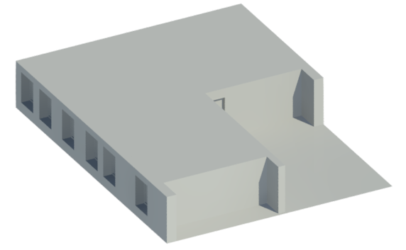

<head>
<title>The Building Coder</title>
<meta http-equiv="Content-Type" content="text/html; charset=utf-8"/>
<link rel="stylesheet" type="text/css" href="3dwc.css"/>

</head>

<!---

DirectObjLoader for Revit 2017 @AutodeskForge #revitapi #3dwebcoder @AutodeskRevit #aec #bim @RTCEvents

Here is a last quick Sunday morning post before I head off on vacation, on the DirectObjLoader migration to Revit 2017, handling the changes in <code>DirectShape.CreateElement</code> and <code>TessellatedShapeBuilderResult</code>...

-->

### DirectObjLoader for Revit 2017

Here is a last quick Sunday morning post before I head off on vacation, prompted
by [truevis](https://github.com/truevis)' comment on
the [DirectObjLoader](https://github.com/jeremytammik/DirectObjLoader)
[GitHub issue #2](https://github.com/jeremytammik/DirectObjLoader/issues/2):

#### Question

What do we have to change to get this to work in Revit 2017? Seems there are changes in `DirectShape.CreateElement` and `TessellatedShapeBuilderResult`.

#### Answer

I migrated the sample to Revit 2017 for you.

Here is what I did:

- Updated the Revit API references
- Incremented the .NET framework from 4.5 to 4.5.2
- Reinstalled the FileFormatWavefront NuGet package
- Recompiled

That produced two warnings:

- Error CS1501 No overload for method 'Build' takes 3 arguments DirectObjLoader C:\a\vs\DirectObjLoader\DirectObjLoader\Command.cs 126 Active
- Warning CS0618 'DirectShape.CreateElement(Document, ElementId, string, string)' is obsolete: 'This function will be obsolete in Revit 2017. Use DirectShape.CreateElement(Document, ElementId) instead. Use DirectShape.ApplicationId, DirectShape.ApplicationDataId properties to set application id and application data id.' DirectObjLoader C:\a\vs\DirectObjLoader\DirectObjLoader\Command.cs 131 Active

The warning is completely self-explanatory and trivial.

To fix it, just do what the man says.

The error is caused by the changes described
in [What's New in the Revit 2017 API](http://thebuildingcoder.typepad.com/blog/2016/04/whats-new-in-the-revit-2017-api.html):

#### [TessellatedShapeBuilder Changes](http://thebuildingcoder.typepad.com/blog/2016/04/whats-new-in-the-revit-2017-api.html#2.12.2)

The options for building are now set as options in the `TessellatedShapeBuilder` itself. Access these options through the new properties:

- TessellatedShapeBuilder.Target
- TessellatedShapeBuilder.Fallback
- TessellatedShapeBuilder.GraphicsStyleId

Furthermore, the build result is now accessible through `GetBuildResult` instead of being returned by the `Build` method.

I published a new [release 2017.0.0.0](https://github.com/jeremytammik/DirectObjLoader/releases/tag/2017.0.0.0) including the corresponding changes.

You can [compare the changes](https://github.com/jeremytammik/DirectObjLoader/compare/2015.0.0.22...2017.0.0.0) to see exactly what I did.

Here is the code for Revit 2017:

The flat migration works fine, and this image was produced as a result from a 6 MB OBJ apartment model:

