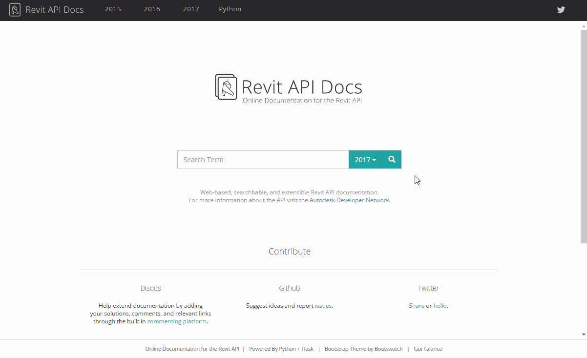

<head>
<title>The Building Coder</title>
<meta http-equiv="Content-Type" content="text/html; charset=utf-8"/>
<link rel="stylesheet" type="text/css" href="3dwc.css"/>

</head>

<!---

<code></code>

Token Expiry and Online Revit API Docs @AutodeskForge #revitapi @AutodeskRevit #aec #bim @RTCEvents

My vacation ended and I am now in Porto, putting the last touches to my presentation material for the RTC Revit Technology Conference Europe and the ISEPBIM Forge and BIM workshops at ISEP, Porto University. Here are today's Revit API and Forge news items
&ndash; Updated Online Revit API Docs
&ndash; Handling Forge token expiry...

-->

### Token Expiry and Online Revit API Docs

My vacation ended and I am now in Porto, putting the last touches to my presentation material for 
the [RTC Revit Technology Conference Europe](http://www.rtcevents.com/rtc2016eur) and 
the [ISEPBIM](https://www.facebook.com/ISEPBIM) Forge and BIM workshops at [ISEP](http://www.isep.ipp.pt), 
the [Instituto Superior de Engenharia do Porto](http://www.isep.ipp.pt).

Here are today's Revit API and Forge news items:

- [Updated Online Revit API Docs](#2)
- [Handling Forge token expiry](#3)

#### Updated Online Revit API Docs

Gui Talarico updated the [online Revit API documentation](http://thebuildingcoder.typepad.com/blog/2016/08/online-revit-api-docs-and-convex-hull.html#2)

[www.RevitAPIdocs.com](http://www.revitapidocs.com)

In his own words:

> In case you haven't seen it yet, I just wanted to share with you the latest version of [RevitAPIdocs.com](http://www.revitapidocs.com):

>
- Redesigned home page.
- Consolidated search for all APIs: search results highlight if entry is not part of the active 'Year' and redirect you (i.e., to leaders in Revit 2015).
- Result filtering by type (Class, Method, etc.).
- Built in autocomplete engine to help users find most relevant entries &ndash; it will improve further over time!

Here is an animation showing a quick overview of the new features:

The revamped search result landing page looks like this:

Many thanks to Gui for providing this really important tool!

#### Handling Forge Token Expiry

**Question:** I am working on an app for
the [Forge and AppStore hackathon challenge](http://autodeskforge.devpost.com).

I am using the [models.autodesk.io online tool](https://models.autodesk.io) for token generation.

However, my access token is getting expired.

Please help resolve the issue.

**Answer by Cyrille Fauvel:** [models.autodesk.io](https://models.autodesk.io) is a web site which demonstrates how to easily translate a model using your own consumer and secret key.

It is not intended to be used as an access token generator, because it is highly discouraged to transmit your keys over Internet, even through an encrypted and secured `https` connection.

Instead, you should write your own code to generate the access token yourself, just like `models.autodesk.io` does. The relevant part is located 
in [lmv-token.js around line 43](https://github.com/cyrillef/models.autodesk.io/blob/master/server/lmv-token.js#L43).

As you have noticed, the token expires after a while.

This sample does not take care of refreshing it, as this site is to be used manually for a single translation.

In your own implementation, you will need to check the `expires_in` field to know when the token will expire and make sure to refresh it before it does so as shown
in [lmv-token.js around line 29](https://github.com/cyrillef/extract.autodesk.io/blob/master/server/lmv-token.js#L29).

Thank you, Cyrille, for the complete and succinct answer.

