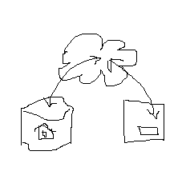

<head>
<title>The Building Coder</title>
<meta http-equiv="Content-Type" content="text/html; charset=utf-8"/>
<link rel="stylesheet" type="text/css" href="3dwc.css"/>

</head>

<!---

<code></code>

Cool Forge Demos and Roomedit Caveat @AutodeskForge #revitapi @AutodeskRevit #aec #bim @RTCEvents

Getting ready to present an overview of Forge and talk about connecting the desktop and the cloud at the RTC Revit Technology Conference Europe and the ISEPBIM Forge and BIM workshops at ISEP, the Instituto Superior de Engenharia do Porto, Jim Quanci very kindly supplied an updated list of really cool demo sites, plus a word of warning:
&ndash; Cool Forge demos
&ndash; Caveat on connecting desktop and cloud...

-->

### Cool Forge Demos and Roomedit Caveat

Getting ready to present an overview of Forge and talk about connecting the desktop and the cloud at 
the [RTC Revit Technology Conference Europe](http://www.rtcevents.com/rtc2016eur) and 
the [ISEPBIM](https://www.facebook.com/ISEPBIM) Forge and BIM workshops at [ISEP](http://www.isep.ipp.pt), 
the [Instituto Superior de Engenharia do Porto](http://www.isep.ipp.pt),
Jim Quanci very kindly supplied an updated list of really cool demo sites, plus a word of warning:

- [Cool Forge demos](#2)
- [Caveat on connecting desktop and cloud](#3)

#### Cool Forge Demos

Here are a number of links to various Forge demos that I can use myself and point others to play with in the coming days:

- [Fun cool site](http://lmv.rocks) &ndash; [lmv.rocks](http://lmv.rocks)
- [Animated physics simulation](http://viewer.autodesk.io/node/physics/#/viewer) &ndash; [viewer.autodesk.io/node/physics/#/viewer](http://viewer.autodesk.io/node/physics/#/viewer)
<!---- [Mongodb to Viewer](http://mongo.autodesk.io) &ndash; [mongo.autodesk.io](http://mongo.autodesk.io) ---->
- [Connect mongo database to viewer](https://forge-rcdb.autodesk.io) &ndash; [forge-rcdb.autodesk.io](https://forge-rcdb.autodesk.io)
- [Synchronized 2D/3D](http://calm-inlet-4387.herokuapp.com/?_sm_au_=iVVvSjRVVjbtJSQ7) &ndash; [calm-inlet-4387.herokuapp.com](http://calm-inlet-4387.herokuapp.com/?_sm_au_=iVVvSjRVVjbtJSQ7)
- [Pier 9 IoT demo](https://pier9.autodesk.io/?model=reduced) &ndash; [pier9.autodesk.io](https://pier9.autodesk.io/?model=reduced)
- [Ship Model in Blog](http://blogs.ssi-corporate.com/waveform/2014/technology/autodesk-university-another-great-event) &ndash; [blogs.ssi-corporate.com Autodesk University](http://blogs.ssi-corporate.com/waveform/2014/technology/autodesk-university-another-great-event)
- [St Petersburg PolyTech](http://www.spbstu.ru/structure/inzhenerno_stroitelnyy_institut/) &ndash; [www.spbstu.ru](http://www.spbstu.ru/structure/inzhenerno_stroitelnyy_institut/)
- [CFD](https://www.simulationhub.com/knowledge-base/simulation-gallery) &ndash; [www.simulationhub.com simulation gallery](https://www.simulationhub.com/knowledge-base/simulation-gallery)
- [Gallery w/extensions](http://viewer.autodesk.io/node/gallery/#/home) &ndash; [viewer.autodesk.io/node/gallery](http://viewer.autodesk.io/node/gallery/#/home)
- [Forge Main site](http://developer.autodesk.com) &ndash; [developer.autodesk.com](http://developer.autodesk.com)
- [Viewer with Notes and Saving States](https://lmv-react.herokuapp.com/embed?id=560c6c57611ca14810e1b2bf&extIds=Viewing.Extension.StateManager;Viewing.Extension.Markup3D&options=%27%7B%22showPanel%22:%22true%22,%22stateId%22:%22a9f227f6154286f00c7%22}%27) &ndash; [lmv-react.herokuapp.com](https://lmv-react.herokuapp.com/embed?id=560c6c57611ca14810e1b2bf&extIds=Viewing.Extension.StateManager;Viewing.Extension.Markup3D&options=%27%7B%22showPanel%22:%22true%22,%22stateId%22:%22a9f227f6154286f00c7%22}%27)
- [ICON Retaill Store Mgt](https://orbit.vision) &ndash; [orbit.vision](https://orbit.vision)
- [Animated 3D assembly instructions](http://trial.dotdotty.com/share?shareId=431c-bac8-eedb-e43d-fc79&iframe=true) &ndash; [trial.dotdotty.com](http://trial.dotdotty.com/share?shareId=431c-bac8-eedb-e43d-fc79&iframe=true)
- [Autodesk Hub to Box](https://forgedmboxintegration.herokuapp.com/) &ndash; [forgedmboxintegration.herokuapp.com](https://forgedmboxintegration.herokuapp.com/)
- [Box Viewer](https://forgeboxviewer.herokuapp.com) &ndash; [forgeboxviewer.herokuapp.com](https://forgeboxviewer.herokuapp.com)

Note that several of these sites were built by independent partners on their own, just as little sample snippets in blog posts.
 
Many thanks to Jim for maintaining and sharing this list!

All Forge sample application code is provided on GitHub, most of it in
the [Developer-Autodesk](https://github.com/Developer-Autodesk)
and the new streamlined [Autodesk-Forge](https://github.com/Autodesk-Forge) collections.

It includes several of the demos listed above.

#### Caveat on connecting desktop and cloud

Jim adds a word of warning about my samples connecting desktop and cloud that I fully agree with:

> One warning... watching your blog posts where folks might be led to believe using a browser experience to edit a Revit model is a good thing… it’s not clear to me it is.  

I fully agree with this warning!

If anyone is interested in serious web based interaction with RVT files, they should read about our [thoughts on Revit I/O](http://thebuildingcoder.typepad.com/blog/about-the-author.html#5.28b) and get in touch to discuss their needs with us.

Since this question comes up at all, I should probably be clearer about my intentions:
 
In the presentation, I underline that the advantage lies in leveraging the data, and sharing the absolute minimum of information required to complete a streamlined workflow in an optimal manner.
 
There is no doubt whatsoever that actual editing of a BIM model is light years out of scope.
 
I just want to point out that tiny little snippets of data can be passed around and used to drive a really efficient globally connected process.

