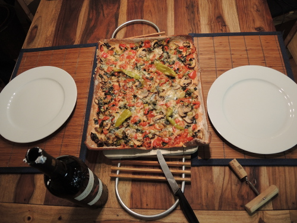
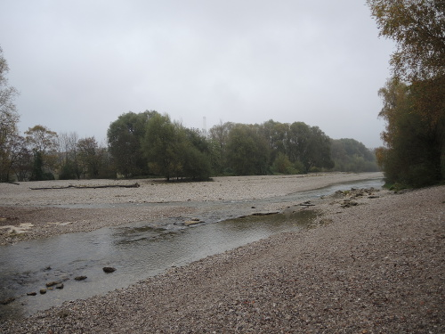

<head>
<title>The Building Coder</title>
<meta http-equiv="Content-Type" content="text/html; charset=utf-8"/>
<link rel="stylesheet" type="text/css" href="3dwc.css"/>

</head>

<!---

<code></code>

Revit Future Direction and Public Roadmap #RTCEUR @RTCEvents @AutodeskForge #revitapi @AutodeskRevit #aec #bim

Here I am in Munich, supporting the one-week Forge accelerator workshop
&ndash; Pizza and Isar
&ndash; Public Revit Roadmap
&ndash; Revit Idea Station
&ndash; Revit Today and Tomorrow...

-->

### Revit Future Direction and Public Roadmap

Here I am in Munich, supporting the
one-week [Forge accelerator](http://autodeskcloudaccelerator.com) workshop.

- [Pizza and Isar](#2)
- [Public Revit Roadmap](#3)
- [Revit Idea Station](#4)
- [Revit Today and Tomorrow](#5)

#### Pizza and Isar

I am staying with a friend on the other side of the river, so I get a chance to cook in the evening:

I have a nice long walk to get to and from the office crossing the Isar River, taking me through a stretch of nature and greenery each evening and morning:

That feels good!

You can see a handful more pictures in
the [Pizza and Isar album](https://flic.kr/s/aHskKjyb4g).

#### Public Revit Roadmap

I still have lots of exciting things to report from the
the [RTC Revit Technology Conference Europe](http://www.rtcevents.com/rtc2016eur) in
Porto last week.

Maybe the most relevant for the entire community is
the [public Revit roadmap](http://forums.autodesk.com/t5/revit-roadmaps/the-first-ever-public-revit-roadmap/ba-p/6633199),
also accessible via [www.autodesk.com/revitroadmap](http://www.autodesk.com/revitroadmap),
published by Sasha Crotty, Product Manager in the Revit development team.

It sparked a huge amount of discussion already:

Maybe you would like to join it and make yourself heard as well?

#### Revit Idea Station

It also touches a lot on
the [Revit Idea Station](http://forums.autodesk.com/t5/revit-ideas/idb-p/302/):

- [Revit Idea Station](http://forums.autodesk.com/t5/revit-ideas/idb-p/302/)
- [Tag: API](http://forums.autodesk.com/t5/tag/API/tg-p/board-id/302)
- [Introducing the Revit Idea Station](http://thebuildingcoder.typepad.com/blog/2016/05/idea-station-and-textnote-bounding-box.html#2)

I mentioned the lively discussion on both of these topics in the notes from
the [Revit API discussion panel](http://thebuildingcoder.typepad.com/blog/2016/10/rtc-revit-api-panel-idea-station-edit-and-continue.html).

#### Revit Today and Tomorrow

Sasha herself presented the public roadmap and many exciting aspects of the future direction of Revit in her [20-minute RTC presentation on Revit Today and Tomorrow](https://www.periscope.tv/w/1mnxejZqmlEKX).

There were so many exciting presentations at RTC!

I wish I could share them all with you!

Anyway, getting back to the roadmap:

Join the lively discussion going on right now!

Make yourself heard.

