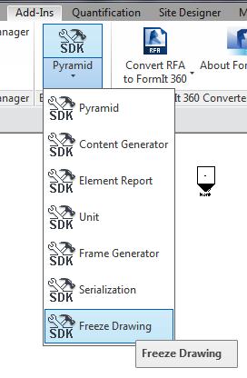
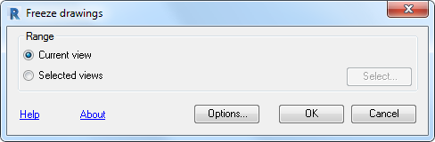
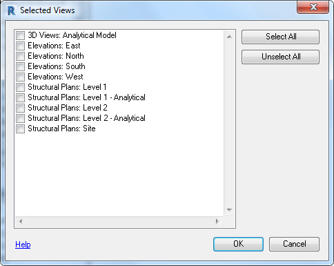

<head>
<title>The Building Coder</title>
<meta http-equiv="Content-Type" content="text/html; charset=utf-8"/>
<link rel="stylesheet" type="text/css" href="3dwc.css"/>

</head>

<!---

Revit 2017.1 SDK posting -- email Mikako Harada

Pawel Madej RE: New version of Revit SDK 2017.1 with new REX SDK sample - FreezeDrawing

<code></code>

AU, Revit 2017.1 SDK and REX FreezeDrawing @AutodeskForge #revitapi @AutodeskRevit #aec #bim @RevitStructure

I returned from the Munich Forge accelerator, travelling back to Switzerland by train. For ecological reasons, I prefer to avoid flying whenever I possibly can. Last Friday was the deadline for submitting my Autodesk University handout, so that kept me busy. I still need to improve it a bit, and I hope a post-deadline update is feasible. I am presenting two classes, and I have a special discount to offer you. Lots of other things are happening as well
&ndash; My classes at Autodesk University
&ndash; $400 AU registration discount
&ndash; Revit 2017.1 SDK
&ndash; REX SDK FreezeDrawing sample
&ndash; Determining the height of a column...

-->

### AU, Revit 2017.1 SDK and REX FreezeDrawing

I returned from 
the [Munich Forge accelerator](http://autodeskcloudaccelerator.com),
travelling back to Switzerland by train.
For ecological reasons, I prefer to avoid flying whenever I possibly can.

Last Friday was the deadline for submitting my Autodesk University handout, so that kept me busy.

I still need to improve it a bit, and I hope a post-deadline update is feasible.

I am presenting two classes, and I have a special discount to offer you.

Lots of other things are happening as well.

Here is the list of topics for today:

- [My classes at Autodesk University](#2)
- [$400 AU registration discount](#3)
- [Revit 2017.1 SDK](#4)
- [REX SDK FreezeDrawing sample](#5)
- [Determining the height of a column](#6)

#### My Classes at Autodesk University

This year, I am presenting two classes at [Autodesk University](http://au.autodesk.com/las-vegas/overview):

- SD20891 &ndash; Revit API Expert Roundtable &ndash; Open House on the Factory Floor
- SD20908 &ndash; Connect Desktop and Cloud &ndash; Free Your BIM Data!

One way to access them and check out their details is
to [search the AU catalogue for 'tammik'](https://events.au.autodesk.com/connect/dashboard.ww#loadSearch-searchPhrase=tammik&searchType=session).

I really hope you can make it to my live sessions, of course.

In case not, I'll share my handouts for both as soon as I have cleaned them up a little bit more.

Meanwhile, I have another AU goodie to share, in case you have not already discovered it elsewhere:

#### $400 Autodesk University Registration Discount

I have a special offer to share with you:

You can get $400 off the regular AU conference price of $2,175 on any new registration.

Simply use the discount code `400AU16REFSP`.

Here is [the AU registration link](https://events.au.autodesk.com/portal/login.ww).

#### Revit 2017.1 SDK

As you probably know by now, Revit 2017.1 has been released, with an [impressive list of enhancements](https://knowledge.autodesk.com/support/revit-products/learn-explore/caas/CloudHelp/cloudhelp/2017/ENU/Revit-WhatsNew/files/GUID-E287E537-7122-4ED8-8845-B8E24F287B62-htm.html).

An updated Revit SDK for Revit 2017.1 has been posted to
the [Revit Developer Centre](http://www.autodesk.com/developrevit):

- <a href="http://images.autodesk.com/adsk/files/Revit_2017.1_SDK_(Update_Oct_19__2016).msi">Revit 2017.1 SDK Update Oct 19, 2016.msi</a> (msi &ndash; 301220Kb)

The new version sports quite a large list of exciting API improvements, as you can see by looking at the extensive documentation of them included with the SDK, both in the stand-alone document *Revit Platform API Changes and Additions.docx* and the section on *What's New* in the Revit API help file `RevitAPI.chm`.

It also includes a new REX SDK sample:

#### REX SDK FreezeDrawing Sample

One important structural part of the Revit SDK is the [REX SDK](http://thebuildingcoder.typepad.com/blog/2015/12/rex-app-development-and-migration.html).

The 2017.1 version of the REX SDK contains new sample project `DRevitFreezeDrawing` that was created from a discontinued REX module.
  
Many thanks to Paweł Madej, Senior Software Engineer in Krakow, Poland, for pointing it out and supplying the following detailed description:
 
<u>Subject</u>

Separate a drawing or view from model so that the state of the drawing or view stays unchanged (frozen).

<u>Summary</u>

This sample contains the discontinued Revit Extensions module Freeze Drawing.

It enables you to separate a drawing or view from an object model so that its state remains unchanged (frozen) or export it to a DWG file.
 
<u>REXSDK Values</u>

- Real module with complete UI and help.
- Fully functional REX module.
- Presents sample source code for view exporting and importing.
 
<u>Description</u>

The extension is based on the Revit DWG Import and DWG Export functionality.
All frozen drawings or views are placed in newly created views.
Selected views are imported to DWG files with user-defined parameters.
Freezing of drawings does not include 3D views or sheets.
The extension also offers options for saving frozen drawings and views on the disk.
  
<u>Instructions</u>

- Copy the module to the `...Modules/Category` directory.
- Open Revit.
- Define model. 
- Run the extension.
- Choose the view to be exported or frozen.
- Press OK to see result and new Drafting View (Detail).
- From now on, the frozen view will remain  even if the model is changed.
 
<u>Screen Shots</u>

After compilation of the sample modules, the new command is visible at the bottom of the samples list:
 

The main dialogue prompts whether to freeze the current view or selected ones:

The view selection form looks like this:
 

Thanks again to Paweł for pointing it out!

<!----
#### Forge Accelerator Topics

#### House Configurator Approaches

Two completely different approaches toward the implementation of a web or Forge based house configurator, a la IKEA for a house:
    
estonia - rhino &rarr; threejs &rarr; revit

belgium - aggregation sample https://forge.autodesk.io

#### Neo4j

[Neo4j](https://neo4j.com/)

[document-based or graph database, MongoDB vs Neo4j](http://stackoverflow.com/questions/14793335/should-i-go-for-document-based-or-graph-database-mongodb-vs-neo4j)

Revit centric TBI Voorbij pre-cast factory design to fabrication process: part 4 of this video, Jos Mulkens and Jeroen Pat from TBI 

http://au.autodesk.com/au-online/classes-on-demand/class-catalog/2015/class-detail/11913#chapter=0

Leo van Ruijven thought leader - http://www.iso.org/iso/catalogue_detail.htm?csnumber=57859

---->

#### Determining the Height of a Column

There is no API query or property to retrieve the length of a column directly, because it depends on the column type and its relationships with other objects.

Here are two alternative approaches suggested by Jim Jia.

This method uses the bottom and top level parameters to calculate the length of a vertical column:

<pre class="code">
///&nbsp;&lt;summary&gt;
///&nbsp;Determine&nbsp;the&nbsp;height&nbsp;of&nbsp;a&nbsp;vertical&nbsp;column&nbsp;from&nbsp;
///&nbsp;its&nbsp;top&nbsp;and&nbsp;bottom&nbsp;level.
///&nbsp;&lt;/summary&gt;
public&nbsp;Double&nbsp;GetColumHeightFromLevels(&nbsp;
&nbsp;&nbsp;Element&nbsp;e&nbsp;)&nbsp;
{
&nbsp;&nbsp;if(&nbsp;!IsColumn(&nbsp;e&nbsp;)&nbsp;)
&nbsp;&nbsp;{
&nbsp;&nbsp;&nbsp;&nbsp;throw&nbsp;new&nbsp;ArgumentException(
&nbsp;&nbsp;&nbsp;&nbsp;&nbsp;&nbsp;&quot;Expected&nbsp;a&nbsp;column&nbsp;argument.&quot;&nbsp;);
&nbsp;&nbsp;}
 
&nbsp;&nbsp;Document&nbsp;doc&nbsp;=&nbsp;e.Document;
 
&nbsp;&nbsp;double&nbsp;height&nbsp;=&nbsp;0;
 
&nbsp;&nbsp;if(&nbsp;e&nbsp;!=&nbsp;null&nbsp;)
&nbsp;&nbsp;{
&nbsp;&nbsp;&nbsp;&nbsp;//&nbsp;Get&nbsp;top&nbsp;level&nbsp;of&nbsp;the&nbsp;column
 
&nbsp;&nbsp;&nbsp;&nbsp;Parameter&nbsp;topLevel&nbsp;=&nbsp;e.get_Parameter(&nbsp;
&nbsp;&nbsp;&nbsp;&nbsp;&nbsp;&nbsp;BuiltInParameter.FAMILY_TOP_LEVEL_PARAM&nbsp;);
 
&nbsp;&nbsp;&nbsp;&nbsp;ElementId&nbsp;ip&nbsp;=&nbsp;topLevel.AsElementId();
&nbsp;&nbsp;&nbsp;&nbsp;Level&nbsp;top&nbsp;=&nbsp;doc.GetElement(&nbsp;ip&nbsp;)&nbsp;as&nbsp;Level;
&nbsp;&nbsp;&nbsp;&nbsp;double&nbsp;t_value&nbsp;=&nbsp;top.ProjectElevation;
 
&nbsp;&nbsp;&nbsp;&nbsp;//&nbsp;Get&nbsp;base&nbsp;level&nbsp;of&nbsp;the&nbsp;column&nbsp;
 
&nbsp;&nbsp;&nbsp;&nbsp;Parameter&nbsp;BotLevel&nbsp;=&nbsp;e.get_Parameter(&nbsp;
&nbsp;&nbsp;&nbsp;&nbsp;&nbsp;&nbsp;BuiltInParameter.FAMILY_BASE_LEVEL_PARAM&nbsp;);
 
&nbsp;&nbsp;&nbsp;&nbsp;ElementId&nbsp;bip&nbsp;=&nbsp;BotLevel.AsElementId();
&nbsp;&nbsp;&nbsp;&nbsp;Level&nbsp;bot&nbsp;=&nbsp;doc.GetElement(&nbsp;bip&nbsp;)&nbsp;as&nbsp;Level;
&nbsp;&nbsp;&nbsp;&nbsp;double&nbsp;b_value&nbsp;=&nbsp;bot.ProjectElevation;
 
&nbsp;&nbsp;&nbsp;&nbsp;//&nbsp;At&nbsp;this&nbsp;point,&nbsp;there&nbsp;are&nbsp;a&nbsp;number&nbsp;of&nbsp;
&nbsp;&nbsp;&nbsp;&nbsp;//&nbsp;additional&nbsp;Z&nbsp;offsets&nbsp;that&nbsp;may&nbsp;also&nbsp;affect
&nbsp;&nbsp;&nbsp;&nbsp;//&nbsp;the&nbsp;result.
 
&nbsp;&nbsp;&nbsp;&nbsp;height&nbsp;=&nbsp;(&nbsp;t_value&nbsp;-&nbsp;b_value&nbsp;);
&nbsp;&nbsp;}
&nbsp;&nbsp;return&nbsp;height;
}
</pre>

In this approach, a number of Z offset parameters on the column instance may affect the final result.

The second method retrieves the column bounding box and uses its maximum and minimum coordinates to determine its height:

<pre class="code">
///&nbsp;&lt;summary&gt;
///&nbsp;Determine&nbsp;the&nbsp;height&nbsp;of&nbsp;any&nbsp;given&nbsp;element&nbsp;
///&nbsp;from&nbsp;its&nbsp;bounding&nbsp;box.
///&nbsp;&lt;/summary&gt;
public&nbsp;Double&nbsp;GetElementHeightFromBoundingBox(&nbsp;
&nbsp;&nbsp;Element&nbsp;e&nbsp;)
{
&nbsp;&nbsp;//&nbsp;No&nbsp;need&nbsp;to&nbsp;retrieve&nbsp;the&nbsp;full&nbsp;element&nbsp;geometry.
&nbsp;&nbsp;//&nbsp;Even&nbsp;if&nbsp;there&nbsp;were,&nbsp;there&nbsp;would&nbsp;be&nbsp;no&nbsp;need&nbsp;to&nbsp;
&nbsp;&nbsp;//&nbsp;compute&nbsp;references,&nbsp;because&nbsp;they&nbsp;will&nbsp;not&nbsp;be
&nbsp;&nbsp;//&nbsp;used&nbsp;anyway!
 
&nbsp;&nbsp;//GeometryElement&nbsp;ge&nbsp;=&nbsp;e.get_Geometry(&nbsp;
&nbsp;&nbsp;//&nbsp;&nbsp;new&nbsp;Options()&nbsp;{&nbsp;
&nbsp;&nbsp;//&nbsp;&nbsp;&nbsp;&nbsp;ComputeReferences&nbsp;=&nbsp;true&nbsp;}&nbsp;);
&nbsp;&nbsp;//
&nbsp;&nbsp;//BoundingBoxXYZ&nbsp;boundingBox&nbsp;=&nbsp;ge.GetBoundingBox();
 
&nbsp;&nbsp;BoundingBoxXYZ&nbsp;bb&nbsp;=&nbsp;e.get_BoundingBox(&nbsp;null&nbsp;);
 
&nbsp;&nbsp;if(&nbsp;null&nbsp;==&nbsp;bb&nbsp;)
&nbsp;&nbsp;{
&nbsp;&nbsp;&nbsp;&nbsp;throw&nbsp;new&nbsp;ArgumentException(
&nbsp;&nbsp;&nbsp;&nbsp;&nbsp;&nbsp;&quot;Expected&nbsp;Element&nbsp;&#39;e&#39;&nbsp;to&nbsp;have&nbsp;a&nbsp;valid&nbsp;bounding&nbsp;box.&quot;&nbsp;);
&nbsp;&nbsp;}
 
&nbsp;&nbsp;return&nbsp;bb.Max.Z&nbsp;-&nbsp;bb.Min.Z;
}
</pre>

This approach is more generic and can be used for any geometric BIM element.

Furthermore, the result obtained from the bounding box already takes the column Z offset parameters into account.

More approaches are possible, e.g., some columns have a location curve, from which its start and end points can be determined.

You can also query the start and end points of the column's analytical line. Be aware that this may not be in the same location as the physical element.

Thanks to Jim for sharing these snippets!

I also added them 
to [The Building Coder samples](https://github.com/jeremytammik/the_building_coder_samples)
[release 2017.0.131.1](https://github.com/jeremytammik/the_building_coder_samples/releases/tag/2017.0.131.1) in the module  [CmdColumnRound.cs](https://github.com/jeremytammik/the_building_coder_samples/blob/master/BuildingCoder/BuildingCoder/CmdColumnRound.cs#L30-L104), cf. the [diff from the previous release](https://github.com/jeremytammik/the_building_coder_samples/compare/2017.0.131.0...2017.0.131.1).
