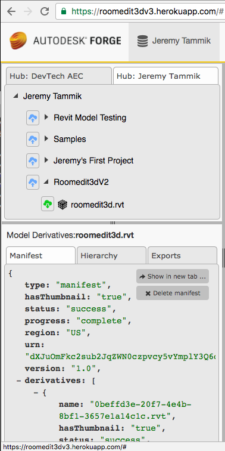

<head>
<title>The Building Coder</title>
<meta http-equiv="Content-Type" content="text/html; charset=utf-8"/>
<link rel="stylesheet" type="text/css" href="3dwc.css"/>

</head>

<!---

<code></code>

Roomedit3dv3 Diff from Forge Boilerplate Code @AutodeskForge #revitapi @AutodeskRevit #aec #bim

I am preparing the Forge and BIM presentation and hands-on workshop this coming Friday at Technische Universität Darmstadt, Institut für Numerische Methoden und Informatik im Bauwesen, the institute for numerical methods and computer science in the construction industry at the technical university in Darmstadt. Now I prepared a detailed analysis of the exact changes I made to the forge-boilers.nodejs boilerplate code to implement the roomedit3dv3 sample connecting BIM with the cloud
&ndash; Comparing the root folder contents
&ndash; Comparing the Forge node.js boilerplate
&ndash; Starting fresh from scratch
&ndash; Copy, install and load the viewer extension
&ndash; Adding the link to load the viewer extension
&ndash; Renamed viewer extension base and toolkit <code>js</code> modules
&ndash; All Viewer Extension Modifications
&ndash; Successful test and final diff  &ndash; 25 lines of code...

-->

### Roomedit3dv3 Diff from Forge Boilerplate Code

I am still busy preparing
my [Autodesk University sessions](http://thebuildingcoder.typepad.com/blog/2016/10/au-revit-20171-and-rex-freezedrawing.html#2),
and more urgently 
the [Forge and BIM](http://www.bim.tu-darmstadt.de) presentation
and hands-on workshop this coming Friday 
at [Technische Universität Darmstadt](http://www.tu-darmstadt.de),
[Institut für Numerische Methoden und Informatik im Bauwesen](http://www.iib.tu-darmstadt.de),
the institute for numerical methods and computer science in the construction industry at the technical university in the very pleasant German
city [Darmstadt](https://en.wikipedia.org/wiki/Darmstadt),
in Hessen, just south of Frankfurt.

The agenda there consists of two parts:

- 10:45-12:15 presentation &ndash; [Connecting desktop and  cloud](http://thebuildingcoder.typepad.com/blog/2016/10/connecting-desktop-and-cloud-at-rtc-material.html)
- 13:00-17:00 hands-on workshop with two topics:
    - Revit API &ndash; [creating a Revit add-in with one single click](http://thebuildingcoder.typepad.com/blog/2016/10/revit-api-and-connecting-desktop-and-cloud-tuda.html#4)
    - Connecting BIM with the cloud &ndash; [connecting Revit and Forge in 55 minutes](http://thebuildingcoder.typepad.com/blog/2016/10/revit-api-and-connecting-desktop-and-cloud-tuda.html#5)

I already prepared the material pointed to by the links above.

Now I would like to add a more detailed analysis of the exact changes I made to
the [forge-boilers.nodejs](https://github.com/Autodesk-Forge/forge-boilers.nodejs) boilerplate
code to implement 
the [roomedit3dv3 sample](https://github.com/Autodesk-Forge/forge-boilers.nodejs/tree/roomedit3d) connecting
BIM with the cloud.

- [Comparing the root folder contents](#2)
- [Comparing the Forge node.js boilerplate](#3)
- [Starting fresh from scratch](#4)
- [Copy, install and load the viewer extension](#5)
- [Adding the link to load the viewer extension](#6)
- [Renamed viewer extension base and toolkit `js` modules](#7)
- [All Viewer Extension Modifications](#8)
- [Successful test and final diff  &ndash; 25 lines of code](#9)

Please note that I abandoned my initial comparison attempt after the first two steps listed above, so if you are not interested in the painful beginnings of this exploration, you can skip straight to [starting fresh from scratch](#4).

Or, if you are really in a hurry, just skip straight to the end to the [successful test and final diff](#9) to examine the 25 lines of code that I modified or added all in all.

#### Comparing the Root Folder Contents

I cloned the `master` and `roomedit3d` branches of
the [forge-boilers.nodejs repo](https://github.com/Autodesk-Forge/forge-boilers.nodejs) in
two separate directories:

- /a/src/web/forge/forge-boilers.nodejs/
- /a/src/web/forge/roomedit3dv3/

These are the files and subfolders in the former:

<pre>
/a/src/web/forge/forge-boilers.nodejs $ ls -1
1 - viewer-offline
2 - viewer-barebone
3 - viewer+server
4 - viewer+server+oss
5 - viewer+server+oss+derivatives
6 - viewer+server+data-mng+derivatives
LICENSE
README.md
app.json
package.json
resources
</pre>

As a first step to implement roomedit3dv3, I copied the entire contents of the boilerplate step 6 into a new folder 7:

<pre>
/a/src/web/forge/roomedit3dv3 $ ls -1
7 - viewer+extension+server+data-mng+derivatives
LICENSE
README.md
app.json
package.json
resources
</pre>

In the root folder, the following files differ in obvious ways:

- .gitignore
- README.md
- app.json
- package.json

I completely rewrote the readme file.

Here are the differences between the two versions of the other three:

<pre>
/a/src/web/forge $ diff forge-boilers.nodejs/.gitignore roomedit3dv3/.gitignore
0a1,4
&gt; 7 - viewer+extension+server+data-mng+derivatives/node_modules
&gt; 7 - viewer+extension+server+data-mng+derivatives/dist
&gt; 7 - viewer+extension+server+data-mng+derivatives/TMP

/a/src/web/forge $ diff forge-boilers.nodejs/app.json roomedit3dv3/app.json
2,4c2,4
&lt;   "name": "forge-boiler.nodejs",
&lt;   "description": "Forge boiler: viewer + server + oss + derivatives",
&lt;   "repository": "https://github.com/Autodesk-Forge/forge-boilers.nodejs",
---
&gt;   "name": "roomedit3dv3",
&gt;   "description": "Forge Viewer extension to move building elements and update the Revit BIM in real-time",
&gt;   "repository": "https://github.com/Autodesk-Forge/forge-boilers.nodejs/tree/roomedit3d",
6c6
&lt;   "keywords": ["autodesk", "forge", "node", "express"],
---
&gt;   "keywords": ["autodesk", "forge", "node", "express", "revit"],
16a17,19
&gt;     },
&gt;     "HOST_URL": {
&gt;       "description": "Host url: for Heroku App use 'https://myApp.herokuapp.com', where 'myApp' is name of your app. Important: the name of your App needs to match the callback URL you specified on Forge Developer Portal"

/a/src/web/forge $ diff forge-boilers.nodejs/package.json roomedit3dv3/package.json
2,4c2,4
&lt;   "name": "forge-boilers.nodejs",
&lt;   "description": "A collection of node.js based boiler projects for the Autodesk Forge Web Services APIs",
&lt;   "version": "1.0.0",
---
&gt;   "name": "roomedit3dv3",
&gt;   "description": "Forge Viewer extension to move building elements and update the Revit BIM in real-time",
&gt;   "version": "0.0.16",
9c9,10
&lt;     "Philippe Leefsma &lt;philippe.leefsma@autodesk.com&gt;"
---
&gt;     "Philippe Leefsma &lt;philippe.leefsma@autodesk.com&gt;",
&gt;     "Jeremy Tammik &lt;jeremy.tammik@autodesk.com&gt;"
13,18c14,16
&lt;     "start": "npm start --prefix ./5\\ -\\ viewer+server+oss+derivatives",
&lt;     "install-boiler3": "npm install --prefix ./3\\ -\\ viewer+server",
&lt;     "install-boiler4": "npm install --prefix ./4\\ -\\ viewer+server+oss",
&lt;     "install-boiler5": "npm install --prefix ./5\\ -\\ viewer+server+oss+derivatives",
&lt;     "install-boiler6": "npm install --prefix ./6\\ -\\ viewer+server+data-mng+derivatives",
&lt;     "postinstall": "npm run install-boiler5"
---
&gt;     "start": "npm start --prefix ./7\\ -\\ viewer+extension+server+data-mng+derivatives",
&gt;     "install-boiler7": "npm install --prefix ./7\\ -\\ viewer+extension+server+data-mng+derivatives",
&gt;     "postinstall": "npm run install-boiler7"
22c20
&lt;     "url": "https://github.com/Developer-Autodesk/forge-boilers.nodejs"
---
&gt;     "url": "https://github.com/Autodesk-Forge/forge-boilers.nodejs/tree/roomedit3d"
25d22
</pre>

#### Comparing the Forge Node.js Boilerplate

Next, let's look at the differences between the original step 6 boilerplate code and the roomedit3dv3 version.

The list of files in the two folders is almost identical, except that I added a placeholder `README.md` to the roomedit version to suppress the npm warning message about a lack of one during deployment, `npm WARN package.json Forge-boiler-6@1.0.0 No README data`:

- README.md
- TMP
- app.json
- bin
- config
- dist
- etc
- heroku.config.sh
- layout
- nodemon.json
- package.json
- resources
- src
- webpack

Some of these folders are generated by or just contain the `webpack` output, so they are of no concern to us.

`app.json` contains some obvious differences similar to the root folder ones:

<pre>
/a/src/web/forge $ diff forge-boilers.nodejs/6\ -\ viewer+server+data-mng+derivatives/app.json roomedit3dv3/7\ -\ viewer+extension+server+data-mng+derivatives/app.json
2,4c2,4
&lt;   "name": "forge-boiler.nodejs",
&lt;   "description": "Forge boiler: viewer + server + data-management + derivatives",
&lt;   "repository": "https://github.com/Autodesk-Forge/forge-boilers.nodejs",
---
&gt;   "name": "roomedit3dv3",
&gt;   "description": "Forge Viewer extension to move building elements and update the Revit BIM in real-time",
&gt;   "repository": "https://github.com/Autodesk-Forge/forge-boilers.nodejs/tree/roomedit3d",
6c6
&lt;   "keywords": ["autodesk", "forge", "node", "express"],
---
&gt;   "keywords": ["autodesk", "forge", "node", "express", "revit"],
</pre>

The same applies to `package.json`:

<pre>
/a/src/web/forge $ diff forge-boilers.nodejs/6\ -\ viewer+server+data-mng+derivatives/package.json roomedit3dv3/7\ -\ viewer+extension+server+data-mng+derivatives/package.json
2,4c2,4
&lt;   "name": "Forge-boiler-6",
&lt;   "description": "Forge boiler: viewer + server + data-management + derivatives",
&lt;   "version": "1.0.0",
---
&gt;   "name": "roomedit3dv3",
&gt;   "description": "Forge Viewer extension to move building elements and update the Revit BIM in real-time",
&gt;   "version": "0.0.15",
41d40
&lt;     "jquery-jsonview": "^1.2.3",
43d41
&lt;     "jsoneditor": "^5.5.9",
46d43
&lt;     "lodash": "^4.16.4",
50d46
&lt;     "node-sass": "^3.10.1",
54d49
&lt;     "sass-loader": "^4.0.2",
57c52
&lt;     "socket.io-client": "^1.4.8",
---
&gt;     "socket.io-client": "*",
69c64,65
&lt;     "Philippe Leefsma &lt;philippe.leefsma@autodesk.com&gt;"
---
&gt;     "Philippe Leefsma &lt;philippe.leefsma@autodesk.com&gt;",
&gt;     "Jeremy Tammik &lt;jeremy.tammik@autodesk.com&gt;"
81c77
&lt;     "url": "https://github.com/Developer-Autodesk/forge-boilers.nodejs"
---
&gt;     "url": "https://github.com/Autodesk-Forge/forge-boilers.nodejs/tree/roomedit3d"
</pre>

No, this analysis is getting too tough, and the differences are too many at this point.

Philippe seems to have changed quite a lot  since I initially implemented this branch.

I'll start fresh from scratch.

#### Starting Fresh from Scratch

Let's grab an updated version of his boilerplate code and run it as is in the development environment.

Before starting with the sample itself, set up environment variables for the boilerplate app to access your Forge credentials:

<pre class="prettyprint">
export FORGE_DEV_CLIENT_ID=$ROOMEDIT3DV3_DEV_CONSUMER_KEY
export FORGE_DEV_CLIENT_SECRET=$ROOMEDIT3DV3_DEV_CONSUMER_SECRET
export FORGE_CALLBACK_URL=$ROOMEDIT3DV3_DEV_CALLBACK_URL
export PORT=3000
</pre>

With your Forge credential environment variables defined, we can install and test the unmodified boilerplate code:

- Create a fresh clone of the [forge-boilers.nodejs repo](https://github.com/Autodesk-Forge/forge-boilers.nodejs).
- Navigate to the step 6 sample app: `$ cd forge-boilers.nodejs/6\ -\ viewer+server+data-mng+derivatives/`
- Install the required npm modules: `npm install`
- Build: `npm run build-dev`
- Run: `npm run dev`
- Test: open `http://localhost:3000` in your browser

That works fine for me.

#### Copy, Install and Load the Viewer Extension

I copied the working updated code into my own repository hosting the `roomedit3d` branch and started updating it to run my extension.

First of all, I install the viewer extension.

In my case, I can copy it from my previous version:

<pre>
/a/src/web/forge/roomedit3dv3/7 - viewer+extension+server+data-mng+derivatives/src/client/Components/Viewer $ cp -R extensions /a/src/web/forge/roomedit3dv3/6\ -\ viewer+server+data-mng+derivatives/src/client/Components/Viewer
</pre>

If you prefer to grab it from the original repository, clone
Philippe's [library-javascript-viewer-extensions](https://github.com/Developer-Autodesk/library-javascript-viewer-extensions) and
copy the four files from the `library-javascript-viewer-extensions/src/Viewing.Extension.Transform` folder to a new subfolder `src/client/Components/Viewer/extensions`:

- TransformGizmos.js
- Viewing.Extension.Transform.js
- Viewing.Tool.Rotate.js
- Viewing.Tool.Translate.js

Import the viewer extension into the viewer panel by editing `src/client/Components/Viewer/Viewer.Panel.js`:

<pre class="prettyprint">
import './extensions/Viewing.Extension.Transform.js'
</pre>

In the panel's `initialize` function, add the event listeners to handle the load and unload extension events:

<pre class="prettyprint">
  // Load and unload extension events

  var loadBtn = document.getElementById('loadBtn');

  loadBtn.addEventListener("click", () =&gt; {
    this.viewer.loadExtension('Viewing.Extension.Transform', {})
  });

  var unloadBtn = document.getElementById('unloadBtn');

  unloadBtn.addEventListener("click", () =&gt; {
    this.viewer.unloadExtension('Viewing.Extension.Transform')
  });
</pre>

Here is the [commit diff to install and load the viewer extension](https://github.com/Autodesk-Forge/forge-boilers.nodejs/commit/91bb9209a4ec577759a295ee22247b27b4027aa2) showing the exact changes I made.

#### Adding the Link to Load the Viewer Extension

The original sample implements a settings menu that is prepared for further configuration by the programmer:

I prefer to implement two simple links to load and unload the transform viewer extension instead.

For that, I modify `layout/index.ejs` and replace the right navigation bar contents with this:

<pre class="prettyprint">
  &lt;ul class="nav navbar-nav navbar-right"&gt;
    &lt;li&gt;&lt;a href="https://github.com/Autodesk-Forge/forge-boilers.nodejs/tree/roomedit3d"&gt;About Roomedit3d...&lt;/a&gt;&lt;/li&gt;
    &lt;li&gt;&lt;a id="loadBtn"&gt;Start&lt;/a&gt;&lt;/li&gt;
    &lt;li&gt;&lt;a id="unloadBtn"&gt;Stop&lt;/a&gt;&lt;/li&gt;
  &lt;/ul&gt;
</pre>

Here is the [commit diff to add the roomedit3dv3 about, start and stop links](https://github.com/Autodesk-Forge/forge-boilers.nodejs/commit/9f14a9508275d16ae9664a0cd7d1c606fef03c5c).

#### Renamed Viewer Extension Base and Toolkit `js` Modules

Philippe renamed the JavaScript modules defining the viewer `ExtensionBase` and `Toolkit` classes.

After a little bit of searching, I found the solution and updated the module names accordingly in `Viewing.Extension.Transform.js`:

<pre class="prettyprint">
-import ExtensionBase from 'ExtensionBase'
-import ViewerToolkit from 'ViewerToolkit'
+import ExtensionBase from 'Viewer.ExtensionBase'
+import ViewerToolkit from 'Viewer.Toolkit'
</pre>

Here is the [commit diff to rename the viewer extension base and toolkit js modules](https://github.com/Autodesk-Forge/forge-boilers.nodejs/commit/381abe7be657085daed066dfc9eea067d15eecd1).

#### All Viewer Extension Modifications

Besides adding the viewer extension to the boilerplate app, I also need to modify it slightly to ensure that the BIM element translation we are interested in and want to broadcast to be picked up by the Revit add-in is properly retrieved and transmitted.

I copied the original `Viewing.Extension.Transform` viewer extension implementation
from [library-javascript-viewer-extensions](https://github.com/Developer-Autodesk/library-javascript-viewer-extensions),
tagged it as [release 0.0.21](https://github.com/Autodesk-Forge/forge-boilers.nodejs/releases/tag/0.0.21),
reapplied the required changes,
and tagged that as [release 0.0.22](https://github.com/Autodesk-Forge/forge-boilers.nodejs/releases/tag/0.0.22)
in order to present this nice
little [comparison showing the exact differences](https://github.com/Autodesk-Forge/forge-boilers.nodejs/compare/0.0.21...0.0.22) to you...

15 lines of code modified or added.

#### Successful Test and Final Diff &ndash; 25 Lines of Code

After those steps and some further clean-up, I had the updated roomedit3dv3 viewer extension successfully up and running
in [release 0.0.23](https://github.com/Autodesk-Forge/forge-boilers.nodejs/releases/tag/0.0.23) of 
the [roomedit3d branch](https://github.com/Autodesk-Forge/forge-boilers.nodejs/tree/roomedit3d) of
the [forge-boilers.nodejs repo](https://github.com/Autodesk-Forge/forge-boilers.nodejs).

By the way, note that the new version of the boilerplate code implements tabs to explore the model derivative information:

The important changes to the app are shown by the diffs
between [0.0.18 and 0.0.20](https://github.com/Autodesk-Forge/forge-boilers.nodejs/compare/0.0.18...0.0.20),
and the viewer extension ones
by [0.0.21...0.0.22](https://github.com/Autodesk-Forge/forge-boilers.nodejs/compare/0.0.21...0.0.22).

All in all, I added and modified about 25 lines of code.

I hope this simplifies your job of creating your own extensions.

Happy [Forge](https://forge.autodesk.com) coding!

