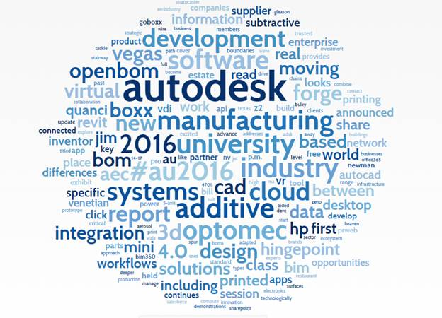

<head>
<meta http-equiv="Content-Type" content="text/html; charset=utf-8">
<link rel="stylesheet" type="text/css" href="bc.css">

<!--

-->
</head>

<!---

AU Day One, Keynote and DevLab #RevitAPI @AutodeskRevit #aec #bim #dynamobim @AutodeskForge #AU2016 #beyondthebuilding #lofab #DevLab

Today Autodesk University started up for real.
For me personally, the morning was occupied with booth preparation, the exciting keynote presentations and the afternoon DevLab Q&amp;A
&ndash; Autodesk University Keynote
&ndash; Jeff Kowalski, CTO
&ndash; Machine learning
&ndash; Generative design
&ndash; Virtual reality
&ndash; Robotic systems
&ndash; Exciting times
&ndash; Guest Speakers Christian Benimana and Anna Nixon
&ndash; Carl Bass, CEO
&ndash; DevLab
&ndash; Forge Pricing
&ndash; Cl3ver, Chaos Group and V-Ray...

-->

### AU Day One, Keynote and DevLab

Today Autodesk University started up for real.

For me personally, the morning was occupied with booth preparation, the exciting keynote presentations and the afternoon DevLab Q&amp;A:

- [Autodesk University Keynote](#2)
    - [Jeff Kowalski, CTO](#3)
        - [Machine learning](#3.1)
        - [Generative design](#3.2)
        - [Virtual reality](#3.3)
        - [Robotic systems](#3.4)
        - [Exciting times](#3.5)
    - [Guest Speakers Christian Benimana and Anna Nixon](#4)
    - [Carl Bass, CEO](#5)
- [DevLab](#6)
- [Forge Pricing](#7)
- [Cl3ver, Chaos Group and V-Ray](#8)

Here are my very minimally edited and cleaned-up personal short-hand notes of the day.

Take them or leave them  :-)

#### Autodesk University Keynote

A great DJane before and after the keynote itself.

Here are some snapshots of her, the presenters, the huge 8k+ audience and the vastness of the hall at the end:

#### Jeff Kowalski, CTO

My favourite presentation, as you can well understand if you paid attention to my recent ponderings
on [AlphaGo](http://thebuildingcoder.typepad.com/blog/2016/01/bim-programming-madrid-and-spanish-connectivity.html#7) and how
to [replace myself by artificial intelligence](http://thebuildingcoder.typepad.com/blog/2016/10/ai-edit-and-continue.html#3):

- [Machine learning](#3.1)
- [Generative design](#3.2)
- [Virtual reality](#3.3)
- [Robotic systems](#3.4)
- [Exciting times](#3.5)

#### Machine learning

Tic-tac-toe, chess, jeopardy, go.
Intuition.
Why is it doing what it is doing? The programmers don't know.
Something exponential is happening.
Two reasons: Unprecedented computing power plus computers teach themselves.
Intuition, hunches.
Transition from Spock to captain Kirk, logic to intuition.

#### Generative design.

Toronto office optimised using gd.
Prioritise personal relationships.
Create best possible experience.
Dreamcatcher.

#### Virtual reality

Immersive, more connected to your data, emotional, real.
Autodesk Live.
Collaborate.
Build a bridge of shared understanding.
Ultimate step: Designing in VR.

#### Robotic systems

Get things real, physical.
Nothing new, but team them up with machine learning and generative design...
technology is only one half of the equation.
Threat? Nope, wrong. Superpower.
Not *coming* for us, but coming *for* us.

#### Exciting times

The people doing the work... talent.
Stability &rarr; mobility.
Free-lancers.
Vastly larger pool of talented people
Bring them to any challenge you embrace.
Last point:
Human learning
Pressure on all of us to learn more quickly.
Don't stop your education.
Never stop learning.
Ongoing learning.

#### Guest Speakers Christian Benimana and Anna Nixon

Christian Benimana of
the [African Design Centre](https://massdesigngroup.org/work/research/african-design-centre) in
Rwanda, 'home of the best coffee in the world', architect, talked about 
[#beyondthebuilding](https://twitter.com/hashtag/beyondthebuilding), human dignity and [#lofab local fabrication](https://twitter.com/hashtag/lofab).

Anna Nixon, 16 years old, high school student, presented her experiences participating in
the [FIRST Robotics Competition](https://en.wikipedia.org/wiki/FIRST_Robotics_Competition).

She quotes John Dewey:

> We only think when confronted with a problem.

So give students a chance and a challenge: robots, [stem4girls](http://www.stem4girls.org), 
*Science Technology Engineering and Math for Girls*.

The most valuable asset to any worker: learn, and keep on learning.

#### Carl Bass, CEO

What we are doing today seemed impossible a few years back.

Reusable rocket.

Zarah Hadid is dead. Her building is being manufactured, not built.

Automobile industry in uproar for three reasons:

- Autonomous car
- Car sharing, ownership
- Electric or hybrid Powertrains

Scaring the crap out of the automobile industry.
Not a driving experience, a passenger experience.
Now its Uber.
Not pay by car, but pay by access.
Transportation as a service, from a range of providers.
Google car short range, fast Mercedes for the long range motorway.

Let go of the old system, embrace the new.
How?
How to transition?
Experiment.
Build a small team and try it out, gather experience.
Be proactive.
Do not be afraid of new ideas.
The automobile is just one example of an industry faced with three serious challenges today.
Disruption can be the source of new value.
This might make your company great in the future.
Autodesk is facing disruptions, e.g., machine learning.
It can be used to design new software.
Previously it was all about deterministic software programming, and speeding it up.
Now create software that customises itself.

Design Graph in A360: 
If you have a bolt in your design, it can show you all the fitting washers and nuts.

CADCAM driven by machine learning to automate machining speeds.
An algorithm figures out what took each machinists years of experience to learn.
AI can learn from existing digital designs.
Tools can learn from experiences.

We are not building tools for individuals.
Now we build tools for teams.
Make teams more productive.
Collaborate well.
Respond together to a changing environment.

#### DevLab

Developers can come and ask questions.

Here is my personal shorthand mini-summary of the Q&amp;A that I fielded myself:

<b>[Q]</b> How to collapse a tree view, specifically the Revit project browser?

<b>[A]</b> Spy++ and `EnumChildWindows`:

- Use Spy++ to discover how to identify the tree view container window:
    - `C:\Program Files (x86)\Microsoft Visual Studio 14.0\Common7\Tools\spyxx.exe`
- Use `EnumChildWindows` with the Revit window handle to find the window containing the tree view,
cf. how to [collapse 'My Computer' in tree view of explorer.exe by program](https://social.msdn.microsoft.com/Forums/en-US/31466763-4f0d-4516-a58a-13024d54f2c0/collapse-my-computer-in-tree-view-of-explorerexe-by-program): ... to collapse the treeview, send the `TVM_EXPAND` Message with `wParam` set to `TVE_COLLAPSE` message to the `SysTreeView32` which is the tree view control, with `lParam` set to the node handle.
 
<b>[Q]</b> When printing from Revit, how can I determine whether the file creation really fully completed?

<b>[A]</b> Check out [how can I detect via Windows API when a file is being written to a folder?](https://www.quora.com/How-can-I-detect-via-Windows-API-when-a-file-is-being-written-to-a-folder).

<b>[Q]</b> I am trying to find the centre line reference of a sprinkler family, but can’t always do so.  My first question: if you do get a reference of an element, how do you get the geometry associated with that element?

<b>[A]</b> Use `Element.GetGeometryObjectFromReference` like this:

<pre class="code">
  Reference&nbsp;r&nbsp;=&nbsp;null;
  Document&nbsp;doc&nbsp;=&nbsp;null;
  Element&nbsp;e&nbsp;=&nbsp;doc.GetElement(&nbsp;r.ElementId&nbsp;);
  GeometryObject&nbsp;geo&nbsp;=&nbsp;e.GetGeometryObjectFromReference(&nbsp;r&nbsp;);
</pre>

However, please note that `GetGeometryObjectFromReference` is not foolproof, especially for references to datums,
We have a pending wish list item `REVIT-102253` to provide more direct access to the common references stored in families.
There are also several Revit Idea Station requests related to access to references. 

<b>[Q]</b> How can I refresh the graphics after updating the element from a modeless WPF form?

<b>[A]</b> Check out these two posts on refreshing graphics:

- [2011-07](http://thebuildingcoder.typepad.com/blog/2011/07/refresh-element-graphics-display.html)
- [2014-06](http://thebuildingcoder.typepad.com/blog/2014/06/refresh-element-graphics-display.html)

You should also explore The Building Coder topic
group [5.33](http://thebuildingcoder.typepad.com/blog/about-the-author.html#5.33) on
the [need to regenerate](http://thebuildingcoder.typepad.com/blog/about-the-author.html#5.33).

<b>[Q]</b> Do you have any suggestions for an open source IFC toolkit?

<b>[A]</b> Yes, please refer to
the [y GeometryGymIFC Open Source C# Library](http://thebuildingcoder.typepad.com/blog/2016/07/ifc-import-and-open-source.html#4).

<b>[Q]</b> I have a Revit API wish list item. How can I ensure that it is given the attention it deserves?

<b>[A]</b> Submit it to the [Revit Idea Station](http://forums.autodesk.com/t5/revit-ideas/idb-p/302/label-name/api/tab/most-recent),

<b>[Q]</b> I am creating a Revit plugin to bulk upgrade old version RVT files to new version. I need to run this process in the background so that other tasks can be performed during this upgrade process. Can you please guide us to how to run this upgrade process in the background?

<b>[A]</b> The topic of driving Revit from outside or other background threads has been discussed extensively in the [Revit API discussion forum](http://forums.autodesk.com/t5/revit-api/bd-p/160) and in the posts listed in The Building Coder topic group on [Idling and External events for modeless access and driving Revit from outside](http://thebuildingcoder.typepad.com/blog/about-the-author.html#5.28). Please explore that material in some depth to begin with. I would recommend starting at the end, since the last two entries in that topic list provide a good overview. Regarding the bulk upgrade, you will probably also be interested in taking a look at Saikat Bhattacharya's [File Upgrader add-in](http://thebuildingcoder.typepad.com/blog/2011/06/file-upgrader-plugin-of-the-month.html). It may be outdated, though. It was originally written for Revit 2012 and updated several later Revit versions. For a while, it was also available from the Autodesk Exchange AppStore. The last version that I have stored locally is [FileUpgrader_2015-08-27.zip](zip/FileUpgrader_2015-08-27.zip).

<b>[Q]</b> I am interested in tracking and logging element modification.

<b>[A]</b> Check out the posts on [tracking element modification](http://thebuildingcoder.typepad.com/blog/2016/01/tracking-element-modification.html) and [TrackChangesCloud](http://thebuildingcoder.typepad.com/blog/2016/03/implementing-the-trackchangescloud-external-event.html).

<b>[Q]</b> Do you have any suggestions on using extensible storage in a worksharing environment?

<b>[A]</b> Yes. They are included in The Building Coder topic
group [5.23](http://thebuildingcoder.typepad.com/blog/about-the-author.html#5.23)
on [extensible storage](http://thebuildingcoder.typepad.com/blog/about-the-author.html#5.23).

#### Forge Pricing

As Jim Quanci announced yesterday at
the [DevDay conference general session](http://thebuildingcoder.typepad.com/blog/2016/11/devday-conference-at-autodesk-university.html#2),
[Forge subscriptions](https://developer.autodesk.com/en/pricing) successfully launched.

You can now take your apps to production
with [flexible cloud credits and more cost-efficient services](http://adndevblog.typepad.com/cloud_and_mobile/2016/11/forge-update-take-your-apps-to-production-flexible-cloud-credits-and-more-cost-efficient-services.html).

- Based on community feedback, Forge pricing​ is based on cloud credits redeemable for use on Forge API calls, simplified storage and more cost effective platform services.
- New Forge registrants will automatically be signed up for a free trial with a set number of cloud credits for Forge that expire after 12 months.
- Existing Forge registrants can continue to use Forge for free until their account is converted to a free trial beginning December 9.
- Developers in US and Europe can now subscribe to Forge online and receive a set number of cloud credits each month applicable to Forge APIs and services.
- Anyone with expected usage beyond the subscription limits should contact Autodesk Forge sales.    

#### Cl3ver, Chaos Group and V-Ray

[Chaos Group](https://www.chaosgroup.com)
create [V-Ray for Revit](https://www.chaosgroup.com/vray/revit) and
are now partnering with the AEC presentation start-up [CL3VER](https://www.cl3ver.com).
For more details, please refer to the [press release](http://www.prweb.com/releases/2016/11/prweb13851266.htm).

