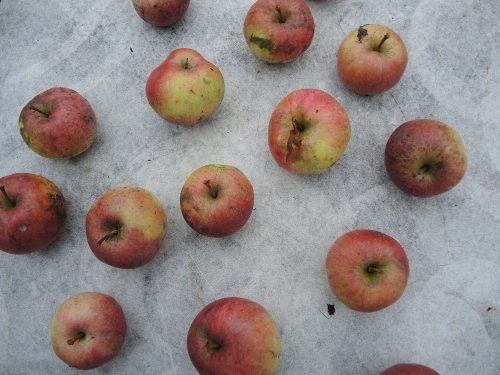

<head>
<meta http-equiv="Content-Type" content="text/html; charset=utf-8">
<link rel="stylesheet" type="text/css" href="bc.css">

<!--

-->
</head>

<!---

12375256 [Event to run a IExternalCommand]
http://forums.autodesk.com/t5/revit-api-forum/event-to-run-a-iexternalcommand/m-p/6692479

Using Other Events to Execute Add-In Code #RevitAPI @AutodeskRevit #aec #bim #dynamobim @AutodeskForge

The Revit API is very simple.
It is entirely event driven.
Any and every use of the Revit API requires a valid API context.
The most common and obvious way to get into a valid Revit API context &ndash; and the most commonly used event &ndash; is the one to launch an external command, which calls the <code>IExternalCommand</code> <code>Execute</code> handler method.
Other important ones to be aware of are <code>ApplicationInitialized</code> and <code>DialogBoxShowing</code>, unconnected with any external command at all...

&ndash; 

-->

### Using Other Events to Execute Add-In Code

The Revit API is very simple.

It is entirely event driven.

Any and every use of the Revit API requires a valid API context.

The most common and obvious way to get into a valid Revit API context &ndash; and the most commonly used event &ndash; is the one to launch an external command, which calls the `IExternalCommand` `Execute` handler method.

Other important ones to be aware of are `ApplicationInitialized` and `DialogBoxShowing`, unconnected with any external command at all, as you can see below.

Here is an interesting discussion exploring some options from
the [Revit API discussion forum](http://forums.autodesk.com/t5/revit-api/bd-p/160) thread
searching for an [event to run an IExternalCommand](http://forums.autodesk.com/t5/revit-api-forum/event-to-run-a-iexternalcommand/m-p/6692479):

**Question:** Wondering if you can assist with an issue I'm having that I just can't seem to solve.

Would be nice just to know if what I am trying to do is possible or not.
 
I have been playing around with the events within an `ExternalApplication` and I have got these to work fine (i.e. using the `DocumentCreated` event to flash up a "HelloWorld" task dialog when a document is created)

I have also written a few basic external commands with buttons on the addin ribbon that work fine.
 
My issue is: how do I get an event to fire off an external command instead of having to use a button?
 
I am basically trying to get the event to trigger off the command and make some changes to the document and so I need the current document which I don't believe I can access within the external application.
 
I have read all of the event samples in the SDK but still can't work it out and I'm sure it should be really simple.
 
**Answer by Matt:** I'm pretty sure that's what [PostCommand](http://www.revitapidocs.com/2017/b0df464d-1733-ea9e-ac40-399fa9c9a037.htm) is for.
 
**Answer by Erik:** Matt's response is correct and valid for all buttons in Revit (almost), but if you created the external command, you can just create an instance of the class and run the `Execute` method. That's even simpler.

**Response:** I am trying to do what you suggest, "just create an instance of the class and run the `Execute` method", but that's where I am getting stuck.

In my external app I am trying to execute the command using 

<pre class="code">
  Command&nbsp;cmd&nbsp;=&nbsp;new&nbsp;Command();
  &#99;md.Execute();
</pre>

(Editor's note on Typepad crash: I was forced to replace the character 'c' in the last line above by the HTML escape code `&#99;` before I was able to post this.)

However, that understandably gives me the error

<pre>
Error CS7036 There is no argument given that corresponds to the required formal parameter 'commandData' of 'Command.Execute(ExternalCommandData, ref string, ElementSet)'
</pre>

Could you please expand on how I would use the `Execute` method from an external application?

**Answer by Gonçalo:** Mike, you need a handler for the event, and the `IExternaCommand.Execute` method does not have the same parameters.

You can fake the parameters (commanddata, etc.) using reflection and an adapter; but that seems awkward.

My suggestion is just to implement a method to handle the event you are after. After all, the sender is usually the application.

**Answer by Matt:** I think Erik was suggesting that if you wrote the external command, you could call the same function that you call in the external command.
 
`PostCommand` would be the best fit, if you can apply it. Why don't you tell us exactly what you're trying to do?
 
**Answer by Erik:** Maybe I read your message a bit fast. I missed the fact that you were in an external application context, I automatically thought you were in `IExternalCommand`; then you could just pass the `ExternalCommandData` object forward. 

But to solve your problem you could just refactor your code a bit to get an overload for the `Execute` method that takes a `UIApplication` object. The `Execute` method in the `IExternalCommand` interface seems a bit obsolete anyway.

Also, another thing to bear in mind here is that you should subscribe to the `ApplicationInitialized` event if you are to do anything with documents.

Here is an example code snippet:

<pre class="code">
public&nbsp;class&nbsp;Command&nbsp;:&nbsp;IExternalCommand
{
&nbsp;&nbsp;public&nbsp;Result&nbsp;Execute(
&nbsp;&nbsp;&nbsp;&nbsp;ExternalCommandData&nbsp;commandData,
&nbsp;&nbsp;&nbsp;&nbsp;ref&nbsp;string&nbsp;message,
&nbsp;&nbsp;&nbsp;&nbsp;ElementSet&nbsp;elements&nbsp;)
&nbsp;&nbsp;{
&nbsp;&nbsp;&nbsp;&nbsp;return&nbsp;Execute(&nbsp;commandData.Application&nbsp;);
&nbsp;&nbsp;}
 
&nbsp;&nbsp;public&nbsp;Result&nbsp;Execute(&nbsp;UIApplication&nbsp;uiapp&nbsp;)
&nbsp;&nbsp;{
&nbsp;&nbsp;&nbsp;&nbsp;//Do&nbsp;all&nbsp;sorts&nbsp;of&nbsp;shiny&nbsp;stuff&nbsp;with&nbsp;your&nbsp;command.&nbsp;
&nbsp;&nbsp;&nbsp;&nbsp;return&nbsp;Result.Succeeded;
&nbsp;&nbsp;}
}
public&nbsp;class&nbsp;RevitStartup&nbsp;:&nbsp;IExternalApplication
{
&nbsp;&nbsp;public&nbsp;Result&nbsp;OnShutdown(
&nbsp;&nbsp;&nbsp;&nbsp;UIControlledApplication&nbsp;application&nbsp;)
&nbsp;&nbsp;{
&nbsp;&nbsp;&nbsp;&nbsp;return&nbsp;Result.Succeeded;
&nbsp;&nbsp;}
 
&nbsp;&nbsp;public&nbsp;Result&nbsp;OnStartup(
&nbsp;&nbsp;&nbsp;&nbsp;UIControlledApplication&nbsp;application&nbsp;)
&nbsp;&nbsp;{
&nbsp;&nbsp;&nbsp;&nbsp;application.ControlledApplication
&nbsp;&nbsp;&nbsp;&nbsp;&nbsp;&nbsp;.ApplicationInitialized
&nbsp;&nbsp;&nbsp;&nbsp;&nbsp;&nbsp;&nbsp;&nbsp;+=&nbsp;ControlledApplication_ApplicationInitialized;
 
&nbsp;&nbsp;&nbsp;&nbsp;return&nbsp;Result.Succeeded;
&nbsp;&nbsp;}
 
&nbsp;&nbsp;private&nbsp;void&nbsp;ControlledApplication_ApplicationInitialized(
&nbsp;&nbsp;&nbsp;&nbsp;object&nbsp;sender,
&nbsp;&nbsp;&nbsp;&nbsp;ApplicationInitializedEventArgs&nbsp;e&nbsp;)
&nbsp;&nbsp;{
&nbsp;&nbsp;&nbsp;&nbsp;var&nbsp;command&nbsp;=&nbsp;new&nbsp;Command();
 
&nbsp;&nbsp;&nbsp;&nbsp;//I&nbsp;never&nbsp;remember&nbsp;if&nbsp;the&nbsp;sender&nbsp;is&nbsp;Application&nbsp;or&nbsp;UIApplication
 
&nbsp;&nbsp;&nbsp;&nbsp;if(&nbsp;sender&nbsp;is&nbsp;UIApplication&nbsp;)
&nbsp;&nbsp;&nbsp;&nbsp;&nbsp;&nbsp;command.Execute(&nbsp;sender&nbsp;as&nbsp;UIApplication&nbsp;);
&nbsp;&nbsp;&nbsp;&nbsp;else
&nbsp;&nbsp;&nbsp;&nbsp;&nbsp;&nbsp;command.Execute(&nbsp;new&nbsp;UIApplication(&nbsp;sender&nbsp;as&nbsp;Application&nbsp;)&nbsp;);
&nbsp;&nbsp;}
}
</pre>

This will also work even if you don't register a button.

And to finish off, like Mike said: tell us why you want to achieve and maybe we can find an even easier way of doing it =)
 
**Response:** Many, many thanks for all your replies.

Although none of them answered the question they did help me realise that what I was trying to do was the wrong way to approach things and that I actually didn't need the external command.
 
My reason for thinking I needed the external command was trying to get the `Document` but thanks to Erik's post I found I could get the `UIApplication` from the sender and that this then let me access the document. So now I am able to run all of my code in the external application!
 
Again, many thanks for all your assistance.
 
To finalise, my end result was to register a dialog event on startup and shutdown and then:
 
<pre class="code">
  public&nbsp;void&nbsp;handle_DialogBoxShowing(
  &nbsp;&nbsp;object&nbsp;sender,
  &nbsp;&nbsp;DialogBoxShowingEventArgs&nbsp;args&nbsp;)
  {
  &nbsp;&nbsp;if(&nbsp;args.DialogId&nbsp;==&nbsp;&quot;Dialog_Revit_NewProject&quot;&nbsp;)
  &nbsp;&nbsp;{
  &nbsp;&nbsp;&nbsp;&nbsp;UIApplication&nbsp;uiapp&nbsp;=&nbsp;sender&nbsp;as&nbsp;UIApplication;
  &nbsp;&nbsp;&nbsp;&nbsp;Application&nbsp;app&nbsp;=&nbsp;uiapp.Application;
   
  &nbsp;&nbsp;//&nbsp;etc&nbsp;etc&nbsp;etc
</pre>

Many thanks to Mike, Matt, Erik and Gonçalo for raising and helping to solve this!

