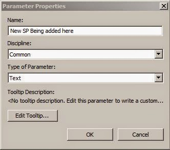

<head>
<meta http-equiv="Content-Type" content="text/html; charset=utf-8">
<link rel="stylesheet" type="text/css" href="bc.css">

<!--

-->
</head>

<!---

Parameter Definition Overview #RevitAPI @AutodeskRevit #aec #bim #dynamobim @AutodeskForge

I am happy to present a pretty comprehensive overview and explanation of the process of defining a shared parameter by Scott Conover.
Question: What do I need to do to programmatically create a shared parameter? I would like to set the <code>SetAllowVaryBetweenGroups</code> flag on it.
Answer: You create the details needed to define a shared parameter from <code>ExternalDefinition</code>.
Existing shared parameter file entries can be read to become an <code>ExternalDefinition</code> in your code, or you can create a new entry in the current shared parameter file using the <code>DefinitionGroup.Create</code> method...

-->

### Parameter Definition Overview

We have repeatedly discussed all kinds of different aspects
of [Revit element parameters](http://thebuildingcoder.typepad.com/blog/parameters),
but not put together
a [topic group](http://thebuildingcoder.typepad.com/blog/about-the-author.html#5) for them yet.

Today I am happy to present a pretty comprehensive overview and explanation of the process of defining a shared parameter by none less than Scott Conover himself, Senior Revit Engineering Manager:

**Question:** What do I need to do to programmatically create a shared parameter?
I would like to set the `SetAllowVaryBetweenGroups` flag on it. 

**Answer:** You create the details needed to define a shared parameter from `ExternalDefinition`.
Existing shared parameter file entries can be read to become an `ExternalDefinition` in your code, or you can create a new entry in the current shared parameter file using the `DefinitionGroup.Create` method.

The sample code listed in the Revit API help file `RevitAPI.chm` or the online Revit API docs
under [InstanceBinding class](http://www.revitapidocs.com/2017/7978cb57-0a48-489e-2c8f-116fa2561437.htm) shows
this process best.

Here is part of that sample snippet:

<pre class="code">
public&nbsp;bool&nbsp;SetNewParameterToInstanceWall(
&nbsp;&nbsp;UIApplication&nbsp;app,
&nbsp;&nbsp;DefinitionFile&nbsp;myDefinitionFile&nbsp;)
{
&nbsp;&nbsp;//&nbsp;Create&nbsp;a&nbsp;new&nbsp;group&nbsp;in&nbsp;the&nbsp;shared&nbsp;parameters&nbsp;file
&nbsp;&nbsp;DefinitionGroups&nbsp;myGroups&nbsp;=&nbsp;myDefinitionFile.Groups;
&nbsp;&nbsp;DefinitionGroup&nbsp;myGroup&nbsp;=&nbsp;myGroups.Create(&nbsp;&quot;MyParameters&quot;&nbsp;);
 
&nbsp;&nbsp;//&nbsp;Create&nbsp;an&nbsp;instance&nbsp;definition&nbsp;in&nbsp;definition&nbsp;group&nbsp;MyParameters
&nbsp;&nbsp;ExternalDefinitionCreationOptions&nbsp;option
&nbsp;&nbsp;&nbsp;&nbsp;=&nbsp;new&nbsp;ExternalDefinitionCreationOptions(
&nbsp;&nbsp;&nbsp;&nbsp;&nbsp;&nbsp;&quot;Instance_ProductDate&quot;,&nbsp;ParameterType.Text&nbsp;);
 
&nbsp;&nbsp;//&nbsp;Don&#39;t&nbsp;let&nbsp;the&nbsp;user&nbsp;modify&nbsp;the&nbsp;value,&nbsp;only&nbsp;the&nbsp;API
&nbsp;&nbsp;option.UserModifiable&nbsp;=&nbsp;false;
 
&nbsp;&nbsp;//&nbsp;Set&nbsp;tooltip
&nbsp;&nbsp;option.Description&nbsp;=&nbsp;&quot;Wall&nbsp;product&nbsp;date&quot;;
&nbsp;&nbsp;Definition&nbsp;myDefinition_ProductDate
&nbsp;&nbsp;&nbsp;&nbsp;=&nbsp;myGroup.Definitions.Create(&nbsp;option&nbsp;);

  . . .
</pre>

The return from `DefinitionGroup.Create` is an `ExternalDefinition`, even though the type declared is the parent class.

Once you have an `ExternalDefinition`, you add it to the document.

There are several ways:

1. Use `InstanceBinding` as shown in that sample.
2. Use `FamilyManager.AddParameter` to add the parameter to a family.
3. Use `FamilyManager.ReplaceParameter` to replace a family parameter with the shared one.
4. Use `SharedParameterElement.Create` to create the element that represents the parameter without binding it to any categories.

There are also some `RebarShape` related utilities which I would not recommend for general usage but might be OK for rebar-specific code.

Once the parameter is in the document, it has an `InternalDefinition`.

The best ways to get it:

1. If you have the `ParameterElement` from #4 you can use `ParameterElement.GetDefinition`.
2. If you have the GUID (which you should, since it is provided by the `ExternalDefinition`), you can use `SharedParameterElement.Lookup` followed by `ParameterElement.GetDefinition`.
3. If you have an instance of an element whose category has this parameter bound, get the `Parameter` and use `Parameter.Definition`.

Once you have the `InternalDefinition`, you can access the vary across groups option as well as other things.
You can also use an `InternalDefintion` for adding and removing `InstanceBindings` to categories.

Many thanks to Scott for this nice comprehensive summary and overview!

####Addemdum

Joshua Lumley pointed out some possible enhancements
in [his two](http://thebuildingcoder.typepad.com/blog/2016/12/parameter-definition-overview.html#comment-3079825547)
[comments](http://thebuildingcoder.typepad.com/blog/2016/12/parameter-definition-overview.html#comment-3079829813) below:

To run the code more than twice I added:

<pre class="code">
&nbsp;&nbsp;bool&nbsp;dgMatchFound&nbsp;=&nbsp;false;
&nbsp;&nbsp;foreach(&nbsp;DefinitionGroup&nbsp;dg&nbsp;in&nbsp;myGroups&nbsp;)
&nbsp;&nbsp;{
&nbsp;&nbsp;&nbsp;&nbsp;if(&nbsp;dg.Name&nbsp;==&nbsp;myGroupName&nbsp;)
&nbsp;&nbsp;&nbsp;&nbsp;{
&nbsp;&nbsp;&nbsp;&nbsp;&nbsp;&nbsp;dgMatchFound&nbsp;=&nbsp;true;
&nbsp;&nbsp;&nbsp;&nbsp;&nbsp;&nbsp;myGroup&nbsp;=&nbsp;dg;
&nbsp;&nbsp;&nbsp;&nbsp;}
&nbsp;&nbsp;}
&nbsp;&nbsp;if(&nbsp;dgMatchFound&nbsp;==&nbsp;false&nbsp;)
&nbsp;&nbsp;{
&nbsp;&nbsp;&nbsp;&nbsp;myGroup&nbsp;=&nbsp;myGroups.Create(&nbsp;myGroupName&nbsp;);
&nbsp;&nbsp;}
</pre>

and

<pre class="code">
&nbsp;&nbsp;bool&nbsp;dMatchFound&nbsp;=&nbsp;false;
 
&nbsp;&nbsp;foreach(&nbsp;Definition&nbsp;d&nbsp;in&nbsp;myGroup.Definitions&nbsp;)
&nbsp;&nbsp;{
&nbsp;&nbsp;&nbsp;&nbsp;if(&nbsp;d.Name&nbsp;==&nbsp;newParameterName&nbsp;)
&nbsp;&nbsp;&nbsp;&nbsp;{
&nbsp;&nbsp;&nbsp;&nbsp;&nbsp;&nbsp;dMatchFound&nbsp;=&nbsp;true;
&nbsp;&nbsp;&nbsp;&nbsp;&nbsp;&nbsp;myDefinition_ProductDate&nbsp;=&nbsp;d;
&nbsp;&nbsp;&nbsp;&nbsp;}
&nbsp;&nbsp;}
&nbsp;&nbsp;if(&nbsp;!dMatchFound&nbsp;)
&nbsp;&nbsp;{
&nbsp;&nbsp;&nbsp;&nbsp;myDefinition_ProductDate
&nbsp;&nbsp;&nbsp;&nbsp;&nbsp;&nbsp;=&nbsp;myGroup.Definitions.Create(&nbsp;option&nbsp;);
&nbsp;&nbsp;}
</pre>

I called it like this:

<pre class="code">
&nbsp;&nbsp;DefinitionFile&nbsp;defFile&nbsp;
&nbsp;&nbsp;&nbsp;&nbsp;=&nbsp;GetOrCreateSharedParamsFile(&nbsp;
&nbsp;&nbsp;&nbsp;&nbsp;&nbsp;&nbsp;ActiveUIDocument.Application.Application&nbsp;);
 
&nbsp;&nbsp;bool&nbsp;AddParameterResult&nbsp;
&nbsp;&nbsp;&nbsp;&nbsp;=&nbsp;SetNewParameterToInstanceWall(&nbsp;
&nbsp;&nbsp;&nbsp;&nbsp;&nbsp;&nbsp;ActiveUIDocument.Application,&nbsp;defFile&nbsp;);
 
&nbsp;&nbsp;TaskDialog.Show(&nbsp;&quot;Did&nbsp;it&nbsp;work&quot;,&nbsp;
&nbsp;&nbsp;&nbsp;&nbsp;AddParameterResult.ToString()&nbsp;);
</pre>

Many thanks to Josh for the helpful usage hints!
