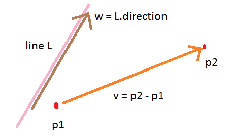
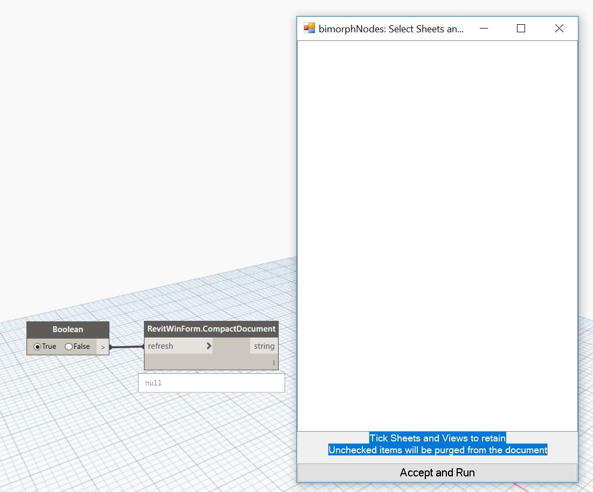
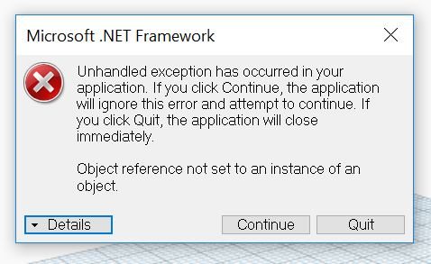
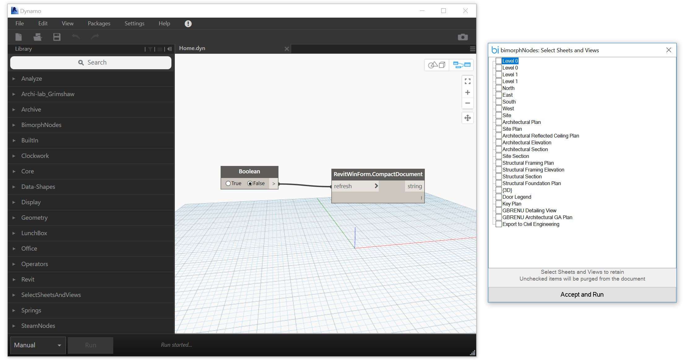
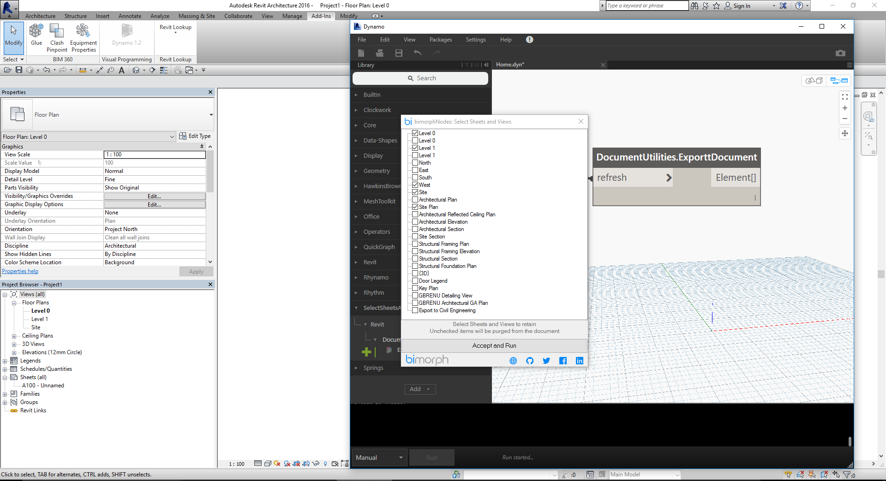
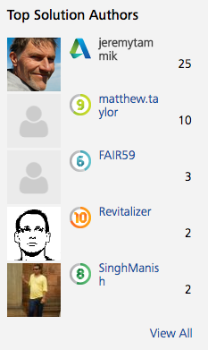

<head>
<meta http-equiv="Content-Type" content="text/html; charset=utf-8">
<link rel="stylesheet" type="text/css" href="bc.css">

<!--

-->
</head>

<!---

https://forums.autodesk.com/t5/revit-api-forum/listing-all-views-in-a-project-on-a-winform-throwing-an/m-p/6786228

http://forums.autodesk.com/t5/revit-api-forum/revit-command-line-switches/m-p/6782154

http://forums.autodesk.com/t5/revit-api-forum/distance-between-two-points-xyz-along-a-given-vector/m-p/6747568
  point distance along a vector
  /a/doc/revit/tbc/git/a/img/point_dist_along_vector.png 

 #RevitAPI @AutodeskRevit #aec #bim #dynamobim @AutodeskForge

I continued my activity in the Revit API discussion forum and had lots of interesting discussions there.
One recent thread caused me to bring up a favourite topic of mine, on keeping things simple.
I'll also mention two other less recent recurring questions
&ndash; Distance between two points in a specific direction
&ndash; Revit command-line switches
&ndash; Keeping things simple with the Revit API
&ndash; Dino pondering lengthening days...

- [RevitLookup spot dimension and Escape](#5)

-->

### Distances, Switches, Kiss-ing and a Dino

I continued my activity in 
the [Revit API discussion forum](http://forums.autodesk.com/t5/revit-api/bd-p/160) and 
had lots of interesting discussions there.

One recent thread caused me to bring up a favourite topic of mine, on keeping things simple.

I'll also mention two other less recent recurring questions &ndash; one of them partly because I went to the effort of creating a nice figure illustrating it &nbsp; :-)

- [Distance between two points in a specific direction](#2)
- [Revit command-line switches](#3)
- [Keeping things simple with the Revit API](#4)
- [Dino pondering lengthening days](#5)

####Distance Between Two Points in a Specific Direction

This question on determining 
the [distance between two points along a given vector](http://forums.autodesk.com/t5/revit-api-forum/distance-between-two-points-xyz-along-a-given-vector/m-p/6747568) has
come up several times in the past, so let's capture it here for future reference:

**Question:** Does the Revit API provide a method of returning the distance between two points along a given vector?
 
I realize there are ways to manually do this, but I was wondering if the Revit API had something natively to make my code a little cleaner.

**Answer 1:** You can use a `Autodesk.Revit.DB.Line`. It provides a double `Length` property that it inherits from `Curve`.

**Answer 2:** Where `pointA` and `pointB` are `XYZ` points:

<pre class="code">
  dim&nbsp;distance&nbsp;as&nbsp;double&nbsp;=&nbsp;pointA.DistanceTo(pointB)
</pre>

The XYZ class also has `.multiply` and `.divide` functions if you want to go a proportion of that distance along a vector.

**Answer 3:** If you need the distance of the points projected onto the given vector:
 
<pre class="code">
&nbsp;&nbsp;XYZ&nbsp;p1&nbsp;=&nbsp;new&nbsp;XYZ(&nbsp;0,&nbsp;10,&nbsp;0&nbsp;);
&nbsp;&nbsp;XYZ&nbsp;p2&nbsp;=&nbsp;new&nbsp;XYZ(&nbsp;10,&nbsp;60,&nbsp;0&nbsp;);
&nbsp;&nbsp;XYZ&nbsp;direction&nbsp;=&nbsp;new&nbsp;XYZ(&nbsp;30,&nbsp;60,&nbsp;0&nbsp;);
&nbsp;&nbsp;double&nbsp;distance&nbsp;=&nbsp;direction.Normalize().DotProduct(&nbsp;p1.Subtract(&nbsp;p2&nbsp;)&nbsp;);
&nbsp;&nbsp;distance&nbsp;=&nbsp;Math.Abs(&nbsp;distance );
</pre>

**Answer 4:** I would award the main prize and cigar to answer 3 above.
 
Partly for providing what I guess might be the right answer.
 
Above all for guessing what may or may not be the right intended question.
 
Is this an accurate description of your needs?

**Question rephrased:** Given points `p1` and `p2`, what is the distance between them, measured along the line `L`?

If that is indeed what you need, you are actually not asking about the distance between the points at all.
 
These two points, together with the direction `w` of `L`, define two planes.
 
You are asking about the distance between those two planes.
 
Are you?
 
If so, answer 3 above is absolutely accurate and can be reformulated as:
 
Answer:
 
<pre>
  v = p2 - p1
  w = L.direction.normalise
  distance_along_w = v.dotProduct( w )
</pre>

Unfortunately, the Revit geometry API is not full-fledged and therefore lacks a method to return the distance between two planes.
 
Otherwise, that would probably provide an even more straightforward path.
 
The suggested one is very direct and efficient, though, and hard to beat in those respects.
 
I hope this helps and that we collectively succeeded at nailing your intention.

####
**Clarification:** Why can you not simply use the built-in `XYZ.DistanceTo` method like this?

<pre class="code">
  double rDist = p1.DistanceTo( p2 );
</pre>

Because `DistanceTo` returns the shortest distance between two points, not the distance along a given direction.
The latter is actually not the distance between two points, but the distance between two planes.

**Response:** Yes, you are absolutely correct in your initial assumption: I was looking for the distance between two planes, my initial question was a very round-about way of getting to that point. Your answers gave me exactly what I was looking for. Putting together a small routine utilising the information I was given gave me A) a nice, recallable routine, B) something that I can tailor to my needs. I realise that measuring between planes isn't something 'native' to Revit, and making my own routines has the benefit of allowing me to make methods for simple functions that I can expand and modify as needed.

####Revit Command-Line Switches

Another recurring question is
on [Revit command line switches](http://forums.autodesk.com/t5/revit-api-forum/revit-command-line-switches/m-p/6782154),
which Matt Taylor just summarised succinctly:

These are the switches I'm aware of and tested in Revit 2017:
 
- *no switch* &lt;fully qualified path of file to open&gt; &ndash; Open a Revit file. Seems to work with a template or project file. Haven't tried a family. I've been doing this since Revit 2011, though I put `/o` in there so I know what it is, though that seems to be ignored.
- *no switch* &lt;fully qualified path of journal file&gt; &ndash; Replay a journal file.
- `/language` &lt;language code such as ENU&gt; &ndash; Set user interface language.
- `/max` &ndash; Start the session maximised.
- `/min` &ndash; Start the session minimised.
- `/nosplash` &ndash; Suppress the splash screen.
- `/viewer` &ndash; Launch Revit in viewer mode.
 
Many thanks to Matt and [Callumf](https://forums.autodesk.com/t5/user/viewprofilepage/user-id/3964019) for providing this list!

####Keeping Things Simple with the Revit API

The most interesting issue today is 
on [listing all views in a project on a Winform throwing an exception](http://forums.autodesk.com/t5/revit-api-forum/listing-all-views-in-a-project-on-a-winform-throwing-an/m-p/6786228) providing 
ma an opportunity 
to [wax philosophical](http://english.stackexchange.com/questions/21673/is-there-any-other-way-you-can-wax-as-you-do-when-you-wax-philosophical) on 
keeping things simple, although Rudi 'Revitalizer' provided the more succinct and accurate fix to the underlying problem:

**Question:** I am attempting to create a WinForm which lists all the views in the project as a viewTree. The WinForm run command is then packaged into a Dynamo ZeroTouch node, however the views are not displayed when the form launches, and when I relaunch the form I get an error that line 53 (the `foreach` statement that attempts to use the view name to populate the viewTree) is "not set to an instance of an object". This is my first attempt to raise and consume events and I've done everything I can to get it to work; what is the cause of this error?
 
The form successfully launches via the dynamo node:

 
The exception:

The code:

<pre class="code"> 
using&nbsp;System;
using&nbsp;System.Collections.Generic;
using&nbsp;System.ComponentModel;
using&nbsp;System.Data;
using&nbsp;System.Drawing;
using&nbsp;System.Linq;
using&nbsp;System.Text;
using&nbsp;System.Threading.Tasks;
using&nbsp;System.Windows.Forms;
using&nbsp;Autodesk.DesignScript.Runtime;
using&nbsp;Autodesk.DesignScript.Interfaces;
using&nbsp;Autodesk.DesignScript.Geometry;
using&nbsp;Autodesk.Revit.DB;
using&nbsp;Autodesk.Revit.DB.Architecture;
using&nbsp;Autodesk.Revit.UI;
using&nbsp;Autodesk.Revit.UI.Selection;
using&nbsp;Autodesk.Revit.ApplicationServices;
using&nbsp;Autodesk.Revit.Attributes;
using&nbsp;RevitServices.Persistence;
using&nbsp;RevitServices.Transactions;
using&nbsp;Revit.Elements;
using&nbsp;Revit.GeometryConversion;
 
namespace&nbsp;SelectSheetsAndViews
{
&nbsp;&nbsp;///&nbsp;&lt;summary&gt;&nbsp;The&nbsp;form&nbsp;class&lt;/summary&gt;
&nbsp;&nbsp;public&nbsp;partial&nbsp;class&nbsp;FormRevitSelect&nbsp;:&nbsp;System.Windows.Forms.Form
&nbsp;&nbsp;{
&nbsp;&nbsp;&nbsp;&nbsp;public&nbsp;FormRevitSelect()
&nbsp;&nbsp;&nbsp;&nbsp;{
&nbsp;&nbsp;&nbsp;&nbsp;&nbsp;&nbsp;InitializeComponent();
&nbsp;&nbsp;&nbsp;&nbsp;}
 
&nbsp;&nbsp;&nbsp;&nbsp;private&nbsp;void&nbsp;DynamoTreeListSelect_Activated(&nbsp;object&nbsp;sender,&nbsp;System.EventArgs&nbsp;e&nbsp;)
&nbsp;&nbsp;&nbsp;&nbsp;{
 
&nbsp;&nbsp;&nbsp;&nbsp;}
 
&nbsp;&nbsp;&nbsp;&nbsp;private&nbsp;void&nbsp;textBox1_TextChanged(&nbsp;object&nbsp;sender,&nbsp;EventArgs&nbsp;e&nbsp;)
&nbsp;&nbsp;&nbsp;&nbsp;{
 
&nbsp;&nbsp;&nbsp;&nbsp;}
 
&nbsp;&nbsp;&nbsp;&nbsp;private&nbsp;void&nbsp;tableLayoutPanel1_Paint(&nbsp;object&nbsp;sender,&nbsp;PaintEventArgs&nbsp;e&nbsp;)
&nbsp;&nbsp;&nbsp;&nbsp;{
 
&nbsp;&nbsp;&nbsp;&nbsp;}
 
&nbsp;&nbsp;&nbsp;&nbsp;private&nbsp;void&nbsp;Form1_Load(&nbsp;object&nbsp;sender,&nbsp;EventArgs&nbsp;e&nbsp;)
&nbsp;&nbsp;&nbsp;&nbsp;{
&nbsp;&nbsp;&nbsp;&nbsp;&nbsp;&nbsp;List&lt;Autodesk.Revit.DB.View&gt;&nbsp;d1&nbsp;=&nbsp;new&nbsp;ThresholdReachedEventArgs().Views;
&nbsp;&nbsp;&nbsp;&nbsp;&nbsp;&nbsp;//List&lt;string&gt;&nbsp;d&nbsp;=&nbsp;new&nbsp;List&lt;string&gt;&nbsp;{&nbsp;&quot;A&quot;,&nbsp;&quot;B&quot;,&nbsp;&quot;C&quot;,&nbsp;&quot;D&quot;};
&nbsp;&nbsp;&nbsp;&nbsp;&nbsp;&nbsp;foreach(&nbsp;Autodesk.Revit.DB.View&nbsp;x&nbsp;in&nbsp;d1&nbsp;)
&nbsp;&nbsp;&nbsp;&nbsp;&nbsp;&nbsp;//foreach&nbsp;(string&nbsp;x&nbsp;in&nbsp;d)
&nbsp;&nbsp;&nbsp;&nbsp;&nbsp;&nbsp;{
&nbsp;&nbsp;&nbsp;&nbsp;&nbsp;&nbsp;&nbsp;&nbsp;treeView1.Nodes.Add(&nbsp;x.ToString()&nbsp;);
&nbsp;&nbsp;&nbsp;&nbsp;&nbsp;&nbsp;}
&nbsp;&nbsp;&nbsp;&nbsp;}
 
&nbsp;&nbsp;&nbsp;&nbsp;private&nbsp;void&nbsp;checkedListBox1_SelectedIndexChanged(&nbsp;object&nbsp;sender,&nbsp;EventArgs&nbsp;e&nbsp;)
&nbsp;&nbsp;&nbsp;&nbsp;{
 
&nbsp;&nbsp;&nbsp;&nbsp;}
 
&nbsp;&nbsp;&nbsp;&nbsp;private&nbsp;void&nbsp;button1_Click(&nbsp;object&nbsp;sender,&nbsp;EventArgs&nbsp;e&nbsp;)
&nbsp;&nbsp;&nbsp;&nbsp;{
&nbsp;&nbsp;&nbsp;&nbsp;&nbsp;&nbsp;this.Close();
&nbsp;&nbsp;&nbsp;&nbsp;}
 
&nbsp;&nbsp;&nbsp;&nbsp;private&nbsp;void&nbsp;treeView1_AfterSelect(&nbsp;object&nbsp;sender,&nbsp;TreeViewEventArgs&nbsp;e&nbsp;)
&nbsp;&nbsp;&nbsp;&nbsp;{
 
&nbsp;&nbsp;&nbsp;&nbsp;}
&nbsp;&nbsp;}
 
 
&nbsp;&nbsp;///&nbsp;&lt;summary&gt;A&nbsp;Revit&nbsp;class&nbsp;to&nbsp;get&nbsp;all&nbsp;the&nbsp;sheets&nbsp;and&nbsp;views&nbsp;in&nbsp;the&nbsp;document&lt;/summary&gt;
&nbsp;&nbsp;public&nbsp;class&nbsp;RevitWinForm
&nbsp;&nbsp;{
&nbsp;&nbsp;&nbsp;&nbsp;private&nbsp;List&lt;object&gt;&nbsp;_sheetsAndViews;
&nbsp;&nbsp;&nbsp;&nbsp;private&nbsp;List&lt;object&gt;&nbsp;sheetsAndViewsToDelete;
 
 
&nbsp;&nbsp;&nbsp;&nbsp;internal&nbsp;List&lt;object&gt;&nbsp;GetSheetAndViewsToDelete&nbsp;{&nbsp;get&nbsp;{&nbsp;return&nbsp;sheetsAndViewsToDelete;&nbsp;}&nbsp;}
 
&nbsp;&nbsp;&nbsp;&nbsp;private&nbsp;RevitWinForm(&nbsp;List&lt;object&gt;&nbsp;sheetsAndViews&nbsp;)
&nbsp;&nbsp;&nbsp;&nbsp;{
&nbsp;&nbsp;&nbsp;&nbsp;&nbsp;&nbsp;_sheetsAndViews&nbsp;=&nbsp;sheetsAndViews;
 
&nbsp;&nbsp;&nbsp;&nbsp;}
 
&nbsp;&nbsp;&nbsp;&nbsp;internal&nbsp;List&lt;object&gt;&nbsp;GetSheetAndViewList&nbsp;{&nbsp;get&nbsp;{&nbsp;return&nbsp;_sheetsAndViews;&nbsp;}&nbsp;}
 
&nbsp;&nbsp;&nbsp;&nbsp;///&nbsp;&lt;summary&gt;
&nbsp;&nbsp;&nbsp;&nbsp;///&nbsp;Function&nbsp;to&nbsp;collect&nbsp;all&nbsp;the&nbsp;views&nbsp;and&nbsp;sheets&nbsp;in&nbsp;the&nbsp;document
&nbsp;&nbsp;&nbsp;&nbsp;///&nbsp;&lt;/summary&gt;&nbsp;
&nbsp;&nbsp;&nbsp;&nbsp;internal&nbsp;static&nbsp;List&lt;Autodesk.Revit.DB.View&gt;&nbsp;SheetsAndView()
&nbsp;&nbsp;&nbsp;&nbsp;{
&nbsp;&nbsp;&nbsp;&nbsp;&nbsp;&nbsp;Document&nbsp;doc&nbsp;=&nbsp;DocumentManager.Instance.CurrentDBDocument;
&nbsp;&nbsp;&nbsp;&nbsp;&nbsp;&nbsp;FilteredElementCollector&nbsp;collector&nbsp;=&nbsp;new&nbsp;FilteredElementCollector(&nbsp;doc&nbsp;).OfCategory(&nbsp;BuiltInCategory.OST_Views&nbsp;);
&nbsp;&nbsp;&nbsp;&nbsp;&nbsp;&nbsp;List&lt;Autodesk.Revit.DB.View&gt;&nbsp;viewList&nbsp;=&nbsp;collector.ToElements()&nbsp;as&nbsp;List&lt;Autodesk.Revit.DB.View&gt;;
 
&nbsp;&nbsp;&nbsp;&nbsp;&nbsp;&nbsp;return&nbsp;viewList;
&nbsp;&nbsp;&nbsp;&nbsp;}
 
 
&nbsp;&nbsp;&nbsp;&nbsp;///&nbsp;&lt;summary&gt;
&nbsp;&nbsp;&nbsp;&nbsp;///&nbsp;The&nbsp;MultiReturn&nbsp;attribute&nbsp;can&nbsp;be&nbsp;used&nbsp;to&nbsp;specify
&nbsp;&nbsp;&nbsp;&nbsp;///&nbsp;the&nbsp;names&nbsp;of&nbsp;multiple&nbsp;output&nbsp;ports&nbsp;on&nbsp;a&nbsp;node&nbsp;that&nbsp;
&nbsp;&nbsp;&nbsp;&nbsp;///&nbsp;returns&nbsp;a&nbsp;dictionary.&nbsp;The&nbsp;node&nbsp;must&nbsp;return&nbsp;a&nbsp;dictionary
&nbsp;&nbsp;&nbsp;&nbsp;///&nbsp;to&nbsp;be&nbsp;recognized&nbsp;as&nbsp;a&nbsp;multi-out&nbsp;node.
&nbsp;&nbsp;&nbsp;&nbsp;///&nbsp;&lt;/summary&gt;
&nbsp;&nbsp;&nbsp;&nbsp;///&nbsp;&lt;param&nbsp;name=&quot;refresh&quot;&gt;Refresh&lt;/param&gt;
&nbsp;&nbsp;&nbsp;&nbsp;///&nbsp;&lt;returns&gt;DynamoTreeListSelect&lt;/returns&gt;
&nbsp;&nbsp;&nbsp;&nbsp;public&nbsp;static&nbsp;string&nbsp;CompactDocument(&nbsp;bool&nbsp;refresh&nbsp;)
&nbsp;&nbsp;&nbsp;&nbsp;{
&nbsp;&nbsp;&nbsp;&nbsp;&nbsp;&nbsp;System.Windows.Forms.Application.Run(&nbsp;new&nbsp;FormRevitSelect()&nbsp;);
&nbsp;&nbsp;&nbsp;&nbsp;&nbsp;&nbsp;return&nbsp;&quot;Process&nbsp;Complete&quot;;
&nbsp;&nbsp;&nbsp;&nbsp;}
 
&nbsp;&nbsp;}
 
&nbsp;&nbsp;class&nbsp;Program
&nbsp;&nbsp;{
&nbsp;&nbsp;&nbsp;&nbsp;static&nbsp;void&nbsp;Main(&nbsp;string[]&nbsp;args&nbsp;)
&nbsp;&nbsp;&nbsp;&nbsp;{
&nbsp;&nbsp;&nbsp;&nbsp;&nbsp;&nbsp;RevitSheetsAndViews&nbsp;v&nbsp;=&nbsp;new&nbsp;RevitSheetsAndViews();
&nbsp;&nbsp;&nbsp;&nbsp;&nbsp;&nbsp;v.GetRevitViews&nbsp;+=&nbsp;v_ViewsOUT;
&nbsp;&nbsp;&nbsp;&nbsp;}
 
&nbsp;&nbsp;&nbsp;&nbsp;static&nbsp;void&nbsp;v_ViewsOUT(&nbsp;object&nbsp;sender,&nbsp;ThresholdReachedEventArgs&nbsp;e&nbsp;)
&nbsp;&nbsp;&nbsp;&nbsp;{
&nbsp;&nbsp;&nbsp;&nbsp;&nbsp;&nbsp;List&lt;Autodesk.Revit.DB.View&gt;&nbsp;d1&nbsp;=&nbsp;e.Views;
&nbsp;&nbsp;&nbsp;&nbsp;}
&nbsp;&nbsp;}
 
&nbsp;&nbsp;class&nbsp;RevitSheetsAndViews
&nbsp;&nbsp;{
 
&nbsp;&nbsp;&nbsp;&nbsp;private&nbsp;List&lt;Autodesk.Revit.DB.View&gt;&nbsp;views;
 
&nbsp;&nbsp;&nbsp;&nbsp;/*public&nbsp;RevitSheetsAndViews(List&lt;Autodesk.Revit.DB.View&gt;&nbsp;viewsOUT)
&nbsp;&nbsp;&nbsp;&nbsp;{
&nbsp;&nbsp;&nbsp;&nbsp;&nbsp;&nbsp;views&nbsp;=&nbsp;viewsOUT;
&nbsp;&nbsp;&nbsp;&nbsp;}
&nbsp;&nbsp;&nbsp;&nbsp;*/
&nbsp;&nbsp;&nbsp;&nbsp;public&nbsp;RevitSheetsAndViews()
&nbsp;&nbsp;&nbsp;&nbsp;{
&nbsp;&nbsp;&nbsp;&nbsp;&nbsp;&nbsp;Document&nbsp;doc&nbsp;=&nbsp;DocumentManager.Instance.CurrentDBDocument;
 
&nbsp;&nbsp;&nbsp;&nbsp;&nbsp;&nbsp;FilteredElementCollector&nbsp;collector&nbsp;=&nbsp;new&nbsp;FilteredElementCollector(&nbsp;doc&nbsp;).OfCategory(&nbsp;BuiltInCategory.OST_Views&nbsp;);
&nbsp;&nbsp;&nbsp;&nbsp;&nbsp;&nbsp;views&nbsp;=&nbsp;collector.ToElements()&nbsp;as&nbsp;List&lt;Autodesk.Revit.DB.View&gt;;
&nbsp;&nbsp;&nbsp;&nbsp;&nbsp;&nbsp;ThresholdReachedEventArgs&nbsp;args&nbsp;=&nbsp;new&nbsp;ThresholdReachedEventArgs();
&nbsp;&nbsp;&nbsp;&nbsp;&nbsp;&nbsp;args.Views&nbsp;=&nbsp;views;
&nbsp;&nbsp;&nbsp;&nbsp;&nbsp;&nbsp;RevitViewsEventHandler(&nbsp;args&nbsp;);
&nbsp;&nbsp;&nbsp;&nbsp;}
 
&nbsp;&nbsp;&nbsp;&nbsp;protected&nbsp;virtual&nbsp;void&nbsp;RevitViewsEventHandler(&nbsp;ThresholdReachedEventArgs&nbsp;e&nbsp;)&nbsp;//raise&nbsp;the&nbsp;EventHandler&nbsp;delegate&nbsp;and&nbsp;associate&nbsp;GetRevitViews&nbsp;to&nbsp;it
&nbsp;&nbsp;&nbsp;&nbsp;{
&nbsp;&nbsp;&nbsp;&nbsp;&nbsp;&nbsp;EventHandler&lt;ThresholdReachedEventArgs&gt;&nbsp;handler&nbsp;=&nbsp;GetRevitViews;
&nbsp;&nbsp;&nbsp;&nbsp;&nbsp;&nbsp;if(&nbsp;handler&nbsp;!=&nbsp;null&nbsp;)
&nbsp;&nbsp;&nbsp;&nbsp;&nbsp;&nbsp;{
&nbsp;&nbsp;&nbsp;&nbsp;&nbsp;&nbsp;&nbsp;&nbsp;handler(&nbsp;this,&nbsp;e&nbsp;);
&nbsp;&nbsp;&nbsp;&nbsp;&nbsp;&nbsp;}
&nbsp;&nbsp;&nbsp;&nbsp;}
 
&nbsp;&nbsp;&nbsp;&nbsp;public&nbsp;event&nbsp;EventHandler&lt;ThresholdReachedEventArgs&gt;&nbsp;GetRevitViews;&nbsp;//&nbsp;declare&nbsp;an&nbsp;event&nbsp;named&nbsp;GetRevitViews.&nbsp;The&nbsp;event&nbsp;is&nbsp;associated&nbsp;with&nbsp;the&nbsp;EventHandler&nbsp;delegate&nbsp;and&nbsp;raised&nbsp;in&nbsp;a&nbsp;method&nbsp;named&nbsp;OnThresholdReached.
&nbsp;&nbsp;}
 
&nbsp;&nbsp;public&nbsp;class&nbsp;ThresholdReachedEventArgs&nbsp;:&nbsp;EventArgs
&nbsp;&nbsp;{
&nbsp;&nbsp;&nbsp;&nbsp;public&nbsp;List&lt;Autodesk.Revit.DB.View&gt;&nbsp;Views&nbsp;{&nbsp;get;&nbsp;set;&nbsp;}
&nbsp;&nbsp;}
}
</pre>

**Answer 1:**  The answer to every question in the universe is identical:

[KISS](https://en.wikipedia.org/wiki/KISS_principle)!
 
Unfortunately, that often raises a follow-up question:
 
How?
 
How can I simplify my problem?
 
In programming, simplification can often be achieved by separating separate tasks.
 
That was one of the main goals of object oriented programming OOP when it was invented or at least started emerging six (!) decades ago.
 
In this case, you are talking with the Revit API to obtain information about views, e.g., their names, or whatever other information you wish to display.
 
That is one task.
 
Another issue, completely separate, is to display that information.
 
I suggest you separate the two completely.
 
In other words, talk with the Revit API, obtain the information you require, store it, and stop communicating with Revit.
 
Then, and only then, proceed with other things, such as displaying your stuff.
 
**Answer 2:** The cause is:

When you create a new `ThresholdReachedEventArgs` instance, its `Views` property is `null`, initially.

It must be set before accessing it via a `foreach` loop.

**Response:** Thanks, Rudi and Jeremy.
 
Very helpful advice. I realised one of the exceptions was caused by problems with the way I'd written the element collector. Once I fixed that, I acted upon Jeremys advice and did away with extending the Event Handler class, and simply implemented the collector and the rest of my function within the Load event of the form. All now works as expected:

For anyone interested, here's the working 'after' code, demonstrating the simplification:

<pre class="code"> 
namespace&nbsp;Revit
{
&nbsp;&nbsp;///&nbsp;&lt;summary&gt;&nbsp;The&nbsp;form&nbsp;class&lt;/summary&gt;
&nbsp;&nbsp;internal&nbsp;partial&nbsp;class&nbsp;FormRevitSelect&nbsp;:&nbsp;System.Windows.Forms.Form
&nbsp;&nbsp;{
&nbsp;&nbsp;&nbsp;&nbsp;public&nbsp;List&lt;int&gt;&nbsp;_viewId;
 
&nbsp;&nbsp;&nbsp;&nbsp;public&nbsp;List&lt;int&gt;&nbsp;GetViewIds
&nbsp;&nbsp;&nbsp;&nbsp;{
&nbsp;&nbsp;&nbsp;&nbsp;&nbsp;&nbsp;get&nbsp;{&nbsp;return&nbsp;_viewId;&nbsp;}
&nbsp;&nbsp;&nbsp;&nbsp;&nbsp;&nbsp;set&nbsp;{&nbsp;_viewId&nbsp;=&nbsp;value;&nbsp;}
&nbsp;&nbsp;&nbsp;&nbsp;}
 
&nbsp;&nbsp;&nbsp;&nbsp;public&nbsp;FormRevitSelect()
&nbsp;&nbsp;&nbsp;&nbsp;{
&nbsp;&nbsp;&nbsp;&nbsp;&nbsp;&nbsp;InitializeComponent();
&nbsp;&nbsp;&nbsp;&nbsp;}
 
&nbsp;&nbsp;&nbsp;&nbsp;private&nbsp;void&nbsp;textBox1_TextChanged(&nbsp;object&nbsp;sender,&nbsp;EventArgs&nbsp;e&nbsp;)
&nbsp;&nbsp;&nbsp;&nbsp;{
&nbsp;&nbsp;&nbsp;&nbsp;}
 
&nbsp;&nbsp;&nbsp;&nbsp;private&nbsp;void&nbsp;Form1_Load(&nbsp;object&nbsp;sender,&nbsp;EventArgs&nbsp;e&nbsp;)
&nbsp;&nbsp;&nbsp;&nbsp;{
&nbsp;&nbsp;&nbsp;&nbsp;&nbsp;&nbsp;Document&nbsp;doc&nbsp;=&nbsp;DocumentManager.Instance.CurrentDBDocument;
 
&nbsp;&nbsp;&nbsp;&nbsp;&nbsp;&nbsp;BrowserOrganization&nbsp;browserOrg&nbsp;=&nbsp;BrowserOrganization
&nbsp;&nbsp;&nbsp;&nbsp;&nbsp;&nbsp;&nbsp;&nbsp;.GetCurrentBrowserOrganizationForViews(&nbsp;
&nbsp;&nbsp;&nbsp;&nbsp;&nbsp;&nbsp;&nbsp;&nbsp;&nbsp;&nbsp;doc&nbsp;);&nbsp;//Get&nbsp;the&nbsp;browser&nbsp;item&nbsp;from&nbsp;the&nbsp;document
 
&nbsp;&nbsp;&nbsp;&nbsp;&nbsp;&nbsp;FilteredElementCollector&nbsp;collector&nbsp;
&nbsp;&nbsp;&nbsp;&nbsp;&nbsp;&nbsp;&nbsp;&nbsp;=&nbsp;new&nbsp;FilteredElementCollector(&nbsp;doc&nbsp;)
&nbsp;&nbsp;&nbsp;&nbsp;&nbsp;&nbsp;&nbsp;&nbsp;&nbsp;&nbsp;.OfCategory(&nbsp;BuiltInCategory.OST_Views&nbsp;);
 
&nbsp;&nbsp;&nbsp;&nbsp;&nbsp;&nbsp;List&lt;Autodesk.Revit.DB.Element&gt;&nbsp;viewList&nbsp;
&nbsp;&nbsp;&nbsp;&nbsp;&nbsp;&nbsp;&nbsp;&nbsp;=&nbsp;(List&lt;Autodesk.Revit.DB.Element&gt;)&nbsp;
&nbsp;&nbsp;&nbsp;&nbsp;&nbsp;&nbsp;&nbsp;&nbsp;&nbsp;&nbsp;collector.ToElements().ToList();
 
&nbsp;&nbsp;&nbsp;&nbsp;&nbsp;&nbsp;foreach(&nbsp;Autodesk.Revit.DB.View&nbsp;v&nbsp;in&nbsp;viewList&nbsp;)
&nbsp;&nbsp;&nbsp;&nbsp;&nbsp;&nbsp;{
&nbsp;&nbsp;&nbsp;&nbsp;&nbsp;&nbsp;&nbsp;&nbsp;//v.ViewType.ToString()&nbsp;!=&nbsp;&quot;&quot;&nbsp;is&nbsp;used&nbsp;to&nbsp;remove&nbsp;
&nbsp;&nbsp;&nbsp;&nbsp;&nbsp;&nbsp;&nbsp;&nbsp;//&nbsp;views&nbsp;which&nbsp;are&nbsp;present&nbsp;in&nbsp;templates&nbsp;by&nbsp;default&nbsp;
&nbsp;&nbsp;&nbsp;&nbsp;&nbsp;&nbsp;&nbsp;&nbsp;//&nbsp;but&nbsp;only&nbsp;picked&nbsp;up&nbsp;by&nbsp;the&nbsp;element&nbsp;collector.&nbsp;
&nbsp;&nbsp;&nbsp;&nbsp;&nbsp;&nbsp;&nbsp;&nbsp;//&nbsp;They&nbsp;need&nbsp;to&nbsp;be&nbsp;removed&nbsp;from&nbsp;the&nbsp;list.
 
&nbsp;&nbsp;&nbsp;&nbsp;&nbsp;&nbsp;&nbsp;&nbsp;if(&nbsp;v.Name&nbsp;!=&nbsp;null&nbsp;
&nbsp;&nbsp;&nbsp;&nbsp;&nbsp;&nbsp;&nbsp;&nbsp;&nbsp;&nbsp;&amp;&amp;&nbsp;v.ViewType.ToString()&nbsp;!=&nbsp;&quot;&quot;&nbsp;)&nbsp;
&nbsp;&nbsp;&nbsp;&nbsp;&nbsp;&nbsp;&nbsp;&nbsp;{
&nbsp;&nbsp;&nbsp;&nbsp;&nbsp;&nbsp;&nbsp;&nbsp;&nbsp;&nbsp;List&lt;FolderItemInfo&gt;&nbsp;folderInfo&nbsp;
&nbsp;&nbsp;&nbsp;&nbsp;&nbsp;&nbsp;&nbsp;&nbsp;&nbsp;&nbsp;&nbsp;&nbsp;=&nbsp;browserOrg.GetFolderItems(&nbsp;v.Id&nbsp;)
&nbsp;&nbsp;&nbsp;&nbsp;&nbsp;&nbsp;&nbsp;&nbsp;&nbsp;&nbsp;&nbsp;&nbsp;&nbsp;&nbsp;.ToList();&nbsp;//Get&nbsp;the&nbsp;folder&nbsp;information&nbsp;for&nbsp;the&nbsp;view
 
&nbsp;&nbsp;&nbsp;&nbsp;&nbsp;&nbsp;&nbsp;&nbsp;&nbsp;&nbsp;treeView1.Nodes.Add(&nbsp;v.Id.ToString(),&nbsp;v.Name&nbsp;);
&nbsp;&nbsp;&nbsp;&nbsp;&nbsp;&nbsp;&nbsp;&nbsp;}
&nbsp;&nbsp;&nbsp;&nbsp;&nbsp;&nbsp;}
&nbsp;&nbsp;&nbsp;&nbsp;}
&nbsp;&nbsp;}
}
</pre>

ZeroTouch code for Dynamo library import:

<pre class="code"> 
///&nbsp;&lt;summary&gt;A&nbsp;Revit&nbsp;class&nbsp;to&nbsp;get&nbsp;all&nbsp;the&nbsp;
///&nbsp;sheets&nbsp;and&nbsp;views&nbsp;in&nbsp;the&nbsp;document&lt;/summary&gt;
public&nbsp;class&nbsp;DocumentUtilities
{
&nbsp;&nbsp;private&nbsp;List&lt;object&gt;&nbsp;_sheetsAndViews;
 
&nbsp;&nbsp;internal&nbsp;List&lt;object&gt;&nbsp;GetSheetAndViewsToDelete
&nbsp;&nbsp;{
&nbsp;&nbsp;&nbsp;&nbsp;get&nbsp;{&nbsp;return&nbsp;_sheetsAndViews;&nbsp;}
&nbsp;&nbsp;}
 
&nbsp;&nbsp;private&nbsp;DocumentUtilities(&nbsp;List&lt;object&gt;&nbsp;sheetsAndViews&nbsp;)
&nbsp;&nbsp;{
&nbsp;&nbsp;&nbsp;&nbsp;_sheetsAndViews&nbsp;=&nbsp;sheetsAndViews;
&nbsp;&nbsp;}
 
&nbsp;&nbsp;///&nbsp;&lt;summary&gt;
&nbsp;&nbsp;///&nbsp;Work&nbsp;in&nbsp;progress
&nbsp;&nbsp;///&nbsp;&lt;/summary&gt;
&nbsp;&nbsp;///&nbsp;&lt;param&nbsp;name=&quot;refresh&quot;&gt;Refresh&nbsp;to&nbsp;reopen&nbsp;the&nbsp;form&lt;/param&gt;
&nbsp;&nbsp;///&nbsp;&lt;returns&gt;Revit&nbsp;View&nbsp;Elements&lt;/returns&gt;
&nbsp;&nbsp;public&nbsp;static&nbsp;List&lt;Revit.Elements.Element&gt;&nbsp;
&nbsp;&nbsp;&nbsp;&nbsp;ExporttDocument(&nbsp;bool&nbsp;refresh&nbsp;)
&nbsp;&nbsp;{
&nbsp;&nbsp;&nbsp;&nbsp;Document&nbsp;doc&nbsp;=&nbsp;DocumentManager.Instance.CurrentDBDocument;
 
&nbsp;&nbsp;&nbsp;&nbsp;FormRevitSelect&nbsp;form1&nbsp;=&nbsp;new&nbsp;FormRevitSelect();
&nbsp;&nbsp;&nbsp;&nbsp;System.Windows.Forms.Application.Run(&nbsp;form1&nbsp;);
 
&nbsp;&nbsp;&nbsp;&nbsp;List&lt;Revit.Elements.Element&gt;&nbsp;vList&nbsp;
&nbsp;&nbsp;&nbsp;&nbsp;&nbsp;&nbsp;=&nbsp;new&nbsp;List&lt;Revit.Elements.Element&gt;();
 
&nbsp;&nbsp;&nbsp;&nbsp;foreach(&nbsp;int&nbsp;i&nbsp;in&nbsp;form1.GetViewIds&nbsp;)
&nbsp;&nbsp;&nbsp;&nbsp;{
&nbsp;&nbsp;&nbsp;&nbsp;&nbsp;&nbsp;Autodesk.Revit.DB.Element&nbsp;v&nbsp;=&nbsp;doc.GetElement(
&nbsp;&nbsp;&nbsp;&nbsp;&nbsp;&nbsp;&nbsp;&nbsp;new&nbsp;Autodesk.Revit.DB.ElementId(&nbsp;i&nbsp;)&nbsp;)
&nbsp;&nbsp;&nbsp;&nbsp;&nbsp;&nbsp;&nbsp;&nbsp;&nbsp;&nbsp;as&nbsp;Autodesk.Revit.DB.Element;
 
&nbsp;&nbsp;&nbsp;&nbsp;&nbsp;&nbsp;vList.Add(&nbsp;v.ToDSType(&nbsp;true&nbsp;)&nbsp;);
&nbsp;&nbsp;&nbsp;&nbsp;}
&nbsp;&nbsp;&nbsp;&nbsp;return&nbsp;vList;
&nbsp;&nbsp;}
}
</pre>
 
Run in Dynamo:

Result:

Many thanks to Thomas for rasing the issue in the first place, sharing the final result, and Rudi 'Revitalizer' for helping to solve it!

####Dino Pondering Lengthening Days

Let me end by pointing out that it is pretty cold and snowy here, even though the days are gradually getting longer again:

Some warm-blooded creatures prefer to stay inside and interact with the forum instead of pondering nature:

