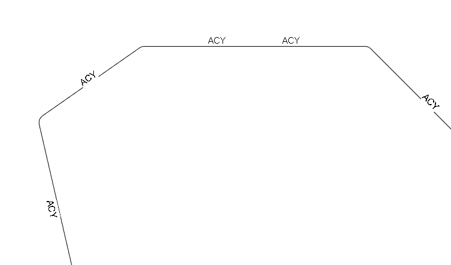

<head>
<meta http-equiv="Content-Type" content="text/html; charset=utf-8">
<link rel="stylesheet" type="text/css" href="bc.css">

<!--

-->
</head>

<!---

- add to 'select all model elements'
  http://forums.autodesk.com/t5/revit-api-forum/select-all-physical-items-in-model/m-p/6822940
  
- 12566528 [Textnote - vertical alignment on line i Revit 2016?]
  http://forums.autodesk.com/t5/revit-api-forum/textnote-vertical-alignment-on-line-i-revit-2016/m-p/6810367

- 2016 issues: vertical text alignment missing and setbarresults modification
  comments by David Rushforth on whats-new-in-the-revit-2016-api:
  http://thebuildingcoder.typepad.com/blog/2015/04/whats-new-in-the-revit-2016-api.html#comment-6a00e553e16897883301bb08261e9a970d
  http://thebuildingcoder.typepad.com/blog/2015/04/add-in-migration-to-revit-2016-and-updated-wizards.html?cid=6a00e553e16897883301bb08264ea1970d#comment-6a00e553e16897883301bb08264ea1970d
  10707501 [Text Note VerticalAlignment  is Read Only]
  rvt65682 [VerticalAlignment is read-only]
  http://forums.autodesk.com/t5/revit-api/creating-a-textnote-with-the-2016-api-changes/m-p/5629284
  http://forums.autodesk.com/t5/revit-api/text-alignments/m-p/6272246
  11708648 [Text alignments]
  12566528 [Textnote - vertical alignment on line i Revit 2016?]
  http://forums.autodesk.com/t5/revit-api-forum/textnote-vertical-alignment-on-line-i-revit-2016/m-p/6810367

- pyRevit Idea: Add support for C# assemblies #143 -- https://github.com/eirannejad/pyRevit/issues/143 

#RevitAPI @AutodeskRevit #aec #bim #dynamobim @AutodeskForge

Happy New Year of the Rooster!
The Spring Festival is underway celebrating the Chinese New Year.
Meanwhile, we continue our usual ongoing celebration of exciting Revit API news items
&ndash; PyRevit dynamic <code>cs</code> script loader
&ndash; Selecting all physical elements in model
&ndash; Vertical <code>TextNote</code> alignment...

#AULondon, #UI, #innovation, #RevitAPI, @AutodeskRevit

Dynamic Scripts, Model Elements and Vertical Alignment #RevitAPI @AutodeskRevit #aec #bim #dynamobim @AutodeskForge

http://bit.ly/cs_phys_el_vert_al

-->

### Dynamic Scripts, Model Elements and Vertical Alignment

Happy New Year of the Rooster!

<!----
<iframe width='480' height='360' frameborder='0' allowfullscreen
src='http://player.ooyala.com/static/v4/stable/4.7.9/skin-plugin/iframe.html?ec=42Njdmazp8OPIKJRyChESz2RevNqe2aQ&pbid=ZTIxYmJjZDM2NWYzZDViZGRiOWJjYzc5&pcode=RvbGU6Z74XE_a3bj4QwRGByhq9h2'></iframe>
---->

The Spring Festival is underway celebrating 
the [Chinese New Year](https://en.wikipedia.org/wiki/Chinese_New_Year) and 
another [year of the Rooster](https://en.wikipedia.org/wiki/Rooster_(zodiac)),
cf. e.g. [The Telegraph newspaper article](http://www.telegraph.co.uk/news/0/chinese-new-year/) covering all these aspects:

- Popular Chinese New Year greetings
- The personality of the Rooster
- Lucky Signs for the Rooster
- Which Chinese zodiac sign are you?
- What does your Chinese zodiac sign mean?
- Chinese New Year's Day taboos
- When does the party start?

Meanwhile, we continue our usual ongoing celebration of exciting Revit API news items:

- [PyRevit dynamic `cs` script loader](#2)
- [Selecting all physical elements in model](#3)
- [Vertical `TextNote` alignment](#4)

####PyRevit Dynamic `cs` Script Loader

[Ehsan Iran-Nejad](https://github.com/eirannejad) announces happy news on 
[pyRevit](https://github.com/eirannejad/pyRevit), which provides support for IronPython scripts and an add-in tab in Revit.

The [idea #143 &ndash; add support for C# assemblies](https://github.com/eirannejad/pyRevit/issues/143#issuecomment-272913198) is
already implemented:

**Idea:** I would like to propose adding support for loading C# assemblies.

To elaborate:

Instead of executing a Python script, a button would dynamically load and execute an `IExternalCommand` from a C# assembly, a bit like the Revit SDK Add-in Manager.

**Answer:** I'm glad you mentioned this.

pyRevit currently supports C# scripts.

It compiles them at runtime and creates executable commands for `IExternalCommand`.

It also supports `IExternalCommandAvailability`.

Just as with the Add-In Manager, you can modify the C# code on the fly and reload pyRevit without closing the current Revit session.

Look at the button bundle listed below.

It only has a `.cs` file instead of a `.py` file.

This is a work-in-progress feature and thus not announced yet, but technically you can create C# bundles right now already.

The unfinished component of this feature is that I need to make the compiler smart about the assemblies it needs to reference for the C# script to work.

Currently, it references these assemblies by default, which is more than enough for most commands:

- RevitAPI
- RevitAPIUI
- IronPython
- IronPython.Modules
- Microsoft.Dynamic
- Microsoft.Scripting
- Microsoft.CSharp
- System
- System.Core
- System.Drawing
- System.Windows.Forms
- PresentationCore
- PresentationFramework
- WindowsBase

Here is [the bundle folder to `Test C# Script.pushbutton`](https://github.com/eirannejad/pyRevit/blob/master/extensions/pyRevitCore.extension/pyRevit.tab/pyRevit.panel/Labs.pulldown/Test%20C%23%20Script.pushbutton/script.cs).

####Selecting all Physical Elements in Model

Here is yet another new solution 
for [using `FilteredElementCollector` to select model elements, i.e., visible 3D elements](http://thebuildingcoder.typepad.com/blog/about-the-author.html#5.9b),
from the [Revit API discussion forum](http://forums.autodesk.com/t5/revit-api/bd-p/160) thread 
on [selecting all physical items in model](http://forums.autodesk.com/t5/revit-api-forum/select-all-physical-items-in-model/m-p/6822940):

**Question:** I am trying to select all the model element instances in my model. i.e. anything that is a physical object, so I can change the value of a certain property on them. The property value will be different depending on where the instance is in the model. I have the below method but it is not picking up host families or the likes of ducts:

<pre class="code">
IList&lt;Element&gt;&nbsp;GetFamilyInstanceModelElements(&nbsp;
&nbsp;&nbsp;Document&nbsp;doc&nbsp;)
{
&nbsp;&nbsp;ElementClassFilter&nbsp;familyInstanceFilter&nbsp;
&nbsp;&nbsp;&nbsp;&nbsp;=&nbsp;new&nbsp;ElementClassFilter(&nbsp;
&nbsp;&nbsp;&nbsp;&nbsp;&nbsp;&nbsp;typeof(&nbsp;FamilyInstance&nbsp;)&nbsp;);
 
&nbsp;&nbsp;FilteredElementCollector&nbsp;familyInstanceCollector&nbsp;
&nbsp;&nbsp;&nbsp;&nbsp;=&nbsp;new&nbsp;FilteredElementCollector(&nbsp;doc&nbsp;);
 
&nbsp;&nbsp;IList&lt;Element&gt;&nbsp;elementsCollection&nbsp;
&nbsp;&nbsp;&nbsp;&nbsp;=&nbsp;familyInstanceCollector.WherePasses(&nbsp;
&nbsp;&nbsp;&nbsp;&nbsp;&nbsp;&nbsp;familyInstanceFilter&nbsp;).ToElements();
 
&nbsp;&nbsp;IList&lt;Element&gt;&nbsp;modelElements&nbsp;
&nbsp;&nbsp;&nbsp;&nbsp;=&nbsp;new&nbsp;List&lt;Element&gt;();
 
&nbsp;&nbsp;foreach(&nbsp;Element&nbsp;e&nbsp;in&nbsp;elementsCollection&nbsp;)
&nbsp;&nbsp;{
&nbsp;&nbsp;&nbsp;&nbsp;if(&nbsp;(&nbsp;null&nbsp;!=&nbsp;e.Category&nbsp;)
&nbsp;&nbsp;&nbsp;&nbsp;&amp;&amp;&nbsp;(&nbsp;null&nbsp;!=&nbsp;e.LevelId&nbsp;)
&nbsp;&nbsp;&nbsp;&nbsp;&amp;&amp;&nbsp;(&nbsp;null&nbsp;!=&nbsp;e.get_Geometry(&nbsp;new&nbsp;Options()&nbsp;)&nbsp;)&nbsp;)
&nbsp;&nbsp;&nbsp;&nbsp;{
&nbsp;&nbsp;&nbsp;&nbsp;&nbsp;&nbsp;modelElements.Add(&nbsp;e&nbsp;);
&nbsp;&nbsp;&nbsp;&nbsp;}
&nbsp;&nbsp;}
&nbsp;&nbsp;return&nbsp;modelElements;
}
</pre>

**Answer 1:** Your filter looks OK to me.

Please note that the conversion from the `familyInstanceCollector` to the generic list `elementsCollection` is unnecessary and inefficient, as explained numerous times in the past, e.g.
in the discussions 
of [`ToElementIds` performance](http://thebuildingcoder.typepad.com/blog/2012/12/toelementids-performance.html)
and [use of LINQ with filtered element collectors](http://thebuildingcoder.typepad.com/blog/2015/12/quick-slow-and-linq-element-filtering.html#2).
 
Please also look at The Building Coder topic group
on [using `FilteredElementCollector` to select model elements, i.e., visible 3D elements](http://thebuildingcoder.typepad.com/blog/about-the-author.html#5.9b).

**Answer 2:** When you  use a `FamilyInstance` filter, you only find user created families, i.e., RFA-based, and not the built-in system families.
 
Try:

<pre class="code">
public&nbsp;static&nbsp;class&nbsp;JtElementExtensionMethods
{
&nbsp;&nbsp;public&nbsp;static&nbsp;bool&nbsp;IsPhysicalElement(&nbsp;
&nbsp;&nbsp;&nbsp;&nbsp;this&nbsp;Element&nbsp;e&nbsp;)
&nbsp;&nbsp;{
&nbsp;&nbsp;&nbsp;&nbsp;if(&nbsp;e.Category&nbsp;==&nbsp;null&nbsp;)&nbsp;return&nbsp;false;
&nbsp;&nbsp;&nbsp;&nbsp;if(&nbsp;e.ViewSpecific&nbsp;)&nbsp;return&nbsp;false;
&nbsp;&nbsp;&nbsp;&nbsp;//&nbsp;exclude&nbsp;specific&nbsp;unwanted&nbsp;categories
&nbsp;&nbsp;&nbsp;&nbsp;if(&nbsp;(&nbsp;(BuiltInCategory)&nbsp;e.Category.Id.IntegerValue&nbsp;)&nbsp;==&nbsp;BuiltInCategory.OST_HVAC_Zones&nbsp;)&nbsp;return&nbsp;false;
&nbsp;
&nbsp;&nbsp;&nbsp;&nbsp;return&nbsp;e.Category.CategoryType&nbsp;==&nbsp;CategoryType.Model&nbsp;&amp;&amp;&nbsp;e.Category.CanAddSubcategory;
&nbsp;&nbsp;}
}

IEnumerable&lt;Element&gt;&nbsp;SelectAllPhysicalElements(
&nbsp;&nbsp;Document&nbsp;doc&nbsp;)
{
&nbsp;&nbsp;return&nbsp;new&nbsp;FilteredElementCollector(&nbsp;doc&nbsp;)
&nbsp;&nbsp;&nbsp;&nbsp;.WhereElementIsNotElementType()
&nbsp;&nbsp;&nbsp;&nbsp;.Where(&nbsp;e&nbsp;=&gt;&nbsp;e.IsPhysicalElement()&nbsp;);
}
</pre>

**Answer 3:** I'd probably use `.WhereElementIsViewIndependent` in there somewhere also.

Faster than some of the iteration/LINQ methods, cf. the comparison
of [quick, slow and LINQ element filtering](http://thebuildingcoder.typepad.com/blog/2015/12/quick-slow-and-linq-element-filtering.html).

Extracting element data from Revit to .NET and checking it there, e.g., with LINQ, costs at least twice as much time as leaving it on the Revit side and applying some kind of filter instead.
 
Therefore, whenever possible, it pays off hugely to analyse all the element properties and how they are reflected in parameter values.
 
The parameter values can be filtered using a filtered element collector parameter filter.
 
[50% speed improvement over using LINQ post-processing guaranteed](http://thebuildingcoder.typepad.com/blog/2010/06/element-name-parameter-filter-correction.html)!

I added these new model element selection methods 
to [The Building Coder samples](https://github.com/jeremytammik/the_building_coder_samples),
implementing [`SelectAllPhysicalElements` in release 2017.0.132.1](https://github.com/jeremytammik/the_building_coder_samples/releases/tag/2017.0.132.1) and
adding the [`WhereElementIsViewIndependent` check in release 2017.0.132.2](https://github.com/jeremytammik/the_building_coder_samples/releases/tag/2017.0.132.2).

**Answer 4:** I agree that you should use the `WhereElementIsViewIndependent` filter instead of checking `Element.ViewSpecific`.

The rest of the checks in the `IsPhysicalElement` predicate check properties of the `Element.Category` and I think those can't be filtered in a fast filter.
 
An alternative approach would be to define your own set of categories (maybe 20-30).
All elements in the 'physical' model would belong to that set, if you have defined it correctly.
Then you can use an `ElementMulticategoryFilter` combined with `WhereElementIsNotElementType` and `WhereElementIsViewIndependent`.

Many thanks to Frank 'Fair59' and Matt Taylor for the good suggestions!

####Vertical TextNote Alignment

This is a continuation of
the [`TextNote` rotation issue](http://thebuildingcoder.typepad.com/blog/2017/01/textnote-rotation-forge-devcon-tensorflow-and-keras.html#3) discussed
last week, raised in
the [Revit API discussion forum](http://forums.autodesk.com/t5/revit-api/bd-p/160) thread 
on [`TextNote` vertical alignment on line in Revit 2016](http://forums.autodesk.com/t5/revit-api-forum/textnote-vertical-alignment-on-line-i-revit-2016/m-p/6810367):

**Question:**

I've managed to position text notes rotated along lines.

 <!-- 754 -->

 
Now I need to set the vertical alignment of the text, so the text is centred on the lines like this:

 <!-- 623 -->

In Revit 2015 I used the `TextAlignFlags.TEF_ALIGN_MIDDLE`, but it seems to be removed in 2016.
 
Is there method to align the vertical position of the text, or do I have to calculate a new position of the text according to its height and scale?

**Answer 1:**

<b><i>&lt;`rant`&gt;</i></b>

The (frustrating) omission of the vertical text alignment mimics the user interface. Gah.

Labels in tag families do have a modifiable vertical alignment, but these can't often be rotated. Gah.
 
So you're in the frustrating position of working out the text position manually. Gah.
 
Enough to drive you gaga? ;-)

<!----

Here are some other examples of people running into this issue:

2016 issues: vertical text alignment missing and setbarresults modification 

- [Comments by David Rushforth](http://thebuildingcoder.typepad.com/blog/2015/04/whats-new-in-the-revit-2016-api.html#comment-6a00e553e16897883301bb08261e9a970d)
on [What's New in the Revit 2016 API](http://thebuildingcoder.typepad.com/blog/2015/04/whats-new-in-the-revit-2016-api.html)
- [Comment by ... ](http://thebuildingcoder.typepad.com/blog/2015/04/add-in-migration-to-revit-2016-and-updated-wizards.html?cid=6a00e553e16897883301bb08264ea1970d#comment-6a00e553e16897883301bb08264ea1970d)
on [xxx](http://thebuildingcoder.typepad.com/blog/2015/04/add-in-migration-to-revit-2016-and-updated-wizards.html)
- [creating-a-textnote-with-the-2016-api-changes](http://forums.autodesk.com/t5/revit-api/creating-a-textnote-with-the-2016-api-changes/m-p/5629284)
- [text-alignments](http://forums.autodesk.com/t5/revit-api/text-alignments/m-p/6272246)
 
---->

It seems to me that the Revit developers have a mandate to stay away from simple drawing objects such as lines and text, and lean towards smarter objects like line-based families and tags. I commend that (if that is what is happening), but it also drives me nuts at times.

<b><i>&lt;`/rant`&gt;</i></b>
 
I was in the situation you are in. I ended up creating a line-based family with a nested annotation symbol in it. I needed to programmatically manage some of the family placement/scale etc. The bonus of this was that it allowed the user to modify the lines once placed (without needing an iUpdater to do so).
 
If you just want text, you may be able to get away with getting the centre of the text bounding box and moving it to the midpoint of your line. You'll probably need two transactions to do that.

**Answer 2:**

Very sorry about the frustrating situation.
 
Have you raised a wish list for this in the Revit Idea Station?
 
You might get a lot of votes for that one.
 
Now to go on with the topic at hand.
 
It has been discussed here in the past in the thread
on [text alignments](http://forums.autodesk.com/t5/revit-api/text-alignments/m-p/6272246).
 
Apparently, as far as the development team is concerned, the vertical alignment possibility should never have been implemented.
 
Arnošt Löbel explained that in detail in a discussion thread
on [creating a text note with the 2016 API changes](http://forums.autodesk.com/t5/revit-api/creating-a-textnote-with-the-2016-api-changes/m-p/5629284).
 
Please also refer to the comments by David Rushforth on [What's New in the Revit 2016 API](http://thebuildingcoder.typepad.com/blog/2015/04/whats-new-in-the-revit-2016-api.html).
 
Can you check these out and see whether they help?
 
I do hope we can resolve this somehow, because this request has cropped up a few times now.

Is it possible to achieve what you show in your second figure using a custom line type?
 
Here are two solutions that come up immediately in an Internet search:
 
- [Creating linetype with text to represent utility and fence lines](https://knowledge.autodesk.com/support/revit-products/troubleshooting/caas/sfdcarticles/sfdcarticles...)
- [YouTube video in Russian](https://www.youtube.com/watch?v=swR-zJkc1fQ)

**Response:**

For now, I prefer to use simple text notes, as these texts are only used for sheet views.
 
Also, some users might need to delete or move a text element, to give way for more important geometry.
 
Thanks for the idea about getting values from the text bounding box. That's probably the best way of calculating the offset distance.
 
I'm not using detail lines. The lines shown are actually pipe system, shown with single line representation.
 
A line based family is too constricted for our needs.

**Answer 3:**

The discussions you point to don't help me understand why vertical alignment isn't included in either the UI or the API.

If Revit could do everything as a user would want it, text wouldn't exist. It would all be internal/external databases, tags, references etc. That is not the case.

So, a user (or programmer) must be able to add text that can be positioned in a manner that editing the text element's content doesn't make it wrap in an undesirable way.
 
There are 21 ideas in the Idea Station using the search 'text alignment'.

While the 'no vertical alignment' stance may make sense from an Autodesk point of view, it makes zero sense from a user viewpoint. Any user would have told the development team that. The 21 ideas voice this also.
 
I've been using the Revit API since Revit 2011.

Originally, I was like, I'll use `TextNoteCreationData` to batch create text, because that'll be faster than creating them individually (after some testing).

That got deprecated in Revit 2013 and obsoleted in Revit 2014.

In Revit 2013, the `NewTextNote` creation method was heralded as being as efficient as the batch method.

Then that was deprecated in Revit 2016, and obsoleted in Revit 2017.

In Revit 2016, enter the 'new' static `Create` method. A devolved version, in preparation for the Revit 2017 text element overhaul. Adjustment required after initial creation transaction.
 
The roadmap isn't clear.
 
It's not annoying, really, just disappointing, time sapping, and ambiguous. The 2017 'improvements' weren't enough!

Sorry, this message is longer than I wanted! And sorry it's another rant...

**Answer 4:**

Note that this is not supported functionality...
 
But it so happens that you can still set the vertical alignment through the `TEXT_ALIGN_VERT` built-in parameter.  
 
It needs to be set to `TextAlignFlags.TEF_ALIGN_TOP`, `TextAlignFlags.TEF_ALIGN_MIDDLE` or `TextAlignFlags.TEF_ALIGN_BOTTOM`, like in this C# snippet:
 
<pre class="code">
&nbsp;&nbsp;using(&nbsp;Transaction&nbsp;t&nbsp;=&nbsp;new&nbsp;Transaction(&nbsp;doc&nbsp;)&nbsp;)
&nbsp;&nbsp;{
&nbsp;&nbsp;&nbsp;&nbsp;t.Start(&nbsp;&quot;AlignTextNote&quot;&nbsp;);
 
&nbsp;&nbsp;&nbsp;&nbsp;Parameter&nbsp;p&nbsp;=&nbsp;textNote.get_Parameter(
&nbsp;&nbsp;&nbsp;&nbsp;&nbsp;&nbsp;BuiltInParameter.TEXT_ALIGN_VERT&nbsp;);
 
&nbsp;&nbsp;&nbsp;&nbsp;p.Set(&nbsp;(Int32)
&nbsp;&nbsp;&nbsp;&nbsp;&nbsp;&nbsp;TextAlignFlags.TEF_ALIGN_MIDDLE&nbsp;);
 
&nbsp;&nbsp;&nbsp;&nbsp;t.Commit();
&nbsp;&nbsp;}
</pre>

Hope that helps.
 
Meanwhile we will have a look to see what is involved to get this formally exposed.

**Response:**

Perfect! Just what I needed.

