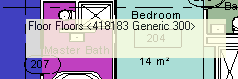
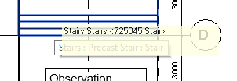

<head>
<meta http-equiv="Content-Type" content="text/html; charset=utf-8">
<link rel="stylesheet" type="text/css" href="bc.css">

<!--

-->
</head>

<!---

- 12593692 [mouse hover event]
  https://github.com/jeremytammik/WinTooltip

#RevitAPI @AutodeskRevit #aec #bim #dynamobim @AutodeskForge

I revisited the custom tooltip implementation that I prepared to demonstrate the Revit 2013 API features including the View API and its <code>UIView</code> class. It class still provides the only possibility to convert back and forth between Revit model coordinates and Windows device screen points. That functionality can be combined with the <code>ReferenceIntersector</code> to shoot a ray through the model to determine what Revit database element is located under the current cursor position and display a custom tooltip presenting information about it or anything else you please...

&ndash; ...

#AULondon, #UI, #innovation, #RevitAPI, @AutodeskRevit

-->

### UIView Windows Coordinate Ray Casting Tooltip

I was prompted by a recent Revit API support case to revisit the custom tooltip implementation that I prepared to demonstrate the Revit 2013 API features including the View API and its `UIView` class.

As far as I know, the `UIView` class still provides the only possibility to convert back and forth between Revit model coordinates and Windows device screen points.

That functionality can be combined with the `ReferenceIntersector` to shoot a ray through the model to determine what Revit database element is located under the current cursor position and display a custom tooltip presenting information about it or anything else you please.

I explained the principles of doing so and the nitty-gritty implementation details of the `WinTooltip` sample add-in back in 2012:

- [UIView and Windows Device Coordinates](http://thebuildingcoder.typepad.com/blog/2012/06/uiview-and-windows-device-coordinates.html)
- [UIView, Windows Coordinates, ReferenceIntersector and My Own Tooltip](http://thebuildingcoder.typepad.com/blog/2012/10/uiview-windows-coordinates-referenceintersector-and-my-own-tooltip.html)

Hosted on GitHub and migrated to Revit 2017, [WinTooltip](https://github.com/jeremytammik/WinTooltip) now
displays Revit database element information in a very rough custom tooltip like this:

If you are lucky, WinTooltip and Revit will agree on what element you are pointing at and both display information about the same item simultaneously:

By the way, you might be surprised what minimal modifications were required for the migration.

The code was not modified at all.

I only changed the .NET framework version, updated the Revit API references
and [eliminated the architecture mismatch warning using `DisableMismatchWarning.exe`](http://thebuildingcoder.typepad.com/blog/2014/09/architecture-mismatch-warning-disabler-update.html).

You can examine the exact changes made by looking at the GitHub diffs:

- [Update Revit API references](https://github.com/jeremytammik/WinTooltip/compare/2013.0.0.0...2017.0.0.0)
- [Remove architecture mismatch warning messages](https://github.com/jeremytammik/WinTooltip/compare/2017.0.0.0...2017.0.0.1)

Please note that several important improvements on handling the `Idling` event properly that have been learned since 2012 have <b><i>not</i></b> been incorporated into this sample.

For more information about those, especially the recommendation
to [avoid `Idling` in favour of external events except for one-off calls](http://thebuildingcoder.typepad.com/blog/2013/12/replacing-an-idling-event-handler-by-an-external-event.html),
please refer to The Building Coder topic group
on [`Idling` and external events for modeless access and driving Revit from outside](http://thebuildingcoder.typepad.com/blog/about-the-author.html#5.28).

In its current form, WinTooltip for Revit 2017 is still just a flat migration of the original Revit 2013 implementation with all its flaws, just as a proof of concept, and not suitable for production use.

I hope you find it interesting and useful despite this caveat.

Check it out in its new [WinTooltip GitHub repository](https://github.com/jeremytammik/WinTooltip).
