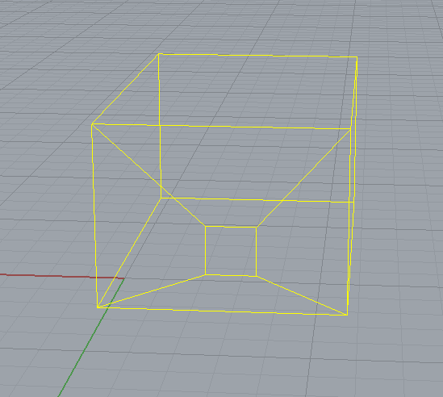

<head>
<meta http-equiv="Content-Type" content="text/html; charset=utf-8">
<link rel="stylesheet" type="text/css" href="bc.css">

<!--

-->
</head>

<!---

- Family Category property returns null
  http://forums.autodesk.com/t5/revit-api-forum/having-trouble-filtering-to-ost-titleblocks/m-p/6827759
  use family symbols instead

- 12530307 [gbXml export using energy settings]
  http://forums.autodesk.com/t5/revit-api-forum/gbxml-export-using-energy-settings/m-p/6784904

#RevitAPI @AutodeskRevit #aec #bim #dynamobim @AutodeskForge

Let's pick up two more topics from the Revit API discussion forum today
&ndash; Family <code>Category</code> property is not always set
&ndash; Two different energy analysis model types
&ndash; gbXML export options
&ndash; <code>BuildingEnvelopeAnalyzer</code> class
&ndash; <code>EnergyAnalysisDetailModel</code> creation from building elements and volumes
&ndash; <code>EnergyAnalysisDetailModelOptions</code>...

-->

### Family Category and Two Energy Model Types

Let's pick up two more topics from
the [Revit API discussion forum](http://forums.autodesk.com/t5/revit-api/bd-p/160) today:

- [Family `Category` property is not always set](#2)
- [Two different energy analysis model types](#3)
    - [gbXML export options](#4)
    - [`BuildingEnvelopeAnalyzer` class](#5)
    - [`EnergyAnalysisDetailModel` creation from building elements and volumes](#6)
    - [`EnergyAnalysisDetailModelOptions`](#7)
- [Quo Vadis Revit API QAS?](#8)

#### Family Category Property is not Always Set

A well-known issue that has been around forever cropped up again yesterday in
the [Revit API discussion forum](http://forums.autodesk.com/t5/revit-api/bd-p/160) thread
on [having trouble filtering to `OST_TitleBlocks`](http://forums.autodesk.com/t5/revit-api-forum/having-trouble-filtering-to-ost-titleblocks/m-p/6827759):

The filter was set up like this:

<pre class="code">
&nbsp;&nbsp;FilteredElementCollector&nbsp;collector
&nbsp;&nbsp;&nbsp;&nbsp;=&nbsp;new&nbsp;FilteredElementCollector(&nbsp;doc&nbsp;);

&nbsp;&nbsp;ICollection&lt;Element&gt;&nbsp;titleFrames&nbsp;=&nbsp;collector
&nbsp;&nbsp;&nbsp;&nbsp;.OfCategory(&nbsp;BuiltInCategory.OST_TitleBlocks&nbsp;)
&nbsp;&nbsp;&nbsp;&nbsp;.OfClass(&nbsp;typeof(&nbsp;Family&nbsp;)&nbsp;)
&nbsp;&nbsp;&nbsp;&nbsp;.ToElements();
</pre>

Internally, this filters for all `Family` elements and queries their `Category` property.

Unfortunately, the `Category` property is not always implemented on families, so you may have to use `FamilyCategory` instead.

Sometimes, that is not set either.

In that case, you can use the category of the family's first symbol.

That is mentioned in the discussion
on [Changing Element Type](http://thebuildingcoder.typepad.com/blog/2015/09/change-type-iterate-elements-create-family.html#2),
and the workaround querying the family's first symbol for its category is demonstrated in
the [ADN Xtra labs](https://github.com/jeremytammik/AdnRevitApiLabsXtra)
module [Labs3.cs](https://github.com/jeremytammik/AdnRevitApiLabsXtra/blob/master/XtraCs/Labs3.cs)
in [lines 86-118](https://github.com/jeremytammik/AdnRevitApiLabsXtra/blob/master/XtraCs/Labs3.cs#L86-L118).

For future reference, I implemented two new helper methods `FamilyFirstSymbolCategoryEquals` and `GetFamiliesOfCategory`
in [The Building Coder samples](https://github.com/jeremytammik/the_building_coder_samples) to
demonstrate this, in the
module [CmdCollectorPerformance.cs, lines 292-L330](https://github.com/jeremytammik/the_building_coder_samples/blob/master/BuildingCoder/BuildingCoder/CmdCollectorPerformance.cs#L292-L330):

<pre class="code">
static&nbsp;bool&nbsp;FamilyFirstSymbolCategoryEquals(
&nbsp;&nbsp;Family&nbsp;f,&nbsp;
&nbsp;&nbsp;BuiltInCategory&nbsp;bic )
{
&nbsp;&nbsp;Document&nbsp;doc&nbsp;=&nbsp;f.Document;
 
&nbsp;&nbsp;ISet&lt;ElementId&gt;&nbsp;ids&nbsp;=&nbsp;f.GetFamilySymbolIds();
 
&nbsp;&nbsp;Category&nbsp;cat&nbsp;=&nbsp;(0&nbsp;==&nbsp;ids.Count)
&nbsp;&nbsp;&nbsp;&nbsp;?&nbsp;null
&nbsp;&nbsp;&nbsp;&nbsp;:&nbsp;doc.GetElement(&nbsp;ids.First&lt;ElementId&gt;()&nbsp;).Category;
 
&nbsp;&nbsp;return&nbsp;null&nbsp;!=&nbsp;cat&nbsp;
&nbsp;&nbsp;&nbsp;&nbsp;&amp;&amp;&nbsp;cat.Id.IntegerValue.Equals(&nbsp;(int)&nbsp;bic&nbsp;);
}
 
static&nbsp;void&nbsp;GetFamiliesOfCategory(&nbsp;
&nbsp;&nbsp;Document&nbsp;doc,&nbsp;
&nbsp;&nbsp;BuiltInCategory&nbsp;bic&nbsp;)
{
&nbsp;&nbsp;IEnumerable&lt;Family&gt;&nbsp;families
&nbsp;&nbsp;&nbsp;&nbsp;=&nbsp;new&nbsp;FilteredElementCollector(&nbsp;doc&nbsp;)
&nbsp;&nbsp;&nbsp;&nbsp;&nbsp;&nbsp;.OfClass(&nbsp;typeof(&nbsp;Family&nbsp;)&nbsp;)
&nbsp;&nbsp;&nbsp;&nbsp;&nbsp;&nbsp;.Cast&lt;Family&gt;()
&nbsp;&nbsp;&nbsp;&nbsp;&nbsp;&nbsp;.Where&lt;Family&gt;(&nbsp;f&nbsp;=&gt;&nbsp;
&nbsp;&nbsp;&nbsp;&nbsp;&nbsp;&nbsp;&nbsp;&nbsp;FamilyFirstSymbolCategoryEquals(&nbsp;f,&nbsp;bic&nbsp;)&nbsp;);
}
</pre>

In some cases, due to this limitation and depending on what you wish to achieve, it might be handier to filter for family symbols or family instances rather than the top-level families themselves.

#### Two Different Energy Analysis Model Types

Another issue deals with invalid window dimensions caused 
by [gbXml export using energy settings](http://forums.autodesk.com/t5/revit-api-forum/gbxml-export-using-energy-settings/m-p/6784904):

**Question:** I am exporting gbXML files using the Revit API. This seems to be using the Revit energy settings. Revit breaks up the wall the window is located within by creating a wall the same size as the window and then creates a mesh around it (see picture). When I translate the gbXML file to an EnergyPlus Idf file and run the analysis, EnergyPlus throws an error because the window is the same size as the wall it is located within.

When I use the Revit gbXML export dialog and export Room/Space volumes this is not the case.
It exports the window located within the wall as drawn in Revit.

I do however want to use the API to export. Am I getting it wrong somewhere and is there a work around or is this a bug?  

Devon Powell suggested working around this by changing the `ExportEnergyModelType` to `SpatialElement`:
 
> You can use the API to use the spaces export method to export the gbXML file (not sure if you want to use this, or you are specifically trying to use the energy settings method.) You first need to setup your energy model settings then create the energy model. Then you can export the gbXML file. See example code below. 
 
<pre class="code">
&#39;define&nbsp;the&nbsp;energy&nbsp;model&nbsp;options
Dim&nbsp;EmOpt&nbsp;As&nbsp;New&nbsp;EnergyAnalysisDetailModelOptions
EmOpt.EnergyModelType&nbsp;=&nbsp;EnergyModelType.SpatialElement
EmOpt.ExportMullions&nbsp;=&nbsp;False
EmOpt.IncludeShadingSurfaces&nbsp;=&nbsp;True
EmOpt.SimplifyCurtainSystems&nbsp;=&nbsp;True
 
&#39;create&nbsp;the&nbsp;energy&nbsp;analysis&nbsp;(modifies&nbsp;model,&nbsp;wrapped&nbsp;in&nbsp;tx)
Using&nbsp;tx&nbsp;As&nbsp;New&nbsp;Transaction(doc)
&nbsp;&nbsp;tx.Start(&quot;Create&nbsp;Internal&nbsp;E-Model&quot;)
&nbsp;&nbsp;Dim&nbsp;Em&nbsp;As&nbsp;EnergyAnalysisDetailModel&nbsp;=&nbsp;EnergyAnalysisDetailModel.Create(doc,&nbsp;EmOpt)
&nbsp;&nbsp;tx.Commit()
End&nbsp;Using
 
&#39;set&nbsp;the&nbsp;gbXML&nbsp;options
Dim&nbsp;gbxmlOpt&nbsp;As&nbsp;New&nbsp;GBXMLExportOptions
gbxmlOpt.ExportEnergyModelType&nbsp;=&nbsp;ExportEnergyModelType.SpatialElement
 
&#39;export&nbsp;the&nbsp;gbXML&nbsp;file
doc.Export(folder,&nbsp;doc.Title,&nbsp;gbxmlOpt)
</pre>

Jaco Kemp confirms that this helps and shares the corresponding C# code:

> Thank you for the example. It works for exporting spaces and don't have the same problem as exporting surfaces. This will do for now. For completeness, I have included the C# code of your solution.
 
<pre class="code">
public&nbsp;static&nbsp;string&nbsp;RevitToGbXMLSpaces(&nbsp;string&nbsp;projectLocation&nbsp;)
{
&nbsp;&nbsp;//define&nbsp;the&nbsp;energy&nbsp;model&nbsp;options
&nbsp;&nbsp;var&nbsp;EmOpt&nbsp;=&nbsp;new&nbsp;EnergyAnalysisDetailModelOptions();
&nbsp;&nbsp;EmOpt.EnergyModelType&nbsp;=&nbsp;EnergyModelType.SpatialElement;
&nbsp;&nbsp;EmOpt.ExportMullions&nbsp;=&nbsp;true;
&nbsp;&nbsp;EmOpt.IncludeShadingSurfaces&nbsp;=&nbsp;true;
&nbsp;&nbsp;EmOpt.SimplifyCurtainSystems&nbsp;=&nbsp;true;
 
&nbsp;&nbsp;//create&nbsp;the&nbsp;energy&nbsp;analysis&nbsp;(modifies&nbsp;model,&nbsp;wrapped&nbsp;in&nbsp;tx)
&nbsp;&nbsp;Document&nbsp;doc&nbsp;=&nbsp;DocumentManager.Instance.CurrentDBDocument;
&nbsp;&nbsp;using(&nbsp;Transaction&nbsp;tx&nbsp;=&nbsp;new&nbsp;Transaction(&nbsp;doc&nbsp;)&nbsp;)
&nbsp;&nbsp;{
&nbsp;&nbsp;&nbsp;&nbsp;tx.Start(&nbsp;&quot;Create&nbsp;Internal&nbsp;E-Model&quot;&nbsp;);
&nbsp;&nbsp;&nbsp;&nbsp;EnergyAnalysisDetailModel.Create(&nbsp;doc,&nbsp;EmOpt&nbsp;);
&nbsp;&nbsp;&nbsp;&nbsp;tx.Commit();
&nbsp;&nbsp;}
 
&nbsp;&nbsp;//set&nbsp;the&nbsp;gbXML&nbsp;options
&nbsp;&nbsp;var&nbsp;gbxmlOpt&nbsp;=&nbsp;new&nbsp;GBXMLExportOptions()
&nbsp;&nbsp;{
&nbsp;&nbsp;&nbsp;&nbsp;ExportEnergyModelType&nbsp;=&nbsp;ExportEnergyModelType.SpatialElement
&nbsp;&nbsp;};
 
&nbsp;&nbsp;//export&nbsp;the&nbsp;gbXML&nbsp;file
&nbsp;&nbsp;string&nbsp;fileName&nbsp;=&nbsp;&quot;temp&quot;;
&nbsp;&nbsp;doc.Export(&nbsp;projectLocation,&nbsp;fileName,&nbsp;gbxmlOpt&nbsp;);
&nbsp;&nbsp;return&nbsp;projectLocation&nbsp;+&nbsp;&quot;\\&quot;&nbsp;+&nbsp;fileName&nbsp;+&nbsp;&quot;.xml&quot;;
}
</pre>

This topic also arose in a follow-up conversation after the extensive discussion on determining wall opening areas per room, when some of the walls may not be vertical:

- [Determining wall cut area for a specific room](http://thebuildingcoder.typepad.com/blog/2016/04/determining-wall-cut-area-for-a-specific-room.html)
- [More on wall opening areas per room](http://thebuildingcoder.typepad.com/blog/2016/04/more-on-wall-opening-areas-per-room.html)

Sample code handling room volumes extending sideways at different elevations was presented at AU 2014.

There are two different ways to determine the energy calculation volumes:

One is based on either the floor plan (for vertical faces), the other on volumetric filling up of the spaces with voxels (for slanted faces).

The choice between the two methods is made by setting the `EnergyAnalysisDetailModelOptions.EnergyModelType` property, which can take one of the following two enumeration values:

- `SpatialElement` &ndash; Energy model based on rooms or spaces.
- `BuildingElement` &ndash; The building element based energy analytical model.

You can see this switch in the Export gbXML dialogue, and the enhancement is mentioned in 
the [What's New in the Revit 2015 API](http://thebuildingcoder.typepad.com/blog/2014/04/whats-new-in-the-revit-2015-api.html) documentation on
[Energy analysis API additions](http://thebuildingcoder.typepad.com/blog/2014/04/whats-new-in-the-revit-2015-api.html#3.12):

#### gbXML Export Options

The new property `GBXMLExportOptions.ExportEnergyModelType` determines the type of analysis used when producing the export gbXML file for the document. Options are:

- SpatialElement &ndash; Energy model based on rooms or spaces. This is the default for calls when this option is not set, and matches behaviour in Revit 2014.
- BuildingElement &ndash; Energy model based on analysis of building element volumes.

#### BuildingEnvelopeAnalyzer Class

The new class `BuildingEnvelopeAnalyzer` analyses which elements are part of the building envelope (the building elements exposed to the outside). This class uses a combination of ray-casting and flood-fill algorithms in order to find the building elements that are exposed to the outside of the building. This method can also look for the bounding building elements for enclosed space volumes inside the building. Options for the analysis include:

- AnalyzeEnclosedSpaceVolumes &ndash; Whether or not to analyse interior connected regions inside the building forming enclosed space volumes.
- GridCellSize &ndash; The cell size for the uniform cubical grid used when analysing the building envelope.
- OptimizeGridCellSize &ndash; Whether or not to use the exact value for the cell size or let the analyser optimize the cell size based on the specified grid size

#### EnergyAnalysisDetailModel Creation from Building Elements and Volumes

[What's New in the Revit 2016 API](http://thebuildingcoder.typepad.com/blog/2015/04/whats-new-in-the-revit-2016-api.html) mentions 
further [energy analysis and gbXML API changes](http://thebuildingcoder.typepad.com/blog/2015/04/whats-new-in-the-revit-2016-api.html#4.06):

The function `EnergyAnalysisDetailModel.Create` now offers the ability to create energy model based on analysis of building element boundaries and volumes (set `EnergyAnalysisDetailModelOptions.EnergyModelType` to `BuildingElement`). This option matches the default energy model creation used by Revit's user interface.

The generated energy model is affected by settings in `EnergyDataSettings`, including the option to use the new enumerated value `AnalysisMode.ConceptualMassesAndBuildingElements`.

This option sets the generation of the `EnergyAnalysisDetailModel` to use the combination of conceptual masses and building elements.

#### EnergyAnalysisDetailModelOptions

The new property `EnergyAnalysisDetailModelOptions.EnergyModelType` indicates whether the energy model is based on rooms/spaces or building elements. Options are:

- SpatialElement &ndash; Energy model based on rooms or spaces. This is the default for calls when this option is not set, and matches behaviour in Revit 2015.
- BuildingElement &ndash; Energy model based on analysis of building element volumes.

#### Quo Vadis Revit API QAS?

This is a note to myself and my colleagues on my on-going research to implement a question answering system to handle the closed-domain topic of *Getting started with the Revit API*.

I would really appreciate some guidance on which system to start working seriously with and where to go next.

Here are some systems I took a look at so far:

- [Jill Watson](http://thebuildingcoder.typepad.com/blog/2017/01/au-in-london-and-deep-learning.html#7)
- [IBM Watson and Bluemix](http://thebuildingcoder.typepad.com/blog/2017/01/virtues-of-reproduction-research-mep-settings-ontology.html#6)
- [Microsoft QnA Maker](http://thebuildingcoder.typepad.com/blog/2017/01/vertical-dimensioning-and-revit-api-qas-research.html#4)
- [Open Source QAS Options](http://thebuildingcoder.typepad.com/blog/2017/01/virtues-of-reproduction-research-mep-settings-ontology.html#7)
- [Stanford DARPA DeepDive](http://thebuildingcoder.typepad.com/blog/2017/01/vertical-dimensioning-and-revit-api-qas-research.html#5)
- [YodaQA and DL-Learner](http://thebuildingcoder.typepad.com/blog/2017/01/vertical-dimensioning-and-revit-api-qas-research.html#6)
- [TensorFlow and Keras](http://thebuildingcoder.typepad.com/blog/2017/01/textnote-rotation-forge-devcon-tensorflow-and-keras.html#4)

Watson and QnA Maker looks simplest to get started with.

I would much prefer to use an open source system, though, and avoid everything proprietary.

I summarised my thoughts on what I would like to achieve and what material I can use to build a knowledge base and teach the system:

- [More Research on a Revit QAS](http://thebuildingcoder.typepad.com/blog/2017/01/vertical-dimensioning-and-revit-api-qas-research.html#3)
- [Building a Revit API Ontology](http://thebuildingcoder.typepad.com/blog/2017/01/virtues-of-reproduction-research-mep-settings-ontology.html#8)

Here are my main open questions ten days ago:

- [My Current Open Questions on Question Answering Systems](http://thebuildingcoder.typepad.com/blog/2017/01/vertical-dimensioning-and-revit-api-qas-research.html#7)

Nothing much has changed since then.

I still wonder:

- Which system should I choose?
- Where should I go next?

<!----
I really need some guidance here.

I cannot imagine that I am the only person in Autodesk interested in created a question answering system.

Looking forward to a quick chat with someone sometime.

Thank you!
---->
