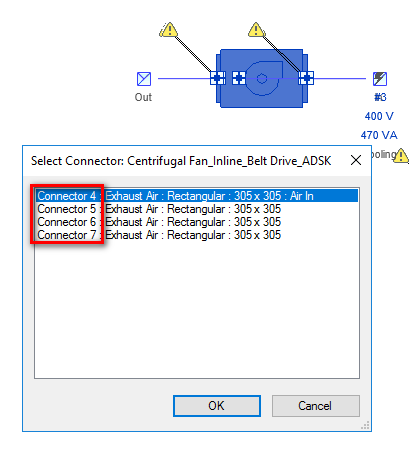
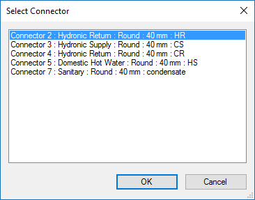
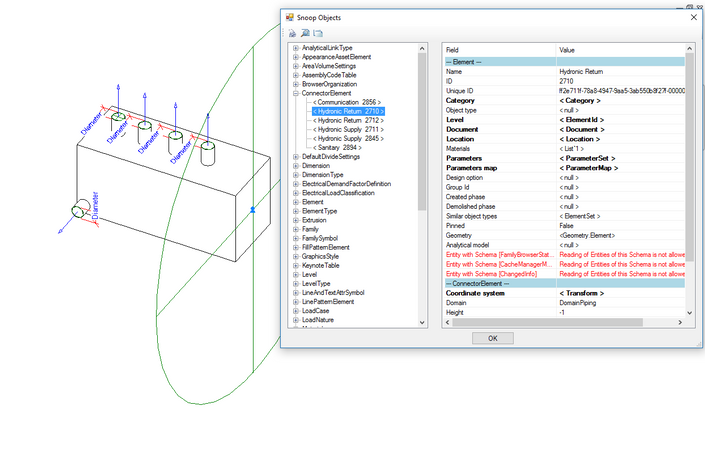

<head>
<meta http-equiv="Content-Type" content="text/html; charset=utf-8">
<link rel="stylesheet" type="text/css" href="bc.css">

<!--

-->
</head>

<!---

http://forums.autodesk.com/t5/revit-mep-forum/connector-numbers-of-mechanical-equipment/m-p/6870978/highlight/false#M38295

#RevitAPI @AutodeskRevit #aec #bim #dynamobim @AutodeskForge

I answered a question in the Revit MEP forum, prompted by Robert Klempau's direct mention in the thread on connector numbers of mechanical equipment. Since it is rather technical and even includes a snippet of Revit source code, let me reiterate it here for better readability and future reference &ndash; Question: I created a mechanical exhaust fan with four connectors...

The Revit MEP Connector Number 

-->

### Revit MEP Connector Number

I answered a question in a forum I never participated in previously,
the [Revit MEP forum](http://forums.autodesk.com/t5/revit-mep-forum/bd-p/188),
prompted by Robert Klempau's direct mention in the thread
on [connector numbers of mechanical equipment](http://forums.autodesk.com/t5/revit-mep-forum/connector-numbers-of-mechanical-equipment/m-p/6870978).

Since it is rather technical and even includes a snippet of Revit source code, let me reiterate it here for better readability and future reference:

**Question:** I created a mechanical exhaust fan with four connectors for testing something else.

Interestingly, when I was creating a system, Revit asked me which connector I wanted to use. In the list of connectors, it looks like each one has its own connector number (connector 4 to 7).
 
Can someone tell me where is this parameter saved in the Revit family, and am I able to change that?

**Answer 1** Do you have any other type of connector in the family?
Usually they are numbered after the placement sequence.
To include a text, use the description parameter of the connector properties; that will make your life easier in this selection window.

**Answer 2:** 
I created a video showing what to do when adding connectors of the same system classification to your family.

That you see only connector 4 till 7 and not 1 till 4 can have several reasons.
 
- There are other connectors in your model, like duct, conduit, cable tray or electrical connectors in your family.
- There are connectors in your family, but you removed some of them.

In your case I see 4 Duct connectors and 1 electrical connector.
 
Don't worry about the connector numbers.

As suggested, add the description to the connector so you know exactly which connector is which.

Here is a video providing the full details:

<iframe src="https://screencast.autodesk.com/Embed/Timeline/0d5a99e1-726c-4410-a5ac-72fc4d5186a4" width="480" height="470" frameborder="0" scrolling="no" allowfullscreen="allowfullscreen" webkitallowfullscreen="webkitallowfullscreen" style="display: inline;"></iframe>

**Response:** You are right. There is an electrical connector. Besides that, initially there were two duct connectors and I removed them, then I added four duct connectors. That explains why my duct connectors in the dialog start from "4".
 
However, if two initial duct connectors had been removed, why does the current duct connectors start numbering from "2"? Does it mean these two initial connectors are still in my family? Do I need to find them out and delete them?

**Answer 1:** When you add a connector to your family, Revit will give it a number. 
That connector always keeps that number.
When you remove the connector, Revit will remove also that number. 
Revit will not use the deleted number again.
Every new connector gets the highest connector number in your family +1.
So, a removed connector will stay unused.
I used the RevitLookup tool to take a deeper look in the Revit family and there you see that there are only the connectors that are present in the family.
 

My conclusion: When removing a connector, it will be removed permanently and it will not reuse that connector number again.

Note: The Snoop DB command is provided by the RevitLookup add-in I use to look directly into the Revit Database. Please see: 

- [Revit 2016: click here](http://forums.autodesk.com/t5/revit-api-forum/revitlookup-for-revit-2016-is-here/m-p/5600976)
- [Revit 2017: click here](http://forums.autodesk.com/t5/revit-api-forum/revitlookup-for-revit-2017-is-here/m-p/6279580/highlight/true#M15603)
 
**Answer 2:** Checking the Revit source code, there is one key function to get the 'Connector number' in the edit family environment:
 
<pre class="code">
int&nbsp;ConnectorElem::defaultIndex()
{
&nbsp;&nbsp;//&nbsp;...
&nbsp;&nbsp;
for(&nbsp;elemIter.initIter();&nbsp;!elemIter.isDone();&nbsp;
&nbsp;&nbsp;&nbsp;&nbsp;elemIter.increment()&nbsp;)
&nbsp;&nbsp;{
&nbsp;&nbsp;&nbsp;&nbsp;pElem&nbsp;=&nbsp;getDocument()-&gt;getElement(&nbsp;
&nbsp;&nbsp;&nbsp;&nbsp;&nbsp;&nbsp;elemIter.getElementId()&nbsp;);
 
&nbsp;&nbsp;&nbsp;&nbsp;if(&nbsp;!pElem&nbsp;)
&nbsp;&nbsp;&nbsp;&nbsp;{
&nbsp;&nbsp;&nbsp;&nbsp;&nbsp;&nbsp;continue;
&nbsp;&nbsp;&nbsp;&nbsp;}
 
&nbsp;&nbsp;&nbsp;&nbsp;if(&nbsp;IS_A(&nbsp;ConnectorElem,&nbsp;pElem&nbsp;)&nbsp;)
&nbsp;&nbsp;&nbsp;&nbsp;{
&nbsp;&nbsp;&nbsp;&nbsp;&nbsp;&nbsp;pConnectorElem&nbsp;=&nbsp;downcast&nbsp;&lt;const&nbsp;ConnectorElem*&gt;&nbsp;(&nbsp;
&nbsp;&nbsp;&nbsp;&nbsp;&nbsp;&nbsp;&nbsp;&nbsp;pElem&nbsp;);
 
&nbsp;&nbsp;&nbsp;&nbsp;&nbsp;&nbsp;nIndex&nbsp;=&nbsp;pConnectorElem-&gt;getIndex();
 
&nbsp;&nbsp;&nbsp;&nbsp;&nbsp;&nbsp;if(&nbsp;nIndex&nbsp;&gt;&nbsp;nMaxIndex&nbsp;)
&nbsp;&nbsp;&nbsp;&nbsp;&nbsp;&nbsp;{
&nbsp;&nbsp;&nbsp;&nbsp;&nbsp;&nbsp;&nbsp;&nbsp;nMaxIndex&nbsp;=&nbsp;nIndex;
&nbsp;&nbsp;&nbsp;&nbsp;&nbsp;&nbsp;}
&nbsp;&nbsp;&nbsp;&nbsp;}
&nbsp;&nbsp;}
 
&nbsp;&nbsp;//&nbsp;We&nbsp;want&nbsp;to&nbsp;start&nbsp;the&nbsp;indices&nbsp;at&nbsp;1&nbsp;if&nbsp;there&nbsp;are&nbsp;none.
 
&nbsp;&nbsp;if(&nbsp;nMaxIndex&nbsp;&lt;=&nbsp;0&nbsp;)
&nbsp;&nbsp;{
&nbsp;&nbsp;&nbsp;&nbsp;nMaxIndex&nbsp;=&nbsp;1;
&nbsp;&nbsp;}
&nbsp;&nbsp;else
&nbsp;&nbsp;{
&nbsp;&nbsp;&nbsp;&nbsp;nMaxIndex++;
&nbsp;&nbsp;}
 
&nbsp;&nbsp;return&nbsp;nMaxIndex;
}
</pre>
  
The index that you refer to as connector number is serialized with the `ConnectorElem`, so it remains unchanged once the connector exists.
 
Based on the above implementation, we can draw the following conclusions:
 
- The index starts from 1. In some old family, you might also find an index 0, caused by old code.
- The newly created connector index is the highest index + 1.
- The index might not be continuous. If you remove an 'inner' connector whose index is in \[1, maxIndex\), maxIndex is kept, so the index will be skipped.
- The index might be reused, if user removes all indices in \[index, maxIndex\].
 
So, to answer your questions:
 
- When you add a connector to your family, Revit will give it a number &rarr; Yes.
- That connector always keeps that number &rarr; Yes.
- When you remove the connector, Revit will remove also that number &rarr; Yes.
- Revit will no use the deleted number again &rarr; No: If you remove the maxIndex, the maxIndex will be reused.
- Every new connector gets the highest connector number in your family +1 &rarr; Yes, so a removed connector will stay unused.
- I used RevitLookup to take a deeper look in the Revit family and there you see that there are only the connectors that are present in the family &rarr; Index is a serialized parameter on the connector element, but it is not visible to the user.
