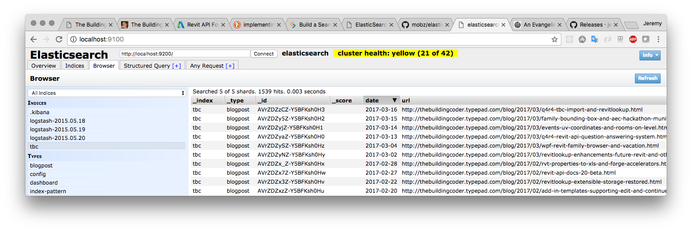

<head>
<meta http-equiv="Content-Type" content="text/html; charset=utf-8">
<link rel="stylesheet" type="text/css" href="bc.css">
<!--  --> 

</head>

<!---

- 12773525 [Get Area Scheme from an Area]
  https://forums.autodesk.com/t5/revit-api-forum/get-area-scheme-from-an-area/m-p/6949212

 @ElasticsearchQA #RevitAPI @AutodeskRevit #aec #bim #dynamobim @AutodeskForge 
RevitLookup updated #RevitAPI @AutodeskRevit #aec #bim #dynamobim @AutodeskForge 

I ran the first query on the collection of tbc blog posts imported into Elasticsearch to experiment for the question answering system Q4R4 Question Answering for Revit API and installed the elasticsearch-head web front end to better explore and understand my local Elasticsearch cluster
&ndash; Elasticsearch text field mapping
&ndash; Elasticsearch-head web front end
&ndash; More RevitLookup updates
&ndash; Get area scheme from an area...

-->

### Elasticsearch-Head, RevitLookup and Area Schemes

I ran the first query on the collection
of [tbc](https://github.com/jeremytammik/tbc) blog
posts imported into Elasticsearch to experiment for the question answering
system [Q4R4 *Question Answering for Revit API*](http://thebuildingcoder.typepad.com/blog/2017/03/q4r4-revit-api-question-answering-system.html).

No spectacular results to report so far, but at least it works.

I installed the [elasticsearch-head](https://github.com/mobz/elasticsearch-head) web
front end to better explore and understand my local Elasticsearch cluster.

Alexander made a small correction to the latest RevitLookup enhancements, reverting one of the changes made yesterday.

Lots of interesting solutions on
the [Revit API discussion forum](http://forums.autodesk.com/t5/revit-api-forum/bd-p/160),
including a nice little filtering sample that I picked up:

- [Elasticsearch text field mapping](#2)
- [Elasticsearch-head web front end](#3)
- [More RevitLookup updates](#4)
- [Get area scheme from an area](#5)

#### Elasticsearch Text Field Mapping

Yesterday, I described
the [q4r4 tbc import script `tbcimport.py`](http://thebuildingcoder.typepad.com/blog/2017/03/q4r4-tbc-import-and-revitlookup.html) that
I implemented to import all The Building Coder blog posts
into [Elasticsearch](https://www.elastic.co/products/elasticsearch) to
start experimenting with queries on them.

By default, the blog post `text` field was apparently imported and populated as a type `keyword` field:

<pre>
$ &#99;url -XGET 'localhost:9200/tbc/_mapping?pretty'
{
  "tbc" : {
    "mappings" : {
      "blogpost" : {
        "properties" : {
          "date" : {
            "type" : "date"
          },
          "nr" : {
            "type" : "long"
          },
          "text" : {
            "type" : "text",
            "fields" : {
              "keyword" : {
                "type" : "keyword",
                "ignore_above" : 256
              }
            }
          },
          "title" : {
            "type" : "text",
            "fields" : {
              "keyword" : {
                "type" : "keyword",
                "ignore_above" : 256
              }
            }
          },
          "url" : {
            "type" : "text",
            "fields" : {
              "keyword" : {
                "type" : "keyword",
                "ignore_above" : 256
              }
            }
          }
        }
      }
    }
  }
}
</pre>

Since I want to run a full text search on the blog post text, I need to change that mapping.
Actually, I might as well change it for the `title` field as well:

<pre>
$ &#99;url -XPUT 'localhost:9200/tbc?pretty' -H 'Content-Type: application/json' -d'
{
  "mappings": {
    "blogpost": {
      "properties": {
        "text": { "type":  "text" },
        "title": { "type":  "text" }
      }
    }
  }
}
'
</pre>

Now the mapping looks more suitable:

<pre>
$ &#99;url -XGET 'localhost:9200/tbc/_mapping?pretty'
{
  "tbc" : {
    "mappings" : {
      "blogpost" : {
        "properties" : {
          "date" : {
            "type" : "date"
          },
          "nr" : {
            "type" : "long"
          },
          "text" : {
            "type" : "text"
          },
          "title" : {
            "type" : "text"
          },
          "url" : {
            "type" : "text",
            "fields" : {
              "keyword" : {
                "type" : "keyword",
                "ignore_above" : 256
              }
            }
          }
        }
      }
    }
  }
}
</pre>

#### Elasticsearch-Head Web Front End 

Typing `curl` scripts on the command line is probably not the most effective way to explore my local Elasticsearch cluster.

I installed the [elasticsearch-head](https://github.com/mobz/elasticsearch-head) web front end to improve and simplify my interactive access.

As explained in its readme documentation, I must add two CORS settings to the elasticsearch config file `elasticsearch.yml` to allow elastic-head to connect to it:

<pre>
  http.cors.enabled: true
  http.cors.allow-origin: "*"
</pre>

With those settings in place, I can browse the cluster contents and start experimenting with queries on them:

#### More RevitLookup Updates

Two minor RevitLookup updates today, each encapsulated in an own new version.

Alexander Ignatovich, [@CADBIMDeveloper](https://github.com/CADBIMDeveloper), aka Александр Игнатович,
disagreed with one of the changes made yesterday and reverted that in his pull request
[#31 try-catch for each element in cycle is bad idea and looks ugly](https://github.com/jeremytammik/RevitLookup/pull/31).

Many thanks to Alexander for paying attention and fixing this!

That change is merged
in [RevitLookup release 2017.0.0.21](https://github.com/jeremytammik/RevitLookup/releases/tag/2017.0.0.21).

I was unhappy with a couple of warning messages during compilation and fixed those
in [RevitLookup release 2017.0.0.22](https://github.com/jeremytammik/RevitLookup/releases/tag/2017.0.0.22).

The most up-to-date version is always provided in the master branch of 
the [RevitLookup GitHub repository](https://github.com/jeremytammik/RevitLookup).

If you would like to access any part of the functionality that was removed when switching to the `Reflection` based approach, please grab it
from [release 2017.0.0.13](https://github.com/jeremytammik/RevitLookup/releases/tag/2017.0.0.13) or earlier.

I am also happy to restore any other code that was removed and that you would like preserved.
Simply create a pull request for that, explain your need and motivation, and I will gladly merge it back again.

#### Get Area Scheme from an Area

A [Revit API discussion forum](http://forums.autodesk.com/t5/revit-api-forum/bd-p/160) question
on [getting the area scheme from an area](https://forums.autodesk.com/t5/revit-api-forum/get-area-scheme-from-an-area/m-p/6949212) turned
out to be a pretty trivial matter of accessing and evaluating a simple series of parameter values on the area and area scheme:

**Question:** I'm not sure if this is possible but I've been trying to get the AREA_SCHEME_NAME from a collection of areas.

I've tried several ways without luck.

Can an area report what Area Scheme (Gross, Rentable) it belongs to?

**Answer:** Have you tried this?

<pre class="code">
  Area&nbsp;area;
   
  AreaScheme&nbsp;scheme&nbsp;=&nbsp;doc.GetElement(
  &nbsp;&nbsp;area.get_Parameter(
  &nbsp;&nbsp;&nbsp;&nbsp;BuiltInParameter.AREA_SCHEME_ID&nbsp;).AsElementId()&nbsp;)
  &nbsp;&nbsp;&nbsp;&nbsp;&nbsp;&nbsp;as&nbsp;AreaScheme;
   
  string&nbsp;areaSchemeName&nbsp;=&nbsp;scheme.get_Parameter(
  &nbsp;&nbsp;BuiltInParameter.AREA_SCHEME_NAME&nbsp;).AsString();
</pre>

**Response:** Thanks.

Here's the code for a little test to get the areas that are on the 'Gross Building' scheme:

<pre class="code">
IList&lt;SpatialElement&gt;&nbsp;areas&nbsp;=&nbsp;new&nbsp;FilteredElementCollector(&nbsp;doc&nbsp;)
&nbsp;&nbsp;.OfCategory(&nbsp;BuiltInCategory.OST_Areas&nbsp;)
&nbsp;&nbsp;.OfClass(&nbsp;typeof(&nbsp;SpatialElement&nbsp;)&nbsp;)
&nbsp;&nbsp;.Cast&lt;SpatialElement&gt;()
&nbsp;&nbsp;.ToList();
 
foreach(&nbsp;Element&nbsp;e&nbsp;in&nbsp;areas&nbsp;)
{
&nbsp;&nbsp;AreaScheme&nbsp;_scheme&nbsp;=&nbsp;doc.GetElement(&nbsp;
&nbsp;&nbsp;&nbsp;&nbsp;e.get_Parameter(&nbsp;BuiltInParameter.AREA_SCHEME_ID&nbsp;)
&nbsp;&nbsp;&nbsp;&nbsp;&nbsp;&nbsp;.AsElementId()&nbsp;)&nbsp;as&nbsp;AreaScheme;
 
&nbsp;&nbsp;string&nbsp;_AreaSchemeName&nbsp;=&nbsp;_scheme.get_Parameter(&nbsp;
&nbsp;&nbsp;&nbsp;&nbsp;BuiltInParameter.AREA_SCHEME_NAME&nbsp;).AsString();
 
&nbsp;&nbsp;if(&nbsp;_AreaSchemeName.ToString()&nbsp;==&nbsp;&quot;Gross&nbsp;Building&quot;&nbsp;)
&nbsp;&nbsp;{
&nbsp;&nbsp;&nbsp;&nbsp;TaskDialog.Show(&nbsp;&quot;Revit&quot;,&nbsp;_AreaSchemeName&nbsp;);
&nbsp;&nbsp;&nbsp;&nbsp;double&nbsp;ox&nbsp;=&nbsp;e.LookupParameter(&nbsp;&quot;Area&quot;&nbsp;).AsDouble();
&nbsp;&nbsp;&nbsp;&nbsp;TaskDialog.Show(&nbsp;&quot;Revit&quot;,&nbsp;ox.ToString()&nbsp;);
&nbsp;&nbsp;}
&nbsp;&nbsp;else&nbsp;{&nbsp;continue;&nbsp;}
}</pre>

**Answer:** First, there are a couple of unnecessary inefficiencies in the sample code snippet.

There is no need for the `Cast<>`, and more importantly, `ToList` adds no value for this use case and consumes both time and memory, cf.:

- [FindElement and collector optimisation](http://thebuildingcoder.typepad.com/blog/2012/09/findelement-and-collector-optimisation.html)
- [Collect all rooms on a given level](http://thebuildingcoder.typepad.com/blog/2017/03/events-uv-coordinates-and-rooms-on-level.html#6)
 
I refactored the parameter accessing code as a separate little method to retrieve the area scheme name from the area element like this:
 
<pre class="code">
///&nbsp;&lt;summary&gt;
///&nbsp;Return&nbsp;the&nbsp;area&nbsp;scheme&nbsp;name&nbsp;of&nbsp;a&nbsp;given&nbsp;area&nbsp;element
///&nbsp;using&nbsp;only&nbsp;generic&nbsp;Element&nbsp;Parameter&nbsp;access.
///&nbsp;&lt;/summary&gt;
static&nbsp;string&nbsp;GetAreaSchemeNameFromArea(&nbsp;Element&nbsp;e&nbsp;)
{
&nbsp;&nbsp;if(&nbsp;!(&nbsp;e&nbsp;is&nbsp;Area&nbsp;)&nbsp;)
&nbsp;&nbsp;{
&nbsp;&nbsp;&nbsp;&nbsp;throw&nbsp;new&nbsp;ArgumentException(
&nbsp;&nbsp;&nbsp;&nbsp;&nbsp;&nbsp;&quot;Expected&nbsp;Area&nbsp;element&nbsp;input&nbsp;argument.&quot;&nbsp;);
&nbsp;&nbsp;}
 
&nbsp;&nbsp;Document&nbsp;doc&nbsp;=&nbsp;e.Document;
 
&nbsp;&nbsp;Parameter&nbsp;p&nbsp;=&nbsp;e.get_Parameter(
&nbsp;&nbsp;&nbsp;&nbsp;BuiltInParameter.AREA_SCHEME_ID&nbsp;);
 
&nbsp;&nbsp;if(&nbsp;null&nbsp;==&nbsp;p&nbsp;)
&nbsp;&nbsp;{
&nbsp;&nbsp;&nbsp;&nbsp;throw&nbsp;new&nbsp;ArgumentException(
&nbsp;&nbsp;&nbsp;&nbsp;&nbsp;&nbsp;&quot;element&nbsp;lacks&nbsp;AREA_SCHEME_ID&nbsp;parameter&quot;&nbsp;);
&nbsp;&nbsp;}
 
&nbsp;&nbsp;Element&nbsp;areaScheme&nbsp;=&nbsp;doc.GetElement(&nbsp;p.AsElementId()&nbsp;);
 
&nbsp;&nbsp;p&nbsp;=&nbsp;areaScheme.get_Parameter(
&nbsp;&nbsp;&nbsp;&nbsp;BuiltInParameter.AREA_SCHEME_NAME&nbsp;);
 
&nbsp;&nbsp;if(&nbsp;null&nbsp;==&nbsp;p&nbsp;)
&nbsp;&nbsp;{
&nbsp;&nbsp;&nbsp;&nbsp;throw&nbsp;new&nbsp;ArgumentException(
&nbsp;&nbsp;&nbsp;&nbsp;&nbsp;&nbsp;&quot;area&nbsp;scheme&nbsp;lacks&nbsp;AREA_SCHEME_NAME&nbsp;parameter&quot;&nbsp;);
&nbsp;&nbsp;}
 
&nbsp;&nbsp;return&nbsp;p.AsString();
}
</pre>
  
With that in hand, the retrieval of all areas matching a given area scheme can we rewritten like this:
 
<pre class="code">
///&nbsp;&lt;summary&gt;
///&nbsp;Retrieve&nbsp;all&nbsp;areas&nbsp;belonging&nbsp;to&nbsp;
///&nbsp;a&nbsp;specific&nbsp;area&nbsp;scheme.
///&nbsp;&lt;/summary&gt;
public&nbsp;IEnumerable&lt;Element&gt;&nbsp;GetAreasInAreaScheme(
&nbsp;&nbsp;Document&nbsp;doc,
&nbsp;&nbsp;string&nbsp;areaSchemeName&nbsp;)
{
&nbsp;&nbsp;return&nbsp;new&nbsp;FilteredElementCollector(&nbsp;doc&nbsp;)
&nbsp;&nbsp;&nbsp;&nbsp;.OfCategory(&nbsp;BuiltInCategory.OST_Areas&nbsp;)
&nbsp;&nbsp;&nbsp;&nbsp;.OfClass(&nbsp;typeof(&nbsp;SpatialElement&nbsp;)&nbsp;)
&nbsp;&nbsp;&nbsp;&nbsp;.Where&lt;Element&gt;(&nbsp;e&nbsp;=&gt;&nbsp;areaSchemeName.Equals(
&nbsp;&nbsp;&nbsp;&nbsp;&nbsp;&nbsp;GetAreaSchemeNameFromArea(&nbsp;e&nbsp;)&nbsp;)&nbsp;);
}
</pre>
 
I added these two methods to [The Building Coder samples](https://github.com/jeremytammik/the_building_coder_samples)
in [release 2017.0.132.10](https://github.com/jeremytammik/the_building_coder_samples/releases/tag/2017.0.132.10).
 
You can see the new code
by [comparing with the preceding release 2017.0.132.9](https://github.com/jeremytammik/the_building_coder_samples/compare/2017.0.132.9...2017.0.132.10).

