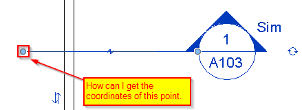
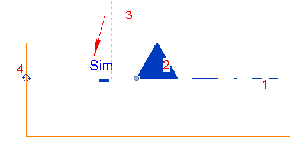

<head>
<meta http-equiv="Content-Type" content="text/html; charset=utf-8">
<link rel="stylesheet" type="text/css" href="bc.css">
<!--  --> 

</head>

<!---

- new ttt
  https://forums.autodesk.com/t5/revit-api-forum/how-can-i-get-the-coordinates-of-the-endpoints-for-a-section/m-p/6928342

 @ElasticsearchQA #RevitAPI @AutodeskRevit #aec #bim #dynamobim @AutodeskForge 

We discussed several examples of using the temporary transaction trick TTT in the past.
Here is a new exquisitly subtle variant for you to enjoy, provided by Frank @Fair59 Aarssen to get the coordinates of the endpoints for a section marker line segment. Question: I have a section marker that I would like to rotate around one of the endpoints of the line segment leader, but I haven't been able to figure out how to determine the endpoint coordinates...

-->

### TTT to Obtain Section Marker Endpoint

We discussed several examples of using the temporary transaction trick TTT in the past, and it is also mentioned in The Building Coder topic group
on [handling transactions and transaction groups](http://thebuildingcoder.typepad.com/blog/about-the-author.html#5.53).

Here is a new exquisitely subtle variant for you to enjoy, provided by
Frank [@Fair59](https://forums.autodesk.com/t5/user/viewprofilepage/user-id/2083518) Aarssen.

He uses it to answer 
the [Revit API discussion forum](http://forums.autodesk.com/t5/revit-api-forum/bd-p/160) question
on [how to get the coordinates of the endpoints for a section marker line segment](https://forums.autodesk.com/t5/revit-api-forum/how-can-i-get-the-coordinates-of-the-endpoints-for-a-section/m-p/6928342),
an issue that cannot be solved, according to the Revit development team:

**Question:** I have a section marker that I would like to rotate around one of the endpoints of the line segment leader, but I haven't been able to figure out how to determine the endpoint coordinates:

I'm able to get the bounding box of the overall section marker but not these specific coordinates.

How can I do this?

My bigger problem involves reversing the effects of the built-in "Mirror Project" tool, and part of that includes reference section markers inside of another section that has been flipped.

I would like to fix their orientation by rotating 180 degrees around the endpoint.

**Answer:** The development team says that the section marker element is not exposed as a specific element type, so this position cannot be read at this time. 

However, Frank provided a workaround.
 
A transaction needs to be active when you call the method, as the method temporarily hides the section tag and viewer_reference_label_text:
 
<pre class="code">
Line&nbsp;GetSectionLine(&nbsp;
&nbsp;&nbsp;Element&nbsp;section,&nbsp;
&nbsp;&nbsp;View&nbsp;view&nbsp;)
{
&nbsp;&nbsp;const&nbsp;double&nbsp;correction&nbsp;=&nbsp;21.130014403&nbsp;/&nbsp;304.8;
 
&nbsp;&nbsp;Document&nbsp;doc&nbsp;=&nbsp;section.Document;
&nbsp;&nbsp;Category&nbsp;cat&nbsp;=&nbsp;section.Category;
 
&nbsp;&nbsp;if(&nbsp;null&nbsp;==&nbsp;cat&nbsp;)
&nbsp;&nbsp;{
&nbsp;&nbsp;&nbsp;&nbsp;throw&nbsp;new&nbsp;ArgumentException(&nbsp;
&nbsp;&nbsp;&nbsp;&nbsp;&nbsp;&nbsp;&quot;Section&nbsp;has&nbsp;null&nbsp;category&quot;&nbsp;);
&nbsp;&nbsp;}
 
&nbsp;&nbsp;if(&nbsp;BuiltInCategory.OST_Viewers
&nbsp;&nbsp;&nbsp;&nbsp;!=&nbsp;(BuiltInCategory)&nbsp;(cat.Id.IntegerValue)&nbsp;)
&nbsp;&nbsp;{
&nbsp;&nbsp;&nbsp;&nbsp;throw&nbsp;new&nbsp;ArgumentException(&nbsp;
&nbsp;&nbsp;&nbsp;&nbsp;&nbsp;&nbsp;&quot;Expected&nbsp;section&nbsp;with&nbsp;OST_Viewers&nbsp;category&quot;&nbsp;);
&nbsp;&nbsp;}
 
&nbsp;&nbsp;FilteredElementCollector&nbsp;views&nbsp;
&nbsp;&nbsp;&nbsp;&nbsp;=&nbsp;new&nbsp;FilteredElementCollector(&nbsp;doc&nbsp;)
&nbsp;&nbsp;&nbsp;&nbsp;&nbsp;&nbsp;.OfClass(&nbsp;typeof(&nbsp;View&nbsp;)&nbsp;);
 
&nbsp;&nbsp;View&nbsp;viewFromSection&nbsp;=&nbsp;null;
 
&nbsp;&nbsp;foreach(&nbsp;View&nbsp;v&nbsp;in&nbsp;views&nbsp;)
&nbsp;&nbsp;{
&nbsp;&nbsp;&nbsp;&nbsp;if(&nbsp;section.Name&nbsp;==&nbsp;v.Name
&nbsp;&nbsp;&nbsp;&nbsp;&nbsp;&nbsp;&amp;&amp;&nbsp;section.GetTypeId()&nbsp;==&nbsp;v.GetTypeId()&nbsp;)
&nbsp;&nbsp;&nbsp;&nbsp;{
&nbsp;&nbsp;&nbsp;&nbsp;&nbsp;&nbsp;viewFromSection&nbsp;=&nbsp;v;
&nbsp;&nbsp;&nbsp;&nbsp;&nbsp;&nbsp;break;
&nbsp;&nbsp;&nbsp;&nbsp;}
&nbsp;&nbsp;}
&nbsp;&nbsp;if(&nbsp;viewFromSection&nbsp;==&nbsp;null&nbsp;)&nbsp;return&nbsp;null;
 
&nbsp;&nbsp;ViewFamilyType&nbsp;vType&nbsp;=&nbsp;doc.GetElement(&nbsp;
&nbsp;&nbsp;&nbsp;&nbsp;section.GetTypeId()&nbsp;)&nbsp;as&nbsp;ViewFamilyType;
 
&nbsp;&nbsp;BoundingBoxXYZ&nbsp;bb1&nbsp;=&nbsp;null;
 
&nbsp;&nbsp;using(&nbsp;SubTransaction&nbsp;st1&nbsp;=&nbsp;new&nbsp;SubTransaction(&nbsp;doc&nbsp;)&nbsp;)
&nbsp;&nbsp;{
&nbsp;&nbsp;&nbsp;&nbsp;st1.Start();
&nbsp;&nbsp;&nbsp;&nbsp;Parameter&nbsp;par&nbsp;=&nbsp;vType.get_Parameter(&nbsp;
&nbsp;&nbsp;&nbsp;&nbsp;&nbsp;&nbsp;BuiltInParameter.SECTION_TAG&nbsp;);
 
&nbsp;&nbsp;&nbsp;&nbsp;par.Set(&nbsp;ElementId.InvalidElementId&nbsp;);
 
&nbsp;&nbsp;&nbsp;&nbsp;par&nbsp;=&nbsp;vType.get_Parameter(&nbsp;
&nbsp;&nbsp;&nbsp;&nbsp;&nbsp;&nbsp;BuiltInParameter.VIEWER_REFERENCE_LABEL_TEXT&nbsp;);
 
&nbsp;&nbsp;&nbsp;&nbsp;par.Set(&nbsp;string.Empty&nbsp;);
&nbsp;&nbsp;&nbsp;&nbsp;view.Scale&nbsp;=&nbsp;1;
&nbsp;&nbsp;&nbsp;&nbsp;doc.Regenerate();
&nbsp;&nbsp;&nbsp;&nbsp;bb1&nbsp;=&nbsp;section.get_BoundingBox(&nbsp;view&nbsp;);
&nbsp;&nbsp;&nbsp;&nbsp;st1.RollBack();
&nbsp;&nbsp;}
 
&nbsp;&nbsp;BoundingBoxXYZ&nbsp;bb&nbsp;=&nbsp;section.get_BoundingBox(&nbsp;view&nbsp;);
&nbsp;&nbsp;XYZ&nbsp;pt1&nbsp;=&nbsp;bb.Min;
&nbsp;&nbsp;XYZ&nbsp;pt2&nbsp;=&nbsp;bb.Max;
&nbsp;&nbsp;if(&nbsp;bb1&nbsp;!=&nbsp;null&nbsp;)
&nbsp;&nbsp;{
&nbsp;&nbsp;&nbsp;&nbsp;pt1&nbsp;=&nbsp;bb1.Min;
&nbsp;&nbsp;&nbsp;&nbsp;pt2&nbsp;=&nbsp;bb1.Max;
&nbsp;&nbsp;}
&nbsp;&nbsp;XYZ&nbsp;Origin&nbsp;=&nbsp;viewFromSection.Origin;
&nbsp;&nbsp;XYZ&nbsp;ViewBasisX&nbsp;=&nbsp;viewFromSection.RightDirection;
&nbsp;&nbsp;XYZ&nbsp;ViewBasisY&nbsp;=&nbsp;viewFromSection.ViewDirection;
&nbsp;&nbsp;if(&nbsp;ViewBasisX.X&nbsp;&lt;&nbsp;0&nbsp;^&nbsp;ViewBasisX.Y&nbsp;&lt;&nbsp;0&nbsp;)
&nbsp;&nbsp;{
&nbsp;&nbsp;&nbsp;&nbsp;double&nbsp;d&nbsp;=&nbsp;pt1.Y;
&nbsp;&nbsp;&nbsp;&nbsp;pt1&nbsp;=&nbsp;new&nbsp;XYZ(&nbsp;pt1.X,&nbsp;pt2.Y,&nbsp;pt1.Z&nbsp;);
&nbsp;&nbsp;&nbsp;&nbsp;pt2&nbsp;=&nbsp;new&nbsp;XYZ(&nbsp;pt2.X,&nbsp;d,&nbsp;pt2.Z&nbsp;);
&nbsp;&nbsp;}
&nbsp;&nbsp;XYZ&nbsp;ToPlane1&nbsp;=&nbsp;pt1.Add(&nbsp;ViewBasisY.Multiply(&nbsp;
&nbsp;&nbsp;&nbsp;&nbsp;ViewBasisY.DotProduct(&nbsp;Origin.Subtract(&nbsp;pt1&nbsp;)&nbsp;)&nbsp;)&nbsp;);
 
&nbsp;&nbsp;XYZ&nbsp;ToPlane2&nbsp;=&nbsp;pt2.Subtract(&nbsp;ViewBasisY.Multiply(&nbsp;
&nbsp;&nbsp;&nbsp;&nbsp;ViewBasisY.DotProduct(&nbsp;pt2.Subtract(&nbsp;Origin&nbsp;)&nbsp;)&nbsp;)&nbsp;);
 
&nbsp;&nbsp;XYZ&nbsp;correctionVector&nbsp;=&nbsp;ToPlane2.Subtract(&nbsp;ToPlane1&nbsp;)
&nbsp;&nbsp;&nbsp;&nbsp;.Normalize().Multiply(&nbsp;correction&nbsp;);
 
&nbsp;&nbsp;XYZ&nbsp;endPoint0&nbsp;=&nbsp;ToPlane1.Add(&nbsp;correctionVector&nbsp;);
&nbsp;&nbsp;XYZ&nbsp;endPoint1&nbsp;=&nbsp;ToPlane2.Subtract(&nbsp;correctionVector&nbsp;);
 
&nbsp;&nbsp;return&nbsp;Line.CreateBound(&nbsp;endPoint0,&nbsp;endPoint1&nbsp;);
}
</pre>

**Response:** I have a few questions:
 
1. Where did you come up with the `const double correction = 21.130014403 / 304.8` value?
2. How do you distinguish between section vs. callout markers since they are both of category `OST_Viewers`?
3. Would this work for section markers that are only references (such as ones that reference drafting views)?
4. How do you know which endpoint is associated with the tail and which one is associated with the head?

**Answer 1:** The bounding box of a section line is the result of a number of elements:

- the line
- the section head
- the reference label text
- the cycle symbol

In the method, I "hide" 2 and 3.
You can't hide the cycle symbol, so the result is too large.
I simply added the resulting line without the correction to the project and measured the surplus length.
After checking that it is always the same, I implemented the constant  `correction = 21.130014403 / 304.8`.

The number 304.8 is the number of millimetres in a foot, so the division by that number converts from feet to mm:

<pre>
  inch = 25.4
  foot = 12 * inch = 304.8
  length_in_mm = length_in_feet / foot
</pre>
 
**Answer 2:** I didn't distinguish between section vs. callout markers, I merely presumed you had a section marker.

There are 2 ways to test:

<pre class="code">
  if(&nbsp;_vType.FamilyName&nbsp;==&nbsp;&quot;Section&quot;&nbsp;)
   
  if(&nbsp;_viewFromSection.GetType()&nbsp;
  &nbsp;&nbsp;==&nbsp;typeof(&nbsp;ViewSection&nbsp;)&nbsp;)
</pre>

Callouts are PlanViews or Elevations, as far as I know.
 
**Answer 3:** I don't know.
 
**Answer 4:** I'm afraid that is truly hidden. The Section Head and Tail stay in the same position when flipping the section, but the viewDirection and RightDirection changes.

The most you can get is a line in the View.RightDirection
 
<pre class="code">
  XYZ&nbsp;_direction&nbsp;=&nbsp;ToPlane2.Subtract(&nbsp;ToPlane1&nbsp;).
  &nbsp;&nbsp;Normalize();
   
  return&nbsp;_direction.IsAlmostEqualTo(&nbsp;ViewBasisX&nbsp;)&nbsp;
  &nbsp;&nbsp;?&nbsp;Line.CreateBound(&nbsp;endPoint0,&nbsp;endPoint1&nbsp;)&nbsp;
  &nbsp;&nbsp;:&nbsp;Line.CreateBound(&nbsp;endPoint1,&nbsp;endPoint0&nbsp;);
</pre>

Many thanks to Frank for this tricky solution, and many other extremely helpful and in-depth answers in 
the [Revit API discussion forum](http://forums.autodesk.com/t5/revit-api-forum/bd-p/160) as well!
