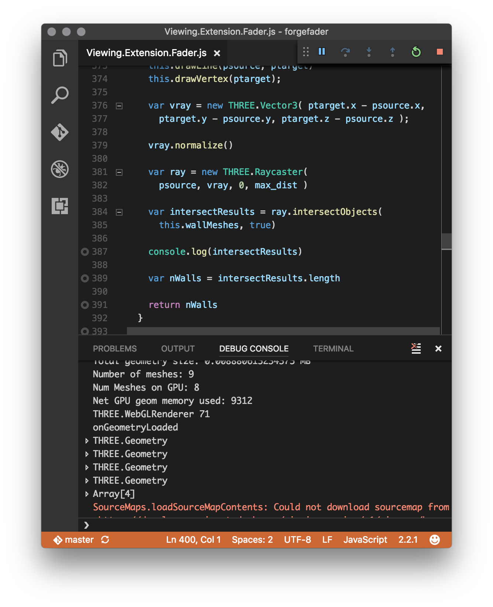
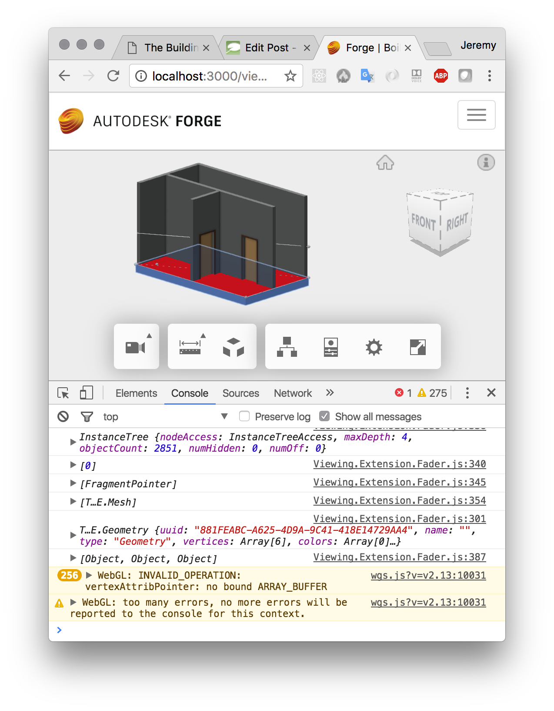

<head>
<meta http-equiv="Content-Type" content="text/html; charset=utf-8">
<link rel="stylesheet" type="text/css" href="bc.css">
<!--  --> 

</head>

<!---

Three.js Raytracing in the Forge Viewer http://bit.ly/forgeraytrace #RevitAPI @AutodeskRevit #bim #dynamobim @AutodeskForge #threejs #javascript

Yesterday, I showed how you can add custom geometry to the Forge viewer for debugging or other purposes and to control graphically what is going on.
Today, I address the ray tracing required to determine the number of walls between the user selected signal source point and the other target points spread out across the picked floor slab.
Please note the important information in the final section: the viewer implements built-in raycast functionality that obviates the need for this
&ndash; Connecting Visual Studio Code to the Chrome debugger
&ndash; Creating a three.js mesh from Forge viewer fragments
&ndash; Use built-in viewer raycast instead...

-->

### Three.js Raytracing in the Forge Viewer

I am still in Gothenburg supporting
the [Forge accelerator](http://thebuildingcoder.typepad.com/blog/2017/03/events-uv-coordinates-and-rooms-on-level.html#2) and 
working on my [ForgeFader](https://github.com/jeremytammik/forgefader) project.

ForgeFader implements the same end user functionality as
the [RvtFader](https://github.com/jeremytammik/RvtFader) Revit
C# .NET API add-in that I implemented last week.

Yesterday, I showed how you
can [add custom geometry to the Forge viewer](http://thebuildingcoder.typepad.com/blog/2017/03/adding-custom-geometry-to-the-forge-viewer.html)
for debugging or other purposes and to control graphically what is going on.

Today, I address the ray tracing required to determine the number of walls between the user selected signal source point and the other target points spread out across the picked floor slab.

Please note the important information in the final section: the viewer implements built-in raycast functionality that obviates the need for this:

- [Connecting Visual Studio Code to the Chrome debugger](#2)
- [Creating a three.js mesh from Forge viewer fragments](#3)
- [Use built-in viewer raycast instead](#4)

#### Connecting Visual Studio Code to the Chrome Debugger

I mentioned yesterday that I started using [Visual Studio Code](https://code.visualstudio.com) to
develop ForgeFader, inspired by Kean Walmsley's note
on [enabling Visual Studio Code’s integrated web debugging](http://through-the-interface.typepad.com/through_the_interface/2017/02/enabling-visual-studio-codes-integrated-web-debugging.html).

I now installed 
the [integration with Chrome debugging](https://marketplace.visualstudio.com/items?itemName=msjsdiag.debugger-for-chrome) and
verified that it works as expected.

It requires setting up the debugging commands to launch or attach to a process in `launch.json`.

I added the two following to launch the client and the server, respectively:

<pre class="prettyprint">
{
  "version": "0.2.0",
  "configurations": [
    {
      "name": "Launch forgedader client",
      "type": "chrome",
      "request": "launch",
      "url": "http://localhost:3000/viewer?urn=dXJuOmFkc2sub2JqZWN0czpvcy5vYmplY3Q6bW9kZWwyMDE3LTAzLTI3LTEwLTM4LTMzLWQ0MWQ4Y2Q5OGYwMGIyMDRlOTgwMDk5OGVjZjg0MjdlL2xpdHRsZV9ob3VzZV9mbG9vci5ydnQ",
      "port": 9222,
      "webRoot": "${workspaceRoot}/src/client"
    },
    {
      "name": "Launch forgefader server",
      "type": "node",
      "request": "launch",
      "program": "${workspaceRoot}/bin/start.js",
      "port": 3000
    }
  ]
}
</pre>

Here is a screen snapshot of the client debugging console:

I currently still do most of my debugging in Chrome itself, though.

Old habits die hard, and even young habits can be obstinate.

No, there are more compelling reasons.

The Chrome debugger displays more detailed data when exploring internals of local variables.

Furthermore, VS Code does not understand the connection between the source modules and the webpack-generated js output, just displaying helpful messages saying, 'Breakpoint ignored because generated code not found'.

#### Creating a Three.js Mesh from Forge Viewer Fragments

I tried to call the three.js `Raycaster.intersectObjects` on the Forge viewer fragments representing the Revit BIM walls with little success.

After struggling significantly with it, I determined that the easiest solution to achieve that was to analyse the Forge viewer fragments and generate new three.js mesh objects from them.

That is achieved by the following `getMeshFromRenderProxy` function for my specific use case covering Revit BIM floors and walls:

<pre class="prettyprint">
/////////////////////////////////////////////////////////////////
// getMeshFromRenderProxy - generate a new mesh from render proxy
//
// floor_normal: skip all triangles whose normal differs from that
// top_face_z: use for the face Z coordinates unless null
// debug_draw: draw lines and points representing edges and vertices
/////////////////////////////////////////////////////////////////
getMeshFromRenderProxy( render_proxy, floor_normal, top_face_z, debug_draw )
{
  var matrix = render_proxy.matrixWorld;
  var geometry = render_proxy.geometry;
  var attributes = geometry.attributes;

  var vA = new THREE.Vector3();
  var vB = new THREE.Vector3();
  var vC = new THREE.Vector3();

  var geo = new THREE.Geometry();
  var iv = 0;

  if (attributes.index !== undefined) {

    var indices = attributes.index.array || geometry.ib;
    var positions = geometry.vb ? geometry.vb : attributes.position.array;
    var stride = geometry.vb ? geometry.vbstride : 3;
    var offsets = geometry.offsets;

    if (!offsets || offsets.length === 0) {
      offsets = [{start: 0, count: indices.length, index: 0}];
    }

    for (var oi = 0, ol = offsets.length; oi &lt; ol; ++oi) {

      var start = offsets[oi].start;
      var count = offsets[oi].count;
      var index = offsets[oi].index;

      for (var i = start, il = start + count; i &lt; il; i += 3) {

        var a = index + indices[i];
        var b = index + indices[i + 1];
        var c = index + indices[i + 2];

        vA.fromArray(positions, a * stride);
        vB.fromArray(positions, b * stride);
        vC.fromArray(positions, c * stride);

        vA.applyMatrix4(matrix);
        vB.applyMatrix4(matrix);
        vC.applyMatrix4(matrix);

        var n = THREE.Triangle.normal(vA, vB, vC);

        if( null === floor_normal 
          || this.isEqualVectorsWithPrecision( n, floor_normal )) 
        {
          if( debug_draw )
          {
            this.drawVertex (vA);
            this.drawVertex (vB);
            this.drawVertex (vC);

            this.drawLine(vA, vB);
            this.drawLine(vB, vC);
            this.drawLine(vC, vA);
          }
          geo.vertices.push(new THREE.Vector3(vA.x, vA.y, null===top_face_z?vA.z:top_face_z));
          geo.vertices.push(new THREE.Vector3(vB.x, vB.y, null===top_face_z?vB.z:top_face_z));
          geo.vertices.push(new THREE.Vector3(vC.x, vC.y, null===top_face_z?vC.z:top_face_z));
          geo.faces.push( new THREE.Face3( iv, iv+1, iv+2 ) );
          iv = iv+3;
        }
      }
    }
  }
  else {

    throw 'Is this section of code ever called?'

    var positions = geometry.vb ? geometry.vb : attributes.position.array;
    var stride = geometry.vb ? geometry.vbstride : 3;

    for (var i = 0, il = positions.length; i &lt; il; i += 3) {

      var a = i;
      var b = i + 1;
      var c = i + 2;

      // copy code from above if this `else` clause is ever required
    }
  }
  // console.log(floor_top_vertices);
  // var geo = new THREE.Geometry(); 
  // var holes = [];
  // var triangles = ShapeUtils.triangulateShape( floor_top_vertices, holes );
  // console.log(triangles);
  // for( var i = 0; i &lt; triangles.length; i++ ){
  //   geo.faces.push( new THREE.Face3( triangles[i][0], triangles[i][1], triangles[i][2] ));
  // }
  console.log(geo);
  geo.computeFaceNormals();
  geo.computeVertexNormals();
  geo.computeBoundingBox();
  //geo.computeBoundingSphere();
  var mesh = new THREE.Mesh( geo, this._shaderMaterial );
  return mesh;
}
</pre>

I use it like this in `onGeometryLoaded` to generate meshes representing all the walls in my model:

<pre class="prettyprint">
  this.wallMeshes = fragIds.map((fragId) => {
    return this.getMeshFromRenderProxy( 
      this.viewer.impl.getRenderProxy( 
        this.viewer.model, fragId ), null, null, null );
  })
</pre>

Then, when the time is ripe, I can determine all walls between a given pair of source and target points like this:

<pre class="prettyprint">
/////////////////////////////////////////////////////////////////
// ray trace to count walls between source and target points
/////////////////////////////////////////////////////////////////
getWallCountBetween( psource, ptarget, max_dist )
{
  this.drawLine(psource, ptarget)
  this.drawVertex(ptarget);

  var vray = new THREE.Vector3( ptarget.x - psource.x, 
    ptarget.y - psource.y, ptarget.z - psource.z );

  vray.normalize()

  var ray = new THREE.Raycaster( 
    psource, vray, 0, max_dist )

  var intersectResults = ray.intersectObjects(
    this.wallMeshes, true)

  console.log(intersectResults)

  var nWalls = intersectResults.length

  return nWalls
}
</pre>

With that in hand, I am now ready to feed this information into a custom fragment shader to display the signal attenuation as a colour gradient across the top face of the floor.

The code above is included in
the [ForgeFader](https://github.com/jeremytammik/forgefader) project
in [release 0.0.16](https://github.com/jeremytammik/forgefader/releases/tag/0.0.16) and later.

#### Use Built-in Viewer Raycast Instead

I raised a question with the Forge viewer development team before embarking on the research to implement the above.

Unfortunately, due to time differences, they replied only after I had completed it.

Here is the result:

[Q@14:19] How can I invoke `Raycaster.intersectObjects` with viewer fragments?

[Q@21:35] I solved my `Raycaster.intersectObjects` challenge by [generating my own threejs mesh from the lmv original](https://github.com/jeremytammik/forgefader/compare/0.0.13...0.0.15).

[A@21:39] Ok well, for the record, you can intersect the whole scene using `viewer.impl.rayIntersect`, or you can do it per model via `model.rayIntersect`, or per mesh via `VBIntersector.rayCast`. The first two approaches take advantage of the spatial index acceleration structure.

[Q@21:42] Thank you for the info! I assume these approaches would offer multiple advantages: (i) more efficient (ii) easier to set up and use (iii) more fool- and future-proof. Do you agree?

[A@21:43] Probably better to use the high level hit testing APIs instead of messing with internal mesh representation directly... i.e. avoid doing fragile stuff like `this.viewer.impl.getRenderProxy(this.viewer.model, fragId)`.

In summary, please ignore the interesting solution I present above and use the built-in viewer functionality instead.

As a next step, I should rewrite my implementation to do so as well.

First, however, I want to get a first revision of this project up and running at all.

That means addressing the shader next, i.e., to calculate and display the signal attenuation gradient colouring.

