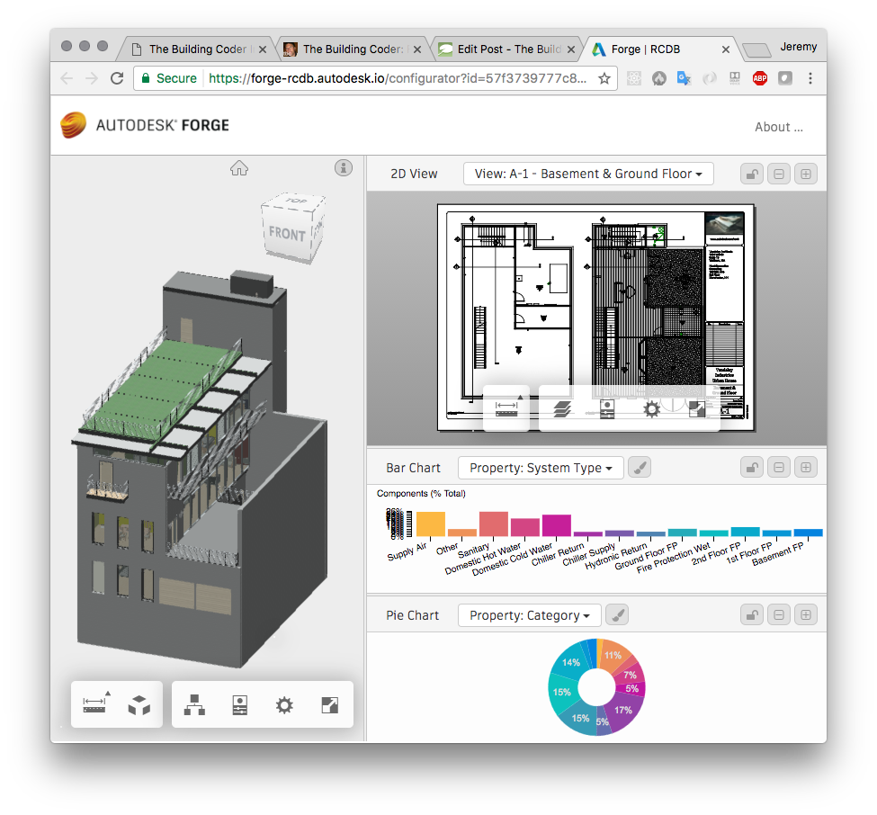

<head>
<meta http-equiv="Content-Type" content="text/html; charset=utf-8">
<link rel="stylesheet" type="text/css" href="bc.css">
<!--  --> 

</head>

<!---

- forge read-write
[Q] is it possible to write from Forge or only read information? Let’s imagine that you’d like to write properties into one file.
[A] right and wrong – right because while you can do anything in the viewer, you cannot save in the Forge bubble. However, you can decide to save into an external database and since unique IDs are preserved, you can reload the saved data next time. We got samples on GitHub doing that, e.g.,
https://forge-rcdb.autodesk.io/
https://forge-rcdb.autodesk.io/viewer?id=57efaead77c8eb0a560ef465
https://github.com/Autodesk-Forge/forge-rcdb.nodejs

I am evaluating the use of the BIM 360 products and Forge.
I would like to connect all my AEC data regarding construction, cost estimation, etc., through an Enterprise Service Bus (ESB).
[Q1] How can Forge connect with an ESB? Any further examples besides Forge-RCDB?
[A1] Rc-db sample is mainly a front-end website, so not applicable to an ESB principle unless you implement a socket.io protocol. However, the sample also has a server, which could be integrated with an ESB. You would need to write the adapter for it.
[Q2] How Forge could connect with Event Driven Architecture (EDA)?
[A2] Like all our samples, using an node.js npm module for the server, or socket.io for the client side.
[Q3] Other examples of integration Forge and graphics, such as charts, pie-charts, etc.?
[A3] Visual-report sample, and better still
https://forge-rcdb.autodesk.io/configurator?id=583ec7efebfb320e3cef26a5
https://forge-rcdb.autodesk.io/configurator?id=57f3739777c879f48ad54a44
Check this page for a basic routing table (WIP)
https://forge-rcdb.autodesk.io/configurator
[Q4] Assuming we have a model from designers, and the programmers create an app like this - https://calm-inlet-4387.herokuapp.com/ and set references between 3d -model, 2d – drawing and graphics (Chart, Pie-chart). What happens when the model is slightly modified? – geometry or properties - will the programmers need to manually recreate references between the objects for the app to work correctly? Or can they create it using rules from the model to keep track and maintain references between objects?
[A4] You can implement it any way you want. If you want to automate things and apply rules, you can. Forge is very basic and very flexible.
Programmers can also add custom data to the model, for example in Inventor using iProperties, which will also be available in Forge and can be used by custom logic to automate mappings between components, graphics and so on ... DbIds in viewer can change if original model is modified, however, for Revit projects, 2D/3D views dbIds will stay in sync: selecting a component in 2D can be automatically mapped to the corresponding element in the 3D view and vice-versa.

Forgify prepare a complex RVT model for Forge translation http://bit.ly/forgify #RevitAPI @AutodeskRevit #aec #bim #dynamobim @AutodeskForge

I am officially taking time off right now, but still jumping in here and there anyway, e.g. in an urgent case to reduce the RVT model file size before passing it into the Forge translator
&ndash; RvtForgify
&ndash; Forge read-write
&ndash; Forge in an Enterprise Service Bus...

-->

### Forgify

I am officially taking time off right now, but still jumping in here and there anyway, e.g. in an urgent case to reduce the RVT model file size before passing it into the Forge translator:

- [RvtForgify](#2)
- [Forge read-write](#3)
- [Forge in an Enterprise Service Bus](#4)

#### RvtForgify

I implemented a pretty radical and simple approach to prepare a complex RVT model for Forge translation: delete absolutely all views except the default `"{3D}"` one.

File size went down significantly, from 155 MB to 88 MB, i.e., 57 percent.

I am still waiting for customer feedback on the final results.

Also, more analysis is required on what elements this operation actually removes, and whether there is possibly much more stuff that could also be eliminated.

The code is super simple:

<pre class="code">
[Transaction(&nbsp;TransactionMode.Manual&nbsp;)]
public&nbsp;class&nbsp;CmdDeleteViews&nbsp;:&nbsp;IExternalCommand
{
&nbsp;&nbsp;///&nbsp;&lt;summary&gt;
&nbsp;&nbsp;///&nbsp;Delete&nbsp;all&nbsp;views&nbsp;except&nbsp;&quot;{3D}&quot;.
&nbsp;&nbsp;///&nbsp;&lt;/summary&gt;
&nbsp;&nbsp;void&nbsp;DeleteViews(&nbsp;Document&nbsp;doc&nbsp;)
&nbsp;&nbsp;{
&nbsp;&nbsp;&nbsp;&nbsp;IEnumerable&lt;View&gt;&nbsp;views
&nbsp;&nbsp;&nbsp;&nbsp;&nbsp;&nbsp;=&nbsp;new&nbsp;FilteredElementCollector(&nbsp;doc&nbsp;)
&nbsp;&nbsp;&nbsp;&nbsp;&nbsp;&nbsp;&nbsp;&nbsp;.OfClass(&nbsp;typeof(&nbsp;View&nbsp;)&nbsp;)
&nbsp;&nbsp;&nbsp;&nbsp;&nbsp;&nbsp;&nbsp;&nbsp;.Cast&lt;View&gt;()
&nbsp;&nbsp;&nbsp;&nbsp;&nbsp;&nbsp;&nbsp;&nbsp;.Where&lt;View&gt;(&nbsp;v&nbsp;=&gt;&nbsp;v.CanBePrinted
&nbsp;&nbsp;&nbsp;&nbsp;&nbsp;&nbsp;&nbsp;&nbsp;&nbsp;&nbsp;&amp;&amp;&nbsp;!v.IsTemplate
&nbsp;&nbsp;&nbsp;&nbsp;&nbsp;&nbsp;&nbsp;&nbsp;&nbsp;&nbsp;&amp;&amp;&nbsp;!&quot;{3D}&quot;.Equals(&nbsp;v.ViewName&nbsp;)&nbsp;);
 
&nbsp;&nbsp;&nbsp;&nbsp;ICollection&lt;ElementId&gt;&nbsp;ids&nbsp;=&nbsp;views
&nbsp;&nbsp;&nbsp;&nbsp;&nbsp;&nbsp;.Select&lt;View,&nbsp;ElementId&gt;(&nbsp;v&nbsp;=&gt;&nbsp;v.Id&nbsp;)
&nbsp;&nbsp;&nbsp;&nbsp;&nbsp;&nbsp;.ToList&lt;ElementId&gt;();
 
&nbsp;&nbsp;&nbsp;&nbsp;doc.Delete(&nbsp;ids&nbsp;);
&nbsp;&nbsp;}
 
&nbsp;&nbsp;public&nbsp;Result&nbsp;Execute(
&nbsp;&nbsp;&nbsp;&nbsp;ExternalCommandData&nbsp;commandData,
&nbsp;&nbsp;&nbsp;&nbsp;ref&nbsp;string&nbsp;message,
&nbsp;&nbsp;&nbsp;&nbsp;ElementSet&nbsp;elements&nbsp;)
&nbsp;&nbsp;{
&nbsp;&nbsp;&nbsp;&nbsp;UIApplication&nbsp;uiapp&nbsp;=&nbsp;commandData.Application;
&nbsp;&nbsp;&nbsp;&nbsp;UIDocument&nbsp;uidoc&nbsp;=&nbsp;uiapp.ActiveUIDocument;
&nbsp;&nbsp;&nbsp;&nbsp;Document&nbsp;doc&nbsp;=&nbsp;uidoc.Document;
 
&nbsp;&nbsp;&nbsp;&nbsp;using(&nbsp;Transaction&nbsp;tx&nbsp;=&nbsp;new&nbsp;Transaction(&nbsp;doc&nbsp;)&nbsp;)
&nbsp;&nbsp;&nbsp;&nbsp;{
&nbsp;&nbsp;&nbsp;&nbsp;&nbsp;&nbsp;tx.Start(&nbsp;&quot;Delete&nbsp;Views&quot;&nbsp;);
&nbsp;&nbsp;&nbsp;&nbsp;&nbsp;&nbsp;DeleteViews(&nbsp;doc&nbsp;);
&nbsp;&nbsp;&nbsp;&nbsp;&nbsp;&nbsp;tx.Commit();
&nbsp;&nbsp;&nbsp;&nbsp;}
&nbsp;&nbsp;&nbsp;&nbsp;return&nbsp;Result.Succeeded;
&nbsp;&nbsp;}
}
</pre>

The entire Visual Studio solution is provided in
the [RvtForgify GitHub repository](https://github.com/jeremytammik/RvtForgify).

Talking about Forge, here are frequently asked questions and answers on some basic aspects:

#### Forge Read-Write

**Question:** Is it possible to write from Forge or only read information?
Let’s imagine that I would like to write properties into a file.

**Answer:** Right and wrong &ndash; right, because while you can do anything you like in the viewer; however, you cannot save anything back to the Forge bubble.

However, you can decide to save into your own external database, and, since unique IDs are preserved, you can integrate that data into your seed CAD file, retranslate, and reload the saved data next time. Several samples on GitHub demonstrate doing that, e.g.:

- [forge-rcdb](https://forge-rcdb.autodesk.io)
- [Car seat sample](https://forge-rcdb.autodesk.io/viewer?id=57efaead77c8eb0a560ef465)
- [Source code](https://github.com/Autodesk-Forge/forge-rcdb.nodejs)

#### Forge in an Enterprise Service Bus

I am evaluating the use of the BIM 360 products and Forge.

I would like to connect all my AEC data regarding construction, cost estimation, etc., through an Enterprise Service Bus (ESB).

**Question 1:** How can Forge connect with an ESB? Any further examples besides Forge-RCDB?

**Answer 1:** The `rcdb` sample is mainly a front-end website, so not applicable to an ESB principle unless you implement a socket.io protocol. However, the sample also has a server, which could be integrated with an ESB. You would need to write the adapter for it.

**Question 2:** How could Forge connect with Event Driven Architecture (EDA)?

**Answer 2:** Like all our samples, using a node.js npm module for the server, or socket.io for the client side.

**Question 3:** Other examples of integration of Forge and graphics, such as charts, pie-charts, etc.?

**Answer 3:** You can look at our `visual-report` sample, and better still at this WIP sample of a basic routing table:

- [forge-rcdb configurator samples](https://forge-rcdb.autodesk.io/configurator)

Here are two examples of implemented routes:

- [210 King](https://forge-rcdb.autodesk.io/configurator?id=583ec7efebfb320e3cef26a5)
- [Office](https://forge-rcdb.autodesk.io/configurator?id=57f3739777c879f48ad54a44)

**Question 4:** Assuming we have a model from designers, and the programmers create an app like [LMV Nav Test](https://calm-inlet-4387.herokuapp.com) and set references between the 3D model, 2D drawings and report graphics like charts, and pie-charts. What happens when the original seed CAD model is slightly modified? Will the programmers need to manually recreate references between the objects for the app to work correctly? Or can they create them using rules from the model to keep track and maintain references between objects?

**Answer 4:** You can implement it any way you want. If you want to automate things and apply rules, you can. Forge is very basic and very flexible.

Programmers can also add custom data to the model, for example, in Inventor using iProperties, which will also be available in Forge and can be used by custom logic to automate mappings between components, graphics and so on.

The viewer `DbId`'s can change if the original model is modified; however, for Revit projects, 2D and 3D view `dbId`'s will stay in sync, so selecting a component in 2D can be automatically mapped to the corresponding element in the 3D view and vice-versa.

