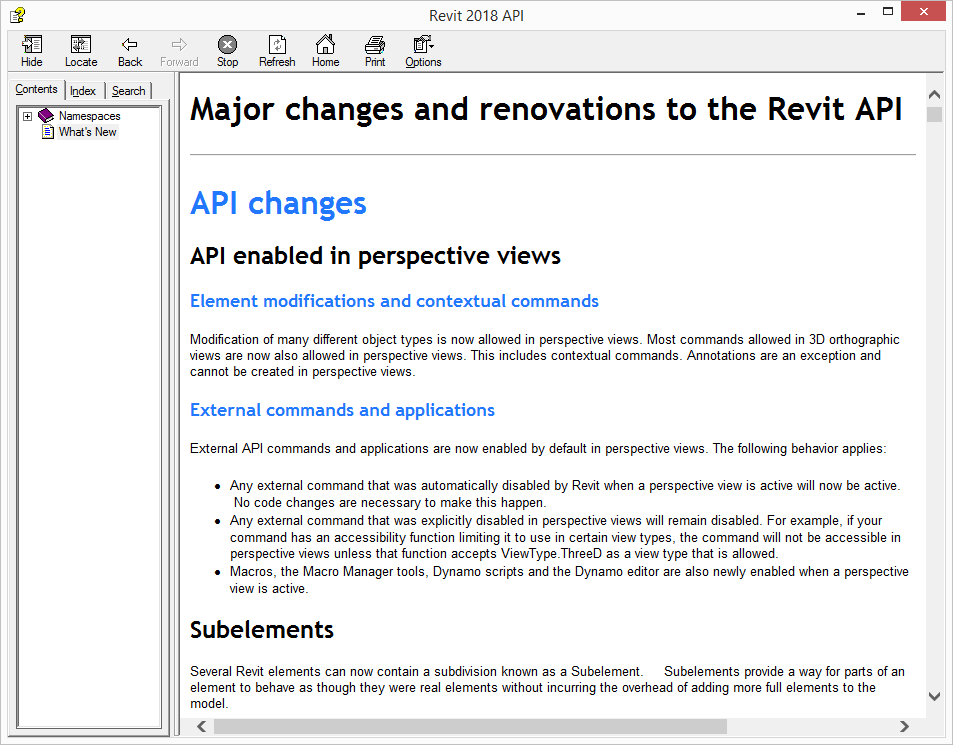

<head>
<meta http-equiv="Content-Type" content="text/html; charset=utf-8">
<link rel="stylesheet" type="text/css" href="bc.css">
<!--  --> 

</head>

<!---

What's New in the Revit 2018 API #RevitAPI @AutodeskRevit #aec #bim #dynamobim @AutodeskForge http://bit.ly/rvt2018apinews
Python Automatic HTML Heading Numbering Script #RevitAPI @AutodeskRevit #aec #bim #dynamobim @AutodeskForge @python_devv @html5doctor http://bit.ly/py_html_heading_numbering

The Revit 2018 includes numerous exciting enhancements for add-in developers.
The What's New section always provides very important information, both for discovering and exploring the newly added API functionality and for later reference.
If you encounter any issues migrating your existing add-ins between different versions, this is one of the first places to look...

-->

### What's New in the Revit 2018 API

The Revit 2018 API includes numerous exciting enhancements for add-in developers.

The highlights were pointed out in
the [DevDays Online API news](http://thebuildingcoder.typepad.com/blog/2017/03/revitlookup-enhancements-future-revit-and-other-api-news.html) presentation
and video recording.

That information is based on the contents of the *Revit Platform API Changes and Additions.docx* document included with
the [Revit 2018 software developers kit](http://thebuildingcoder.typepad.com/blog/2017/04/revitlookup-2018-and-forge-devcon-cfp.html#2) or 
SDK available from 
the [Revit Developer Centre](http://www.autodesk.com/developrevit).

It is also provided in the section on *What's New* in the Revit 2018 API help file `RevitAPI.chm` included with the SDK:

For convenient, easy and effective web searching, this blog post provides an online version of that information.

The *What's New* section always provides very important information, both for discovering and exploring the newly added API functionality and for later reference.

If you encounter any issues migrating your existing add-ins between different versions, this is one of the first places to look.

For detailed information on all other aspects of the Revit API, please refer to the rest of the API documentation and samples provided in the SDK.

The most important things to install and always keep at hand are:

- The Revit API help file `RevitAPI.chm`
- The Visual Studio solution containing all the SDK samples, `Samples\SDKSamples.sln`

You will need both of these constantly for research on how to solve specific Revit API programming tasks.

More in-depth official explanations and background information is provided by the
online [Revit API Developers Guide](http://help.autodesk.com/view/RVT/2018/ENU/?guid=GUID-F0A122E0-E556-4D0D-9D0F-7E72A9315A42) included 
in the [Revit 2018 Help](http://help.autodesk.com/view/RVT/2018/ENU).

#### What's New in Previous Versions

Here are links to discussions of *What's New in the Revit API* for previous versions:

- [What's New in the Revit 2010 API](http://thebuildingcoder.typepad.com/blog/2013/02/whats-new-in-the-revit-2010-api.html)
- [What's New in the Revit 2011 API](http://thebuildingcoder.typepad.com/blog/2013/02/whats-new-in-the-revit-2011-api.html)
- [What's New in the Revit 2012 API](http://thebuildingcoder.typepad.com/blog/2013/02/whats-new-in-the-revit-2012-api.html)
- [What's New in the Revit 2013 API](http://thebuildingcoder.typepad.com/blog/2013/03/whats-new-in-the-revit-2013-api.html)
- [What's New in the Revit 2014 API](http://thebuildingcoder.typepad.com/blog/2013/04/whats-new-in-the-revit-2014-api.html)
- [What's New in the Revit 2015 API](http://thebuildingcoder.typepad.com/blog/2014/04/whats-new-in-the-revit-2015-api.html)
- [What's New in the Revit 2016 API](http://thebuildingcoder.typepad.com/blog/2015/04/whats-new-in-the-revit-2016-api.html)
- [What's New in the Revit 2017 API](http://thebuildingcoder.typepad.com/blog/2016/04/whats-new-in-the-revit-2017-api.html)
- [What's New in the Revit 2017.1 API](http://thebuildingcoder.typepad.com/blog/2016/11/whats-new-in-the-revit-20171-api.html)

### Table of Contents

I implemented
the [Python script `number_html_headings.py` described below](#4) to
generate the HTML heading numbering for this table of contents:

- [API changes](#2)
    - [API enabled in perspective views](#2.1)
        - [Element modifications and contextual commands](#2.1.1)
        - [External commands and applications](#2.1.2)
    - [Subelements](#2.2)
        - [References and selection of subelements](#2.2.3)
    - [Changes to APIs for accessing version](#2.3)
    - [Asset API Changes](#2.4)
    - [Dynamic Updaters on Reload Latest](#2.5)
    - [Export to DWG/DXF API change](#2.6)
    - [UIDocument.PromptForFamilyInstancePlacement() behavioral change](#2.7)
    - [IndependentTag API changes](#2.8)
    - [Shared Coordinates API changes](#2.9)
    - [New DirectShape behaviors](#2.10)
    - [Rebar API Changes](#2.11)
    - [FabricSheet API Changes](#2.12)
    - [Structural Section API Changes](#2.13)
    - [ElectricalSystem API changes](#2.14)
    - [Pipe Pressure Loss Calculation change](#2.15)
    - [Corrected names of AutoRouteFailures values](#2.16)
    - [Obsolete API removal](#2.17)
        - [Classes](#2.17.4)
        - [Methods](#2.17.5)
        - [Properties](#2.17.6)
        - [Enumerated types](#2.17.7)
- [API additions](#3)
    - [API to get list of reviewable warnings from a Document](#3.18)
    - [API access to FamilyInstance references](#3.19)
    - [Multistory Stairs API](#3.20)
        - [Railings API additions related to MultistoryStairs](#3.20.8)
    - [Dimension API additions](#3.21)
        - [DimensionEqualityLabelFormating API](#3.21.9)
        - [UnitsFormatOptions in DimensionType](#3.21.10)
        - [OrdinateDimensionSetting](#3.21.11)
    - [SpatialElementTag API additions](#3.22)
    - [Geometry API additions](#3.23)
        - [Surface and Face API](#3.23.12)
        - [RevolvedSurface API](#3.23.13)
        - [RuledSurface API](#3.23.14)
    - [Level API addition](#3.24)
    - [Dockable Frame API Additions](#3.25)
    - [DirectContext3D for display of externally managed 3D graphics in Revit](#3.26)
        - [View update for DirectContext3D](#3.26.15)
    - [Coordination Model elements](#3.27)
    - [Shared Coordinates API additions](#3.28)
        - [Acquire and Publish coordinates API additions](#3.28.16)
        - [SiteLocation API additions](#3.28.17)
        - [ProjectLocation API additions](#3.28.18)
        - [Revit Link API additions](#3.28.19)
    - [Link API additions](#3.29)
        - [External Resource framework additions](#3.29.20)
        - [CADLinkType additions](#3.29.21)
        - [ImportInstance additions](#3.29.22)
        - [IFC Link API additions](#3.29.23)
    - [Workshared operation progress changed events](#3.30)
        - [WorksharedOperationProgressChangedEventArgs](#3.30.24)
        - [DocumentSaveToLocalProgressChangedEventArgs](#3.30.25)
        - [DataTransferProgressChangedEventArgs](#3.30.26)
        - [DocumentReloadLatestProgressChangedEventArgs](#3.30.27)
        - [DocumentSaveToCentralProgressChangedEventArgs](#3.30.28)
        - [CreateRelatedFileProgressChangedEventArgs](#3.30.29)
    - [Events related to linked resources](#3.31)
        - [LinkedResourceOpeningEventArgs](#3.31.30)
        - [LinkedResourceOpenedEventArgs](#3.31.31)
    - [Events related to parallel View Export](#3.32)
    - [DWG export API additions](#3.33)
        - [ExportDWGSettings API additions](#3.33.32)
    - [Part API additions](#3.34)
    - [Freeform Rebar API additions](#3.35)
    - [Custom Service for Freeform Rebar Definition](#3.36)
    - [HVACSpaceType and Space air ventilation API](#3.37)
    - [Energy Analysis API additions](#3.38)
    - [Electrical API additions](#3.39)
        - [Electrical Circuit Path API](#3.39.33)
        - [PanelScheduleView API](#3.39.34)
    - [MEPAnalyticalConnection API additions](#3.40)
    - [Fabrication API additions](#3.41)
        - [Hanger Rod additions](#3.41.35)
        - [Placing and splitting fabrication parts](#3.41.36)
        - [Fabrication Part export additions](#3.41.37)
        - [Fabrication Part status additions](#3.41.38)
        - [Fabrication part comparison](#3.41.39)
        - [Fabrication Part ancillary usage additions](#3.41.40)
        - [Fabrication Part custom data additions](#3.41.41)
        - [FabricationConfiguration additions](#3.41.42)
        - [Routing exclusions additions](#3.41.43)
        - [FabricationServiceButton addition](#3.41.44)

<h3 style="font-weight: bold">API Changes</h3>

<h2>API enabled in perspective views</h2>

<h3>Element modifications and contextual commands</h3>

Modification of many different object types is now allowed in perspective views. Most commands allowed in 3D orthographic views are now also allowed in perspective views. This includes contextual commands. Annotations are an exception and cannot be created in perspective views. 

<h3>External commands and applications</h3>

External API commands and applications are now enabled by default in perspective views. The following behavior applies:

<ul>
<li>Any external command that was automatically disabled by Revit when a perspective view is active will now be active.  No code changes are necessary to make this happen.</li>
<li>Any external command that was explicitly disabled in perspective views will remain disabled. For example, if your command has an accessibility function limiting it to use in certain view types, the command will not be accessible in perspective views unless that function accepts ViewType.ThreeD as a view type that is allowed.</li>
<li>Macros, the Macro Manager tools, Dynamo scripts and the Dynamo editor are also newly enabled when a perspective view is active.</li>
</ul>

<h2>Subelements</h2>

Several Revit elements can now contain a subdivision known as a Subelement.   Subelements provide a way for parts of an element to behave as though they were real elements without incurring the overhead of adding more full elements to the model.

Many Revit features &ndash; for example parameters, schedules, and tags &ndash; were designed to operate on Elements. As a result, the Revit code needs to represent objects as Elements for them to participate in those features. This can lead to scalability problems, because every Element adds overhead and adding many Elements may decrease the performance of the model.  

An alternative is to use Subelements. An element can expose a set of "Subelements" that it contains, specifying characteristics like their category and parameters, and certain Revit capabilities will treat those Subelements the same as ordinary Elements.  For example, a Subelement may contribute geometry to the main element and may be able to be selected independently of its parent Element.  It will possibly have its own (settable) type as well as an assigned category which can be different from its parent Element.

In the API, the new Subelement class is used to refer to either an Element or a specific subelement of a given Element.   It is typically directly related to a Reference to either the Element or the specific subelement.

Note that creation of new Subelements for a given element is not done generically.  Instead, the given Element may provide the ability to modify its definition, resulting in the creation of new Subelements.

Examples of Elements which may incorporate Subelements in practice include:

<ul>
<li>Rebar</li>
<li>RebarContainer</li>
<li>FabricSheet</li>
<li>Stairs elements which make up MultistoryStairs elements</li>
<li>Railing</li>
<li>ContinuousRail</li>
</ul>

To get access to a particular Subelement, you may use any of the following:

<ul>
<li>Subelement.Create()</li>
<li>Subelement.IsValidSubelementReference()</li>
<li>Document.GetSubelement(Reference) &ndash; Gets the subelement referenced by the input reference.</li>
<li>Document.GetSubelement(String uniqueId) &ndash; Gets the subelement referenced by a unique id string.</li>
<li>Element.GetSubelements() &ndash; Returns the collection of the Element's Subelements.</li>
</ul>

To access the basic Subelement properties, including its category and geometry, use:

<ul>
<li>Subelement.GetBoundingBox()</li>
<li>Subelement.GetGeometryObject()</li>
<li>Subelement.IsModifiable()</li>
<li>Subelement.Document</li>
<li>Subelement.Element</li>
<li>Subelement.Category</li>
<li>Subelement.GetReference()</li>
<li>Subelement.UniqueId</li>
<li>ExportUtils.GetExportId(Subelement)</li>
</ul>

To access the Subelement's type, use:

<ul>
<li>Subelement.TypeId</li>
<li>Subelement.ChangeTypeId()</li>
<li>Subelement.GetValidTypes()</li>
<li>Subelement.IsValidType()</li>
<li>Subelement.CanHaveTypeAssigned()</li>
</ul>

To access the Subelement's parameters, use:

<ul>
<li>Subelement.GetAllParameters()</li>
<li>Subelement.GetParameterValue()</li>
<li>Subelement.SetParameterValue()</li>
<li>Subelement.IsParameterModifiable()</li>
<li>Subelement.HasParameter()</li>
</ul>

For Elements which allow deletion of individual Subelements, use:

<ul>
<li>Element.DeleteSubelement()</li>
<li>Element.DeleteSubelements()</li>
<li>Element.CanDeleteSubelement()</li>
</ul>

<h3>References and selection of subelements</h3>

The new enumerated value:

<ul>
<li>ObjectType.Subelement</li>
</ul>

provides the ability to prompt a user to select subelements interactively using Selection.PickObject() or Selection.PickObjects().

The new enumerated value:

<ul>
<li>ElementReferenceType.REFERENCE_TYPE_SUBELEMENT</li>
</ul>

identify a reference as a reference to a specific subelement.

The new methods:

<ul>
<li>Reference.EqualTo()</li>
<li>Reference.Contains()</li>
</ul>

provide useful checks related to the contents of a given Reference object, applicable to subelement references as well as other types of references.

<h2>Changes to APIs for accessing version</h2>

The property:

<ul>
<li>Application.IsSubscriptionUpdate</li>
</ul>

has been deprecated and replaced by:

<ul>
<li>Application.SubVersionNumber</li>
</ul>

The new property returns a string representing the major-minor version number for the Revit application. For example, "2018.0.0".  This number is updated for major and minor updates. 

In RevitAddinUtility, the similar property:

<ul>
<li>RevitProduct.IsSubscriptionUpdate</li>
</ul>

has been deprecated and replaced by:

<ul>
<li>RevitProduct.ReleaseSubVersion</li>
</ul>

This new string property returns a similar major-minor version number for installed Revit versions.

<h2>Asset API Changes</h2>

The following API classes moved from the Autodesk.Revit.Utility namespace to a new namespace Autodesk.Revit.DB.Visual:

<ul>
<li>AssetProperty</li>
<li>AssetProperties</li>
<li>Asset</li>
<li>AssetSet</li>
<li>AssetType</li>
<li>AssetPropertyType</li>
<li>AssetPropertyDouble</li>
<li>AssetPropertyDoubleArray2d</li>
<li>AssetPropertyDoubleArray3d</li>
<li>AssetPropertyDoubleArray4d</li>
<li>AssetPropertyDoubleMatrix44</li>
<li>AssetPropertyFloat</li>
<li>AssetPropertyFloatArray</li>
<li>AssetPropertyInt64</li>
<li>AssetPropertyUInt64</li>
<li>AssetPropertyBoolean</li>
<li>AssetPropertyDistance</li>
<li>AssetPropertyEnum</li>
<li>AssetPropertyReference</li>
<li>AssetPropertyString</li>
<li>AssetPropertyTime</li>
<li>AssetPropertyList</li>
</ul>

Two AssetProperty properties were deprecated and replaced:

<ul>
<li>Deprecated &rarr; Replacement (new methods)</li>
<li>AssetPropertyDouble3.Value &rarr; IList&lt;double&gt; APropertyDouble3::GetValueAsDoubles() and XYZ APropertyDouble3::GetValueAsXYZ()</li>
<li>AssetPropertyDouble4.Value &rarr; IList&lt;double&gt; APropertyDouble4::GetValueAsDoubles()</li>
</ul>

Values for the enumerated type AssetPropertyType were renamed to better adhere to the API standards. Note that corresponding integer values are the same:

<ol start="0">
<li>APT_Unknown &rarr; Unknown</li>
<li>APT_Properties &rarr; Properties</li>
<li>APT_Boolean &rarr; Boolean</li>
<li>APT_Enum &rarr; Enumeration</li>
<li>APT_Integer &rarr; Integer</li>
<li>APT_Float &rarr; Float</li>
<li>APT_Double &rarr; Double1</li>
<li>APT_DoubleArray2d &rarr; Double2</li>
<li>APT_DoubleArray3d &rarr; Double3</li>
<li>APT_DoubleArray4d &rarr; Double4</li>
<li>APT_Double44 &rarr; Double44</li>
<li>APT_String &rarr; String</li>
<li>APT_Time &rarr; Time</li>
<li>N/A</li>
<li>APT_Distance &rarr; Distance</li>
<li>APT_Asset &rarr; Asset</li>
<li>APT_Reference &rarr; Reference</li>
<li>APT_Int64 &rarr; Longlong</li>
<li>APT_UInt64 &rarr; ULonglong</li>
<li>APT_List &rarr; List</li>
<li>APT_FloatArray &rarr; Float3</li>
</ol>

<h2>Dynamic Updaters on Reload Latest</h2>

Dynamic updaters are now triggered on Reload Latest for the elements added or changed in the central file.

<h2>Export to DWG/DXF API change</h2>

The new AutoCAD version (R2018) has been added to the ACADVersion enumerated type.  This is now the default version used when exporting to DWG and DXF.  

<h2>UIDocument.PromptForFamilyInstancePlacement() behavioral change</h2>

The behavior for UIDocument.PromptForFamilyInstancePlacement() was changed to be same as that of PickObject() methods &ndash; the placement operation will be cancelled when the "x" button of Revit is clicked during the placement operation instead of closing Revit directly.

<h2>IndependentTag API changes</h2>

The new method:

<ul>
<li>IndependentTag.Create()</li>
</ul>

replaces Autodesk.Revit.Creation.Document.NewTag(), which has been marked obsolete.  The new version supports tagging of either elements or subelements.

The new method:

<ul>
<li>IndependentTag.GetTaggedReference()</li>
</ul>

returns a reference to the item which has been tagged.  This reference may be to a Subelement, which can also be identified by:

<ul>
<li> IndependentTag.IsTaggedOnSubelement()</li>
</ul>

The following properties and their methods now throw more informative exceptions:

<ul>
<li>IndependentTag.LeaderElbow:</li>
<ul>
<li>IndependentTag.GetLeaderElbow() &ndash; "The tag does not have a leader or its leader is straight."</li>
<li>IndependentTag.SetLeaderElbow() &ndash; "The tag does not have a leader."</li>
</ul>
<li>IndependentTag.LeaderEnd:</li>
<ul>
<li>IndependentTag.GetLeaderEnd() &ndash; "There is no leader end because the tag does not use a free end leader."</li>
<li>IndependentTag.SetLeaderEnd() &ndash; "There is no leader end because the tag does not use a free end leader."</li>
</ul>
</ul>

The new property:

<ul>
<li>IndependentTag.HasElbow</li>
</ul>

indicates if the leader of the tag has an elbow point or not.

<h2>Shared Coordinates API changes</h2>

The following properties have been deprecated and replaced:

<ul>
<li>Deprecated member &rarr; New/replacement member</li>
<li>ProjectLocation.ProjectPosition &rarr; ProjectLocation.GetProjectPosition() and ProjectLocation.SetProjectPosition()</li>
<li>ProjectLocation.SiteLocation &rarr; ProjectLocation.GetSiteLocation()</li>
</ul>

<h2>New DirectShape behaviors</h2>

DirectShape elements now support new behaviors.  Other than the limitations listed below, no code changes are required to enable these new behaviors for DirectShape elements.

<ul>
<li>Tagging &ndash; if the element's assigned category supports tagging and a tag type exists, the DirectShape can be tagged with Revit tagging tools. </li>
<li>Edge dimensions &ndash; if the DirectShape is referenceable, it will now support dimensioning to edge references as well as face references.</li>
<li>Connector elements &ndash; in families, if the DirectShape is referenceable, DirectShape planar faces can be used to host connector elements.</li>
<li>Rebar hosting &ndash; if the DirectShape is of any of the following categories it can now act as a host for rebar:</li>
<ul>
<li>OST_StructuralFraming</li>
<li>OST_StructuralColumns</li>
<li>OST_StructuralFoundation</li>
<li>OST_StructuralConnections</li>
<li>OST_Walls</li>
<li>OST_Floors</li>
<li>OST_EdgeSlab</li>
<li>OST_Parts</li>
<li>OST_Stairs</li>
<li>OST_GenericModels</li>
</ul>
</ul>

<h2>Rebar API Changes</h2>

Rebar now supports two different layout options: shape-driven and free-form.  Previously, all Rebar elements were shape-driven.  The new methods:

<ul>
<li>Rebar.GetShapeDrivenAccessor() &ndash; Returns the Shape Driven interface which exposes specific Shape Driven logic.</li>
<li>Rebar.GetFreeFormAccessor() &ndash; Returns the Free Form interface which exposes specific Free Form logic.</li>
<li>Rebar.IsRebarFreeForm &ndash; Returns true if the rebar is free form and false if shape driven.</li>
<li>Rebar.IsRebarShapeDriven &ndash; Returns true if the rebar is shape driven and false if free form.</li>
</ul>

Rebar members which are applicable only for shape-driven rebar have been deprecated and replaced with equivalents in the class RebarShapeDrivenAccessor.  Specifically, the following members are deprecated:

<ul>
<li>Deprecated member &rarr; Replacement method</li>
<li>Rebar.GetDistributionPath() &rarr; RebarShapeDrivenAccessor.GetDistributionPath()</li>
<li>Rebar.ComputeDrivingCurves() &rarr; RebarShapeDrivenAccessor.ComputeDrivingCurves()</li>
<li>Rebar.GetBarPositionTransform() &rarr; RebarShapeDrivenAccessor.GetBarPositionTransform()</li>
<li>Rebar.ScaleToBox() &rarr; RebarShapeDrivenAccessor.ScaleToBox()</li>
<li>Rebar.ScaleToBoxFor3D() &rarr; RebarShapeDrivenAccessor.ScaleToBoxFor3D()</li>
<li>Rebar.SetLayoutAsSingle() &rarr; RebarShapeDrivenAccessor.SetLayoutAsSingle()</li>
<li>Rebar.SetLayoutAsFixedNumber() &rarr; RebarShapeDrivenAccessor.SetLayoutAsFixedNumber()</li>
<li>Rebar.SetLayoutAsMaximumSpacing() &rarr; RebarShapeDrivenAccessor.SetLayoutAsMaximumSpacing()</li>
<li>Rebar.SetLayoutAsNumberWithSpacing() &rarr; RebarShapeDrivenAccessor.SetLayoutAsNumberWithSpacing ()</li>
<li>Rebar.SetLayoutAsMinimumClearSpacing() &rarr; RebarShapeDrivenAccessor.SetLayoutAsMinimumClearSpacing()</li>
<li>Rebar.Normal &rarr; RebarShapeDrivenAccessor.Normal</li>
<li>Rebar.BarsOnNormalSide &rarr; RebarShapeDrivenAccessor.BarsOnNormalSide</li>
<li>Rebar.Height &rarr; RebarShapeDrivenAccessor.Height</li>
<li>Rebar.ArrayLength &rarr; RebarShapeDrivenAccessor.ArrayLength</li>
<li>Rebar.BaseFinishingTurns &rarr; RebarShapeDrivenAccessor.BaseFinishingTurns</li>
<li>Rebar.MultiplanarDepth &rarr; RebarShapeDrivenAccessor.MultiplanarDepth</li>
<li>Rebar.TopFinishingTurns &rarr; RebarShapeDrivenAccessor.TopFinishingTurns</li>
<li>Rebar.Pitch &rarr; RebarShapeDrivenAccessor.Pitch</li>
<li>Rebar.RebarShapeId &rarr; getter &ndash; Rebar.GetShapeId() and setter &ndash; RebarShapeDrivenAccessor.SetRebarShapeId()</li>
</ul>

<h2>FabricSheet API Changes</h2>

The following methods have been deprecated and replaced:

<ul>
<li>Deprecated method &rarr; Replacement method &ndash; Notes</li>
<li>FabricSheetType.SetLayoutAsCustomPattern(double, double , double , double , IList&lt;FabricWireItem&gt; , IList&lt;FabricWireItem&gt;) &rarr; FabricSheetType.SetLayoutAsCustomPattern(double, double , IList&lt;FabricWireItem&gt; , IList&lt;FabricWireItem&gt;) &ndash; Both end overhangs will now be read only and computed internally.</li>
<li>FabricWireItem.Create(double distance, double wireLength, ElementId wireType) &rarr; FabricWireItem.Create(double distance, double wireLength, ElementId wireType, double wireOffset) &ndash; Older calls can use the new method with wireOffset set to 0.0.</li>
</ul>

<h2>Structural Section API Changes</h2>

Several section properties were moved from subclasses to the base class StructuralSection:

<ul>
<li>StructuralSection.ElasticModulusStrongAxis</li>
<li>StructuralSection.ElasticModulusWeakAxis</li>
<li>StructuralSection.MomentOfInertiaStrongAxis</li>
<li>StructuralSection.MomentOfInertiaWeakAxis</li>
<li>StructuralSection.NominalWeight</li>
<li>StructuralSection.Perimeter</li>
<li>StructuralSection.PlasticModulusStrongAxis</li>
<li>StructuralSection.PlasticModulusWeakAxis</li>
<li>StructuralSection.PrincipalAxesAngle</li>
<li>StructuralSection.SectionArea</li>
<li>StructuralSection.ShearAreaStrongAxis</li>
<li>StructuralSection.ShearAreaWeakAxis</li>
<li>StructuralSection.TorsionalModulus</li>
<li>StructuralSection.TorsionalMomentOfInertia</li>
<li>StructuralSection.WarpingConstant</li>
</ul>

Several specific structural sections offer new constructors with additional input parameters.  Their original constructors have been deprecated.

<ul>
<li>StructuralSectionCSlopedFlange</li>
<li>StructuralSectionISlopedFlange</li>
<li>StructuralSectionISplitSlopedFlange</li>
<li>StructuralSectionLAngle</li>
<li>StructuralSectionStructuralTees</li>
</ul>

Several new specific structural section classes have been introduced:

<ul>
<li>StructuralSectionGeneralC &ndash; Defines parameters for Channel Cold Formed shape.</li>
<li>StructuralSectionGeneralCEx &ndash; Defines parameters for Channel with Fold Cold Formed shape.</li>
<li>StructuralSectionGeneralF &ndash; Defines parameters for Flat Bar.</li>
<li>StructuralSectionGeneralH &ndash; Defines parameters for Rectangular Pipe structural section.</li>
<li>StructuralSectionGeneralI &ndash; Defines parameters for general Double T shape.</li>
<li>StructuralSectionGeneralLA &ndash; Defines parameters for Angle Cold Formed structural section.</li>
<li>StructuralSectionGeneralLZ &ndash; Defines parameters for Z Cold Formed shape.</li>
<li>StructuralSectionGeneralR &ndash; Defines parameters for pipes.</li>
<li>StructuralSectionGeneralS &ndash; Defines parameters for Round Bar structural section.</li>
<li>StructuralSectionGeneralT &ndash; Defines parameters for Tees shape.</li>
<li>StructuralSectionGeneralU &ndash; Defines parameters for general Channel shape.</li>
<li>StructuralSectionGeneralW &ndash; Defines parameters for Angle structural section.</li>
</ul>

In addition, the API for structural sections offers a few other new capabilities:

<ul>
<li>StructuralSection.GetBoundarySize() &ndash; returns the size of the section boundary.</li>
<li>StructuralSection.AnalysisParams &ndash; accesses a common set of parameters for structural analysis which can be associated to a section.</li>
<li>StructuralSection.StructuralSectionGeneralShape &ndash; returns an enumerated value identifying the general shape for the structural section representing geometry only.</li>
<li>StructuralSectionHotRolled.FlangeThicknessLocation &ndash; this new property has been introduced for this class and the specific sections that derive from it.</li>
<li>StructuralSectionHotRolled.WebThicknessLocation &ndash; this new property has been introduced for this class and the specific sections that derive from it.</li>
<li>StructuralSectionUtils.GetStructuralElementDefinitionData() &ndash; returns data defining the section and the position of the structural element.</li>
</ul>

<h2>ElectricalSystem API changes</h2>

The following functions have been deprecated and replaced:

<ul>
<li>Deprecated member &rarr; New/replacement member</li>
<li>Autodesk.Revit.Creation.Document.NewElectricalSystem(Connector, ElectricalSystemType) &rarr; ElectricalSystem.Create(Connector, ElectricalSystemType)</li>
<li>Autodesk.Revit.Creation.Document.NewElectricalSystem(ICollection &lt; ElementId &gt; , ElectricalSystemType) &rarr; ElectricalSystem.Create(Document, IList&lt;ElementId&gt;, ElectricalSystemType)</li>
</ul>

<h2>Pipe Pressure Loss Calculation change</h2>

The methods:

<ul>
<li>Autodesk.Revit.DB.Plumbing.PipeSettings.GetPressLossCalculationServerInfo()</li>
<li>Autodesk.Revit.DB.Plumbing.PipeSettings.SetPressLossCalculationServerInfo()</li>
</ul>

have been deprecated in Revit 2018 and will be removed in the next version of Revit. Custom pipe pressure loss calculations will no longer be supported. Similar functionality can be accessed by setting Autodesk.Revit.DB.Plumbing.PipeSettings.AnalysisForClosedLoopHydronicPipingNetworks.

<h2>Corrected names of AutoRouteFailures values</h2>

The following BuiltInFailures.AutoRouteFailures values were renamed due to spelling errors:

<ul>
<li>AttemptToConnectNonSlopingElementToSlopedPipeWarning (renamed from AttemptToComnnectNonSlopingElementToSlopedPipeWarning)</li>
<li>AttemptToConnectNonSlopingElementToSlopedPipeError (renamed from AttemptToComnnectNonSlopingElementToSlopedPipeError)</li>
</ul>

<h2>Obsolete API removal</h2>

The following API members and classes which had previously been marked Obsolete have been removed in this release.  Consult the API documentation from prior releases for information on the replacements to use:

<h3>Classes</h3>

<ul>
<li>Autodesk.Revit.DB.Plumbing.PipeType</li>
<li>Autodesk.Revit.DB.Structure.FabricSheet.BentFabricWiresOrientation</li>
<li>Autodesk.Revit.DB.Structure.BentFabricWiresOrientation</li>
<li>Autodesk.Revit.DB.FormattedTextRun</li>
<li>Autodesk.Revit.DB.FormatUtils</li>
<li>Autodesk.Revit.DB.PropertySetLibrary</li>
</ul>

<h3>Methods</h3>

<ul>
<li>Autodesk.Revit.DB.NurbSpline.Create(IList&lt;XYZ&gt;, IList&lt;Double&gt;) : NurbSpline</li>
<li>Autodesk.Revit.DB.NurbSpline.Create(IList&lt;XYZ&gt;, IList&lt;Double&gt;, IList&lt;Double&gt;, Int32, Boolean, Boolean) : NurbSpline</li>
<li>Autodesk.Revit.Creation.Application.NewPlane(CurveArray) : Plane</li>
<li>Autodesk.Revit.Creation.Application.NewPlane(XYZ, XYZ) : Plane</li>
<li>Autodesk.Revit.Creation.Application.NewPlane(XYZ, XYZ, XYZ) : Plane</li>
<li>Autodesk.Revit.CurveAPIUtils.CreateNurbSpline(IList&lt;XYZ&gt;, IList&lt;Double&gt;) : NurbSpline</li>
<li>Autodesk.Revit.CurveAPIUtils.CreateNurbSpline(IList&lt;XYZ&gt;, IList&lt;Double&gt;, IList&lt;Double&gt;, Int32, Boolean, Boolean) : NurbSpline</li>
<li>Autodesk.Revit.Creation.Document.NewDuct(Connector, Connector, DuctType) : Duct</li>
<li>Autodesk.Revit.Creation.Document.NewDuct(XYZ, Connector, DuctType) : Duct</li>
<li>Autodesk.Revit.Creation.Document.NewDuct(XYZ, XYZ, DuctType) : Duct</li>
<li>Autodesk.Revit.DB.Structure.LoadCase.Create(Document, String, ElementId, LoadNatureCategory) : LoadCase</li>
<li>Autodesk.Revit.DB.WallFoundation.GetFoundationType() : WallFoundationType</li>
<li>Autodesk.Revit.DB.WallFoundation.SetFoundationType(WallFoundationType) : Void</li>
<li>Autodesk.Revit.DB.ViewSchedule.GroupHeaders(Int32, Int32, Int32, Int32) : Void</li>
<li>Autodesk.Revit.DB.PointClouds.PointCloudOverrides.GetPointCloudOverrideSettings(ElementId, String, Document) : PointCloudOverrideSettings</li>
<li>Autodesk.Revit.DB.PointClouds.PointCloudOverrides.GetPointCloudOverrideSettings(ElementId) : PointCloudOverrideSettings</li>
<li>Autodesk.Revit.DB.PointClouds.PointCloudOverrides.SetPointCloudOverrideSettings(ElementId, PointCloudOverrideSettings, String, Document) : Void</li>
<li>Autodesk.Revit.DB.PointClouds.PointCloudOverrides.SetPointCloudOverrideSettings(ElementId, PointCloudOverrideSettings) : Void</li>
<li>Autodesk.Revit.DB.DirectShape.CreateElement(Document, ElementId, String, String) : DirectShape</li>
<li>Autodesk.Revit.DB.DirectShape.CreateElementInstance(Document, ElementId, ElementId, String, Transform, String, String) : DirectShape</li>
<li>Autodesk.Revit.DB.DirectShape.SetGUIDs(String, String) : Void</li>
<li>Autodesk.Revit.DB.TextNode.GetFormattedTextRuns() : IList&lt;FormattedTextRun&gt;</li>
<li>Autodesk.Revit.DB.View.GetVisibility(Category) : Boolean</li>
<li>Autodesk.Revit.DB.View.SetVisibility(Category, Boolean) : Void</li>
<li>Autodesk.Revit.Creation.Document.NewFoundationWall(WallFoundationType, Wall) : WallFoundation</li>
<li>Autodesk.Revit.DB.Ellipse.Create(XYZ, double, double, XYZ, XYZ, double, double) : Ellipse</li>
</ul>

<h3>Properties</h3>

<ul>
<li>Autodesk.Revit.DB.Structure.LoadCase.NatureCategory : LoadNatureCategory</li>
<li>Autodesk.Revit.DB.Mechanical.MechanicalSystem.Flow : Double</li>
<li>Autodesk.Revit.DB.Mechanical.MechanicalSystem.StaticPressure : Double</li>
<li>Autodesk.Revit.DB.Plumbing.PipingSystem.FixtureUnits : Double</li>
<li>Autodesk.Revit.DB.Plumbing.PipingSystem.Flow : Double</li>
<li>Autodesk.Revit.DB.Plumbing.PipingSystem.StaticPressure : Double</li>
<li>Autodesk.Revit.DB.ScheduleField.HasTotals : Boolean</li>
<li>Autodesk.Revit.DB.Events.DocumentPrintingEventArgs.Settings : IPrintSetting</li>
<li>Autodesk.Revit.DB.Events.ViewPrintingEventArgs.Settings : IPrintSetting</li>
<li>Autodesk.Revit.DB.Mechanical.DuctFittingAndAccessoryConnectorData.Coordination : Transform</li>
<li>Autodesk.Revit.DB.Plumbing.PipeFittingAndAccessoryConnectorData.Coordination : Transform</li>
<li>Autodesk.Revit.UI.Events.DialogBoxShowingEventArgs.HelpId : Int32</li>
</ul>

<h3>Enumerated types</h3>

<ul>
<li>Autodesk.Revit.DB.Structure.LoadNatureCategory</li>
<li>Autodesk.Revit.Attributes.TransactionMode.Automatic</li>
</ul>

<h3 style="font-weight: bold">API Additions</h3>

<h2>API to get list of reviewable warnings from a Document</h2>

The new method:

<ul>
<li>Document.GetWarnings()</li>
</ul>

returns a list of failure messages generated from persistent (reviewable) warnings accumulated in the document.

<h2>API access to FamilyInstance references</h2>

The following new methods have been added to enable easy access to FamilyInstance references that correspond to reference planes and reference lines in the family.  Some use the options in the new enumeration FamilyInstanceReferenceType as input to identify "Strong" or "Weak" references or specific positional references in each of the 3 coordinate directions (as determined by the possible values of parameter "Is Reference" of reference planes and parameter "Reference" of reference lines in families).

<ul>
<li>FamilyInstance.GetReferences()</li>
<li>FamilyInstance.GetReferenceByName()</li>
<li>FamilyInstance.GetReferenceType()</li>
<li>FamilyInstance.GetReferenceName()</li>
</ul>

<h2>Multistory Stairs API</h2>

The new class:

<ul>
<li>MultistoryStairs</li>
</ul>

allows users to create stairs that span multiple levels.  A multistory stairs element may contain multiple stairs whose extents are governed by base and top levels.

This element will contain one or more Stairs elements. Stairs elements are either a reference instance which is copied to each level covered by groups of identical stairs instances which share the same level height, or individual Stairs instances which are not connected to a group with the same level height. By default, when adding new levels to the multistory stair, new stairs will be added to the group.

For groups of duplicate stairs at different levels, the instances can be found as Subelements of the Stairs element.

Stairs in a connected group can be edited together by modifying the associated Stairs instance. For specific floors that need special designs, stairs can be separated from a group by unpinning the element, changes made to this Stairs will not affect other any other instance in the element, or add the stairs back into the group if needed. However, any changes made to the stair will be lost since the stair's properties will be overridden by the group specifications.

The class has the following methods:

<ul>
<li>MultistoryStairs.AddStairsByLevelIds() &ndash; Adds stairs to the given levels.</li>
<li>MultistoryStairs.RemoveStairsByLevelIds() &ndash; Removes stairs from the given levels. This will regenerate the multistory stairs from the remaining levels.</li>
<li>MultistoryStairs.CanAddStair() &ndash; Checks if the input level id can be used to add stairs into multistory stairs.</li>
<li>MultistoryStairs.CanRemoveStair() &ndash; Checks if the input level id can be used to remove stairs from the multistory stairs.</li>
<li>MultistoryStairs.GetAllConnectedLevels() &ndash; Gets the ids of all levels connected to the multistory stairs.</li>
<li>MultistoryStairs.GetAllStairsIds() &ndash; Gets the ids of all of the stairs in the multistory stairs.</li>
<li>MultistoryStairs.Create() &ndash; Creates a multistory stairs object.</li>
<li>MultistoryStairs.GetStairsConnectedBaseLevelIds() &ndash; Gets the base level ids for the stairs contained in this multi-story stairs element.</li>
<li>MultistoryStairs.IsPinned() &ndash; Checks if a stair is pinned as a propagation group.</li>
<li>MultistoryStairs.Unpin() &ndash; Unpins a story of stairs by giving its base level id.</li>
<li>MultistoryStairs.Pin() &ndash; Pins a unpinned stairs back into a story of a stairs.</li>
</ul>

The new property:

<ul><li>Stairs.MultistoryStairsId</li></ul>

indicates the id of the MultistoryStairs element to which the Stairs belong to.

Related to StairsPath functionality for multistory stairs, the new functions:

<ul>
<li>StairsPath.CanCreateOnMultistoryStairs()</li>
<li>StairsPath.CreateOnMultistoryStairs()</li>
</ul>

support creation of new stairs paths in a plan view for stairs instances in a multistory stairs element.

<h3>Railings API additions related to MultistoryStairs</h3>

The new methods:

<ul>
<li>Railing.GetMultistoryStairsPlacementLevels()</li>
<li>Railing.SetMultistoryStairsPlacementLevels()</li>
<li>Railing.GetSubelementOnLevel()</li>
</ul>

provide access to Railing elements which are hosted on members of Multistory stairs.  

The method:

<ul>
<li>Railing.Create(Document document, ElementId multistoryStairsId, ElementId levelId,  ElementId railingTypeId,  RailingPlacementPosition placePosition)</li>
</ul>

Creates new railings on a given level of given multistory stairs &ndash; the created railing will be hosted on stairs included in MultistoryStairs element on given level.  

The existing method:

<ul>
<li>Railing.Create(Document document, ElementId stairsId,  ElementId railingTypeId,  RailingPlacementPosition placePosition)</li>
</ul>

now supports MulitstoryStairs elements as input, where the resulting railing will be added on every level of given stairs in multistory stairs.

The existing property:

<ul>
<li>Railing.HostId</li>
</ul>

now supports stairs or stairs components coming from MultistoryStairs elements as well. 

<h2>Dimension API additions</h2>

<h3>DimensionEqualityLabelFormating API</h3>

The new class:

<ul>
<li>DimensionEqualityLabelFormatting</li>
</ul>

allows users to set dimension equality formulas for continuous linear or angular dimensions.

New methods and properties include:

<ul>
<li>DimensionEqualityLabelFormatting.LeadingSpaces</li>
<li>DimensionEqualityLabelFormatting.LabelType</li>
<li>DimensionEqualityLabelFormatting.Prefix</li>
<li>DimensionEqualityLabelFormatting.Suffix</li>
<li>DimensionEqualityLabelFormatting.GetFormatOptions()</li>
<li>DimensionEqualityLabelFormatting.SetFormatOptions()</li>
</ul>

The following new methods in DimensionType allow access to equality formulas:

<ul>
<li>DimensionType.GetEqualityFormula()</li>
<li>DimensionType.SetEqualityFormula()</li>
</ul>

<h3>UnitsFormatOptions in DimensionType</h3>

The new functions:

<ul>
<li>DimensionType.GetUnitsFormatOptions()</li>
<li>DimensionType.SetUnitsFormatOptions()</li>
</ul>

allow users to get or set the FormatOptions for a DimensionType.

<h3>OrdinateDimensionSetting</h3>

The new class:

<ul>
<li>OrdinateDimensionSetting</li>
</ul>

allows users to customize ordinate dimensions.

The new enum:

<ul>
<li>OrdinateDimensionLineStyle</li>
</ul>

allows users to choose continuous or segmented line styles for their dimensions.

The new enums:

<ul>
<li>OrdinateTextOrientation</li>
<li>OrdinateTextPosition</li>
</ul>

allows users to orient text in relation to the dimension lines or witness lines.

The new enum:

<ul>
<li>OrdinateOriginVisibility</li>
</ul>

allows users to control visibility of their dimensions.

New properties in OrdinateDimensionSetting include:

<ul>
<li>OrdinateDimensionSetting.DimLineLength</li>
<li>OrdinateDimensionSetting.DimLineStyle</li>
<li>OrdinateDimensionSetting.TextOrientation</li>
<li>OrdinateDimensionSetting.TextPosition</li>
<li>OrdinateDimensionSetting.OriginVisibility</li>
<li>OrdinateDimensionSetting.OriginTickMarkId</li>
</ul>

The following new methods in DimensionType allow access to the OrdinateDimensionSetting:

<ul>
<li> DimensionType.GetOrdinateDimensionSetting()</li>
<li> DimensionType.SetOrdinateDimensionSetting()</li>
</ul>

<h2>SpatialElementTag API additions</h2>

SpatialElementTag is the base element for Room, Area and Space tag classes.

The following new properties have been added:

<ul>
<li>SpatialElementTag.HasElbow &ndash; Identifies if the tag's leader has an elbow point or not.</li>
<li>SpatialElementTag.TagText &ndash; The text displayed by the tag.</li>
</ul>

<h2>Geometry API additions</h2>

<h3>Surface and Face API</h3>

The new method:

<ul>
<li>Face.GetSurface()</li>
</ul>

returns a copy of the Face's surface.

In order to correctly leverage this information, the following properties:

<ul>
<li>Face.OrientationMatchesSurfaceOrientation</li>
<li>Surace.OrientationMatchesParametricOrientation</li>
</ul>

identify whether the face's orientation matches the surface orientation, and whether the surface orientation is the same as or opposite to its parametric orientation.

<h3>RevolvedSurface API</h3>

The new method:

<ul>
<li>RevolvedSurface.GetProfileCurveInWorldCoordinates()</li>
</ul>

returns a copy of the profile curve expressed in the world coordinate system.

<h3>RuledSurface API</h3>

The newly added methods:

<ul>
<li>RuledSurface.HasFirstProfilePoint()</li>
<li>RuledSurface.HasSecondProfilePoint()</li>
</ul>

check if a point was used to define one of the surface profiles. 

<h2>Level API addition</h2>

The new method:

<ul>
<li>Level.FindAssociatedPlanViewId()</li>
</ul>

finds the id of the first available associated floor or structural plan view associated with this level. If there are multiple associated views, Revit will return the first one it finds. 

<h2>Dockable Frame API Additions</h2>

Custom Dockable Panes now support the ability for display of dynamic UI elements, such as web browser controls.  This capability should be used in cases where the UI for the pane (layout, buttons etc.) changes dynamically during the lifetime of the Revit session. To use this, implement the new interface:

<ul>
<li>IFrameworkElementCreator</li>
</ul>

with a method:

<ul>
<li>IFrameworkElementCreator.CreateFrameworkElement()</li>
</ul>

that constructs and returns the WPF Framework element to embedded in the Revit dockable pane.

The new members:

<ul>
<li>DockablePaneProviderData.GetFrameworkElement()</li>
<li>DockablePaneProviderData.FrameworkElementCreator</li>
</ul>

provide the ability for the application to deliver a dynamic framework element to the dockable pane.  

The property:

<ul>
<li>DockablePaneProviderData.FrameworkElement</li>
</ul>

is now allowed to be null, in situations where the FrameworkElement will be dynamically created.

<h2>DirectContext3D for display of externally managed 3D graphics in Revit</h2>

DirectContext3D is an API for displaying external graphics in the context of a Revit model. The API provides a more connected experience to users who can benefit from the ability to display graphics based on geometry that is either difficult or costly to fully import into Revit.

An external plugin can use DirectContext3D API to render geometry by encoding it inside pairs of vertex and index buffers. The communication between Revit and the plugin is accomplished with the use of the External Service Framework (ESF). Revit's rendering pipeline asks registered servers of the DirectContext3D service to provide the geometry for rendering. Revit informs the plugin about certain rendering state, such as the display style and whether the current rendering pass is for transparent objects. The plugin also communicates certain information to Revit, such as the bounding box of the geometry to be rendered.

The following list contains the major added classes and their descriptions:

<ul>
<li>DirectContext3D.IDirectContext3DServer &ndash; The interface to be implemented by a server of the DirectContext3D external service.</li>
<li>DirectContext3D.DrawContext &ndash; A class that provides drawing functionality for use by DirectContext3D servers.</li>
<li>DirectContext3D.Vertex &ndash; The base class for DirectContext3D vertices.</li>
<li>DirectContext3D.VertexStream &ndash; The base class for DirectContext3D vertex streams, which are used to write vertex data into buffers.</li>
<li>DirectContext3D.VertexBuffer &ndash; A buffer that stores vertex data for rendering.</li>
<li>DirectContext3D.VertexFormat &ndash; A specification of the format of vertex data contained in a piece of geometry.</li>
<li>DirectContext3D.VertexFormatBits &ndash; Vertex format (i.e., the type of data associated with a vertex) represented as a number.</li>
<li>DirectContext3D.IndexPrimitive &ndash; The base class for index buffer primitives.</li>
<li>DirectContext3D.IndexStream &ndash; The base class for DirectContext3D index streams, which are used to write vertex indices into buffers.</li>
<li>DirectContext3D.IndexBuffer &ndash; A buffer that stores vertex indices for rendering.</li>
<li>DirectContext3D.EffectInstance &ndash; An effect instance that controls the appearance of geometry.</li>
<li>DirectContext3D.PrimitiveType &ndash; Type of geometry primitive represented as a number.</li>
<li>DirectContext3D.ClipPlane &ndash; A set of parameters representing a clip plane in DirectContext3D.</li>
<li>DirectContext3D.ProjectionMethod &ndash; The projection method used by a DirectContext3D camera.</li>
<li>DirectContext3D.Camera &ndash; A collection of camera settings for DirectContext3D.</li>
</ul>

<h3>View update for DirectContext3D</h3>

The new method:

<ul>
<li>UIDocument.UpdateAllOpenViews()</li>
</ul>

updates all open views in this document after elements have been changed, deleted, selected or de-selected. Graphics in the views are fully redrawn regardless of which elements have changed.  This function should only rarely be needed, but might be required when working with graphics drawn from outside of Revit's transactions and elements, for example, when using DirectContext3D.

This function is potentially expensive as many views may be updated at once, including regeneration of view's geometry and redisplay of graphics.  Thus for most situations it is recommended that API applications rely on the Revit application framework to update views more deliberately.

<h2>Coordination Model elements</h2>

Coordination Model elements current can link the graphical contents of Navisworks files and display them in context in the Revit session.  These elements leverage the DirectContext3D framework to handle the display of the external graphics, and are the first example of an element which is designated to contain a link to externally managed DirectContext3D graphics (a "DirectContext3D handle" element).

There is no current way to create new Coordination Model or DirectContext3D handle elements via the API.  However, you can use the capabilities of the related classes to identify and manipulate these elements. These elements can be accessed from the following new API classes:

<ul>
<li>DirectContext3DHandleUtils &ndash; provides utilities related to the identification of types and instances which are storing externalized graphics via DirectContext3D</li>
<li>DirectContext3DHandleSettings &ndash; provides access to override settings applied to DirectContext3D handles through the Visibility/Graphics dialog.</li>
<li>DirectContext3DHandleOverrides &ndash; provides access to DirectContext3DHandleSettings that are stored by a given view.</li>
</ul>

<h2>Shared Coordinates API additions</h2>

<h3>Acquire and Publish coordinates API additions</h3>

Two new methods allow users to acquire and publish shared coordinates:

<ul>
<li>Document.AcquireCoordinates() &ndash; Acquires project coordinates from the specified link instance. This method accepts both Revit links (RevitLinkInstance) and DWG links (ImportInstance).</li>
<li>Document.PublishCoordinates() &ndash; Publishes shared coordinates to the specified ProjectLocation. This method works only on Revit links.</li>
</ul>

<h3>SiteLocation API additions</h3>

Two new read-only properties have been added to provide information on the geographic coordinate system of a SiteLocation. The geographic coordinate system is imported from a DWG file from AutoCAD or Civil 3D. If the SiteLocation has geographic coordinate system information, the latitude and longitude of the SiteLocation will be updated automatically

when the model's Survey Point is moved.

<ul>
<li>SiteLocation.GeoCoordinateSystemId &ndash; Gets a string corresponding to geographic coordinate system ID, such as "AMG-50" or "Beijing1954/a.GK3d-40" for the SiteLocation. The value will be the empty string if there is no coordinate system specified for the SiteLocation. This property is read-only.</li>
<li>SiteLocation.GeoCoordinateSystemDefinition &ndash; Gets an XML string describing the geographic coordinate system. The value will be the empty string if there is no coordinate system specified for the SiteLocation. This property is read-only.</li>
</ul>

The new method:

<ul>
<li>SiteLocation.IsCompatibleWith() &ndash; Checks whether the geographic coordinate system of this site is compatible with the given site.</li>
</ul>

<h3>ProjectLocation API additions</h3>

The new method:

<ul>
<li>ProjectLocation.Create()</li>
</ul>

creates a new ProjectLocation in the document from the given SiteLocation and with the given name.

<h3>Revit Link API additions</h3>

The new method:

<ul>
<li>static RevitLinkInstance.Create(ImportPlacement placement)</li>
</ul>

creates a new instance of a linked Revit project (RevitLinkType). Instances will be placed origin-to-origin or by shared coordinates according to the input placement type.

<h2><h2>Link API additions</h2>

<h3>External Resource framework additions</h3>

IExternalResourceServer can now provide CAD format links, DWF markups, and IFC links. The following new values have been added to ExternalResourceType.BuiltInExternalResourceTypes:

<ul>
<li>CADLink</li>
<li>DWFMarkup</li>
<li>IFCLink</li>
</ul>

<h3>CADLinkType additions</h3>

Several new methods have been added to CADLinkType as part of external resource framework enhancements:

<ul>
<li>CADLinkType.Reload() &ndash; Reloads a CADLinkType from its current location.</li>
<li>CADLinkType.Reload(CADLinkOptions options) &ndash; Reloads a CADLinkType from its current location, including options to control graphic overrides.</li>
<li>CADLinkType.LoadFrom(String fileName) &ndash; Reloads a CADLinkType from a file on disk.</li>
<li>CADLinkType.LoadFrom(ExternalResourceReference reference) &ndash; Reloads a CADLinkType from an external resource server.</li>
</ul>

<h3>ImportInstance additions</h3>

Several new methods have been added to create ImportInstance elements, either from an existing link type or a new link type:

<ul>
<li>ImportInstance.Create(DWGImportOptions options, String fileName) &ndash; Creates a new DWG or DXF type and instance from a file on disk.</li>
<li>ImportInstance.Create(DWGImportOptions options, ExternalResourceReference reference) &ndash; Creates a new DWG or DXF type and instance from an external resource location.</li>
<li>ImportInstance.Create(ElementId typeId) &ndash; Creates a new DWG or DXF instance from an existing CADLinkType.</li>
</ul>

Methods have also been added to create DGN, SAT, and SKP links from external resource locations.

<h3>IFC Link API additions</h3>

The method:

<ul>
<li>RevitLinkType.UpdateFromIFC()</li>
</ul>

now has a new version that allows for an ExternalResourceReference to specify the IFC file name, instead of a string.

<h2><h2>Workshared operation progress changed events</h2>

Subscribe to the Autodesk.Revit.ApplicationServices.Application.WorksharedOperationProgressChanged event to be notified when progress has changed during Collaboration for Revit's synchronizing.

This event consists of several phases. Different event arguments are used during each phase.

<h3>WorksharedOperationProgressChangedEventArgs</h3>

The new class:

<ul>
<li>Autodesk.Revit.DB.Events.WorksharedOperationProgressChangedEventArgs</li>
</ul>

provides a base class for event arguments for worksharing-based progress events.

<h3>DocumentSaveToLocalProgressChangedEventArgs</h3>

The new class:

<ul>
<li>Autodesk.Revit.DB.Events.DocumentSaveToLocalProgressChangedEventArgs provides information during the save to local phase of the DocumentSynchronizingWithCentralProgressChanged event.</li>
</ul>

It has the following properties:

<ul>
<li>DocumentSaveToLocalProgressChangedEventArgs.Location &ndash; Full path of the central model which is to be synchronized.</li>
<li>DocumentSaveToLocalProgressChangedEventArgs.Status &ndash; Gets the API event status, which reflects the current operation execution status.</li>
<li>DocumentSaveToLocalProgressChangedEventArgs.BeforeSaveToCentral &ndash; True if the "save to local" operation is occurring before "save to central"; false if after.</li>
<li>DocumentSaveToLocalProgressChangedEventArgs.FinishedStreams &ndash; The number of streams finished since the last time this event was raised.</li>
<li>DocumentSaveToLocalProgressChangedEventArgs.TotalStreams &ndash; The total expected number of streams to save to local.</li>
<li>DocumentSaveToLocalProgressChangedEventArgs.SaveToLocalFinished &ndash; Indicates if the current "save to local" operation has finished.</li>
</ul>

<h3>DataTransferProgressChangedEventArgs</h3>

The new class:

<ul>
<li>Autodesk.Revit.DB.Events.DataTransferProgressChangedEventArgs provides information during the data transferring phase of the WorksharedOperationProgressChanged event. Generally, it is not used directly because It is the base class of Autodesk.Revit.DB.Events.DocumentReloadLatestProgressChangedEventArgs, Autodesk.Revit.DB.Events.DocumentSaveToCentralProgressChangedEventArgs and Autodesk.Revit.DB.Events.CreateRelatedFileProgressChangedEventArgs</li>
</ul>

It has the following properties:

<ul>
<li>DataTransferProgressChangedEventArgs.Location &ndash; Full path of the central model which is to be synchronized.</li>
<li>DataTransferProgressChangedEventArgs.Status &ndash; Gets the API event status, which reflects the current operation execution status.</li>
<li>DataTransferProgressChangedEventArgs.TransferMode &ndash; Gets the transfer mode of this data transfer progress. It is Undefined or Download or Upload;</li>
<li>DataTransferProgressChangedEventArgs.Speed &ndash; Gets data transfer speed(bytes/second).</li>
<li>DataTransferProgressChangedEventArgs.FinishedSize &ndash; Gets downloaded or uploaded data size, in bytes, since the last time this event was raised.</li>
<li>DataTransferProgressChangedEventArgs.TotalSize &ndash; Total expected data size to download, in bytes.</li>
</ul>

<h3>DocumentReloadLatestProgressChangedEventArgs</h3>

The new class:

<ul>
<li>Autodesk.Revit.DB.Events.DocumentReloadLatestProgressChangedEventArgs provides information during the reload latest phase of the DocumentSynchronizingWithCentralProgressChanged event.</li>
</ul>

It has the following properties:

<ul>
<li>DocumentReloadLatestProgressChangedEventArgs.Location &ndash; The full path of the central model which is to be synchronized.</li>
<li>DocumentReloadLatestProgressChangedEventArgs.Status &ndash; Gets API event status, reflecting the current operation execution status.</li>
<li>DocumentReloadLatestProgressChangedEventArgs.TransferMode &ndash; Returns DataTransferMode.Download.</li>
<li>DocumentReloadLatestProgressChangedEventArgs.RetryTimes &ndash; The number of times Revit has tried to Reload Latest. Its value is '0' at the first time.</li>
<li>DocumentReloadLatestProgressChangedEventArgs.Speed &ndash; Download speed(bytes/second) in this event.</li>
<li>DocumentReloadLatestProgressChangedEventArgs.FinishedSize &ndash; The downloaded data size, in bytes, since the last time this event was raised.</li>
<li>DocumentReloadLatestProgressChangedEventArgs.TotalSize &ndash; Total expected data size to download, in bytes.</li>
<li>DocumentReloadLatestProgressChangedEventArgs.IsMerging &ndash; Indicates if Revit is merging downloaded data.</li>
<li>DocumentReloadLatestProgressChangedEventArgs.ReloadLatestFinished &ndash; Indicates if current 'reload latest' progress is finished or not.</li>
</ul>

<h3>DocumentSaveToCentralProgressChangedEventArgs</h3>

The new class:

<ul>
<li>Autodesk.Revit.DB.Events.DocumentSaveToCentralProgressChangedEventArgs</li>
</ul>

provides information during the save to central phase of the DocumentSynchronizingWithCentralProgressChanged event.

It has the following properties:

<ul>
<li>DocumentSaveToCentralProgressChangedEventArgs.Location &ndash; Full path of the central model which is to be synchronized.</li>
<li>DocumentSaveToCentralProgressChangedEventArgs.Status &ndash; Gets API event status, reflecting the current operation execution status.</li>
<li>DocumentSaveToCentralProgressChangedEventArgs.TransferMode &ndash; Returns DataTransferMode.Upload.</li>
<li>DocumentSaveToCentralProgressChangedEventArgs.RetryTimes &ndash; The number of times Revit has tried to Save to Central." Its value is '0' at the first time.</li>
<li>DocumentSaveToCentralProgressChangedEventArgs.Speed &ndash; Upload speed(bytes/second) of saving to central.</li>
<li>DocumentSaveToCentralProgressChangedEventArgs.FinishedSize &ndash; The uploaded data size, in bytes, since the last time this event was raised.</li>
<li>DocumentSaveToCentralProgressChangedEventArgs.TotalSize &ndash; Total expected uploaded data size to save to central, in bytes.</li>
<li>DocumentSaveToCentralProgressChangedEventArgs.SaveToCentralFinished &ndash; Indicates if current 'save to central' is finished or not.</li>
<li>DocumentSaveToCentralProgressChangedEventArgs.FailureDueToConflicts &ndash; Indicates the 'save to central' failure is caused by submission, that is because another user finished saving to central first.</li>
</ul>

<h3>CreateRelatedFileProgressChangedEventArgs</h3>

The new class:

<ul>
<li>Autodesk.Revit.DB.Events.CreateRelatedFileProgressChangedEventArgs</li>
</ul>

provides information about the creation of related files when Collaboration for Revit models are being opened.

It has the following properties:

<ul>
<li>CreateRelatedFileProgressChangedEventArgs.Location &ndash; Full path of the model which is to be created related file.</li>
<li>CreateRelatedFileProgressChangedEventArgs.Status &ndash; Gets API event status, reflecting the current operation execution status.</li>
<li>CreateRelatedFileProgressChangedEventArgs.TransferMode &ndash; Returns DataTransferMode.Download.</li>
<li>CreateRelatedFileProgressChangedEventArgs.CreatingCloudSharedLocal &ndash; Indicates if it is creating cloud shared local model.</li>
<li>CreateRelatedFileProgressChangedEventArgs.DownloadFinished &ndash; Indicates if all data downloads are finished or not.</li>
<li>CreateRelatedFileProgressChangedEventArgs.Speed &ndash; Download speed(bytes/second) in this event.</li>
<li>CreateRelatedFileProgressChangedEventArgs.FinishedSize &ndash; The downloaded data size, in bytes, since the last time this event was raised.</li>
<li>CreateRelatedFileProgressChangedEventArgs.TotalSize &ndash; Total expected data size to download, in bytes.</li>
<li>CreateRelatedFileProgressChangedEventArgs.FullDownload &ndash; Indicates if download the full data of the document, which will take longer than subsequent downloads.</li>
</ul>

<h2><h2>Events related to linked resources</h2>

Subscribe to the events:

<ul>
<li>Autodesk.Revit.ApplicationServices.Application.LinkedResourceOpening</li>
<li>Autodesk.Revit.ApplicationServices.ControlledApplication.LinkedResourceOpening</li>
<li>Autodesk.Revit.ApplicationServices.Application.LinkedResourceOpened</li>
<li>Autodesk.Revit.ApplicationServices.ControlledApplication.LinkedResourceOpened</li>
</ul>

to be notified when Revit is just about to open, or has just opened, a linked resource.  This event supports linked resources of the following types: Revit; IFC; CAD (DWG, DXF, DGN, SAT).

This event will not be raised if there are no updates for linked CAD or IFC resources.  The linked resource cannot be modified during these events.

<h3>LinkedResourceOpeningEventArgs</h3>

The new class:

<ul>
<li>Autodesk.Revit.DB.Events.LinkedResourceOpeningEventArgs</li>
</ul>

provides information when Revit is just about to open a linked resource.

It has the following properties:

<ul>
<li>LinkedResourceOpeningEventArgs.ResourceType &ndash; Linked resource type.</li>
<li>LinkedResourceOpeningEventArgs.LinkedResourcePathName &ndash; The linked resource name to open.</li>
</ul>

<h3>LinkedResourceOpenedEventArgs</h3>

The new class:

<ul>
<li>Autodesk.Revit.DB.Events.LinkedResourceOpenedEventArgs</li>
</ul>

provides information when Revit finishes opening a linked resource.

It has the following properties:

<ul>
<li>LinkedResourceOpenedEventArgs.ResourceType &ndash; Linked resource type.</li>
<li>LinkedResourceOpenedEventArgs.LinkedResourcePathName &ndash; Opened linked resource name.</li>
</ul>

<h2><h2>Events related to parallel View Export</h2>

When exporting multiple views to DWF or DWFx format, Revit uses background processes to compute the exported output of several views in parallel. Two events are now available on the Application class to receive progress updates during a parallel export operation:

<ul>
<li>Application.ViewExporting &ndash; This event is raised when Revit is just about to export a view of the document.</li>
<li>Application.ViewExported &ndash; This event is raised immediately after Revit has finished exporting a view of the document.</li>
</ul>

These two events are raised only during accelerated export jobs, in which views are exported in parallel using a background process. Accelerated export only occurs when exporting to DWF formats and not combining views into a single file. 

<h2>DWG export API additions</h2>

The new enumerated value:

<ul>
<li>ExportColorMode.TrueColorPerView</li>
</ul>

specified an export where all colors from the Revit project will be exported as 24-bit RGB values as specified in view (where ExportColorMode.TrueColor indicates that all colors from the Revit project will be exported as 24-bit RGB values as specified in object styles)

The new properties:

<ul>
<li>ACADExportOptions.UseHatchBackgroundColor</li>
<li>ACADExportOptions.HatchBackgroundColor</li>
</ul>

allow assignment of a color that will be set as hatch background color on the exported hatch. 

<h3><h3>ExportDWGSettings API additions</h3>

Two new methods have been added to ExportDWGSettings:

<ul>
<li>ExportDWGSettings.FindByName() &ndash; Returns the pre-defined DWG export settings in the given document with the specified name.</li>
<li>ExportDWGSettings.GetActivePredefinedSettings() &ndash; Returns the active DWG export settings in the given document.</li>
</ul>

Note that these functions cannot return in-session settings. To access the in-session settings, save them with a name.

<h2>Part API additions</h2>

The new methods:

<ul>
<li>Part.ResetFaceOffset()</li>
<li>Part.GetFaceOffset()</li>
</ul>

provide further capabilities to access and manipulate the offset applied to a given face of a Part element.

<h2>Freeform Rebar API additions</h2>

The new methods:

<ul>
<li>Rebar.CreateFreeForm(Document, RebarBarType, Element, IList&lt;IList&lt;Curve&gt;&gt;, out RebarFreeFormValidationResult)</li>
<li>Rebar.CreateFreeForm(Document, RebarBarType, Element, IList&lt;CurveLoop&gt;, out RebarFreeFormValidationResult)</li>
</ul>

Create a freeform rebar instance where bars are created along the path of the input curves.  Constraints cannot later be added to this rebar.

Freeform rebar instances have properties accessible from the RebarFreeFormAccessor class, which can be obtained from:

<ul>
<li>Rebar.GetFreeFormAccessor()</li>
</ul>

The new members of this accessor class allow you to change the bar curves only for unconstrained rebar:

<ul>
<li>RebarFreeFormAccessor.SetCurves()</li>
<li>RebarFreeFormAccessor.IsUnconstrained()</li>
</ul>

They also provide access to layout, distribution path and hook properties of the rebar, if applicable:

<ul>
<li>RebarFreeFormAccessor.SetLayoutAsSingle()</li>
<li>RebarFreeFormAccessor.SetLayoutAsNumberWithSpacing()</li>
<li>RebarFreeFormAccessor.SetLayoutAsFixedNumber()</li>
<li>RebarFreeFormAccessor.SetLayoutAsMaximumSpacing()</li>
<li>RebarFreeFormAccessor.SetLayoutAsMinimumClearSpacing()</li>
<li>RebarFreeFormAccessor.GetCustomDistributionPath()</li>
<li>RebarFreeFormAccessor.SetHookPlaneNormalForBarIdx()</li>
<li>RebarFreeFormAccessor.GetHookPlaneNormalForBarIdx()</li>
<li>RebarFreeFormAccessor.SetHookOrientationAngle()</li>
<li>RebarFreeFormAccessor.GetHookOrientationAngle()</li>
</ul>

<h2>Custom Service for Freeform Rebar Definition</h2>

The new interface class:

<ul>
<li>IRebarUpdateServer</li>
</ul>

represents an interface that can be overridden to drive the generation and update of freeform rebar geometry.  The interface features several methods:

<ul>
<li>IRebarUpdateServer.GetCustomHandles() &ndash; This method should define all handles that the Rebar instance will have. This method is called when the Rebar is created.</li>
<li>IRebarUpdateServer.GetCustomHandleName() &ndash; This function should return the user-visible name of the handle.  This function is called during an editing operation for the Rebar constraints when the mouse is over a handle</li>
<li>IRebarUpdateServer.GenerateCurves() &ndash; This function should calculate the bar geometry.</li>
<li>IRebarUpdateServer.TrimExtendCurves() &ndash; This function should calculate the trim and/or extension of the curves that were obtained from calling GenerateCurves(), as well as to assign new constraints for the start and end handles.</li>
<li>IRebarUpdateServer.GetHandlesPosition() &ndash; This function is supposed to provide the positions of handles defined in GetCustomHandles(). These positions will be shown on screen when the bar constraints are edited.</li>
</ul>

If a position for a handle isn't provided, that handle will not be represented on screen while edit constraints.

The interfaces methods each provide an input argument which carries data needed for the calculation, as well as the results.  These new argument classes are:

<ul>
<li>RebarHandlesData</li>
<li>RebarHandleNameData</li>
<li>RebarUpdateCurvesData</li>
<li>RebarCurvesData</li>
<li>RebarTrimExtendData</li>
<li>RebarHandlePositionData</li>
</ul>

You can programmatically create a freeform Rebar whose geometry and constraints are governed by the external service using:

<ul>
<li>Rebar.Create(Document, GUID, RebarBarType, Element)</li>
</ul>

You can convert a FreeForm rebar governed by an external service to an unconstrained element using:

<ul>
<li>RebarFreeFormAccessor.DisconnectFromServer()</li>
</ul>

In order to access and modify constraints associated to any custom handles associated to the service-driven freeform Rebar, you may use the members of the RebarConstrainedHandle class:

<ul>
<li>RebarConstrainedHandle.IsCustomHandle()</li>
<li>RebarConstrainedHandle.HandleName</li>
<li>RebarConstrainedHandle.GetCustomHandleTag()</li>
</ul>

and use the new members of RebarConstraint and RebarConstraintsManager:

<ul>
<li>RebarConstraint.Create(RebarConstrainedHandle, IList&lt;Reference&gt;, bool, double)</li>
<li>RebarConstraint.ReplaceReferenceTargets()</li>
<li>RebarConstraint.NumberOfTargets</li>
<li>RebarConstraint.GetTargetElement()</li>
<li>RebarConstraint.GetRebarConstraintTargetHostFaceType()</li>
<li>RebarConstraint.GetTargetHostFaceAndTransform()</li>
<li>RebarConstraint.GetTargetCoverType()</li>
<li>RebarConstraint.GetTargetHostFaceReference()</li>
<li>RebarConstraint.GetCustomHandleTag()</li>
<li>RebarConstraintsManager.GetAllHandles()</li>
<li>RebarConstraintsManager.AllowConstraintTargets()</li>
</ul>

<h2>HVACSpaceType and Space air ventilation API</h2>

The following new properties have been added to Autodesk.Revit.DB.Space:

<ul>
<li>Space.SpaceTypeId &ndash; Gets or sets the Space type element of the Space.</li>
<li>Space.OutdoorAirPerPerson &ndash; Gets the specified outdoor air per person, in cubic feet per second.</li>
<li>Space.OutdoorAirPerArea &ndash; Gets the specified outdoor air per area, in feet per second.</li>
<li>Space.AirChangesPerHour &ndash; Gets the specified air changes per hour of the space.</li>
<li>Space.OutdoorAirflow &ndash; Gets the outdoor airflow of the Space, in cubic feet per second.</li>
<li>Space.OutdoorAirFlowStandard &ndash; Gets the outdoor air flow standard of the space.</li>
</ul>

<h2>Energy Analysis API additions</h2>

Several new classes have been added to allow better control over spaces when doing energy analysis.

The new class:

<ul>
<li>Autodesk.Revit.DB.Analysis.HVACLoadType</li>
</ul>

is the base class for HVACLoadSpaceType and HVACLoadBuildingType.

It has the following properties:

<ul>
<li>Autodesk.Revit.DB.Analysis.HVACLoadType.AirChangesPerHour &ndash; The air changes per hour.</li>
<li>Autodesk.Revit.DB.Analysis.HVACLoadType.AreaPerPerson &ndash; The area per person.</li>
<li>Autodesk.Revit.DB.Analysis.HVACLoadType.LatentHeatGainPerPerson &ndash;  The latent heat gain per person.</li>
<li>Autodesk.Revit.DB.Analysis.HVACLoadType.LightingLoadDensity &ndash; The lighting load density.</li>
<li>Autodesk.Revit.DB.Analysis.HVACLoadType.OutdoorAirPerArea &ndash;  The outdoor air per area.</li>
<li>Autodesk.Revit.DB.Analysis.HVACLoadType.OutdoorAirPerPerson &ndash; The outdoor air per person.</li>
<li>Autodesk.Revit.DB.Analysis.HVACLoadType.OutdoorAirFlowStandard-The outdoor airflow standard.</li>
<li>Autodesk.Revit.DB.Analysis.HVACLoadType.PlenumLighting &ndash; The percentage of plenum lighting contribution.</li>
<li>Autodesk.Revit.DB.Analysis.HVACLoadType.PowerLoadDensity &ndash; The power load density.</li>
<li>Autodesk.Revit.DB.Analysis.HVACLoadType.SensibleHeatGainPerPerson &ndash; The sensible heat gain per person.</li>
</ul>

The new class:

<ul>
<li>Autodesk.Revit.DB.Analysis.HVACLoadSpaceType</li>
</ul>

allows users to set the usage type associated with the space, such as 'Dining Area' or 'Lobby'.

It has the following methods and properties:

<ul>
<li>Autodesk.Revit.DB.Analysis.HVACLoadSpaceType.Create()</li>
<li>Autodesk.Revit.DB.Analysis.HVACLoadSpaceType.IsNameUnique(String)</li>
<li>Autodesk.Revit.DB.Analysis.HVACLoadSpaceType.IsNameUnique(Document, String)</li>
<li>Autodesk.Revit.DB.Analysis.HVACLoadSpaceType.IsPlenum</li>
<li>Autodesk.Revit.DB.Analysis.HVACLoadSpaceType.SpaceTypeName</li>
</ul>

The new class:

<ul>
<li>Autodesk.Revit.DB.Analysis.HVACLoadBuildingType</li>
</ul>

allows users to set the energy analysis usage type associated with a building, such as 'Museum' or 'Office'.

It has the following methods and properties:

<ul>
<li>Autodesk.Revit.DB.Analysis.HVACLoadBuildingType.Create()</li>
<li>Autodesk.Revit.DB.Analysis.HVACLoadBuildingType.IsNameUnique(String)</li>
<li>Autodesk.Revit.DB.Analysis.HVACLoadBuildingType.IsNameUnique(Document, String)</li>
<li>Autodesk.Revit.DB.Analysis.HVACLoadBuildingType.BuildingTypeName</li>
<li>Autodesk.Revit.DB.Analysis.HVACLoadBuildingType.OpeningTime</li>
<li>Autodesk.Revit.DB.Analysis.HVACLoadBuildingType.ClosingTime</li>
<li>Autodesk.Revit.DB.Analysis.HVACLoadBuildingType.IsValidTime() &ndash; Checks if the string can be parsed to a valid time for opening time and closing time. A valid string can be "16:30" or "4:30 PM".</li>
<li>Autodesk.Revit.DB.Analysis.HVACLoadBuildingType.UnoccupiedCoolingSetPoint &ndash; The unoccupied cooling set point of the building type with unit Kelvin (K).</li>
</ul>

The new properties:

<ul>
<li>Autodesk.Revit.DB.Analysis.MassZone.SpaceTypeId</li>
<li>Autodesk.Revit.DB.Mechanical.Space.SpaceTypeId</li>
</ul>

allow users to set the energy analysis type associated with a space or mass zone.

Note that these classes are not ElementTypes. They represent properties of a space or building when doing energy analysis, and do not have instances.

<h2>Electrical API additions</h2>

<h3><h3>Electrical Circuit Path API</h3>

The new API members:

<ul>
<li>ElectricalSystem.PathOffset</li>
<li>ElectricalSystem.HasPathOffset</li>
<li>ElectricalSystem.HasCustomCircuitPath</li>
<li>ElectricalSystem.CircuitPathMode</li>
<li>ElectricalSystem.GetCircuitPath()</li>
<li>ElectricalSystem.SetCircuitPath()</li>
<li>ElectricalSystem.IsCircuitPathValid()</li>
</ul>

support different options and operations related to electrical circuit paths.

<h3><h3>PanelScheduleView API</h3>

The following new methods handle space or spare circuit operations:

<ul>
<li>PanelScheduleView.AddSpace() &ndash; Add a space at specific cell.</li>
<li>PanelScheduleView.AddSpare() &ndash; Add a spare at specific cell.</li>
<li>PanelScheduleView.RemoveSpace() &ndash; Remove a space at specific cell.</li>
<li>PanelScheduleView.RemoveSpare() &ndash; Remove a spare at specific cell.</li>
</ul>

<h2>MEPAnalyticalConnection API additions</h2>

Two new classes have been added to allow API users to create analytical connections between elements. The behavior is the same as in Revit's UI.

The new class:

<ul>
<li>MEPAnalyticalConnection</li>
</ul>

represents an analytical element that connected mechanical equipment to a piping network. The analytical connection can be used to create a network even if no real pipes are placed yet. It enables the fast establishment of a piping network to analyze the flow and pressure, especially at the early stage of the design process.

It has the following methods:

<ul>
<li>MEPAnalyticalConnection.Create() &ndash; Creates a new analytical connection between two connectors.</li>
<li>MEPAnalyticalConnection.CreateMultipleConnections() &ndash; Creates new analytical connections between the equipment connector and the nearest point on the piping network.</li>
<li>MEPAnalyticalConnection.GetFlow() &ndash; Returns the up-to-date flow value. If the network is asynchronously calculated, this method would wait until the calculation is completed.</li>
</ul>

The new class:

<ul>
<li>MEPAnalyticalConnectionType</li>
</ul>

is the type element of an MEPAnalyticalConnection. Its pressure loss value is included in the network critical path calculation.

It has the following methods and properties:

<ul>
<li>MEPAnalyticalConnectionType.Create() &ndash; Creates a new analytical connection type with the specified name.</li>
<li>MEPAnalyticalConnectionType.IsNameUnused() &ndash; Checks if the name is already used.</li>
<li>MEPAnalyticalConnectionType.GetAllTypes() &ndash; Returns all types in the document.</li>
<li>MEPAnalyticalConnectionType.PressureLoss &ndash; The pressure loss associated with this type. This property is writable.</li>
</ul>

The new property:

<ul>
<li>Autodesk.Revit.DB.Plumbing.PipeSettings.AnalysisForClosedLoopHydronicPipingNetworks</li>
</ul>

indicates whether to enable analysis for closed loop hydronic piping networks in the background.

<h2>Fabrication API additions</h2>

<h3>Hanger Rod additions</h3>

The following new methods and properties allow better control of hanger rod lengths:

<ul>
<li>FabricationRodInfo.GetRodStructureExtension()</li>
<li>FabricationRodInfo.SetRodStructureExtension() &ndash; Sets the extension of the rod into the structure. The rod will remain hosted by structure and have the extension applied on top of any calculated length. This method is only valid for rods which are already hosted by structure.</li>
<li>FabricationRodInfo.CanRodsBeHosted &ndash; Setting this to false disassociates the hanger from any structure and allows the user to manually set lengths. Setting it to true re-enables rods automatically hosting to structure again.</li>
<li>FabricationRodInfo.GetRodLength() &ndash; Gets the current rod length for the specified rod index (including any extension), whether it is hosted or not.</li>
<li>FabricationRodInfo.SetRodLength() &ndash; Sets the current rod length for the specified rod index &ndash; but only if hosting is disabled by setting CanRodsBeHosted = false first.</li>
</ul>

The new property:

<ul>
<li>FabricationPart.HangerRodKit</li>
</ul>

allows users to get or set the support rod kit override. This gives the user better control over hanger rod thicknesses.

<h3>Placing and splitting fabrication parts</h3>

The following methods allow placing and splitting fabrication parts:

<ul>
<li>FabricationPart.AlignPartByConnectorToConnector() &ndash; Aligns a part by its connector to another connector.</li>
<li>FabricationPart.AlignPartByInsertionPoint() &ndash; Aligns the part by its insertion point to a point and rotation in free space.</li>
<li>FabricationPart.AlignPartByConnector() &ndash; Aligns the part by its connector to a point and rotation in free space.</li>
<li>FabricationPart.AlignPartByInsertionPointAndCutInToStraight() &ndash; Aligns the part by its insertion point to a point and rotation in on a straight.</li>
<li>FabricationPart.HasNoConnections() &ndash; Checks to see if all the part's connectors are open.</li>
<li>FabricationPart.CanSplitStraight() &ndash; Checks to see if a straight can be split into two at a given position.</li>
<li>FabricationPart.SplitStraight() &ndash; Splits a straight at a given position.</li>
</ul>

<h3>Fabrication Part export additions</h3>

The new method:

<ul>
<li>Autodesk.Revit.DB.Fabrication.FabricationUtils.ExportToPCF()</li>
</ul>

exports Fabrication parts to PCF format.

The new property:

<ul>
<li>FabricationPart.SpoolName</li>
</ul>

allows control over Spool names in PCF output.

<h3>Fabrication Part status additions</h3>

Two properties were added to FabricationPart to allow the user to query and set the part fabrication status field:

<ul>
<li>FabricationPart.PartStatus &ndash; Queries or changes the part fabrication status field current value. Setting the value will track when it was changed.</li>
<li>FabricationPart.PartGuid &ndash; Queries the part's fabrication globally unique identifier, as used in applications such as Tracker.</li>
</ul>

<h3>Fabrication part comparison</h3>

The new method:

<ul>
<li>FabricationPart.IsSameAs()</li>
</ul>

compares basic dimensional information of two fabrication parts but also allows the user to specify additional fabrication data to ignore. This allows users to compare parts including fabrication data not exposed in Revit.

<h3>Fabrication Part ancillary usage additions</h3>

The new method:

<ul>
<li>FabricationPart.GetPartAncillaryUsage()</li>
</ul>

gets a list of FabricationAncillaryUsage structures that lists the ancillaries that the fabrication part uses. This method can be used to populate cut lists and procure ancillaries needed to fabricate and install the fabrication part.

The new class:

<ul>
<li>FabricationAncillaryUsage</li>
</ul>

contains the ancillary usage data. It has the following read-only properties:

<ul>
<li>FabricationAncillaryUsage.Type &ndash; A new enumerated type FabricationAncillaryType which describes what kind of ancillary it is (eg. a fixing, airturn vane or support material).</li>
<li>FabricationAncillaryUsage.UsageType &ndash; a new enumerated type FabricationAncillaryUsageType describing the usage of the ancillary (eg. in a support, connector or airturn).</li>
<li>FabricationAncillaryUsage.AncillaryId &ndash; the ancillary database identifier as listed by FabricationConfiguration.GetAncillaries().</li>
<li>FabricationAncillaryUsage.Length</li>
<li>FabricationAncillaryUsage.AncillaryWidthOrDiameter &ndash; The width / diameter of the ancillary (eg. rod thickness).</li>
<li>FabricationAncillaryUsage.AncillaryDepth</li>
<li>FabricationAncillaryUsage.Quantity</li>
<li>FabricationAncillaryUsage.ProductCode</li>
</ul>

<h3>Fabrication Part custom data additions</h3>

The following methods allow access to Fabrication Part custom data defined per part. This can be used for querying and changing values:

<ul>
<li>FabricationPart.HasCustomData() &ndash; Queries if a part has a certain optional custom data.</li>
<li>FabricationPart.Get/SetPartCustomDataText/Integer/Real() &ndash; Gets or sets the fabrication part's custom data.</li>
<li>FabricationPart.Add/RemovePartCustomData() &ndash; Adds or removes optional custom data on fabrication parts.</li>
</ul>

<h3>FabricationConfiguration additions</h3>

New methods have been added to access fabrication data defined by the currently loaded fabrication configuration. These can be used to query what fabrication data is available for fabrication parts to use:

<ul>
<li>FabricationConfiguration.GetAllDampers()</li>
<li>FabricationConfiguration.GetDamperName()</li>
<li>FabricationConfiguration.GetAncillaries() &ndash; list all ancillary identifiers (by enumerated type)</li>
<li>FabricationConfiguration.GetAncillaryName()</li>
<li>FabricationConfiguration.GetAllPartStatuses()</li>
<li>FabricationConfiguration.GetPartStatusDescription()</li>
<li>FabricationConfiguration.GetAllPartCustomData()</li>
<li>FabricationConfiguration.GetPartCustomDataName()</li>
<li>FabricationConfiguration.GetPartCustomDataType()</li>
</ul>

<h3>Routing exclusions additions</h3>

The following methods allow users to override routing exclusions:

<ul>
<li>FabricationService.IsGroupExcluded() &ndash; Gets whether a service group is excluded from routing.</li>
<li>FabricationService.SetServiceGroupExclusions() &ndash; Sets the service group exclusions.</li>
<li>FabricationService.ResetServiceExclusionOverrides() &ndash; Resets the overridden service group and button exclusions back to default.</li>
<li>FabricationService.OverrideServiceButtonExclusion() &ndash; Overrides the default service button exclusions.</li>
<li>FabricationServiceButton.IsExcluded() &ndash; Gets if the service button is excluded from routing.</li>
</ul>

<h3>FabricationServiceButton addition</h3>

The new property:

<ul>
<li>FabricationServiceButton.IsStraight</li>
</ul>

returns true if all conditions of the fabrication service button are straight pieces. This indicates the button is suitable for use with multi-point routing, among other uses.

### Python Automatic HTML Heading Numbering Script

The following Python script [number_html_headings.py](zip/number_html_headings.py) automatically
adds HTML hypertext reference `A` tags to an HTML file sequentially numbering up to ten levels of headings:

<pre class="prettyprint">
#!/usr/bin/python
#
# number_html_headings.py - add numbering to HTML headings
#
# Copyright (C) 2017-04-25 by Jeremy Tammik, Autodesk Inc. 
#

filename = 'Revit_Platform_API_Changes_and_Additions_2018_03.htm'

filepath = '/a/doc/revit/tbc/git/a/zip/' + filename

nlevels = 10 # max heading level to number

ih = [] # current count for each heading level

for i in range(nlevels):
  ih.append(0)
  
def filereadlines( filename ):
  f = open( filename )
  data = f.readlines()
  f.close()
  return data

if __name__ == '__main__':

  def main():
    lines = filereadlines( filepath )
    for line in lines:
      line = line.strip()
      a = ''
      if line.startswith('&lt;h'):
        level = int(line[2])
        ih[level-1] = ih[level-1] + 1
        a = '.'.join( [str(ih[l]) for l in range(level)] )
        a = '&lt;a name="' + a + '"&gt;&lt;/a&gt;'
      print a + line

main()
</pre>

I used it to generate 
the [table of contents](#1) above.

It handles up to ten heading levels `H1`..`H9` and assumes the heading tags are all at the beginning of a line.

I implemented it for and tested it on
the [input file `Revit_Platform_API_Changes_and_Additions_2018_03.htm`](zip/Revit_Platform_API_Changes_and_Additions_2018_03.htm), generating
the [output file `Revit_Platform_API_Changes_and_Additions_2018_04.htm`](zip/Revit_Platform_API_Changes_and_Additions_2018_04.htm).

It will gladden me if you can make use of this as well.
