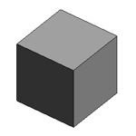
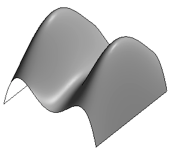
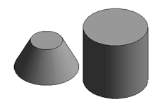

<head>
<meta http-equiv="Content-Type" content="text/html; charset=utf-8">
<link rel="stylesheet" type="text/css" href="bc.css">

<!--

-->
</head>

<!---

- https://forums.autodesk.com/t5/revit-api-forum/draw-render-over-the-activeview/m-p/7088026
  DuplicateGraphics SDK sample

DuplicateGraphics DirectContext3D SDK sample @AutodeskForge #ForgeDevCon #RevitAPI @AutodeskRevit #bim #dynamobim http://bit.ly/2018sdksamples

Revit 2018 SDK sample overview @AutodeskForge #ForgeDevCon #RevitAPI @AutodeskRevit #adsk #aec #bim #dynamobim http://bit.ly/2018sdksamples

The Revit API discussion forum thread on drawing or rendering over the active view brought to my attention that an important new SDK sample created to demonstrate the use of the Revit 2018 functionality <code>DirectContext3D</code> for display of externally managed 3D graphics in Revit is missing in the SDK.
I added it right here, in DuplicateGraphics.zip, and also provide an overview of the new SDK samples
&ndash; CapitalizeAllTextNotes
&ndash; DuplicateGraphics
&ndash; GenericStructuralConnection
&ndash; BRepBuilderExample
&ndash; MultistoryStairs
&ndash; PlacementOptions
&ndash; Structural Analysis CodeCheckingConcreteExample and CalculationPointsSelector
&ndash; REX SDK DRevitFreezeDrawing...

-->

### Revit 2017 and 2018 SDK Samples

The [Revit API discussion forum](http://forums.autodesk.com/t5/revit-api-forum/bd-p/160) thread
on [drawing or rendering over the active view](https://forums.autodesk.com/t5/revit-api-forum/draw-render-over-the-activeview/m-p/7088026) brought
to my attention that an important new SDK sample created to demonstrate the use of the Revit 2018 functionality
[`DirectContext3D` for display of externally managed 3D graphics in Revit](http://thebuildingcoder.typepad.com/blog/2017/04/whats-new-in-the-revit-2018-api.html#3.26) is
missing in the current version of the SDK.

I added it as an attachment to that discussion thread, and am also providing it right here, in [DuplicateGraphics.zip](zip/DuplicateGraphics.zip).

Here is an overview of the new SDK samples added in the past year or two:

- [Revit 2017 and Revit 2017.1 SDK Samples](#2)
- [Revit 2018 SDK Samples](#3)
- [New Samples Overview](#4)
    - [CapitalizeAllTextNotes](#4.1)
    - [DuplicateGraphics](#4.2)
    - [GenericStructuralConnection](#4.3)
    - [BRepBuilderExample](#4.4)
    - [MultistoryStairs](#4.5)
    - [PlacementOptions](#4.6)

#### Revit 2017 and Revit 2017.1 SDK Samples

Here is a repetition of the list
of [new Revit SDK samples added in Revit 2017](http://thebuildingcoder.typepad.com/blog/2016/06/point-boundary-condition-and-revit-2017-sdk.html#2) and
the [REX SDK `DRevitFreezeDrawing` sample](http://thebuildingcoder.typepad.com/blog/2016/10/au-revit-20171-and-rex-freezedrawing.html#5), described in more detail and added in Revit 2017.1:

- Samples/CapitalizeAllTextNotes
- Samples/GenericStructuralConnection
- Samples/GeometryAPI/BRepBuilderExample
- Samples/PlacementOptions
- Structural Analysis SDK/Examples/CodeCheckingConcreteExample and CalculationPointsSelector
- REX SDK/Samples/DRevitFreezeDrawing

#### Revit 2018 SDK Samples

The first customer shipment of the Revit 2018 SDK includes one new sample:

- MultistoryStairs

As mentioned above, another new sample was initially omitted:

- DuplicateGraphics

#### New Samples Overview

For future reference, let's quickly summarise what each one of these does (skipping the structural ones):

- [CapitalizeAllTextNotes](#4.1)
- [DuplicateGraphics](#4.2)
- [GenericStructuralConnection](#4.3)
- [BRepBuilderExample](#4.4)
- [MultistoryStairs](#4.5)
- [PlacementOptions](#4.6)

#### CapitalizeAllTextNotes

Capitalizes all the text of all the TextNotes in the project by formatting the text to use 'AllCaps'.

- Find all `TextNote` instances in the document
- Change the text formatting to 'AllCaps' on the entire range of text.

All TextNotes will have their text formatted to be rendered using upper case characters.

#### DuplicateGraphics

Demonstrate the basic usage of `DirectContext3D`. The external application creates `DirectContext3D` servers that extract geometry from selected Revit elements, encode it in pairs of vertex and index buffers, and submit it for rendering using `DirectContext3D`. This process is triggered using an ExternalCommand and displays the geometry content of selected Revit elements at an offset, so that the graphics appear to be duplicated.

#### GenericStructuralConnection

Demonstrates basic Create, Read, Update and Delete operations on a generic or detailed structural connection.

- Create, Read, Update, Delete generic structural connections.
- Create, change, copy, match properties, reset detailed structural connections.

In detail:

1. Create generic structural connection: A generic structural connection is created for the selected structural elements.
2. Delete generic structural connection: The structural connections should get erased and the former connected elements should be independent.
3. Read generic structural connection information: A dialog displaying connection information should appear on screen.
4. Update generic structural connection information: The structural connection is updated to include the additional selected elements.
5. Create detailed structural connection: A detailed structural connection (clip angle) should be created.
6. Copy detailed structural connection: The structural connection and the connected elements should be copied to another place in the current project.
7. Match properties on a detailed structural connection: The properties of the destination connection should be matched to the source one.
8. Change detailed structural connection: The type and graphic representation of the detailed structural connection should change from 'clip angle' to 'shear plate'.
9. Reset detailed structural connection: The type and graphic representation of the detailed structural connection should change from 'clip angle' to generic

#### BRepBuilderExample

Demonstrate several cases of `BRepBuilder` usage for constructing Revit geometry using API.

- Simple cubical solid

- Nurbs surface (open shell)

- Two solids, truncated cone and cylinder, with periodic face surfaces

The geometry created by `BRepBuilder` is then set in a `DirectShape` element to make it visible in Revit views.

#### MultistoryStairs

MultistoryStairs editing utilities, including creating multistory stairs by a standard stair, adding and removing stairs by picking levels.

- Create a multistory stair by a standard stair.
- Pick some levels to add aligned stairs into the multistory stairs.
- Pick some levels to remove aligned stairs from the multistory stairs.

#### PlacementOptions

This sample demonstrates how to place a family instance via options:

- Place face based family instance via the face, vertical face, or work plane option.
- Place face sketch based family instance via the line, arc, and other sketching options.

The external command `Execute` method shows the options dialog for user to choose the option of placing the family instance.

- OptionsForm.cs implements the dialog for choosing the face based family instance or sketch based family instance.
- FacebasedForm.cs implements the dialog for setting the `FaceBasedPlacementType` option for a face based family instance.
- SketchbasedForm.cs implements the dialog for setting the `SketchGalleryOptions` option for a face based family instance.

I hope you find this overview inspiring and useful and encourage you to explore further yourself.

Have fun!